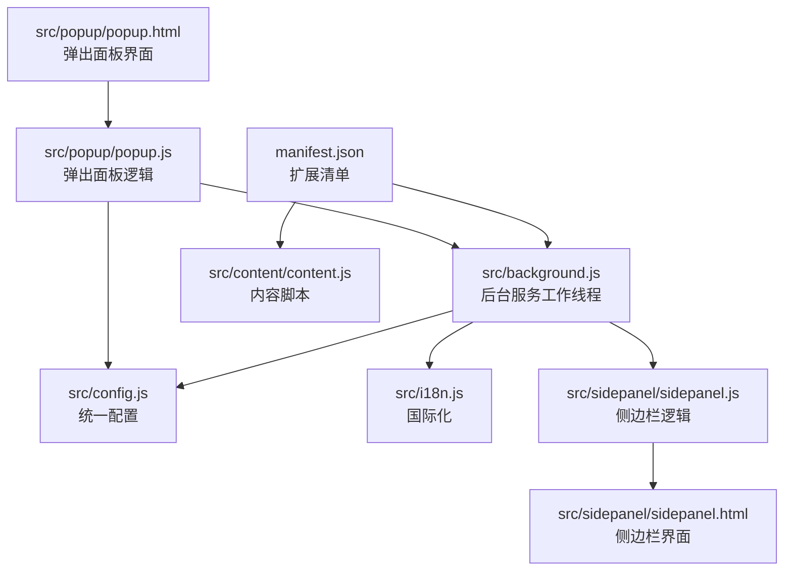
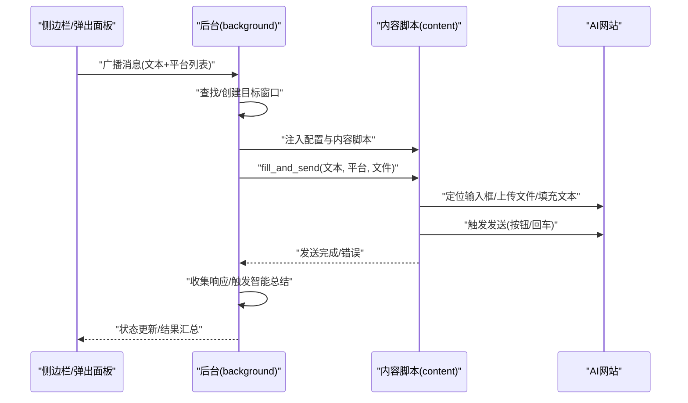
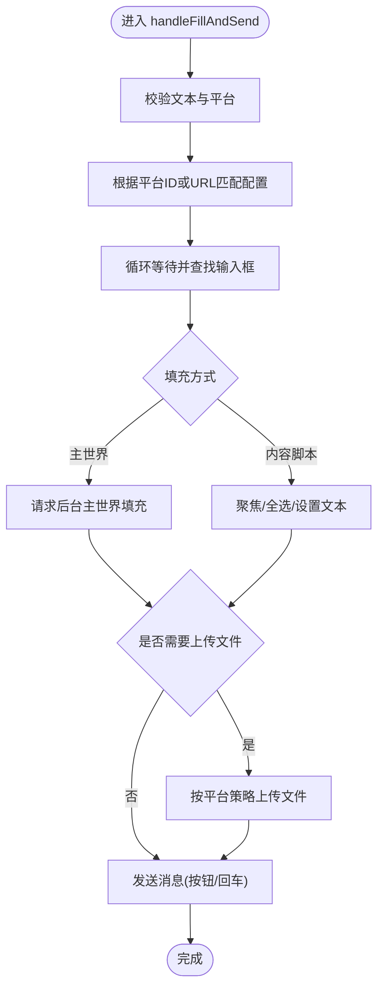
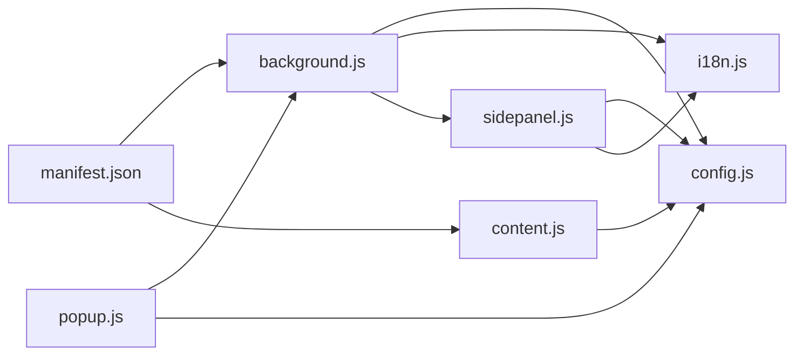

# AI平台集成

<cite>
**本文引用的文件**
- [README.md](file://README.md)
- [manifest.json](file://manifest.json)
- [src/config.js](file://src/config.js)
- [src/background.js](file://src/background.js)
- [src/content/content.js](file://src/content/content.js)
- [src/i18n.js](file://src/i18n.js)
- [src/popup/popup.html](file://src/popup/popup.html)
- [src/popup/popup.js](file://src/popup/popup.js)
- [src/sidepanel/sidepanel.html](file://src/sidepanel/sidepanel.html)
- [src/sidepanel/sidepanel.js](file://src/sidepanel/sidepanel.js)
- [CONTRIBUTING.md](file://CONTRIBUTING.md)
- [DRAG_DROP_IMPLEMENTATION.md](file://DRAG_DROP_IMPLEMENTATION.md)
- [SUMMARIZATION_REDESIGN_v1.7.8.md](file://SUMMARIZATION_REDESIGN_v1.7.8.md)
</cite>

## 目录
1. [简介](#简介)
2. [项目结构](#项目结构)
3. [核心组件](#核心组件)
4. [架构总览](#架构总览)
5. [详细组件分析](#详细组件分析)
6. [依赖关系分析](#依赖关系分析)
7. [性能考虑](#性能考虑)
8. [故障排除指南](#故障排除指南)
9. [结论](#结论)
10. [附录](#附录)

## 简介
本项目是一个Chrome扩展，旨在统一接入多家AI平台（Gemini、Grok、Kimi、DeepSeek、ChatGPT、通义千问、腾讯元宝），提供“一次输入、多平台广播”的能力。其核心设计理念包括：
- 配置接口标准化：通过统一的配置对象集中管理各平台的选择器、发送方式、文件支持等。
- 选择器规范化：为每个平台定义稳定的DOM选择器集合，确保跨页面结构变化的稳定性。
- 发送方法抽象化：通过统一的发送流程封装不同平台的输入填充与提交策略。

此外，项目还提供了拖拽文件上传、智能总结（自动触发）、国际化、主题切换、窗口布局等功能，便于用户高效地在多AI之间进行对比与协作。

## 项目结构
项目采用“最小化构建”的前端架构，核心文件分布如下：
- manifest.json：扩展清单，声明权限、内容脚本匹配域、后台脚本等。
- src/config.js：统一的AI平台配置中心，包含各平台的域名、基础URL、选择器、发送/填充策略、文件支持等。
- src/background.js：后台服务工作线程，负责窗口管理、消息分发、脚本注入、响应抓取、智能总结触发等。
- src/content/content.js：内容脚本，注入到各AI网页，负责输入填充、文件上传、响应提取、选择器诊断等。
- src/i18n.js：国际化模块，提供中英双语文案与日期时间格式化。
- src/popup/*：弹出面板（轻量交互入口）。
- src/sidepanel/*：侧边栏面板（主要交互界面，含拖拽上传、智能总结、历史记录等）。
- 文档：CONTRIBUTING.md（新增平台集成指南）、DRAG_DROP_IMPLEMENTATION.md（拖拽上传实现）、SUMMARIZATION_REDESIGN_v1.7.8.md（智能总结重新设计）。

图表来源
- [manifest.json](file://manifest.json#L1-L79)
- [src/background.js](file://src/background.js#L1-L120)
- [src/config.js](file://src/config.js#L1-L204)
- [src/content/content.js](file://src/content/content.js#L1-L120)
- [src/i18n.js](file://src/i18n.js#L1-L60)
- [src/sidepanel/sidepanel.js](file://src/sidepanel/sidepanel.js#L1-L120)
- [src/sidepanel/sidepanel.html](file://src/sidepanel/sidepanel.html#L1-L120)
- [src/popup/popup.js](file://src/popup/popup.js#L1-L61)
- [src/popup/popup.html](file://src/popup/popup.html#L1-L50)

章节来源
- [README.md](file://README.md#L20-L79)
- [manifest.json](file://manifest.json#L1-L79)

## 核心组件
- 统一配置中心（AI_CONFIG）：集中定义各平台的域名匹配、基础URL、输入/按钮/响应选择器、文件上传入口、填充方式（主世界/内容脚本）、发送方式（按钮/回车/表单）、文件支持与类型等。
- 后台服务（background）：负责窗口发现/创建、内容脚本注入、消息路由、响应提取、智能总结触发、窗口平铺、关闭控制等。
- 内容脚本（content）：在目标AI页面执行，负责输入填充（主世界/内容脚本两种策略）、文件上传、响应提取、选择器诊断、输入等待与重试、发送按键策略等。
- 侧边栏界面（sidepanel）：提供拖拽上传、历史记录、响应展示、智能总结设置与触发、主题/语言切换、窗口操作等。
- 弹出面板（popup）：轻量入口，快速勾选平台并发送消息。
- 国际化（i18n）：提供中英双语文案与本地化格式化。

章节来源
- [src/config.js](file://src/config.js#L5-L199)
- [src/background.js](file://src/background.js#L133-L197)
- [src/content/content.js](file://src/content/content.js#L199-L418)
- [src/sidepanel/sidepanel.js](file://src/sidepanel/sidepanel.js#L41-L120)
- [src/popup/popup.js](file://src/popup/popup.js#L1-L61)
- [src/i18n.js](file://src/i18n.js#L6-L346)

## 架构总览
整体架构分为三层：
- 扩展层：manifest声明权限与匹配域，注册后台与内容脚本。
- 控制层：background负责调度与协调，维护窗口映射、消息队列、状态机。
- 执行层：content在目标站点注入，执行DOM操作与数据提取。

图表来源
- [src/background.js](file://src/background.js#L138-L197)
- [src/background.js](file://src/background.js#L718-L786)
- [src/content/content.js](file://src/content/content.js#L200-L216)
- [src/content/content.js](file://src/content/content.js#L322-L418)

## 详细组件分析

### 统一配置中心（AI_CONFIG）
- 设计要点
  - 平台键名作为唯一标识，贯穿后台与内容脚本。
  - urlPattern/urlPatterns/urlPatternAlt用于精确匹配目标站点，支持多域名。
  - selectors.input/button/response/fileUpload*定义DOM选择器集合，提高鲁棒性。
  - fillMethod/sendMethod抽象不同平台的输入填充与发送策略。
  - supportsFiles/supportedFileTypes统一文件支持策略。
- 平台覆盖
  - Gemini、Grok、Kimi、DeepSeek、ChatGPT、通义千问、腾讯元宝均在配置中明确声明。
- 选择器策略
  - 输入框：优先使用可编辑容器或textarea，兼容React/富文本编辑器。
  - 发送按钮：优先使用aria-label/role属性，其次使用可见的按钮容器。
  - 响应区域：使用最近一条消息容器，必要时回退到通用markdown容器。
- 文件支持
  - 各平台提供fileUploadButton/fileUploadInput选择器，配合过滤与上传流程。

章节来源
- [src/config.js](file://src/config.js#L5-L199)

### 后台服务（background）
- 窗口管理
  - 记录providerWindows映射，支持窗口发现、创建、平铺、关闭。
  - 通过URL模式匹配与历史映射，尽量复用已有窗口。
- 消息分发
  - 接收广播、平铺、启动、关闭、诊断、响应提取、智能总结等动作。
  - 并行处理多个平台，聚合结果。
- 内容脚本注入
  - 通过ensureContentScript检测与注入，确保配置与内容脚本可用。
- 主世界填充
  - executeMainWorldFill在MAIN世界执行，绕过React等框架的限制，适配复杂编辑器。
- 智能总结
  - handleSummarizeResponses根据指定模型发起总结流程，等待目标窗口加载并发送提示词。

章节来源
- [src/background.js](file://src/background.js#L133-L197)
- [src/background.js](file://src/background.js#L270-L296)
- [src/background.js](file://src/background.js#L298-L376)
- [src/background.js](file://src/background.js#L378-L526)
- [src/background.js](file://src/background.js#L527-L643)
- [src/background.js](file://src/background.js#L656-L716)
- [src/background.js](file://src/background.js#L718-L786)

### 内容脚本（content）
- 输入填充
  - requestMainWorldFill：请求后台在主世界执行填充，适合复杂编辑器。
  - fillContentEditable：纯内容脚本方式，聚焦/全选/删除/设置文本，适用于简单输入框。
- 发送策略
  - sendMessage：根据平台特性选择按钮点击或回车键，支持禁用态检测与回退策略。
  - 异步UI平台（DeepSeek/Qwen）采用较长等待间隔与回退逻辑，避免按钮未激活导致失败。
- 响应提取
  - extractLatestResponse：按顺序尝试配置中的响应选择器，取最后一条有效内容；支持去除思维过程块。
  - removeThinkingBlocks/filterThinkingText：针对特定平台（如Yuanbao）移除思维/推理区块。
- 诊断工具
  - diagnoseSelectors：扫描响应选择器有效性，输出最佳选择器与长度。
- 文件上传
  - uploadFiles：按平台策略上传，支持重试与超时控制；按配置过滤文件类型。

图表来源
- [src/content/content.js](file://src/content/content.js#L322-L418)
- [src/content/content.js](file://src/content/content.js#L465-L565)
- [src/content/content.js](file://src/content/content.js#L593-L742)

章节来源
- [src/content/content.js](file://src/content/content.js#L199-L321)
- [src/content/content.js](file://src/content/content.js#L322-L418)
- [src/content/content.js](file://src/content/content.js#L465-L565)
- [src/content/content.js](file://src/content/content.js#L593-L742)
- [src/content/content.js](file://src/content/content.js#L744-L941)

### 侧边栏与弹出面板
- 侧边栏（sidepanel）
  - 提供拖拽上传、历史记录、响应展示、智能总结设置与触发、主题/语言切换、窗口操作等。
  - 拖拽上传：监听dragenter/dragover/dragleave/drop，显示覆盖层，验证文件大小与总数，读取为DataURL并渲染预览。
  - 智能总结：自动检测所有响应完成后触发，通过后台向指定模型窗口发送总结提示词。
- 弹出面板（popup）
  - 轻量入口，勾选平台后发送消息，接收后台状态更新。

章节来源
- [src/sidepanel/sidepanel.html](file://src/sidepanel/sidepanel.html#L1-L400)
- [src/sidepanel/sidepanel.js](file://src/sidepanel/sidepanel.js#L41-L120)
- [src/sidepanel/sidepanel.js](file://src/sidepanel/sidepanel.js#L409-L495)
- [src/sidepanel/sidepanel.js](file://src/sidepanel/sidepanel.js#L508-L528)
- [src/sidepanel/sidepanel.js](file://src/sidepanel/sidepanel.js#L530-L641)
- [src/popup/popup.html](file://src/popup/popup.html#L1-L50)
- [src/popup/popup.js](file://src/popup/popup.js#L1-L61)

### 国际化（i18n）
- 提供中英双语文案，支持变量替换与日期时间格式化。
- 与UI组件结合，动态更新文案与标题。

章节来源
- [src/i18n.js](file://src/i18n.js#L6-L346)

### 拖拽上传实现
- HTML/CSS：在chat-section中添加拖拽覆盖层与高亮样式。
- JS：阻止默认拖拽行为、高亮区域、处理drop事件、验证文件大小与总数、读取文件并渲染预览。
- i18n：提供中英文提示文案。

章节来源
- [DRAG_DROP_IMPLEMENTATION.md](file://DRAG_DROP_IMPLEMENTATION.md#L1-L161)
- [src/sidepanel/sidepanel.js](file://src/sidepanel/sidepanel.js#L409-L495)

### 智能总结重新设计
- 自动触发：当所有选中平台完成响应且至少有一个成功响应时，自动发起总结。
- 会话历史：在历史中显示加载动画、成功/失败消息，避免用户手动点击。
- 设置持久化：总结模型与提示词保存在本地存储。

章节来源
- [SUMMARIZATION_REDESIGN_v1.7.8.md](file://SUMMARIZATION_REDESIGN_v1.7.8.md#L1-L262)
- [src/sidepanel/sidepanel.js](file://src/sidepanel/sidepanel.js#L530-L641)

## 依赖关系分析
- manifest.json声明host_permissions与content_scripts.matches，确保后台与内容脚本可访问各AI站点。
- background依赖AI_CONFIG进行平台识别与窗口管理；依赖i18n进行状态文案。
- content依赖AI_CONFIG进行选择器与策略决策；依赖i18n进行错误提示。
- sidepanel依赖i18n与AI_CONFIG进行UI渲染与平台选择；依赖background进行窗口与响应管理。
- popup依赖AI_CONFIG与background进行平台选择与消息广播。

图表来源
- [manifest.json](file://manifest.json#L19-L68)
- [src/background.js](file://src/background.js#L69-L74)
- [src/config.js](file://src/config.js#L1-L204)
- [src/i18n.js](file://src/i18n.js#L1-L60)
- [src/sidepanel/sidepanel.js](file://src/sidepanel/sidepanel.js#L1-L120)
- [src/popup/popup.js](file://src/popup/popup.js#L1-L61)
- [src/content/content.js](file://src/content/content.js#L1-L120)

章节来源
- [manifest.json](file://manifest.json#L19-L68)
- [src/background.js](file://src/background.js#L69-L74)

## 性能考虑
- 并行处理：后台对多个平台的发送与响应提取采用Promise.allSettled，提升吞吐。
- 注入优化：ensureContentScript先尝试消息通信，失败时再注入脚本，减少不必要的注入成本。
- 等待策略：针对异步UI平台采用较长等待间隔与回退逻辑，避免频繁点击导致的失败重试风暴。
- 选择器优先级：先精确可见元素，再宽松匹配，降低查询成本。
- 文件上传：按平台策略上传，支持重试与超时，避免阻塞主线程。
- UI渲染：Markdown渲染与语法高亮在侧边栏按需初始化，避免全局开销。

## 故障排除指南
- 脚本注入失败
  - 现象：后台提示“脚本注入失败”。
  - 排查：确认manifest的host_permissions与content_scripts.matches包含目标站点；检查ensureContentScript路径与注入顺序。
  - 参考
    - [src/background.js](file://src/background.js#L656-L678)
    - [manifest.json](file://manifest.json#L19-L68)
- 输入框未找到
  - 现象：提示“未找到输入框”。
  - 排查：使用诊断工具（diagnose_selectors）检查响应选择器有效性；核对AI_CONFIG中selectors.input是否正确；确认页面是否加载完成。
  - 参考
    - [src/content/content.js](file://src/content/content.js#L126-L197)
    - [src/content/content.js](file://src/content/content.js#L385-L394)
- 发送按钮不可用
  - 现象：按钮禁用或长时间不可点击。
  - 排查：检查禁用态检测逻辑（aria-disabled/disabled/class）；对异步UI平台采用回退策略（回车）。
  - 参考
    - [src/content/content.js](file://src/content/content.js#L465-L565)
- 响应提取为空
  - 现象：提取不到响应或为空。
  - 排查：确认AI_CONFIG中selectors.response配置；尝试回退到通用选择器；检查removeThinkingBlocks是否误删内容。
  - 参考
    - [src/content/content.js](file://src/content/content.js#L218-L320)
- 文件上传失败
  - 现象：文件无法上传或超时。
  - 排查：确认supportsFiles与supportedFileTypes；检查平台上传策略；增大超时或重试次数。
  - 参考
    - [src/content/content.js](file://src/content/content.js#L593-L742)
    - [src/content/content.js](file://src/content/content.js#L744-L941)

章节来源
- [src/background.js](file://src/background.js#L656-L678)
- [src/content/content.js](file://src/content/content.js#L126-L197)
- [src/content/content.js](file://src/content/content.js#L218-L320)
- [src/content/content.js](file://src/content/content.js#L465-L565)
- [src/content/content.js](file://src/content/content.js#L593-L742)
- [src/content/content.js](file://src/content/content.js#L744-L941)

## 结论
本项目通过“统一配置中心 + 后台调度 + 内容脚本执行”的架构，实现了对多家AI平台的标准化接入。其核心优势在于：
- 配置即插即用：新增平台只需完善AI_CONFIG与manifest。
- 选择器与策略抽象：屏蔽平台差异，提升稳定性。
- 丰富的交互与工具：拖拽上传、智能总结、国际化、主题切换等，提升用户体验。
建议在后续版本中进一步完善：
- 总结结果直接显示与历史记录；
- 自定义触发条件与质量评分；
- 更细粒度的错误恢复与重试策略。

## 附录

### 平台选择器配置与发送方法
- 选择器
  - input：输入框或可编辑容器。
  - button：发送按钮或可点击容器。
  - response：最近一条AI响应容器。
  - fileUploadButton/fileUploadInput：文件上传入口。
- 发送方法
  - button：点击发送按钮。
  - enter：按下回车键。
  - form：请求表单提交。
- 填充方法
  - main-world：在主世界执行，绕过React等框架。
  - content-script：在内容脚本中直接操作DOM。

章节来源
- [src/config.js](file://src/config.js#L5-L199)
- [src/content/content.js](file://src/content/content.js#L465-L565)

### 新平台集成指南
- 步骤
  - 在AI_CONFIG中新增平台条目，填写name、icon、urlPattern、baseUrl、selectors、fillMethod、sendMethod、supportsFiles、supportedFileTypes等。
  - 在manifest.json中添加host_permissions与content_scripts.matches。
  - 在侧边栏界面添加图标与选择器。
  - 测试发送、响应提取、文件上传与智能总结。
- 参考
  - [CONTRIBUTING.md](file://CONTRIBUTING.md#L5-L43)
  - [src/config.js](file://src/config.js#L5-L199)
  - [manifest.json](file://manifest.json#L19-L68)
  - [src/sidepanel/sidepanel.html](file://src/sidepanel/sidepanel.html#L183-L246)