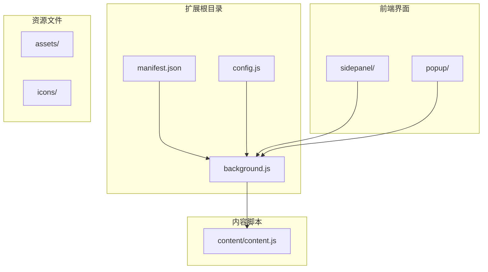
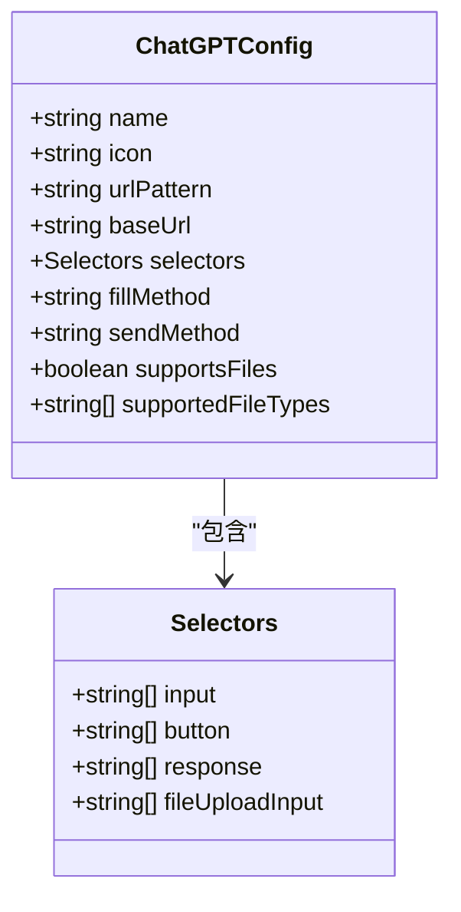
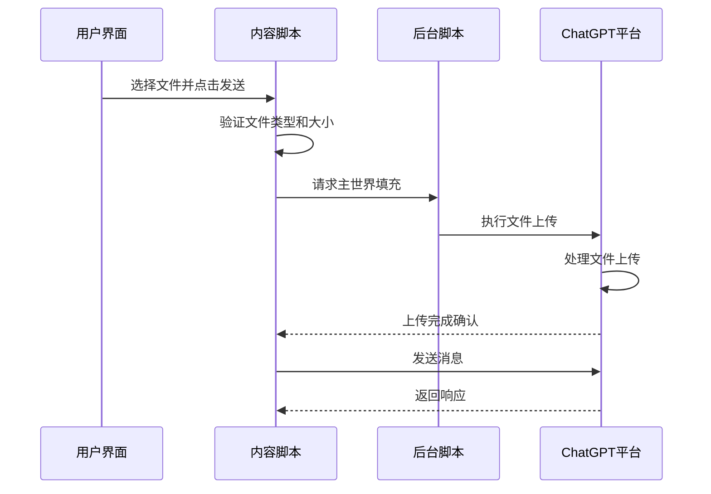
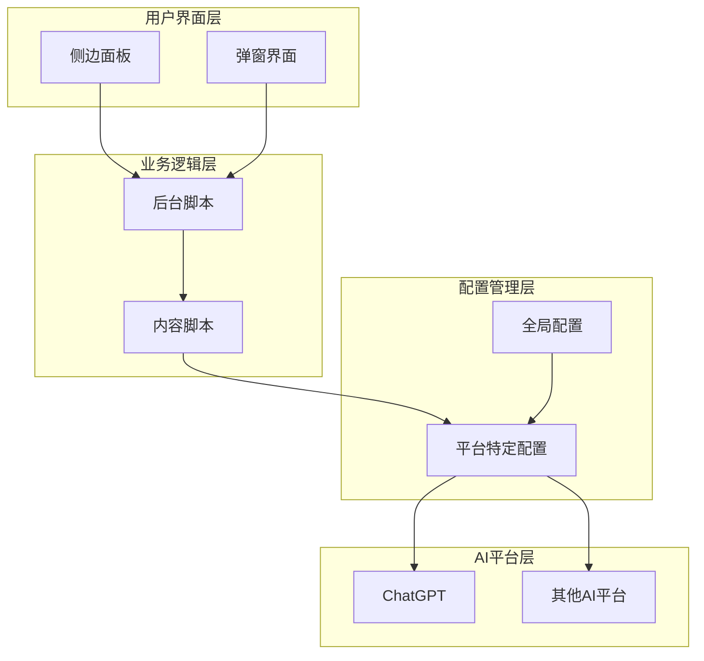
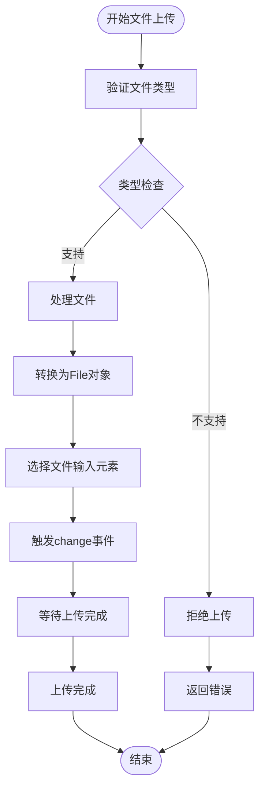
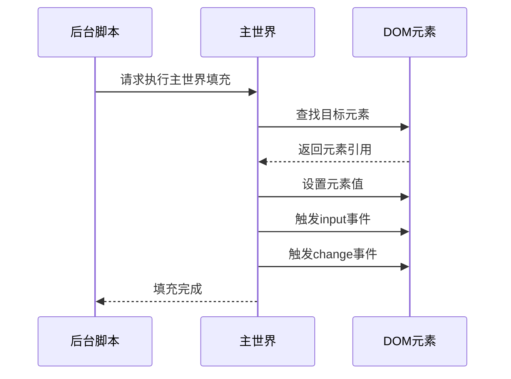
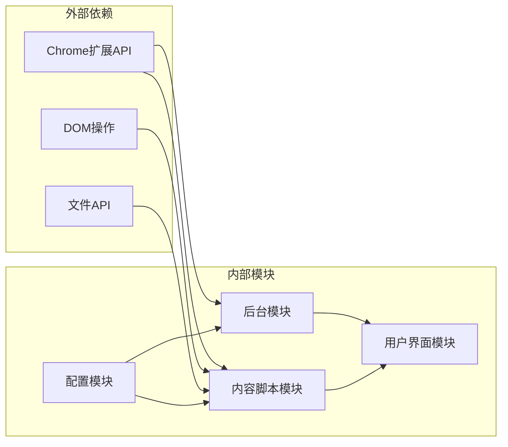

# ChatGPT平台集成

<cite>
**本文档引用的文件**
- [manifest.json](file://manifest.json)
- [config.js](file://src/config.js)
- [background.js](file://src/background.js)
- [content.js](file://src/content/content.js)
- [sidepanel.js](file://src/sidepanel/sidepanel.js)
- [popup.js](file://src/popup/popup.js)
- [sidepanel.html](file://src/sidepanel/sidepanel.html)
- [popup.html](file://src/popup/popup.html)
- [sidepanel.css](file://src/sidepanel/sidepanel.css)
- [popup.css](file://src/popup/popup.css)
- [README.md](file://README.md)
</cite>

## 目录
1. [简介](#简介)
2. [项目结构](#项目结构)
3. [核心组件](#核心组件)
4. [架构概览](#架构概览)
5. [详细组件分析](#详细组件分析)
6. [依赖关系分析](#依赖关系分析)
7. [性能考虑](#性能考虑)
8. [故障排除指南](#故障排除指南)
9. [结论](#结论)

## 简介

AI Multiverse Chat 是一个Chrome扩展程序，允许用户同时向多个AI聊天机器人发送消息。该项目特别专注于ChatGPT平台的深度集成，提供了简洁高效的配置实现和强大的文件上传支持机制。

本项目采用轻量级的原生JavaScript、HTML和CSS构建，无需构建工具，保持了项目的简单性和可维护性。支持多种AI平台，包括Gemini、Grok、Kimi、DeepSeek、ChatGPT、Qwen和Yuanbao等。

## 项目结构

项目采用模块化架构设计，主要包含以下核心目录和文件：

**图表来源**
- [manifest.json](file://manifest.json#L1-L79)
- [config.js](file://src/config.js#L1-L204)

**章节来源**
- [README.md](file://README.md#L20-L29)
- [manifest.json](file://manifest.json#L1-L79)

## 核心组件

### ChatGPT配置配置

ChatGPT平台的配置实现了简洁而高效的结构设计，包含了完整的输入框、发送按钮和响应内容选择器配置：

**图表来源**
- [config.js](file://src/config.js#L94-L109)

### 文件上传支持机制

项目实现了统一的文件上传支持机制，针对不同平台提供专门的上传策略：

**图表来源**
- [content.js](file://src/content/content.js#L616-L809)
- [background.js](file://src/background.js#L378-L526)

**章节来源**
- [config.js](file://src/config.js#L94-L109)
- [content.js](file://src/content/content.js#L593-L809)

## 架构概览

系统采用分层架构设计，确保各组件之间的松耦合和高内聚：

**图表来源**
- [background.js](file://src/background.js#L1-L100)
- [content.js](file://src/content/content.js#L1-L50)
- [config.js](file://src/config.js#L1-L50)

## 详细组件分析

### ChatGPT输入框配置

ChatGPT平台的输入框配置经过精心设计，确保能够准确识别和操作输入元素：

| 配置项 | 值 | 描述 |
|--------|-----|------|
| 输入框选择器 | `['div#prompt-textarea', 'div[contenteditable="true"]']` | 支持主要的prompt输入框和contenteditable编辑器 |
| 发送按钮选择器 | `['button[data-testid="send-button"]', 'button[aria-label="Send prompt"]']` | 精确匹配ChatGPT的发送按钮 |
| 响应内容选择器 | `['div[data-message-author-role="assistant"] .markdown']` | 准确提取AI助手的回复内容 |
| 文件上传输入 | `['input[type="file"]']` | 支持文件上传功能 |

### 文件上传处理流程

文件上传机制实现了多平台兼容性和错误处理：

**图表来源**
- [content.js](file://src/content/content.js#L616-L742)

### 主世界填充机制

为了确保与ChatGPT的深度集成，系统采用了主世界填充策略：

**图表来源**
- [background.js](file://src/background.js#L378-L526)

**章节来源**
- [config.js](file://src/config.js#L94-L109)
- [content.js](file://src/content/content.js#L616-L809)
- [background.js](file://src/background.js#L378-L526)

## 依赖关系分析

系统的核心依赖关系如下：

**图表来源**
- [manifest.json](file://manifest.json#L12-L18)
- [background.js](file://src/background.js#L69-L74)

**章节来源**
- [manifest.json](file://manifest.json#L12-L18)
- [background.js](file://src/background.js#L69-L74)

## 性能考虑

### 优化策略

1. **延迟加载**: 内容脚本仅在需要时加载，减少不必要的资源消耗
2. **选择器缓存**: 配置中的选择器经过优化，提高查找效率
3. **异步处理**: 文件上传和消息发送采用异步方式，避免阻塞主线程
4. **重试机制**: 实现指数退避重试，提高网络请求的成功率

### 内存管理

- 及时清理DOM事件监听器
- 合理使用Promise和async/await避免内存泄漏
- 控制日志输出，避免大量数据占用内存

## 故障排除指南

### 常见问题及解决方案

1. **输入框未找到**
   - 检查选择器配置是否正确
   - 确认页面DOM结构是否发生变化
   - 使用调试工具验证元素是否存在

2. **文件上传失败**
   - 验证文件类型是否在支持列表中
   - 检查文件大小限制
   - 确认网络连接状态

3. **发送按钮无法点击**
   - 检查按钮是否处于禁用状态
   - 验证按钮选择器的准确性
   - 确认页面是否有其他交互阻止

### 调试方法

1. **启用详细日志**: 在控制台查看详细的执行日志
2. **使用开发者工具**: 检查元素选择器和事件绑定
3. **测试独立功能**: 分别测试输入、发送和文件上传功能

**章节来源**
- [content.js](file://src/content/content.js#L126-L197)
- [background.js](file://src/background.js#L138-L197)

## 结论

ChatGPT平台集成为AI Multiverse Chat项目的核心亮点，通过精心设计的配置结构和高效的集成策略，实现了稳定可靠的跨平台消息发送功能。

### 主要优势

1. **简洁的配置结构**: 采用统一的配置格式，便于维护和扩展
2. **高效的集成策略**: 通过主世界填充和事件驱动的方式实现深度集成
3. **强大的文件上传支持**: 支持多种文件格式，提供完善的错误处理机制
4. **稳定的性能表现**: 通过异步处理和重试机制确保系统的可靠性

### 技术特色

- **模块化设计**: 各组件职责明确，便于单独测试和维护
- **错误处理**: 完善的异常捕获和错误恢复机制
- **性能优化**: 采用多种优化策略确保良好的用户体验
- **兼容性强**: 支持多种浏览器和操作系统环境

该项目为AI平台集成提供了一个优秀的参考实现，其设计理念和实现方案值得其他类似项目借鉴和学习。