# DeepSeek平台集成

<cite>
**本文档引用的文件**
- [manifest.json](file://manifest.json)
- [config.js](file://src/config.js)
- [background.js](file://src/background.js)
- [content.js](file://src/content/content.js)
- [sidepanel.js](file://src/sidepanel/sidepanel.js)
- [README.md](file://README.md)
- [tmp_content_part1.js](file://tmp_content_part1.js)
</cite>

## 目录
1. [简介](#简介)
2. [项目结构](#项目结构)
3. [核心组件](#核心组件)
4. [架构概览](#架构概览)
5. [详细组件分析](#详细组件分析)
6. [依赖关系分析](#依赖关系分析)
7. [性能考虑](#性能考虑)
8. [故障排除指南](#故障排除指南)
9. [结论](#结论)

## 简介

AI Multiverse Chat 是一个Chrome扩展程序，支持同时向多个AI聊天平台发送消息。本文档专注于DeepSeek平台的集成实现，深入分析其配置设计、发送机制和最佳实践。

DeepSeek作为主要支持的AI平台之一，具有独特的界面设计和交互模式。该集成实现了稳定的文本输入填充、智能的发送按钮检测以及可靠的响应内容提取功能。

## 项目结构

该项目采用模块化架构设计，核心文件组织如下：

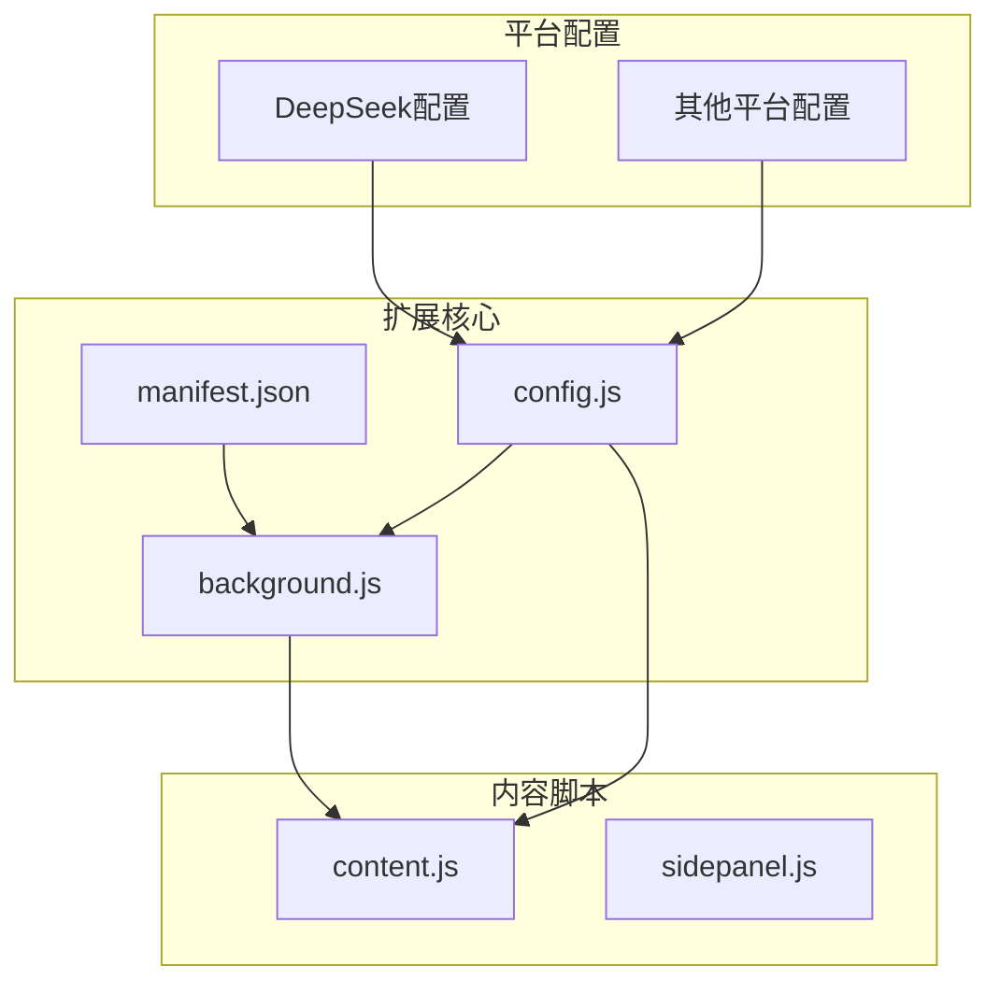

**图表来源**
- [manifest.json](file://manifest.json#L1-L79)
- [config.js](file://src/config.js#L1-L204)
- [background.js](file://src/background.js#L1-L1028)

**章节来源**
- [manifest.json](file://manifest.json#L1-L79)
- [README.md](file://README.md#L1-L107)

## 核心组件

### DeepSeek平台配置

DeepSeek平台在全局配置中具有专门的配置对象，包含完整的平台信息和选择器定义：

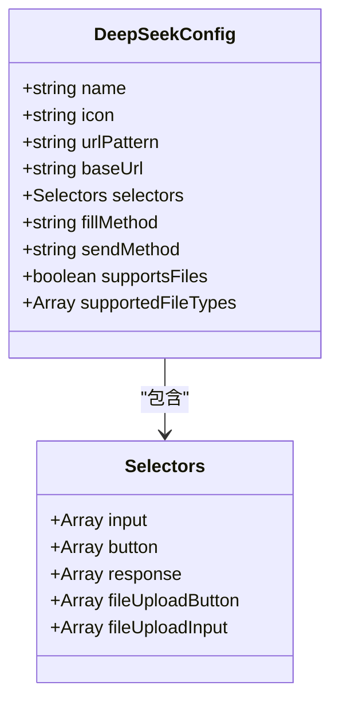

**图表来源**
- [config.js](file://src/config.js#L76-L93)

DeepSeek配置的关键特性：
- **输入框选择器**: `['textarea#chat-input', 'textarea[placeholder*="DeepSeek"]', 'textarea']`
- **发送按钮选择器**: `['div.ds-send-button', 'button[aria-label="Send message"]', 'div[role="button"]:has(svg path[d*="M16.5"])']`
- **响应内容选择器**: `['div.ds-markdown', '.ds-render-content']`
- **文件上传选择器**: `['button[aria-label*="image"]', 'button[aria-label*="图片"]', 'button[title*="image"]']`

**章节来源**
- [config.js](file://src/config.js#L76-L93)

### 发送方法配置分析

DeepSeek平台的发送方法配置为'enter'，这一决策基于以下考虑：

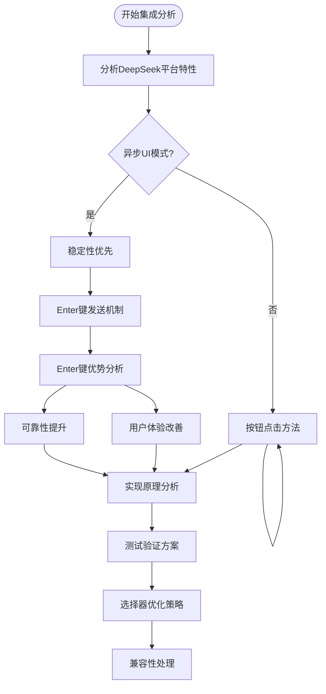

**图表来源**
- [config.js](file://src/config.js#L88-L90)

## 架构概览

DeepSeek集成采用分层架构设计，确保各组件职责明确：

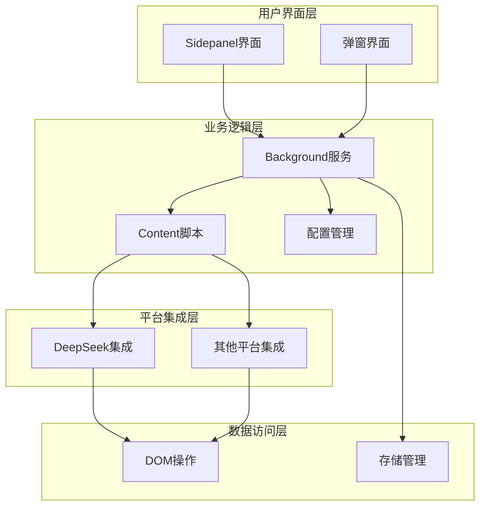

**图表来源**
- [background.js](file://src/background.js#L1-L1028)
- [content.js](file://src/content/content.js#L1-L941)
- [config.js](file://src/config.js#L1-L204)

## 详细组件分析

### DeepSeek发送机制实现

DeepSeek平台采用Enter键发送机制，这一设计解决了异步UI环境下的稳定性问题：

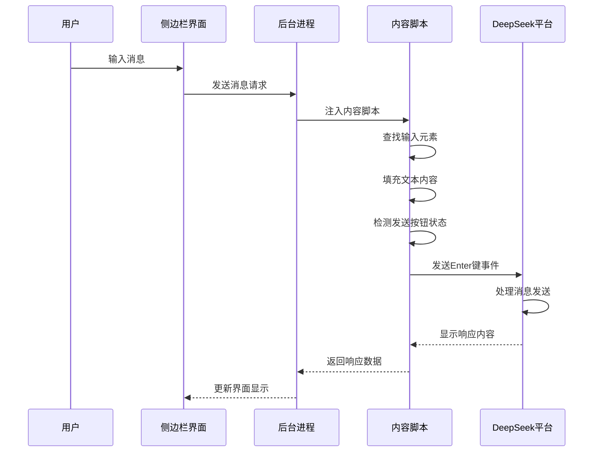

**图表来源**
- [background.js](file://src/background.js#L718-L786)
- [content.js](file://src/content/content.js#L466-L565)

### Enter键发送机制优势

Enter键发送机制相比传统按钮点击具有以下优势：

#### 稳定性提升

1. **事件驱动可靠性**: Enter键事件由浏览器内核直接处理，避免第三方JavaScript库干扰
2. **跨框架兼容性**: 适用于各种前端框架和动态内容加载场景
3. **异步UI适配**: 在DeepSeek等异步渲染环境中表现稳定

#### 用户体验改善

1. **自然交互模式**: 符合用户的键盘输入习惯
2. **减少误触风险**: 避免按钮状态变化导致的误点击
3. **提升操作效率**: 一键完成输入和发送操作

**章节来源**
- [content.js](file://src/content/content.js#L526-L565)

### 输入框选择器优化

DeepSeek输入框选择器经过精心设计，确保在各种场景下都能准确定位：

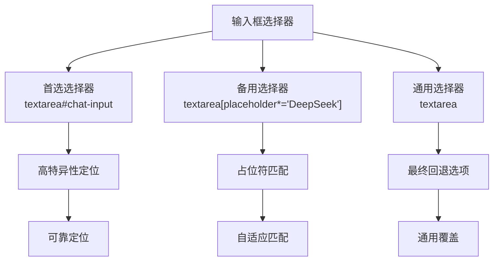

**图表来源**
- [config.js](file://src/config.js#L82-L82)

### 发送按钮检测算法

DeepSeek发送按钮检测采用多阶段搜索策略：

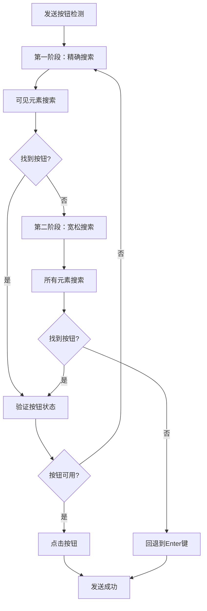

**图表来源**
- [content.js](file://src/content/content.js#L471-L524)

**章节来源**
- [content.js](file://src/content/content.js#L466-L565)

### 响应内容提取机制

DeepSeek响应内容提取采用智能选择器策略：

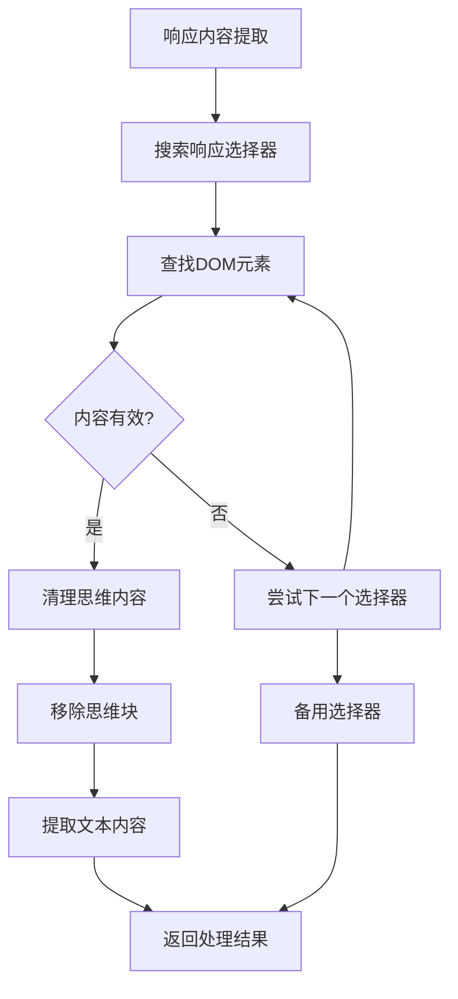

**图表来源**
- [content.js](file://src/content/content.js#L219-L320)

**章节来源**
- [content.js](file://src/content/content.js#L219-L320)

## 依赖关系分析

### 平台依赖关系

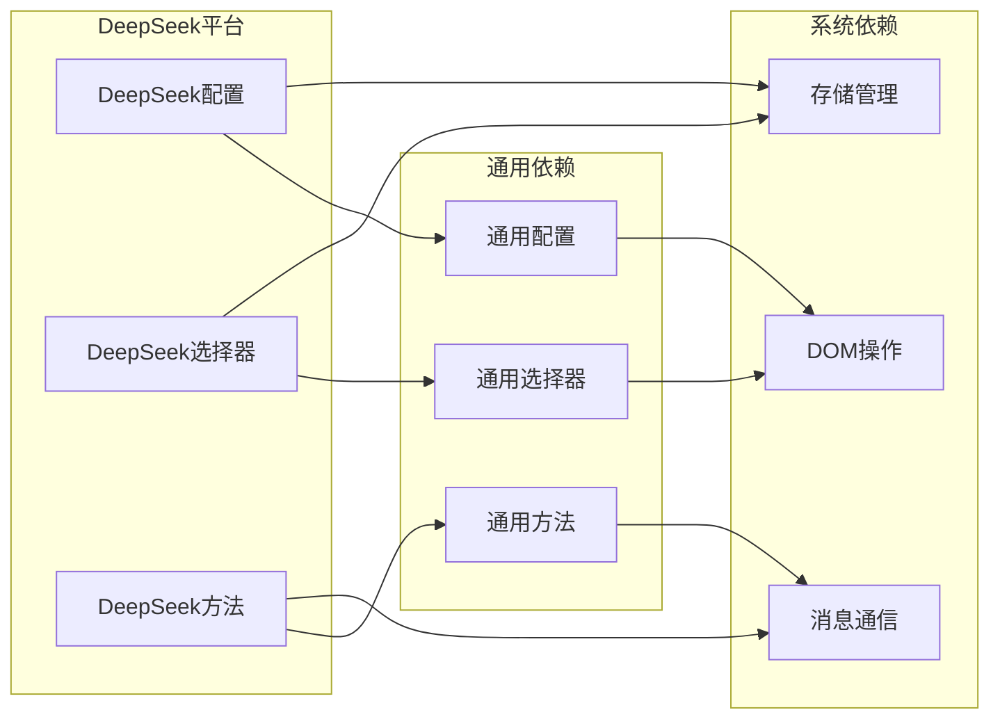

**图表来源**
- [config.js](file://src/config.js#L76-L93)
- [background.js](file://src/background.js#L134-L136)

### 文件上传集成

DeepSeek文件上传功能与整体架构的集成：

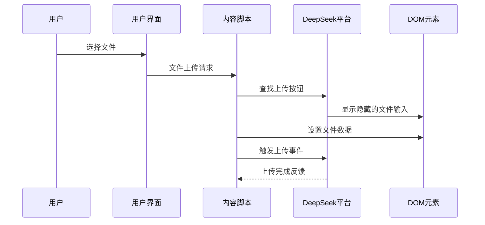

**图表来源**
- [content.js](file://src/content/content.js#L862-L898)

**章节来源**
- [content.js](file://src/content/content.js#L862-L898)

## 性能考虑

### 异步UI优化

DeepSeek作为异步UI平台，采用了专门的性能优化策略：

1. **智能等待机制**: 根据平台特性调整等待时间和轮询间隔
2. **资源竞争避免**: 通过延迟和重试机制避免资源竞争
3. **内存管理**: 及时清理DOM引用和事件监听器

### 选择器性能优化

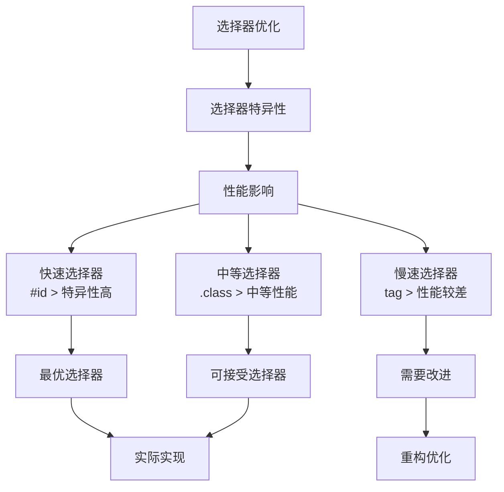

## 故障排除指南

### 常见问题诊断

#### 发送按钮检测失败

**症状**: 消息无法发送，按钮状态异常

**诊断步骤**:
1. 检查网络连接状态
2. 验证DeepSeek平台可用性
3. 确认选择器配置正确
4. 查看浏览器控制台错误信息

**解决方案**:
```javascript
// 检查按钮状态
const button = document.querySelector('div.ds-send-button');
if (button && !button.disabled) {
    button.click();
} else {
    // 回退到Enter键发送
    sendEnterKey(inputElement);
}
```

#### 输入框定位失败

**症状**: 文本无法正确填充到输入框

**诊断步骤**:
1. 验证选择器优先级
2. 检查元素可见性
3. 确认DOM加载完成

**解决方案**:
```javascript
// 多阶段选择器
const selectors = [
    'textarea#chat-input',
    'textarea[placeholder*="DeepSeek"]',
    'textarea'
];

for (const selector of selectors) {
    const element = document.querySelector(selector);
    if (element && element.offsetParent !== null) {
        return element;
    }
}
```

**章节来源**
- [content.js](file://src/content/content.js#L574-L590)

### 调试工具使用

#### 控制台调试命令

```javascript
// 检查DeepSeek配置
console.log('DeepSeek配置:', AI_CONFIG.deepseek);

// 验证选择器
console.log('输入框选择器:', AI_CONFIG.deepseek.selectors.input);
console.log('发送按钮选择器:', AI_CONFIG.deepseek.selectors.button);

// 测试元素定位
const inputElements = document.querySelectorAll(AI_CONFIG.deepseek.selectors.input[0]);
console.log('找到输入框数量:', inputElements.length);
```

#### 日志监控

启用详细的日志输出来跟踪集成过程：

```javascript
// 启用详细日志
console.log('[AI Multiverse DeepSeek] 集成初始化');
console.log('[AI Multiverse DeepSeek] 输入框定位:', inputElement);
console.log('[AI Multiverse DeepSeek] 发送按钮状态:', buttonElement.disabled);
console.log('[AI Multiverse DeepSeek] Enter键发送完成');
```

## 结论

DeepSeek平台集成为AI Multiverse Chat项目提供了重要的功能扩展。通过精心设计的配置架构、稳定的Enter键发送机制和智能的选择器优化策略，该集成实现了高可靠性和优秀的用户体验。

### 主要成就

1. **稳定性保障**: Enter键发送机制有效解决了异步UI环境下的发送稳定性问题
2. **用户体验优化**: 符合用户自然交互习惯，提升了操作效率
3. **兼容性设计**: 多层次选择器确保在各种平台变体中都能正常工作
4. **性能优化**: 智能等待和资源管理策略保证了良好的响应性能

### 未来发展方向

1. **持续优化**: 基于用户反馈进一步优化选择器精度和发送机制
2. **功能扩展**: 支持更多DeepSeek平台特性，如思维链内容过滤
3. **性能提升**: 探索更高效的DOM操作和事件处理机制
4. **兼容性增强**: 扩展对DeepSeek平台新版本的兼容性支持

该DeepSeek集成展示了现代Web扩展开发的最佳实践，为类似平台的集成提供了宝贵的参考经验。