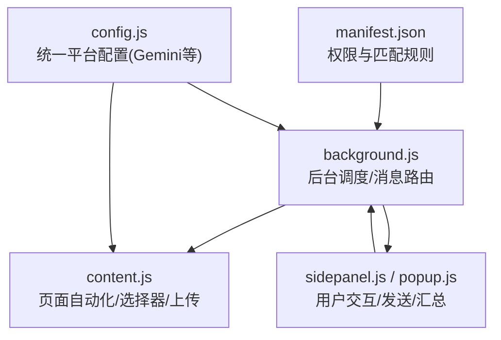
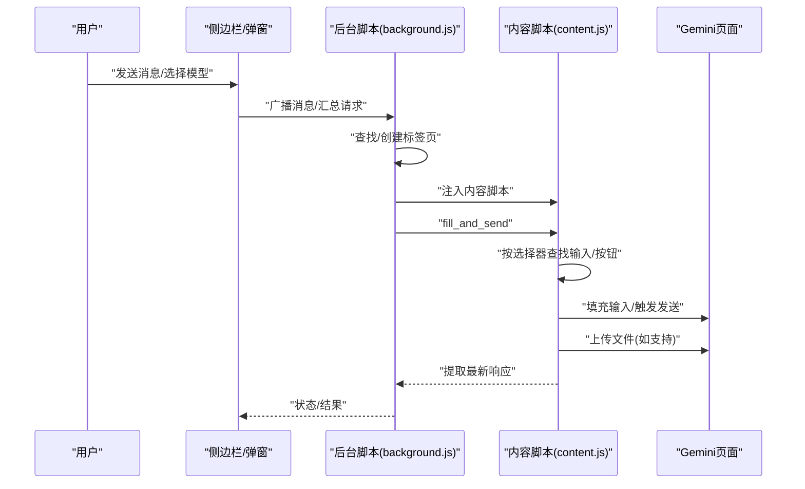
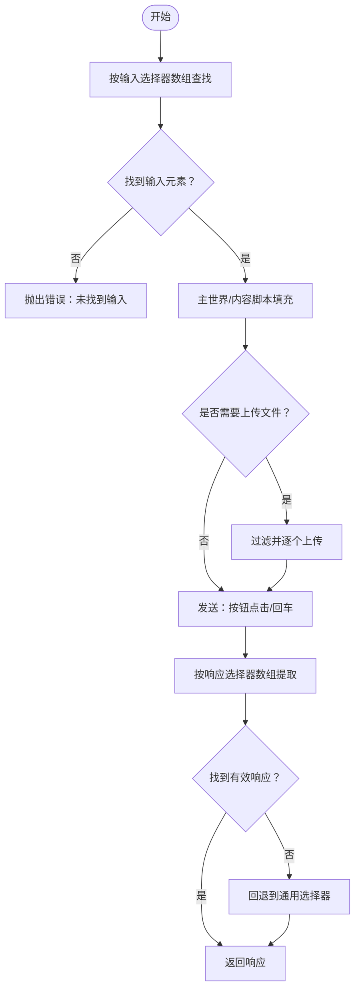
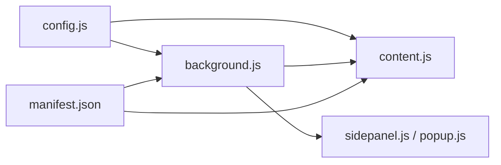

# Gemini平台集成

<cite>
**本文引用的文件**
- [manifest.json](file://manifest.json)
- [config.js](file://src/config.js)
- [background.js](file://src/background.js)
- [content.js](file://src/content/content.js)
- [sidepanel.js](file://src/sidepanel/sidepanel.js)
- [popup.js](file://src/popup/popup.js)
- [sidepanel.html](file://src/sidepanel/sidepanel.html)
- [popup.html](file://src/popup/popup.html)
- [README.md](file://README.md)
- [QUICK_TEST_GUIDE.md](file://QUICK_TEST_GUIDE.md)
- [TESTING_v1.7.md](file://TESTING_v1.7.md)
</cite>

## 目录
1. [简介](#简介)
2. [项目结构](#项目结构)
3. [核心组件](#核心组件)
4. [架构总览](#架构总览)
5. [详细组件分析](#详细组件分析)
6. [依赖关系分析](#依赖关系分析)
7. [性能考量](#性能考量)
8. [故障排查指南](#故障排查指南)
9. [结论](#结论)
10. [附录](#附录)

## 简介
本文件面向需要在AI多重宇宙扩展中集成与优化Gemini平台的工程师与测试人员，系统性解析Gemini的配置实现、选择器策略、文件上传支持、测试验证方法、常见问题排查与性能优化建议，并与其他平台进行差异化对比与最佳实践指导。

## 项目结构
该扩展采用“Manifest V3 + 内容脚本 + 后台脚本 + 侧边栏界面”的分层架构，Gemini作为多平台之一，其配置集中于全局配置模块，由后台脚本与内容脚本协同驱动。

图表来源
- [manifest.json](file://manifest.json#L19-L68)
- [background.js](file://src/background.js#L133-L197)
- [content.js](file://src/content/content.js#L1-L30)
- [config.js](file://src/config.js#L5-L22)

章节来源
- [README.md](file://README.md#L20-L28)
- [manifest.json](file://manifest.json#L19-L68)

## 核心组件
- 全局配置模块：集中定义各平台的URL模式、基础URL、选择器数组、发送方式、文件上传支持与类型等。
- 后台脚本：负责标签页发现/创建、内容脚本注入、消息转发、汇总请求、诊断选择器等。
- 内容脚本：在目标页面内执行自动化，包括输入填充、按钮点击/回车发送、响应提取、文件上传。
- 侧边栏/弹窗界面：提供用户交互入口，发起广播、拉取响应、文件拖拽上传、汇总生成等。

章节来源
- [config.js](file://src/config.js#L5-L22)
- [background.js](file://src/background.js#L133-L197)
- [content.js](file://src/content/content.js#L322-L418)
- [sidepanel.js](file://src/sidepanel/sidepanel.js#L41-L60)

## 架构总览
Gemini集成的关键流程如下：后台脚本根据配置定位/创建目标标签页，注入内容脚本，内容脚本依据配置选择器填充输入、触发发送、提取响应、处理文件上传；后台脚本可进一步发起“汇总响应”请求，内容脚本负责在目标页面内执行。

图表来源
- [background.js](file://src/background.js#L139-L197)
- [content.js](file://src/content/content.js#L322-L418)
- [sidepanel.js](file://src/sidepanel/sidepanel.js#L41-L60)

## 详细组件分析

### Gemini配置与选择器策略
- URL与基础URL
  - URL模式：用于匹配目标域名，便于后台脚本定位标签页。
  - 基础URL：用于新建标签页时的起始地址。
- 选择器数组设计
  - 输入框选择器：提供多层级候选，按优先级依次尝试，确保在DOM结构变化时仍可命中。
  - 发送按钮选择器：同样采用多层级候选，支持role属性、aria-label、类名等，提升稳定性。
  - 响应内容选择器：按“最近一次出现”的元素作为最终响应，若无效则回退到通用选择器。
  - 文件上传：提供上传按钮与文件输入两种路径，增强兼容性。
- 发送方式与填充方式
  - 发送方式：Gemini使用“按钮点击”策略，后台脚本在主世界执行精准填充，内容脚本负责按钮点击与回退。
  - 填充方式：主世界填充，结合React/内容可编辑场景的事件派发，确保输入状态同步。
- 文件上传支持
  - 支持标志：开启文件上传。
  - 支持类型：图像、PDF、文本、Word、Markdown、JSON、CSV等。
  - 上传路径：优先使用隐藏文件输入；若不存在则点击上传按钮后模拟选择文件。

章节来源
- [config.js](file://src/config.js#L6-L22)
- [content.js](file://src/content/content.js#L574-L590)
- [content.js](file://src/content/content.js#L747-L788)

### 选择器策略与fallback机制
- 多层级选择器数组
  - 输入/按钮/响应均采用数组形式，按顺序尝试，命中即停止，兼顾健壮性与性能。
  - 可视性优先：先尝试可见元素，再尝试宽松查询，避免误触隐藏或不可交互元素。
- 响应提取的last-of-type策略
  - 选择器数组命中后，取“最后一个匹配元素”作为最新响应，减少重复与旧内容干扰。
  - 若无有效文本，回退到通用选择器集合，进一步降低失败率。
- 主世界填充与内容脚本填充的协作
  - 主世界填充用于精确写入值并派发事件，内容脚本填充用于复杂编辑器场景（如Tiap/ProseMirror）。
  - Kimi明确禁用主世界填充，避免事件链重复；Gemini采用主世界填充以提升稳定性。

图表来源
- [content.js](file://src/content/content.js#L322-L418)
- [content.js](file://src/content/content.js#L218-L320)

章节来源
- [content.js](file://src/content/content.js#L385-L418)
- [content.js](file://src/content/content.js#L218-L320)

### 文件上传支持配置
- 支持的文件类型
  - 图像、PDF、文本、Word、Markdown、JSON、CSV等。
- 上传识别与实现
  - 优先使用隐藏文件输入，直接设置files并触发change事件。
  - 若无隐藏输入，点击上传按钮后定位临时文件输入，再触发change。
  - 上传过程包含超时与重试控制，保障在网络波动时的稳定性。

章节来源
- [config.js](file://src/config.js#L20-L22)
- [content.js](file://src/content/content.js#L616-L710)
- [content.js](file://src/content/content.js#L747-L788)

### 与后台脚本的交互
- 后台脚本负责：
  - 通过URL模式匹配定位/创建目标标签页。
  - 注入内容脚本，发送fill_and_send消息。
  - 处理“诊断选择器”“汇总响应”等高级功能。
- 内容脚本负责：
  - 执行填充、发送、响应提取、文件上传。
  - 与后台脚本通过消息通道通信，返回状态与结果。

章节来源
- [background.js](file://src/background.js#L139-L197)
- [content.js](file://src/content/content.js#L199-L216)

### 与侧边栏/弹窗界面的集成
- 侧边栏/弹窗提供模型选择、发送、拖拽上传、响应拉取、汇总设置等功能。
- Gemini默认勾选，便于快速测试与集成。

章节来源
- [sidepanel.html](file://src/sidepanel/sidepanel.html#L194-L200)
- [popup.html](file://src/popup/popup.html#L16-L33)

## 依赖关系分析

图表来源
- [config.js](file://src/config.js#L5-L22)
- [background.js](file://src/background.js#L69-L74)
- [manifest.json](file://manifest.json#L45-L68)

章节来源
- [manifest.json](file://manifest.json#L19-L68)
- [background.js](file://src/background.js#L69-L74)

## 性能考量
- 选择器数组的顺序与数量
  - 候选越多，命中概率越高，但也会增加查询成本。建议按“最可能命中”排序，必要时拆分为两段：高频命中 + 低频回退。
- 等待与重试策略
  - 输入/按钮等待采用指数退避与最大重试次数，避免忙轮询造成卡顿。
- 主世界填充 vs 内容脚本填充
  - 主世界填充更快更稳，适合Gemini；内容脚本填充适用于复杂编辑器（如Kimi）。
- 上传超时与并发
  - 单文件上传设置超时，多文件逐个上传并带重试，避免阻塞与失败放大。

章节来源
- [content.js](file://src/content/content.js#L7-L25)
- [content.js](file://src/content/content.js#L616-L710)

## 故障排查指南
- 未找到输入/按钮
  - 检查选择器数组是否覆盖到目标页面的最新结构。
  - 使用“诊断选择器”功能（后台消息）查看各选择器命中情况与长度。
- 响应为空
  - 确认响应选择器数组是否包含最新结构；必要时增加last-of-type策略或通用回退。
- 文件上传失败
  - 确认文件类型在支持列表中；检查上传按钮/文件输入是否存在；观察超时与重试日志。
- 发送后无响应
  - 检查发送方式（按钮点击/回车）与按钮可用状态；对于异步UI，适当放宽等待时间。
- 与后台脚本通信异常
  - 确认内容脚本已注入；检查消息通道与错误返回。

章节来源
- [content.js](file://src/content/content.js#L127-L197)
- [background.js](file://src/background.js#L163-L169)

## 结论
Gemini平台在本扩展中采用“主世界填充 + 按钮点击发送 + 多层级选择器 + 文件上传双路径”的稳健策略，配合后台脚本的标签页发现与消息路由，实现了高成功率与可维护性的集成。通过持续的诊断与回退机制，能够在页面结构变化时保持稳定表现。

## 附录

### 与其他平台的差异化对比
- 发送方式
  - Gemini：按钮点击，主世界填充。
  - Grok/Kimi/Qwen/Yuanbao：按钮点击或回车，Kimi明确禁用主世界填充。
- 输入填充
  - Gemini：主世界填充，事件派发完善。
  - ChatGPT/Qwen：内容脚本填充，考虑编辑器差异。
- 响应提取
  - Gemini：last-of-type策略 + 通用回退。
  - 其他平台：类似策略，但选择器数组各有侧重。
- 文件上传
  - Gemini：优先隐藏文件输入，否则点击上传按钮后模拟选择。
  - ChatGPT/Grok/Kimi/DeepSeek/Qwen/Yuanbao：均支持文件上传，策略略有差异。

章节来源
- [config.js](file://src/config.js#L23-L198)
- [content.js](file://src/content/content.js#L466-L565)
- [content.js](file://src/content/content.js#L747-L788)

### 测试验证方法
- 快速测试
  - 使用侧边栏/弹窗发送消息，切换到“Responses”标签查看渲染与复制按钮。
  - 拖拽调整窗口宽度，验证手柄与反馈。
- 自测清单
  - 基础功能：发送、拉取响应、汇总按钮显示、模型选择、提示词编辑、确认执行。
  - 国际化：中英切换与文案更新。
  - 边界测试：长提示词、空提示词、特殊字符、快速点击、模型未打开/已打开两种场景。
- 已知限制与优化方向
  - 结果显示位置、提示词长度限制、模型差异。
  - 未来版本计划：结果卡片显示、加载状态、模板管理等。

章节来源
- [QUICK_TEST_GUIDE.md](file://QUICK_TEST_GUIDE.md#L20-L46)
- [TESTING_v1.7.md](file://TESTING_v1.7.md#L71-L161)