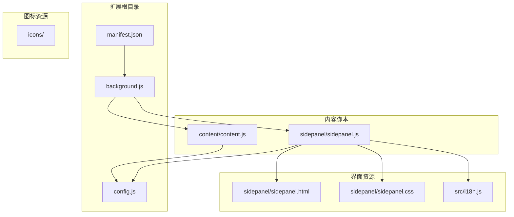
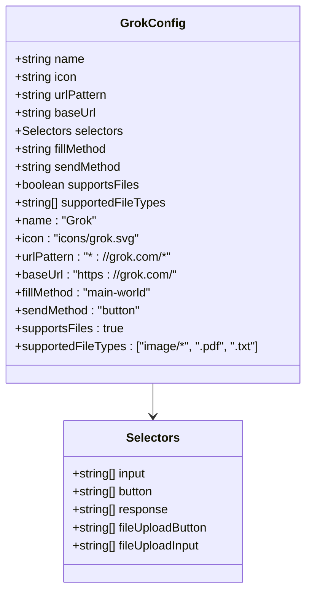
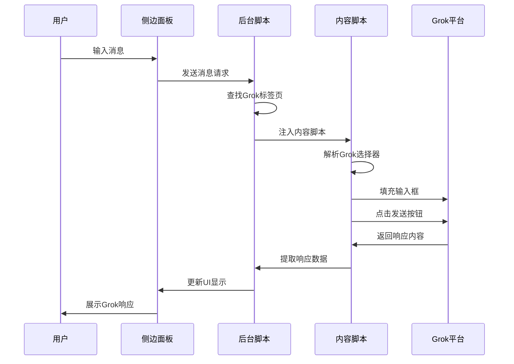
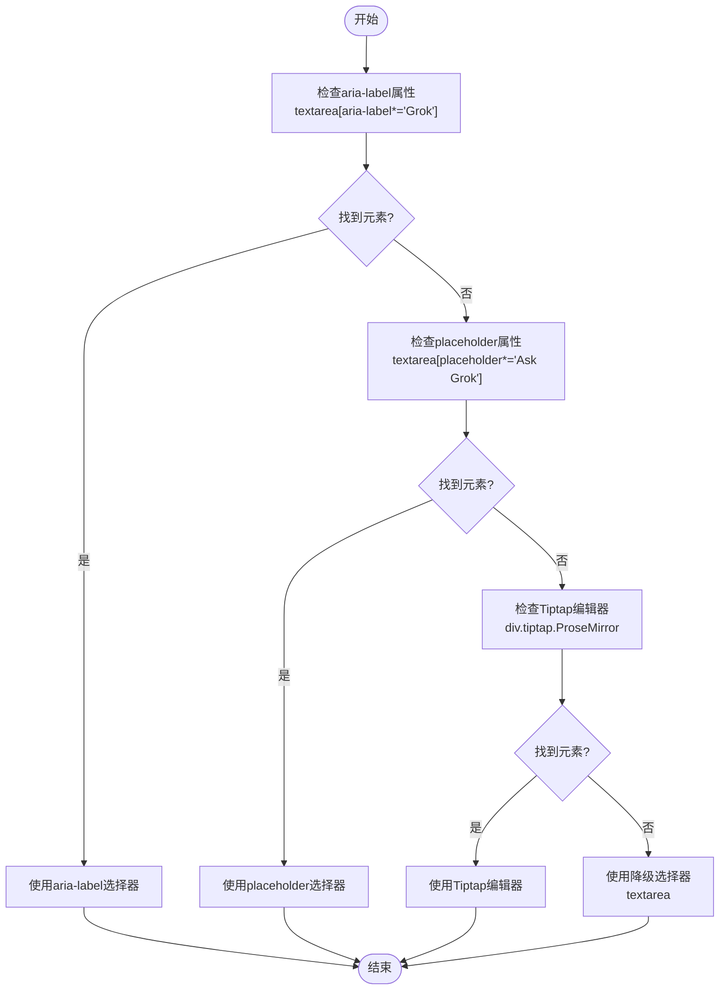
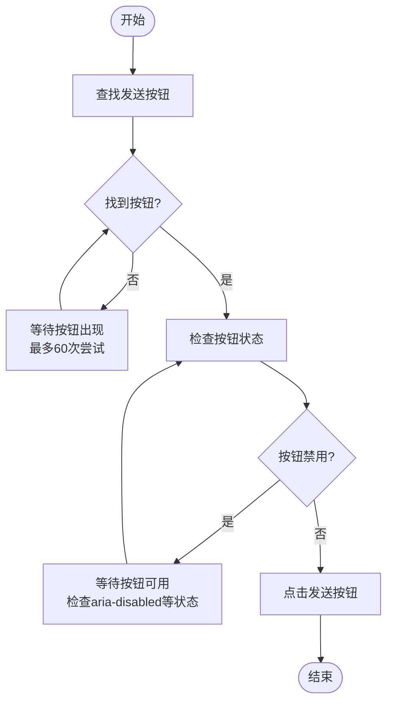
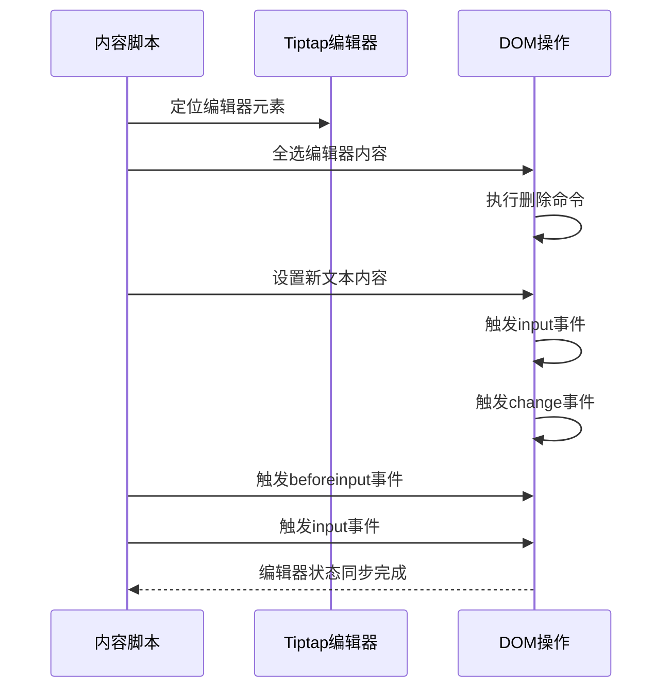
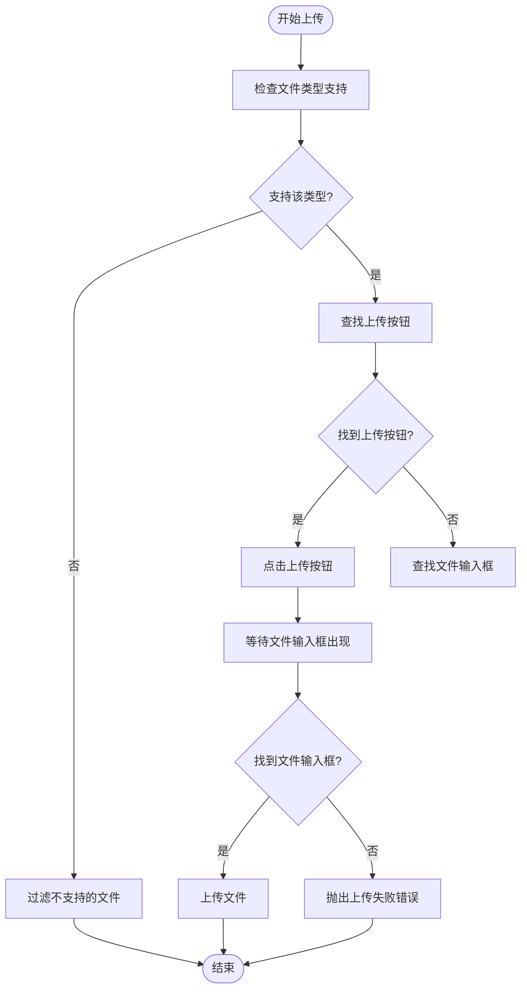
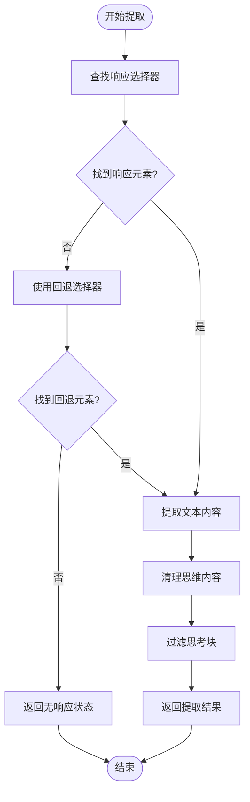
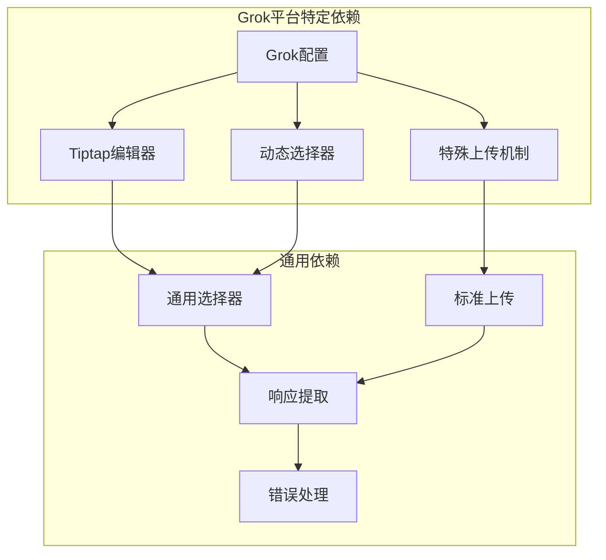
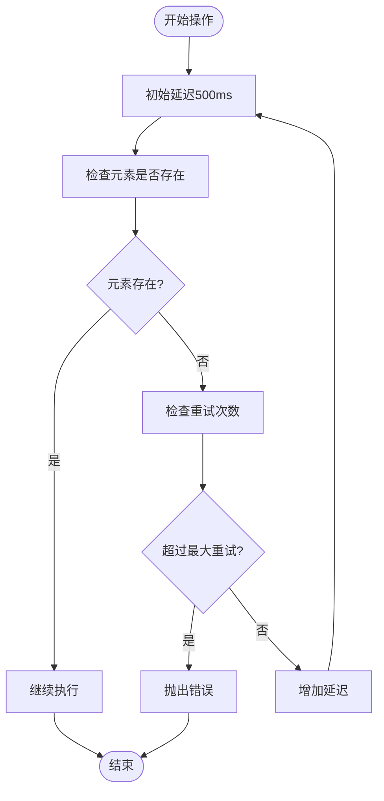

# Grok平台集成

<cite>
**本文档引用的文件**
- [manifest.json](file://manifest.json)
- [config.js](file://src/config.js)
- [background.js](file://src/background.js)
- [content.js](file://src/content/content.js)
- [sidepanel.js](file://src/sidepanel/sidepanel.js)
- [sidepanel.html](file://src/sidepanel/sidepanel.html)
- [sidepanel.css](file://src/sidepanel/sidepanel.css)
- [i18n.js](file://src/i18n.js)
</cite>

## 目录
1. [简介](#简介)
2. [项目结构](#项目结构)
3. [核心组件](#核心组件)
4. [架构概览](#架构概览)
5. [详细组件分析](#详细组件分析)
6. [依赖关系分析](#依赖关系分析)
7. [性能考虑](#性能考虑)
8. [故障排除指南](#故障排除指南)
9. [结论](#结论)

## 简介

AI Multiverse Chat 是一个支持多AI平台同时交互的浏览器扩展，Grok平台作为其中的重要组成部分，提供了独特的Twitter风格界面和强大的AI能力。本文档深入分析Grok平台的集成实现，包括复杂的输入框选择器配置、多样化的发送按钮识别机制、特殊的Tiptap编辑器处理策略，以及响应内容提取和文件上传支持配置。

## 项目结构

AI Multiverse Chat采用模块化架构设计，主要包含以下核心目录：



**图表来源**
- [manifest.json](file://manifest.json#L1-L79)
- [config.js](file://src/config.js#L1-L204)

**章节来源**
- [manifest.json](file://manifest.json#L1-L79)
- [config.js](file://src/config.js#L1-L204)

## 核心组件

### Grok平台配置

Grok平台在全局配置中具有独特的设置，体现了其特殊的编辑器架构：



**图表来源**
- [config.js](file://src/config.js#L23-L54)

Grok的输入框选择器配置体现了其基于Tiptap编辑器的特殊性：

- **aria-label属性匹配**: `textarea[aria-label*="Grok"]` - 专门针对Grok的占位符文本
- **placeholder属性识别**: `textarea[placeholder*="Ask Grok"]` - 支持英文和中文占位符
- **Tiptap编辑器支持**: `div.tiptap.ProseMirror` - 直接操作ProseMirror编辑器
- **降级选择器**: `textarea` - 作为最后的后备方案

**章节来源**
- [config.js](file://src/config.js#L23-L54)

## 架构概览

AI Multiverse Chat采用多层架构设计，确保Grok平台的稳定集成：



**图表来源**
- [background.js](file://src/background.js#L718-L786)
- [content.js](file://src/content/content.js#L322-L418)

## 详细组件分析

### Grok输入框选择器策略

Grok平台采用了多层次的选择器策略，以应对不同的页面状态和编辑器状态：



**图表来源**
- [config.js](file://src/config.js#L29-L36)
- [content.js](file://src/content/content.js#L574-L590)

### 动态按钮检测机制

Grok平台的发送按钮识别采用了智能的动态检测策略：



**图表来源**
- [content.js](file://src/content/content.js#L471-L524)

### Tiptap编辑器特殊处理

Grok使用Tiptap富文本编辑器，需要特殊的处理策略：



**图表来源**
- [background.js](file://src/background.js#L425-L459)
- [content.js](file://src/content/content.js#L435-L463)

### 文件上传支持配置

Grok平台的文件上传机制支持多种文件类型：



**图表来源**
- [content.js](file://src/content/content.js#L811-L836)

**章节来源**
- [config.js](file://src/config.js#L47-L49)
- [content.js](file://src/content/content.js#L811-L836)

### 响应内容提取机制

Grok平台的响应内容提取采用了智能的最后匹配策略：



**图表来源**
- [content.js](file://src/content/content.js#L218-L320)

**章节来源**
- [content.js](file://src/content/content.js#L218-L320)

## 依赖关系分析

### 平台间依赖关系



**图表来源**
- [config.js](file://src/config.js#L23-L54)
- [content.js](file://src/content/content.js#L322-L418)

### 组件耦合度分析

Grok集成展现了良好的模块化设计：

- **低耦合**: Grok配置独立于其他平台配置
- **高内聚**: 相关功能集中在content.js中
- **可扩展性**: 新增平台只需添加配置项
- **稳定性**: 通过降级选择器保证兼容性

**章节来源**
- [config.js](file://src/config.js#L1-L204)
- [content.js](file://src/content/content.js#L1-L941)

## 性能考虑

### 选择器优化策略

Grok平台选择了高效的CSS选择器策略：

- **精确优先**: 首先使用aria-label和placeholder属性进行精确匹配
- **可见性检查**: 仅选择可见元素，避免隐藏元素的误匹配
- **降级策略**: 提供多层降级选择器，确保稳定性
- **缓存机制**: 选择器结果在同一页内可复用

### 延迟和重试机制



**图表来源**
- [content.js](file://src/content/content.js#L7-L25)

## 故障排除指南

### 常见问题诊断

#### 1. 输入框无法定位
**症状**: "输入元素未找到"错误
**解决方案**:
- 检查网络连接和页面加载状态
- 验证aria-label和placeholder属性是否正确
- 确认Tiptap编辑器是否正确初始化

#### 2. 发送按钮点击失败
**症状**: 按钮状态异常或点击无效
**解决方案**:
- 检查按钮的aria-disabled属性
- 验证按钮是否处于可点击状态
- 确认是否有JavaScript错误阻止点击

#### 3. 文件上传失败
**症状**: 文件无法上传或上传超时
**解决方案**:
- 验证文件类型是否受支持
- 检查上传按钮是否正确识别
- 确认网络连接稳定

### 调试技巧

#### 1. 选择器诊断工具
使用内置的诊断功能检查选择器有效性：

```javascript
// 在控制台中运行
chrome.runtime.sendMessage({
    action: 'diagnose_selectors',
    provider: 'grok'
}, (response) => {
    console.log('Grok选择器诊断结果:', response);
});
```

#### 2. 日志监控
启用详细的日志输出来跟踪执行流程：

```javascript
// 在content.js中添加调试信息
console.log('[AI Multiverse] Grok处理流程:', {
    inputElement: inputEl,
    buttonText: targetEl?.textContent,
    uploadStatus: uploadStatus
});
```

#### 3. 选择器优化建议
- 使用更具体的选择器减少匹配范围
- 添加可见性检查避免隐藏元素
- 实现超时机制防止无限等待
- 提供降级方案确保功能可用

**章节来源**
- [content.js](file://src/content/content.js#L126-L197)
- [background.js](file://src/background.js#L270-L296)

## 结论

Grok平台集成为AI Multiverse Chat提供了完整的Twitter风格AI交互体验。通过精心设计的选择器策略、智能的动态检测机制和完善的错误处理，实现了高度稳定的跨平台集成。

### 主要成就

1. **创新的选择器策略**: 成功处理了Tiptap编辑器的复杂状态
2. **智能的按钮识别**: 实现了动态按钮状态检测和处理
3. **完善的文件支持**: 支持多种文件类型的上传和处理
4. **健壮的错误处理**: 提供多层降级策略确保功能稳定性

### 技术亮点

- **Tiptap编辑器特殊处理**: 通过全选-删除-粘贴的模拟操作处理富文本编辑器
- **动态按钮检测**: 智能识别按钮状态变化，避免在禁用状态下点击
- **多层选择器策略**: 从精确到宽松的渐进式选择器匹配
- **文件上传优化**: 针对Grok平台特点的上传机制

### 未来改进方向

1. **性能优化**: 进一步优化选择器匹配速度
2. **用户体验**: 增强错误提示和用户反馈
3. **兼容性**: 扩展对更多Grok功能的支持
4. **稳定性**: 持续改进错误处理和恢复机制

通过这些技术实现，Grok平台成功融入了AI Multiverse Chat生态系统，为用户提供了统一、高效、稳定的多AI平台交互体验。