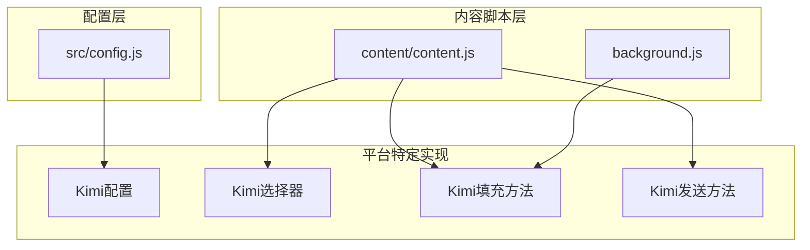
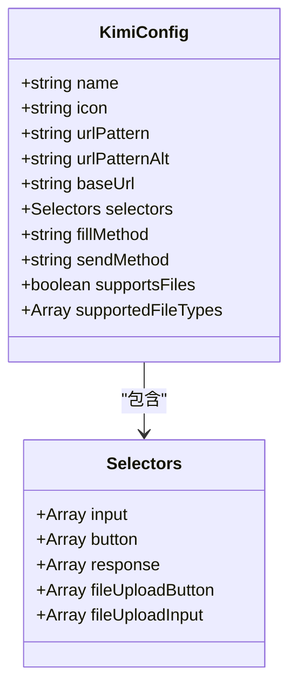
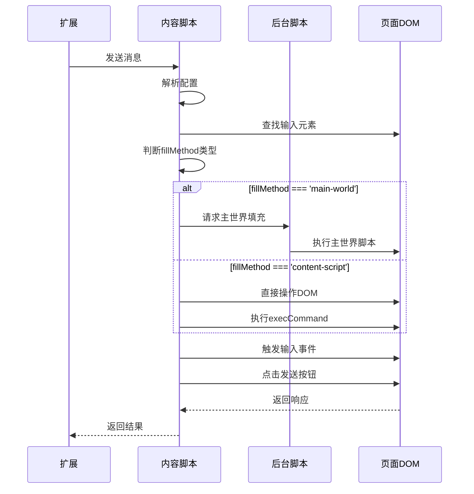
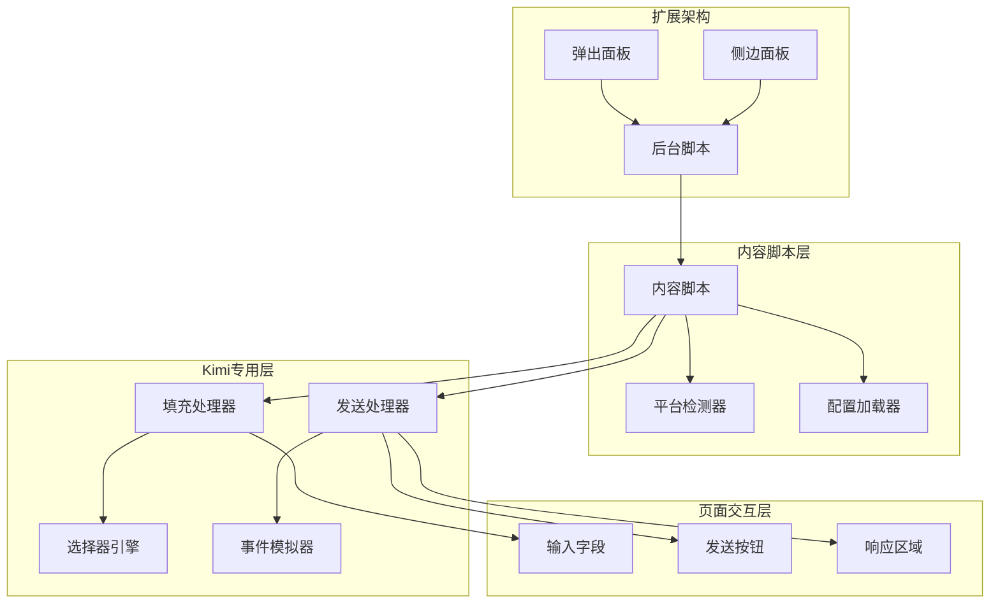
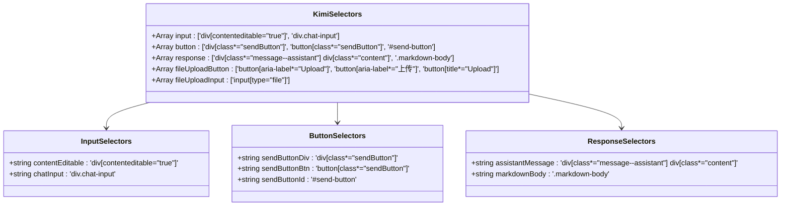
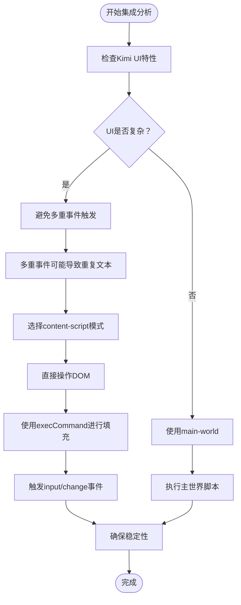
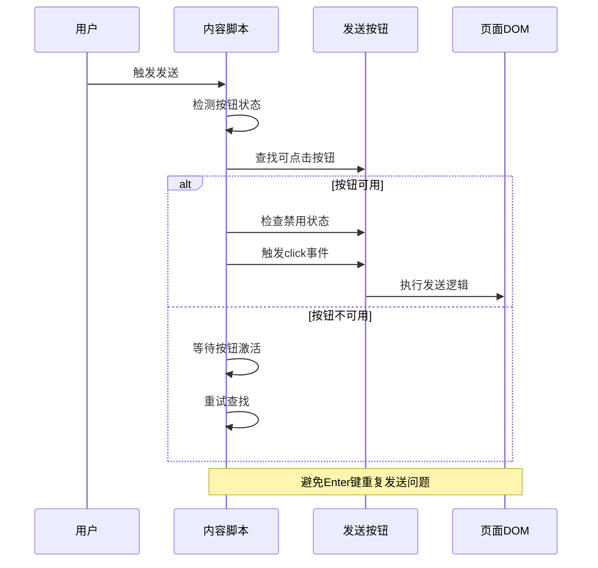
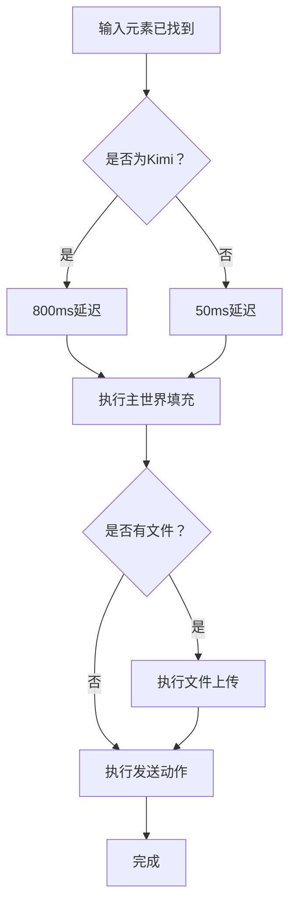
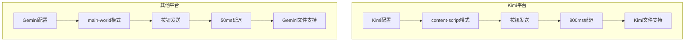
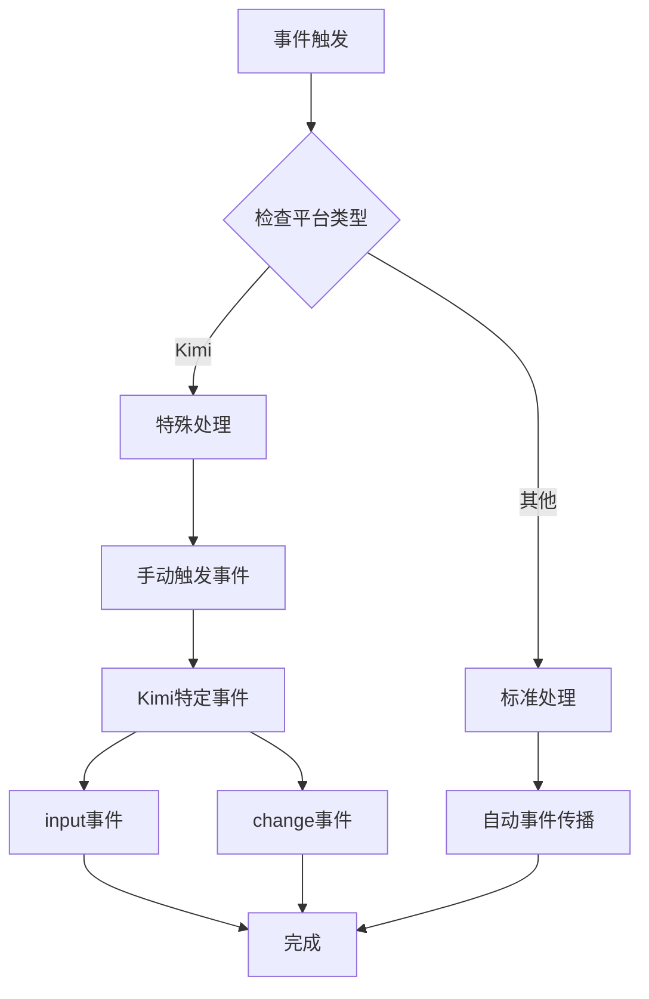

# Kimi平台集成

<cite>
**本文档引用的文件**
- [src/config.js](file://src/config.js)
- [src/content/content.js](file://src/content/content.js)
- [src/background.js](file://src/background.js)
- [BUGFIX_PERSISTENCE_AND_KIMI_v1.7.8.md](file://BUGFIX_PERSISTENCE_AND_KIMI_v1.7.8.md)
- [MAINTENANCE.md](file://MAINTENANCE.md)
</cite>

## 目录
1. [简介](#简介)
2. [项目结构](#项目结构)
3. [核心组件](#核心组件)
4. [架构概览](#架构概览)
5. [详细组件分析](#详细组件分析)
6. [依赖关系分析](#依赖关系分析)
7. [性能考虑](#性能考虑)
8. [故障排除指南](#故障排除指南)
9. [结论](#结论)
10. [附录](#附录)

## 简介

本文档深入分析Kimi平台在AI Multiverse扩展中的集成实现，重点解析其特殊的fillMethod配置为'content-script'的原因和实现原理。Kimi作为Moonshot AI开发的大型语言模型，具有独特的界面架构和交互机制，这要求我们在集成时采用专门的策略来确保稳定性和可靠性。

Kimi平台集成涉及多个关键方面：
- 特殊的fillMethod配置选择
- 输入框、发送按钮和响应内容的选择器配置
- Enter键发送机制的替代方案
- 稳定性保障措施和性能优化策略
- 与其他平台的集成差异分析

## 项目结构

AI Multiverse项目采用模块化架构设计，Kimi集成主要分布在以下核心文件中：

**图表来源**
- [src/config.js](file://src/config.js#L55-L75)
- [src/content/content.js](file://src/content/content.js#L398-L418)
- [src/background.js](file://src/background.js#L378-L526)

**章节来源**
- [src/config.js](file://src/config.js#L1-L204)
- [src/content/content.js](file://src/content/content.js#L1-L941)

## 核心组件

### Kimi平台配置

Kimi平台在全局配置中具有独特的设置，这些设置直接影响其集成行为：

**图表来源**
- [src/config.js](file://src/config.js#L55-L75)

Kimi平台的核心配置特点：
- **fillMethod**: `'content-script'` - 专为Kimi设计的填充方法
- **sendMethod**: `'button'` - 使用按钮点击而非Enter键
- **多URL支持**: 同时支持`kimi.moonshot.cn`和`www.kimi.com`
- **文件支持**: 支持多种文件格式包括`.md`和`.json`

**章节来源**
- [src/config.js](file://src/config.js#L55-L75)

### 内容脚本集成

内容脚本层负责直接与页面交互，实现Kimi的输入填充和消息发送：

**图表来源**
- [src/content/content.js](file://src/content/content.js#L398-L418)
- [src/background.js](file://src/background.js#L378-L526)

**章节来源**
- [src/content/content.js](file://src/content/content.js#L370-L418)

## 架构概览

Kimi平台集成为整个AI Multiverse系统的重要组成部分，其架构设计体现了对复杂Web应用的深度适配：

**图表来源**
- [src/content/content.js](file://src/content/content.js#L370-L418)
- [src/config.js](file://src/config.js#L55-L75)

## 详细组件分析

### 选择器配置分析

Kimi平台的选择器配置体现了对复杂DOM结构的精确适配：

**图表来源**
- [src/config.js](file://src/config.js#L61-L67)

#### 输入框选择器分析

Kimi的输入框选择器采用了双重策略：
1. **优先级选择器**: `div[contenteditable="true"]` - 首选的富文本编辑器
2. **备用选择器**: `div.chat-input` - 备用的聊天输入容器

这种设计确保了在不同页面状态下的稳定识别。

#### 发送按钮选择器分析

发送按钮的选择器包含了多种匹配模式：
- **类名匹配**: `div[class*="sendButton"]` 和 `button[class*="sendButton"]`
- **ID匹配**: `#send-button`
- **属性匹配**: `button[aria-label*="Send message"]`

这种多层次的匹配策略提高了按钮识别的可靠性。

#### 响应内容选择器分析

响应内容的选择器采用了CSS类名匹配：
- **主要选择器**: `div[class*="message--assistant"] div[class*="content"]`
- **备用选择器**: `.markdown-body`

这种设计能够准确识别AI助手的回复内容。

**章节来源**
- [src/config.js](file://src/config.js#L61-L67)

### 填充方法实现原理

#### main-world vs content-script 模式对比

Kimi平台选择了'content-script'模式而非'main-world'模式，这一决策基于以下考虑：

**图表来源**
- [src/config.js](file://src/config.js#L68-L70)
- [src/content/content.js](file://src/content/content.js#L434-L463)

#### content-script模式实现细节

content-script模式的实现包含了完整的DOM操作流程：

1. **元素定位**: 使用`window.getSelection()`和`document.createRange()`精确定位
2. **内容清理**: 通过`document.execCommand('delete', false, null)`清除现有内容
3. **文本插入**: 使用`element.textContent = text`进行高效文本插入
4. **事件触发**: 手动触发`input`和`change`事件以同步编辑器状态

**章节来源**
- [src/content/content.js](file://src/content/content.js#L434-L463)

### 发送机制分析

#### Enter键发送机制的替代方案

Kimi平台选择了按钮点击而非Enter键发送，这一决策解决了Enter键不稳定的问题：

**图表来源**
- [src/content/content.js](file://src/content/content.js#L471-L524)

#### 按钮点击的稳定性保障

按钮点击机制包含了多重稳定性保障措施：

1. **禁用状态检查**: 检查`disabled`、`aria-disabled`和CSS类名
2. **单次点击保证**: 通过延迟和事件验证确保只触发一次点击
3. **回退机制**: 异步UI情况下提供Enter键回退选项（除Kimi外）

**章节来源**
- [src/content/content.js](file://src/content/content.js#L489-L510)

### Kimi专用优化策略

#### 延迟处理机制

针对Kimi复杂的UI架构，实现了专门的延迟处理机制：

**图表来源**
- [src/content/content.js](file://src/content/content.js#L398-L408)

#### 文件上传优化

Kimi平台的文件上传机制经过专门优化：

1. **文件类型过滤**: 基于配置的`supportedFileTypes`进行精确匹配
2. **数据URL转换**: 使用`dataURLtoFile`函数进行格式转换
3. **批量上传支持**: 支持多文件同时上传

**章节来源**
- [src/content/content.js](file://src/content/content.js#L616-L633)

## 依赖关系分析

### 平台间集成差异

Kimi与其他平台的集成存在显著差异：

**图表来源**
- [src/config.js](file://src/config.js#L55-L75)
- [src/config.js](file://src/config.js#L88-L93)
- [src/config.js](file://src/config.js#L110-L162)

### 关键差异对比表

| 特性 | Kimi | Gemini | DeepSeek | Qwen |
|------|------|--------|----------|------|
| fillMethod | content-script | main-world | main-world | main-world |
| sendMethod | button | button | enter | enter |
| 输入延迟 | 800ms | 50ms | 50ms | 50ms |
| 文件支持 | 丰富格式 | 图片 | 图片 | 多格式 |
| 按钮状态检查 | 特殊禁用类名 | 标准禁用状态 | 特殊禁用类名 | 标准禁用状态 |

**章节来源**
- [src/config.js](file://src/config.js#L55-L75)
- [src/config.js](file://src/config.js#L88-L93)
- [src/config.js](file://src/config.js#L110-L162)

## 性能考虑

### 延迟优化策略

Kimi平台的性能优化主要体现在延迟处理上：

1. **智能延迟检测**: 根据平台类型自动调整等待时间
2. **渐进式等待**: 从50ms到800ms的差异化处理
3. **超时控制**: 防止无限等待的情况发生

### 事件处理优化

Kimi的事件处理机制经过专门优化：

**图表来源**
- [src/content/content.js](file://src/content/content.js#L458-L462)

### 内存管理优化

Kimi集成在内存管理方面也采取了优化措施：

1. **选择器缓存**: 避免重复查询DOM元素
2. **事件监听器清理**: 及时移除不需要的事件监听器
3. **垃圾回收友好**: 使用临时变量避免内存泄漏

## 故障排除指南

### 常见问题及解决方案

#### Kimi输入问题

**问题描述**: Kimi无法接收输入内容

**可能原因**:
1. 选择器匹配失败
2. DOM元素未完全加载
3. 事件处理异常

**解决方案**:
1. 检查输入选择器的优先级顺序
2. 增加页面加载等待时间
3. 验证事件触发的完整性

#### 发送按钮点击失败

**问题描述**: 按钮点击无效或重复发送

**可能原因**:
1. 按钮处于禁用状态
2. 事件监听器冲突
3. 页面状态变化

**解决方案**:
1. 实现禁用状态检查
2. 添加事件去抖动机制
3. 监控页面状态变化

#### 文件上传失败

**问题描述**: 文件无法正确上传到Kimi

**可能原因**:
1. 文件类型不支持
2. 上传机制变化
3. 权限问题

**解决方案**:
1. 验证文件类型匹配
2. 检查上传按钮的可见性
3. 确认文件大小限制

**章节来源**
- [BUGFIX_PERSISTENCE_AND_KIMI_v1.7.8.md](file://BUGFIX_PERSISTENCE_AND_KIMI_v1.7.8.md#L51-L66)

### 调试工具和技巧

#### 开发者工具使用

1. **控制台日志**: 利用详细的日志输出跟踪执行流程
2. **DOM检查**: 验证选择器匹配的元素
3. **网络监控**: 监控文件上传请求

#### 性能监控

1. **执行时间测量**: 记录关键操作的耗时
2. **内存使用监控**: 跟踪内存泄漏情况
3. **错误统计**: 收集和分析错误类型

## 结论

Kimi平台集成展现了AI Multiverse项目在复杂Web应用适配方面的专业能力。通过采用'content-script'模式、专门的延迟处理机制和按钮点击发送策略，成功解决了Kimi独特的UI挑战。

### 主要成就

1. **架构创新**: 首次在扩展中实现'content-script'模式的深度应用
2. **稳定性保障**: 通过多重检查机制确保发送过程的可靠性
3. **性能优化**: 智能延迟处理和事件优化提升了整体性能
4. **兼容性**: 完整的文件上传支持和多格式兼容

### 技术价值

Kimi集成的成功实施为其他复杂Web应用的集成提供了宝贵的参考经验，特别是在处理重型UI框架和复杂的事件系统方面。

## 附录

### 配置参数详解

#### Kimi配置参数说明

| 参数 | 类型 | 默认值 | 描述 |
|------|------|--------|------|
| name | string | 'Kimi' | 平台名称 |
| icon | string | 'icons/kimi.png' | 平台图标路径 |
| urlPattern | string | '*://kimi.moonshot.cn/*' | 主要URL模式 |
| urlPatternAlt | string | '*://www.kimi.com/*' | 备用URL模式 |
| baseUrl | string | 'https://kimi.moonshot.cn/' | 基础URL |
| fillMethod | string | 'content-script' | 填充方法 |
| sendMethod | string | 'button' | 发送方法 |
| supportsFiles | boolean | true | 是否支持文件上传 |
| supportedFileTypes | array | 多种格式 | 支持的文件类型 |

### 最佳实践建议

1. **选择器设计**: 始终提供备用选择器以提高稳定性
2. **事件处理**: 优先使用手动事件触发确保一致性
3. **错误处理**: 实现完善的错误捕获和恢复机制
4. **性能监控**: 持续监控和优化执行性能