# 新平台集成指南

<cite>
**本文档引用的文件**
- [README.md](file://README.md)
- [manifest.json](file://manifest.json)
- [src/background.js](file://src/background.js)
- [src/config.js](file://src/config.js)
- [src/content/content.js](file://src/content/content.js)
- [src/sidepanel/sidepanel.js](file://src/sidepanel/sidepanel.js)
- [src/sidepanel/sidepanel.html](file://src/sidepanel/sidepanel.html)
- [src/popup/popup.js](file://src/popup/popup.js)
- [src/i18n.js](file://src/i18n.js)
- [src/sidepanel/sidepanel.css](file://src/sidepanel/sidepanel.css)
- [src/popup/popup.css](file://src/popup/popup.css)
</cite>

## 目录
1. [简介](#简介)
2. [项目结构](#项目结构)
3. [核心组件](#核心组件)
4. [架构概览](#架构概览)
5. [详细组件分析](#详细组件分析)
6. [依赖关系分析](#依赖关系分析)
7. [性能考虑](#性能考虑)
8. [故障排除指南](#故障排除指南)
9. [结论](#结论)
10. [附录](#附录)

## 简介

AI Multiverse Chat 是一个Chrome浏览器扩展，允许用户同时向多个AI聊天机器人广播消息。该项目采用轻量级架构，使用原生JavaScript、HTML和CSS构建，无需构建工具即可运行。

本指南专注于新AI平台的集成流程，涵盖配置结构创建、选择器映射规则制定、发送方法配置、文件上传支持、抽象化设计和性能优化等关键技术要点。

## 项目结构

项目采用模块化设计，主要包含以下核心目录和文件：

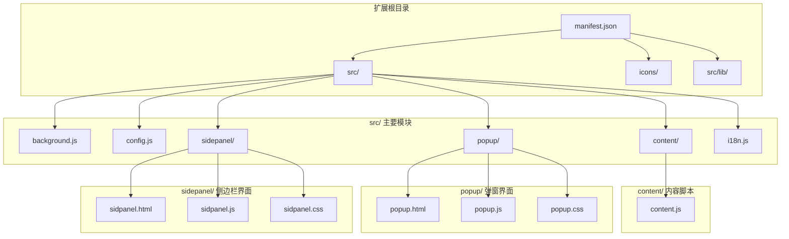

**图表来源**
- [manifest.json](file://manifest.json#L1-L79)
- [src/background.js](file://src/background.js#L1-L100)
- [src/config.js](file://src/config.js#L1-L50)

**章节来源**
- [README.md](file://README.md#L20-L29)
- [manifest.json](file://manifest.json#L1-L79)

## 核心组件

### 1. 配置管理系统

AI平台配置采用统一的配置对象结构，支持多种平台的差异化配置：

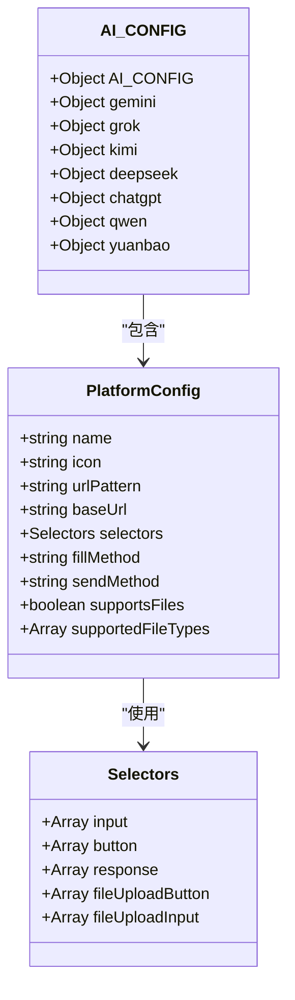

**图表来源**
- [src/config.js](file://src/config.js#L5-L199)

### 2. 通信架构

扩展采用多层通信架构，确保各组件间的松耦合：

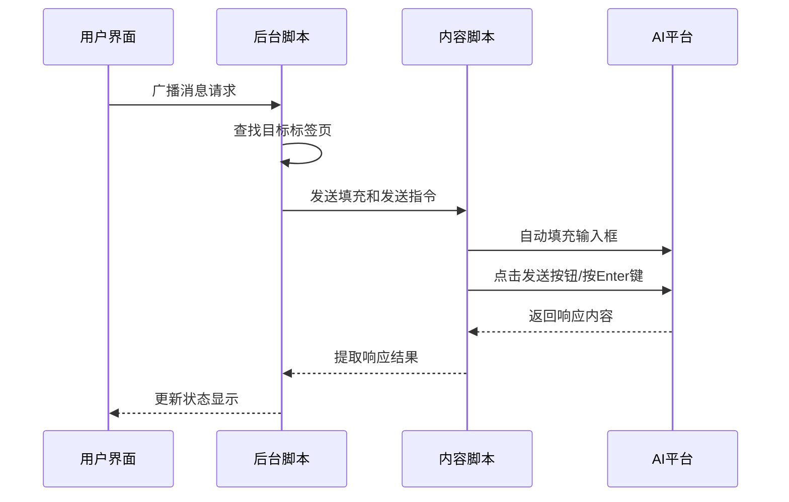

**图表来源**
- [src/background.js](file://src/background.js#L139-L197)
- [src/content/content.js](file://src/content/content.js#L200-L216)

**章节来源**
- [src/config.js](file://src/config.js#L1-L204)
- [src/background.js](file://src/background.js#L133-L197)

## 架构概览

AI Multiverse采用分层架构设计，确保系统的可扩展性和维护性：

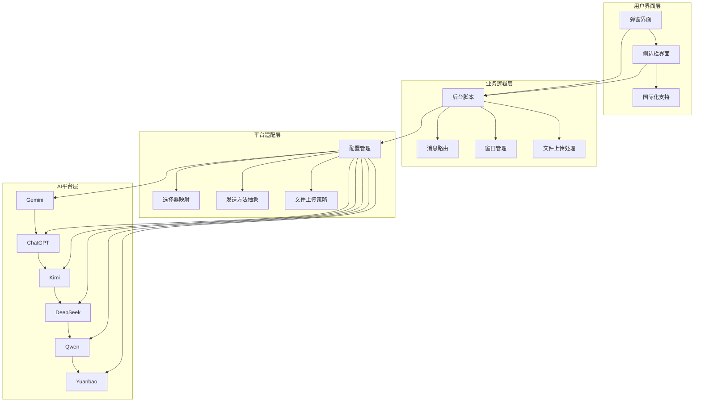

**图表来源**
- [src/background.js](file://src/background.js#L1-L100)
- [src/config.js](file://src/config.js#L1-L204)

## 详细组件分析

### 配置结构创建

#### 1. 基础配置模板

每个新平台的配置需要遵循统一的结构规范：

| 配置项 | 类型 | 必需 | 描述 |
|--------|------|------|------|
| name | string | 是 | 平台显示名称 |
| icon | string | 是 | 平台图标路径 |
| urlPattern | string | 是 | 主域名匹配模式 |
| baseUrl | string | 是 | 平台基础URL |
| selectors | object | 是 | DOM选择器映射 |
| fillMethod | string | 是 | 输入填充方法 |
| sendMethod | string | 是 | 消息发送方式 |
| supportsFiles | boolean | 是 | 是否支持文件上传 |
| supportedFileTypes | array | 是 | 支持的文件类型 |

#### 2. 选择器映射规则

选择器映射采用多层次设计，确保在不同平台间的兼容性：

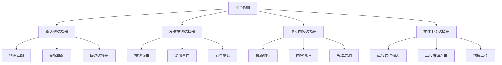

**图表来源**
- [src/config.js](file://src/config.js#L11-L19)
- [src/content/content.js](file://src/content/content.js#L219-L320)

#### 3. 发送方法配置

发送方法采用策略模式设计，支持多种发送机制：

| 发送方法 | 适用场景 | 实现方式 | 优缺点 |
|----------|----------|----------|--------|
| button | 标准Web应用 | 点击发送按钮 | 稳定可靠，但可能受UI状态影响 |
| enter | 即时通讯应用 | 按Enter键 | 响应快速，但可能触发重复发送 |
| form | 表单驱动应用 | 表单提交 | 符合标准，但可能缺少交互反馈 |
| main-world | 特殊平台 | 主世界执行 | 功能强大，但安全性考虑 |

**章节来源**
- [src/config.js](file://src/config.js#L18-L199)
- [src/content/content.js](file://src/content/content.js#L466-L565)

### 文件上传支持集成

#### 1. 文件上传策略

文件上传采用平台特定的策略组合：

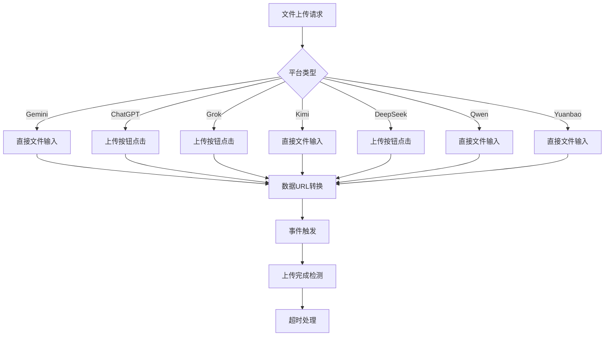

**图表来源**
- [src/content/content.js](file://src/content/content.js#L616-L742)
- [src/content/content.js](file://src/content/content.js#L747-L940)

#### 2. 文件类型过滤

文件上传支持灵活的类型过滤机制：

| 文件类型 | 支持平台 | 限制条件 |
|----------|----------|----------|
| image/* | 所有平台 | 图片格式支持 |
| .pdf | 大多数平台 | 文档格式支持 |
| .txt | 所有平台 | 纯文本支持 |
| .doc/.docx | 部分平台 | 文档格式支持 |
| .md | 多数平台 | Markdown支持 |
| .json | 部分平台 | 数据格式支持 |
| .csv | 部分平台 | 数据表格支持 |

**章节来源**
- [src/content/content.js](file://src/content/content.js#L677-L710)

### 抽象化设计

#### 1. 选择器抽象层

选择器抽象层提供统一的选择器访问接口：

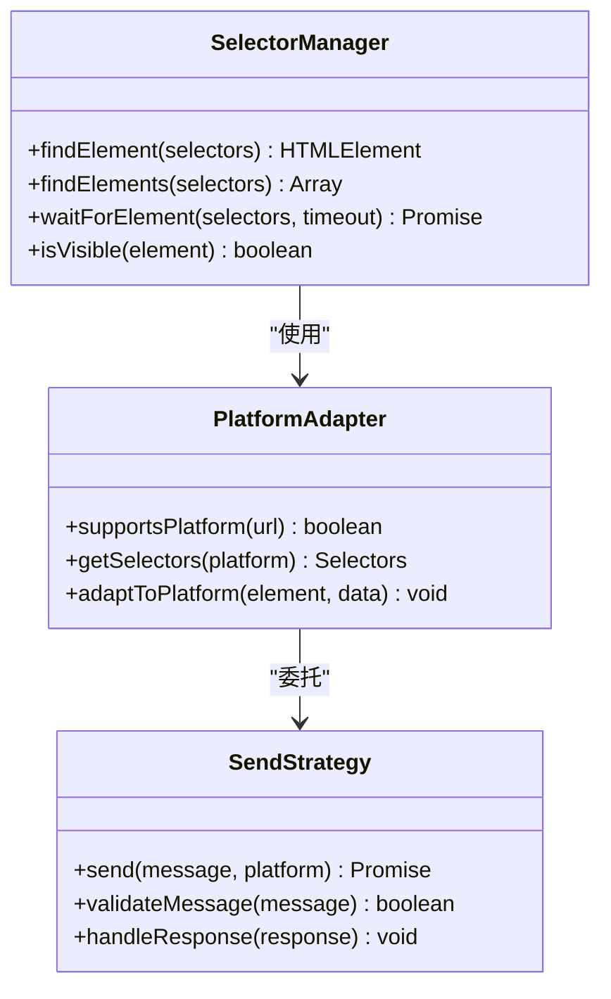

**图表来源**
- [src/content/content.js](file://src/content/content.js#L574-L590)
- [src/content/content.js](file://src/content/content.js#L466-L565)

#### 2. 发送策略模式

发送策略模式支持多种发送机制的动态切换：

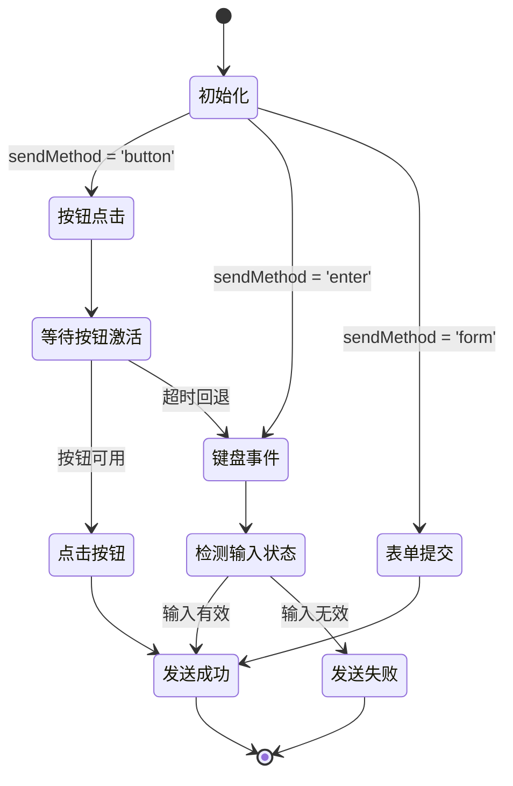

**图表来源**
- [src/content/content.js](file://src/content/content.js#L466-L565)

**章节来源**
- [src/content/content.js](file://src/content/content.js#L323-L418)

### 性能优化策略

#### 1. 异步处理机制

系统采用异步处理确保UI响应性和平台兼容性：

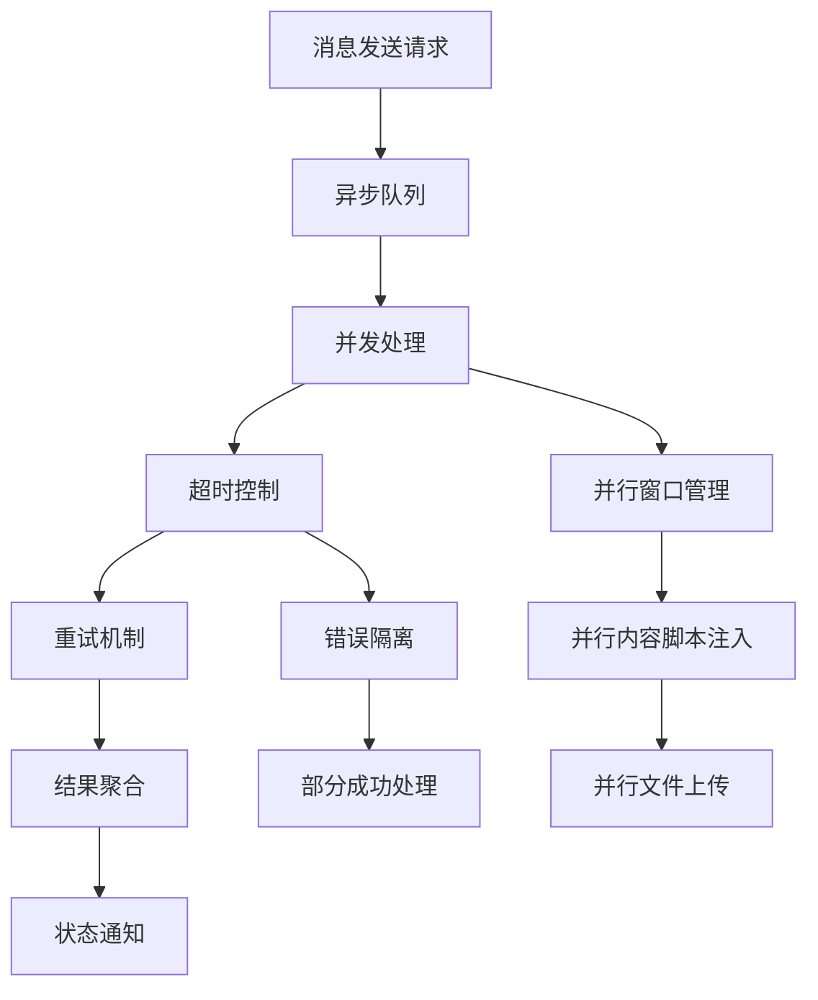

#### 2. 内存管理优化

系统采用内存友好的设计模式：

- **延迟初始化**: 仅在需要时加载平台配置
- **缓存策略**: 选择器结果和DOM元素的短期缓存
- **垃圾回收**: 及时释放临时变量和事件监听器
- **资源清理**: 窗口关闭时自动清理相关资源

**章节来源**
- [src/background.js](file://src/background.js#L718-L786)
- [src/content/content.js](file://src/content/content.js#L1-L25)

## 依赖关系分析

### 1. 外部依赖

项目采用最小化依赖策略，仅使用必要的外部库：

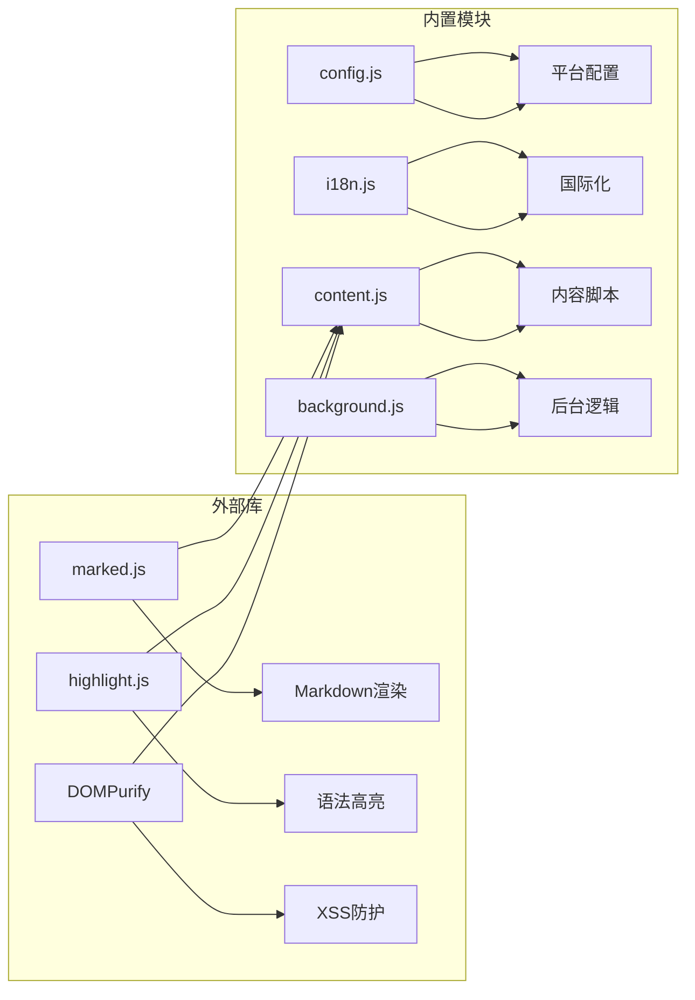

**图表来源**
- [src/sidepanel/sidepanel.html](file://src/sidepanel/sidepanel.html#L13-L15)
- [src/sidepanel/sidepanel.html](file://src/sidepanel/sidepanel.html#L392-L397)

### 2. 内部模块依赖

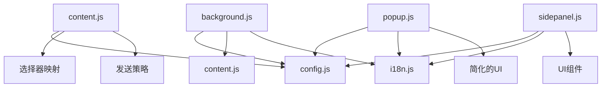

**图表来源**
- [src/background.js](file://src/background.js#L69-L74)
- [src/content/content.js](file://src/content/content.js#L1-L10)

**章节来源**
- [manifest.json](file://manifest.json#L45-L68)
- [src/background.js](file://src/background.js#L69-L74)

## 性能考虑

### 1. 加载性能优化

- **懒加载策略**: 平台配置仅在需要时加载
- **并行处理**: 多个AI平台的消息发送采用并行处理
- **缓存机制**: 选择器结果和DOM元素进行短期缓存
- **资源压缩**: CSS和JavaScript文件经过压缩优化

### 2. 运行时性能

- **异步操作**: 所有网络请求和DOM操作都是异步的
- **超时控制**: 设置合理的超时时间防止阻塞
- **错误恢复**: 自动重试机制提高成功率
- **内存管理**: 及时清理不需要的变量和事件监听器

### 3. 用户体验优化

- **进度反馈**: 实时显示操作进度和状态
- **响应式设计**: 支持不同屏幕尺寸的设备
- **主题切换**: 支持明暗主题切换
- **国际化支持**: 多语言界面支持

## 故障排除指南

### 1. 常见问题诊断

#### 选择器失效问题

**症状**: 输入框无法找到或填充失败

**诊断步骤**:
1. 检查URL模式是否正确匹配
2. 验证选择器优先级顺序
3. 确认目标元素是否可见
4. 检查是否有动态内容加载

**解决方案**:
```javascript
// 添加调试输出
console.log('查找元素:', selectors);
const element = findElement(selectors);
console.log('找到元素:', element);
```

#### 发送方法不工作

**症状**: 消息无法发送或重复发送

**诊断步骤**:
1. 检查发送按钮是否可用
2. 验证键盘事件是否被正确触发
3. 确认表单提交是否成功
4. 检查平台的防重复机制

**解决方案**:
```javascript
// 添加发送状态监控
console.log('发送状态:', {
    buttonExists: !!button,
    buttonDisabled: button?.disabled,
    inputFocused: document.activeElement === input
});
```

#### 文件上传失败

**症状**: 文件无法上传或上传超时

**诊断步骤**:
1. 检查文件类型是否受支持
2. 验证文件大小限制
3. 确认上传按钮是否可见
4. 检查网络连接状态

**解决方案**:
```javascript
// 实现重试机制
for (let i = 0; i < MAX_RETRIES; i++) {
    try {
        await uploadSingleFile(file, config, provider);
        break;
    } catch (error) {
        if (i === MAX_RETRIES - 1) throw error;
        await delay(DELAY.RETRY * (i + 1));
    }
}
```

### 2. 调试技巧

#### 开发者工具使用

1. **控制台调试**: 使用`console.log()`输出关键信息
2. **断点调试**: 在关键函数处设置断点
3. **网络监控**: 检查HTTP请求和响应
4. **DOM检查**: 验证元素状态和属性

#### 日志记录

系统提供了详细的日志记录机制：

```javascript
// 调试级别日志
console.log('[AI Multiverse] 调试信息');
console.warn('[AI Multiverse] 警告信息');
console.error('[AI Multiverse] 错误信息');

// 详细状态跟踪
console.log('[AI Multiverse Content] handleFillAndSend called');
console.log('[AI Multiverse Content] Provider:', provider);
console.log('[AI Multiverse Content] Text length:', text?.length);
```

### 3. 性能监控

#### 性能指标

- **加载时间**: 从扩展启动到功能可用的时间
- **响应时间**: 用户操作到结果返回的时间
- **内存使用**: 内存占用情况监控
- **CPU使用率**: 处理密集型操作的性能

#### 优化建议

1. **减少DOM查询次数**: 缓存常用的DOM元素
2. **优化选择器**: 使用更精确的选择器减少匹配时间
3. **异步处理**: 将耗时操作移到后台线程
4. **资源复用**: 重用已创建的对象和元素

**章节来源**
- [src/content/content.js](file://src/content/content.js#L127-L197)
- [src/background.js](file://src/background.js#L270-L296)

## 结论

AI Multiverse Chat提供了一个完整且可扩展的AI平台集成框架。通过统一的配置结构、抽象化的发送策略和灵活的文件上传机制，该系统能够支持多种AI平台的无缝集成。

### 关键优势

1. **模块化设计**: 清晰的组件分离便于维护和扩展
2. **抽象化程度高**: 通过策略模式支持多种平台特性
3. **性能优化**: 异步处理和缓存机制确保流畅体验
4. **错误处理**: 完善的错误捕获和恢复机制
5. **国际化支持**: 多语言界面满足全球化需求

### 最佳实践建议

1. **配置标准化**: 严格遵循配置结构规范
2. **选择器优化**: 优先使用精确选择器
3. **发送策略**: 根据平台特性选择合适的发送方法
4. **文件处理**: 实现健壮的文件上传和错误处理
5. **性能监控**: 持续监控和优化系统性能

该框架为新AI平台的集成提供了坚实的基础，通过遵循本文档的指导原则，可以快速、可靠地将新的AI平台纳入支持范围。

## 附录

### 1. 配置模板

```javascript
// 新平台配置模板
const newPlatformConfig = {
    name: '新平台名称',
    icon: 'icons/new-platform.svg',
    urlPattern: '*://new-platform.com/*',
    baseUrl: 'https://new-platform.com/',
    selectors: {
        input: ['input-selector-1', 'input-selector-2'],
        button: ['button-selector-1', 'button-selector-2'],
        response: ['response-selector-1', 'response-selector-2'],
        fileUploadButton: ['upload-button-selector'],
        fileUploadInput: ['file-input-selector']
    },
    fillMethod: 'main-world', // 或 'content-script'
    sendMethod: 'button', // 或 'enter', 'form'
    supportsFiles: true,
    supportedFileTypes: ['image/*', '.pdf', '.txt']
};
```

### 2. 集成检查清单

- [ ] 平台URL模式配置正确
- [ ] 选择器映射完整且准确
- [ ] 发送方法与平台特性匹配
- [ ] 文件上传支持实现
- [ ] 错误处理机制完善
- [ ] 性能优化措施到位
- [ ] 国际化支持完整
- [ ] 测试验证通过

### 3. 扩展性设计

系统采用插件化设计，支持未来平台的无缝集成：

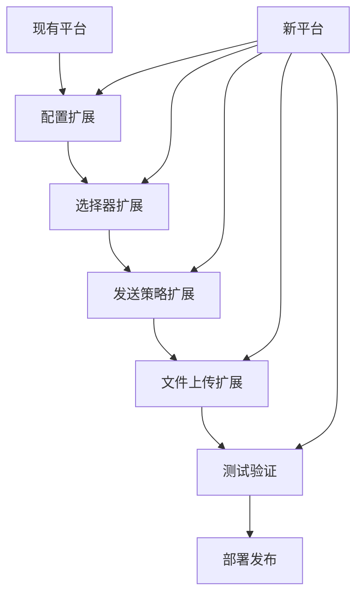