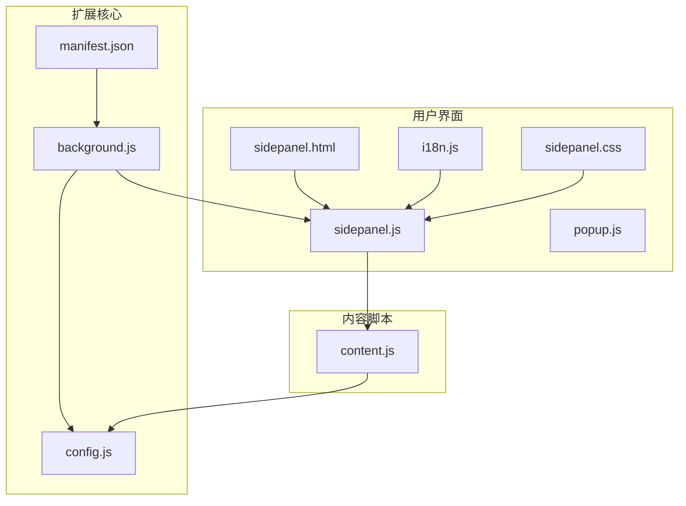
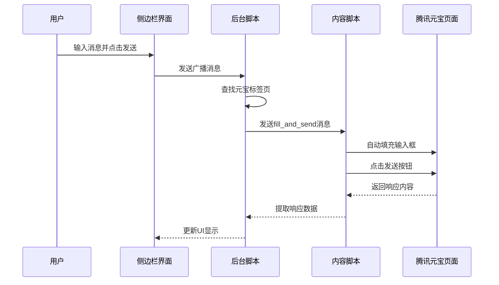
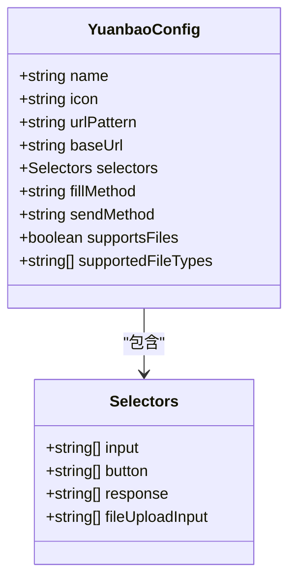
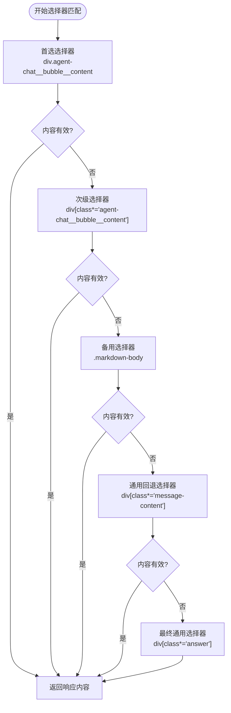
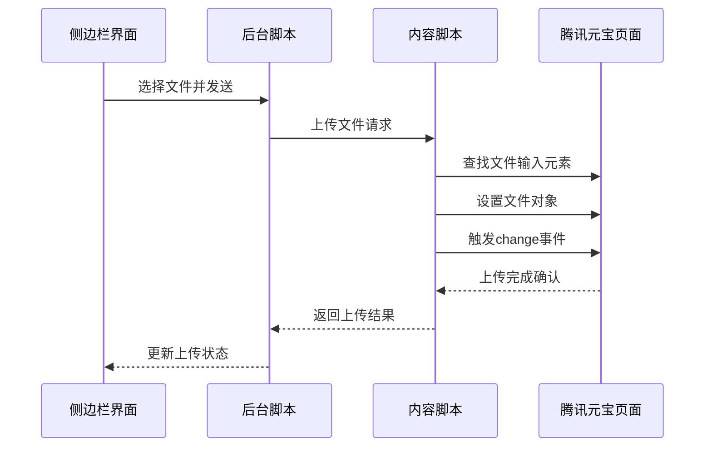
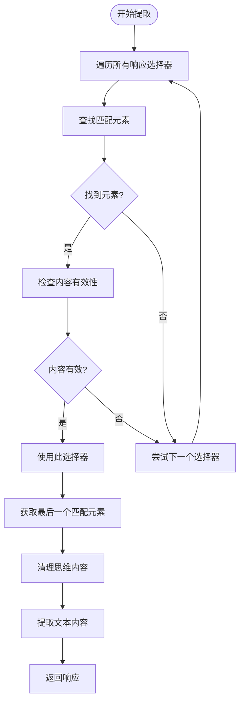
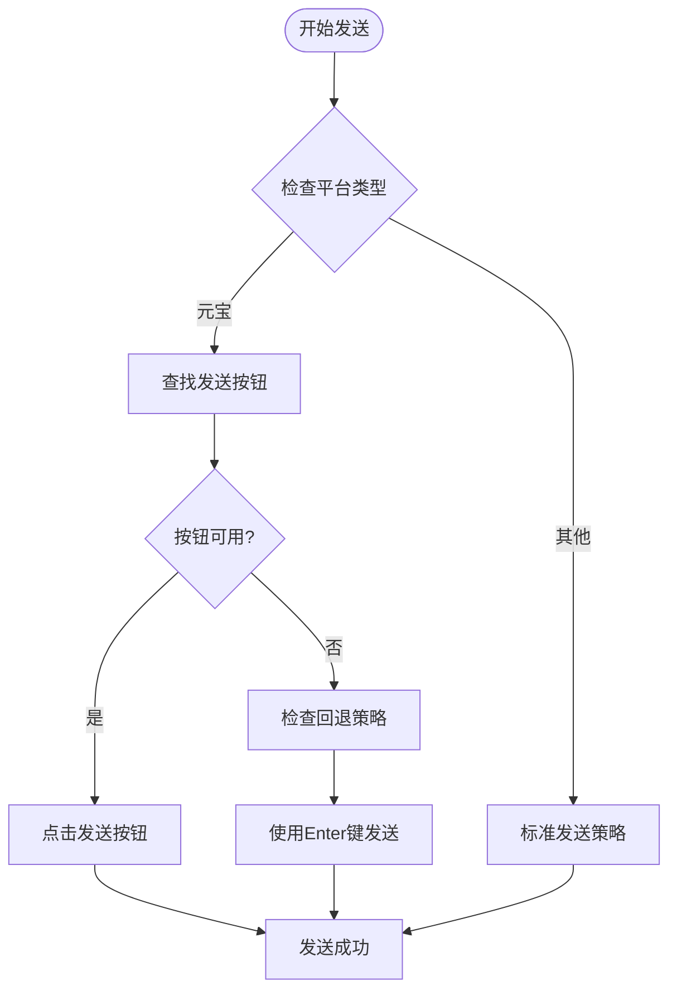
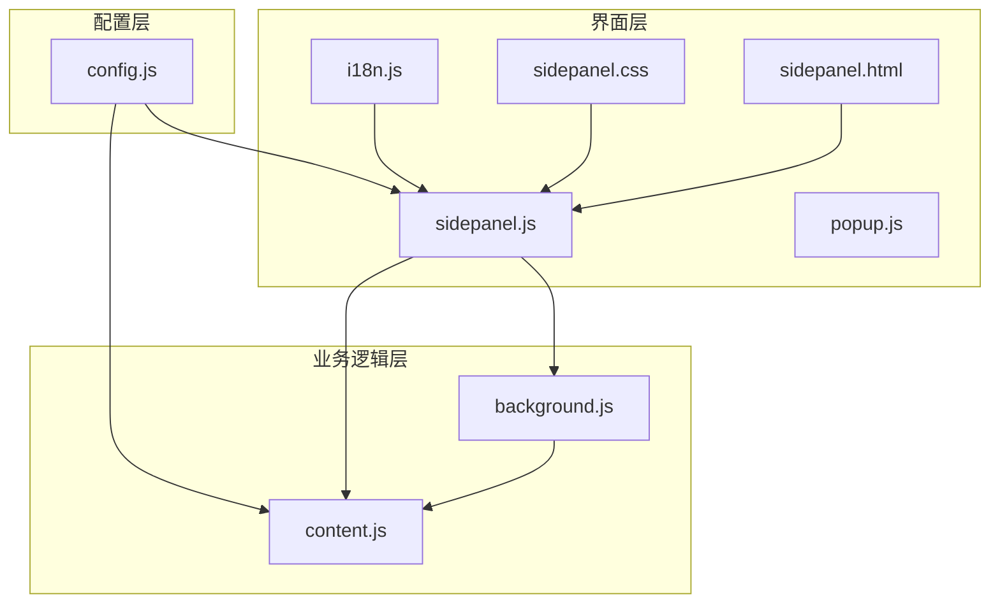
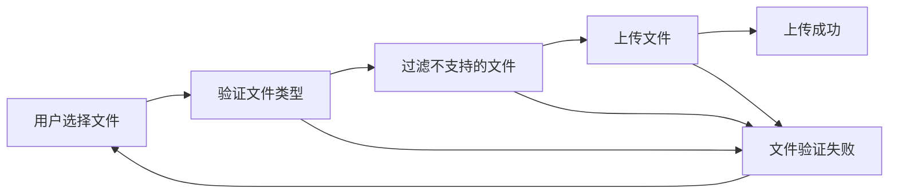

# 腾讯元宝平台集成

<cite>
**本文档引用的文件**
- [manifest.json](file://manifest.json)
- [config.js](file://src/config.js)
- [background.js](file://src/background.js)
- [content.js](file://src/content/content.js)
- [sidepanel.js](file://src/sidepanel/sidepanel.js)
- [sidepanel.html](file://src/sidepanel/sidepanel.html)
- [popup.js](file://src/popup/popup.js)
- [i18n.js](file://src/i18n.js)
- [sidepanel.css](file://src/sidepanel/sidepanel.css)
</cite>

## 目录
1. [简介](#简介)
2. [项目结构](#项目结构)
3. [核心组件](#核心组件)
4. [架构概览](#架构概览)
5. [详细组件分析](#详细组件分析)
6. [依赖关系分析](#依赖关系分析)
7. [性能考虑](#性能考虑)
8. [故障排除指南](#故障排除指南)
9. [结论](#结论)
10. [附录](#附录)

## 简介

本文档深入分析了AI Multiverse Chat扩展中腾讯元宝平台的集成实现。该扩展是一个Chrome浏览器扩展，能够同时向多个AI聊天平台发送消息，包括腾讯元宝（yuanbao.tencent.com）。本文档重点关注元宝平台的配置实现、响应内容选择器配置以及多层次的fallback机制。

## 项目结构

AI Multiverse Chat采用模块化架构设计，主要包含以下核心组件：



**图表来源**
- [manifest.json](file://manifest.json#L1-L79)
- [background.js](file://src/background.js#L1-L100)
- [config.js](file://src/config.js#L1-L204)

**章节来源**
- [manifest.json](file://manifest.json#L1-L79)
- [README.md](file://README.md#L20-L29)

## 核心组件

### 配置管理系统

AI Multiverse采用统一的配置管理方式，所有AI平台的配置都集中在一个全局对象中。对于腾讯元宝平台，配置包含以下关键要素：

- **基础信息**：名称、图标、URL模式、基础URL
- **选择器配置**：输入框、发送按钮、响应内容等DOM选择器
- **交互方式**：主世界填充、发送方法、文件上传支持
- **文件类型支持**：针对元宝平台的文件类型限制

### 内容脚本自动化

内容脚本负责在AI网页内部执行自动化操作，包括：
- 文本输入填充
- 消息发送
- 响应内容提取
- 文件上传处理

### 后台协调服务

后台脚本协调各个标签页的通信，管理窗口状态，并提供统一的消息路由。

**章节来源**
- [config.js](file://src/config.js#L163-L198)
- [content.js](file://src/content/content.js#L323-L418)
- [background.js](file://src/background.js#L138-L197)

## 架构概览

扩展的整体架构采用分层设计，确保各组件职责明确且松耦合：



**图表来源**
- [sidepanel.js](file://src/sidepanel/sidepanel.js#L1-L100)
- [background.js](file://src/background.js#L718-L786)
- [content.js](file://src/content/content.js#L200-L216)

## 详细组件分析

### 腾讯元宝平台配置详解

#### 基础配置参数

腾讯元宝平台在配置文件中的定义包含了完整的集成信息：



**图表来源**
- [config.js](file://src/config.js#L163-L198)

#### 输入框选择器配置

元宝平台的输入框选择器采用了多层次的fallback机制：

| 层级 | 选择器 | 描述 |
|------|--------|------|
| 第一层 | `.ql-editor` | 主要的富文本编辑器选择器 |
| 第二层 | `div[contenteditable="true"]` | 通用的可编辑div选择器 |
| 备用层 | 多个备用选择器 | 针对不同页面状态的回退选项 |

这种设计确保了即使页面结构发生变化，也能通过备用选择器找到正确的输入框。

#### 发送按钮选择器配置

发送按钮的选择器同样采用了多层设计：

| 层级 | 选择器 | 描述 |
|------|--------|------|
| 第一层 | `#yuanbao-send-btn` | 特定ID的发送按钮 |
| 第二层 | `.agent-dialogue__input__send` | 类名匹配的发送按钮 |
| 备用层 | 多个备用按钮选择器 | 针对不同布局的回退方案 |

#### 响应内容选择器配置

这是元宝平台集成的核心部分，采用了极其丰富的多层次选择器配置：



**图表来源**
- [config.js](file://src/config.js#L171-L191)

这种多层次的设计确保了即使页面结构发生重大变化，也能通过备用选择器找到最新的响应内容。

**章节来源**
- [config.js](file://src/config.js#L163-L198)

### 文件上传支持实现

#### 文件类型支持

元宝平台支持多种文件类型的上传，包括：
- 图像文件：`image/*`
- 文档文件：`.pdf`, `.doc`, `.docx`, `.txt`, `.md`
- JSON和CSV文件：`.json`, `.csv`

#### 上传机制实现

文件上传通过统一的接口实现，针对元宝平台的具体实现如下：



**图表来源**
- [content.js](file://src/content/content.js#L924-L940)

#### 文件过滤机制

上传过程包含严格的文件类型过滤：
- 检查文件MIME类型
- 验证文件扩展名
- 支持通配符匹配（如`image/*`）
- 实时错误处理和用户反馈

**章节来源**
- [content.js](file://src/content/content.js#L616-L710)
- [content.js](file://src/content/content.js#L924-L940)

### 响应内容提取算法

#### 多层次提取策略

内容提取采用了"最后匹配元素"的策略，确保获取最新响应：



**图表来源**
- [content.js](file://src/content/content.js#L219-L320)

#### 思维内容过滤

针对元宝平台的深度搜索功能，实现了专门的思维内容过滤：

- 识别深度搜索组件：`.hyc-component-deepsearch-cot`
- 移除思考部分：`.hyc-component-deepsearch-cot__think`
- 保留答案内容：`.hyc-content-md`

**章节来源**
- [content.js](file://src/content/content.js#L50-L102)
- [content.js](file://src/content/content.js#L285-L320)

### 发送机制优化

#### 智能发送策略

发送机制根据平台特点采用了不同的策略：



**图表来源**
- [content.js](file://src/content/content.js#L466-L565)

#### 等待机制优化

针对异步UI的特点，发送机制包含了智能等待：
- 动态等待按钮可用
- 检测禁用状态
- 智能超时处理
- 多次重试机制

**章节来源**
- [content.js](file://src/content/content.js#L466-L565)

## 依赖关系分析

### 组件间依赖关系



**图表来源**
- [config.js](file://src/config.js#L1-L204)
- [sidepanel.js](file://src/sidepanel/sidepanel.js#L1-L100)
- [background.js](file://src/background.js#L1-L100)

### 外部依赖分析

扩展的外部依赖主要包括：
- **Chrome扩展API**：用于标签页管理、消息传递、存储访问
- **DOM选择器**：用于定位页面元素
- **本地化资源**：用于多语言支持

**章节来源**
- [manifest.json](file://manifest.json#L12-L32)
- [background.js](file://src/background.js#L69-L74)

## 性能考虑

### 选择器优化策略

1. **层级化设计**：从精确到通用的选择器顺序，减少DOM查询次数
2. **缓存机制**：对常用元素进行缓存，避免重复查询
3. **异步处理**：使用Promise和async/await避免阻塞主线程

### 内存管理

1. **及时清理**：定期清理不再使用的DOM引用
2. **事件监听器**：正确移除事件监听器防止内存泄漏
3. **定时器管理**：合理使用setTimeout和setInterval

### 网络优化

1. **批量操作**：将多个操作合并为单个消息传递
2. **延迟加载**：按需加载内容脚本
3. **超时控制**：设置合理的超时时间避免无限等待

## 故障排除指南

### 常见问题诊断

#### 选择器失效问题

**症状**：输入框无法找到或发送按钮无法点击

**诊断步骤**：
1. 检查页面URL是否匹配配置的URL模式
2. 使用调试工具验证选择器的有效性
3. 查看是否有动态加载的内容影响元素可见性

**解决方案**：
1. 更新选择器配置
2. 增加等待时间
3. 实现更健壮的回退机制

#### 文件上传失败

**症状**：文件无法上传或上传后无响应

**诊断步骤**：
1. 检查文件类型是否在支持列表中
2. 验证文件大小限制
3. 确认网络连接状态

**解决方案**：
1. 重新选择文件
2. 检查文件格式
3. 网络重试机制

#### 响应提取失败

**症状**：无法获取AI响应内容

**诊断步骤**：
1. 检查响应选择器配置
2. 验证页面内容是否加载完成
3. 确认是否有JavaScript错误

**解决方案**：
1. 更新响应选择器
2. 增加等待时间
3. 实现更灵活的内容检测

### 调试工具使用

#### 选择器诊断

扩展提供了专门的选择器诊断功能：

```javascript
// 诊断选择器的有效性
function diagnoseSelectors(provider) {
    // 遍历所有配置的选择器
    // 检查每个选择器的匹配结果
    // 返回详细的诊断报告
}
```

#### 日志记录

扩展在关键位置添加了详细的日志记录，便于问题排查：
- 操作开始和结束标记
- 错误信息和堆栈跟踪
- 性能指标和耗时统计

**章节来源**
- [content.js](file://src/content/content.js#L127-L197)
- [background.js](file://src/background.js#L298-L376)

## 结论

腾讯元宝平台的集成实现了高度可靠的自动化操作，主要体现在以下几个方面：

1. **多层次选择器设计**：通过丰富的选择器配置确保在页面结构变化时仍能正常工作
2. **智能回退机制**：从精确到通用的选择器顺序，提供多层回退保障
3. **完善的文件支持**：支持多种文件类型的上传和处理
4. **稳定的响应提取**：通过"最后匹配元素"策略确保获取最新响应
5. **健壮的错误处理**：包含超时、重试和回退机制

这些设计使得扩展能够在复杂的AI网页环境中提供稳定可靠的服务，为用户提供一致的使用体验。

## 附录

### 配置参数参考

| 参数 | 类型 | 描述 | 默认值 |
|------|------|------|--------|
| name | string | 平台名称 | "腾讯元宝" |
| icon | string | 图标路径 | "icons/yuanbao.ico" |
| urlPattern | string | URL匹配模式 | "*://yuanbao.tencent.com/*" |
| baseUrl | string | 基础URL | "https://yuanbao.tencent.com/chat/" |
| fillMethod | string | 填充方法 | "main-world" |
| sendMethod | string | 发送方法 | "button" |
| supportsFiles | boolean | 是否支持文件上传 | true |
| supportedFileTypes | array | 支持的文件类型 | `['image/*', '.pdf', '.doc', '.docx', '.txt', '.md']` |

### 选择器配置示例

#### 输入框选择器
```javascript
input: ['.ql-editor', 'div[contenteditable="true"]']
```

#### 发送按钮选择器
```javascript
button: ['#yuanbao-send-btn', '.agent-dialogue__input__send']
```

#### 响应内容选择器
```javascript
response: [
    'div.agent-chat__bubble__content',
    'div[class*="agent-chat__bubble__content"]',
    '.markdown-body',
    'div[class*="message-content"]',
    'div[class*="answer"]'
]
```

### 文件上传流程

