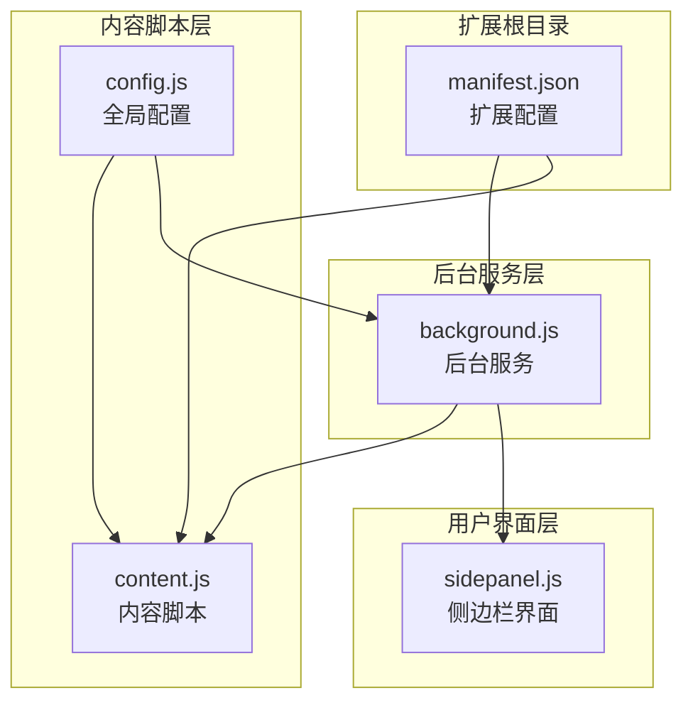
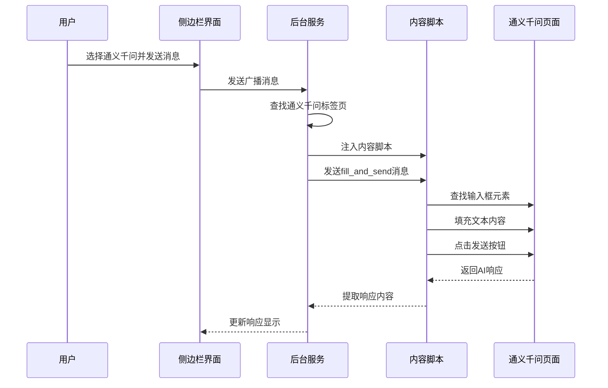
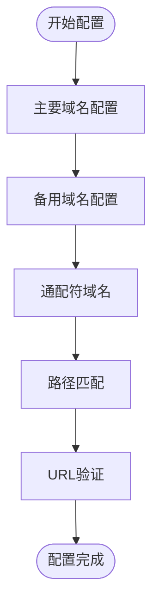
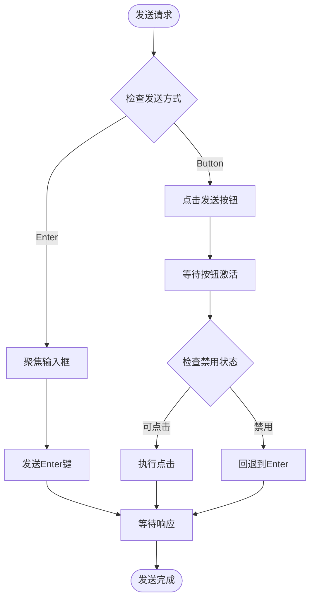
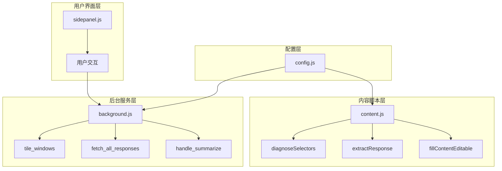

# 通义千问平台集成

<cite>
**本文档引用的文件**
- [manifest.json](file://manifest.json)
- [config.js](file://src/config.js)
- [background.js](file://src/background.js)
- [content.js](file://src/content/content.js)
- [sidepanel.js](file://src/sidepanel/sidepanel.js)
- [README.md](file://README.md)
- [BUGFIX_v1.7.4.md](file://BUGFIX_v1.7.4.md)
</cite>

## 目录
1. [简介](#简介)
2. [项目结构](#项目结构)
3. [核心组件](#核心组件)
4. [架构概览](#架构概览)
5. [详细组件分析](#详细组件分析)
6. [依赖关系分析](#依赖关系分析)
7. [性能考虑](#性能考虑)
8. [故障排除指南](#故障排除指南)
9. [结论](#结论)

## 简介
本文档深入分析了AI Multiverse Chat扩展中通义千问平台的集成实现。该扩展是一个轻量级Chrome扩展，支持同时向多个AI聊天机器人发送消息，包括通义千问、Grok、Kimi、DeepSeek、ChatGPT等平台。本文档重点关注通义千问的复杂配置实现，特别是其URL模式配置、多层级选择器策略、输入框和发送按钮的配置，以及Enter键发送机制的设计原理。

## 项目结构
AI Multiverse Chat扩展采用模块化架构，主要包含以下核心文件：



**图表来源**
- [manifest.json](file://manifest.json#L1-L79)
- [config.js](file://src/config.js#L1-L204)
- [content.js](file://src/content/content.js#L1-100)
- [background.js](file://src/background.js#L1-100)

**章节来源**
- [manifest.json](file://manifest.json#L1-L79)
- [README.md](file://README.md#L20-L29)

## 核心组件
通义千问集成的核心组件包括：

### 配置管理组件
通义千问的配置位于全局配置文件中，包含完整的URL模式、选择器配置和发送机制设置。

### 内容脚本组件
负责在通义千问页面中执行自动化操作，包括输入填充、文件上传和消息发送。

### 后台服务组件
协调多个通义千问实例的管理，处理标签页生命周期和消息路由。

### 用户界面组件
提供侧边栏界面，允许用户选择通义千问作为目标平台。

**章节来源**
- [config.js](file://src/config.js#L110-L162)
- [content.js](file://src/content/content.js#L323-L418)
- [background.js](file://src/background.js#L133-L197)

## 架构概览
通义千问集成采用分层架构设计，确保高可靠性和可维护性：



**图表来源**
- [background.js](file://src/background.js#L718-L786)
- [content.js](file://src/content/content.js#L200-L216)
- [sidepanel.js](file://src/sidepanel/sidepanel.js#L47-L62)

## 详细组件分析

### URL模式配置分析
通义千问的URL模式配置体现了对多域名支持的精心设计：

#### 主要URL模式
- `*://chat.qwen.ai/*` - 主要域名
- `*://tongyi.aliyun.com/*` - 阿里云域名

#### 备用URL模式
- `*://www.qianwen.com/*` - 问答网站域名
- `*://*.qwen.ai/*` - 通配符域名
- `*://*.aliyun.com/tongyi*` - 阿里云通义路径

#### 配置实现特点


**图表来源**
- [config.js](file://src/config.js#L113-L121)

**章节来源**
- [config.js](file://src/config.js#L113-L121)
- [manifest.json](file://manifest.json#L19-L32)

### 选择器策略分析
通义千问的选择器配置展现了多层次的容错设计：

#### 输入框选择器
```javascript
input: [
    'div[role="textbox"]',           // 主要输入框
    'div[data-placeholder*="千问"]',  // 占位符匹配
    'div[data-slate-editor="true"]',  // Slate编辑器
    'textarea#msg-input',            // 特定ID
    'textarea'                       // 通用文本域
]
```

#### 发送按钮选择器
```javascript
button: [
    '.text-area-slot-container div[style*="background-color"]',  // 背景色容器
    '.text-area-slot-container div[class*="view-container"]',   // 视图容器
    'div.text-area-slot-container div:has(svg)',               // 包含SVG的div
    'div[class*="operateBtn"]',                               // 操作按钮
    '[data-icon-type="qwpcicon-sendChat"]',                   // 图标类型
    'span[data-icon-type="qwpcicon-sendChat"]',               // 图标类型
    'button.ant-btn-primary',                                 // 主要按钮
    '.send-btn-ZaDDJC',                                       // 特定类名
    'div[class*="send"] svg',                                 // 发送相关SVG
    'button:not([disabled]) svg'                              // 非禁用按钮
]
```

#### 响应内容选择器
```javascript
response: [
    'div[class*="answer-content"]',      // 答案内容
    '.tongyi-markdown',                 // 通义Markdown
    '.markdown-body',                   // Markdown主体
    'div[class*="message-content"]',    // 消息内容
    'div[class*="assistant-content"]',  // 助手内容
    'div[class*="bot-content"]',        // 机器人内容
    'div[class*="rich-text"]',         // 富文本
    'div[data-content]',               // 数据内容
    '.message.bubble .content',        // 消息气泡
    '[class*="answer"] [class*="content"]' // 通用答案内容
]
```

**章节来源**
- [config.js](file://src/config.js#L123-L156)

### Enter键发送机制分析
通义千问采用Enter键发送机制的原因和实现原理：

#### 设计原因
1. **稳定性考虑** - 避免依赖动态变化的按钮状态
2. **兼容性** - 适用于各种UI状态变化
3. **可靠性** - 减少按钮点击失败的情况

#### 实现原理


**图表来源**
- [content.js](file://src/content/content.js#L526-L565)

**章节来源**
- [config.js](file://src/config.js#L158-L159)
- [content.js](file://src/content/content.js#L526-L565)

### 调试工具和优化策略
系统提供了完善的调试工具和优化策略：

#### 诊断工具
```javascript
// 诊断选择器功能
function diagnoseSelectors(provider) {
    // 遍历所有响应选择器
    // 统计每个选择器的匹配数量
    // 返回最佳选择器和匹配结果
}
```

#### 优化策略
1. **多级选择器** - 从具体到通用的渐进式匹配
2. **文本长度验证** - 选择最长的有效内容
3. **超时重试机制** - 处理异步UI加载
4. **智能回退** - 失败时自动尝试备用方案

**章节来源**
- [content.js](file://src/content/content.js#L127-L197)
- [BUGFIX_v1.7.4.md](file://BUGFIX_v1.7.4.md#L236-L269)

## 依赖关系分析



**图表来源**
- [config.js](file://src/config.js#L1-L204)
- [content.js](file://src/content/content.js#L1-L216)
- [background.js](file://src/background.js#L133-L376)
- [sidepanel.js](file://src/sidepanel/sidepanel.js#L41-L62)

**章节来源**
- [config.js](file://src/config.js#L1-L204)
- [background.js](file://src/background.js#L133-L376)

## 性能考虑
通义千问集成在性能方面采用了多项优化措施：

### 异步处理优化
- **延迟机制** - 合理的等待间隔减少资源消耗
- **超时控制** - 防止无限等待占用资源
- **重试策略** - 智能重试避免频繁失败

### 内存管理
- **选择器缓存** - 避免重复查询DOM
- **事件清理** - 及时移除监听器
- **资源释放** - 及时清理临时对象

### 网络优化
- **批量操作** - 同时处理多个实例
- **连接复用** - 减少标签页创建开销
- **智能发现** - 快速定位现有标签页

## 故障排除指南

### 常见问题及解决方案

#### 1. 选择器失效
**症状**：无法找到输入框或发送按钮
**解决方案**：
- 使用诊断工具检查选择器匹配情况
- 更新配置文件中的选择器列表
- 检查网站DOM结构变化

#### 2. 发送按钮不可用
**症状**：发送按钮始终禁用状态
**解决方案**：
- 切换到Enter键发送模式
- 增加等待时间
- 检查网络连接状态

#### 3. 响应提取不完整
**症状**：只能提取到部分AI回复
**解决方案**：
- 增加备用响应选择器
- 使用文本长度验证机制
- 检查Markdown渲染问题

#### 4. 多域名支持问题
**症状**：某些域名无法识别
**解决方案**：
- 检查URL模式配置
- 验证域名匹配规则
- 更新通配符配置

**章节来源**
- [BUGFIX_v1.7.4.md](file://BUGFIX_v1.7.4.md#L200-L233)

### 调试技巧
1. **使用浏览器开发者工具**观察DOM变化
2. **启用详细日志输出**跟踪执行流程
3. **测试不同域名**验证配置有效性
4. **监控内存使用**防止泄漏

## 结论
通义千问平台集成为AI Multiverse Chat扩展提供了高度可靠的多平台支持。通过精心设计的URL模式配置、多层次选择器策略、稳定的Enter键发送机制，以及完善的调试工具，该集成实现了对通义千问平台的全面支持。

关键优势包括：
- **多域名支持**：覆盖主要和备用域名
- **容错设计**：多层次选择器确保稳定性
- **智能发送**：Enter键机制提高可靠性
- **完善调试**：诊断工具便于问题排查
- **性能优化**：异步处理和资源管理

该集成展示了现代浏览器扩展开发的最佳实践，为类似平台的集成提供了宝贵的参考经验。