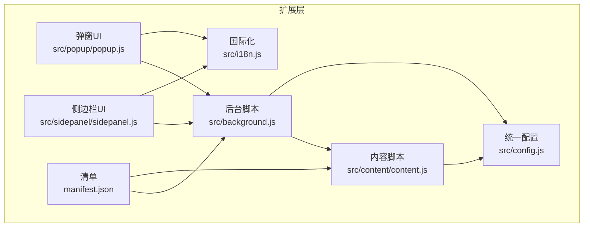
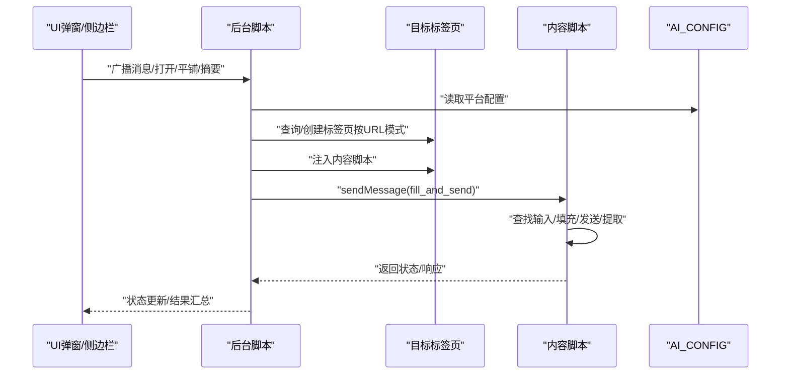
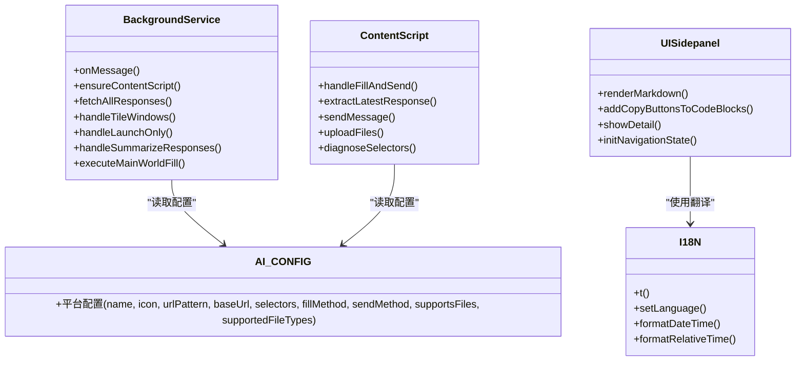
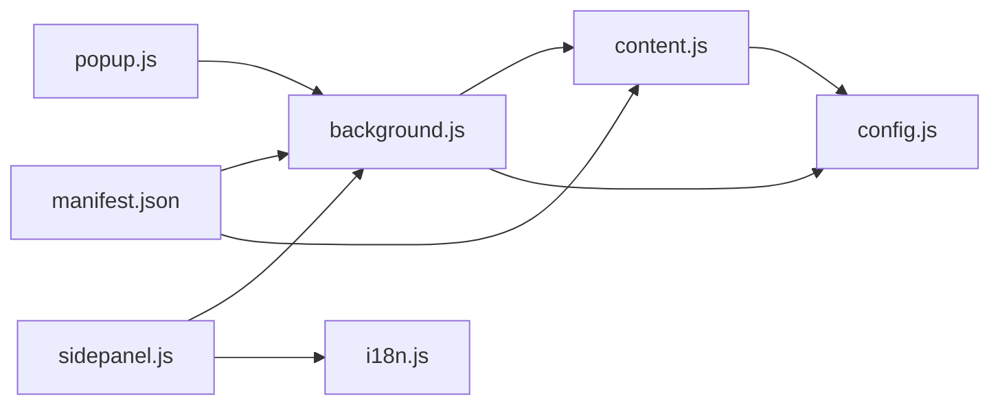

# 集成架构设计

<cite>
**本文引用的文件**
- [src/config.js](file://src/config.js)
- [src/background.js](file://src/background.js)
- [src/content/content.js](file://src/content/content.js)
- [src/sidepanel/sidepanel.js](file://src/sidepanel/sidepanel.js)
- [src/popup/popup.js](file://src/popup/popup.js)
- [src/i18n.js](file://src/i18n.js)
- [manifest.json](file://manifest.json)
- [README.md](file://README.md)
</cite>

## 目录
1. [简介](#简介)
2. [项目结构](#项目结构)
3. [核心组件](#核心组件)
4. [架构总览](#架构总览)
5. [详细组件分析](#详细组件分析)
6. [依赖关系分析](#依赖关系分析)
7. [性能考虑](#性能考虑)
8. [故障排查指南](#故障排查指南)
9. [结论](#结论)
10. [附录](#附录)

## 简介
本文件面向AI平台集成架构，围绕统一配置接口的设计理念进行系统化技术文档梳理。重点包括：
- 配置结构标准化：统一平台配置数据模型、选择器映射规则、发送方法策略
- 选择器规范化：多平台选择器集合、备用选择器设计与回退策略
- 发送方法抽象化：主世界填充、内容脚本填充、按钮点击、键盘回车等策略
- AI_CONFIG全局配置对象：平台配置的数据模型、URL模式匹配、继承与回退机制
- 配置验证、错误处理与调试支持：诊断工具、超时与重试、日志与通知

## 项目结构
该项目采用Chrome扩展三段式架构：后台服务线程、内容脚本、UI界面（弹窗/侧边栏）。核心文件如下：
- 配置层：src/config.js（统一配置）
- 后台控制层：src/background.js（消息分发、窗口管理、注入与执行）
- 内容脚本层：src/content/content.js（页面自动化、选择器提取、文件上传）
- UI层：src/popup/popup.js（弹窗）、src/sidepanel/sidepanel.js（侧边栏）、src/i18n.js（国际化）
- 扩展清单：manifest.json（权限、匹配规则、注入时机）

图表来源
- [src/background.js](file://src/background.js#L1-L120)
- [src/content/content.js](file://src/content/content.js#L1-L60)
- [src/config.js](file://src/config.js#L1-L40)
- [src/popup/popup.js](file://src/popup/popup.js#L1-L40)
- [src/sidepanel/sidepanel.js](file://src/sidepanel/sidepanel.js#L1-L60)
- [src/i18n.js](file://src/i18n.js#L1-L40)
- [manifest.json](file://manifest.json#L1-L40)

章节来源
- [README.md](file://README.md#L20-L30)
- [manifest.json](file://manifest.json#L1-L40)

## 核心组件
- AI_CONFIG全局配置对象：集中管理各AI平台的名称、图标、URL模式、基础URL、选择器集合、填充方式、发送方式、文件上传能力与支持类型等。
- 后台服务线程：负责消息监听、窗口发现与创建、内容脚本注入、跨标签通信、批量广播、窗口平铺、摘要生成等。
- 内容脚本：在目标AI网页内运行，负责输入填充、发送、响应提取、文件上传、选择器诊断、思维块过滤等。
- UI层：弹窗与侧边栏提供交互入口，支持模型选择、文件拖拽上传、响应查看、摘要设置等。
- 国际化：提供中英文双语文案与日期时间格式化。

章节来源
- [src/config.js](file://src/config.js#L5-L200)
- [src/background.js](file://src/background.js#L133-L197)
- [src/content/content.js](file://src/content/content.js#L199-L216)
- [src/sidepanel/sidepanel.js](file://src/sidepanel/sidepanel.js#L41-L60)
- [src/i18n.js](file://src/i18n.js#L6-L346)

## 架构总览
整体流程分为“配置驱动的统一接口 + 后台编排 + 内容脚本自动化”的三层协作：
- 配置驱动：AI_CONFIG统一描述平台差异，后台与内容脚本均以配置为依据进行选择器匹配与动作执行。
- 后台编排：根据配置进行URL模式匹配定位目标标签页，必要时创建新标签页并注入内容脚本，随后派发填充与发送指令。
- 内容脚本自动化：在页面内执行输入填充、发送、响应提取、文件上传等操作，确保与平台UI状态一致。

图表来源
- [src/background.js](file://src/background.js#L138-L197)
- [src/background.js](file://src/background.js#L200-L268)
- [src/content/content.js](file://src/content/content.js#L199-L216)
- [src/content/content.js](file://src/content/content.js#L322-L418)

## 详细组件分析

### 统一配置接口（AI_CONFIG）设计
- 数据模型标准化
  - 平台字段：name、icon、urlPattern/urlPatternAlt/urlPatterns、baseUrl
  - 选择器集合：input、button、response、fileUploadButton、fileUploadInput
  - 行为策略：fillMethod（主世界/内容脚本）、sendMethod（button/enter/form）
  - 文件能力：supportsFiles、supportedFileTypes
- URL模式匹配与回退
  - 支持单个urlPattern、备用urlPatternAlt、多模式urlPatterns数组
  - 后台与内容脚本均采用去重后的唯一模式列表进行匹配
- 选择器规范化与备用策略
  - 每个平台提供多条候选选择器，按“可见优先、宽松回退”策略查找
  - 响应提取采用“最后一条匹配元素”作为最新响应，并提供通用回退选择器
- 发送方法抽象化
  - button：优先点击发送按钮，支持禁用态检测与回退
  - enter：发送回车键，针对部分平台稳定性更高
  - form：表单提交（少数平台）
- 填充方法抽象化
  - 主世界填充：通过后台注入脚本在页面主世界执行，适配React/Tiptap等复杂编辑器
  - 内容脚本填充：直接在内容脚本中操作DOM，避免事件链冲突
- 文件上传抽象化
  - 按平台分别实现上传策略，支持类型过滤与超时重试

章节来源
- [src/config.js](file://src/config.js#L5-L199)
- [src/background.js](file://src/background.js#L216-L237)
- [src/content/content.js](file://src/content/content.js#L574-L590)
- [src/content/content.js](file://src/content/content.js#L466-L565)
- [src/content/content.js](file://src/content/content.js#L616-L742)

### 后台服务线程（消息编排与窗口管理）
- 消息监听与动作分发
  - 广播消息、窗口平铺、仅启动指定平台、关闭全部窗口、打开弹窗、诊断选择器、提取响应、摘要生成、主世界填充请求
- 窗口发现与创建
  - 优先使用已跟踪的窗口ID，其次按URL模式匹配，最后创建新窗口并等待加载
- 内容脚本注入与校验
  - 通过ping检测是否已注入，否则按顺序注入config.js与content.js
- 状态通知与国际化
  - 通过runtime消息向UI推送状态，配合i18n翻译

章节来源
- [src/background.js](file://src/background.js#L138-L197)
- [src/background.js](file://src/background.js#L200-L268)
- [src/background.js](file://src/background.js#L527-L643)
- [src/background.js](file://src/background.js#L656-L716)
- [src/background.js](file://src/background.js#L718-L786)
- [src/i18n.js](file://src/i18n.js#L355-L383)

### 内容脚本（页面自动化与响应提取）
- 输入填充
  - 支持主世界填充与内容脚本填充两种路径，针对不同编辑器（textarea、input、contenteditable、Tiptap/ProseMirror）采用差异化策略
- 发送流程
  - 按平台策略点击发送按钮，检测禁用态；异步UI平台在按钮激活前回退至Enter键
- 响应提取
  - 逐条尝试响应选择器，取最后一条有效元素；若无则使用通用回退选择器
- 文件上传
  - 按平台策略点击上传按钮或直接设置文件输入，支持类型过滤与超时重试
- 诊断工具
  - 诊断选择器有效性，输出命中数量、文本长度、预览与是否有效

章节来源
- [src/content/content.js](file://src/content/content.js#L322-L418)
- [src/content/content.js](file://src/content/content.js#L466-L565)
- [src/content/content.js](file://src/content/content.js#L218-L320)
- [src/content/content.js](file://src/content/content.js#L616-L742)
- [src/content/content.js](file://src/content/content.js#L126-L197)

### UI层（弹窗与侧边栏）
- 弹窗
  - 选择模型、输入消息、发送、显示状态日志
- 侧边栏
  - 多标签页（聊天/响应）、历史记录、拖拽上传、响应详情、摘要设置、主题与语言切换
- 国际化
  - t函数提供文案替换，支持相对时间与日期格式化

章节来源
- [src/popup/popup.js](file://src/popup/popup.js#L1-L61)
- [src/sidepanel/sidepanel.js](file://src/sidepanel/sidepanel.js#L41-L60)
- [src/sidepanel/sidepanel.js](file://src/sidepanel/sidepanel.js#L530-L641)
- [src/i18n.js](file://src/i18n.js#L355-L383)

### 类关系图（代码级）

图表来源
- [src/config.js](file://src/config.js#L5-L199)
- [src/background.js](file://src/background.js#L138-L197)
- [src/content/content.js](file://src/content/content.js#L199-L216)
- [src/sidepanel/sidepanel.js](file://src/sidepanel/sidepanel.js#L64-L124)
- [src/i18n.js](file://src/i18n.js#L355-L383)

## 依赖关系分析
- manifest.json声明权限与主机权限，content_scripts在目标站点注入配置与内容脚本
- 后台脚本通过chrome.runtime与chrome.tabs、chrome.windows、chrome.scripting等API协调
- 内容脚本通过chrome.runtime与后台通信，执行填充、发送、提取与诊断
- UI层通过chrome.runtime与后台通信，接收状态更新

图表来源
- [manifest.json](file://manifest.json#L12-L68)
- [src/background.js](file://src/background.js#L69-L74)
- [src/content/content.js](file://src/content/content.js#L1-L10)
- [src/popup/popup.js](file://src/popup/popup.js#L1-L20)
- [src/sidepanel/sidepanel.js](file://src/sidepanel/sidepanel.js#L1-L20)
- [src/i18n.js](file://src/i18n.js#L494-L504)

章节来源
- [manifest.json](file://manifest.json#L12-L68)
- [src/background.js](file://src/background.js#L69-L74)
- [src/content/content.js](file://src/content/content.js#L1-L10)

## 性能考虑
- 选择器查找策略
  - 可见优先：先在可见元素中查找，再放宽条件，减少误匹配与无效DOM遍历
  - 去重URL模式：对URL模式进行去重，避免重复查询
- 注入与等待
  - 注入失败快速回退，避免阻塞主线程
  - 等待页面加载采用超时与清理机制，防止无限等待
- 并行处理
  - 广播与窗口平铺采用Promise.allSettled并行执行，提升吞吐
- 重试与超时
  - 文件上传采用指数退避与超时控制，提高成功率
- 事件风暴防护
  - 主世界填充与内容脚本填充策略分离，避免事件链重复触发

章节来源
- [src/content/content.js](file://src/content/content.js#L574-L590)
- [src/background.js](file://src/background.js#L222-L237)
- [src/background.js](file://src/background.js#L678-L716)
- [src/background.js](file://src/background.js#L718-L721)
- [src/content/content.js](file://src/content/content.js#L640-L672)

## 故障排查指南
- 诊断选择器
  - 后台与内容脚本均提供诊断工具，输出每条选择器命中数、文本长度、预览与有效性
- 日志与通知
  - 后台与内容脚本广泛使用console输出，UI通过状态面板展示错误与成功信息
- 超时与重试
  - 页面加载、按钮等待、文件上传均有超时与重试机制
- 常见问题定位
  - 无法找到输入框：检查AI_CONFIG中input选择器是否正确，或使用诊断工具验证
  - 发送按钮不可用：检查禁用态检测与回退策略（Enter键）
  - 文件上传失败：检查supportedFileTypes与平台上传策略

章节来源
- [src/content/content.js](file://src/content/content.js#L126-L197)
- [src/background.js](file://src/background.js#L163-L169)
- [src/background.js](file://src/background.js#L368-L376)
- [src/content/content.js](file://src/content/content.js#L640-L672)

## 结论
本项目通过统一配置接口实现了对多AI平台的标准化接入，结合后台编排与内容脚本自动化，形成“配置驱动 + 并行执行 + 容错回退”的稳健架构。其设计要点包括：
- 配置结构标准化：统一平台元数据、选择器集合、行为策略与文件能力
- 选择器规范化：多候选与回退策略，兼顾稳定性与兼容性
- 发送方法抽象化：按钮点击、键盘回车、表单提交的策略化封装
- URL模式匹配与回退：多模式支持与去重，提升发现成功率
- 配置验证与调试：诊断工具、日志与通知，便于问题定位
- 性能与可靠性：并行处理、超时与重试、事件风暴防护

## 附录
- 扩展清单权限与匹配规则：hosts权限覆盖所有支持平台域名，content_scripts在目标站点注入
- 国际化：提供中英文文案与日期时间格式化，UI层通过t函数渲染

章节来源
- [manifest.json](file://manifest.json#L19-L68)
- [src/i18n.js](file://src/i18n.js#L355-L383)