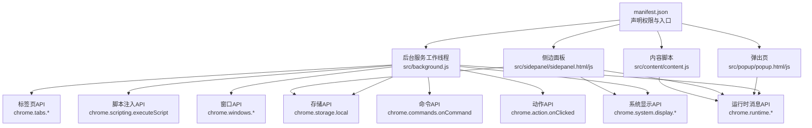
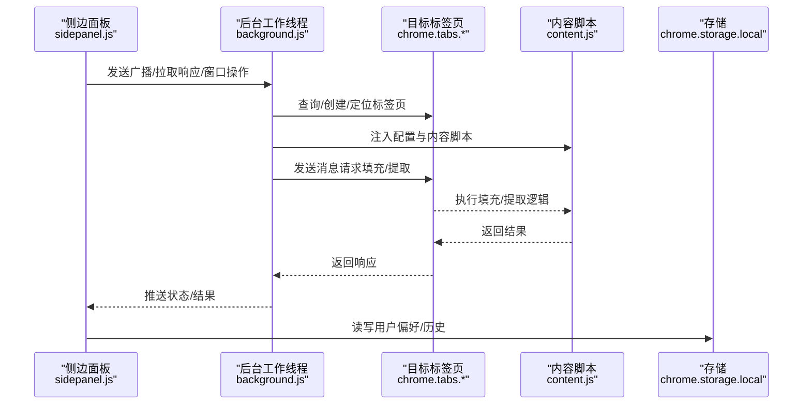
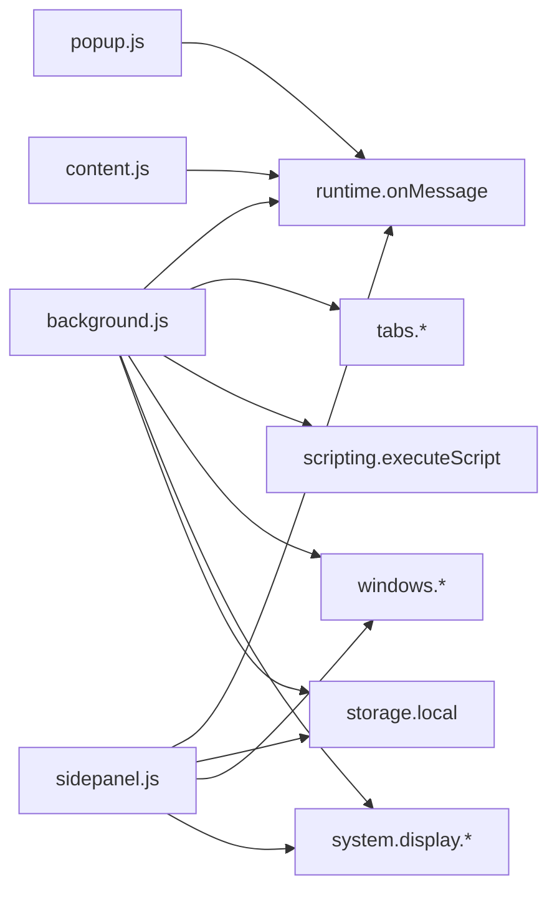

# API参考

<cite>
**本文档引用的文件**
- [manifest.json](file://manifest.json)
- [src/background.js](file://src/background.js)
- [src/popup/popup.js](file://src/popup/popup.js)
- [src/sidepanel/sidepanel.js](file://src/sidepanel/sidepanel.js)
- [src/content/content.js](file://src/content/content.js)
- [src/config.js](file://src/config.js)
</cite>

## 目录
1. [简介](#简介)
2. [项目结构](#项目结构)
3. [核心组件](#核心组件)
4. [架构总览](#架构总览)
5. [详细组件分析](#详细组件分析)
6. [依赖关系分析](#依赖关系分析)
7. [性能考量](#性能考量)
8. [故障排查指南](#故障排查指南)
9. [结论](#结论)
10. [附录](#附录)

## 简介
本API参考文档面向Chrome扩展开发者与使用者，系统梳理了本项目中涉及的Chrome扩展API接口与内部通信机制，覆盖以下主题：
- Chrome扩展核心API：tabs、storage、scripting、windows、action、commands、runtime、system.display、i18n等
- 扩展内部API：消息传递接口、配置管理API、UI控制API
- 配置选项参考：manifest.json配置项、平台配置参数、用户设置选项
- 事件列表与回调：扩展生命周期事件、用户交互事件、系统通知事件
- 方法签名、参数类型、返回值与使用示例
- 版本兼容性与迁移建议

## 项目结构
该项目采用多页面架构，包含后台服务工作线程、弹出页、侧边面板以及内容脚本，配合统一配置模块实现跨站点AI平台的自动化交互。

图表来源
- [manifest.json](file://manifest.json#L1-L79)
- [src/background.js](file://src/background.js#L1-L120)
- [src/popup/popup.js](file://src/popup/popup.js#L1-L61)
- [src/sidepanel/sidepanel.js](file://src/sidepanel/sidepanel.js#L1-L120)
- [src/content/content.js](file://src/content/content.js#L1-L40)

章节来源
- [manifest.json](file://manifest.json#L1-L79)

## 核心组件
- 后台服务工作线程：负责窗口管理、标签页调度、脚本注入、消息路由、系统显示信息获取与存储持久化。
- 弹出页：轻量UI，用于快速广播消息至选定AI平台。
- 侧边面板：主要控制中心，支持多模型对比、响应提取、摘要生成、主题语言切换、历史记录管理、窗口平铺与关闭等。
- 内容脚本：注入到各AI平台页面，负责输入填充、文件上传、发送消息、响应提取与清洗。
- 统一配置模块：集中定义各AI平台的选择器、发送方式、文件支持等配置。

章节来源
- [src/background.js](file://src/background.js#L1-L120)
- [src/popup/popup.js](file://src/popup/popup.js#L1-L61)
- [src/sidepanel/sidepanel.js](file://src/sidepanel/sidepanel.js#L1-L120)
- [src/content/content.js](file://src/content/content.js#L1-L40)
- [src/config.js](file://src/config.js#L1-L60)

## 架构总览
扩展通过后台工作线程协调各组件，使用消息传递实现UI与内容脚本之间的解耦。侧边面板与弹出页通过运行时消息与后台交互，后台再通过标签页与脚本注入API与目标站点交互。

图表来源
- [src/sidepanel/sidepanel.js](file://src/sidepanel/sidepanel.js#L1343-L1407)
- [src/background.js](file://src/background.js#L138-L197)
- [src/content/content.js](file://src/content/content.js#L199-L216)

## 详细组件分析

### 后台服务工作线程 API
- 生命周期与入口
  - 监听扩展命令与动作点击，控制弹出窗口的打开/最小化/聚焦。
  - 监听运行时消息，分发广播、窗口平铺、仅启动指定平台、关闭全部窗口、诊断选择器、提取响应、摘要生成、主世界填充等任务。
- 标签页API
  - 查询、创建、更新标签页与窗口，确保内容脚本注入与页面加载完成。
- 脚本注入API
  - 在目标标签页执行脚本，支持在MAIN世界执行特定填充逻辑。
- 存储API
  - 本地存储语言、主题、布局、历史等用户偏好。
- 系统显示API
  - 获取显示器信息，实现跨屏窗口平铺与记忆上次平铺显示器。
- 命令与动作API
  - 监听快捷键命令与浏览器动作点击事件。

方法与参数示例（路径引用）
- 打开/切换弹出窗口
  - 路径：[src/background.js](file://src/background.js#L10-L59)
  - 参数：无（内部维护窗口ID）
- 广播消息至多个平台
  - 路径：[src/background.js](file://src/background.js#L138-L197)
  - 请求体：{ action: "broadcast_message", message, providers, files? }
  - 返回：异步响应（sendResponse）
- 窗口平铺
  - 路径：[src/background.js](file://src/background.js#L528-L643)
  - 请求体：{ action: "tile_windows", providers }
- 仅启动指定平台
  - 路径：[src/background.js](file://src/background.js#L792-L840)
  - 请求体：{ action: "launch_only_providers", providers }
- 关闭全部窗口
  - 路径：[src/background.js](file://src/background.js#L138-L197)
  - 请求体：{ action: "close_all_windows" }
- 诊断选择器
  - 路径：[src/background.js](file://src/background.js#L271-L296)
  - 请求体：{ action: "diagnose_selectors", provider }
- 提取所有响应
  - 路径：[src/background.js](file://src/background.js#L199-L268)
  - 请求体：{ action: "fetch_all_responses", providers }
- 摘要生成
  - 路径：[src/background.js](file://src/background.js#L298-L376)
  - 请求体：{ action: "summarize_responses", provider, prompt }
- 主世界填充
  - 路径：[src/background.js](file://src/background.js#L378-L526)
  - 请求体：{ action: "perform_main_world_fill", selector, text, provider }

章节来源
- [src/background.js](file://src/background.js#L1-L120)
- [src/background.js](file://src/background.js#L138-L197)
- [src/background.js](file://src/background.js#L199-L268)
- [src/background.js](file://src/background.js#L271-L296)
- [src/background.js](file://src/background.js#L298-L376)
- [src/background.js](file://src/background.js#L378-L526)
- [src/background.js](file://src/background.js#L528-L643)
- [src/background.js](file://src/background.js#L792-L840)

### 弹出页 API
- 功能：选择平台、发送消息、接收状态更新。
- 交互流程：读取本地存储的平台选择，发送广播消息，监听后台状态推送。

方法与参数示例（路径引用）
- 发送广播
  - 路径：[src/popup/popup.js](file://src/popup/popup.js#L16-L44)
  - 请求体：{ action: "broadcast_message", message, providers }
- 接收状态更新
  - 路径：[src/popup/popup.js](file://src/popup/popup.js#L47-L59)
  - 请求体：{ action: "status_update", status, provider, message }

章节来源
- [src/popup/popup.js](file://src/popup/popup.js#L1-L61)

### 侧边面板 API
- 功能：多模型对比展示、响应提取、摘要设置、主题语言切换、历史记录管理、窗口操作、文件上传预处理。
- 交互流程：用户输入与选择平台后，通过运行时消息与后台交互，后台协调内容脚本完成填充与发送，随后提取响应并渲染。

方法与参数示例（路径引用）
- 发送消息
  - 路径：[src/sidepanel/sidepanel.js](file://src/sidepanel/sidepanel.js#L1343-L1407)
  - 请求体：{ action: "broadcast_message", message, files, providers }
- 拉取响应
  - 路径：[src/sidepanel/sidepanel.js](file://src/sidepanel/sidepanel.js#L1700-L1721)
  - 请求体：{ action: "fetch_all_responses", providers }
- 关闭全部窗口
  - 路径：[src/sidepanel/sidepanel.js](file://src/sidepanel/sidepanel.js#L524-L528)
  - 请求体：{ action: "close_all_windows" }
- 窗口平铺
  - 路径：[src/sidepanel/sidepanel.js](file://src/sidepanel/sidepanel.js#L1282-L1285)
  - 请求体：{ action: "tile_windows", providers }
- 仅启动平台
  - 路径：[src/sidepanel/sidepanel.js](file://src/sidepanel/sidepanel.js#L1276-L1280)
  - 请求体：{ action: "launch_only_providers", providers }
- 摘要设置
  - 路径：[src/sidepanel/sidepanel.js](file://src/sidepanel/sidepanel.js#L1215-L1275)
  - 请求体：{ action: "summarize_responses", provider, prompt }

章节来源
- [src/sidepanel/sidepanel.js](file://src/sidepanel/sidepanel.js#L1276-L1285)
- [src/sidepanel/sidepanel.js](file://src/sidepanel/sidepanel.js#L1343-L1407)
- [src/sidepanel/sidepanel.js](file://src/sidepanel/sidepanel.js#L1700-L1721)
- [src/sidepanel/sidepanel.js](file://src/sidepanel/sidepanel.js#L1215-L1275)

### 内容脚本 API
- 功能：在目标站点页面内执行输入填充、文件上传、发送消息、响应提取与清洗。
- 交互流程：接收后台消息，定位输入框，填充文本或文件，触发发送，提取最新响应并清洗思考内容。

方法与参数示例（路径引用）
- 响应提取
  - 路径：[src/content/content.js](file://src/content/content.js#L218-L320)
  - 请求体：{ action: "extract_response", provider }
- 填充并发送
  - 路径：[src/content/content.js](file://src/content/content.js#L322-L418)
  - 请求体：{ action: "fill_and_send", text, provider, files? }
- 诊断选择器
  - 路径：[src/content/content.js](file://src/content/content.js#L126-L197)
  - 请求体：{ action: "diagnose_selectors", provider }
- 主世界填充请求
  - 路径：[src/content/content.js](file://src/content/content.js#L420-L432)
  - 请求体：{ action: "perform_main_world_fill", selector, text, provider }

章节来源
- [src/content/content.js](file://src/content/content.js#L126-L197)
- [src/content/content.js](file://src/content/content.js#L218-L320)
- [src/content/content.js](file://src/content/content.js#L322-L418)
- [src/content/content.js](file://src/content/content.js#L420-L432)

### 配置管理 API
- 统一配置模块集中定义各AI平台的选择器、发送方式、文件支持等。
- 侧边面板与后台均依赖此配置进行UI呈现与业务逻辑。

配置项示例（路径引用）
- 平台配置结构
  - 路径：[src/config.js](file://src/config.js#L5-L199)
  - 字段：name、icon、urlPattern、baseUrl、selectors、fillMethod、sendMethod、supportsFiles、supportedFileTypes

章节来源
- [src/config.js](file://src/config.js#L1-L204)

### UI控制 API
- 主题与语言切换
  - 路径：[src/sidepanel/sidepanel.js](file://src/sidepanel/sidepanel.js#L1833-L1890)
  - 存储键：theme、lang
- 历史记录管理
  - 路径：[src/sidepanel/sidepanel.js](file://src/sidepanel/sidepanel.js#L1409-L1421)
  - 存储键：chat_history
- 文件上传预处理
  - 路径：[src/sidepanel/sidepanel.js](file://src/sidepanel/sidepanel.js#L464-L495)
  - 存储键：selectedFiles（内存数组，不持久化）

章节来源
- [src/sidepanel/sidepanel.js](file://src/sidepanel/sidepanel.js#L1833-L1890)
- [src/sidepanel/sidepanel.js](file://src/sidepanel/sidepanel.js#L1409-L1421)
- [src/sidepanel/sidepanel.js](file://src/sidepanel/sidepanel.js#L464-L495)

## 依赖关系分析

图表来源
- [src/background.js](file://src/background.js#L138-L197)
- [src/popup/popup.js](file://src/popup/popup.js#L30-L44)
- [src/sidepanel/sidepanel.js](file://src/sidepanel/sidepanel.js#L1276-L1285)
- [src/content/content.js](file://src/content/content.js#L199-L216)

章节来源
- [src/background.js](file://src/background.js#L138-L197)
- [src/popup/popup.js](file://src/popup/popup.js#L30-L44)
- [src/sidepanel/sidepanel.js](file://src/sidepanel/sidepanel.js#L1276-L1285)
- [src/content/content.js](file://src/content/content.js#L199-L216)

## 性能考量
- 标签页加载等待：提供统一的等待函数，避免无限等待与内存泄漏。
- 并行操作：窗口平铺、响应提取等场景采用Promise并行，提升吞吐。
- 事件监听清理：确保监听器在合适时机移除，减少资源占用。
- 选择器诊断：内容脚本提供选择器诊断工具，便于快速定位DOM变化带来的适配问题。

章节来源
- [src/background.js](file://src/background.js#L680-L716)
- [src/background.js](file://src/background.js#L528-L643)
- [src/content/content.js](file://src/content/content.js#L126-L197)

## 故障排查指南
- 脚本注入失败
  - 现象：后台日志提示注入失败，UI显示错误状态。
  - 处理：检查目标站点URL是否匹配、确认内容脚本已注入、查看后台翻译字典键值。
  - 参考路径：[src/background.js](file://src/background.js#L657-L678)
- 页面加载超时
  - 现象：等待页面加载超过阈值，后续操作可能失败。
  - 处理：调整等待时间或检查网络环境。
  - 参考路径：[src/background.js](file://src/background.js#L680-L716)
- 选择器失效
  - 现象：无法定位输入框或发送按钮。
  - 处理：使用诊断工具输出候选选择器与长度，结合平台配置更新。
  - 参考路径：[src/content/content.js](file://src/content/content.js#L126-L197)
- 响应提取为空
  - 现象：未找到有效响应内容。
  - 处理：检查响应选择器、平台配置、是否启用思考内容过滤。
  - 参考路径：[src/content/content.js](file://src/content/content.js#L218-L320)

章节来源
- [src/background.js](file://src/background.js#L657-L678)
- [src/background.js](file://src/background.js#L680-L716)
- [src/content/content.js](file://src/content/content.js#L126-L197)
- [src/content/content.js](file://src/content/content.js#L218-L320)

## 结论
本项目通过后台工作线程统一编排，结合运行时消息与Chrome扩展API，实现了跨站点AI平台的高效交互与管理。配置模块化设计提升了可维护性与可扩展性，UI层提供了丰富的用户控制能力。建议在生产环境中持续关注平台DOM变更与API稳定性，配合诊断工具与日志体系保障用户体验。

## 附录

### Chrome扩展核心API清单
- tabs
  - 查询、创建、更新标签页与窗口
  - 路径：[src/background.js](file://src/background.js#L200-L268)
- scripting
  - 在目标标签页执行脚本（含MAIN世界）
  - 路径：[src/background.js](file://src/background.js#L378-L526)
- storage
  - 本地存储用户偏好、历史、布局
  - 路径：[src/background.js](file://src/background.js#L94-L97)、[src/sidepanel/sidepanel.js](file://src/sidepanel/sidepanel.js#L1409-L1421)
- windows
  - 窗口查询、更新、平铺布局
  - 路径：[src/background.js](file://src/background.js#L528-L643)
- system.display
  - 获取显示器信息，实现跨屏布局
  - 路径：[src/background.js](file://src/background.js#L528-L608)
- runtime
  - 消息监听与发送
  - 路径：[src/background.js](file://src/background.js#L138-L197)、[src/popup/popup.js](file://src/popup/popup.js#L30-L44)、[src/sidepanel/sidepanel.js](file://src/sidepanel/sidepanel.js#L1343-L1407)
- commands
  - 快捷键命令监听
  - 路径：[src/background.js](file://src/background.js#L63-L67)
- action
  - 浏览器动作点击监听
  - 路径：[src/background.js](file://src/background.js#L61)

章节来源
- [src/background.js](file://src/background.js#L138-L197)
- [src/popup/popup.js](file://src/popup/popup.js#L30-L44)
- [src/sidepanel/sidepanel.js](file://src/sidepanel/sidepanel.js#L1343-L1407)

### 配置选项参考
- manifest.json
  - 权限：activeTab、scripting、tabs、storage、system.display
  - 主机权限：多家AI平台域名
  - 行为：动作图标、默认标题、服务工作线程入口、内容脚本匹配规则
  - 路径：[manifest.json](file://manifest.json#L12-L32)、[manifest.json](file://manifest.json#L42-L68)
- 用户设置
  - 语言：lang
  - 主题：theme
  - 选中平台：selected_providers
  - 历史记录：chat_history
  - 路径：[src/background.js](file://src/background.js#L94-L97)、[src/sidepanel/sidepanel.js](file://src/sidepanel/sidepanel.js#L1409-L1421)

章节来源
- [manifest.json](file://manifest.json#L12-L32)
- [manifest.json](file://manifest.json#L42-L68)
- [src/background.js](file://src/background.js#L94-L97)
- [src/sidepanel/sidepanel.js](file://src/sidepanel/sidepanel.js#L1409-L1421)

### 事件与回调参考
- 生命周期事件
  - 扩展安装/更新：无直接监听（可结合后台初始化逻辑）
- 用户交互事件
  - 动作点击：togglePopup
  - 快捷键：_execute_action
  - 弹出页/侧边面板按钮点击：对应UI事件绑定
- 系统通知事件
  - 标签页更新：等待页面加载完成
  - 窗口状态变化：平铺布局时的状态更新
- 回调函数
  - 运行时消息回调：sendResponse
  - 存储读写回调：chrome.storage.local.get/set
  - 路径：[src/background.js](file://src/background.js#L138-L197)、[src/sidepanel/sidepanel.js](file://src/sidepanel/sidepanel.js#L1700-L1721)

章节来源
- [src/background.js](file://src/background.js#L61-L67)
- [src/background.js](file://src/background.js#L138-L197)
- [src/sidepanel/sidepanel.js](file://src/sidepanel/sidepanel.js#L1700-L1721)

### 方法签名与参数类型（示例）
- togglePopup()
  - 用途：切换弹出窗口
  - 参数：无
  - 返回：Promise<void>
  - 路径：[src/background.js](file://src/background.js#L10-L59)
- handleBroadcast(message, providers, files?)
  - 用途：广播消息至多个平台
  - 参数：message(string)、providers(string[])、files?(File[])
  - 返回：Promise<void>
  - 路径：[src/background.js](file://src/background.js#L718-L721)
- fetchAllResponses(providers)
  - 用途：提取所有平台响应
  - 参数：providers(string[])
  - 返回：Promise<Record<string, Response>>
  - 路径：[src/background.js](file://src/background.js#L199-L268)
- handleDiagnoseSelectors(provider)
  - 用途：诊断响应选择器
  - 参数：provider(string)
  - 返回：Promise<Result>
  - 路径：[src/background.js](file://src/background.js#L271-L296)
- handleSummarizeResponses(provider, prompt)
  - 用途：生成摘要
  - 参数：provider(string)、prompt(string)
  - 返回：Promise<void>
  - 路径：[src/background.js](file://src/background.js#L298-L376)
- executeMainWorldFill(tabId, selector, text, provider)
  - 用途：在MAIN世界填充输入
  - 参数：tabId(number)、selector(string)、text(string)、provider(string)
  - 返回：Promise<void>
  - 路径：[src/background.js](file://src/background.js#L378-L526)
- sendMessage()
  - 用途：侧边面板发送消息
  - 参数：无
  - 返回：void
  - 路径：[src/sidepanel/sidepanel.js](file://src/sidepanel/sidepanel.js#L1343-L1407)
- extractLatestResponse(provider)
  - 用途：提取最新响应
  - 参数：provider(string)
  - 返回：Promise<Response>
  - 路径：[src/content/content.js](file://src/content/content.js#L218-L320)

章节来源
- [src/background.js](file://src/background.js#L10-L59)
- [src/background.js](file://src/background.js#L718-L721)
- [src/background.js](file://src/background.js#L199-L268)
- [src/background.js](file://src/background.js#L271-L296)
- [src/background.js](file://src/background.js#L298-L376)
- [src/background.js](file://src/background.js#L378-L526)
- [src/sidepanel/sidepanel.js](file://src/sidepanel/sidepanel.js#L1343-L1407)
- [src/content/content.js](file://src/content/content.js#L218-L320)

### 版本兼容性与迁移指南
- Manifest V3
  - 使用服务工作线程与动态注册内容脚本
  - 路径：[manifest.json](file://manifest.json#L2-L44)
- API稳定性
  - tabs、storage、scripting、windows、system.display、runtime、commands、action均为稳定API
- 迁移建议
  - 保持对DOM选择器的诊断与回退策略
  - 使用统一的等待与超时机制
  - 将平台配置集中管理，便于快速适配

章节来源
- [manifest.json](file://manifest.json#L2-L44)