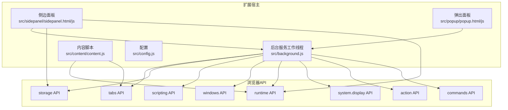
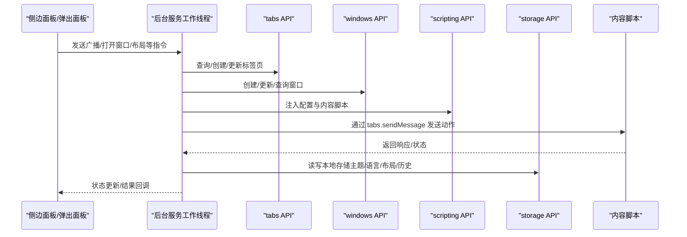
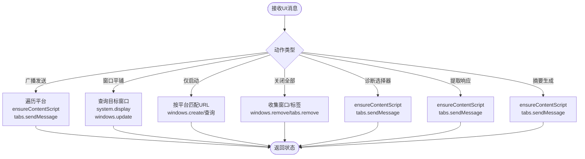
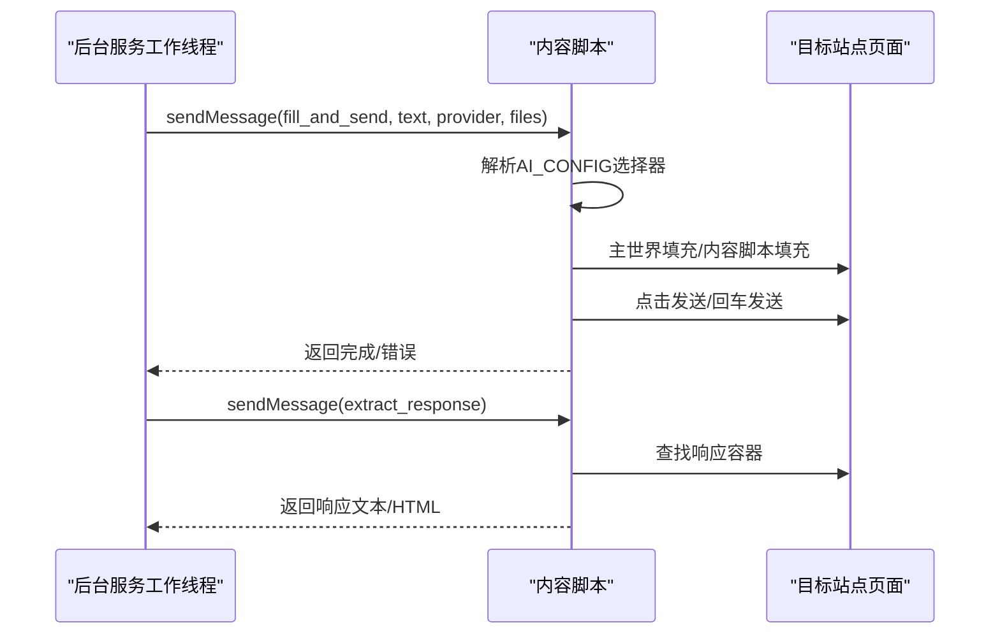
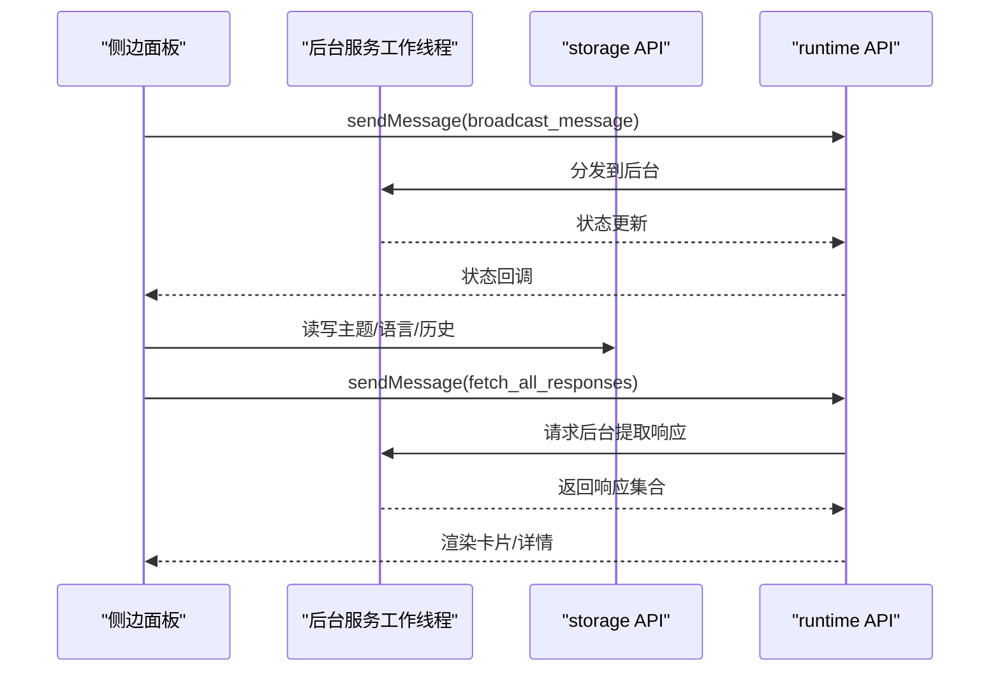
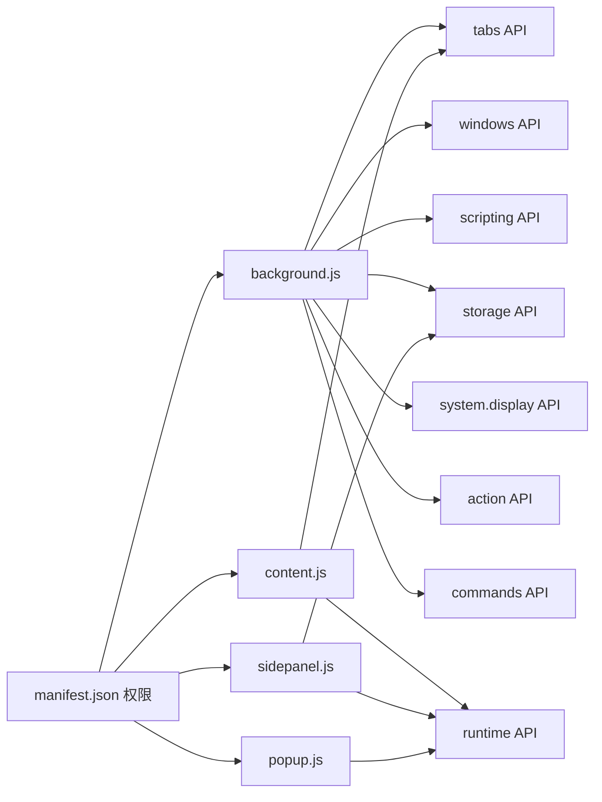

# Chrome扩展API

<cite>
**本文档引用的文件**
- [manifest.json](file://manifest.json)
- [background.js](file://src/background.js)
- [content.js](file://src/content/content.js)
- [config.js](file://src/config.js)
- [sidepanel.js](file://src/sidepanel/sidepanel.js)
- [popup.js](file://src/popup/popup.js)
</cite>

## 目录
1. [简介](#简介)
2. [项目结构](#项目结构)
3. [核心组件](#核心组件)
4. [架构总览](#架构总览)
5. [详细组件分析](#详细组件分析)
6. [依赖关系分析](#依赖关系分析)
7. [性能考量](#性能考量)
8. [故障排查指南](#故障排查指南)
9. [结论](#结论)
10. [附录](#附录)

## 简介
本文件为 AI Multiverse Chat Chrome 扩展的 Chrome 扩展 API 参考文档，系统梳理了扩展在标签页管理、数据存储、脚本注入与窗口管理等核心 API 的使用方式，并结合项目实际场景给出方法签名、参数类型、返回值、权限要求、安全限制、错误处理与最佳实践。读者无需深入技术背景即可理解扩展如何通过 Chrome 扩展 API 实现多 AI 平台并发交互与统一控制。

## 项目结构
该扩展采用 Manifest V3 架构，包含以下关键模块：
- 后台服务工作线程：负责窗口生命周期、标签页发现与注入、跨页面通信与布局记忆。
- 内容脚本：注入到目标 AI 页面，负责输入填充、发送、响应提取与文件上传。
- 侧边面板：提供用户界面，支持主题、语言、历史记录、响应对比、摘要生成等功能。
- 配置：集中管理各 AI 平台的选择器、发送策略、文件上传支持等。

图表来源
- [background.js](file://src/background.js#L1-L120)
- [content.js](file://src/content/content.js#L1-L60)
- [sidepanel.js](file://src/sidepanel/sidepanel.js#L1-L60)
- [popup.js](file://src/popup/popup.js#L1-L40)

章节来源
- [manifest.json](file://manifest.json#L1-L79)
- [background.js](file://src/background.js#L1-L120)
- [content.js](file://src/content/content.js#L1-L60)
- [sidepanel.js](file://src/sidepanel/sidepanel.js#L1-L60)
- [popup.js](file://src/popup/popup.js#L1-L40)

## 核心组件
- 后台服务工作线程：负责扩展入口、命令监听、窗口管理、标签页查询与注入、跨页面消息分发、布局记忆与恢复。
- 内容脚本：负责在目标站点注入并执行，实现输入填充、发送、响应提取、文件上传等。
- 侧边面板：提供 UI 与交互，调用后台执行批量操作、窗口布局、摘要生成等。
- 配置：集中定义各 AI 平台的选择器、发送策略、文件上传支持等，供后台与内容脚本共享。

章节来源
- [background.js](file://src/background.js#L1-L120)
- [content.js](file://src/content/content.js#L1-L120)
- [config.js](file://src/config.js#L1-L60)
- [sidepanel.js](file://src/sidepanel/sidepanel.js#L1-L120)

## 架构总览
扩展通过后台服务工作线程协调各模块，使用 runtime.onMessage 接收来自 UI 的指令，调用 tabs、windows、scripting、storage 等 API 完成标签页管理、脚本注入、窗口布局与数据持久化。内容脚本在目标站点内执行，负责与页面交互。

图表来源
- [background.js](file://src/background.js#L138-L197)
- [content.js](file://src/content/content.js#L199-L216)
- [sidepanel.js](file://src/sidepanel/sidepanel.js#L1397-L1407)

章节来源
- [background.js](file://src/background.js#L138-L197)
- [content.js](file://src/content/content.js#L199-L216)
- [sidepanel.js](file://src/sidepanel/sidepanel.js#L1397-L1407)

## 详细组件分析

### 后台服务工作线程（background.js）
- 作用：扩展入口、命令绑定、窗口管理、标签页发现与注入、跨页面消息分发、布局记忆与恢复。
- 关键流程：
  - 监听扩展图标点击与快捷键，切换侧边面板弹窗。
  - 监听来自 UI 的消息，执行广播发送、窗口平铺、仅启动指定平台、关闭全部窗口、诊断选择器、提取响应、摘要生成等。
  - 使用 scripting.executeScript 注入配置与内容脚本，确保内容脚本可用后再通信。
  - 使用 tabs.query、tabs.sendMessage、tabs.create 等管理标签页。
  - 使用 windows.create、windows.update、windows.getAll、windows.get 获取与更新窗口。
  - 使用 storage.local 保存布局、语言、主题、历史记录等。
  - 使用 system.display 获取显示器信息，实现跨屏布局。

图表来源
- [background.js](file://src/background.js#L138-L197)
- [background.js](file://src/background.js#L200-L268)
- [background.js](file://src/background.js#L528-L643)
- [background.js](file://src/background.js#L718-L786)
- [background.js](file://src/background.js#L845-L908)

章节来源
- [background.js](file://src/background.js#L10-L59)
- [background.js](file://src/background.js#L138-L197)
- [background.js](file://src/background.js#L200-L268)
- [background.js](file://src/background.js#L528-L643)
- [background.js](file://src/background.js#L718-L786)
- [background.js](file://src/background.js#L845-L908)

### 内容脚本（content.js）
- 作用：在目标站点内执行，负责输入填充、发送、响应提取、文件上传与调试诊断。
- 关键流程：
  - 监听来自后台的消息，执行填充与发送、提取最新响应、诊断选择器等。
  - 通过 AI_CONFIG 选择对应平台的输入框、按钮、响应容器与文件上传机制。
  - 使用 requestMainWorldFill 将填充逻辑委托给后台在 MAIN 世界执行，避免内容脚本与页面框架冲突。
  - 提供响应提取与思维内容过滤，支持多种平台的响应结构。
  - 文件上传针对不同平台采用不同策略（如 Gemini 的 input[type="file"]、ChatGPT 的拖放等）。

图表来源
- [content.js](file://src/content/content.js#L199-L216)
- [content.js](file://src/content/content.js#L323-L418)
- [content.js](file://src/content/content.js#L219-L320)

章节来源
- [content.js](file://src/content/content.js#L199-L216)
- [content.js](file://src/content/content.js#L323-L418)
- [content.js](file://src/content/content.js#L219-L320)

### 侧边面板（sidepanel.js）
- 作用：提供 UI 与交互，支持主题/语言切换、历史记录、响应对比、摘要设置与生成、窗口布局控制等。
- 关键流程：
  - 通过 runtime.sendMessage 与后台通信，执行广播发送、窗口平铺、关闭全部、拉取响应等。
  - 使用 storage.local 读写主题、语言、历史记录、摘要设置等。
  - 提供响应卡片渲染、详情模态、导航控制器、拖拽调整详情模态尺寸等。

图表来源
- [sidepanel.js](file://src/sidepanel/sidepanel.js#L1397-L1407)
- [sidepanel.js](file://src/sidepanel/sidepanel.js#L1700-L1721)
- [sidepanel.js](file://src/sidepanel/sidepanel.js#L1835-L1885)

章节来源
- [sidepanel.js](file://src/sidepanel/sidepanel.js#L1397-L1407)
- [sidepanel.js](file://src/sidepanel/sidepanel.js#L1700-L1721)
- [sidepanel.js](file://src/sidepanel/sidepanel.js#L1835-L1885)

### 弹出面板（popup.js）
- 作用：轻量交互入口，快速选择平台并发送消息至后台。
- 关键流程：
  - 读取存储的平台选择偏好，发送广播消息给后台。
  - 监听后台状态更新消息，实时显示发送状态。

章节来源
- [popup.js](file://src/popup/popup.js#L1-L61)

### 配置（config.js）
- 作用：集中定义各 AI 平台的选择器、发送策略、文件上传支持等，供后台与内容脚本共享。
- 关键字段：
  - name/icon/urlPattern/baseUrl/selectors/sendMethod/fillMethod/supportsFiles/supportedFileTypes

章节来源
- [config.js](file://src/config.js#L1-L204)

## 依赖关系分析

图表来源
- [manifest.json](file://manifest.json#L12-L18)
- [background.js](file://src/background.js#L1-L120)
- [content.js](file://src/content/content.js#L1-L60)
- [sidepanel.js](file://src/sidepanel/sidepanel.js#L1-L60)
- [popup.js](file://src/popup/popup.js#L1-L40)

章节来源
- [manifest.json](file://manifest.json#L12-L18)
- [background.js](file://src/background.js#L1-L120)
- [content.js](file://src/content/content.js#L1-L60)
- [sidepanel.js](file://src/sidepanel/sidepanel.js#L1-L60)
- [popup.js](file://src/popup/popup.js#L1-L40)

## 性能考量
- 并行查询与操作：后台在查找窗口/标签、关闭窗口/标签、保存布局等场景广泛使用 Promise.allSettled 与 Promise.all，显著提升响应速度。
- 注入与加载优化：先检测内容脚本是否可用，若不可用再执行 scripting.executeScript 注入，减少不必要的注入开销。
- 超时与重试：窗口加载、文件上传、摘要轮询等场景设置超时与重试，避免阻塞主线程。
- 事件监听清理：在等待回调时及时移除监听器，防止内存泄漏。

章节来源
- [background.js](file://src/background.js#L680-L716)
- [background.js](file://src/background.js#L657-L678)
- [content.js](file://src/content/content.js#L616-L672)
- [sidepanel.js](file://src/sidepanel/sidepanel.js#L2364-L2399)

## 故障排查指南
- 注入失败
  - 现象：后台提示脚本注入失败。
  - 排查：确认 scripting 权限、目标页面 URL 是否为 chrome://、tabs.sendMessage 是否抛错。
  - 处理：重新注入配置与内容脚本，等待短暂延迟后重试。
  
  章节来源
  - [background.js](file://src/background.js#L657-L678)

- 窗口/标签未找到
  - 现象：无法定位目标平台窗口或标签。
  - 排查：检查 urlPattern/urlPatterns 是否正确、是否被扩展内部标签过滤、窗口是否仍存在。
  - 处理：使用 windows.getAll/windows.get/windows.update 确认窗口状态，必要时重新创建。

  章节来源
  - [background.js](file://src/background.js#L226-L237)
  - [background.js](file://src/background.js#L323-L336)

- 发送失败或无响应
  - 现象：内容脚本发送后无响应或按钮长时间不可用。
  - 排查：检查选择器是否正确、按钮是否被禁用、平台 UI 是否异步加载。
  - 处理：增加等待与重试、必要时回退到回车发送。

  章节来源
  - [content.js](file://src/content/content.js#L466-L565)

- 存储读写异常
  - 现象：主题/语言/历史未生效或丢失。
  - 排查：确认 storage.local 权限、键名是否正确、读写时机是否合适。
  - 处理：在 UI 初始化时读取存储，变更后立即写入并应用。

  章节来源
  - [sidepanel.js](file://src/sidepanel/sidepanel.js#L1835-L1885)

- 摘要生成卡顿
  - 现象：摘要生成耗时较长或无新内容。
  - 排查：检查轮询间隔、最大轮询次数、目标模型响应长度变化。
  - 处理：适当延长轮询间隔与最大次数，确保目标模型具备流式输出能力。

  章节来源
  - [sidepanel.js](file://src/sidepanel/sidepanel.js#L2364-L2399)

## 结论
本扩展通过合理使用 Chrome 扩展 API，在后台与内容脚本之间建立清晰的职责边界，实现了多平台并发交互、窗口布局记忆与恢复、响应提取与对比、摘要生成等复杂功能。权限设计遵循最小化原则，错误处理与性能优化贯穿于关键路径，适合作为 Chrome 扩展开发的参考范例。

## 附录

### 权限与安全限制
- 权限清单
  - activeTab：访问当前活动标签页。
  - scripting：脚本注入与运行。
  - tabs：标签页查询、创建、更新、消息通信。
  - storage：本地存储读写。
  - system.display：获取显示器信息用于窗口布局。
- 主机权限
  - 限定在各 AI 平台域名，避免跨域滥用。
- 安全建议
  - 严格校验目标页面 URL，避免注入到扩展内部页面。
  - 对用户输入进行基本清洗，避免注入风险。
  - 仅在需要时启用高权限 API，降低攻击面。

章节来源
- [manifest.json](file://manifest.json#L12-L32)

### API 使用要点与最佳实践
- tabs API
  - 使用 tabs.query 时注意过滤扩展内部标签与控制面板标签。
  - tabs.sendMessage 前先 ping 确认内容脚本可用，避免无效通信。
  - tabs.create 时设置 active=false，减少对用户浏览体验的影响。
- storage API
  - 使用 storage.local 存放用户偏好与临时状态；使用 storage.sync 存放跨设备同步数据（如需）。
  - 读写分离，避免在 UI 与后台同时频繁读写造成竞争。
- scripting API
  - 优先使用 executeScript 注入配置与内容脚本，确保顺序与依赖。
  - 在 MAIN 世界执行敏感操作（如输入填充），避免与页面框架冲突。
- windows API
  - 使用 getAll/populate 获取完整窗口信息，便于判断窗口类型与标签数量。
  - 更新窗口位置与大小时考虑显示器工作区域，避免越界。
- runtime API
  - 使用 onMessage/onMessageExternal 建立 UI 与后台通信通道。
  - 使用 sendMessage 发送指令并处理异步回调，避免阻塞主线程。

章节来源
- [background.js](file://src/background.js#L226-L237)
- [background.js](file://src/background.js#L657-L678)
- [background.js](file://src/background.js#L352-L361)
- [background.js](file://src/background.js#L528-L643)
- [content.js](file://src/content/content.js#L200-L216)