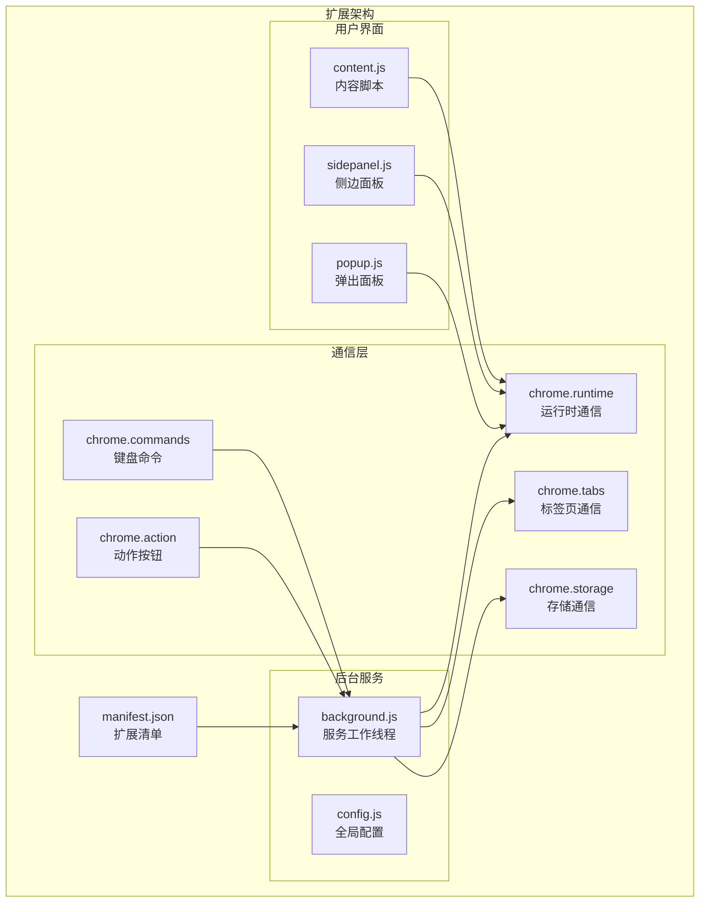
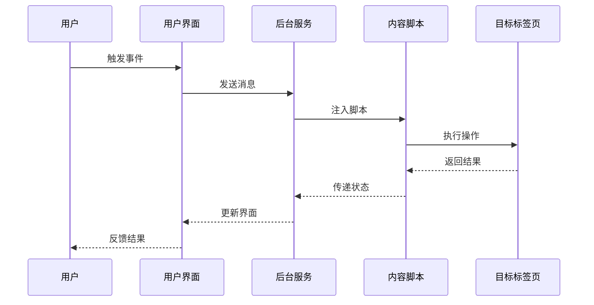
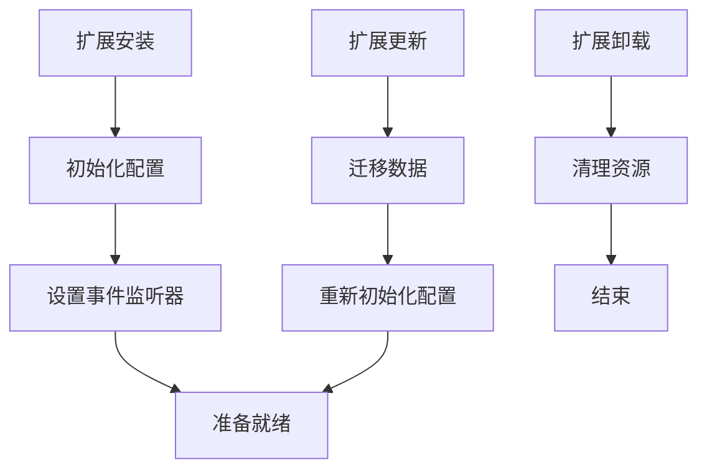
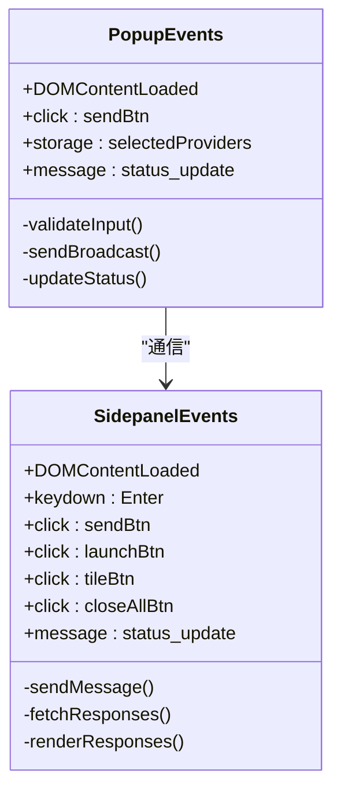
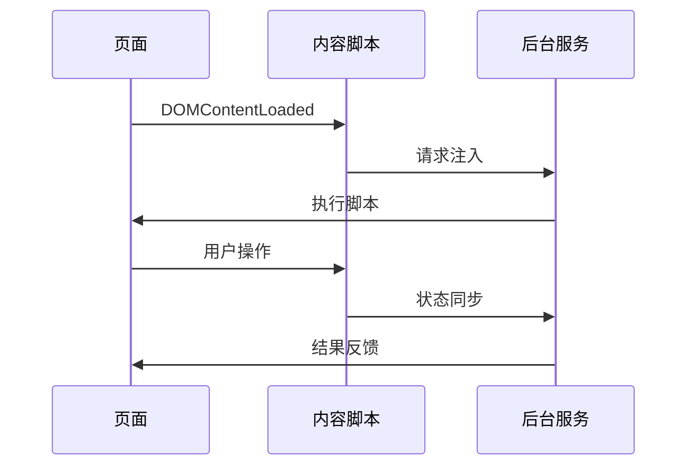
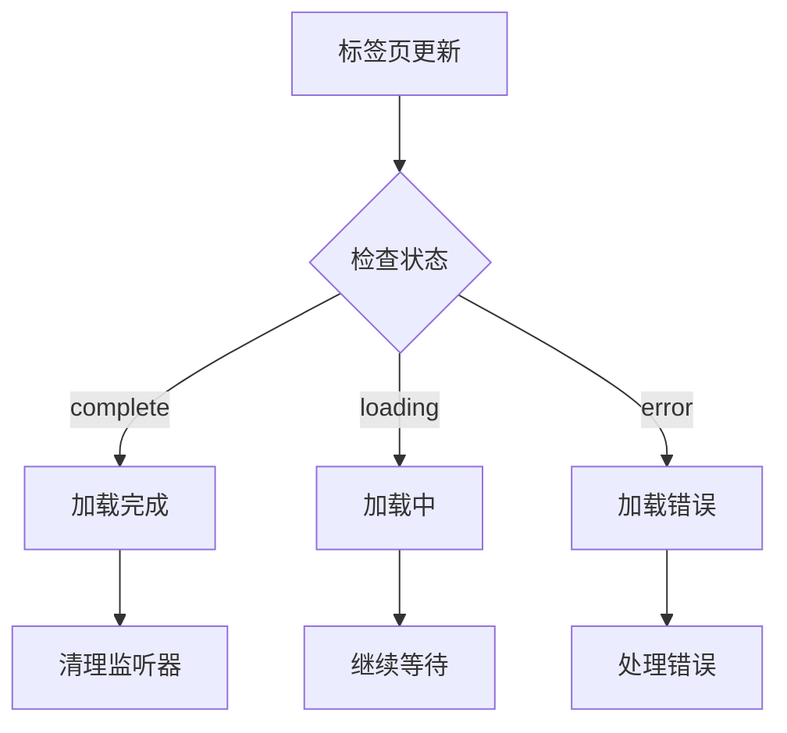
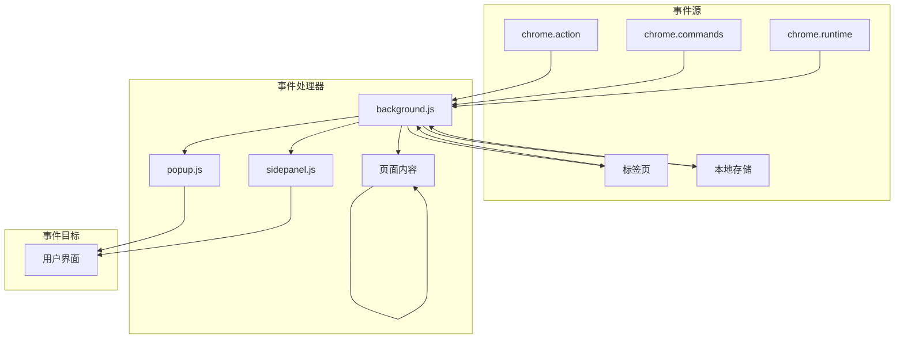
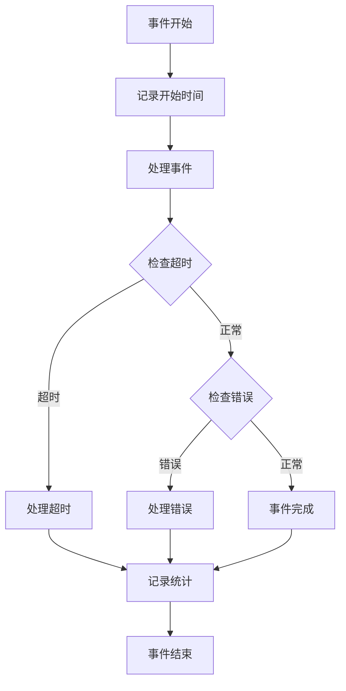

# 事件系统

<cite>
**本文档引用的文件**
- [manifest.json](file://manifest.json)
- [src/background.js](file://src/background.js)
- [src/popup/popup.js](file://src/popup/popup.js)
- [src/sidepanel/sidepanel.js](file://src/sidepanel/sidepanel.js)
- [src/content/content.js](file://src/content/content.js)
- [src/config.js](file://src/config.js)
</cite>

## 目录
1. [简介](#简介)
2. [项目结构](#项目结构)
3. [核心组件](#核心组件)
4. [架构概览](#架构概览)
5. [详细组件分析](#详细组件分析)
6. [依赖关系分析](#依赖关系分析)
7. [性能考虑](#性能考虑)
8. [故障排除指南](#故障排除指南)
9. [结论](#结论)

## 简介

AI Multiverse Chat 扩展采用多层事件驱动架构，实现了完整的浏览器扩展事件系统。该系统涵盖了扩展生命周期事件、用户交互事件、系统事件以及跨组件通信事件，为用户提供统一的消息传递和状态管理机制。

## 项目结构

扩展采用模块化设计，主要包含以下核心模块：



**图表来源**
- [manifest.json](file://manifest.json#L1-L79)
- [src/background.js](file://src/background.js#L1-L100)
- [src/popup/popup.js](file://src/popup/popup.js#L1-L61)
- [src/sidepanel/sidepanel.js](file://src/sidepanel/sidepanel.js#L1-L100)
- [src/content/content.js](file://src/content/content.js#L1-L50)

**章节来源**
- [manifest.json](file://manifest.json#L1-L79)
- [src/background.js](file://src/background.js#L1-L100)

## 核心组件

### 事件监听器类型

扩展实现了多种类型的事件监听器：

1. **扩展生命周期事件**
   - 安装事件监听
   - 更新事件监听
   - 卸载事件监听

2. **用户交互事件**
   - 按钮点击事件
   - 键盘快捷键事件
   - 表单输入事件

3. **系统事件**
   - 标签页变化事件
   - 存储变化事件
   - 窗口边界变化事件

4. **跨组件通信事件**
   - 运行时消息事件
   - 内容脚本通信事件

**章节来源**
- [src/background.js](file://src/background.js#L60-L67)
- [src/popup/popup.js](file://src/popup/popup.js#L16-L45)
- [src/sidepanel/sidepanel.js](file://src/sidepanel/sidepanel.js#L1199-L1211)

## 架构概览

扩展采用分层事件架构，确保各组件间的松耦合通信：



**图表来源**
- [src/background.js](file://src/background.js#L138-L197)
- [src/content/content.js](file://src/content/content.js#L199-L216)
- [src/sidepanel/sidepanel.js](file://src/sidepanel/sidepanel.js#L1397-L1407)

## 详细组件分析

### 后台服务事件系统

后台服务作为扩展的核心协调者，负责管理所有主要事件：

#### 生命周期事件处理



**图表来源**
- [src/background.js](file://src/background.js#L1-L50)

#### 用户交互事件处理

后台服务监听多种用户交互事件：

| 事件类型 | 触发条件 | 处理函数 | 参数格式 |
|---------|---------|---------|---------|
| 按钮点击 | 用户点击扩展图标 | `togglePopup()` | 无 |
| 键盘命令 | Alt+Shift+S 快捷键 | `handleCommand()` | `command: string` |
| 运行时消息 | `chrome.runtime.sendMessage()` | `handleRuntimeMessage()` | `request: object` |

**章节来源**
- [src/background.js](file://src/background.js#L60-L67)
- [src/background.js](file://src/background.js#L138-L197)

### 用户界面事件系统

#### 弹出面板事件处理

弹出面板实现了基础的用户交互事件：



**图表来源**
- [src/popup/popup.js](file://src/popup/popup.js#L1-L61)
- [src/sidepanel/sidepanel.js](file://src/sidepanel/sidepanel.js#L1199-L1211)

#### 侧边面板高级事件处理

侧边面板实现了复杂的用户交互事件：

**键盘导航事件**
- ArrowLeft: 上一个响应
- ArrowRight: 下一个响应  
- Escape: 关闭模态框

**触摸手势事件**
- 滑动检测
- 触摸开始/结束处理

**文件上传事件**
- 拖拽文件
- 文件选择
- 文件预览

**章节来源**
- [src/sidepanel/sidepanel.js](file://src/sidepanel/sidepanel.js#L959-L1055)
- [src/sidepanel/sidepanel.js](file://src/sidepanel/sidepanel.js#L2047-L2104)

### 内容脚本事件系统

内容脚本作为页面与扩展之间的桥梁，处理页面特定的事件：

#### 页面通信事件



**图表来源**
- [src/content/content.js](file://src/content/content.js#L199-L216)

#### 页面操作事件

| 事件类型 | 触发条件 | 处理函数 | 功能描述 |
|---------|---------|---------|---------|
| 响应提取 | 页面内容更新 | `extractLatestResponse()` | 提取AI响应 |
| 选择器诊断 | 调试模式启用 | `diagnoseSelectors()` | 诊断选择器 |
| 主世界填充 | 需要DOM操作 | `requestMainWorldFill()` | 执行DOM操作 |

**章节来源**
- [src/content/content.js](file://src/content/content.js#L218-L320)
- [src/content/content.js](file://src/content/content.js#L126-L197)

### 系统事件处理

#### 标签页变化事件

后台服务监听标签页状态变化：



**图表来源**
- [src/background.js](file://src/background.js#L680-L716)

#### 存储变化事件

扩展监听存储变化以实现状态同步：

**章节来源**
- [src/background.js](file://src/background.js#L94-L97)
- [src/sidepanel/sidepanel.js](file://src/sidepanel/sidepanel.js#L1880-L1885)

## 依赖关系分析

扩展的事件系统具有清晰的依赖层次：



**图表来源**
- [src/background.js](file://src/background.js#L60-L67)
- [src/popup/popup.js](file://src/popup/popup.js#L47-L59)
- [src/sidepanel/sidepanel.js](file://src/sidepanel/sidepanel.js#L1712-L1721)

**章节来源**
- [src/background.js](file://src/background.js#L1-L100)
- [src/config.js](file://src/config.js#L1-L50)

## 性能考虑

### 事件监听器优化

1. **监听器清理**
   - 自动清理超时监听器
   - 防止内存泄漏
   - 统一清理机制

2. **异步处理**
   - Promise链式调用
   - 并行任务处理
   - 超时保护机制

3. **事件去重**
   - 防止重复事件触发
   - 状态检查机制
   - 事件队列管理

### 性能监控



**图表来源**
- [src/background.js](file://src/background.js#L680-L716)

## 故障排除指南

### 常见事件处理问题

#### 事件监听器失效

**症状**: 事件无法触发或响应延迟

**解决方案**:
1. 检查事件监听器注册
2. 验证权限配置
3. 确认扩展状态

#### 跨组件通信失败

**症状**: 消息发送失败或接收超时

**解决方案**:
1. 检查 `chrome.runtime.sendMessage()` 调用
2. 验证消息格式和参数
3. 确认目标组件状态

#### 内存泄漏问题

**症状**: 扩展占用内存持续增长

**解决方案**:
1. 检查事件监听器清理
2. 验证定时器清理
3. 确认DOM事件解绑

**章节来源**
- [src/background.js](file://src/background.js#L692-L716)
- [src/sidepanel/sidepanel.js](file://src/sidepanel/sidepanel.js#L1049-L1055)

### 调试工具

#### 事件日志记录

扩展提供了详细的事件日志记录机制：

```javascript
// 事件处理日志
console.log('[AI Multiverse] 事件名称:', event);
console.log('[AI Multiverse] 事件参数:', params);
console.log('[AI Multiverse] 处理耗时:', endTime - startTime, 'ms');
```

#### 状态监控

```javascript
// 状态跟踪
function trackEvent(name, params) {
    console.log(`[EVENT] ${name}`, {
        timestamp: Date.now(),
        params,
        stack: new Error().stack
    });
}
```

## 结论

AI Multiverse Chat 的事件系统展现了现代浏览器扩展的最佳实践：

1. **模块化设计**: 清晰的组件分离和职责划分
2. **事件驱动架构**: 松耦合的组件通信机制
3. **性能优化**: 有效的事件处理和资源管理
4. **可维护性**: 标准化的事件处理模式和错误处理

该事件系统为扩展提供了稳定、高效的运行环境，支持复杂的用户交互和系统集成需求。通过合理的事件管理和状态控制，确保了扩展在各种使用场景下的可靠性和性能表现。