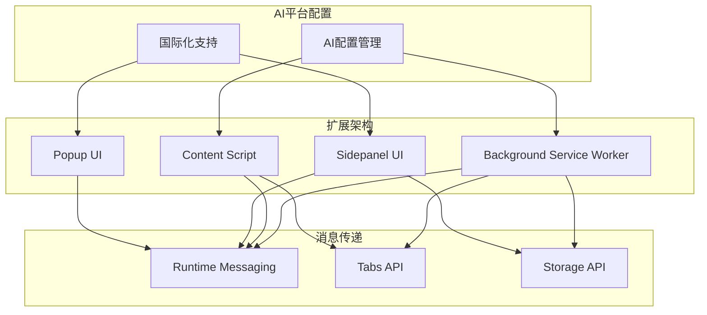
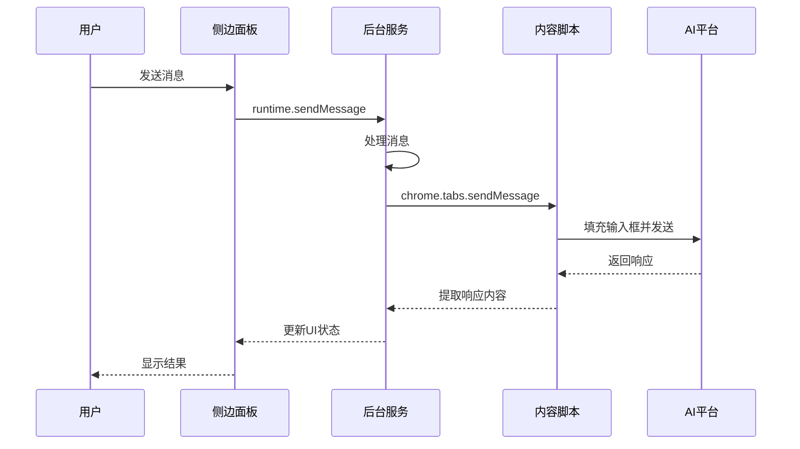
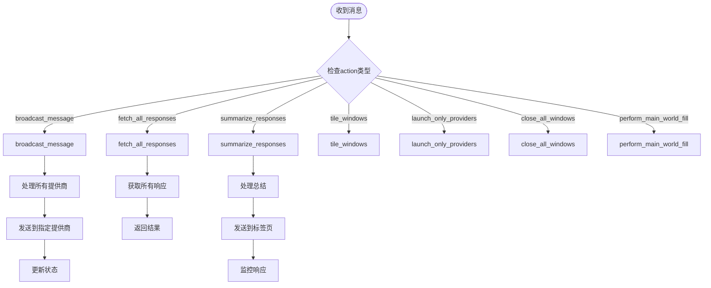
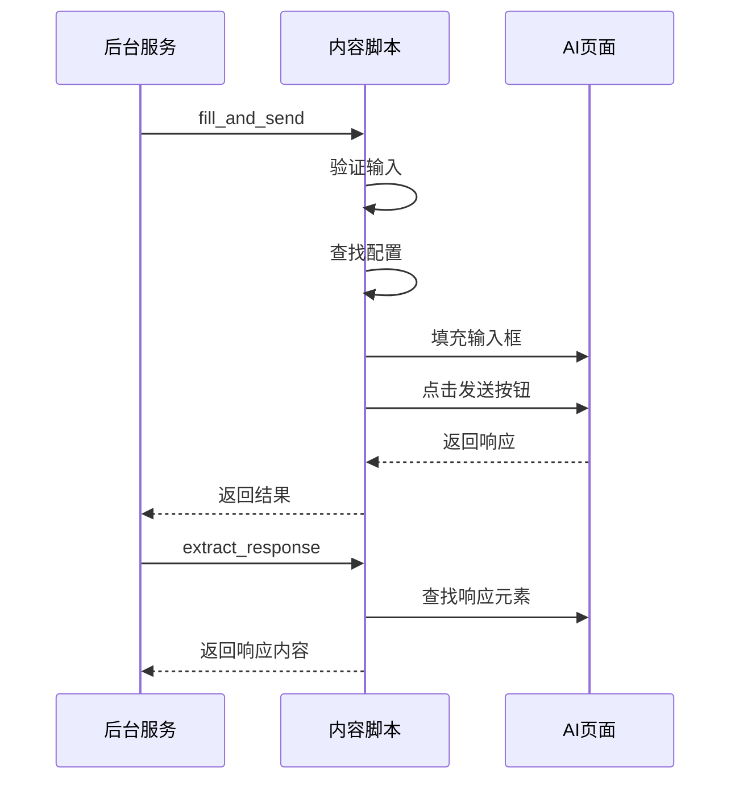
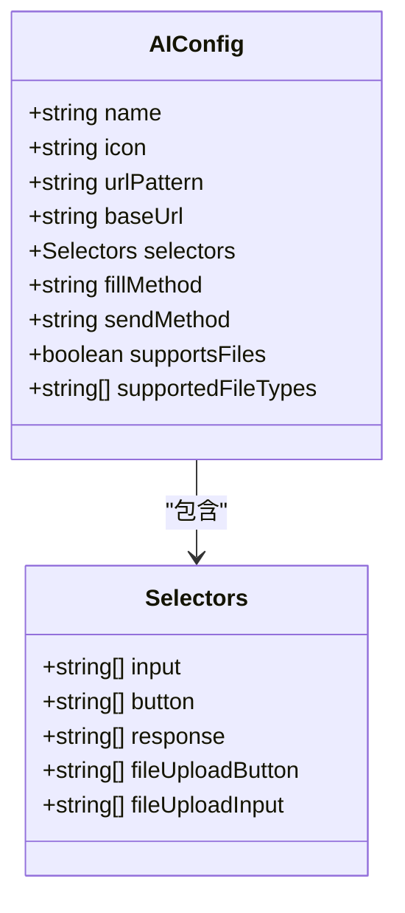
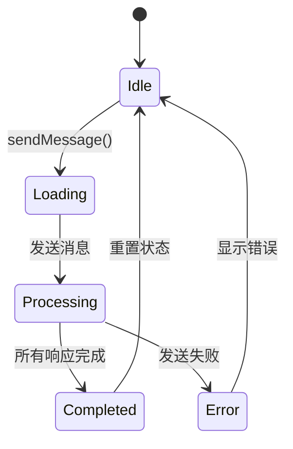
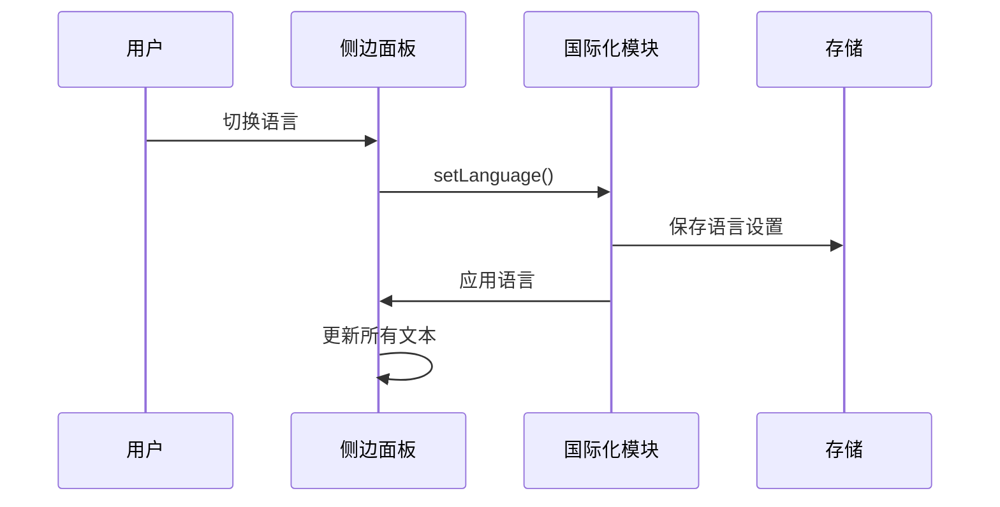
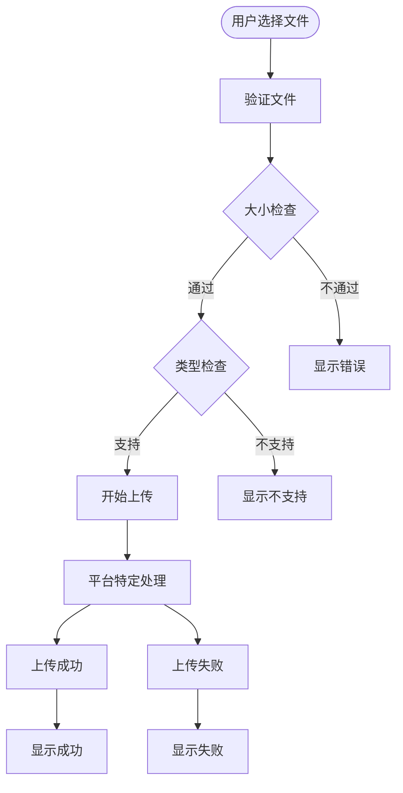
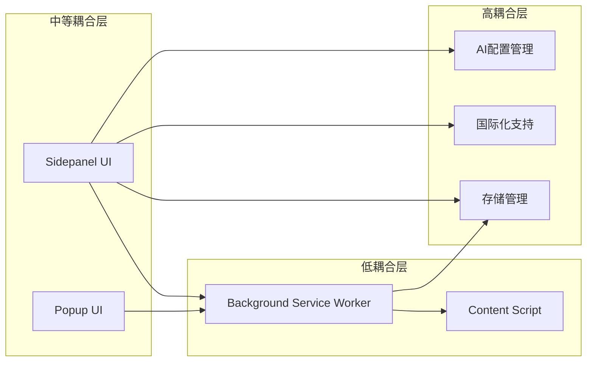

# 内部API接口

<cite>
**本文档引用的文件**
- [src/background.js](file://src/background.js)
- [src/content/content.js](file://src/content/content.js)
- [src/sidepanel/sidepanel.js](file://src/sidepanel/sidepanel.js)
- [src/config.js](file://src/config.js)
- [manifest.json](file://manifest.json)
- [src/popup/popup.js](file://src/popup/popup.js)
- [src/i18n.js](file://src/i18n.js)
</cite>

## 目录
1. [简介](#简介)
2. [项目结构](#项目结构)
3. [核心组件](#核心组件)
4. [架构概览](#架构概览)
5. [详细组件分析](#详细组件分析)
6. [依赖关系分析](#依赖关系分析)
7. [性能考虑](#性能考虑)
8. [故障排除指南](#故障排除指南)
9. [结论](#结论)

## 简介

AI Multiverse 是一个Chrome扩展程序，允许用户同时与多个AI聊天平台进行交互。该项目实现了复杂的跨组件通信机制，包括background ↔ content ↔ sidepanel的消息传递协议，以及完整的配置管理和UI控制API。

本项目的核心价值在于提供了一个统一的接口，让用户能够：
- 同时向多个AI平台发送消息
- 获取和比较不同AI平台的响应
- 自动化AI平台的窗口管理
- 实现智能总结功能
- 提供多语言和主题支持

## 项目结构

项目采用模块化的架构设计，主要包含以下核心组件：

**图表来源**
- [src/background.js](file://src/background.js#L1-L100)
- [src/content/content.js](file://src/content/content.js#L1-L50)
- [src/sidepanel/sidepanel.js](file://src/sidepanel/sidepanel.js#L1-L50)

**章节来源**
- [manifest.json](file://manifest.json#L1-L79)
- [src/config.js](file://src/config.js#L1-L50)

## 核心组件

### 1. Background Service Worker (后台服务)

后台服务是整个扩展的核心协调者，负责：
- 窗口管理和生命周期控制
- 跨标签页消息路由
- AI平台配置管理
- 状态同步和持久化

### 2. Content Script (内容脚本)

内容脚本注入到各个AI平台页面中，负责：
- 页面元素检测和交互
- 响应内容提取
- 文件上传处理
- 平台特定的UI适配

### 3. Sidepanel UI (侧边面板)

侧边面板提供用户界面，包含：
- 消息发送和管理
- 响应展示和比较
- 历史记录管理
- 设置和配置界面

### 4. Popup UI (弹出界面)

弹出界面提供快速访问功能：
- 简单的消息发送
- 基本的状态显示
- 快速配置选择

**章节来源**
- [src/background.js](file://src/background.js#L1-L100)
- [src/content/content.js](file://src/content/content.js#L1-L50)
- [src/sidepanel/sidepanel.js](file://src/sidepanel/sidepanel.js#L1-L100)

## 架构概览

系统采用分层架构设计，实现了清晰的职责分离：

**图表来源**
- [src/sidepanel/sidepanel.js](file://src/sidepanel/sidepanel.js#L1343-L1407)
- [src/background.js](file://src/background.js#L138-L197)
- [src/content/content.js](file://src/content/content.js#L199-L216)

## 详细组件分析

### 消息传递协议

#### 1. Runtime Messaging API

扩展使用Chrome的runtime messaging API实现组件间通信：

**消息格式定义：**

| 字段 | 类型 | 必需 | 描述 |
|------|------|------|------|
| action | string | 是 | 消息动作类型 |
| message | string | 可选 | 要发送的消息内容 |
| providers | string[] | 可选 | 目标AI平台列表 |
| provider | string | 可选 | 单个AI平台标识 |
| files | array | 可选 | 文件对象数组 |
| text | string | 可选 | 文本内容 |
| selector | string | 可选 | DOM选择器 |

**后台服务消息处理：**

**图表来源**
- [src/background.js](file://src/background.js#L138-L197)
- [src/background.js](file://src/background.js#L718-L786)

**章节来源**
- [src/background.js](file://src/background.js#L138-L197)
- [src/content/content.js](file://src/content/content.js#L199-L216)

#### 2. Content Script消息处理

内容脚本监听来自后台服务的消息：

**消息处理流程：**

**图表来源**
- [src/content/content.js](file://src/content/content.js#L205-L216)
- [src/content/content.js](file://src/content/content.js#L323-L418)

**章节来源**
- [src/content/content.js](file://src/content/content.js#L199-L216)
- [src/content/content.js](file://src/content/content.js#L218-L320)

### 配置管理API

#### AI平台配置

系统使用统一的配置管理机制：

**配置结构：**

| 字段 | 类型 | 描述 |
|------|------|------|
| name | string | 平台名称 |
| icon | string | 图标路径 |
| urlPattern | string | URL匹配模式 |
| baseUrl | string | 基础URL |
| selectors | object | DOM选择器配置 |
| fillMethod | string | 填充方法 |
| sendMethod | string | 发送方法 |
| supportsFiles | boolean | 是否支持文件上传 |
| supportedFileTypes | array | 支持的文件类型 |

**配置示例：**

**图表来源**
- [src/config.js](file://src/config.js#L5-L199)

**章节来源**
- [src/config.js](file://src/config.js#L1-L204)

#### 配置获取和修改方法

**获取配置：**
- 通过全局变量 `AI_CONFIG` 访问
- 在内容脚本中自动注入
- 支持动态查询和验证

**修改配置：**
- 通过扩展设置界面修改
- 支持本地存储持久化
- 实时生效无需重启

### UI控制API

#### 侧边面板UI控制

侧边面板提供了丰富的UI控制功能：

**主要UI组件：**

| 组件 | 功能 | 方法 |
|------|------|------|
| 模型选择器 | 选择目标AI平台 | `getSelectedProviders()` |
| 消息发送器 | 发送消息到多个平台 | `sendMessage()` |
| 响应展示器 | 显示和比较响应 | `renderResponses()` |
| 历史记录管理 | 管理对话历史 | `renderHistory()` |
| 文件上传器 | 处理文件上传 | `handleFileSelect()` |

**UI状态管理：**

**图表来源**
- [src/sidepanel/sidepanel.js](file://src/sidepanel/sidepanel.js#L1343-L1407)
- [src/sidepanel/sidepanel.js](file://src/sidepanel/sidepanel.js#L2542-L2654)

**章节来源**
- [src/sidepanel/sidepanel.js](file://src/sidepanel/sidepanel.js#L1313-L1407)
- [src/sidepanel/sidepanel.js](file://src/sidepanel/sidepanel.js#L1700-L1762)

#### 国际化API

系统支持多语言切换：

**语言切换流程：**

**图表来源**
- [src/sidepanel/sidepanel.js](file://src/sidepanel/sidepanel.js#L1864-L1885)
- [src/i18n.js](file://src/i18n.js#L385-L405)

**章节来源**
- [src/i18n.js](file://src/i18n.js#L1-L504)

### 文件上传处理

系统支持多种文件类型的上传：

**文件上传流程：**

**图表来源**
- [src/content/content.js](file://src/content/content.js#L616-L742)
- [src/content/content.js](file://src/content/content.js#L744-L941)

**章节来源**
- [src/content/content.js](file://src/content/content.js#L593-L742)
- [src/content/content.js](file://src/content/content.js#L744-L941)

## 依赖关系分析

### 组件耦合度

**图表来源**
- [manifest.json](file://manifest.json#L42-L68)
- [src/background.js](file://src/background.js#L69-L74)

### 外部依赖

系统依赖以下Chrome扩展API：

| API类别 | 用途 | 权限 |
|---------|------|------|
| runtime | 组件间通信 | 无 |
| tabs | 标签页管理 | tabs |
| scripting | 脚本注入 | scripting |
| storage | 数据持久化 | storage |
| system.display | 显示器管理 | system.display |

**章节来源**
- [manifest.json](file://manifest.json#L12-L18)

## 性能考虑

### 1. 异步处理优化

系统采用异步编程模式，避免阻塞主线程：

- 使用Promise和async/await处理异步操作
- 实现并发处理提高效率
- 添加超时机制防止无限等待

### 2. 内存管理

- 及时清理文件对象URL
- 合理使用localStorage存储
- 避免内存泄漏

### 3. 网络优化

- 实现重试机制处理网络异常
- 添加超时控制防止长时间等待
- 优化DOM查询减少性能开销

## 故障排除指南

### 常见问题及解决方案

**1. 脚本注入失败**
- 检查页面URL是否匹配配置
- 确认扩展权限设置
- 验证content script注入时机

**2. 响应提取失败**
- 检查AI平台选择器配置
- 验证页面DOM结构变化
- 确认网络连接状态

**3. 文件上传失败**
- 检查文件类型支持
- 验证文件大小限制
- 确认上传按钮可见性

**4. 窗口管理异常**
- 检查显示器配置
- 验证窗口权限设置
- 确认窗口状态一致性

### 调试工具

系统提供了完善的调试机制：

- 控制台日志输出
- 状态跟踪和监控
- 错误捕获和报告
- 性能指标收集

**章节来源**
- [src/background.js](file://src/background.js#L656-L716)
- [src/content/content.js](file://src/content/content.js#L616-L742)

## 结论

AI Multiverse扩展程序展现了现代浏览器扩展开发的最佳实践：

### 主要成就

1. **架构设计优秀**：采用分层架构，职责分离明确
2. **消息传递机制完善**：实现了可靠的跨组件通信
3. **配置管理灵活**：支持动态配置和热更新
4. **用户体验优秀**：提供直观的多平台交互界面
5. **国际化支持完整**：支持多语言切换

### 技术亮点

- **异步编程模式**：充分利用现代JavaScript特性
- **错误处理机制**：完善的异常捕获和恢复策略
- **性能优化**：合理的资源管理和并发处理
- **可维护性**：清晰的代码结构和文档

### 改进建议

1. **增加单元测试**：提高代码质量和可靠性
2. **增强错误日志**：提供更详细的诊断信息
3. **优化配置管理**：支持更灵活的配置方式
4. **扩展API文档**：提供更详细的开发者文档

这个项目为浏览器扩展开发提供了优秀的参考案例，展示了如何构建复杂而稳定的多平台交互系统。