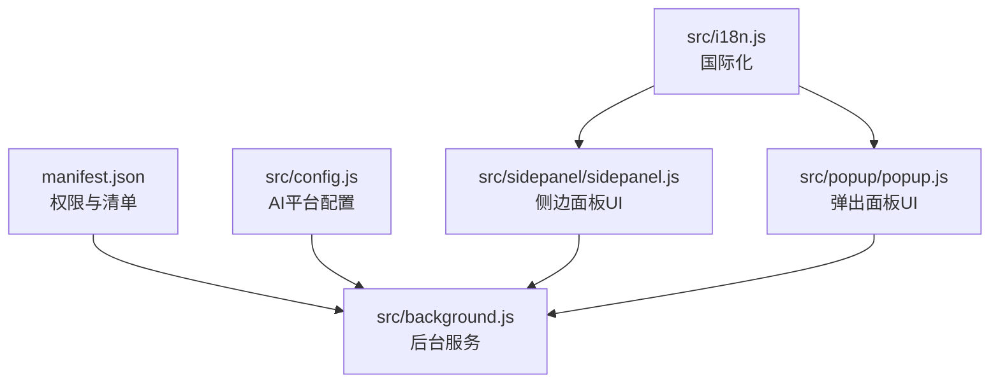
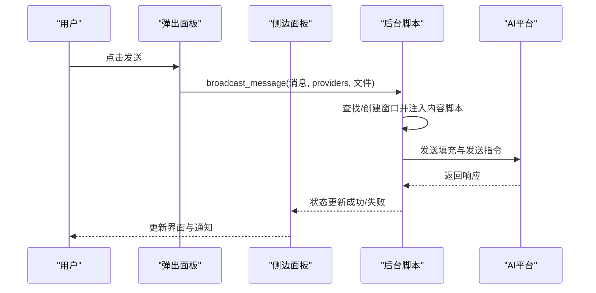
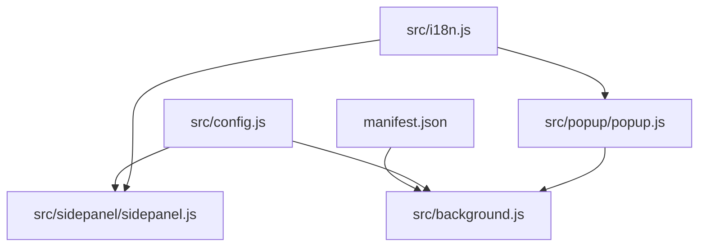

# 配置选项参考

<cite>
**本文档引用的文件**
- [manifest.json](file://manifest.json)
- [src/config.js](file://src/config.js)
- [src/background.js](file://src/background.js)
- [src/sidepanel/sidepanel.js](file://src/sidepanel/sidepanel.js)
- [src/popup/popup.js](file://src/popup/popup.js)
- [src/i18n.js](file://src/i18n.js)
</cite>

## 目录
1. [简介](#简介)
2. [项目结构](#项目结构)
3. [核心组件](#核心组件)
4. [架构概览](#架构概览)
5. [详细组件分析](#详细组件分析)
6. [依赖关系分析](#依赖关系分析)
7. [性能考虑](#性能考虑)
8. [故障排除指南](#故障排除指南)
9. [结论](#结论)
10. [附录](#附录)

## 简介
本文件为 AI Multiverse Chat 扩展的配置选项完整参考文档，涵盖 manifest.json 中的权限与清单配置、AI 平台配置选项（选择器映射、发送方法、文件支持等）、用户设置选项（主题切换、语言设置、快捷键配置等）。文档提供每个配置项的数据类型、默认值、有效范围、配置验证规则与错误处理机制，并给出配置示例与最佳实践建议。

## 项目结构
扩展采用 Manifest V3 架构，主要文件组织如下：
- 清单与权限：manifest.json
- 全局配置：src/config.js（AI 平台配置）
- 后台服务：src/background.js（消息监听、窗口管理、布局持久化）
- 侧边面板：src/sidepanel/sidepanel.js（主题/语言/历史/文件上传/摘要设置）
- 弹出面板：src/popup/popup.js（快速发送、模型选择）
- 国际化：src/i18n.js（多语言支持）

图表来源
- [manifest.json](file://manifest.json#L1-L79)
- [src/config.js](file://src/config.js#L1-L204)
- [src/background.js](file://src/background.js#L1-L1028)
- [src/sidepanel/sidepanel.js](file://src/sidepanel/sidepanel.js#L1-L2813)
- [src/popup/popup.js](file://src/popup/popup.js#L1-L61)
- [src/i18n.js](file://src/i18n.js#L1-L504)

章节来源
- [manifest.json](file://manifest.json#L1-L79)
- [src/config.js](file://src/config.js#L1-L204)
- [src/background.js](file://src/background.js#L1-L1028)
- [src/sidepanel/sidepanel.js](file://src/sidepanel/sidepanel.js#L1-L2813)
- [src/popup/popup.js](file://src/popup/popup.js#L1-L61)
- [src/i18n.js](file://src/i18n.js#L1-L504)

## 核心组件

### 清单与权限配置（manifest.json）
- 清单版本：3
- 名称与版本：见清单字段
- 图标：icons/icon.svg（16×32×48×128）
- 权限：
  - activeTab：访问当前标签页上下文
  - scripting：动态注入脚本
  - tabs：查询/操作标签页
  - storage：本地存储
  - system.display：多显示器信息
- 主机权限（host_permissions）：覆盖多个 AI 平台域名
- 行为（action）：默认标题与图标
- 后台（background）：service_worker 指向 src/background.js
- 内容脚本（content_scripts）：
  - 匹配上述主机权限域名
  - 注入顺序：src/config.js → src/content/content.js
  - 运行时机：document_idle
  - 作用域：非子框架（all_frames=false）
- 命令（commands）：_execute_action 绑定 Alt+Shift+S（mac 亦同），描述为“打开 AI Multiverse Chat”

数据类型与默认值
- permissions/host_permissions：数组，必须包含所需权限
- content_scripts.matches：数组，必须包含目标域名
- content_scripts.js：数组，必须包含注入顺序
- commands.suggested_key.default/mac：字符串，建议快捷键组合
- action.default_icon：对象，包含 16/32/48/128 尺寸路径

有效范围
- host_permissions 必须覆盖所有目标 AI 平台域名
- content_scripts.js 必须按顺序先注入全局配置，再注入内容逻辑
- commands.suggested_key 支持跨平台快捷键映射

验证规则与错误处理
- 若缺少 scripting 权限，脚本注入将失败
- 若缺少 host_permissions，内容脚本无法匹配目标页面
- 若 content_scripts.js 顺序错误，可能导致选择器失效

章节来源
- [manifest.json](file://manifest.json#L1-L79)

### AI 平台配置（src/config.js）
AI_CONFIG 定义了各平台的统一配置，每项包含：
- name：平台名称
- icon：图标路径
- urlPattern/urlPatternAlt/urlPatterns：URL 匹配模式（支持备用/多模式）
- baseUrl：平台首页 URL
- selectors：DOM 选择器映射
  - input/button/response：输入框、发送按钮、响应容器
  - fileUploadButton/fileUploadInput：文件上传按钮/输入（部分平台）
- fillMethod：填充方法（main-world 或 content-script）
- sendMethod：发送方式（button 或 enter）
- supportsFiles：是否支持文件
- supportedFileTypes：支持的文件类型数组

数据类型与默认值
- name/icon：字符串
- urlPattern/urlPatternAlt：字符串
- urlPatterns：字符串数组
- baseUrl：字符串
- selectors：对象，包含 input/button/response/fileUpload* 等键，值为字符串数组
- fillMethod/sendMethod：字符串枚举（main-world/content-script/button/enter）
- supportsFiles：布尔
- supportedFileTypes：字符串数组

有效范围
- selectors 必须能稳定定位到输入框、发送按钮与响应区域
- fillMethod 与 sendMethod 需与平台 UI 交互方式匹配
- supportedFileTypes 需与平台实际限制一致

验证规则与错误处理
- 若选择器失效，将导致输入填充或发送失败
- 若 sendMethod 与平台交互不稳定，需调整为更稳定的策略

章节来源
- [src/config.js](file://src/config.js#L1-L204)

### 用户设置与状态（src/sidepanel/sidepanel.js）
用户设置通过 chrome.storage.local 持久化，包括：
- theme：主题（dark/light）
- lang：语言（en/zh-CN）
- selected_providers：已选模型列表
- chat_history：对话历史（含文本、模型、文件、时间戳）
- saved_layout：窗口布局（left/top/width/height/state）
- lastTileDisplayId：上次平铺显示设备 ID
- summarizeModel/customSummarizePrompt：摘要模型与提示词

数据类型与默认值
- theme：字符串，默认 dark
- lang：字符串，默认 en
- selected_providers：字符串数组，默认空
- chat_history：对象数组，默认空
- saved_layout：对象，默认空
- lastTileDisplayId：字符串，默认空
- summarizeModel：字符串，默认 gemini
- customSummarizePrompt：字符串，默认空

有效范围
- theme 仅支持 dark/light
- lang 仅支持 en/zh-CN
- selected_providers 仅支持已知模型键（如 gemini/grok/kimi/deepseek/chatgpt/qwen/yuanbao）
- 文件大小限制：单文件最大 10MB，总大小最大 50MB

验证规则与错误处理
- 超出文件大小限制时，显示错误通知并阻止上传
- 语言切换时，通过 runtime 通知后台脚本同步语言

章节来源
- [src/sidepanel/sidepanel.js](file://src/sidepanel/sidepanel.js#L1835-L1885)
- [src/sidepanel/sidepanel.js](file://src/sidepanel/sidepanel.js#L1320-L1519)
- [src/sidepanel/sidepanel.js](file://src/sidepanel/sidepanel.js#L910-L1026)

### 弹出面板设置（src/popup/popup.js）
- 加载并保存已选模型（selectedProviders）
- 发送消息时携带 providers 列表与消息内容
- 接收后台状态更新并在 UI 中展示

数据类型与默认值
- selectedProviders：字符串数组
- message：字符串

有效范围
- providers 必须为已知模型键集合

验证规则与错误处理
- 若 message 为空，阻止发送
- 若 providers 为空，弹出模型选择

章节来源
- [src/popup/popup.js](file://src/popup/popup.js#L1-L61)

### 国际化配置（src/i18n.js）
- 支持语言：en、zh-CN
- 提供翻译键与变量替换
- 日期/时间格式化函数

数据类型与默认值
- I18N：对象，键为语言码，值为翻译键到文本的映射
- currentLang：字符串，默认 en

有效范围
- 语言码必须在 I18N 中定义

验证规则与错误处理
- 未知键返回原键名并警告
- 语言不支持时返回 false

章节来源
- [src/i18n.js](file://src/i18n.js#L1-L504)

## 架构概览
扩展采用“清单驱动 + 全局配置 + 后台协调 + UI 状态持久化”的架构。清单定义权限与注入时机，全局配置统一平台交互细节，后台负责窗口管理与布局持久化，UI 层负责用户设置与状态持久化。

图表来源
- [src/popup/popup.js](file://src/popup/popup.js#L16-L45)
- [src/background.js](file://src/background.js#L718-L786)
- [src/sidepanel/sidepanel.js](file://src/sidepanel/sidepanel.js#L1343-L1407)

章节来源
- [src/popup/popup.js](file://src/popup/popup.js#L1-L61)
- [src/background.js](file://src/background.js#L718-L786)
- [src/sidepanel/sidepanel.js](file://src/sidepanel/sidepanel.js#L1343-L1407)

## 详细组件分析

### 清单与权限（manifest.json）
- 权限与主机权限：确保脚本注入与跨域访问
- 行为与图标：定义扩展图标与标题
- 后台与内容脚本：定义 service_worker 与注入顺序
- 命令：定义快捷键触发行为

配置验证要点
- permissions 必须包含 scripting、tabs、storage
- host_permissions 必须覆盖所有目标域名
- content_scripts.js 必须包含全局配置与内容逻辑
- commands.suggested_key 必须符合浏览器快捷键规范

章节来源
- [manifest.json](file://manifest.json#L12-L79)

### AI 平台配置（src/config.js）
- 选择器映射：input/button/response/fileUpload*
- 填充方法：main-world 或 content-script
- 发送方法：button 或 enter
- 文件支持：supportsFiles 与 supportedFileTypes

配置验证要点
- 选择器数组需按优先级排序，确保稳定匹配
- fillMethod 与 sendMethod 需与平台 UI 交互方式一致
- supportedFileTypes 需与平台实际限制一致

章节来源
- [src/config.js](file://src/config.js#L5-L199)

### 用户设置与状态（src/sidepanel/sidepanel.js）
- 主题切换：通过 chrome.storage.local 保存 theme
- 语言切换：通过 chrome.storage.local 保存 lang，并通知后台
- 历史记录：通过 chrome.storage.local 保存 chat_history
- 布局持久化：通过 chrome.storage.local 保存 saved_layout 与 lastTileDisplayId
- 文件上传：限制单文件与总大小，读取为 data URL

配置验证要点
- theme 仅支持 dark/light
- lang 仅支持 en/zh-CN
- 文件大小超出限制时阻止上传并提示
- 布局持久化需确保窗口存在且非自身控制面板

章节来源
- [src/sidepanel/sidepanel.js](file://src/sidepanel/sidepanel.js#L1835-L1885)
- [src/sidepanel/sidepanel.js](file://src/sidepanel/sidepanel.js#L910-L1026)
- [src/sidepanel/sidepanel.js](file://src/sidepanel/sidepanel.js#L464-L495)

### 弹出面板设置（src/popup/popup.js）
- 加载已选模型并保存
- 发送消息时携带 providers 列表
- 接收后台状态更新

配置验证要点
- providers 必须为已知模型键集合
- message 不能为空

章节来源
- [src/popup/popup.js](file://src/popup/popup.js#L6-L45)

### 国际化配置（src/i18n.js）
- 支持语言：en、zh-CN
- 翻译键与变量替换
- 日期/时间格式化

配置验证要点
- 语言码必须在 I18N 中定义
- 未知键返回原键名并警告

章节来源
- [src/i18n.js](file://src/i18n.js#L6-L346)

## 依赖关系分析
扩展内部模块间依赖关系如下：

图表来源
- [manifest.json](file://manifest.json#L42-L44)
- [src/config.js](file://src/config.js#L1-L204)
- [src/background.js](file://src/background.js#L69-L74)
- [src/sidepanel/sidepanel.js](file://src/sidepanel/sidepanel.js#L1-L50)
- [src/popup/popup.js](file://src/popup/popup.js#L1-L10)
- [src/i18n.js](file://src/i18n.js#L1-L50)

章节来源
- [manifest.json](file://manifest.json#L42-L44)
- [src/config.js](file://src/config.js#L1-L204)
- [src/background.js](file://src/background.js#L69-L74)
- [src/sidepanel/sidepanel.js](file://src/sidepanel/sidepanel.js#L1-L50)
- [src/popup/popup.js](file://src/popup/popup.js#L1-L10)
- [src/i18n.js](file://src/i18n.js#L1-L50)

## 性能考虑
- 内容脚本注入：按顺序注入全局配置与内容逻辑，减少重复注入开销
- 窗口布局持久化：在发送/平铺后异步保存布局，避免阻塞主线程
- 文件上传：限制单文件与总大小，使用 data URL 预览，避免大文件传输延迟
- 选择器匹配：优先使用稳定的选择器，减少 DOM 查询次数

## 故障排除指南
常见问题与处理：
- 脚本注入失败：检查 scripting 权限与 content_scripts.js 注入顺序
- 选择器失效：检查 selectors 映射是否与平台 UI 一致
- 发送失败：检查 sendMethod 与平台交互稳定性
- 语言切换无效：确认 lang 设置与 runtime 通知是否正确传递
- 文件上传失败：检查文件大小限制与读取异常

章节来源
- [src/background.js](file://src/background.js#L69-L74)
- [src/sidepanel/sidepanel.js](file://src/sidepanel/sidepanel.js#L464-L495)
- [src/i18n.js](file://src/i18n.js#L390-L405)

## 结论
本参考文档系统性梳理了扩展的配置选项，包括清单权限、AI 平台配置与用户设置。通过明确的数据类型、默认值、有效范围与验证规则，开发者可以安全地定制与扩展功能。建议遵循最佳实践，确保选择器稳定、文件大小合规、语言与主题设置一致，并定期验证布局持久化与窗口管理逻辑。

## 附录

### 配置项速查表
- 清单（manifest.json）
  - permissions：数组，必需
  - host_permissions：数组，必需
  - content_scripts.js：数组，必需
  - commands.suggested_key：字符串，建议
- AI 平台配置（src/config.js）
  - selectors.input/button/response/fileUpload*：数组，必需
  - fillMethod/sendMethod：枚举，必需
  - supportsFiles/supportedFileTypes：布尔与数组，必需
- 用户设置（src/sidepanel/sidepanel.js）
  - theme：字符串，枚举 dark/light
  - lang：字符串，枚举 en/zh-CN
  - selected_providers：数组，枚举已知模型键
  - chat_history：数组，对象结构
  - saved_layout/lastTileDisplayId：对象与字符串
  - summarizeModel/customSummarizePrompt：字符串
- 弹出面板（src/popup/popup.js）
  - selectedProviders：数组
  - message：字符串
- 国际化（src/i18n.js）
  - I18N：对象，键为语言码
  - currentLang：字符串

### 配置示例与最佳实践
- 清单示例：确保 permissions 包含 scripting、tabs、storage；host_permissions 覆盖所有目标域名；content_scripts.js 按顺序注入全局配置与内容逻辑；commands.suggested_key 使用跨平台快捷键
- 平台配置示例：为每个平台提供稳定的选择器映射；根据平台交互特性选择 fillMethod 与 sendMethod；合理设置 supportedFileTypes
- 用户设置示例：主题与语言通过 chrome.storage.local 保存；文件上传严格限制大小；布局持久化在合适时机保存
- 最佳实践：保持选择器健壮性；避免在主世界与内容脚本中重复填充；统一错误处理与通知；定期清理历史记录与布局缓存