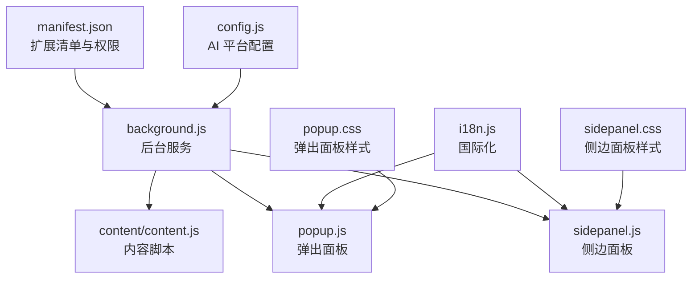
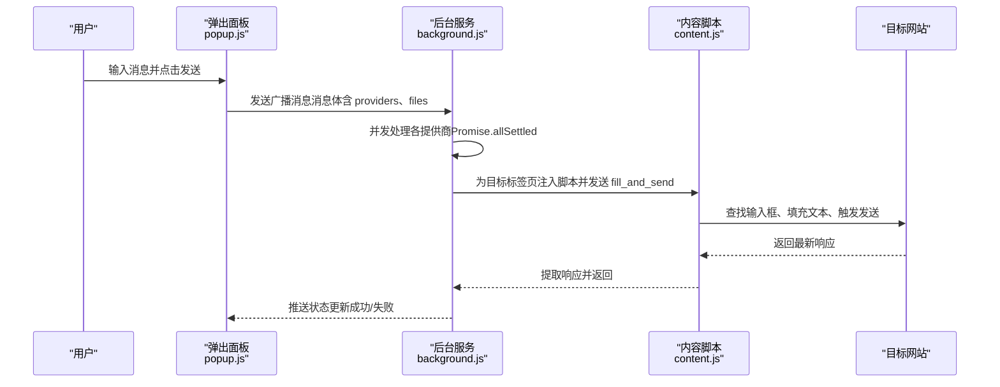
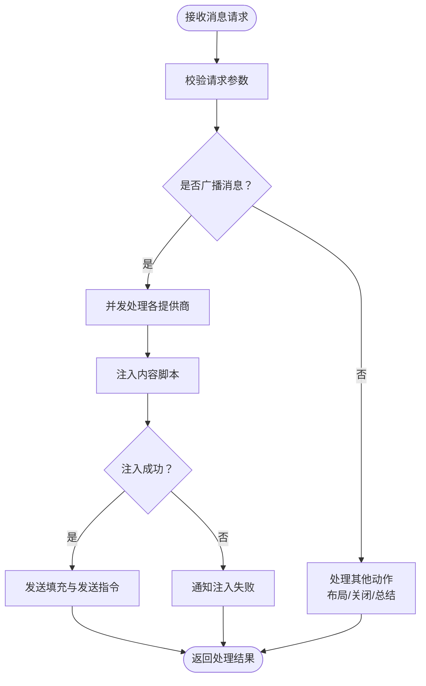
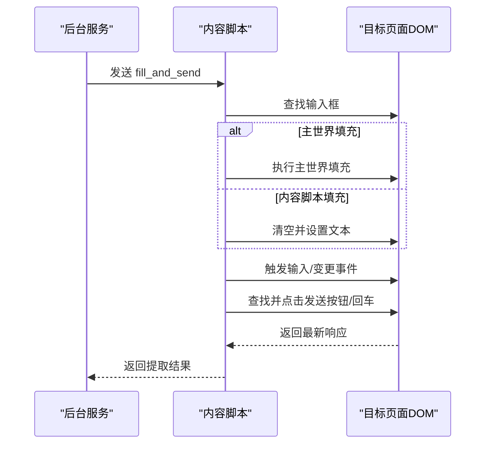
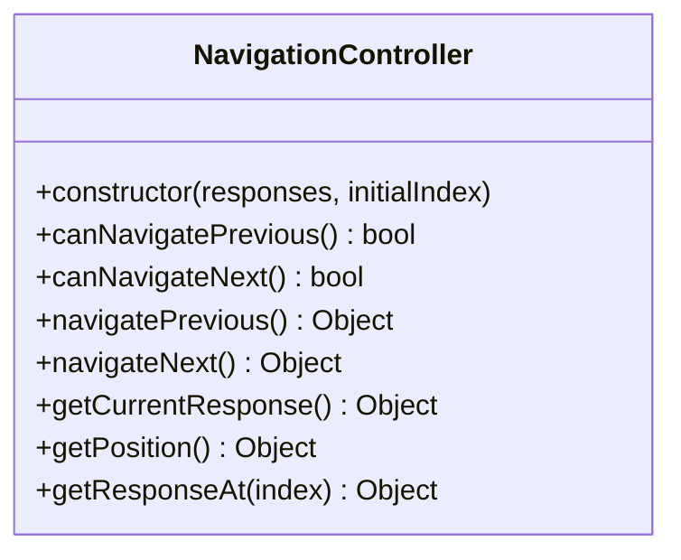
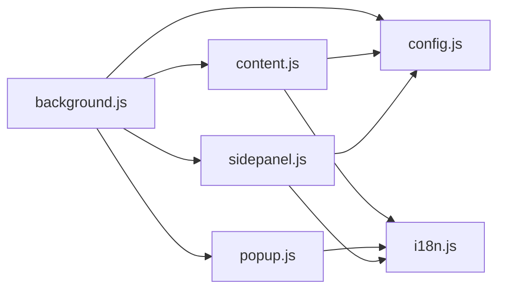

# 代码规范与最佳实践

<cite>
**本文档引用的文件**
- [README.md](file://README.md)
- [CONTRIBUTING.md](file://CONTRIBUTING.md)
- [manifest.json](file://manifest.json)
- [src/config.js](file://src/config.js)
- [src/background.js](file://src/background.js)
- [src/content/content.js](file://src/content/content.js)
- [src/popup/popup.js](file://src/popup/popup.js)
- [src/sidepanel/sidepanel.js](file://src/sidepanel/sidepanel.js)
- [src/i18n.js](file://src/i18n.js)
- [src/popup/popup.css](file://src/popup/popup.css)
- [src/sidepanel/sidepanel.css](file://src/sidepanel/sidepanel.css)
</cite>

## 目录
1. [简介](#简介)
2. [项目结构](#项目结构)
3. [核心组件](#核心组件)
4. [架构概览](#架构概览)
5. [详细组件分析](#详细组件分析)
6. [依赖关系分析](#依赖关系分析)
7. [性能考虑](#性能考虑)
8. [故障排除指南](#故障排除指南)
9. [结论](#结论)
10. [附录](#附录)

## 简介
本文件旨在为 AI Multiverse Chat 项目建立一套完整的代码规范与最佳实践文档。项目是一个基于 Chrome 扩展的多 AI 平台广播消息工具，采用原生 JavaScript、HTML 和 CSS 构建，无任何构建工具依赖。本文档将从 JavaScript 编码标准、模块组织、代码审查标准、错误处理与异步编程、内存管理策略以及重构指导等方面进行全面阐述，帮助开发者编写高质量、可维护且高性能的代码。

## 项目结构
项目采用按功能模块划分的目录结构，核心模块包括：
- 扩展清单与权限配置：manifest.json
- 配置中心：src/config.js（统一管理各 AI 平台配置）
- 后台服务：src/background.js（扩展生命周期、窗口管理、消息分发）
- 内容脚本：src/content/content.js（注入到目标网站，自动化输入与发送）
- 弹出面板：src/popup/popup.js（轻量交互入口）
- 侧边面板：src/sidepanel/sidepanel.js（主要 UI 与交互逻辑）
- 国际化：src/i18n.js（多语言支持）
- 样式文件：src/popup/popup.css、src/sidepanel/sidepanel.css（主题与布局）

**图表来源**
- [manifest.json](file://manifest.json#L1-L79)
- [src/background.js](file://src/background.js#L1-L120)
- [src/config.js](file://src/config.js#L1-L204)
- [src/content/content.js](file://src/content/content.js#L1-L60)
- [src/popup/popup.js](file://src/popup/popup.js#L1-L61)
- [src/sidepanel/sidepanel.js](file://src/sidepanel/sidepanel.js#L1-L80)
- [src/i18n.js](file://src/i18n.js#L1-L60)
- [src/popup/popup.css](file://src/popup/popup.css#L1-L60)
- [src/sidepanel/sidepanel.css](file://src/sidepanel/sidepanel.css#L1-L80)

**章节来源**
- [README.md](file://README.md#L20-L29)
- [manifest.json](file://manifest.json#L1-L79)

## 核心组件
本节对项目的关键组件进行深入分析，涵盖职责边界、数据流与交互方式。

- 配置中心（AI_CONFIG）
  - 统一管理各 AI 平台的基础信息、选择器、填充与发送策略、文件上传能力等。
  - 设计要点：模块化配置、跨域匹配规则、选择器优先级与回退策略。
  - 参考路径：[AI_CONFIG 定义](file://src/config.js#L5-L199)

- 后台服务（background.js）
  - 负责扩展行为控制（弹窗开关）、窗口发现与布局、消息监听与分发、脚本注入与超时处理。
  - 设计要点：异步消息处理、并发任务管理、错误传播与降级策略。
  - 参考路径：[消息监听与处理](file://src/background.js#L139-L197)、[窗口布局与发现](file://src/background.js#L528-L643)

- 内容脚本（content.js）
  - 注入到目标网站，负责输入填充、文件上传、发送动作执行与响应提取。
  - 设计要点：DOM 选择器健壮性、事件派发与状态同步、超时与重试机制。
  - 参考路径：[消息监听与处理](file://src/content/content.js#L200-L216)、[响应提取](file://src/content/content.js#L219-L320)

- 弹出面板（popup.js）
  - 轻量交互入口，负责用户输入收集、偏好保存与状态反馈。
  - 设计要点：本地存储读写、消息通信、UI 状态管理。
  - 参考路径：[发送流程与状态更新](file://src/popup/popup.js#L16-L45)

- 侧边面板（sidepanel.js）
  - 主要 UI 与交互逻辑，包括历史记录、响应展示、Markdown 渲染、多模态导航、可调整尺寸详情模态等。
  - 设计要点：类封装（NavigationController）、事件驱动、内存与资源释放。
  - 参考路径：[导航控制器](file://src/sidepanel/sidepanel.js#L712-L815)、[详情模态与导航](file://src/sidepanel/sidepanel.js#L531-L633)

- 国际化（i18n.js）
  - 提供翻译函数与日期时间格式化，支持中英文双语。
  - 设计要点：键值映射、变量替换、相对时间格式化。
  - 参考路径：[翻译函数与格式化](file://src/i18n.js#L361-L488)

**章节来源**
- [src/config.js](file://src/config.js#L1-L204)
- [src/background.js](file://src/background.js#L1-L200)
- [src/content/content.js](file://src/content/content.js#L1-L220)
- [src/popup/popup.js](file://src/popup/popup.js#L1-L61)
- [src/sidepanel/sidepanel.js](file://src/sidepanel/sidepanel.js#L700-L820)
- [src/i18n.js](file://src/i18n.js#L355-L490)

## 架构概览
整体架构遵循 Chrome 扩展的标准模式：后台服务作为中枢协调，内容脚本注入目标页面执行自动化操作，弹出与侧边面板提供用户交互入口，并通过消息通道进行通信。

**图表来源**
- [src/popup/popup.js](file://src/popup/popup.js#L16-L45)
- [src/background.js](file://src/background.js#L139-L197)
- [src/content/content.js](file://src/content/content.js#L200-L216)

**章节来源**
- [README.md](file://README.md#L20-L29)
- [manifest.json](file://manifest.json#L45-L68)

## 详细组件分析

### 组件 A：后台服务（background.js）
- 职责边界
  - 扩展行为控制：弹窗显示/隐藏、快捷键触发
  - 窗口管理：发现/创建/布局/关闭
  - 消息分发：广播消息、获取响应、总结响应
  - 脚本注入：确保内容脚本可用并处理注入失败
- 数据流
  - 从 popup/sidepanel 接收 action 请求，根据 provider 列表并行处理，最终通过 runtime.sendMessage 回传状态
- 错误处理
  - 注入失败降级、超时处理、窗口不存在回退
- 性能特性
  - 并发任务（Promise.allSettled）、延迟等待、超时控制

**图表来源**
- [src/background.js](file://src/background.js#L139-L197)
- [src/background.js](file://src/background.js#L718-L786)

**章节来源**
- [src/background.js](file://src/background.js#L1-L200)
- [src/background.js](file://src/background.js#L528-L643)

### 组件 B：内容脚本（content.js）
- 职责边界
  - 输入填充：支持主世界填充与内容可编辑填充两种策略
  - 文件上传：基于配置的上传按钮与输入控件
  - 发送动作：按钮点击、回车提交、异步 UI 的回退策略
  - 响应提取：选择器定位、思维内容过滤、HTML/文本提取
- 数据流
  - 监听来自后台的消息，执行对应操作并返回结果
- 错误处理
  - 选择器失败回退、禁用状态检测、超时与重试
- 性能特性
  - 延迟与重试机制、DOM 操作最小化、事件派发精确化

**图表来源**
- [src/content/content.js](file://src/content/content.js#L323-L418)
- [src/content/content.js](file://src/content/content.js#L466-L565)

**章节来源**
- [src/content/content.js](file://src/content/content.js#L200-L320)
- [src/content/content.js](file://src/content/content.js#L418-L572)

### 组件 C：侧边面板（sidepanel.js）
- 职责边界
  - 历史记录管理：增删改查、渲染与滚动
  - 响应展示：Markdown 渲染、代码块复制、详情模态
  - 导航控制器：前后响应切换、键盘/触摸手势、位置指示
  - 可调整尺寸详情模态：拖拽调整宽度、本地存储记忆
- 数据流
  - 通过 i18n 获取翻译，渲染 UI，处理用户交互并更新状态
- 错误处理
  - Markdown 解析异常回退、代码块复制失败提示
- 性能特性
  - 类封装减少全局状态污染、事件委托降低内存占用

**图表来源**
- [src/sidepanel/sidepanel.js](file://src/sidepanel/sidepanel.js#L712-L815)

**章节来源**
- [src/sidepanel/sidepanel.js](file://src/sidepanel/sidepanel.js#L531-L633)
- [src/sidepanel/sidepanel.js](file://src/sidepanel/sidepanel.js#L817-L954)

### 组件 D：国际化（i18n.js）
- 职责边界
  - 提供翻译函数 t(key, vars)、日期时间格式化、相对时间格式化
  - 支持中英文双语，键值嵌套访问与变量替换
- 数据流
  - 通过 window.t 等全局函数暴露给 UI 层使用
- 错误处理
  - 缺失键值警告、回退到键名本身
- 性能特性
  - 常量缓存与惰性初始化

**章节来源**
- [src/i18n.js](file://src/i18n.js#L355-L490)

## 依赖关系分析
- 模块耦合
  - background.js 依赖 config.js 提供的平台配置，依赖 content.js 的注入与交互
  - content.js 依赖 config.js 的选择器与策略，依赖 i18n.js 的错误提示
  - sidepanel.js 依赖 i18n.js 的翻译与格式化，依赖 config.js 的图标与名称
  - popup.js 依赖 i18n.js 的翻译，与 background.js 通过消息通信
- 外部依赖
  - Chrome 扩展 API（runtime、tabs、windows、storage、scripting、system.display）
  - 第三方库（marked、highlight.js、DOMPurify）用于 Markdown 渲染与安全净化

**图表来源**
- [src/background.js](file://src/background.js#L69-L74)
- [src/config.js](file://src/config.js#L1-L204)
- [src/content/content.js](file://src/content/content.js#L1-L60)
- [src/i18n.js](file://src/i18n.js#L495-L504)
- [src/popup/popup.js](file://src/popup/popup.js#L1-L61)
- [src/sidepanel/sidepanel.js](file://src/sidepanel/sidepanel.js#L1-L80)

**章节来源**
- [manifest.json](file://manifest.json#L45-L68)

## 性能考虑
- 异步与并发
  - 使用 Promise.allSettled 并发处理多个提供商，避免单点阻塞
  - 合理设置超时与重试，防止无限等待
- DOM 操作优化
  - 选择器查找与回退策略，减少不必要的查询
  - 事件派发最小化，仅在必要时触发 input/change
- 内存管理
  - 及时清理定时器与监听器，避免内存泄漏
  - 文件对象使用 URL.revokeObjectURL 及时释放
- 资源加载
  - Markdown 与高亮库按需加载，失败时回退纯文本
  - 图标与样式采用外部资源，减少内联体积

[本节为通用性能建议，无需特定文件引用]

## 故障排除指南
- 脚本注入失败
  - 现象：后台日志出现注入失败提示
  - 处理：检查 manifest.json 中的 host_permissions 与 content_scripts 配置，确认目标域名匹配
  - 参考路径：[注入失败处理](file://src/background.js#L657-L677)
- 输入框未找到
  - 现象：内容脚本报错“输入框未找到”
  - 处理：检查 config.js 中的选择器配置，确认选择器优先级与回退策略
  - 参考路径：[输入框查找与回退](file://src/content/content.js#L574-L590)
- 发送按钮不可用
  - 现象：按钮禁用或状态异常
  - 处理：检查 sendMethod 配置与禁用状态检测逻辑，必要时回退到回车提交
  - 参考路径：[按钮点击与回退](file://src/content/content.js#L466-L565)
- 响应提取为空
  - 现象：提取结果为空或仅包含思维内容
  - 处理：检查响应选择器与思维内容过滤逻辑，必要时调整选择器
  - 参考路径：[响应提取与过滤](file://src/content/content.js#L219-L320)

**章节来源**
- [src/background.js](file://src/background.js#L657-L677)
- [src/content/content.js](file://src/content/content.js#L574-L590)
- [src/content/content.js](file://src/content/content.js#L466-L565)
- [src/content/content.js](file://src/content/content.js#L219-L320)

## 结论
本项目通过清晰的模块划分与严格的职责边界，实现了多平台 AI 聊天的自动化广播与响应聚合。建议在后续开发中持续遵循本文档的编码规范与最佳实践，关注异步与并发、DOM 操作优化、内存管理与国际化支持，以确保系统的稳定性与可维护性。

[本节为总结性内容，无需特定文件引用]

## 附录

### JavaScript 编码标准
- ES6+ 语法使用
  - 使用 const/let 声明变量，避免 var
  - 使用模板字符串、解构赋值、箭头函数简化代码
  - 使用 Promise/async-await 处理异步逻辑
- 变量命名约定
  - 私有成员以下划线前缀（如 _privateVar）
  - 常量使用全大写与下划线（如 MAX_RETRY）
  - 函数与类名使用驼峰命名（如 handleFillAndSend、NavigationController）
- 函数设计原则
  - 单一职责：每个函数专注于一个功能
  - 参数最小化：尽量减少参数数量，使用对象传参
  - 错误前置：尽早返回错误，避免深层嵌套
  - 可测试性：避免全局副作用，便于单元测试

[本节为通用编码规范，无需特定文件引用]

### 项目特定代码组织结构
- 模块划分
  - 配置中心：src/config.js（集中管理平台配置）
  - 后台服务：src/background.js（扩展中枢）
  - 内容脚本：src/content/content.js（目标页面自动化）
  - 用户界面：src/popup/*.js/css、src/sidepanel/*.js/css
  - 国际化：src/i18n.js
- 文件命名规范
  - 功能模块：小写加下划线（如 content_script.js）
  - 配置文件：config.js
  - 样式文件：*.css
  - HTML 文件：*.html
- 目录结构设计
  - 按功能模块划分，避免交叉依赖
  - 样式与脚本分离，便于维护

**章节来源**
- [README.md](file://README.md#L20-L29)
- [CONTRIBUTING.md](file://CONTRIBUTING.md#L44-L47)

### 代码审查标准
- 质量要求
  - 代码可读性：注释清晰、命名规范、结构合理
  - 可维护性：模块化、低耦合、高内聚
  - 可测试性：函数单一职责、易于单元测试
- 性能考量
  - 异步处理：避免阻塞主线程，合理使用并发
  - DOM 操作：批量更新、事件委托、最小化重排
  - 资源管理：及时释放内存、避免循环引用
- 安全检查要点
  - 输入验证：对用户输入与外部数据进行校验
  - XSS 防护：使用 DOMPurify 净化 HTML
  - 权限最小化：仅申请必要权限，避免过度授权

**章节来源**
- [src/i18n.js](file://src/i18n.js#L95-L112)
- [src/sidepanel/sidepanel.js](file://src/sidepanel/sidepanel.js#L64-L123)

### 错误处理模式
- 统一错误捕获：使用 try/catch 包裹异步操作
- 降级策略：注入失败回退到本地提示，响应提取失败回退到空结果
- 用户反馈：通过状态面板与通知向用户传达错误信息
- 日志记录：关键路径输出日志，便于调试与追踪

**章节来源**
- [src/background.js](file://src/background.js#L657-L677)
- [src/content/content.js](file://src/content/content.js#L219-L320)

### 异步编程最佳实践
- 使用 Promise.allSettled 并发处理多个任务，避免单点失败影响整体
- 设置超时与重试机制，防止无限等待
- 使用 async/await 提升可读性，但注意错误处理
- 避免在循环中进行大量异步操作，必要时使用批处理

**章节来源**
- [src/background.js](file://src/background.js#L718-L721)
- [src/content/content.js](file://src/content/content.js#L323-L418)

### 内存管理策略
- 及时清理定时器与事件监听器
- 释放 Blob/URL 对象，避免内存泄漏
- 控制数组与对象的生命周期，及时删除不需要的数据
- 避免闭包持有大对象引用

**章节来源**
- [src/sidepanel/sidepanel.js](file://src/sidepanel/sidepanel.js#L1382-L1387)

### 代码重构指导
- 技术债务处理
  - 逐步替换内联样式为外部样式文件
  - 将重复逻辑抽取为独立函数或工具模块
  - 优化选择器与事件绑定，减少 DOM 查询次数
- 架构演进原则
  - 保持模块边界清晰，避免循环依赖
  - 引入中间层抽象（如消息总线），降低耦合
  - 逐步引入测试框架，提升代码质量与稳定性

[本节为通用重构建议，无需特定文件引用]