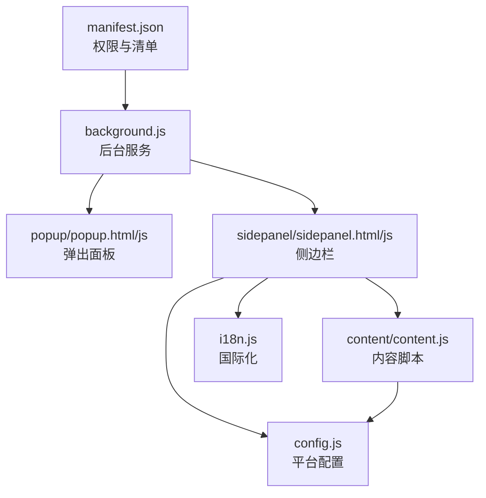
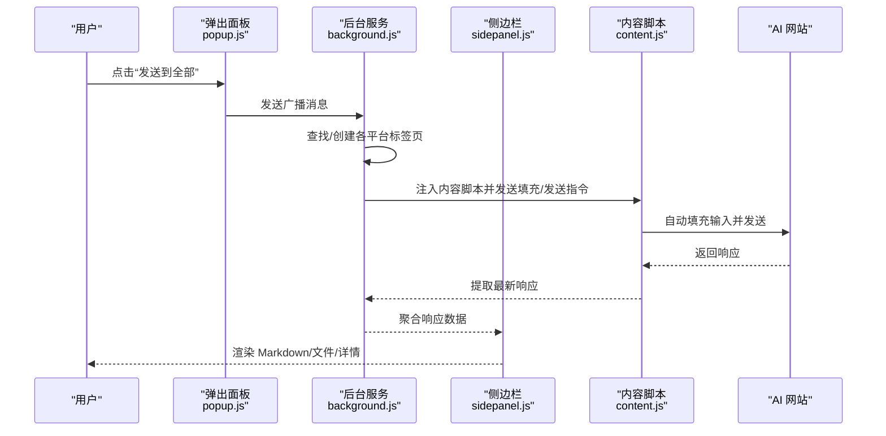
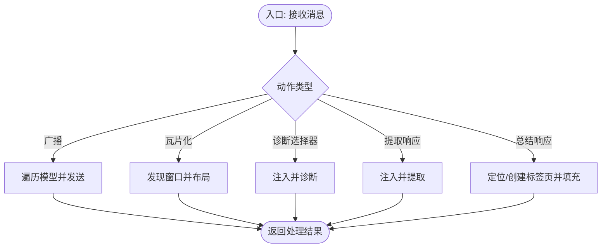
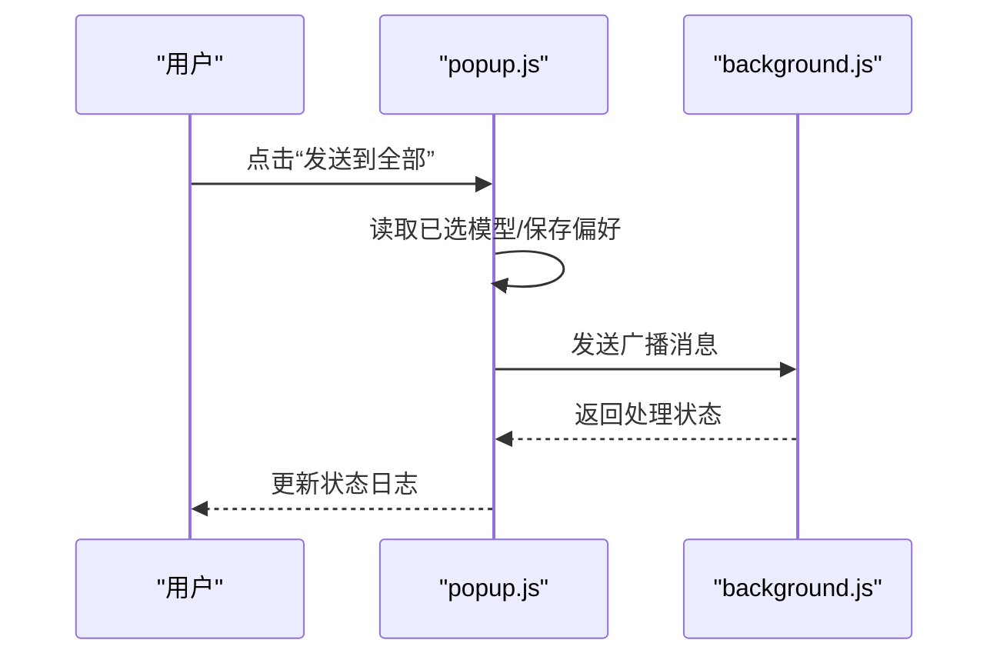
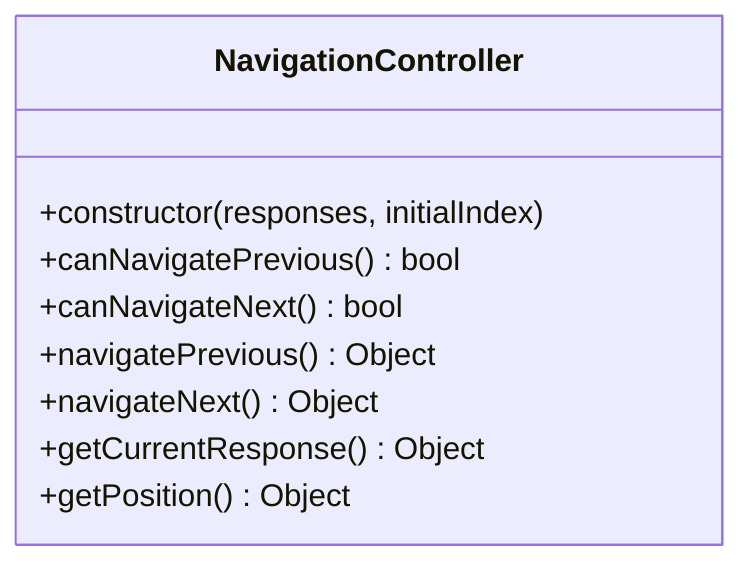
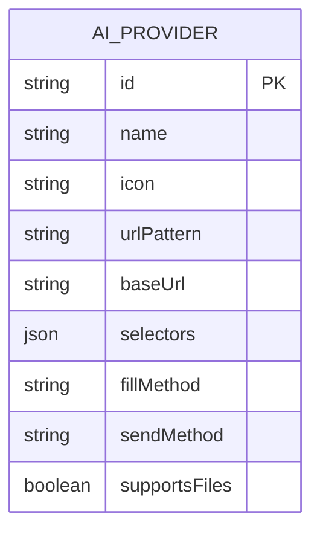
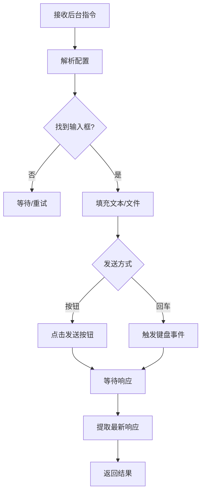
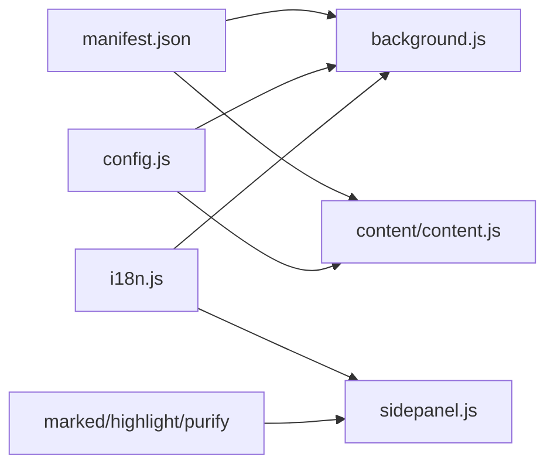

# 开发指南

<cite>
**本文档引用的文件**
- [README.md](file://README.md)
- [CONTRIBUTING.md](file://CONTRIBUTING.md)
- [manifest.json](file://manifest.json)
- [src/background.js](file://src/background.js)
- [src/popup/popup.js](file://src/popup/popup.js)
- [src/sidepanel/sidepanel.js](file://src/sidepanel/sidepanel.js)
- [src/config.js](file://src/config.js)
- [src/content/content.js](file://src/content/content.js)
- [src/i18n.js](file://src/i18n.js)
- [src/popup/popup.html](file://src/popup/popup.html)
- [src/sidepanel/sidepanel.html](file://src/sidepanel/sidepanel.html)
- [QUICK_TEST_GUIDE.md](file://QUICK_TEST_GUIDE.md)
- [TESTING_v1.7.md](file://TESTING_v1.7.md)
</cite>

## 目录
1. [简介](#简介)
2. [项目结构](#项目结构)
3. [核心组件](#核心组件)
4. [架构总览](#架构总览)
5. [详细组件分析](#详细组件分析)
6. [依赖关系分析](#依赖关系分析)
7. [性能考虑](#性能考虑)
8. [故障排查指南](#故障排查指南)
9. [结论](#结论)
10. [附录](#附录)

## 简介
本指南面向希望参与开发与扩展本 Chrome 扩展的工程师与测试人员，覆盖开发环境搭建、本地调试、测试策略、新功能开发规范、扩展方法（新增平台/模块/API 设计）、架构决策与重构策略、代码审查标准以及常用工具与排障技巧。项目采用原生 JavaScript、HTML/CSS，无构建工具，强调轻量化与可维护性。

## 项目结构
项目采用按职责分层的组织方式：
- manifest.json：扩展清单，声明权限、后台脚本、内容脚本匹配规则与快捷键等
- src/background.js：后台服务工作线程，负责窗口管理、消息路由、跨标签通信与脚本注入
- src/popup/：弹出面板（轻交互入口），负责快速广播消息与状态展示
- src/sidepanel/：侧边栏（主要交互面），负责多模型对话、响应聚合、Markdown 渲染、文件上传、总结等
- src/config.js：统一的 AI 平台配置中心，集中管理各平台的域名、基础 URL、选择器、填充与发送策略
- src/content/content.js：内容脚本，注入到各 AI 网站，负责自动化输入、发送、响应提取与调试诊断
- src/i18n.js：国际化与本地化，支持中英双语与相对时间格式化
- 其他资源：图标、第三方库（marked、highlight、purify 等）按需引入

图表来源
- [manifest.json](file://manifest.json#L1-L79)
- [src/background.js](file://src/background.js#L1-L120)
- [src/popup/popup.html](file://src/popup/popup.html#L1-L50)
- [src/popup/popup.js](file://src/popup/popup.js#L1-L61)
- [src/sidepanel/sidepanel.html](file://src/sidepanel/sidepanel.html#L1-L120)
- [src/sidepanel/sidepanel.js](file://src/sidepanel/sidepanel.js#L1-L120)
- [src/content/content.js](file://src/content/content.js#L1-L60)
- [src/config.js](file://src/config.js#L1-L40)
- [src/i18n.js](file://src/i18n.js#L1-L60)

章节来源
- [README.md](file://README.md#L20-L29)
- [manifest.json](file://manifest.json#L1-L79)

## 核心组件
- 后台服务（background.js）
  - 管理弹出/侧边栏窗口生命周期与焦点
  - 广播消息到多个 AI 平台标签页
  - 瓦片化窗口、关闭全部窗口、诊断选择器、提取响应、总结响应
  - 主世界注入与内容脚本注入的协调
- 弹出面板（popup.js）
  - 读取/保存用户偏好（已选模型）
  - 发起广播消息到后台
  - 接收状态更新并展示
- 侧边栏（sidepanel.js）
  - 多标签页响应聚合与 Markdown 渲染
  - 文件拖拽上传与预览
  - 响应详情 Modal 与导航控制器
  - 国际化文案与主题切换
- 平台配置（config.js）
  - 统一管理各 AI 平台的域名匹配、基础 URL、输入/按钮/响应选择器、文件上传支持、填充与发送策略
- 内容脚本（content.js）
  - 自动填充输入框、点击发送、提取最新响应
  - 选择器诊断、思维内容过滤、文本清洗
- 国际化（i18n.js）
  - 文案键值映射、相对时间格式化、语言切换

章节来源
- [src/background.js](file://src/background.js#L1-L200)
- [src/popup/popup.js](file://src/popup/popup.js#L1-L61)
- [src/sidepanel/sidepanel.js](file://src/sidepanel/sidepanel.js#L1-L120)
- [src/config.js](file://src/config.js#L1-L204)
- [src/content/content.js](file://src/content/content.js#L1-L120)
- [src/i18n.js](file://src/i18n.js#L1-L120)

## 架构总览
整体采用“后台服务 + 内容脚本”的扩展架构：
- 后台服务负责跨标签通信、窗口管理与脚本注入
- 内容脚本注入到目标站点，直接操作 DOM 实现自动化
- 侧边栏作为用户交互中枢，聚合响应并提供高级功能（Markdown、文件、总结）

图表来源
- [src/popup/popup.js](file://src/popup/popup.js#L15-L45)
- [src/background.js](file://src/background.js#L718-L786)
- [src/content/content.js](file://src/content/content.js#L200-L216)
- [src/sidepanel/sidepanel.js](file://src/sidepanel/sidepanel.js#L1-L120)

## 详细组件分析

### 后台服务（background.js）
- 窗口管理
  - 弹出/侧边栏窗口的创建、聚焦、最小化与状态恢复
  - 基于显示器信息的瓦片化布局计算与应用
- 消息处理
  - 广播消息、瓦片化、仅启动指定模型、关闭全部窗口
  - 诊断选择器、提取响应、总结响应（调用目标模型标签页）
- 脚本注入
  - 确保内容脚本可用，必要时动态注入
  - 主世界注入用于绕过 React 状态的复杂场景
- 状态通知
  - 将状态更新通过 runtime sendMessage 回传给 UI

图表来源
- [src/background.js](file://src/background.js#L139-L197)
- [src/background.js](file://src/background.js#L200-L268)
- [src/background.js](file://src/background.js#L270-L296)
- [src/background.js](file://src/background.js#L298-L376)

章节来源
- [src/background.js](file://src/background.js#L1-L200)
- [src/background.js](file://src/background.js#L527-L643)

### 弹出面板（popup.js）
- 读取上次选择的模型并回显
- 发送消息到后台进行广播
- 监听状态更新并在 UI 中展示

图表来源
- [src/popup/popup.js](file://src/popup/popup.js#L1-L61)

章节来源
- [src/popup/popup.js](file://src/popup/popup.js#L1-L61)
- [src/popup/popup.html](file://src/popup/popup.html#L1-L50)

### 侧边栏（sidepanel.js）
- Markdown 渲染与代码块复制
- 文件拖拽上传与预览
- 响应详情 Modal 与导航控制器
- 国际化与主题切换
- 响应聚合与“获取响应”、“复制全部”

图表来源
- [src/sidepanel/sidepanel.js](file://src/sidepanel/sidepanel.js#L712-L800)

章节来源
- [src/sidepanel/sidepanel.js](file://src/sidepanel/sidepanel.js#L1-L200)
- [src/sidepanel/sidepanel.html](file://src/sidepanel/sidepanel.html#L1-L120)

### 平台配置（config.js）
- 统一管理各平台的域名匹配、基础 URL、选择器集合、文件上传支持、填充与发送策略
- 新增平台时只需在此处扩展

图表来源
- [src/config.js](file://src/config.js#L5-L199)

章节来源
- [src/config.js](file://src/config.js#L1-L204)

### 内容脚本（content.js）
- 自动填充输入框、点击发送按钮或按回车
- 提取最新响应，支持多种响应容器选择器
- 诊断选择器、去除思维内容、文本清洗

图表来源
- [src/content/content.js](file://src/content/content.js#L200-L216)
- [src/content/content.js](file://src/content/content.js#L322-L420)

章节来源
- [src/content/content.js](file://src/content/content.js#L1-L200)
- [src/content/content.js](file://src/content/content.js#L200-L400)

### 国际化（i18n.js）
- 文案键值映射、变量替换、相对时间格式化
- 与 UI 元素 data-i18n 属性配合使用

章节来源
- [src/i18n.js](file://src/i18n.js#L1-L120)
- [src/sidepanel/sidepanel.html](file://src/sidepanel/sidepanel.html#L18-L60)

## 依赖关系分析
- manifest.json 声明 host_permissions 与 content_scripts 匹配规则，确保后台与内容脚本可访问目标站点
- background.js 依赖 config.js 与 i18n.js（通过 importScripts 或全局作用域）
- sidepanel.js 依赖 config.js、i18n.js 与第三方库（marked、highlight、purify）
- content.js 依赖 config.js 与 i18n.js（通过全局作用域）

图表来源
- [manifest.json](file://manifest.json#L45-L68)
- [src/background.js](file://src/background.js#L69-L74)
- [src/sidepanel/sidepanel.html](file://src/sidepanel/sidepanel.html#L392-L397)
- [src/config.js](file://src/config.js#L1-L40)
- [src/i18n.js](file://src/i18n.js#L1-L60)

章节来源
- [manifest.json](file://manifest.json#L1-L79)
- [src/background.js](file://src/background.js#L69-L74)
- [src/sidepanel/sidepanel.html](file://src/sidepanel/sidepanel.html#L392-L397)

## 性能考虑
- 选择器与 DOM 查询
  - 使用精确的选择器集合，优先命中最近的响应容器，减少扫描范围
  - 对于长文本填充，避免频繁触发事件，必要时批量 dispatch
- 并行处理
  - 广播消息与瓦片化窗口采用 Promise.allSettled 并行执行，提升吞吐
- 脚本注入与等待
  - 注入前先尝试 ping，失败再 executeScript，减少不必要的注入
  - 对目标标签页加载完成进行超时控制，避免无限等待
- 渲染与复制
  - Markdown 渲染与代码块复制在 Modal 打开时初始化，避免重复开销
- 文件上传
  - 严格限制单文件与总大小，避免内存压力

章节来源
- [src/background.js](file://src/background.js#L718-L786)
- [src/background.js](file://src/background.js#L527-L643)
- [src/sidepanel/sidepanel.js](file://src/sidepanel/sidepanel.js#L1-L120)

## 故障排查指南
- 安装与加载
  - 确认已开启“开发者模式”，使用“加载已解压的扩展程序”加载根目录
  - 若出现“脚本注入失败”，检查 manifest.json 的 host_permissions 与 content_scripts 匹配
- 选择器失效
  - 使用后台消息“诊断选择器”，在目标站点侧边栏中查看诊断结果
  - 根据诊断结果调整 config.js 中的响应选择器
- 响应提取为空
  - 检查 content.js 的响应提取逻辑与思维内容过滤策略
  - 确认目标站点的响应容器是否发生变化
- 窗口瓦片化异常
  - 检查显示器信息与目标显示区域，确认 lastTileDisplayId 是否被正确保存
- Markdown 渲染问题
  - 确认 marked、highlight、DOMPurify 库已正确加载
  - 检查 sidepanel.html 中的库引入顺序与路径
- 文件上传失败
  - 检查文件类型与大小限制，确认 provider 的 supportedFileTypes 与 MAX_FILE_SIZE

章节来源
- [QUICK_TEST_GUIDE.md](file://QUICK_TEST_GUIDE.md#L66-L139)
- [TESTING_v1.7.md](file://TESTING_v1.7.md#L71-L161)
- [src/background.js](file://src/background.js#L163-L196)
- [src/content/content.js](file://src/content/content.js#L126-L197)
- [src/sidepanel/sidepanel.js](file://src/sidepanel/sidepanel.js#L6-L39)

## 结论
本项目以“轻量化、可维护、可扩展”为核心设计目标，通过统一的平台配置与内容脚本注入机制，实现了对多家 AI 平台的一致化支持。建议在新增平台或功能时遵循本文档的规范与流程，确保一致性与稳定性。

## 附录

### 开发环境搭建与本地调试
- 安装与加载
  - 打开 chrome://extensions，开启“开发者模式”
  - 点击“加载已解压的扩展程序”，选择仓库根目录
  - 固定扩展图标以便快速访问
- 调试要点
  - 使用浏览器开发者工具查看 Console、Network、Elements
  - 在后台服务与内容脚本中设置断点，观察消息传递与 DOM 操作
  - 使用“诊断选择器”功能验证选择器有效性

章节来源
- [README.md](file://README.md#L30-L47)
- [src/background.js](file://src/background.js#L163-L196)

### 新功能开发指导
- 代码结构规范
  - 保持原生 JS、HTML/CSS，避免引入构建工具
  - 模块化：平台配置集中于 config.js，UI 逻辑集中在 sidepanel.js，后台逻辑集中在 background.js
- 命名约定
  - 变量与函数使用清晰的动宾结构，如 handleTileWindows、ensureContentScript
  - 选择器与类名尽量语义化，便于维护
- 最佳实践
  - 优先使用“主世界注入”绕过 React 状态，必要时在内容脚本中模拟真实交互
  - 对长文本与文件上传进行分段处理与超时控制
  - 在 UI 中提供明确的状态反馈与错误提示

章节来源
- [CONTRIBUTING.md](file://CONTRIBUTING.md#L44-L48)
- [src/background.js](file://src/background.js#L378-L526)
- [src/content/content.js](file://src/content/content.js#L322-L420)

### 扩展开发方法
- 新平台集成流程
  - 在 config.js 中新增平台条目，配置域名匹配、基础 URL、选择器、发送/填充策略
  - 在 manifest.json 的 host_permissions 与 content_scripts 中添加对应域名
  - 在 sidepanel.html 中添加图标并更新模型选择器
  - 使用“诊断选择器”验证选择器有效性
- 功能模块扩展
  - 侧边栏：在 sidepanel.js 中新增 UI 与逻辑，注意与 i18n 的键值映射
  - 后台：在 background.js 中新增消息处理分支，并确保与 UI 的 action 对齐
- API 设计原则
  - 消息协议：统一 action 字段，请求/响应结构清晰，错误信息可读
  - 参数校验：在内容脚本与后台均进行参数校验与边界处理
  - 可观测性：为关键路径添加日志与诊断接口

章节来源
- [CONTRIBUTING.md](file://CONTRIBUTING.md#L5-L43)
- [src/config.js](file://src/config.js#L1-L204)
- [manifest.json](file://manifest.json#L19-L68)
- [src/sidepanel/sidepanel.html](file://src/sidepanel/sidepanel.html#L183-L246)

### 代码审查标准
- 质量要求
  - 无语法错误，变量命名清晰，注释完整
  - 逻辑分支覆盖充分，异常路径有明确处理
- 性能考量
  - 避免阻塞主线程，使用异步与超时控制
  - 选择器与 DOM 操作尽量高效
- 安全检查
  - 输入校验与转义，防止 XSS
  - 仅注入必要的脚本与权限

章节来源
- [TESTING_v1.7.md](file://TESTING_v1.7.md#L5-L10)
- [src/i18n.js](file://src/i18n.js#L95-L120)

### 测试策略与快速测试
- 快速测试
  - 使用提供的测试页面验证 Markdown 渲染、窗口调节手柄、复制按钮
  - 在扩展中重新加载后验证侧边栏功能
- 自测清单
  - 基础功能：广播、获取响应、复制、瓦片化、关闭全部
  - 国际化：中英切换、文案更新
  - 边界测试：长提示词、空提示词、特殊字符、快速点击、模型未打开/已打开场景
- 调试工具
  - 控制台运行 debug_handles.js 检查 Modal 手柄
  - 使用“诊断选择器”定位响应容器

章节来源
- [QUICK_TEST_GUIDE.md](file://QUICK_TEST_GUIDE.md#L20-L139)
- [TESTING_v1.7.md](file://TESTING_v1.7.md#L71-L211)