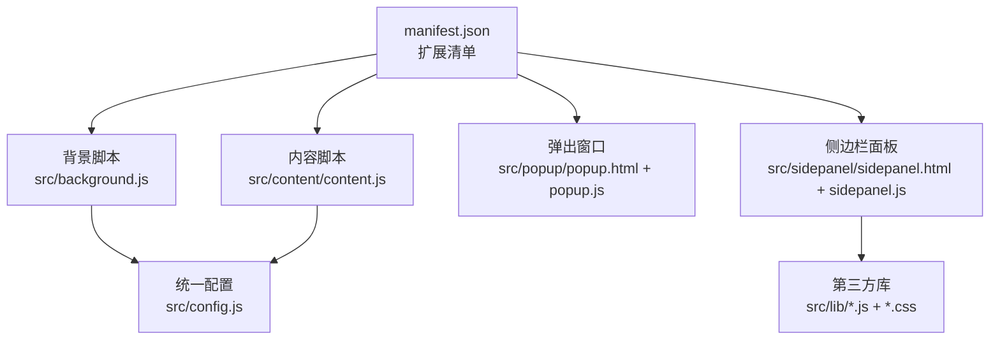
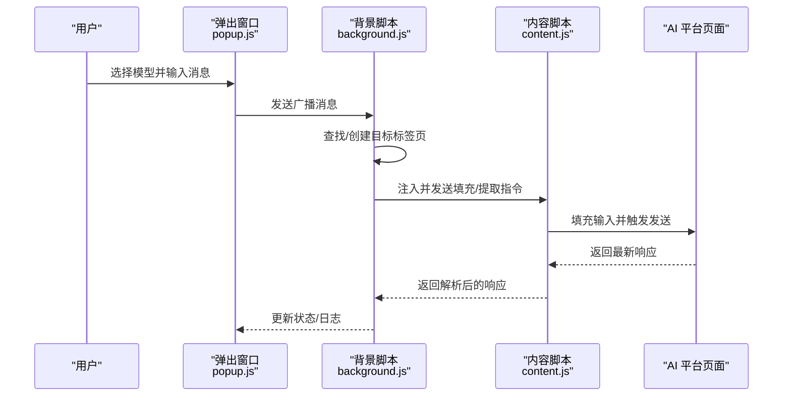
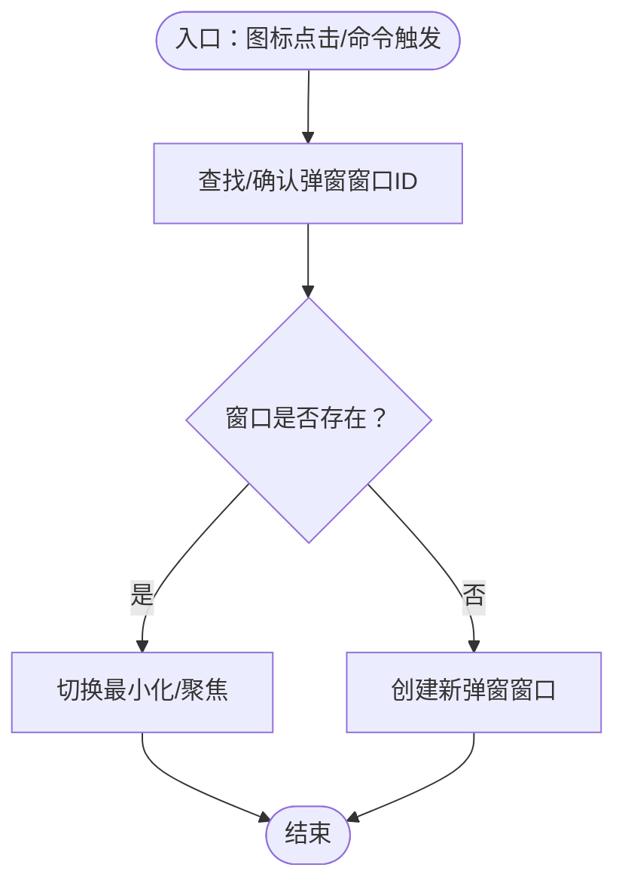
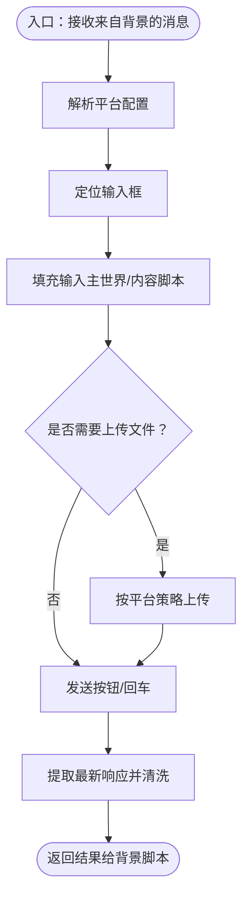
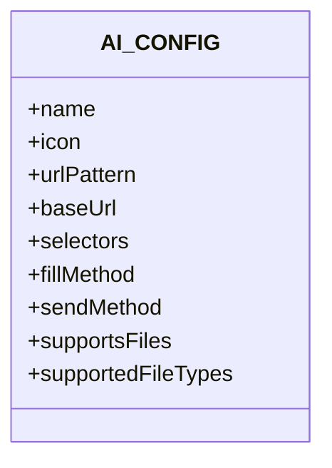
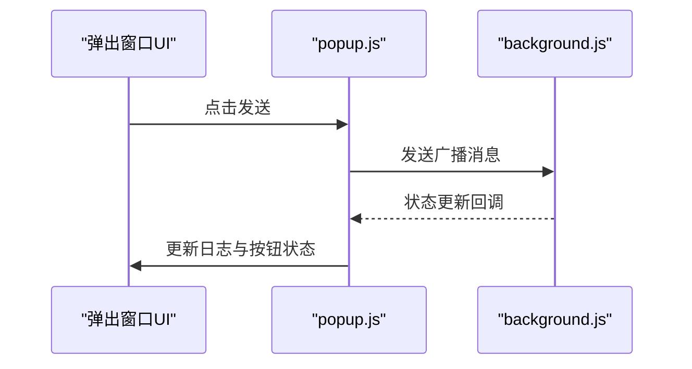
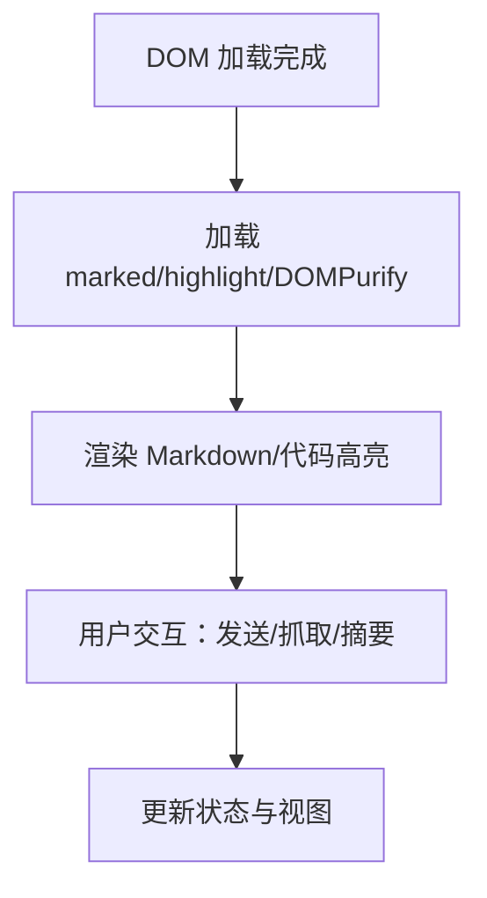
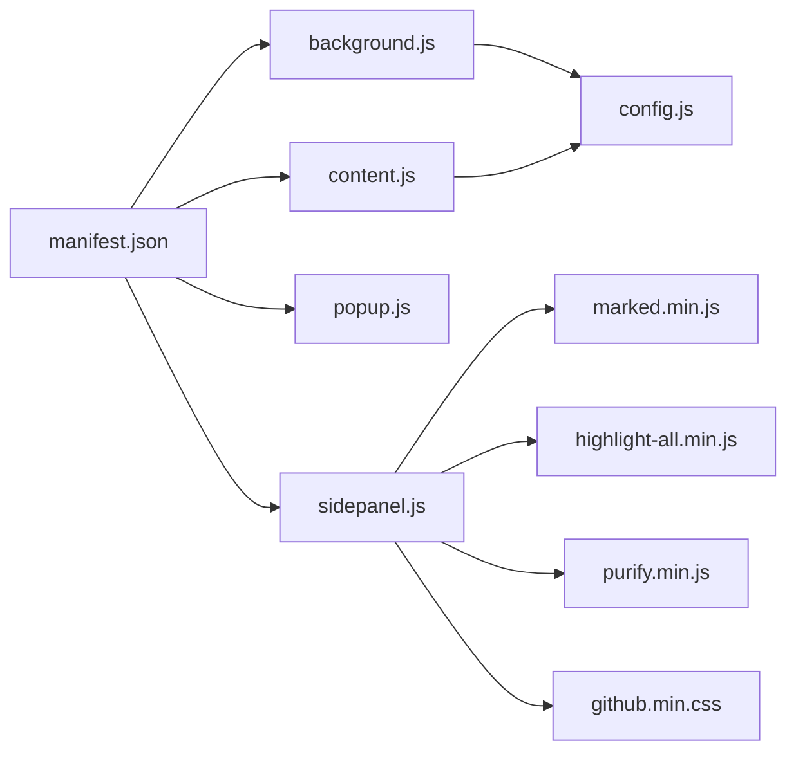

# 开发环境搭建

<cite>
**本文引用的文件**
- [manifest.json](file://manifest.json)
- [README.md](file://README.md)
- [CONTRIBUTING.md](file://CONTRIBUTING.md)
- [.vscode/settings.json](file://.vscode/settings.json)
- [src/background.js](file://src/background.js)
- [src/content/content.js](file://src/content/content.js)
- [src/config.js](file://src/config.js)
- [src/popup/popup.js](file://src/popup/popup.js)
- [src/sidepanel/sidepanel.js](file://src/sidepanel/sidepanel.js)
- [src/popup/popup.html](file://src/popup/popup.html)
- [src/sidepanel/sidepanel.html](file://src/sidepanel/sidepanel.html)
- [src/lib/github.min.css](file://src/lib/github.min.css)
- [src/lib/highlight-all.min.js](file://src/lib/highlight-all.min.js)
</cite>

## 目录
1. [简介](#简介)
2. [项目结构](#项目结构)
3. [核心组件](#核心组件)
4. [架构总览](#架构总览)
5. [详细组件分析](#详细组件分析)
6. [依赖分析](#依赖分析)
7. [性能考虑](#性能考虑)
8. [故障排除指南](#故障排除指南)
9. [结论](#结论)
10. [附录](#附录)

## 简介
本指南面向希望在本地开发与调试本 Chrome 扩展的工程师与贡献者，覆盖以下主题：
- Chrome 浏览器设置与扩展加载
- 开发服务器与热重载方案（本项目为静态资源，无需构建）
- IDE 推荐设置（VS Code）
- 调试工具链（扩展后台、内容脚本、侧边栏面板）
- 常见问题与排障

本项目采用原生 JavaScript、HTML、CSS，无构建工具，开发流程以“加载已解压扩展”为主。

## 项目结构
项目采用按功能模块划分的目录组织，核心入口与清单文件如下：
- 清单与权限：manifest.json
- 背景脚本：src/background.js
- 内容脚本：src/content/content.js
- 统一配置：src/config.js
- 弹出窗口：src/popup/popup.html + popup.js
- 侧边栏面板：src/sidepanel/sidepanel.html + sidepanel.js
- 第三方库：src/lib/*.js + *.css

图表来源
- [manifest.json](file://manifest.json#L1-L79)
- [src/background.js](file://src/background.js#L1-L120)
- [src/content/content.js](file://src/content/content.js#L1-L60)
- [src/config.js](file://src/config.js#L1-L40)
- [src/popup/popup.html](file://src/popup/popup.html#L1-L50)
- [src/sidepanel/sidepanel.html](file://src/sidepanel/sidepanel.html#L1-L60)
- [src/lib/github.min.css](file://src/lib/github.min.css#L1-L10)
- [src/lib/highlight-all.min.js](file://src/lib/highlight-all.min.js#L1-L40)

章节来源
- [manifest.json](file://manifest.json#L1-L79)
- [README.md](file://README.md#L20-L29)

## 核心组件
- 扩展清单（manifest.json）：声明权限、主机权限、动作、背景脚本、内容脚本匹配规则等。
- 背景脚本（background.js）：扩展生命周期控制、窗口管理、消息分发、脚本注入、跨标签通信。
- 内容脚本（content.js）：注入到各 AI 平台页面，负责输入填充、发送、响应提取与诊断。
- 统一配置（config.js）：集中管理各平台的选择器、发送方式、文件上传策略等。
- 弹出窗口（popup）：轻量交互，广播消息至多个平台。
- 侧边栏面板（sidepanel）：持久化界面，支持多窗口排列、响应抓取、Markdown 渲染、摘要生成等。

章节来源
- [manifest.json](file://manifest.json#L12-L79)
- [src/background.js](file://src/background.js#L1-L120)
- [src/content/content.js](file://src/content/content.js#L1-L120)
- [src/config.js](file://src/config.js#L1-L204)
- [src/popup/popup.js](file://src/popup/popup.js#L1-L61)
- [src/sidepanel/sidepanel.js](file://src/sidepanel/sidepanel.js#L1-L120)

## 架构总览
扩展由“清单驱动 + 背景脚本协调 + 内容脚本注入 + 统一配置”构成，消息流经 runtime 通道在扩展内部传递。

图表来源
- [src/popup/popup.js](file://src/popup/popup.js#L15-L45)
- [src/background.js](file://src/background.js#L138-L197)
- [src/content/content.js](file://src/content/content.js#L199-L216)

## 详细组件分析

### 组件A：背景脚本（background.js）
职责与要点
- 管理扩展图标点击与侧边栏弹窗显示/隐藏
- 管理多显示器窗口布局与排列
- 注入内容脚本并处理跨标签通信
- 提供诊断、响应抓取、摘要生成等高级能力

关键流程
- 图标点击：根据已有窗口状态决定最小化/聚焦/新建弹窗
- 广播发送：定位/创建目标标签页，注入内容脚本，发送填充与提交指令
- 窗口排列：发现目标窗口，计算屏幕区域，批量更新窗口尺寸与位置

图表来源
- [src/background.js](file://src/background.js#L9-L59)

章节来源
- [src/background.js](file://src/background.js#L1-L120)
- [src/background.js](file://src/background.js#L527-L643)

### 组件B：内容脚本（content.js）
职责与要点
- 解析统一配置，定位输入框与发送按钮
- 填充输入（支持主世界注入与内容脚本直接填充）
- 文件上传（按平台策略上传）
- 抓取最新响应并清洗“思考/推理”片段
- 提供诊断工具（选择器诊断）

图表来源
- [src/content/content.js](file://src/content/content.js#L322-L418)
- [src/content/content.js](file://src/content/content.js#L465-L565)

章节来源
- [src/content/content.js](file://src/content/content.js#L1-L120)
- [src/content/content.js](file://src/content/content.js#L126-L197)
- [src/content/content.js](file://src/content/content.js#L218-L320)

### 组件C：统一配置（config.js）
职责与要点
- 集中定义各 AI 平台的选择器、发送方式、文件上传策略
- 作为内容脚本与背景脚本共享的全局常量

图表来源
- [src/config.js](file://src/config.js#L5-L199)

章节来源
- [src/config.js](file://src/config.js#L1-L204)

### 组件D：弹出窗口（popup）
职责与要点
- 用户选择目标平台
- 发送消息给背景脚本执行广播
- 实时接收状态更新并展示

图表来源
- [src/popup/popup.html](file://src/popup/popup.html#L15-L45)
- [src/popup/popup.js](file://src/popup/popup.js#L15-L45)

章节来源
- [src/popup/popup.html](file://src/popup/popup.html#L1-L50)
- [src/popup/popup.js](file://src/popup/popup.js#L1-L61)

### 组件E：侧边栏面板（sidepanel）
职责与要点
- 持久化界面，支持多标签页与响应网格
- Markdown 渲染与代码高亮
- 响应抓取、复制、摘要设置与生成
- 多窗口排列与关闭确认

图表来源
- [src/sidepanel/sidepanel.html](file://src/sidepanel/sidepanel.html#L391-L398)
- [src/sidepanel/sidepanel.js](file://src/sidepanel/sidepanel.js#L5-L39)

章节来源
- [src/sidepanel/sidepanel.html](file://src/sidepanel/sidepanel.html#L1-L120)
- [src/sidepanel/sidepanel.js](file://src/sidepanel/sidepanel.js#L1-L120)

## 依赖分析
- 清单依赖：权限与主机权限决定扩展可访问的页面范围
- 脚本依赖：背景脚本依赖统一配置；内容脚本依赖统一配置与第三方库
- 第三方库：marked、highlight.js、DOMPurify 用于 Markdown 渲染与安全清理

图表来源
- [manifest.json](file://manifest.json#L12-L79)
- [src/background.js](file://src/background.js#L69-L75)
- [src/content/content.js](file://src/content/content.js#L1-L20)
- [src/config.js](file://src/config.js#L1-L20)
- [src/sidepanel/sidepanel.html](file://src/sidepanel/sidepanel.html#L13-L15)
- [src/sidepanel/sidepanel.html](file://src/sidepanel/sidepanel.html#L391-L398)
- [src/lib/github.min.css](file://src/lib/github.min.css#L1-L10)
- [src/lib/highlight-all.min.js](file://src/lib/highlight-all.min.js#L1-L40)

章节来源
- [manifest.json](file://manifest.json#L12-L79)
- [src/sidepanel/sidepanel.html](file://src/sidepanel/sidepanel.html#L13-L15)
- [src/sidepanel/sidepanel.html](file://src/sidepanel/sidepanel.html#L391-L398)

## 性能考虑
- 注入策略：优先使用主世界注入（executeScript）以绕过 React 等框架限制，但需谨慎避免重复事件链
- 等待与重试：输入框定位、按钮可用性检测、上传超时与重试机制
- 窗口布局：并行更新窗口属性，减少等待时间
- 响应抓取：优先使用最新响应选择器，必要时回退到通用选择器

章节来源
- [src/background.js](file://src/background.js#L378-L526)
- [src/content/content.js](file://src/content/content.js#L385-L418)
- [src/content/content.js](file://src/content/content.js#L465-L565)
- [src/background.js](file://src/background.js#L527-L643)

## 故障排除指南
常见问题与解决思路
- 扩展未显示或无法加载
  - 确认已开启“开发者模式”
  - 使用“加载已解压的扩展程序”选择项目根目录
- 主机权限不足
  - 检查清单中的 host_permissions 是否包含目标站点
- 内容脚本未注入
  - 背景脚本会尝试注入，若失败检查目标页面 URL 是否匹配 content_scripts 的匹配规则
- 输入框/发送按钮未定位
  - 使用内容脚本内置诊断工具（选择器诊断）查看匹配结果
- 响应为空或解析异常
  - 检查响应选择器配置，必要时更新统一配置
- 多窗口布局异常
  - 确认显示器信息可用，检查窗口状态与焦点

章节来源
- [README.md](file://README.md#L30-L47)
- [manifest.json](file://manifest.json#L19-L68)
- [src/background.js](file://src/background.js#L656-L678)
- [src/content/content.js](file://src/content/content.js#L126-L197)

## 结论
本项目以“清单驱动 + 背景脚本协调 + 内容脚本注入 + 统一配置”为核心架构，无需构建工具即可快速迭代。建议在开发过程中充分利用内置诊断与日志输出，结合 Chrome 开发者工具进行断点调试与网络监控，以保障多平台适配与稳定性。

## 附录

### A. Chrome 浏览器设置与扩展加载
- 打开扩展页面：chrome://extensions
- 开启“开发者模式”
- 点击“加载已解压的扩展程序”，选择项目根目录
- 可选：固定扩展图标以便快速访问

章节来源
- [README.md](file://README.md#L30-L47)

### B. 开发服务器与热重载
- 本项目为静态资源，无需构建工具
- 修改源码后，回到扩展页面点击“刷新”按钮以重新加载
- 若涉及清单变更，需重新加载扩展

章节来源
- [README.md](file://README.md#L20-L22)

### C. IDE 推荐设置（VS Code）
- 当前仓库提供空的 VS Code 设置文件，可按需扩展
- 推荐插件：ESLint、Prettier、Bracket Pair Colorizer、Live Server（可选）
- 语言与格式化：保持默认 JavaScript/HTML/CSS 格式化规则

章节来源
- [.vscode/settings.json](file://.vscode/settings.json#L1-L2)

### D. 调试工具链与技巧
- 打开扩展页面，点击“检查视图”进入后台页与内容脚本调试
- 断点设置：在 background.js、content.js、popup.js、sidepanel.js 中设置断点
- 网络监控：在 Network 面板观察 AI 平台请求与响应
- 控制台日志：利用 console.log 输出关键路径与参数

章节来源
- [src/background.js](file://src/background.js#L1-L120)
- [src/content/content.js](file://src/content/content.js#L1-L120)
- [src/popup/popup.js](file://src/popup/popup.js#L1-L61)
- [src/sidepanel/sidepanel.js](file://src/sidepanel/sidepanel.js#L1-L120)

### E. 新增 AI 平台接入流程
- 在统一配置中新增平台条目
- 在清单中添加主机权限与内容脚本匹配
- 准备图标并在侧边栏界面中引用
- 测试发送与响应抓取

章节来源
- [CONTRIBUTING.md](file://CONTRIBUTING.md#L5-L43)
- [src/config.js](file://src/config.js#L1-L204)
- [manifest.json](file://manifest.json#L19-L68)