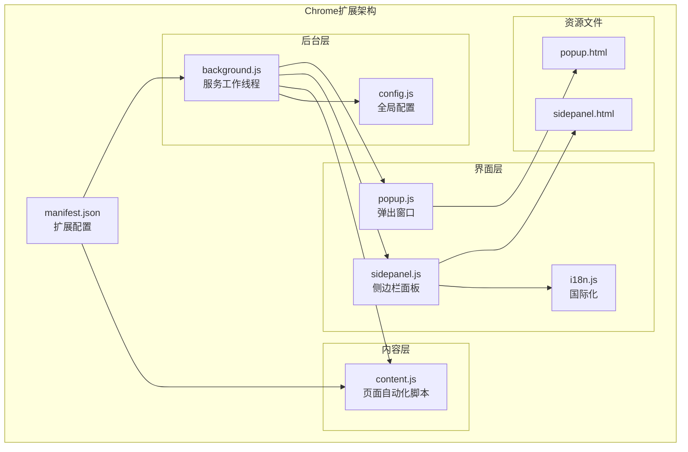
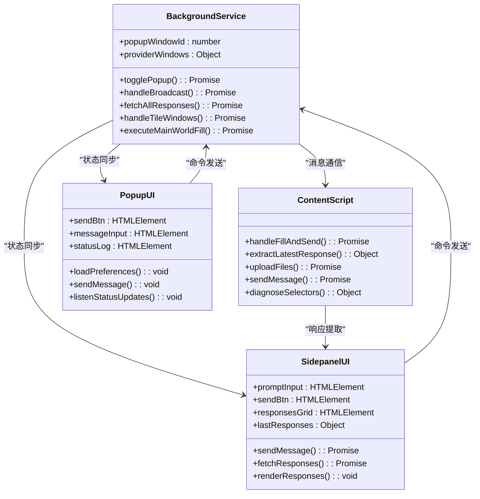
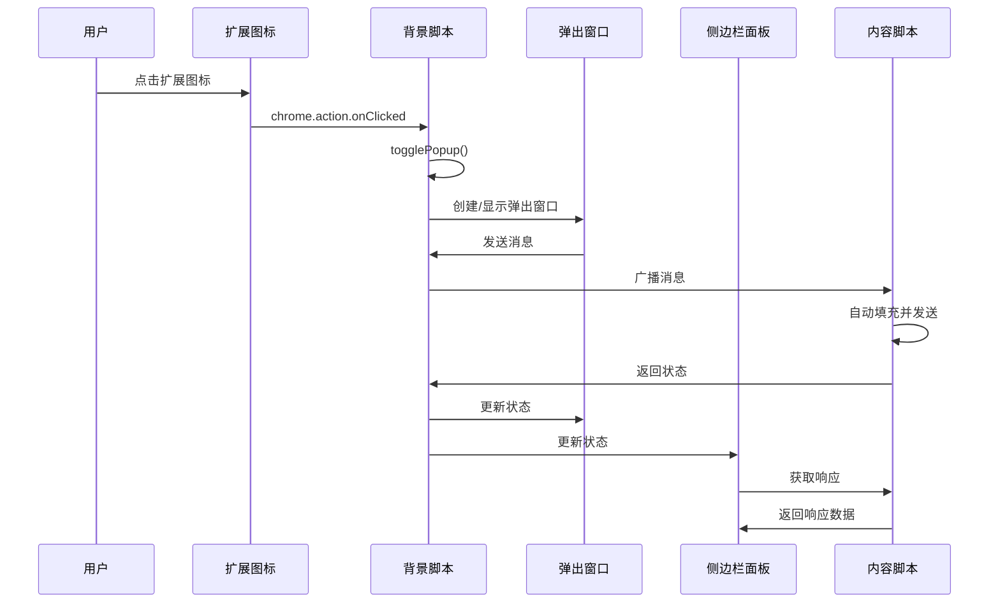
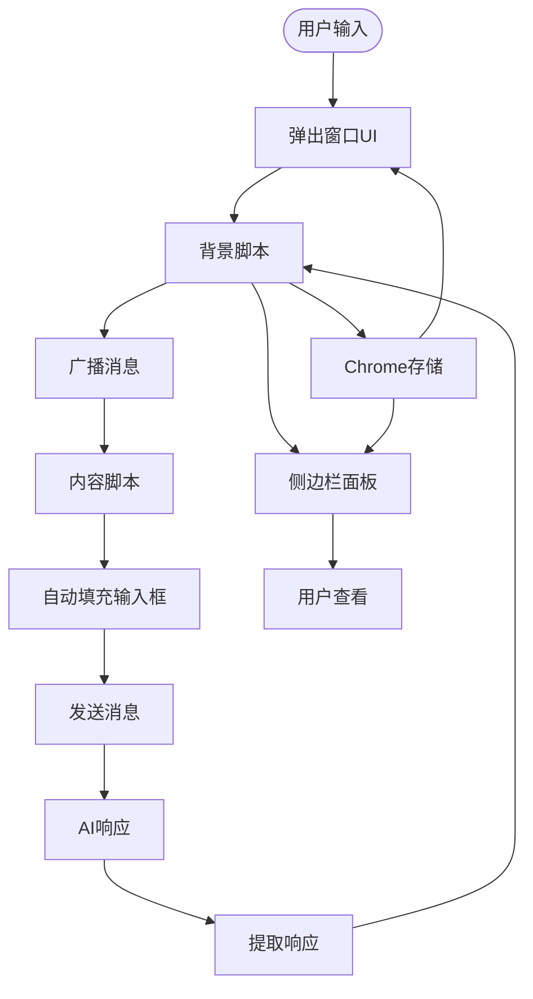
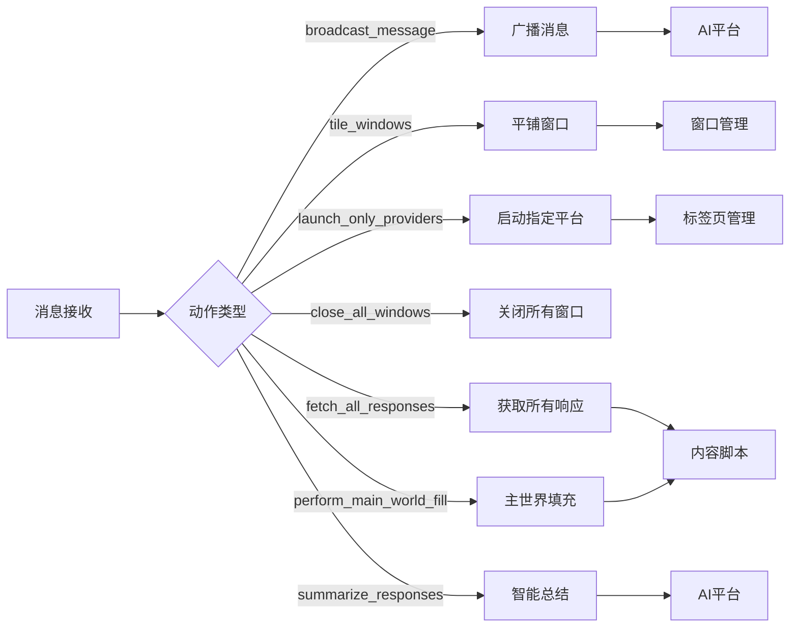
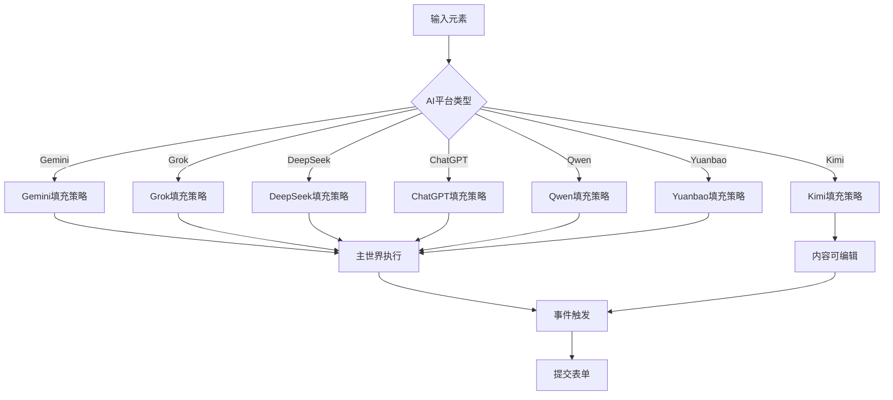
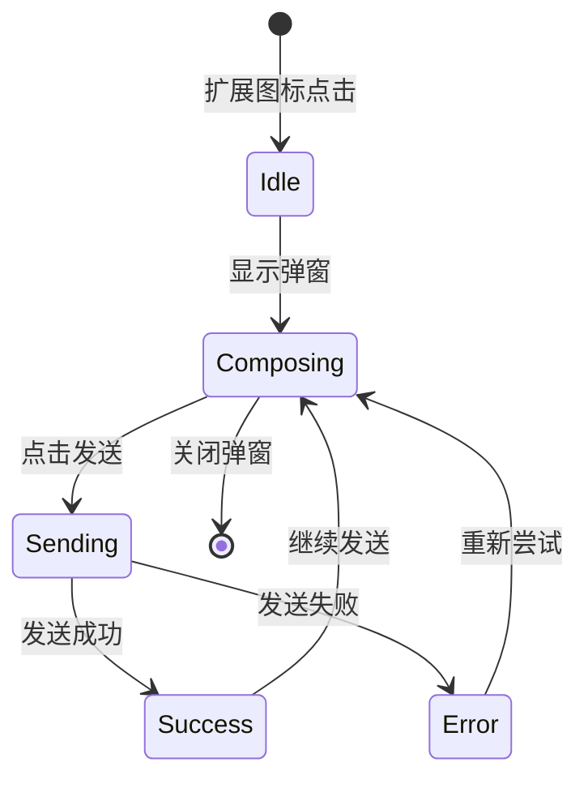
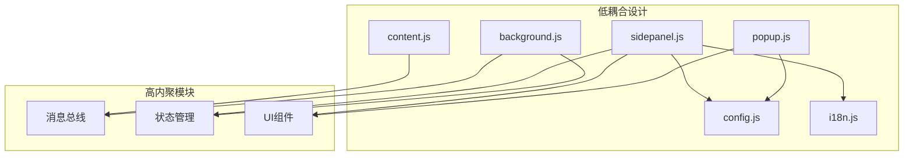
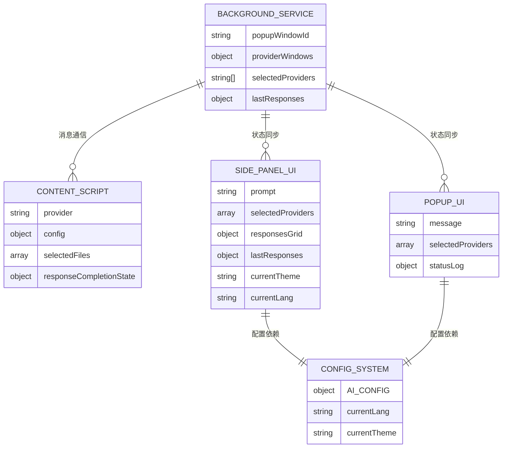
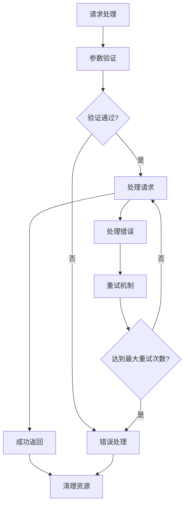

# Chrome扩展架构设计

<cite>
**本文档引用的文件**
- [manifest.json](file://manifest.json)
- [background.js](file://src/background.js)
- [content.js](file://src/content/content.js)
- [popup.js](file://src/popup/popup.js)
- [sidepanel.js](file://src/sidepanel/sidepanel.js)
- [config.js](file://src/config.js)
- [popup.html](file://src/popup/popup.html)
- [sidepanel.html](file://src/sidepanel/sidepanel.html)
- [i18n.js](file://src/i18n.js)
- [README.md](file://README.md)
</cite>

## 目录
1. [简介](#简介)
2. [项目结构](#项目结构)
3. [核心组件](#核心组件)
4. [架构概览](#架构概览)
5. [详细组件分析](#详细组件分析)
6. [依赖关系分析](#依赖关系分析)
7. [性能考虑](#性能考虑)
8. [故障排除指南](#故障排除指南)
9. [结论](#结论)

## 简介

AI Multiverse Chat 是一个基于Chrome扩展架构的多AI平台对话管理工具。该项目采用MVVM（Model-View-ViewModel）架构模式，实现了三个核心组件之间的高效协作：背景脚本（Background）、内容脚本（Content Script）和用户界面（Popup/Sidepanel）。

该扩展的核心目标是让用户能够同时向多个AI聊天平台（Gemini、Grok、Kimi、DeepSeek、ChatGPT、Qwen、Yuanbao）发送相同的消息，实现跨平台的AI对话比较和分析。

## 项目结构

项目采用模块化设计，每个组件都有明确的职责分工：

**图表来源**
- [manifest.json](file://manifest.json#L1-L79)
- [background.js](file://src/background.js#L1-L1028)
- [content.js](file://src/content/content.js#L1-L941)
- [popup.js](file://src/popup/popup.js#L1-L61)
- [sidepanel.js](file://src/sidepanel/sidepanel.js#L1-L2813)

**章节来源**
- [manifest.json](file://manifest.json#L1-L79)
- [README.md](file://README.md#L20-L29)

## 核心组件

### MVVM架构模式详解

该项目实现了经典的MVVM架构模式：

- **Model（模型层）**: `config.js` 提供统一的AI平台配置数据
- **View（视图层）**: `popup.html` 和 `sidepanel.html` 提供用户界面
- **ViewModel（视图模型层）**: `popup.js` 和 `sidepanel.js` 处理业务逻辑和状态管理

### 组件职责分工

**图表来源**
- [background.js](file://src/background.js#L1-L1028)
- [content.js](file://src/content/content.js#L1-L941)
- [popup.js](file://src/popup/popup.js#L1-L61)
- [sidepanel.js](file://src/sidepanel/sidepanel.js#L1-L2813)

**章节来源**
- [background.js](file://src/background.js#L1-L1028)
- [content.js](file://src/content/content.js#L1-L941)
- [popup.js](file://src/popup/popup.js#L1-L61)
- [sidepanel.js](file://src/sidepanel/sidepanel.js#L1-L2813)

## 架构概览

### 扩展生命周期管理

**图表来源**
- [background.js](file://src/background.js#L10-L67)
- [popup.js](file://src/popup/popup.js#L16-L45)
- [sidepanel.js](file://src/sidepanel/sidepanel.js#L1397-L1407)

### 数据流向分析

**图表来源**
- [popup.js](file://src/popup/popup.js#L16-L45)
- [background.js](file://src/background.js#L718-L786)
- [content.js](file://src/content/content.js#L218-L320)
- [sidepanel.js](file://src/sidepanel/sidepanel.js#L1700-L1721)

**章节来源**
- [manifest.json](file://manifest.json#L42-L79)
- [background.js](file://src/background.js#L138-L197)

## 详细组件分析

### 背景脚本（Background Service）

背景脚本是整个扩展的核心协调者，负责管理扩展的生命周期和组件间通信。

#### 主要功能模块

1. **窗口管理**: `togglePopup()` 函数负责控制弹出窗口的显示和隐藏
2. **消息路由**: 通过 `chrome.runtime.onMessage` 监听来自UI和内容脚本的消息
3. **AI平台协调**: 管理多个AI平台的窗口状态和消息分发
4. **状态同步**: 维护扩展的全局状态并在各组件间同步

#### 关键实现细节

**图表来源**
- [background.js](file://src/background.js#L138-L197)
- [background.js](file://src/background.js#L718-L786)

**章节来源**
- [background.js](file://src/background.js#L1-L1028)

### 内容脚本（Content Script）

内容脚本在AI网页环境中运行，负责与目标网站进行交互。

#### 核心功能

1. **DOM元素检测**: 使用多种选择器策略定位输入框和发送按钮
2. **智能填充**: 支持不同AI平台的输入框类型和填充方式
3. **响应提取**: 从页面中提取AI的最新回复
4. **文件上传**: 处理多平台的文件上传机制

#### 填充策略

**图表来源**
- [content.js](file://src/content/content.js#L420-L432)
- [content.js](file://src/content/content.js#L434-L463)

**章节来源**
- [content.js](file://src/content/content.js#L1-L941)

### 用户界面组件

#### 弹出窗口（Popup）

弹出窗口提供快速访问功能，适合简单的批量发送操作。

**图表来源**
- [popup.js](file://src/popup/popup.js#L16-L45)

#### 侧边栏面板（Sidepanel）

侧边栏面板提供完整的对话管理功能，包括响应查看、历史记录、智能总结等高级功能。

**章节来源**
- [popup.js](file://src/popup/popup.js#L1-L61)
- [sidepanel.js](file://src/sidepanel/sidepanel.js#L1-L2813)

### 配置管理系统

全局配置系统 (`config.js`) 提供了所有AI平台的统一配置，包括：

- **选择器映射**: 针对每个平台的DOM选择器
- **填充策略**: 不同平台的输入框填充方式
- **发送机制**: 各平台的发送按钮或快捷键
- **文件上传**: 支持的文件类型和上传方式

**章节来源**
- [config.js](file://src/config.js#L1-L204)

## 依赖关系分析

### 组件耦合度分析

### 数据流依赖

**图表来源**
- [background.js](file://src/background.js#L3-L8)
- [content.js](file://src/content/content.js#L420-L432)
- [sidepanel.js](file://src/sidepanel/sidepanel.js#L46-L62)

**章节来源**
- [background.js](file://src/background.js#L1-L1028)
- [content.js](file://src/content/content.js#L1-L941)
- [sidepanel.js](file://src/sidepanel/sidepanel.js#L1-L2813)

## 性能考虑

### 并发处理优化

1. **Promise.allSettled**: 使用并行处理多个AI平台的响应获取
2. **超时机制**: 为长时间加载的页面设置超时保护
3. **内存管理**: 及时清理文件对象URL引用

### 错误处理策略

### 缓存策略

1. **窗口状态缓存**: 记录AI平台窗口ID以便快速定位
2. **配置缓存**: 全局配置一次性加载并缓存
3. **历史记录**: 使用Chrome存储进行本地持久化

## 故障排除指南

### 常见问题诊断

#### 脚本注入失败

**症状**: 内容脚本无法在目标页面运行
**解决方案**: 
1. 检查 `manifest.json` 中的 `content_scripts` 配置
2. 验证页面URL匹配模式
3. 确认 `run_at` 参数设置为 `document_idle`

#### 消息通信异常

**症状**: UI组件无法接收到后台消息
**解决方案**:
1. 检查 `chrome.runtime.onMessage` 监听器
2. 验证消息格式和action字段
3. 确认异步消息处理返回值

#### 响应提取失败

**症状**: 无法从AI页面提取回复内容
**解决方案**:
1. 使用 `diagnose_selectors` 工具检查选择器有效性
2. 更新AI平台的选择器配置
3. 检查页面DOM结构变化

**章节来源**
- [background.js](file://src/background.js#L656-L678)
- [content.js](file://src/content/content.js#L126-L197)

## 结论

AI Multiverse Chat 扩展通过精心设计的MVVM架构模式，成功实现了三个核心组件之间的高效协作。该架构具有以下优势：

### 技术优势

1. **清晰的职责分离**: 每个组件都有明确的功能边界
2. **良好的可维护性**: 模块化设计便于功能扩展和bug修复
3. **强大的扩展性**: 配置驱动的设计支持新AI平台的快速集成
4. **优秀的用户体验**: 提供了直观的多平台对话管理界面

### 架构决策要点

1. **组件解耦**: 通过消息总线实现松耦合的组件通信
2. **数据流向**: 单向数据流确保状态一致性
3. **错误处理**: 完善的错误捕获和恢复机制
4. **性能优化**: 并行处理和缓存策略提升响应速度

### 未来改进方向

1. **状态管理**: 考虑引入更完善的全局状态管理方案
2. **测试覆盖**: 增加单元测试和集成测试
3. **性能监控**: 添加性能指标收集和分析
4. **安全性增强**: 进一步强化跨域通信的安全性

该架构为类似Chrome扩展项目提供了优秀的参考模板，展示了如何在浏览器扩展环境中实现复杂的应用程序架构。