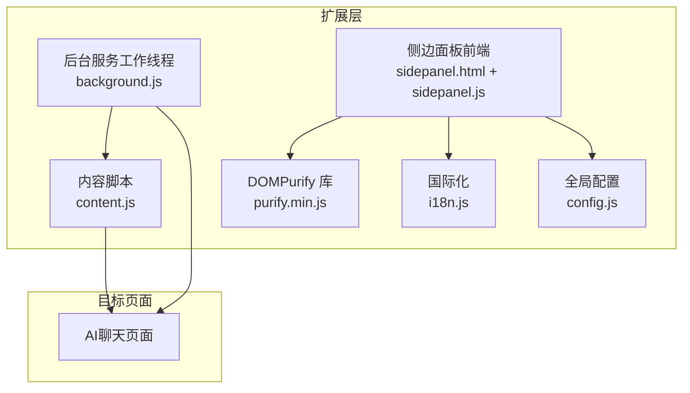
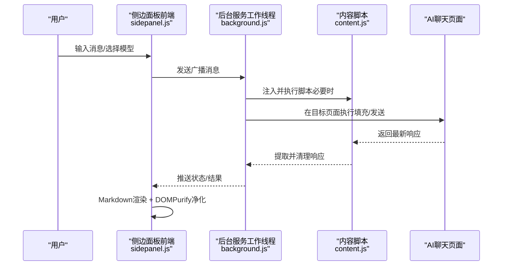
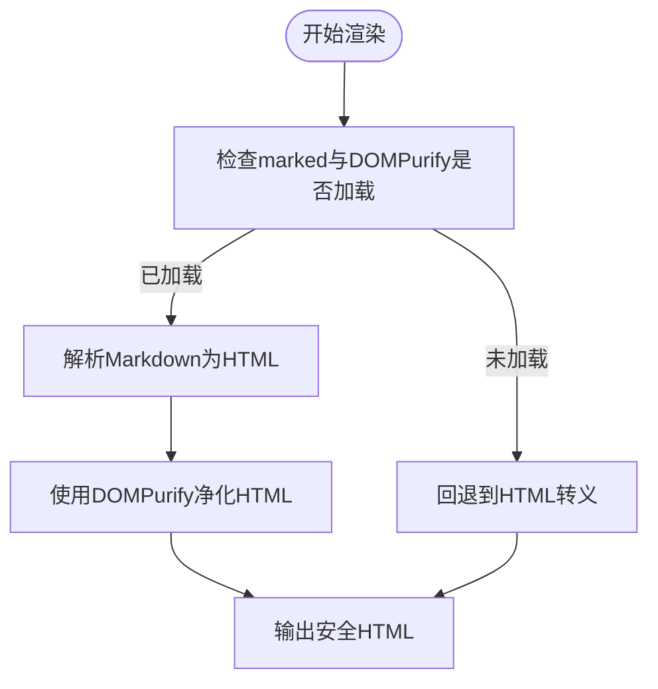
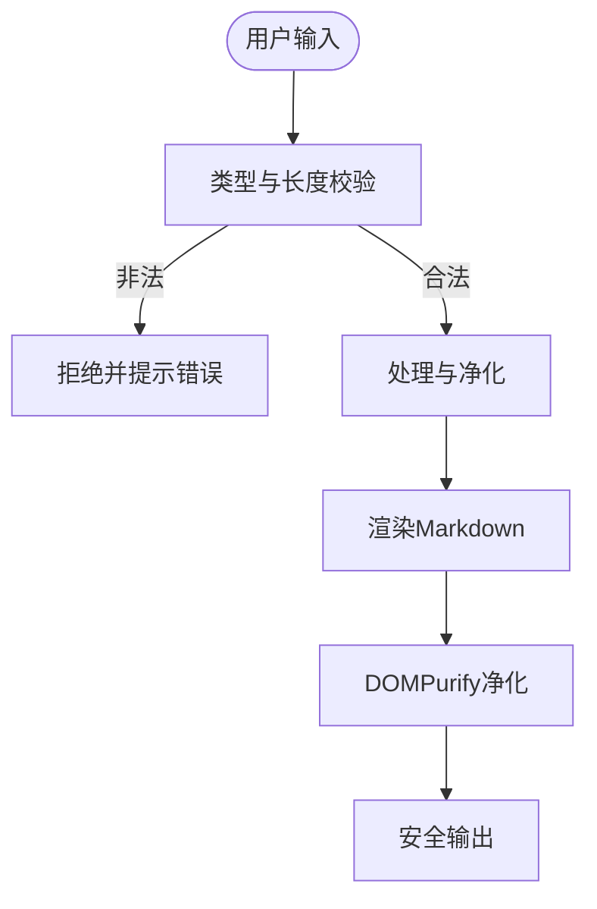
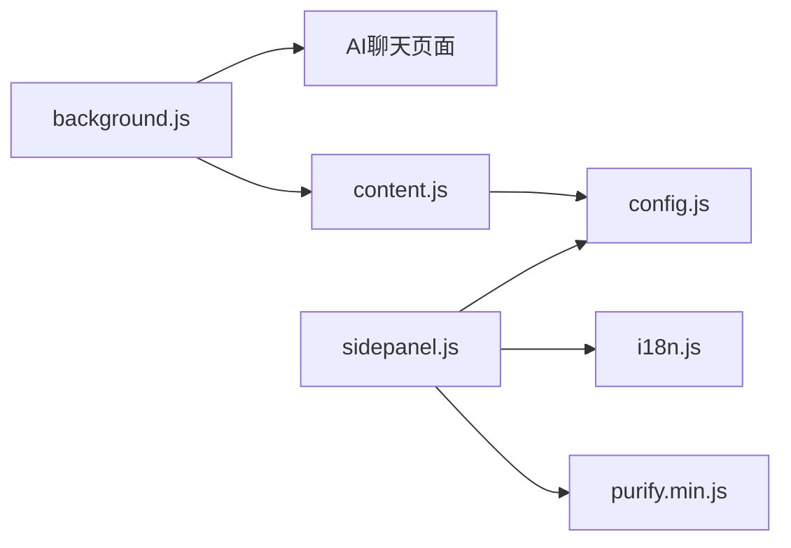

# 安全开发实践

<cite>
**本文引用的文件**
- [manifest.json](file://manifest.json)
- [background.js](file://src/background.js)
- [content.js](file://src/content/content.js)
- [sidepanel.js](file://src/sidepanel/sidepanel.js)
- [sidepanel.html](file://src/sidepanel/sidepanel.html)
- [config.js](file://src/config.js)
- [i18n.js](file://src/i18n.js)
- [purify.min.js](file://src/lib/purify.min.js)
- [MAINTENANCE.md](file://MAINTENANCE.md)
</cite>

## 目录
1. [简介](#简介)
2. [项目结构](#项目结构)
3. [核心组件](#核心组件)
4. [架构总览](#架构总览)
5. [详细组件分析](#详细组件分析)
6. [依赖关系分析](#依赖关系分析)
7. [性能考虑](#性能考虑)
8. [故障排查指南](#故障排查指南)
9. [结论](#结论)
10. [附录](#附录)

## 简介
本指南围绕浏览器扩展的安全开发实践展开，结合仓库中的实际实现，系统阐述XSS防护、CSP配置、权限最小化、数据加密与隐私保护、安全审计与测试策略等主题。重点覆盖以下方面：
- DOMPurify 的正确使用与HTML转义策略
- 内容脚本与页面交互中的输入验证与输出净化
- CSP（内容安全策略）配置建议与最佳实践
- manifest.json 权限声明与运行时权限申请原则
- 敏感信息存储与传输安全
- 安全审计清单与常见漏洞修复方法
- 实际安全代码示例路径与安全测试策略

## 项目结构
该项目采用 Manifest V3 架构，包含后台服务工作线程、内容脚本、侧边面板前端与本地库资源。关键安全相关模块分布如下：
- 后台服务工作线程：负责跨标签页通信、脚本注入、窗口管理与消息分发
- 内容脚本：在目标站点页面内执行，负责输入填充、响应提取与文件上传
- 侧边面板前端：负责渲染、Markdown解析与显示、用户交互
- 配置与国际化：统一的AI平台配置与多语言支持
- 安全库：DOMPurify 用于HTML净化

图表来源
- [background.js](file://src/background.js#L1-L120)
- [content.js](file://src/content/content.js#L1-L60)
- [sidepanel.js](file://src/sidepanel/sidepanel.js#L1-L40)
- [sidepanel.html](file://src/sidepanel/sidepanel.html#L1-L40)
- [config.js](file://src/config.js#L1-L40)
- [i18n.js](file://src/i18n.js#L1-L40)
- [purify.min.js](file://src/lib/purify.min.js#L1-L4)

章节来源
- [manifest.json](file://manifest.json#L1-L79)
- [background.js](file://src/background.js#L1-L120)
- [content.js](file://src/content/content.js#L1-L60)
- [sidepanel.js](file://src/sidepanel/sidepanel.js#L1-L40)
- [sidepanel.html](file://src/sidepanel/sidepanel.html#L1-L40)
- [config.js](file://src/config.js#L1-L40)
- [i18n.js](file://src/i18n.js#L1-L40)
- [purify.min.js](file://src/lib/purify.min.js#L1-L4)

## 核心组件
- 后台服务工作线程：负责脚本注入、跨标签页消息转发、窗口布局与状态管理
- 内容脚本：在目标站点内执行，负责输入填充、响应提取、文件上传与基础文本净化
- 侧边面板前端：负责Markdown渲染、HTML净化、用户交互与状态展示
- 配置与国际化：集中管理AI平台配置与多语言文案
- DOMPurify：提供白名单标签与属性的HTML净化能力

章节来源
- [background.js](file://src/background.js#L138-L197)
- [content.js](file://src/content/content.js#L31-L41)
- [sidepanel.js](file://src/sidepanel/sidepanel.js#L64-L134)
- [config.js](file://src/config.js#L5-L199)
- [i18n.js](file://src/i18n.js#L6-L346)
- [purify.min.js](file://src/lib/purify.min.js#L1-L4)

## 架构总览
下图展示了扩展在目标页面中的注入与交互流程，以及安全控制点：

图表来源
- [background.js](file://src/background.js#L138-L197)
- [content.js](file://src/content/content.js#L199-L216)
- [sidepanel.js](file://src/sidepanel/sidepanel.js#L64-L134)

## 详细组件分析

### XSS防护与HTML净化
- DOMPurify使用
  - 侧边面板在渲染Markdown时，若检测到DOMPurify可用，则使用其白名单机制对HTML进行净化，仅保留允许的标签与属性，降低XSS风险
  - 若DOMPurify不可用，回退到HTML转义，确保文本安全显示
- HTML转义
  - 提供独立的转义函数，用于在无法使用DOMPurify时保障输出安全
- 内容脚本中的基础净化
  - 内容脚本提供基础文本净化函数，移除HTML标签，避免直接将用户输入作为HTML插入

图表来源
- [sidepanel.js](file://src/sidepanel/sidepanel.js#L64-L134)
- [purify.min.js](file://src/lib/purify.min.js#L1-L4)

章节来源
- [sidepanel.js](file://src/sidepanel/sidepanel.js#L64-L134)
- [content.js](file://src/content/content.js#L31-L41)
- [purify.min.js](file://src/lib/purify.min.js#L1-L4)

### 输入验证与输出净化策略
- 输入验证
  - 内容脚本在处理用户输入时进行类型与长度校验，确保非空且为字符串
  - 侧边面板在发送消息前对输入进行trim与长度检查，并保存用户偏好
- 输出净化
  - 侧边面板在渲染Markdown时，优先使用DOMPurify净化；若不可用则进行HTML转义
  - 内容脚本在提取AI响应时，先移除“思考/推理”块，再进行文本过滤，减少冗余与潜在风险内容

图表来源
- [content.js](file://src/content/content.js#L330-L341)
- [sidepanel.js](file://src/sidepanel/sidepanel.js#L64-L134)

章节来源
- [content.js](file://src/content/content.js#L330-L341)
- [sidepanel.js](file://src/sidepanel/sidepanel.js#L64-L134)

### CSP（内容安全策略）配置与最佳实践
- 建议在扩展清单中声明合适的CSP，限制内联脚本与远程资源加载
- 优先使用哈希或非cesium策略，避免使用通配符
- 对于需要动态注入的脚本，使用受控的沙箱与可信来源
- 通过DOMPurify与严格的白名单标签/属性，进一步降低XSS风险

[本节为概念性指导，不直接分析具体文件]

### 权限最小化原则与manifest.json
- manifest.json中声明的权限与主机权限应遵循最小化原则，仅授予必要域名与功能
- 权限类型与用途
  - permissions：如activeTab、scripting、tabs、storage、system.display
  - host_permissions：限定在目标AI平台域名范围内
- 建议
  - 避免声明不必要的权限
  - 对动态权限申请，仅在确需时请求并明确用途

章节来源
- [manifest.json](file://manifest.json#L12-L32)

### 数据加密与隐私保护
- 存储安全
  - 使用浏览器提供的安全存储接口（如chrome.storage），避免明文存储敏感信息
  - 对历史记录与用户偏好进行合理限制与清理
- 传输安全
  - 扩展与外部AI平台通信时，确保通过HTTPS协议
  - 避免在URL中传递敏感参数
- 隐私边界
  - 仅收集必要的用户输入与操作日志
  - 提供透明的隐私政策与用户控制选项

[本节为概念性指导，不直接分析具体文件]

### 安全审计清单
- 代码与构建
  - 移除调试语句与未使用的依赖
  - 禁止使用eval与内联事件处理器
- 输入与输出
  - 所有用户输入均进行验证与净化
  - 所有HTML输出均经过DOMPurify或等效净化
- 权限与主机
  - 权限与主机权限最小化
  - 动态权限按需申请并明确用途
- 存储与传输
  - 敏感数据加密存储
  - 传输通道使用TLS
- 测试与监控
  - 建立自动化测试与安全扫描
  - 持续监控异常与错误日志

章节来源
- [MAINTENANCE.md](file://MAINTENANCE.md#L501-L531)

## 依赖关系分析
- 后台服务工作线程依赖内容脚本与目标页面交互，负责脚本注入与消息路由
- 侧边面板前端依赖DOMPurify与国际化模块，负责渲染与本地化
- 内容脚本依赖全局配置，针对不同AI平台执行差异化填充与提取

图表来源
- [background.js](file://src/background.js#L657-L678)
- [content.js](file://src/content/content.js#L1-L60)
- [sidepanel.js](file://src/sidepanel/sidepanel.js#L1-L40)
- [sidepanel.html](file://src/sidepanel/sidepanel.html#L392-L397)
- [config.js](file://src/config.js#L1-L40)
- [i18n.js](file://src/i18n.js#L1-L40)
- [purify.min.js](file://src/lib/purify.min.js#L1-L4)

章节来源
- [background.js](file://src/background.js#L657-L678)
- [content.js](file://src/content/content.js#L1-L60)
- [sidepanel.js](file://src/sidepanel/sidepanel.js#L1-L40)
- [sidepanel.html](file://src/sidepanel/sidepanel.html#L392-L397)
- [config.js](file://src/config.js#L1-L40)
- [i18n.js](file://src/i18n.js#L1-L40)
- [purify.min.js](file://src/lib/purify.min.js#L1-L4)

## 性能考虑
- DOMPurify的使用成本与白名单规模相关，建议在侧边面板前端按需启用
- 内容脚本中的选择器与事件派发应尽量轻量化，避免阻塞页面主线程
- 后台服务工作线程应避免频繁的跨标签页通信，合并消息与批处理操作

[本节为一般性指导，不直接分析具体文件]

## 故障排查指南
- DOMPurify未加载
  - 现象：渲染时回退到HTML转义
  - 排查：确认侧边面板HTML中是否正确引入DOMPurify脚本
- Markdown库未加载
  - 现象：渲染失败，回退到纯文本
  - 排查：检查marked与highlight库的加载顺序与可用性
- 脚本注入失败
  - 现象：无法在目标页面执行填充
  - 排查：检查后台服务工作线程的注入逻辑与目标页面URL匹配
- 输入验证失败
  - 现象：发送消息被拒绝
  - 排查：检查输入类型、长度与空值处理

章节来源
- [sidepanel.js](file://src/sidepanel/sidepanel.js#L64-L134)
- [background.js](file://src/background.js#L657-L678)
- [content.js](file://src/content/content.js#L330-L341)

## 结论
本项目在XSS防护、输入验证与输出净化方面已有良好基础，建议进一步完善CSP配置、权限最小化与数据加密策略，并建立自动化安全测试与持续审计机制，以全面提升扩展的安全性与可靠性。

[本节为总结性内容，不直接分析具体文件]

## 附录

### 安全测试策略
- 单元测试：对输入验证与净化函数进行单元测试
- 端到端测试：模拟用户在不同AI平台上的交互流程
- 安全扫描：定期扫描依赖与构建产物中的已知漏洞
- 权限审计：定期审查manifest.json中的权限声明与使用情况

[本节为一般性指导，不直接分析具体文件]

### 常见安全漏洞与修复建议
- XSS
  - 修复：使用DOMPurify或严格HTML转义；避免innerHTML直接拼接用户输入
- 权限滥用
  - 修复：最小化权限声明；仅在需要时申请动态权限
- 信息泄露
  - 修复：加密存储敏感数据；避免在URL中传递敏感参数
- CSP缺失
  - 修复：在清单中声明CSP；限制内联脚本与远程资源

[本节为一般性指导，不直接分析具体文件]