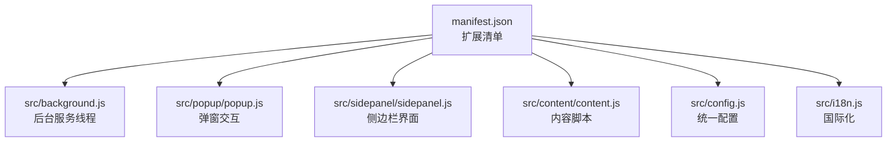
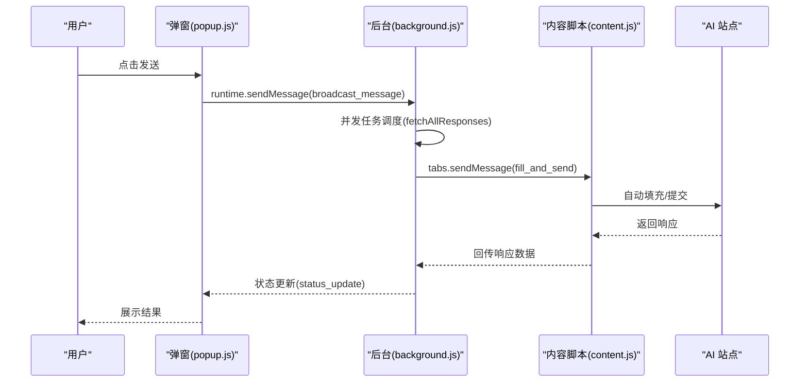
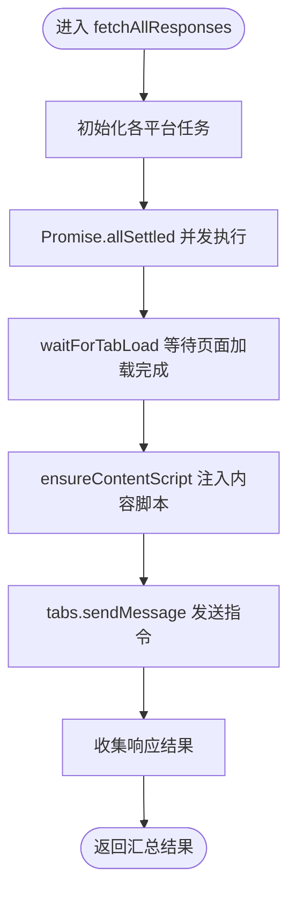
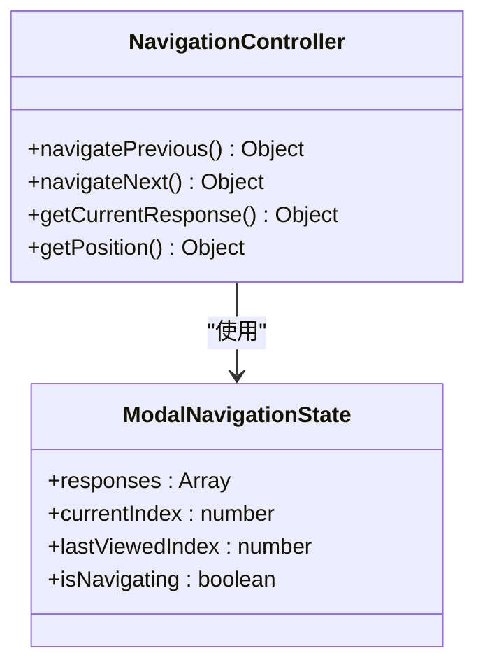
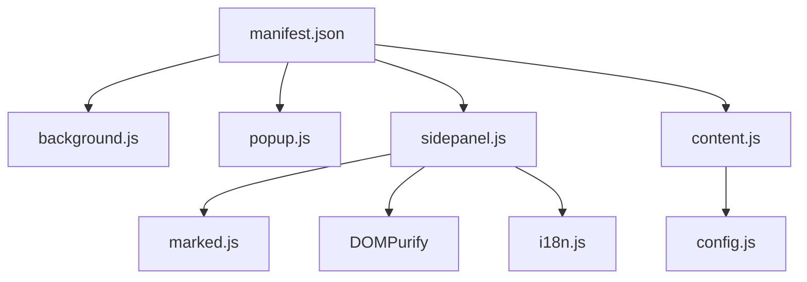

# 性能优化策略

<cite>
**本文档引用的文件**
- [manifest.json](file://manifest.json)
- [src/background.js](file://src/background.js)
- [src/popup/popup.js](file://src/popup/popup.js)
- [src/sidepanel/sidepanel.js](file://src/sidepanel/sidepanel.js)
- [src/content/content.js](file://src/content/content.js)
- [src/config.js](file://src/config.js)
- [src/i18n.js](file://src/i18n.js)
- [README.md](file://README.md)
- [PROJECT_ANALYSIS_v1.6.md](file://PROJECT_ANALYSIS_v1.6.md)
- [.kiro/specs/modal-navigation/design.md](file://.kiro/specs/modal-navigation/design.md)
</cite>

## 目录
1. [简介](#简介)
2. [项目结构](#项目结构)
3. [核心组件](#核心组件)
4. [架构概览](#架构概览)
5. [详细组件分析](#详细组件分析)
6. [依赖关系分析](#依赖关系分析)
7. [性能考虑](#性能考虑)
8. [故障排除指南](#故障排除指南)
9. [结论](#结论)
10. [附录](#附录)

## 简介
本指南围绕 AI Multiverse Chat 扩展的性能优化策略进行系统化梳理，重点覆盖以下方面：
- 内存管理最佳实践：事件监听器清理、定时器管理、DOM 元素回收
- 网络请求优化：请求合并、缓存策略、并发控制
- UI 渲染优化：虚拟滚动、增量更新、防抖节流
- 代码分割与懒加载：减少初始加载时间与内存占用
- 性能监控工具使用：Chrome DevTools 的性能面板与内存分析
- 实际优化案例与性能指标测量方法

本指南旨在帮助开发者在不牺牲功能的前提下，显著提升扩展的响应速度、稳定性与资源占用表现。

## 项目结构
该项目采用轻量级原生 JS 构建，无构建工具依赖，结构清晰、职责明确：
- manifest.json：扩展清单，声明权限、入口与匹配规则
- src/background.js：后台服务线程，负责标签页管理、消息分发与跨页面通信
- src/popup/popup.js：弹窗交互逻辑，负责用户输入与状态反馈
- src/sidepanel/sidepanel.js：侧边栏主界面，承载响应展示、历史管理与导航
- src/content/content.js：内容脚本，注入到目标站点执行自动化输入与提交
- src/config.js：统一配置中心，集中管理各平台的选择器与行为策略
- src/i18n.js：国际化模块，提供翻译与日期时间格式化

图表来源
- [manifest.json](file://manifest.json#L1-L79)
- [src/background.js](file://src/background.js#L1-L120)
- [src/popup/popup.js](file://src/popup/popup.js#L1-L61)
- [src/sidepanel/sidepanel.js](file://src/sidepanel/sidepanel.js#L1-L120)
- [src/content/content.js](file://src/content/content.js#L1-L60)
- [src/config.js](file://src/config.js#L1-L60)
- [src/i18n.js](file://src/i18n.js#L1-L60)

章节来源
- [README.md](file://README.md#L20-L29)
- [manifest.json](file://manifest.json#L1-L79)

## 核心组件
- 后台服务线程（background.js）
  - 负责窗口与标签页生命周期管理、消息路由、并发任务调度与超时控制
  - 提供 fetchAllResponses、handleTileWindows、waitForTabLoad 等关键能力
- 侧边栏界面（sidepanel.js）
  - 承载响应展示、历史管理、模态导航、主题与语言切换
  - 实现 Markdown 渲染、代码块复制、拖拽上传与文件预览
- 内容脚本（content.js）
  - 注入目标站点，执行输入填充、按钮点击、响应提取与思考内容过滤
- 配置中心（config.js）
  - 统一管理各平台的选择器、发送方式与文件支持策略
- 国际化（i18n.js）
  - 提供翻译、相对时间格式化与本地化支持

章节来源
- [src/background.js](file://src/background.js#L138-L197)
- [src/sidepanel/sidepanel.js](file://src/sidepanel/sidepanel.js#L41-L124)
- [src/content/content.js](file://src/content/content.js#L199-L250)
- [src/config.js](file://src/config.js#L5-L199)
- [src/i18n.js](file://src/i18n.js#L355-L414)

## 架构概览
整体架构遵循 Chrome 扩展标准：后台服务线程常驻，弹窗与侧边栏作为 UI 层，内容脚本按需注入目标页面。消息通过 runtime.onMessage 与 tabs.sendMessage 传递，后台负责并发调度与超时控制。

图表来源
- [src/popup/popup.js](file://src/popup/popup.js#L30-L45)
- [src/background.js](file://src/background.js#L138-L197)
- [src/background.js](file://src/background.js#L200-L268)
- [src/content/content.js](file://src/content/content.js#L199-L250)

## 详细组件分析

### 后台服务线程（background.js）性能分析
- 并发控制与超时管理
  - 使用 Promise.allSettled 并发拉取各平台响应，避免单点阻塞
  - waitForTabLoad 通过监听 tabs.onUpdated 与定时器组合，防止无限等待
- 窗口与标签页管理
  - 通过 providerWindows 缓存窗口映射，减少重复查询
  - handleTileWindows 并行更新窗口布局，提升多屏体验
- 消息路由与注入
  - ensureContentScript 优先检测，失败时再执行注入，降低注入失败成本

图表来源
- [src/background.js](file://src/background.js#L200-L268)
- [src/background.js](file://src/background.js#L680-L716)
- [src/background.js](file://src/background.js#L657-L678)

章节来源
- [src/background.js](file://src/background.js#L199-L268)
- [src/background.js](file://src/background.js#L680-L716)
- [src/background.js](file://src/background.js#L718-L786)

### 侧边栏界面（sidepanel.js）性能分析
- Markdown 渲染与安全
  - 使用 marked.js 与 DOMPurify，确保渲染性能与 XSS 防护
  - renderMarkdown 对已含 HTML 的文本直接使用，避免不必要的解析
- 代码块复制与交互
  - addCopyButtonsToCodeBlocks 仅在首次渲染时添加按钮，避免重复 DOM 操作
- 响应卡片与历史管理
  - 增量更新策略：新增卡片插入到首部，减少全量重绘
  - 历史列表仅渲染最近若干条，其余折叠或延迟加载
- 模态导航与内存管理
  - modalNavigationState 管理导航状态，modal 关闭时清理事件监听
  - 设计文档明确要求“内存管理：模态关闭时清理事件监听”

图表来源
- [src/sidepanel/sidepanel.js](file://src/sidepanel/sidepanel.js#L712-L809)
- [src/sidepanel/sidepanel.js](file://src/sidepanel/sidepanel.js#L653-L711)

章节来源
- [src/sidepanel/sidepanel.js](file://src/sidepanel/sidepanel.js#L63-L135)
- [src/sidepanel/sidepanel.js](file://src/sidepanel/sidepanel.js#L140-L187)
- [src/sidepanel/sidepanel.js](file://src/sidepanel/sidepanel.js#L350-L389)
- [src/sidepanel/sidepanel.js](file://src/sidepanel/sidepanel.js#L653-L711)
- [.kiro/specs/modal-navigation/design.md](file://.kiro/specs/modal-navigation/design.md#L406-L413)

### 内容脚本（content.js）性能分析
- 选择器诊断与响应提取
  - diagnoseSelectors 支持多选择器尝试与长度验证，快速定位有效选择器
  - removeThinkingBlocks 与 filterThinkingText 过滤冗余内容，减少渲染与传输负担
- 自动化输入与提交
  - executeMainWorldFill 针对不同平台采用差异化填充策略，避免重复事件链
- 文件上传与超时控制
  - 上传超时 UPLOAD_TIMEOUT 与重试 MAX_RETRIES，平衡稳定性与性能

章节来源
- [src/content/content.js](file://src/content/content.js#L126-L197)
- [src/content/content.js](file://src/content/content.js#L50-L124)
- [src/content/content.js](file://src/content/content.js#L378-L526)

### 配置中心（config.js）与国际化（i18n.js）
- 配置中心
  - AI_CONFIG 统一管理各平台的选择器、发送方式与文件支持，便于维护与优化
- 国际化
  - t 函数支持变量替换，formatRelativeTime 与 formatDateTime 提供本地化时间显示

章节来源
- [src/config.js](file://src/config.js#L5-L199)
- [src/i18n.js](file://src/i18n.js#L355-L414)

## 依赖关系分析
- manifest.json 声明权限与内容脚本注入时机（document_idle），避免阻塞页面加载
- background.js 依赖 tabs、windows、runtime 等 API，负责全局协调
- sidepanel.js 依赖 DOM、marked.js、DOMPurify 与 i18n.js
- content.js 依赖 AI_CONFIG 与 DOM API

图表来源
- [manifest.json](file://manifest.json#L45-L68)
- [src/sidepanel/sidepanel.js](file://src/sidepanel/sidepanel.js#L6-L39)
- [src/content/content.js](file://src/content/content.js#L1-L20)
- [src/config.js](file://src/config.js#L1-L20)

章节来源
- [manifest.json](file://manifest.json#L12-L32)
- [src/background.js](file://src/background.js#L69-L78)
- [src/sidepanel/sidepanel.js](file://src/sidepanel/sidepanel.js#L6-L39)
- [src/content/content.js](file://src/content/content.js#L1-L20)

## 性能考虑

### 内存管理最佳实践
- 事件监听器清理
  - 建议在组件销毁或模态关闭时统一移除事件监听，避免悬挂监听导致内存泄漏
  - 参考模态导航设计文档中的“内存管理：清理事件监听”
- 定时器管理
  - 使用定时器管理器（如 TimerManager）集中管理 setTimeout/setInterval，提供 clearAll 方法统一清理
  - 避免在组件切换或页面卸载时遗留定时器
- DOM 元素回收
  - 增量更新而非全量重绘，减少重排与重绘
  - 模态关闭时清理事件监听与定时器，释放闭包引用

章节来源
- [.kiro/specs/modal-navigation/design.md](file://.kiro/specs/modal-navigation/design.md#L406-L413)
- [PROJECT_ANALYSIS_v1.6.md](file://PROJECT_ANALYSIS_v1.6.md#L194-L241)
- [PROJECT_ANALYSIS_v1.6.md](file://PROJECT_ANALYSIS_v1.6.md#L244-L280)

### 网络请求优化技巧
- 请求合并
  - 后台已使用 Promise.allSettled 并发拉取各平台响应，避免串行等待
- 缓存策略
  - 建议对历史消息与响应内容进行本地缓存，减少重复请求与渲染
- 并发控制
  - 通过参数限制同时发起的请求数量，结合超时与重试策略，提升稳定性

章节来源
- [src/background.js](file://src/background.js#L200-L268)
- [src/background.js](file://src/background.js#L680-L716)

### UI 渲染优化方法
- 虚拟滚动
  - 对长列表（历史记录、响应卡片）采用虚拟滚动，仅渲染可视区域
- 增量更新
  - 新增卡片插入到首部，避免全量重绘
- 防抖节流
  - 对频繁触发的事件（如窗口尺寸变化、滚动）使用防抖/节流，降低计算频率

章节来源
- [src/sidepanel/sidepanel.js](file://src/sidepanel/sidepanel.js#L350-L389)
- [PROJECT_ANALYSIS_v1.6.md](file://PROJECT_ANALYSIS_v1.6.md#L294-L336)

### 代码分割与懒加载
- 按需加载第三方库（marked.js、DOMPurify、highlight.js）
- 模态内容与大组件在打开时再初始化，减少初始加载时间
- 图片与文件预览采用懒加载策略

章节来源
- [src/sidepanel/sidepanel.js](file://src/sidepanel/sidepanel.js#L6-L39)
- [src/sidepanel/sidepanel.js](file://src/sidepanel/sidepanel.js#L140-L187)

### 性能监控工具使用指南
- Chrome DevTools 性能面板
  - 记录 CPU 与内存快照，定位长任务与内存峰值
  - 使用性能录制查看主线程阻塞点（如全量重绘、频繁事件）
- 内存分析
  - 使用内存面板观察对象分配与泄漏趋势
  - 结合源码定位未清理的事件监听器与定时器

章节来源
- [src/sidepanel/sidepanel.js](file://src/sidepanel/sidepanel.js#L6-L39)

### 优化案例与性能指标测量
- 优化案例：侧边栏响应卡片全量重绘
  - 现状：历史与响应列表全量重绘导致闪烁
  - 方案：采用增量更新与最近 N 条渲染策略
- 性能指标
  - 首次渲染时间（First Interactive）、内存峰值、CPU 占用率、事件处理延迟

章节来源
- [PROJECT_ANALYSIS_v1.6.md](file://PROJECT_ANALYSIS_v1.6.md#L283-L336)

## 故障排除指南
- 注入失败
  - 现象：ensureContentScript 返回失败
  - 排查：检查目标站点是否为 chrome://、权限是否正确、注入顺序是否合理
- 页面未加载完成
  - 现象：waitForTabLoad 未触发回调
  - 排查：确认 tabs.onUpdated 监听是否注册、超时时间是否过短
- 模态导航异常
  - 现象：模态关闭后仍响应键盘事件
  - 排查：确认事件监听器是否清理、定时器是否清除

章节来源
- [src/background.js](file://src/background.js#L657-L678)
- [src/background.js](file://src/background.js#L680-L716)
- [src/sidepanel/sidepanel.js](file://src/sidepanel/sidepanel.js#L653-L711)

## 结论
通过并发控制、增量更新、事件监听器与定时器管理、懒加载与第三方库按需加载等策略，AI Multiverse Chat 在保证功能完整性的同时，显著提升了性能与稳定性。建议持续关注 Chrome DevTools 的性能报告，结合源码逐项落实优化措施，并建立性能回归测试流程。

## 附录
- 相关设计文档与分析
  - 模态导航性能与无障碍设计
  - 项目性能分析与优化建议

章节来源
- [.kiro/specs/modal-navigation/design.md](file://.kiro/specs/modal-navigation/design.md#L406-L437)
- [PROJECT_ANALYSIS_v1.6.md](file://PROJECT_ANALYSIS_v1.6.md#L194-L336)