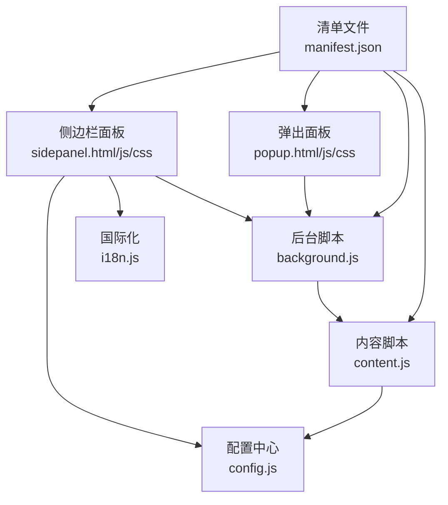
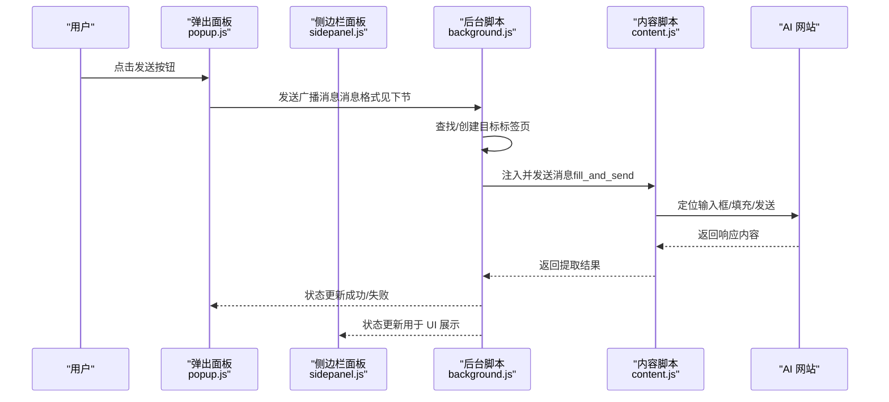
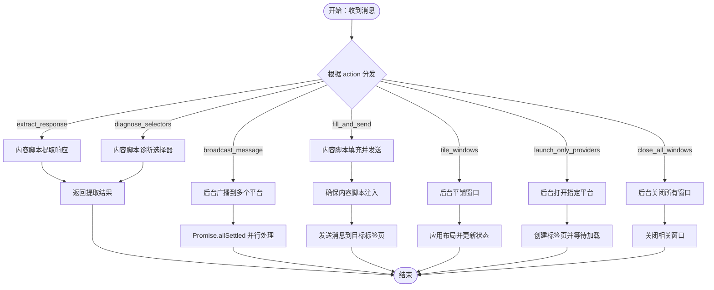
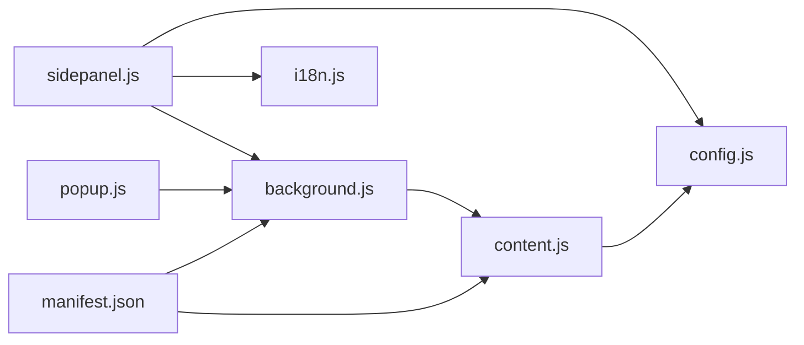

# 扩展功能开发

<cite>
**本文引用的文件**
- [manifest.json](file://manifest.json)
- [background.js](file://src/background.js)
- [content.js](file://src/content/content.js)
- [popup.js](file://src/popup/popup.js)
- [popup.html](file://src/popup/popup.html)
- [popup.css](file://src/popup/popup.css)
- [sidepanel.js](file://src/sidepanel/sidepanel.js)
- [sidepanel.html](file://src/sidepanel/sidepanel.html)
- [sidepanel.css](file://src/sidepanel/sidepanel.css)
- [config.js](file://src/config.js)
- [i18n.js](file://src/i18n.js)
- [README.md](file://README.md)
</cite>

## 目录
1. [简介](#简介)
2. [项目结构](#项目结构)
3. [核心组件](#核心组件)
4. [架构总览](#架构总览)
5. [详细组件分析](#详细组件分析)
6. [依赖关系分析](#依赖关系分析)
7. [性能考虑](#性能考虑)
8. [故障排查指南](#故障排查指南)
9. [结论](#结论)
10. [附录](#附录)

## 简介
本指南面向希望在 Chrome 扩展生态中进行二次开发与功能扩展的工程师，围绕 AI 多重宇宙聊天扩展的架构与实现，系统讲解背景脚本、内容脚本与用户界面之间的协作机制，消息传递系统的设计与实现，以及如何新增功能模块、优化性能与保障安全。读者无需深入前端框架知识即可按步骤完成扩展开发。

## 项目结构
该项目采用“原生 JS + HTML + CSS”的轻量实现，不依赖打包工具，便于维护与快速迭代。主要目录与职责如下：
- manifest.json：扩展清单，声明权限、后台脚本、内容脚本、动作入口等。
- src/background.js：后台服务工作线程，负责窗口管理、消息路由、跨标签通信与系统集成。
- src/content/content.js：内容脚本，注入到各 AI 页面，负责自动化输入、发送、响应提取与文件上传。
- src/popup/：弹出面板 UI，用于快速广播消息与查看状态。
- src/sidepanel/：侧边栏面板 UI，提供更丰富的交互、响应展示与多模态操作。
- src/config.js：统一配置中心，集中管理各 AI 平台的选择器、发送方式、文件上传能力等。
- src/i18n.js：国际化模块，支持中英文切换与文案本地化。

图表来源
- [manifest.json](file://manifest.json#L1-L79)
- [background.js](file://src/background.js#L1-L120)
- [content.js](file://src/content/content.js#L1-L60)
- [popup.html](file://src/popup/popup.html#L1-L50)
- [sidepanel.html](file://src/sidepanel/sidepanel.html#L1-L120)
- [config.js](file://src/config.js#L1-L60)
- [i18n.js](file://src/i18n.js#L1-L60)

章节来源
- [README.md](file://README.md#L20-L29)
- [manifest.json](file://manifest.json#L1-L79)

## 核心组件
- 后台脚本（background.js）
  - 负责扩展点击行为、命令触发、窗口管理（打开/最小化/平铺）、跨标签消息分发、脚本注入与状态通知。
  - 提供与内容脚本的消息通道，支撑“广播消息”“提取响应”“文件上传”“窗口布局”等能力。
- 内容脚本（content.js）
  - 注入到目标 AI 网站，负责定位输入框、填充文本、触发发送、提取最新响应、文件上传与错误过滤。
  - 提供“诊断选择器”“提取响应”“填充并发送”等消息处理。
- 用户界面（popup/sidepanel）
  - 弹出面板：快速勾选模型、输入消息、发送广播、查看状态。
  - 侧边栏面板：更完整的聊天与响应展示、历史记录、多模态交互、主题/语言切换、摘要设置等。
- 配置中心（config.js）
  - 统一管理各平台的选择器、发送方式、文件上传能力、基础 URL 与图标等。
- 国际化（i18n.js）
  - 提供 t() 文案函数、日期时间格式化、相对时间显示与语言切换。

章节来源
- [background.js](file://src/background.js#L1-L120)
- [content.js](file://src/content/content.js#L1-L120)
- [popup.js](file://src/popup/popup.js#L1-L61)
- [sidepanel.js](file://src/sidepanel/sidepanel.js#L1-L120)
- [config.js](file://src/config.js#L1-L60)
- [i18n.js](file://src/i18n.js#L1-L120)

## 架构总览
扩展采用“后台脚本 + 内容脚本 + UI 界面”的三段式架构：
- 后台脚本作为中枢，协调窗口与标签页生命周期，统一调度内容脚本执行。
- 内容脚本在目标站点内执行，直接操作 DOM，完成输入填充与发送。
- UI 界面通过消息与后台脚本交互，后台脚本再与内容脚本通信，形成闭环。

图表来源
- [popup.js](file://src/popup/popup.js#L16-L45)
- [background.js](file://src/background.js#L138-L197)
- [content.js](file://src/content/content.js#L199-L216)

## 详细组件分析

### 消息传递系统
- 消息格式
  - 通用字段：action（动作标识）、provider（平台标识）、text（文本内容）、files（文件数组）、message（广播消息体）、providers（平台列表）等。
  - 示例路径：[广播消息](file://src/popup/popup.js#L30-L44)、[后台监听](file://src/background.js#L138-L197)、[内容脚本监听](file://src/content/content.js#L199-L216)。
- 路由规则
  - 弹出面板 → 后台脚本：触发广播、窗口控制、诊断选择器、汇总响应等。
  - 后台脚本 → 内容脚本：注入脚本、填充并发送、提取响应、诊断选择器。
  - 内容脚本 → 后台脚本：返回状态与结果。
- 异步处理策略
  - Promise.allSettled 并行处理多个平台，避免单点阻塞。
  - 超时与重试：上传文件设置超时与重试次数，等待页面加载设置超时与清理。
  - 事件监听与清理：监听 tabs.onUpdated 时及时移除监听器，防止内存泄漏。

图表来源
- [background.js](file://src/background.js#L138-L197)
- [background.js](file://src/background.js#L718-L786)
- [content.js](file://src/content/content.js#L199-L216)
- [content.js](file://src/content/content.js#L322-L418)

章节来源
- [popup.js](file://src/popup/popup.js#L16-L45)
- [background.js](file://src/background.js#L138-L197)
- [content.js](file://src/content/content.js#L199-L216)

### 后台脚本（background.js）
- 主要职责
  - 扩展点击与快捷键：打开/最小化侧边栏窗口。
  - 广播消息：并行打开/定位目标标签页，注入内容脚本并发送消息。
  - 窗口管理：平铺窗口、关闭所有窗口、诊断选择器、汇总响应。
  - 状态通知：向 UI 发送状态更新。
- 关键实现要点
  - 窗口 ID 跟踪与恢复：通过已知窗口 ID 与 URL 匹配两种方式定位弹窗。
  - 脚本注入：先 ping 检测，失败则 executeScript 注入配置与内容脚本。
  - 等待页面加载：监听 tabs.onUpdated 并设置超时清理。
  - 并行处理：Promise.allSettled 并行处理多个平台，提高吞吐。

章节来源
- [background.js](file://src/background.js#L10-L59)
- [background.js](file://src/background.js#L138-L197)
- [background.js](file://src/background.js#L527-L643)
- [background.js](file://src/background.js#L656-L716)
- [background.js](file://src/background.js#L718-L786)

### 内容脚本（content.js）
- 主要职责
  - 填充输入框：支持主世界注入与内容脚本直接填充两种策略。
  - 发送消息：根据平台特性选择点击发送按钮或回车提交。
  - 提取响应：定位最新响应，过滤思维过程，返回文本/HTML。
  - 文件上传：按平台差异实现文件选择与上传。
  - 诊断选择器：辅助调试平台选择器有效性。
- 关键实现要点
  - 选择器配置：从全局配置中心读取平台选择器。
  - 输入填充：区分 React 输入与 contenteditable，分别处理事件与值设置。
  - 发送策略：针对异步 UI 与特定平台（如 Kimi）采用不同的等待与回退策略。
  - 响应提取：优先使用最新元素，回退到通用选择器，必要时保留原始 HTML。

章节来源
- [content.js](file://src/content/content.js#L199-L216)
- [content.js](file://src/content/content.js#L322-L418)
- [content.js](file://src/content/content.js#L465-L565)
- [content.js](file://src/content/content.js#L218-L320)
- [content.js](file://src/content/content.js#L593-L742)

### 配置中心（config.js）
- 设计原则
  - 平台化配置：每个平台独立配置名称、图标、URL 模式、基础 URL、选择器、发送方式、文件上传能力等。
  - 可扩展性：新增平台只需在配置中心追加条目，内容脚本与后台脚本通过 provider 字段联动。
- 关键字段
  - name/icon/urlPattern/baseUrl：平台元信息。
  - selectors：input/button/response/fileUpload 等选择器集合。
  - fillMethod/sendMethod：填充与发送策略。
  - supportsFiles/supportedFileTypes：文件上传能力与类型限制。

章节来源
- [config.js](file://src/config.js#L5-L199)

### 国际化（i18n.js）
- 功能
  - t() 文本翻译函数，支持变量替换。
  - 日期/时间格式化与相对时间显示。
  - 语言切换与本地化资源。
- 使用建议
  - UI 文案统一通过 t() 获取，避免硬编码。
  - 新增文案时在 I18N 中补充对应键值。

章节来源
- [i18n.js](file://src/i18n.js#L6-L346)
- [i18n.js](file://src/i18n.js#L354-L414)

### 弹出面板（popup.js/popup.html/popup.css）
- 功能
  - 快速勾选平台、输入消息、发送广播、查看状态日志。
- 交互流程
  - 用户输入 → 读取勾选平台 → 发送消息到后台 → 接收状态更新并渲染。

章节来源
- [popup.html](file://src/popup/popup.html#L1-L50)
- [popup.js](file://src/popup/popup.js#L1-L61)
- [popup.css](file://src/popup/popup.css#L1-L134)

### 侧边栏面板（sidepanel.js/sidepanel.html/sidepanel.css）
- 功能
  - 聊天历史、响应展示、多模态交互、主题/语言切换、摘要设置、窗口控制、文件拖拽上传等。
- 交互流程
  - 用户输入 → 侧边栏处理 → 后台脚本调度 → 内容脚本执行 → 结果回传 UI 渲染。

章节来源
- [sidepanel.html](file://src/sidepanel/sidepanel.html#L1-L120)
- [sidepanel.js](file://src/sidepanel/sidepanel.js#L1-L120)
- [sidepanel.css](file://src/sidepanel/sidepanel.css#L1-L120)

## 依赖关系分析
- 清单文件声明
  - 后台脚本：service_worker 指向 background.js。
  - 内容脚本：匹配多个 AI 网站域名，注入 config.js 与 content.js。
  - 权限：activeTab/scripting/tabs/storage/system.display。
  - 主题图标与动作入口。
- 组件耦合
  - 后台脚本与内容脚本通过消息通道耦合，内容脚本依赖配置中心。
  - UI 与后台脚本通过 runtime.sendMessage/onMessage 通信。
  - 侧边栏依赖国际化模块与配置中心。

图表来源
- [manifest.json](file://manifest.json#L42-L68)
- [background.js](file://src/background.js#L69-L74)
- [content.js](file://src/content/content.js#L1-L10)
- [config.js](file://src/config.js#L1-L10)
- [popup.js](file://src/popup/popup.js#L1-L15)
- [sidepanel.js](file://src/sidepanel/sidepanel.js#L1-L20)
- [i18n.js](file://src/i18n.js#L494-L504)

章节来源
- [manifest.json](file://manifest.json#L1-L79)

## 性能考虑
- 内存管理
  - 监听器清理：tabs.onUpdated 等监听完成后及时移除，避免泄漏。
  - 状态缓存：仅缓存必要状态（如窗口 ID、上次布局），避免长期持有大对象。
- 网络请求优化
  - 并行处理：广播消息使用 Promise.allSettled，减少总耗时。
  - 超时与重试：文件上传设置超时与指数退避重试，提升稳定性。
- UI 渲染优化
  - 侧边栏响应卡片采用虚拟滚动与懒加载策略（如需进一步优化）。
  - Markdown 渲染与高亮仅在需要时初始化，避免重复开销。
  - 按需加载第三方库（marked/highlight/DOMPurify），减少首屏负担。

章节来源
- [background.js](file://src/background.js#L698-L716)
- [background.js](file://src/background.js#L718-L786)
- [content.js](file://src/content/content.js#L615-L672)
- [sidepanel.js](file://src/sidepanel/sidepanel.js#L6-L39)

## 故障排查指南
- 脚本注入失败
  - 现象：后台提示“脚本注入失败”。
  - 排查：确认 content.js 是否正确注入，检查目标页面是否为受支持域名。
  - 参考：[脚本注入与错误提示](file://src/background.js#L656-L678)、[后台状态通知](file://src/background.js#L788-L790)。
- 输入框未找到
  - 现象：内容脚本报“未找到输入框”。
  - 排查：检查配置中心选择器是否匹配当前平台，使用“诊断选择器”功能验证。
  - 参考：[输入框查找与诊断](file://src/content/content.js#L574-L590)、[诊断选择器](file://src/content/content.js#L126-L197)。
- 响应提取为空
  - 现象：提取响应为空或失败。
  - 排查：确认响应选择器配置，检查是否有思维过程被过滤，必要时回退到通用选择器。
  - 参考：[响应提取](file://src/content/content.js#L218-L320)。
- 文件上传失败
  - 现象：文件上传超时或类型不支持。
  - 排查：检查 supportedFileTypes 与文件大小限制，确认平台支持的文件类型。
  - 参考：[文件上传与过滤](file://src/content/content.js#L615-L742)。
- 窗口布局异常
  - 现象：平铺窗口失败或位置不正确。
  - 排查：检查系统显示器信息与上次布局存储，确认目标窗口存在且非扩展自身窗口。
  - 参考：[窗口平铺](file://src/background.js#L527-L643)。

章节来源
- [background.js](file://src/background.js#L656-L678)
- [background.js](file://src/background.js#L788-L790)
- [content.js](file://src/content/content.js#L126-L197)
- [content.js](file://src/content/content.js#L218-L320)
- [content.js](file://src/content/content.js#L615-L742)
- [background.js](file://src/background.js#L527-L643)

## 结论
本扩展以“后台脚本 + 内容脚本 + UI 界面”为核心，通过统一的配置中心与消息传递机制，实现了对多家 AI 平台的自动化广播与响应聚合。其设计强调可扩展性与稳定性：新增平台只需完善配置中心；消息通道采用异步与并行策略，兼顾性能与可靠性；UI 通过国际化与主题切换提升用户体验。遵循本文的开发与优化建议，可在此基础上快速扩展新功能并保持高质量交付。

## 附录

### 功能模块扩展方法
- 新增平台
  - 在配置中心追加平台条目，完善选择器、发送方式与文件上传能力。
  - 如需主世界注入，请在内容脚本中增加对应分支。
  - 更新 UI（弹出/侧边栏）以支持新平台勾选与展示。
  - 参考：[配置中心](file://src/config.js#L5-L199)、[内容脚本注入](file://src/content/content.js#L378-L526)。
- 新增消息动作
  - 在后台脚本中新增 action 分支与处理逻辑。
  - 在内容脚本中新增对应监听与处理。
  - 在 UI 中增加触发入口与状态反馈。
  - 参考：[后台消息监听](file://src/background.js#L138-L197)、[内容脚本监听](file://src/content/content.js#L199-L216)。
- 新增 UI 组件
  - 在 sidepanel.html 中添加结构与样式，在 sidepanel.js 中绑定事件与逻辑。
  - 使用国际化模块 t() 管理文案。
  - 参考：[侧边栏 HTML](file://src/sidepanel/sidepanel.html#L1-L120)、[国际化](file://src/i18n.js#L6-L346)。

### API 接口规范
- 广播消息
  - 请求：action=broadcast_message，message，providers
  - 响应：状态更新（成功/失败）
  - 参考：[弹出面板发送](file://src/popup/popup.js#L30-L44)、[后台处理](file://src/background.js#L718-L721)
- 填充并发送
  - 请求：action=fill_and_send，text，provider，files
  - 响应：done/error
  - 参考：[内容脚本处理](file://src/content/content.js#L205-L210)
- 提取响应
  - 请求：action=extract_response，provider
  - 响应：{status,text,html,length}
  - 参考：[内容脚本处理](file://src/content/content.js#L211-L215)
- 诊断选择器
  - 请求：action=diagnose_selectors，provider
  - 响应：诊断结果
  - 参考：[后台处理](file://src/background.js#L270-L296)、[内容脚本处理](file://src/content/content.js#L126-L197)
- 平铺窗口
  - 请求：action=tile_windows，providers
  - 响应：状态更新
  - 参考：[后台处理](file://src/background.js#L527-L643)
- 打开指定平台
  - 请求：action=launch_only_providers，providers
  - 响应：状态更新
  - 参考：[后台处理](file://src/background.js#L792-L806)
- 关闭所有窗口
  - 请求：action=close_all_windows
  - 响应：状态更新
  - 参考：[后台处理](file://src/background.js#L154-L162)

### 安全开发指导
- 权限管理
  - 严格遵循最小权限原则，仅申请 activeTab/scripting/tabs/storage/system.display。
  - 避免在 manifest 中声明不必要的 host_permissions。
  - 参考：[权限声明](file://manifest.json#L12-L32)
- 数据保护
  - UI 渲染使用 DOMPurify 过滤 HTML，避免 XSS。
  - 文本输入进行基本清洗，移除 HTML 标签。
  - 参考：[HTML 清洗](file://src/sidepanel/sidepanel.js#L95-L116)、[文本清洗](file://src/content/content.js#L36-L40)
- 恶意代码防范
  - 仅注入受信任的配置与内容脚本，避免动态 eval。
  - 对外部输入（如文件名、URL）进行白名单校验与长度限制。
  - 参考：[脚本注入](file://src/background.js#L656-L678)、[文件上传过滤](file://src/content/content.js#L677-L710)