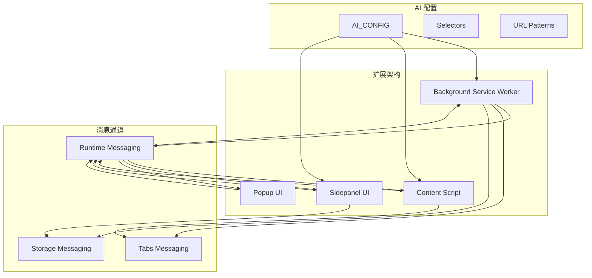
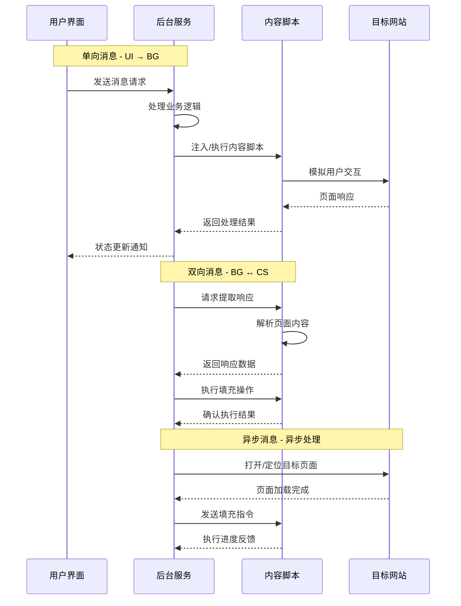
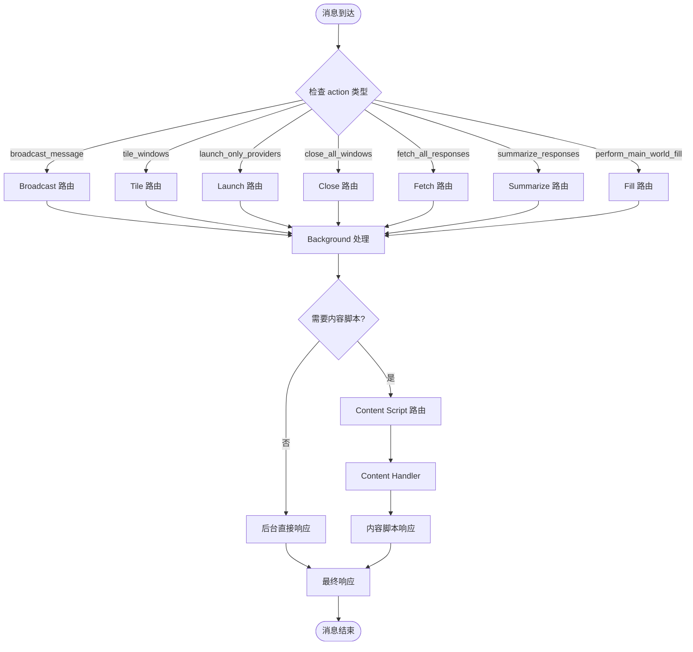
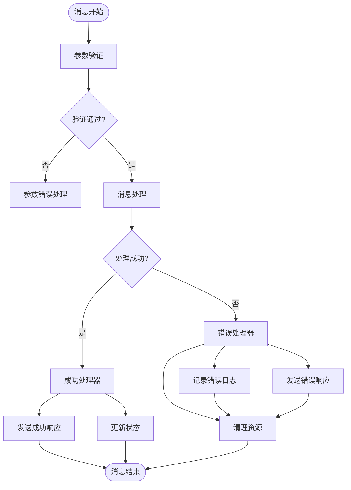
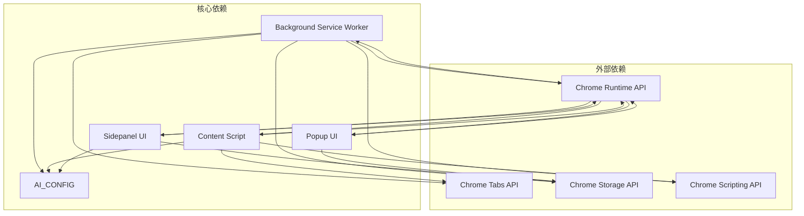

# 消息传递系统

<cite>
**本文档引用的文件**
- [src/background.js](file://src/background.js)
- [src/content/content.js](file://src/content/content.js)
- [src/sidepanel/sidepanel.js](file://src/sidepanel/sidepanel.js)
- [src/popup/popup.js](file://src/popup/popup.js)
- [src/config.js](file://src/config.js)
- [manifest.json](file://manifest.json)
</cite>

## 目录
1. [简介](#简介)
2. [项目结构](#项目结构)
3. [核心组件](#核心组件)
4. [架构概览](#架构概览)
5. [详细组件分析](#详细组件分析)
6. [依赖关系分析](#依赖关系分析)
7. [性能考虑](#性能考虑)
8. [故障排除指南](#故障排除指南)
9. [结论](#结论)

## 简介

AI Multiverse 是一个 Chrome 扩展，支持同时与多个 AI 平台（Gemini、Grok、Kimi、DeepSeek、ChatGPT、Qwen、腾讯元宝）进行交互。该系统的核心是基于 Chrome Extension Messaging API 构建的消息传递机制，实现了 background ↔ content ↔ sidepanel 之间的高效通信。

本系统采用模块化设计，通过统一的消息格式和路由机制，实现了以下功能：
- 单向消息：从 UI 层向后台发送指令
- 双向消息：后台与内容脚本之间的请求-响应通信
- 异步消息：基于 Promise 和回调的非阻塞通信模式
- 消息路由：跨不同扩展组件的智能消息分发

## 项目结构

该项目采用清晰的模块化组织结构，每个组件都有明确的职责分工：



**图表来源**
- [src/background.js](file://src/background.js#L1-L1028)
- [src/content/content.js](file://src/content/content.js#L1-L941)
- [src/sidepanel/sidepanel.js](file://src/sidepanel/sidepanel.js#L1-L2813)
- [src/popup/popup.js](file://src/popup/popup.js#L1-L61)

**章节来源**
- [manifest.json](file://manifest.json#L1-L79)

## 核心组件

### 1. Background Service Worker (后台服务)

后台服务是整个消息传递系统的核心协调者，负责：
- 监听来自 UI 的消息请求
- 管理多个 AI 平台的连接状态
- 协调内容脚本的注入和执行
- 处理文件上传和响应提取

### 2. Content Script (内容脚本)

内容脚本运行在目标网站页面上下文中，负责：
- 接收来自后台的指令
- 直接与页面交互，填充输入框和发送消息
- 提取 AI 响应内容
- 处理文件上传操作

### 3. Sidepanel UI (侧边面板)

侧边面板提供用户界面，负责：
- 用户输入收集和验证
- 发送消息到后台服务
- 显示和管理 AI 响应
- 处理用户交互事件

### 4. Popup UI (弹出窗口)

弹出窗口提供快速访问功能，负责：
- 快速消息发送
- 状态显示和反馈
- 基础配置管理

**章节来源**
- [src/background.js](file://src/background.js#L1-L1028)
- [src/content/content.js](file://src/content/content.js#L1-L941)
- [src/sidepanel/sidepanel.js](file://src/sidepanel/sidepanel.js#L1-L2813)
- [src/popup/popup.js](file://src/popup/popup.js#L1-L61)

## 架构概览

系统采用三层消息传递架构，每层都有特定的职责和通信模式：



**图表来源**
- [src/background.js](file://src/background.js#L138-L197)
- [src/content/content.js](file://src/content/content.js#L199-L216)
- [src/sidepanel/sidepanel.js](file://src/sidepanel/sidepanel.js#L1396-L1407)

## 详细组件分析

### 消息格式设计

系统采用统一的消息格式，确保跨组件通信的一致性：

#### 基础消息结构
```javascript
{
  action: string,           // 消息类型标识
  message?: string,         // 主要消息内容
  providers?: string[],     // 目标 AI 平台列表
  provider?: string,        // 单个目标平台
  files?: File[],          // 文件数组
  text?: string,           // 文本内容
  selector?: string,        // DOM 选择器
  tabId?: number,           // 标签页 ID
  status?: string,          // 状态信息
  error?: string           // 错误信息
}
```

#### 消息类型分类

**1. 广播消息 (Broadcast Messages)**
- 用途：向多个 AI 平台同时发送相同消息
- 结构：包含 `action: 'broadcast_message'` 和 `providers` 数组
- 示例路径：[发送广播消息](file://src/sidepanel/sidepanel.js#L1396-L1402)

**2. 窗口管理消息 (Window Management)**
- 用途：控制 AI 平台窗口的打开、排列和关闭
- 结构：包含 `action: 'launch_only_providers'`、`'tile_windows'`、`'close_all_windows'`
- 示例路径：[窗口管理](file://src/sidepanel/sidepanel.js#L1276-L1290)

**3. 响应提取消息 (Response Extraction)**
- 用途：从各个 AI 平台提取最新响应
- 结构：包含 `action: 'fetch_all_responses'` 和 `providers` 数组
- 示例路径：[响应提取](file://src/sidepanel/sidepanel.js#L1700-L1721)

**4. 填充发送消息 (Fill and Send)**
- 用途：向指定 AI 平台发送消息并自动提交
- 结构：包含 `action: 'fill_and_send'`、`text`、`provider`、`files`
- 示例路径：[填充发送](file://src/background.js#L775-L786)

**章节来源**
- [src/sidepanel/sidepanel.js](file://src/sidepanel/sidepanel.js#L1396-L1407)
- [src/background.js](file://src/background.js#L775-L786)

### 消息路由机制

系统实现了智能的消息路由，确保消息能够正确到达目标组件：

#### 路由流程图



**图表来源**
- [src/background.js](file://src/background.js#L138-L197)
- [src/content/content.js](file://src/content/content.js#L199-L216)

#### 跨组件通信模式

**1. 单向消息模式**
- 特点：UI → BG，无需等待响应
- 实现：使用 `chrome.runtime.sendMessage()` 发送消息
- 示例路径：[单向消息发送](file://src/sidepanel/sidepanel.js#L1276-L1290)

**2. 双向消息模式**
- 特点：BG ↔ CS，需要同步响应
- 实现：使用 `chrome.runtime.onMessage` 监听，`sendResponse()` 返回
- 示例路径：[双向消息处理](file://src/background.js#L138-L197)

**3. 异步消息模式**
- 特点：BG → CS，异步执行，支持超时处理
- 实现：使用 `Promise` 和 `chrome.tabs.sendMessage()`
- 示例路径：[异步消息处理](file://src/background.js#L200-L268)

**章节来源**
- [src/background.js](file://src/background.js#L138-L197)
- [src/content/content.js](file://src/content/content.js#L199-L216)

### 错误处理策略

系统实现了多层次的错误处理机制：

#### 错误处理流程



**图表来源**
- [src/background.js](file://src/background.js#L164-L196)
- [src/content/content.js](file://src/content/content.js#L205-L215)

#### 错误类型和处理策略

**1. 脚本注入失败**
- 现象：无法向目标页面注入内容脚本
- 处理：重试注入，降级到直接执行脚本
- 示例路径：[脚本注入处理](file://src/background.js#L656-L678)

**2. 页面加载超时**
- 现象：目标页面长时间未加载完成
- 处理：设置超时时间，提供备用方案
- 示例路径：[页面加载超时](file://src/background.js#L680-L716)

**3. DOM 元素查找失败**
- 现象：无法找到指定的选择器元素
- 处理：使用备用选择器，记录诊断信息
- 示例路径：[元素查找](file://src/content/content.js#L574-L590)

**4. 网络请求错误**
- 现象：API 调用或文件上传失败
- 处理：重试机制，错误回退
- 示例路径：[网络错误处理](file://src/content/content.js#L640-L672)

**章节来源**
- [src/background.js](file://src/background.js#L656-L716)
- [src/content/content.js](file://src/content/content.js#L574-L672)

### 性能优化技巧

系统采用了多种性能优化策略：

#### 1. 消息缓存和去重
- 使用 `providerWindows` 缓存已知的窗口信息
- 避免重复的页面查询和标签页扫描
- 示例路径：[窗口缓存](file://src/background.js#L6-L7)

#### 2. 并行处理优化
- 使用 `Promise.allSettled()` 并行处理多个 AI 平台
- 减少总处理时间，提高用户体验
- 示例路径：[并行处理](file://src/background.js#L266-L267)

#### 3. 智能超时控制
- 为不同操作设置合适的超时时间
- 避免长时间阻塞用户界面
- 示例路径：[超时控制](file://src/background.js#L680-L716)

#### 4. 内存管理
- 及时释放文件对象的内存
- 清理事件监听器和定时器
- 示例路径：[内存清理](file://src/sidepanel/sidepanel.js#L1382-L1387)

**章节来源**
- [src/background.js](file://src/background.js#L6-L7)
- [src/sidepanel/sidepanel.js](file://src/sidepanel/sidepanel.js#L1382-L1387)

## 依赖关系分析

系统组件之间的依赖关系如下：



**图表来源**
- [manifest.json](file://manifest.json#L12-L18)
- [src/config.js](file://src/config.js#L1-L204)

### 组件耦合度分析

**低耦合设计特点：**
- 每个组件都有明确的职责边界
- 通过标准化的消息接口进行通信
- 配置驱动的平台适配机制

**潜在循环依赖：**
- 通过消息路由避免了直接的循环引用
- 使用异步通信模式减少耦合

**章节来源**
- [manifest.json](file://manifest.json#L12-L18)
- [src/config.js](file://src/config.js#L1-L204)

## 性能考虑

### 1. 消息传递性能

**优化策略：**
- 使用批量消息处理减少通信开销
- 实现消息队列和背压机制
- 采用事件驱动的异步处理模式

### 2. 内存使用优化

**优化策略：**
- 及时清理临时数据和事件监听器
- 使用对象池减少垃圾回收压力
- 控制并发操作的数量

### 3. 网络性能优化

**优化策略：**
- 实现智能缓存机制
- 使用压缩和增量更新
- 优化文件传输策略

## 故障排除指南

### 常见问题和解决方案

#### 1. 消息超时问题
**症状：** 消息发送后长时间无响应
**排查步骤：**
1. 检查目标组件是否正确注册消息监听器
2. 验证消息格式是否符合预期
3. 查看浏览器开发者工具中的错误日志

**解决方法：**
- 实现消息重试机制
- 设置合理的超时时间
- 添加心跳检测功能

#### 2. 消息丢失问题
**症状：** 消息发送成功但目标组件未收到
**排查步骤：**
1. 检查消息路由配置
2. 验证组件生命周期状态
3. 确认权限配置是否正确

**解决方法：**
- 实现消息确认机制
- 添加消息持久化存储
- 建立消息重发队列

#### 3. 内存泄漏问题
**症状：** 应用运行时间越长内存占用越大
**排查步骤：**
1. 检查事件监听器是否正确移除
2. 验证定时器是否及时清理
3. 确认闭包引用是否合理

**解决方法：**
- 实施严格的资源清理机制
- 使用弱引用避免循环引用
- 定期进行内存使用分析

### 调试工具和技巧

**1. 浏览器开发者工具**
- 使用 Application 面板监控扩展状态
- 利用 Network 面板查看消息流量
- 通过 Console 面板调试 JavaScript 代码

**2. 自定义调试信息**
- 在关键节点添加日志输出
- 实现消息追踪和统计功能
- 建立错误报告和性能监控

**章节来源**
- [src/background.js](file://src/background.js#L164-L196)
- [src/content/content.js](file://src/content/content.js#L205-L215)

## 结论

AI Multiverse 的消息传递系统展现了现代 Chrome 扩展开发的最佳实践。通过精心设计的消息格式、智能的路由机制和完善的错误处理策略，系统实现了高效、可靠且易于维护的跨组件通信。

**主要优势：**
- **模块化设计：** 清晰的职责分离和低耦合架构
- **消息抽象：** 统一的消息格式简化了开发复杂度
- **错误处理：** 多层次的错误处理机制提高了系统稳定性
- **性能优化：** 并行处理和智能缓存提升了用户体验

**未来改进方向：**
- 实现更细粒度的消息版本控制
- 增强消息加密和安全机制
- 优化大规模并发场景下的性能表现
- 添加消息审计和监控功能

该系统为类似的消息传递需求提供了优秀的参考模板，其设计理念和实现技巧可以广泛应用于其他 Chrome 扩展项目中。