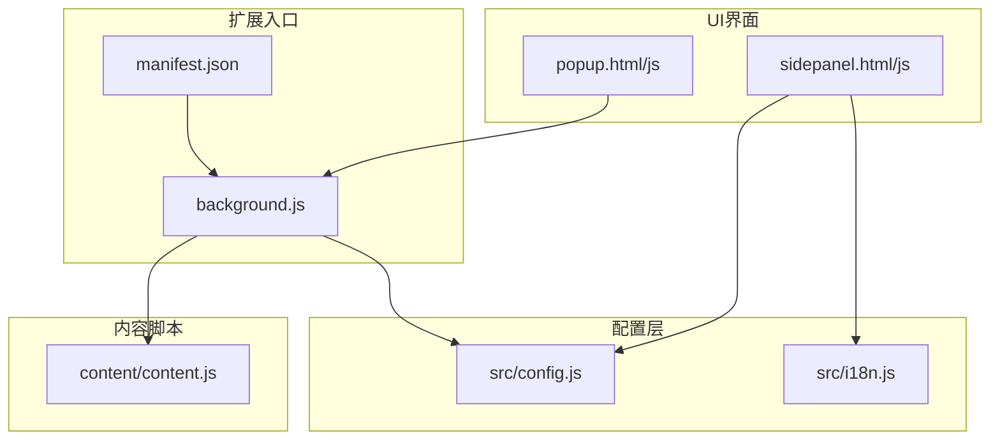
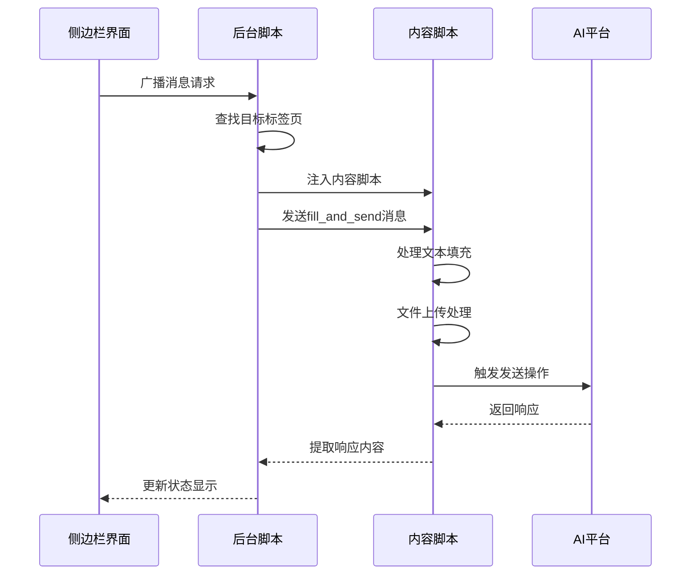
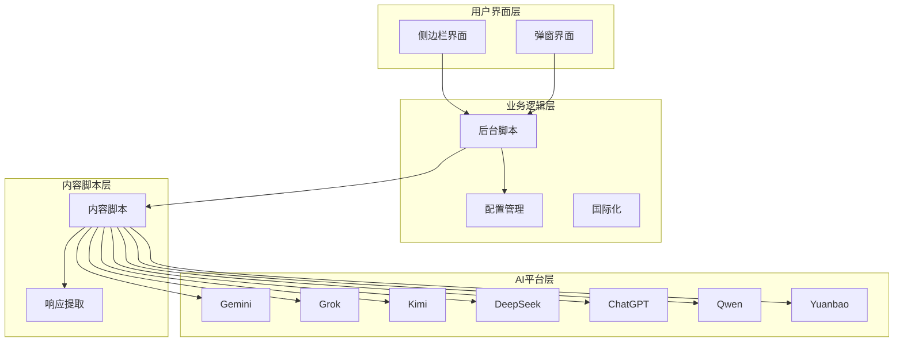
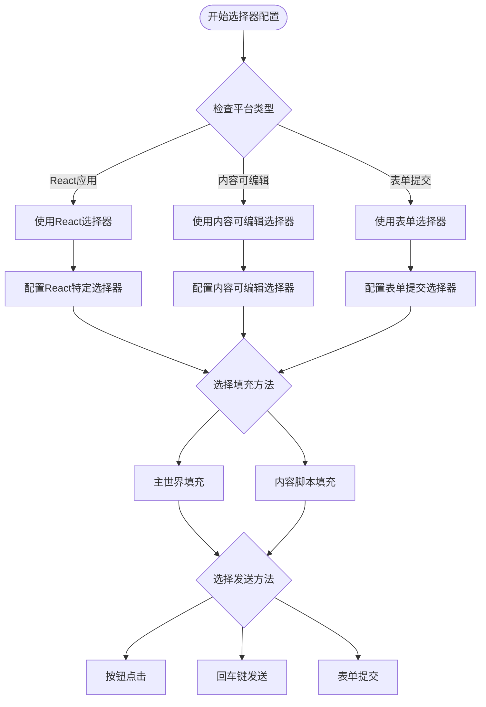
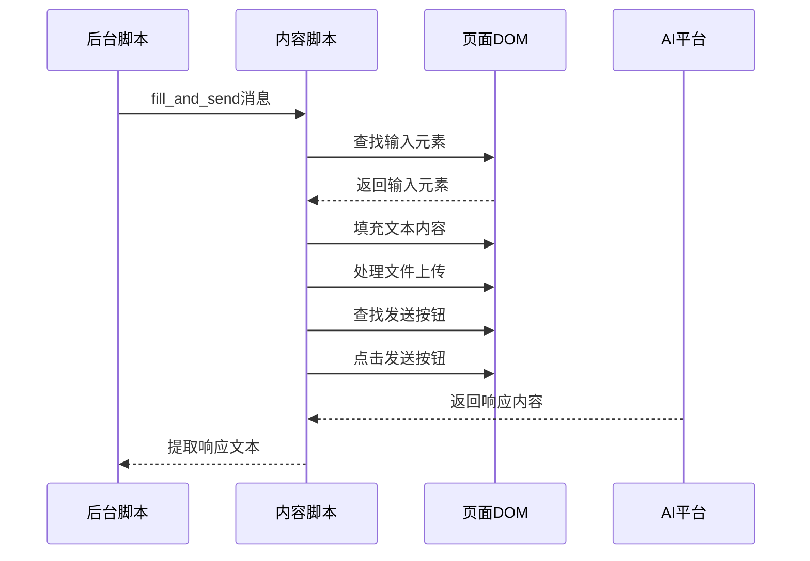
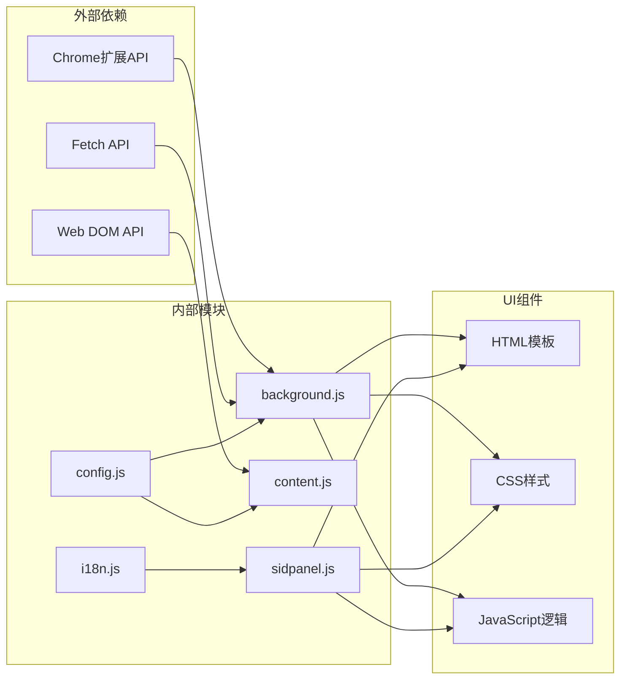

# 组件扩展方法

<cite>
**本文档引用的文件**
- [manifest.json](file://manifest.json)
- [src/config.js](file://src/config.js)
- [src/background.js](file://src/background.js)
- [src/content/content.js](file://src/content/content.js)
- [src/i18n.js](file://src/i18n.js)
- [src/sidepanel/sidepanel.js](file://src/sidepanel/sidepanel.js)
- [src/sidepanel/sidepanel.html](file://src/sidepanel/sidepanel.html)
- [src/popup/popup.js](file://src/popup/popup.js)
- [src/popup/popup.html](file://src/popup/popup.html)
- [CONTRIBUTING.md](file://CONTRIBUTING.md)
- [README.md](file://README.md)
- [QUICK_TEST_GUIDE.md](file://QUICK_TEST_GUIDE.md)
- [TESTING_v1.7.md](file://TESTING_v1.7.md)
</cite>

## 目录
1. [简介](#简介)
2. [项目结构](#项目结构)
3. [核心组件](#核心组件)
4. [架构概览](#架构概览)
5. [详细组件分析](#详细组件分析)
6. [依赖关系分析](#依赖关系分析)
7. [性能考虑](#性能考虑)
8. [故障排除指南](#故障排除指南)
9. [结论](#结论)
10. [附录](#附录)

## 简介

AI Multiverse Chat 是一个Chrome扩展程序，允许用户同时向多个AI聊天机器人广播消息。该项目采用模块化架构设计，通过统一的配置系统支持多种AI平台集成。

本指南详细说明了如何添加新的AI平台集成，包括配置文件扩展、选择器映射和发送方法实现。同时提供了UI组件扩展指南、第三方库集成方法以及完整的扩展示例。

## 项目结构

项目采用分层架构，主要包含以下核心模块：



**图表来源**
- [manifest.json](file://manifest.json#L1-L79)
- [src/background.js](file://src/background.js#L1-L100)
- [src/config.js](file://src/config.js#L1-L50)

**章节来源**
- [README.md](file://README.md#L20-L29)
- [manifest.json](file://manifest.json#L1-L79)

## 核心组件

### 配置管理系统

AI平台配置集中管理在`AI_CONFIG`对象中，每个AI平台都有独立的配置项：

| 配置项 | 类型 | 描述 |
|--------|------|------|
| name | string | 平台显示名称 |
| icon | string | 平台图标路径 |
| urlPattern | string/array | 平台域名匹配规则 |
| baseUrl | string | 平台基础URL |
| selectors | object | DOM选择器映射 |
| fillMethod | string | 文本填充方法 |
| sendMethod | string | 消息发送方式 |
| supportsFiles | boolean | 是否支持文件上传 |
| supportedFileTypes | array | 支持的文件类型 |

### 消息传输机制

系统采用多层消息传输架构：



**图表来源**
- [src/background.js](file://src/background.js#L138-L197)
- [src/content/content.js](file://src/content/content.js#L200-L216)

**章节来源**
- [src/config.js](file://src/config.js#L5-L199)
- [src/background.js](file://src/background.js#L133-L197)

## 架构概览

系统采用Chrome扩展的标准架构，包含以下关键组件：



**图表来源**
- [src/sidepanel/sidepanel.js](file://src/sidepanel/sidepanel.js#L41-L62)
- [src/background.js](file://src/background.js#L1-L100)

## 详细组件分析

### 新AI平台集成流程

#### 第一步：配置文件扩展

1. **添加平台配置**
   在`AI_CONFIG`对象中添加新的AI平台配置：

```javascript
// 示例：添加Claude平台配置
claude: {
    name: 'Claude',
    icon: 'icons/claude.png',
    urlPattern: '*://claude.ai/*',
    baseUrl: 'https://claude.ai/chats',
    selectors: {
        input: ['div.ProseMirror', 'textarea[placeholder*="Message Claude"]'],
        button: ['button[aria-label*="Send"]', 'div[role="button"]:has(svg)']
    },
    fillMethod: 'main-world',
    sendMethod: 'button'
}
```

2. **更新清单文件**
   在`manifest.json`中添加新的主机权限和内容脚本匹配：

```json
{
    "host_permissions": [
        "*://gemini.google.com/*",
        "*://grok.com/*",
        "*://kimi.moonshot.cn/*",
        "*://chat.deepseek.com/*",
        "*://chatgpt.com/*",
        "*://tongyi.aliyun.com/*",
        "*://qianwen.aliyun.com/*",
        "*://qwen.ai/*",
        "*://yuanbao.tencent.com/*",
        "*://claude.ai/*"
    ],
    "content_scripts": [
        {
            "matches": [
                "*://gemini.google.com/*",
                "*://grok.com/*",
                "*://kimi.moonshot.cn/*",
                "*://chat.deepseek.com/*",
                "*://chatgpt.com/*",
                "*://tongyi.aliyun.com/*",
                "*://qianwen.aliyun.com/*",
                "*://qwen.ai/*",
                "*://yuanbao.tencent.com/*",
                "*://claude.ai/*"
            ]
        }
    ]
}
```

#### 第二步：UI界面扩展

1. **添加平台图标**
   在`src/sidepanel/icons/`目录下添加平台图标文件

2. **更新HTML模板**
   在`sidepanel.html`中添加新的平台卡片：

```html
<label class="provider-card" for="claude">
    <input type="checkbox" id="claude" value="claude" checked>
    <div class="card-content">
        
        <span class="provider-name">Claude</span>
    </div>
</label>
```

3. **更新JavaScript逻辑**
   在`sidepanel.js`中添加平台支持：

```javascript
const AI_PROVIDERS = ['gemini', 'grok', 'kimi', 'deepseek', 'chatgpt', 'qwen', 'yuanbao', 'claude'];
```

#### 第三步：选择器映射实现

选择器映射是平台集成的核心部分，需要针对不同平台的特点进行优化：



**图表来源**
- [src/config.js](file://src/config.js#L5-L199)
- [src/content/content.js](file://src/content/content.js#L466-L565)

#### 第四步：发送方法实现

根据平台特性选择合适的发送方法：

| 发送方法 | 适用场景 | 实现特点 |
|----------|----------|----------|
| button | 传统按钮发送 | 稳定可靠，支持禁用状态检测 |
| enter | 回车键发送 | 适合异步UI，避免按钮状态问题 |
| form | 表单提交 | 适用于标准HTML表单 |

**章节来源**
- [CONTRIBUTING.md](file://CONTRIBUTING.md#L5-L43)
- [src/config.js](file://src/config.js#L5-L199)

### 内容脚本处理流程

内容脚本负责与AI平台页面进行交互：



**图表来源**
- [src/content/content.js](file://src/content/content.js#L323-L418)

**章节来源**
- [src/content/content.js](file://src/content/content.js#L199-L320)

### UI组件扩展指南

#### 新界面元素添加

1. **HTML结构设计**
   遵循现有的语义化结构和CSS类名约定

2. **样式定制**
   使用现有的CSS变量和主题系统
   - 主题变量：`--bg-primary`, `--text-primary`
   - 颜色变量：`--color-success`, `--color-error`
   - 字体变量：`--font-size-base`, `--line-height-base`

3. **交互逻辑实现**
   遵循事件驱动的设计模式
   - 使用`addEventListener`注册事件
   - 实现防抖和节流机制
   - 处理异步操作和错误状态

#### 国际化支持

系统提供完整的国际化支持：

```javascript
// 翻译键值对结构
const I18N_KEYS = {
    en: {
        send: "Send",
        open: "Open",
        tile: "Tile",
        close: "Close"
    },
    zh_CN: {
        send: "发送",
        open: "打开",
        tile: "平铺",
        close: "关闭"
    }
};
```

**章节来源**
- [src/i18n.js](file://src/i18n.js#L6-L346)
- [src/sidepanel/sidepanel.html](file://src/sidepanel/sidepanel.html#L1-L400)

### 第三方库集成方法

#### 依赖管理策略

1. **本地库管理**
   所有第三方库都存储在`src/lib/`目录下
   - `marked.min.js` - Markdown解析
   - `highlight.min.js` - 代码高亮
   - `purify.min.js` - HTML清理

2. **版本兼容性处理**
   - 使用压缩版本确保加载性能
   - 验证库的UMD兼容性
   - 提供降级方案和错误处理

3. **集成步骤**
   ```javascript
   // 配置marked.js
   function configureMarked() {
       if (typeof marked !== 'undefined' && typeof hljs !== 'undefined') {
           marked.setOptions({
               highlight: function(code, lang) {
                   // 代码高亮逻辑
               }
           });
           return true;
       }
       return false;
   }
   ```

**章节来源**
- [src/sidepanel/sidepanel.js](file://src/sidepanel/sidepanel.js#L5-L39)
- [src/sidepanel/sidepanel.html](file://src/sidepanel/sidepanel.html#L13-L15)

## 依赖关系分析



**图表来源**
- [src/background.js](file://src/background.js#L69-L74)
- [src/content/content.js](file://src/content/content.js#L1-L30)

**章节来源**
- [manifest.json](file://manifest.json#L12-L32)
- [src/background.js](file://src/background.js#L69-L74)

## 性能考虑

### 优化策略

1. **延迟加载**
   - 内容脚本按需注入
   - 图片资源懒加载
   - 非关键CSS异步加载

2. **内存管理**
   - 及时清理事件监听器
   - 避免内存泄漏
   - 合理使用WeakMap

3. **网络优化**
   - 批量处理消息
   - 适当的重试机制
   - 超时控制

### 性能监控

```javascript
// 性能计时示例
const startTime = performance.now();
// 执行耗时操作
const endTime = performance.now();
console.log(`操作耗时: ${endTime - startTime}毫秒`);
```

## 故障排除指南

### 常见问题及解决方案

#### 1. 选择器失效

**问题症状**：文本无法正确填充到输入框

**排查步骤**：
1. 使用诊断工具检查选择器有效性
2. 检查页面DOM结构变化
3. 验证选择器优先级

**解决方案**：
```javascript
// 使用更精确的选择器
const preciseSelector = [
    'div[contenteditable="true"].ProseMirror',
    'textarea[aria-label*="Message"]',
    '.editor-input:focus'
];
```

#### 2. 发送按钮不可点击

**问题症状**：发送按钮处于禁用状态

**排查步骤**：
1. 检查按钮的aria-disabled属性
2. 验证按钮的CSS类状态
3. 确认按钮的事件监听器

**解决方案**：
```javascript
// 检查按钮状态并处理禁用情况
const isDisabled = clickableBtn.disabled ||
    clickableBtn.getAttribute('aria-disabled') === 'true' ||
    clickableBtn.classList.contains('disabled');
```

#### 3. 文件上传失败

**问题症状**：文件无法上传到AI平台

**排查步骤**：
1. 检查文件类型支持
2. 验证文件大小限制
3. 确认上传按钮可见性

**解决方案**：
```javascript
// 文件过滤和上传处理
function filterSupportedFiles(files, config, provider) {
    return files.filter(file => {
        const fileType = file.type;
        const supportedTypes = config.supportedFileTypes;
        
        return supportedTypes.some(type => {
            if (type === fileType) return true;
            if (type.endsWith('/*')) {
                return fileType.startsWith(type.substring(0, type.length - 1));
            }
            return false;
        });
    });
}
```

**章节来源**
- [src/content/content.js](file://src/content/content.js#L126-L197)
- [src/content/content.js](file://src/content/content.js#L616-L742)

## 结论

AI Multiverse Chat提供了一个完整的扩展框架，支持多种AI平台的集成。通过遵循本文档的指导原则和最佳实践，开发者可以：

1. **模块化设计**：利用统一的配置系统实现平台无关的扩展
2. **渐进式集成**：从简单的功能添加到复杂的模块集成
3. **质量保证**：通过完善的测试流程确保功能稳定性
4. **用户体验**：保持一致的UI设计和交互体验

建议在扩展新功能时：
- 优先考虑配置驱动的实现方式
- 重视错误处理和边界情况
- 保持代码的可维护性和可扩展性
- 完善单元测试和集成测试

## 附录

### 开发最佳实践

#### 代码组织原则
- 每个AI平台配置独立管理
- 选择器映射集中维护
- 发送逻辑抽象化
- 错误处理标准化

#### 测试策略
- 单元测试覆盖核心逻辑
- 集成测试验证端到端流程
- 回归测试确保兼容性
- 性能测试监控资源使用

#### 部署注意事项
- 版本号管理
- 兼容性检查
- 用户数据迁移
- 错误日志收集