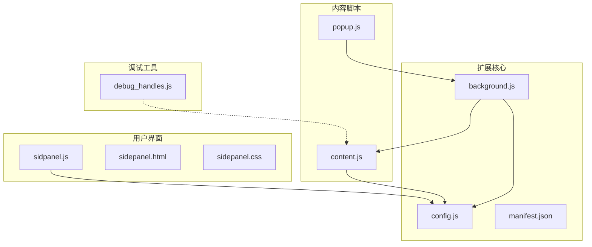
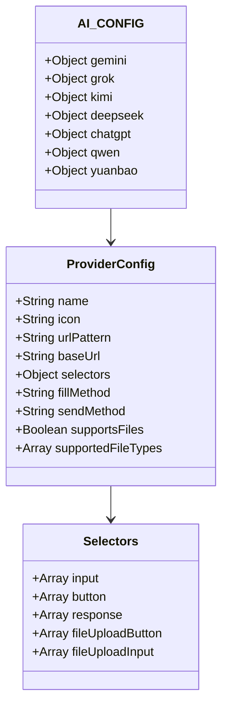
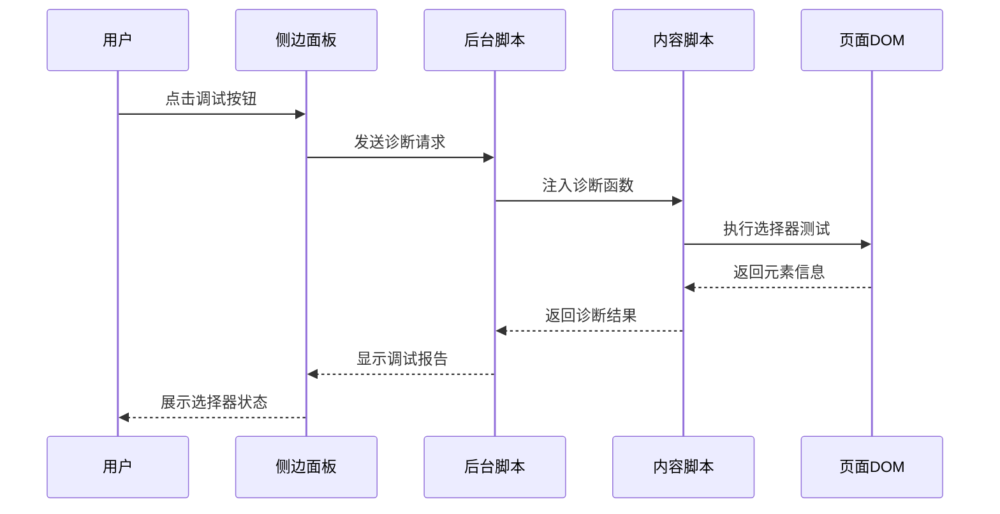
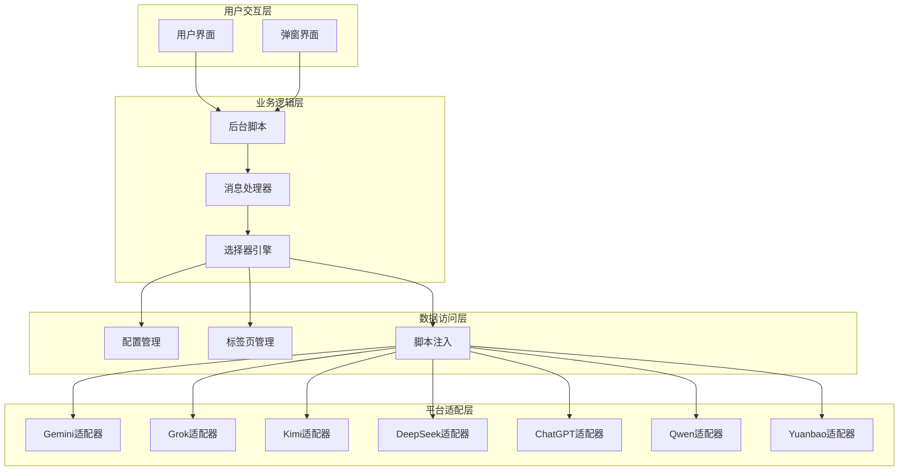
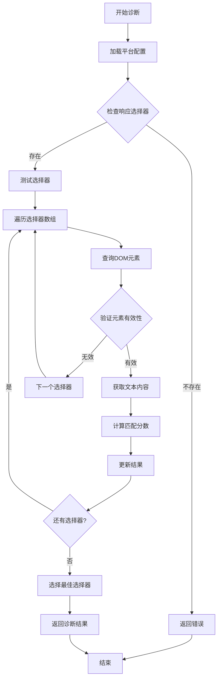
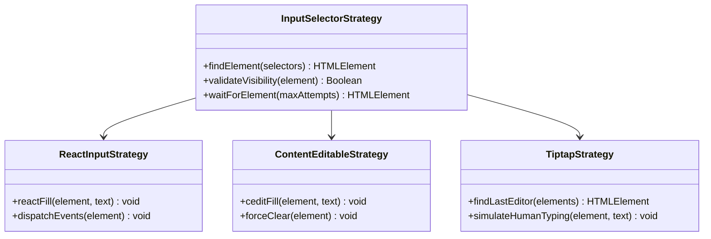
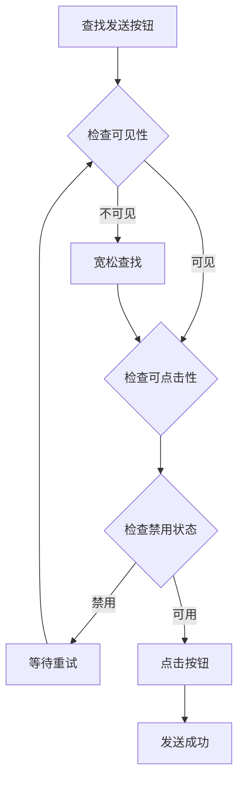
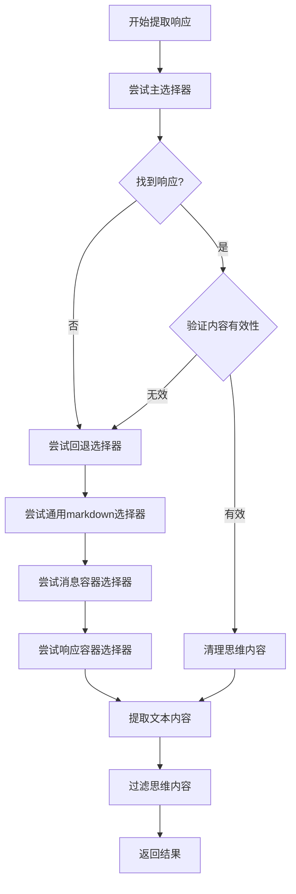
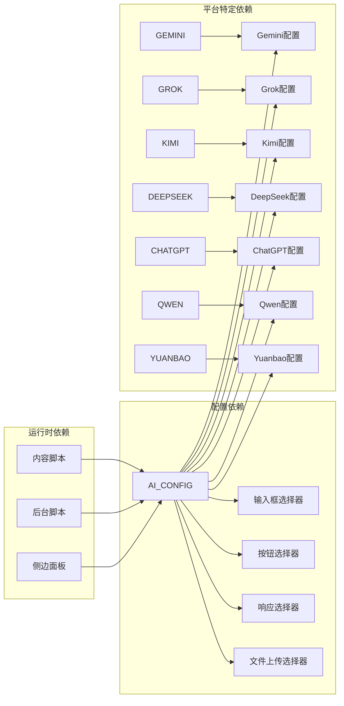

# CSS选择器分析与调试

<cite>
**本文档引用的文件**
- [src/config.js](file://src/config.js)
- [src/content/content.js](file://src/content/content.js)
- [src/background.js](file://src/background.js)
- [src/sidepanel/sidepanel.js](file://src/sidepanel/sidepanel.js)
- [src/sidepanel/sidepanel.html](file://src/sidepanel/sidepanel.html)
- [src/sidepanel/sidepanel.css](file://src/sidepanel/sidepanel.css)
- [src/popup/popup.js](file://src/popup/popup.js)
- [debug_handles.js](file://debug_handles.js)
- [manifest.json](file://manifest.json)
</cite>

## 目录
1. [简介](#简介)
2. [项目结构](#项目结构)
3. [核心组件](#核心组件)
4. [架构概览](#架构概览)
5. [详细组件分析](#详细组件分析)
6. [依赖关系分析](#依赖关系分析)
7. [性能考虑](#性能考虑)
8. [故障排除指南](#故障排除指南)
9. [结论](#结论)
10. [附录](#附录)

## 简介

本指南专注于AI平台CSS选择器的分析与调试技术。该项目是一个Chrome扩展，能够同时向多个AI聊天平台（Gemini、Grok、Kimi、DeepSeek、ChatGPT、Qwen、Yuanbao）发送消息。本文档详细说明如何分析目标AI平台的DOM结构，提取准确的CSS选择器映射到AI_CONFIG配置中，并提供完整的调试工具使用方法。

## 项目结构

该项目采用模块化设计，主要包含以下核心文件：



**图表来源**
- [src/background.js](file://src/background.js#L1-L800)
- [src/config.js](file://src/config.js#L1-L204)
- [src/content/content.js](file://src/content/content.js#L1-L941)

**章节来源**
- [manifest.json](file://manifest.json#L1-L79)
- [README.md](file://README.md#L1-L107)

## 核心组件

### AI_CONFIG配置系统

AI_CONFIG是整个系统的核心配置中心，定义了各个AI平台的选择器映射：



**图表来源**
- [src/config.js](file://src/config.js#L5-L199)

### 选择器调试工具

系统提供了完整的CSS选择器调试能力：



**图表来源**
- [src/background.js](file://src/background.js#L163-L169)
- [src/content/content.js](file://src/content/content.js#L126-L197)

**章节来源**
- [src/config.js](file://src/config.js#L1-L204)
- [src/content/content.js](file://src/content/content.js#L126-L197)
- [src/background.js](file://src/background.js#L163-L169)

## 架构概览

系统采用分层架构设计，确保选择器调试的完整性和可靠性：



**图表来源**
- [src/background.js](file://src/background.js#L1-L800)
- [src/content/content.js](file://src/content/content.js#L1-L941)

## 详细组件分析

### 选择器诊断系统

#### 诊断流程

诊断系统提供了多层选择器验证机制：



**图表来源**
- [src/content/content.js](file://src/content/content.js#L126-L197)

#### 选择器优先级排序

系统实现了智能的选择器优先级排序算法：

| 优先级 | 选择器类型 | 描述 | 示例 |
|--------|------------|------|------|
| 1 | 精确匹配 | 精确的类名和属性匹配 | `.markdown-body:last-of-type` |
| 2 | 模糊匹配 | 包含关键词的选择器 | `[aria-label*="Send"]` |
| 3 | 降级匹配 | 通用的回退选择器 | `textarea` |
| 4 | 结构匹配 | 基于DOM结构的选择器 | `div:nth-child(n)` |

**章节来源**
- [src/content/content.js](file://src/content/content.js#L126-L197)
- [src/content/content.js](file://src/content/content.js#L218-L320)

### 不同类型元素的选择器策略

#### 输入框选择器策略

针对不同平台的输入框特点，采用了差异化策略：



**图表来源**
- [src/content/content.js](file://src/content/content.js#L385-L418)
- [src/content/content.js](file://src/content/content.js#L434-L463)

#### 发送按钮选择器策略

发送按钮的检测采用了多层次的验证机制：



**图表来源**
- [src/content/content.js](file://src/content/content.js#L465-L565)

#### 响应内容选择器策略

响应内容提取采用了智能的回退机制：



**图表来源**
- [src/content/content.js](file://src/content/content.js#L218-L320)

**章节来源**
- [src/content/content.js](file://src/content/content.js#L385-L565)
- [src/content/content.js](file://src/content/content.js#L218-L320)

### 实际案例分析

#### Gemini平台选择器优化

Gemini平台选择了多层选择器以确保稳定性：

| 选择器类型 | 选择器表达式 | 用途 | 稳定性评分 |
|------------|--------------|------|------------|
| 主输入框 | `div.ql-editor[contenteditable="true"]` | 主要输入框 | ⭐⭐⭐⭐⭐ |
| 备用输入框 | `.ql-editor` | 备用输入框 | ⭐⭐⭐⭐ |
| 复合输入框 | `div[role="textbox"]` | 复合编辑器 | ⭐⭐⭐⭐ |
| 通用输入框 | `div[contenteditable="true"]` | 通用回退 | ⭐⭐⭐ |

#### Grok平台复杂选择器

Grok平台由于使用Tiptap编辑器，选择了专门的处理策略：

```javascript
// Grok使用ProseMirror编辑器的特殊处理
const tiptapList = Array.from(document.querySelectorAll('div.tiptap.ProseMirror'));
const tiptap = tiptapList.reverse().find(el => el.offsetParent !== null) || tiptapList[0] || null;
```

#### Kimi平台稳定性优化

Kimi平台由于UI复杂性，采用了特殊的填充策略：

```javascript
// Kimi使用内容脚本填充而非主世界填充
if (config.fillMethod === 'content-script') {
    await fillContentEditable(inputEl, text, provider);
}
```

**章节来源**
- [src/config.js](file://src/config.js#L6-L22)
- [src/config.js](file://src/config.js#L23-L54)
- [src/config.js](file://src/config.js#L55-L75)

## 依赖关系分析

系统的选择器依赖关系体现了模块化的设计理念：



**图表来源**
- [src/config.js](file://src/config.js#L5-L199)
- [src/content/content.js](file://src/content/content.js#L322-L418)

**章节来源**
- [src/config.js](file://src/config.js#L1-L204)
- [src/content/content.js](file://src/content/content.js#L1-L941)

## 性能考虑

### 选择器性能优化

系统在选择器性能方面采用了多项优化策略：

1. **延迟加载机制**：使用`MAX_INPUT_WAIT_ATTEMPTS`和`MAX_BUTTON_WAIT_ATTEMPTS`控制等待时间
2. **智能重试策略**：根据平台特性调整重试间隔和次数
3. **DOM查询优化**：优先使用精确选择器减少DOM扫描范围
4. **缓存机制**：避免重复的DOM查询操作

### 内存管理

```javascript
// 选择器诊断结果的内存管理
const results = [];
// 使用WeakMap避免内存泄漏
const selectorCache = new WeakMap();
```

### 并发处理

系统支持多平台并发操作，采用了Promise.allSettled确保部分失败不影响整体执行：

**章节来源**
- [src/content/content.js](file://src/content/content.js#L6-L25)
- [src/background.js](file://src/background.js#L264-L268)

## 故障排除指南

### 常见选择器问题诊断

#### 问题1：选择器无法找到元素

**症状**：控制台显示"Input element not found"

**诊断步骤**：
1. 检查选择器是否正确
2. 验证页面DOM结构变化
3. 确认选择器优先级顺序

**解决方案**：
```javascript
// 添加更宽松的选择器回退
const fallbackSelectors = [
    'textarea',
    'div[contenteditable="true"]',
    'div[role="textbox"]'
];
```

#### 问题2：选择器匹配过多元素

**症状**：选择器返回多个元素但不是目标元素

**诊断步骤**：
1. 检查元素的offsetParent属性
2. 验证元素的可见性状态
3. 确认元素的定位属性

**解决方案**：
```javascript
// 精确查找可见元素
for (const sel of selectors) {
    try {
        const el = document.querySelector(sel);
        if (el && el.offsetParent !== null) return el;
    } catch (e) { }
}
```

#### 问题3：选择器性能问题

**症状**：页面响应缓慢或卡顿

**诊断步骤**：
1. 检查选择器复杂度
2. 分析DOM树深度
3. 评估选择器执行时间

**解决方案**：
```javascript
// 优化选择器复杂度
const optimizedSelectors = [
    '.markdown-body:last-of-type',  // 更具体
    '[class*="message-content"]:last-of-type',  // 适度模糊
    '[class*="response"]:last-of-type'  // 通用回退
];
```

### 调试工具使用

#### 浏览器开发者工具使用技巧

1. **Elements面板使用**：
   - 使用`$0`获取当前选中元素
   - 使用`$$()`获取元素列表
   - 利用选择器测试功能验证CSS选择器

2. **Console面板调试**：
   ```javascript
   // 测试选择器
   const elements = document.querySelectorAll('.markdown-body:last-of-type');
   console.log('找到元素数量:', elements.length);
   ```

3. **Sources面板断点调试**：
   - 在选择器查找函数处设置断点
   - 监控DOM变化事件
   - 分析选择器执行过程

#### 动态选择器测试方法

```javascript
// 动态测试选择器的实用函数
function testSelector(selector) {
    try {
        const element = document.querySelector(selector);
        if (element) {
            console.log(`✅ 选择器 "${selector}" 成功匹配`);
            console.log('元素:', element);
            console.log('文本内容长度:', element.textContent.length);
            return true;
        } else {
            console.log(`❌ 选择器 "${selector}" 未匹配到元素`);
            return false;
        }
    } catch (error) {
        console.log(`💥 选择器 "${selector}" 执行错误:`, error.message);
        return false;
    }
}
```

#### 选择器优先级排序工具

```javascript
// 选择器优先级排序算法
function rankSelectors(selectors, context = document) {
    return selectors.map(selector => {
        try {
            const elements = context.querySelectorAll(selector);
            return {
                selector: selector,
                count: elements.length,
                avgLength: Array.from(elements)
                    .reduce((sum, el) => sum + (el.textContent || '').length, 0) / elements.length,
                validity: elements.length > 0 ? 'valid' : 'invalid'
            };
        } catch (error) {
            return {
                selector: selector,
                count: 0,
                avgLength: 0,
                validity: 'error'
            };
        }
    }).sort((a, b) => {
        if (b.validity === 'valid' && a.validity !== 'valid') return -1;
        if (a.validity === 'valid' && b.validity !== 'valid') return 1;
        return b.avgLength - a.avgLength;
    });
}
```

**章节来源**
- [debug_handles.js](file://debug_handles.js#L1-L73)
- [src/content/content.js](file://src/content/content.js#L573-L590)

## 结论

本CSS选择器分析与调试指南展示了如何在复杂的多平台AI聊天环境中建立稳定可靠的选择器系统。通过模块化的配置管理、智能的诊断工具和完善的故障排除机制，系统能够在各种平台变化中保持选择器的有效性。

关键要点包括：
1. **层次化配置**：通过AI_CONFIG实现平台特定的选择器配置
2. **智能诊断**：提供完整的选择器测试和验证工具
3. **性能优化**：采用多种策略确保选择器执行效率
4. **稳定性保障**：多层回退机制确保在平台变化时仍能正常工作

这些实践为类似项目的CSS选择器开发提供了宝贵的参考经验。

## 附录

### 选择器调试最佳实践

1. **渐进式测试**：从最精确的选择器开始，逐步放宽条件
2. **环境隔离**：在独立的测试环境中验证选择器
3. **版本控制**：为重要的选择器变更建立版本记录
4. **监控告警**：建立选择器失效的监控机制

### 常用调试命令

```bash
# 在浏览器控制台中执行
console.log('选择器测试开始');
const selectors = ['.markdown-body:last-of-type', '[class*="message-content"]'];
selectors.forEach(testSelector);
console.log('选择器测试结束');
```

### 选择器性能基准

| 选择器类型 | 平均执行时间 | 内存占用 | 推荐场景 |
|------------|--------------|----------|----------|
| ID选择器 | <1ms | 低 | 精确定位 |
| 类选择器 | <2ms | 中 | 一般定位 |
| 属性选择器 | <3ms | 中 | 特征匹配 |
| 伪类选择器 | <4ms | 高 | 复杂匹配 |
| 通用选择器 | <5ms | 高 | 回退方案 |