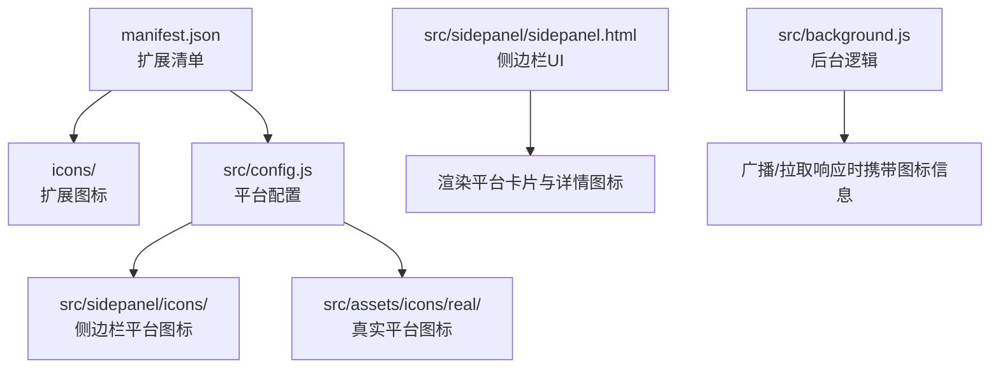
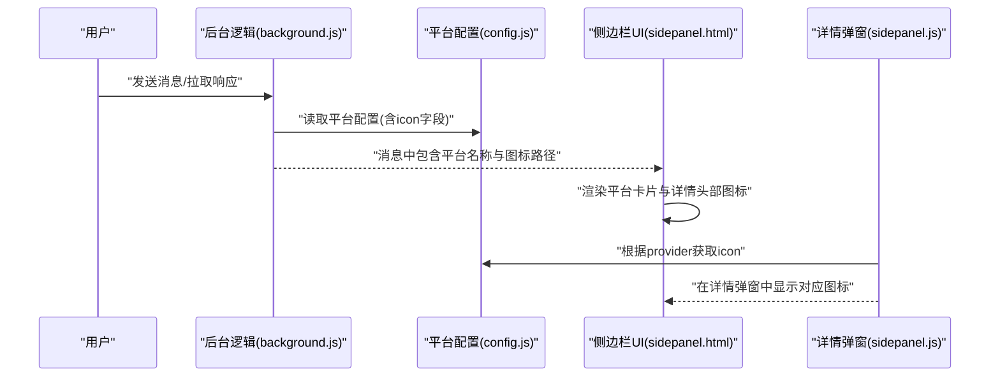
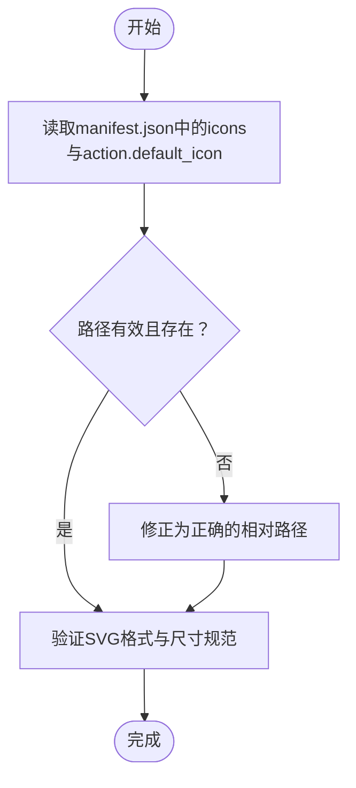
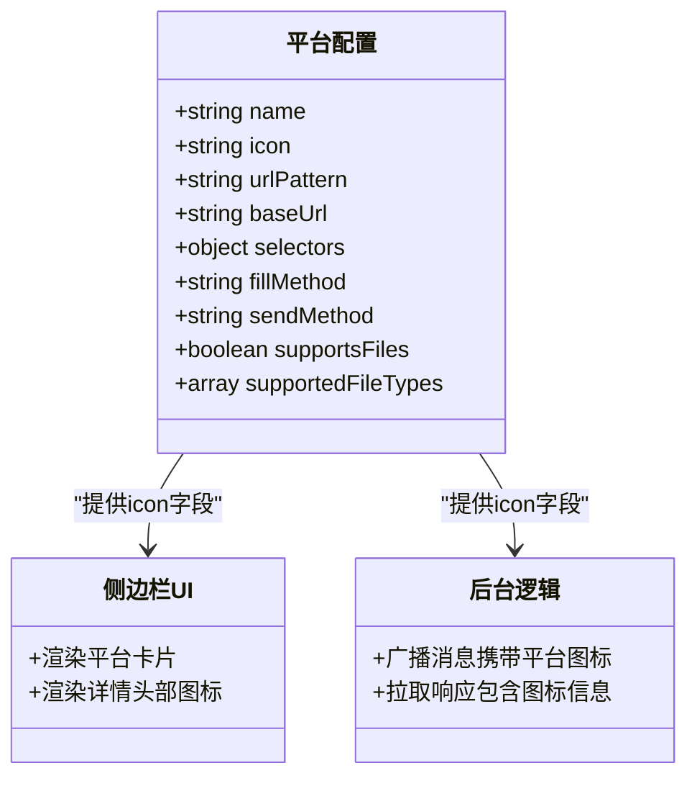
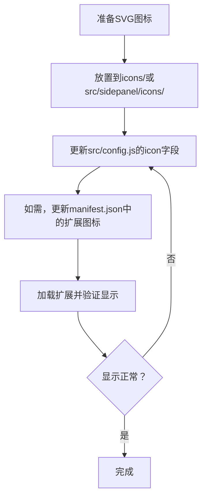
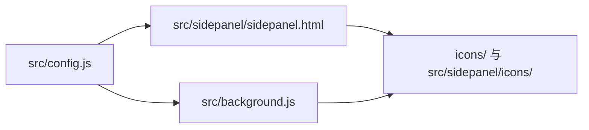

# 图标资源管理

<cite>
**本文档引用的文件**
- [manifest.json](file://manifest.json)
- [config.js](file://src/config.js)
- [sidepanel.html](file://src/sidepanel/sidepanel.html)
- [sidepanel.js](file://src/sidepanel/sidepanel.js)
- [background.js](file://src/background.js)
- [popup.js](file://src/popup/popup.js)
- [README.md](file://README.md)
- [icons 目录](file://icons/)
- [sidepanel/icons 目录](file://src/sidepanel/icons/)
- [assets/icons/real 目录](file://src/assets/icons/real/)
</cite>

## 目录
1. [简介](#简介)
2. [项目结构](#项目结构)
3. [核心组件](#核心组件)
4. [架构总览](#架构总览)
5. [详细组件分析](#详细组件分析)
6. [依赖关系分析](#依赖关系分析)
7. [性能考虑](#性能考虑)
8. [故障排除指南](#故障排除指南)
9. [结论](#结论)
10. [附录](#附录)

## 简介
本指南面向需要在AI平台Chrome扩展中管理图标资源的开发者与维护者，系统性说明以下内容：
- 如何配置AI平台图标的icon字段
- 图标文件的存放位置与命名规范
- SVG图标的格式要求与尺寸规范
- 图标添加的完整流程（从准备到配置更新）
- 图标在不同界面组件中的应用场景（侧边栏平台列表、响应详情等）
- 图标设计的最佳实践与视觉一致性要求
- 图标资源的维护与更新方法

## 项目结构
该项目采用原生JavaScript、HTML与CSS构建，无构建工具依赖，保持轻量化与可维护性。图标资源主要分布在以下位置：
- 扩展图标与浏览器Action图标：根目录icons文件夹
- 平台图标：src/sidepanel/icons与src/assets/icons/real两个目录
- 配置集中于src/config.js，各平台通过icon字段指向对应图标路径

**图表来源**
- [manifest.json](file://manifest.json#L6-L11)
- [config.js](file://src/config.js#L5-L199)
- [sidepanel.html](file://src/sidepanel/sidepanel.html#L194-L242)
- [background.js](file://src/background.js#L200-L268)

**章节来源**
- [README.md](file://README.md#L20-L28)
- [manifest.json](file://manifest.json#L6-L11)
- [config.js](file://src/config.js#L5-L199)
- [sidepanel.html](file://src/sidepanel/sidepanel.html#L194-L242)

## 核心组件
- 扩展清单（manifest.json）定义了扩展图标与Action图标映射，确保浏览器工具栏与应用商店展示一致。
- 平台配置（src/config.js）集中管理各AI平台的名称、图标路径、URL匹配规则等。
- 侧边栏界面（src/sidepanel/sidepanel.html）用于展示平台卡片与响应详情，直接使用配置中的icon字段。
- 后台逻辑（src/background.js）在广播消息、拉取响应时携带平台图标信息，供前端渲染。

**章节来源**
- [manifest.json](file://manifest.json#L6-L11)
- [config.js](file://src/config.js#L5-L199)
- [sidepanel.html](file://src/sidepanel/sidepanel.html#L194-L242)
- [background.js](file://src/background.js#L200-L268)

## 架构总览
下图展示了图标在不同模块间的流转关系：配置文件提供图标路径，HTML模板渲染图标，后台逻辑在跨标签通信时携带图标信息。

**图表来源**
- [background.js](file://src/background.js#L200-L268)
- [config.js](file://src/config.js#L5-L199)
- [sidepanel.html](file://src/sidepanel/sidepanel.html#L194-L242)
- [sidepanel.js](file://src/sidepanel/sidepanel.js#L531-L633)

## 详细组件分析

### 扩展图标与Action图标配置
- manifest.json中定义了扩展图标与Action图标的多分辨率映射，确保在不同缩放与主题下均清晰显示。
- 建议使用SVG格式作为源文件，便于无损缩放与主题适配。

**图表来源**
- [manifest.json](file://manifest.json#L6-L11)

**章节来源**
- [manifest.json](file://manifest.json#L6-L11)

### 平台图标配置与使用
- src/config.js中，每个平台对象包含icon字段，指向具体图标文件路径。
- 侧边栏平台卡片与详情弹窗均通过该字段渲染对应图标。

**图表来源**
- [config.js](file://src/config.js#L5-L199)
- [sidepanel.html](file://src/sidepanel/sidepanel.html#L194-L242)
- [sidepanel.js](file://src/sidepanel/sidepanel.js#L531-L633)
- [background.js](file://src/background.js#L200-L268)

**章节来源**
- [config.js](file://src/config.js#L5-L199)
- [sidepanel.html](file://src/sidepanel/sidepanel.html#L194-L242)
- [sidepanel.js](file://src/sidepanel/sidepanel.js#L531-L633)
- [background.js](file://src/background.js#L200-L268)

### 图标文件存放位置与命名规范
- 扩展图标：icons/目录，建议提供16x16、32x32、48x48、128x128四种尺寸，使用SVG格式。
- 平台图标：
  - src/sidepanel/icons/：侧边栏平台卡片使用的图标，建议统一为SVG或PNG，尺寸保持一致。
  - src/assets/icons/real/：真实平台的官方图标资源，可作为参考或备用。
- 命名规范：使用平台英文名小写加扩展名，如gemini.svg、chatgpt.png等。

**章节来源**
- [manifest.json](file://manifest.json#L6-L11)
- [sidepanel.html](file://src/sidepanel/sidepanel.html#L194-L242)
- [config.js](file://src/config.js#L5-L199)

### SVG图标标准格式要求与尺寸规范
- 标准格式要求：
  - 使用矢量格式（SVG），确保在高DPI与深色模式下清晰显示。
  - 内嵌viewBox属性，保证缩放与居中。
  - 仅保留必要图形路径，避免冗余节点。
  - 使用单一主色（通常为currentColor），以便主题切换时自动适配。
- 尺寸规范：
  - 侧边栏平台卡片与详情头部图标建议统一为16x16至24x24像素范围，确保在不同布局下清晰可辨。
  - 扩展图标建议提供16x16、32x32、48x48、128x128四种尺寸，满足不同显示密度需求。

**章节来源**
- [sidepanel.html](file://src/sidepanel/sidepanel.html#L194-L242)
- [sidepanel.js](file://src/sidepanel/sidepanel.js#L531-L633)
- [manifest.json](file://manifest.json#L6-L11)

### 图标添加的完整流程
- 准备阶段：
  - 设计或获取符合规范的SVG图标，确保viewBox与颜色符合要求。
  - 将图标文件放入icons/或src/sidepanel/icons/相应目录。
- 配置阶段：
  - 在src/config.js中为对应平台设置icon字段，指向新图标路径。
  - 若涉及扩展图标，同步更新manifest.json中的icons与action.default_icon。
- 验证阶段：
  - 加载扩展，检查侧边栏平台卡片与详情弹窗是否正确显示新图标。
  - 在不同主题与缩放下测试显示效果。

**图表来源**
- [config.js](file://src/config.js#L5-L199)
- [manifest.json](file://manifest.json#L6-L11)
- [sidepanel.html](file://src/sidepanel/sidepanel.html#L194-L242)

**章节来源**
- [config.js](file://src/config.js#L5-L199)
- [manifest.json](file://manifest.json#L6-L11)
- [sidepanel.html](file://src/sidepanel/sidepanel.html#L194-L242)

### 图标在不同界面组件中的应用场景
- 侧边栏平台列表：在src/sidepanel/sidepanel.html的平台网格中，每个平台卡片通过img标签加载对应图标，用于直观区分不同AI平台。
- 响应详情弹窗：在src/sidepanel/sidepanel.js中，详情弹窗头部显示当前响应来源平台的图标，帮助用户快速识别信息来源。
- 后台广播/拉取：src/background.js在广播消息与拉取响应时携带平台名称与图标路径，前端据此渲染对应图标。

**章节来源**
- [sidepanel.html](file://src/sidepanel/sidepanel.html#L194-L242)
- [sidepanel.js](file://src/sidepanel/sidepanel.js#L531-L633)
- [background.js](file://src/background.js#L200-L268)

### 图标设计最佳实践与视觉一致性
- 视觉一致性：
  - 统一图标风格与线条粗细，确保在侧边栏与详情弹窗中呈现一致的观感。
  - 使用平台主色调或单色方案，避免过于复杂的渐变与阴影。
- 可访问性：
  - 为图标提供alt文本（如平台名称），提升屏幕阅读器可用性。
  - 确保在浅色与深色主题下均有良好对比度。
- 文件优化：
  - SVG文件应去除不必要的命名空间与注释，减小体积。
  - 采用压缩后的SVG，避免在扩展包中引入冗余数据。

**章节来源**
- [sidepanel.html](file://src/sidepanel/sidepanel.html#L194-L242)
- [sidepanel.js](file://src/sidepanel/sidepanel.js#L531-L633)

## 依赖关系分析
- 配置依赖：src/config.js中的icon字段被侧边栏UI与后台逻辑共同依赖。
- 资源依赖：icons/与src/sidepanel/icons/中的图标文件路径必须与配置保持一致。
- 渲染依赖：src/sidepanel/sidepanel.html与src/sidepanel/sidepanel.js负责最终渲染，若路径不一致会导致图标缺失。

**图表来源**
- [config.js](file://src/config.js#L5-L199)
- [sidepanel.html](file://src/sidepanel/sidepanel.html#L194-L242)
- [background.js](file://src/background.js#L200-L268)

**章节来源**
- [config.js](file://src/config.js#L5-L199)
- [sidepanel.html](file://src/sidepanel/sidepanel.html#L194-L242)
- [background.js](file://src/background.js#L200-L268)

## 性能考虑
- 图标体积控制：优先使用压缩后的SVG，避免过大文件影响加载速度。
- 缓存策略：浏览器与扩展框架会对静态资源进行缓存，更新图标时建议采用版本化命名或变更文件名以强制刷新。
- 渲染优化：在侧边栏大量平台卡片场景下，尽量复用SVG符号或使用CSS精灵图（如适用），减少DOM节点数量。

## 故障排除指南
- 图标不显示：
  - 检查src/config.js中的icon路径是否正确，确认文件存在于icons/或src/sidepanel/icons/目录。
  - 确认manifest.json中的扩展图标路径有效。
- 图标模糊或失真：
  - 确认使用SVG格式并包含viewBox，避免固定像素尺寸导致缩放失真。
- 主题不兼容：
  - 确保SVG使用单色填充（currentColor），并在CSS中正确继承颜色。

**章节来源**
- [config.js](file://src/config.js#L5-L199)
- [manifest.json](file://manifest.json#L6-L11)
- [sidepanel.html](file://src/sidepanel/sidepanel.html#L194-L242)

## 结论
通过规范化的图标资源配置与存放策略，结合统一的SVG格式与尺寸规范，可以在不同界面组件中实现一致且高质量的图标显示效果。遵循本文档提供的流程与最佳实践，能够高效地完成图标添加、维护与更新工作，提升用户体验与视觉一致性。

## 附录
- 相关文件与目录：
  - 扩展图标：icons/
  - 平台图标（侧边栏）：src/sidepanel/icons/
  - 平台图标（真实资源）：src/assets/icons/real/
  - 配置文件：src/config.js
  - 清单文件：manifest.json
  - 侧边栏界面：src/sidepanel/sidepanel.html
  - 侧边栏逻辑：src/sidepanel/sidepanel.js
  - 后台逻辑：src/background.js
  - 弹出窗口逻辑：src/popup/popup.js

**章节来源**
- [README.md](file://README.md#L20-L28)
- [manifest.json](file://manifest.json#L6-L11)
- [config.js](file://src/config.js#L5-L199)
- [sidepanel.html](file://src/sidepanel/sidepanel.html#L194-L242)
- [sidepanel.js](file://src/sidepanel/sidepanel.js#L531-L633)
- [background.js](file://src/background.js#L200-L268)
- [popup.js](file://src/popup/popup.js#L1-L61)