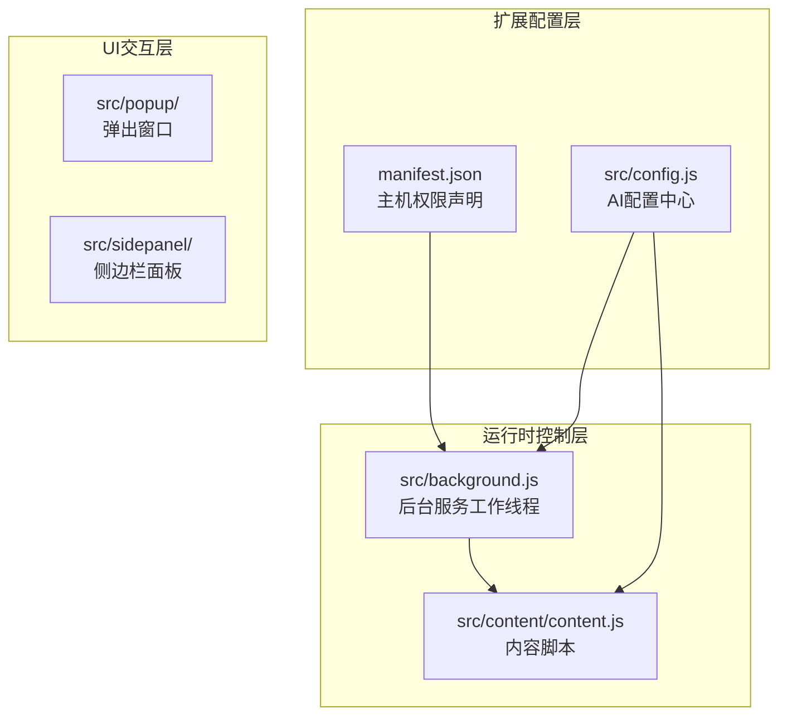
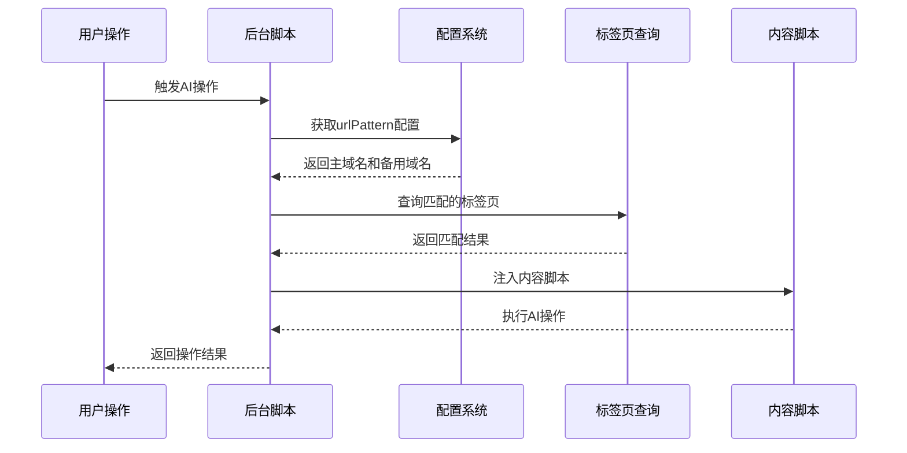
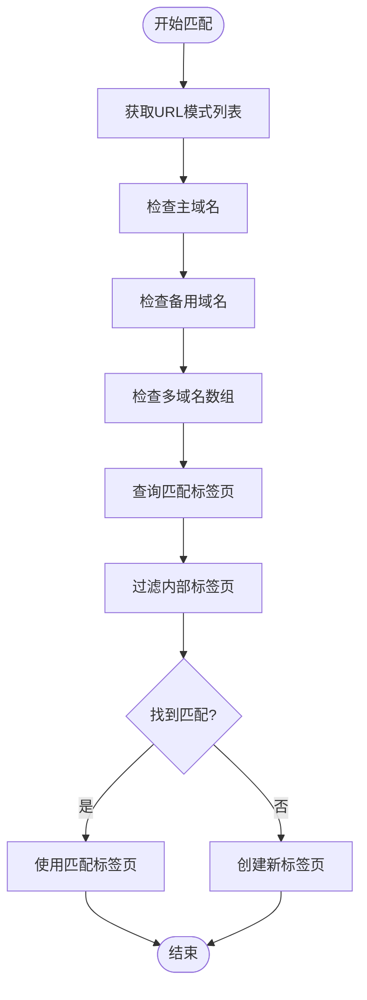
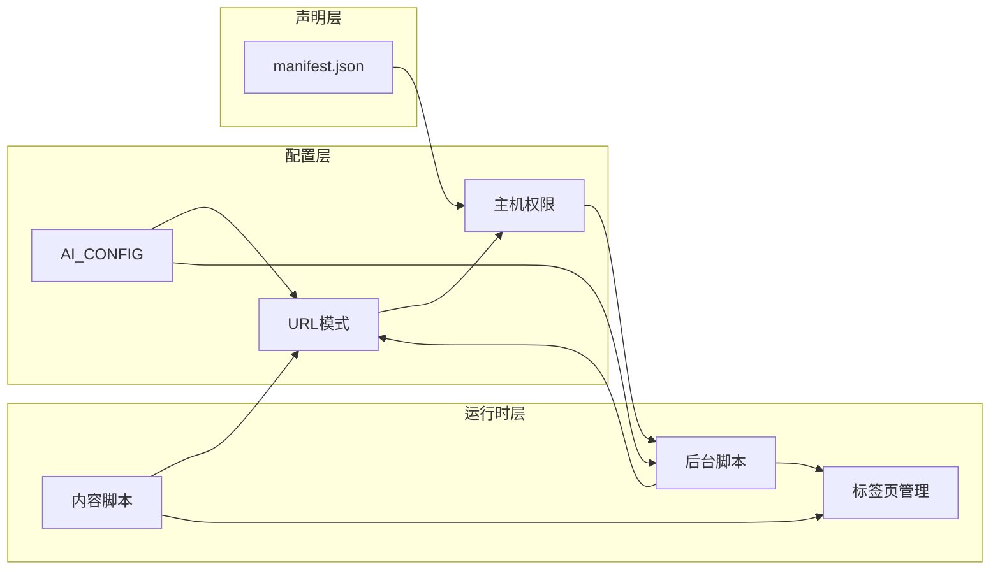

# 域名权限配置

<cite>
**本文档引用的文件**
- [manifest.json](file://manifest.json)
- [src/config.js](file://src/config.js)
- [src/background.js](file://src/background.js)
- [src/content/content.js](file://src/content/content.js)
- [README.md](file://README.md)
- [BUGFIX_REUSE_TAB_AND_CLEANUP_v1.7.8.md](file://BUGFIX_REUSE_TAB_AND_CLEANUP_v1.7.8.md)
</cite>

## 目录
1. [简介](#简介)
2. [项目结构](#项目结构)
3. [核心组件](#核心组件)
4. [架构概览](#架构概览)
5. [详细组件分析](#详细组件分析)
6. [依赖关系分析](#依赖关系分析)
7. [性能考量](#性能考量)
8. [故障排除指南](#故障排除指南)
9. [结论](#结论)
10. [附录](#附录)

## 简介
本指南专注于Chrome扩展的域名权限配置，详细说明urlPattern和urlPatternAlt字段的配置方法，解释通配符模式的使用规则和域名匹配原理。阐述manifest.json中host_permissions配置与AI_CONFIG中urlPattern的关系，确保扩展能够正确访问目标平台。提供域名权限申请的最佳实践，包括精确匹配vs通配符匹配的选择原则。解释备用域名配置（urlPatternAlt）的使用场景和配置方法。包含域名权限相关的安全考虑和隐私保护措施。提供域名配置错误的常见问题和解决方案。

## 项目结构
本项目采用模块化设计，域名权限配置分布在多个关键文件中：



**图表来源**
- [manifest.json](file://manifest.json#L1-L79)
- [src/config.js](file://src/config.js#L1-L204)
- [src/background.js](file://src/background.js#L1-L1028)

**章节来源**
- [manifest.json](file://manifest.json#L1-L79)
- [src/config.js](file://src/config.js#L1-L204)
- [README.md](file://README.md#L20-L28)

## 核心组件
域名权限系统由三个核心组件构成：

### 1. 主机权限声明（manifest.json）
Chrome扩展通过host_permissions字段声明所需的主机权限。这些权限决定了扩展可以访问哪些域名的页面。

### 2. AI配置中心（src/config.js）
AI_CONFIG对象定义了各个AI平台的urlPattern配置，包括主域名和备用域名。

### 3. 运行时匹配引擎（src/background.js）
后台脚本实现了基于URL模式的动态匹配逻辑，支持主域名和备用域名的灵活切换。

**章节来源**
- [manifest.json](file://manifest.json#L12-L32)
- [src/config.js](file://src/config.js#L5-L199)
- [src/background.js](file://src/background.js#L200-L268)

## 架构概览
域名权限配置的完整流程如下：



**图表来源**
- [src/background.js](file://src/background.js#L200-L268)
- [src/config.js](file://src/config.js#L5-L199)

## 详细组件分析

### URL模式配置详解

#### 基础URL模式语法
Chrome扩展使用通配符语法定义URL模式：
- `*://` - 匹配所有协议（http和https）
- `*://example.com/*` - 匹配example.com域下的所有路径
- `*://*.example.com/*` - 匹配example.com及其子域名的所有路径

#### 主域名配置（urlPattern）
每个AI平台必须配置主域名，这是扩展访问该平台的核心权限声明。

#### 备用域名配置（urlPatternAlt）
备用域名用于处理平台域名变更或镜像站点的情况。当主域名不可用时，备用域名提供降级方案。

**章节来源**
- [src/config.js](file://src/config.js#L9-L199)

### 配置最佳实践

#### 精确匹配 vs 通配符匹配
- **精确匹配**：适用于单一确定域名，如`*://gemini.google.com/*`
- **通配符匹配**：适用于子域名场景，如`*://*.example.com/*`
- **混合策略**：同时配置主域名和子域名，如`*://chat.deepseek.com/*`和`*://*.deepseek.com/*`

#### 多域名支持（urlPatterns）
某些平台支持多个域名，使用urlPatterns数组统一管理：
```javascript
qwen: {
    urlPatterns: [
        '*://www.qianwen.com/*',
        '*://tongyi.aliyun.com/*',
        '*://chat.qwen.ai/*',
        '*://*.qwen.ai/*',
        '*://*.aliyun.com/tongyi*'
    ]
}
```

**章节来源**
- [src/config.js](file://src/config.js#L115-L121)

### 运行时匹配机制

#### 标签页发现算法
后台脚本实现了智能的标签页发现机制：



**图表来源**
- [src/background.js](file://src/background.js#L218-L237)
- [src/background.js](file://src/background.js#L743-L760)

#### 内容脚本匹配
内容脚本通过URL模式自动注入到匹配的页面：

**章节来源**
- [manifest.json](file://manifest.json#L45-L68)
- [src/background.js](file://src/background.js#L657-L678)

### 安全考虑和隐私保护

#### 权限最小化原则
- 仅声明必要的主机权限
- 避免过度宽泛的通配符匹配
- 定期审查和清理不再使用的权限

#### 访问控制
- 内部扩展标签页自动过滤
- 仅对目标AI平台页面执行操作
- 避免跨平台数据泄露

#### 数据保护
- 不存储用户的AI对话内容
- 仅在必要时临时访问页面内容
- 提供明确的用户控制选项

**章节来源**
- [src/background.js](file://src/background.js#L229-L235)
- [src/background.js](file://src/background.js#L559-L560)

## 依赖关系分析

### 组件耦合度
域名权限配置涉及多个组件的紧密协作：



**图表来源**
- [src/config.js](file://src/config.js#L5-L199)
- [src/background.js](file://src/background.js#L200-L268)
- [manifest.json](file://manifest.json#L12-L32)

### 关键依赖关系
- manifest.json中的host_permissions必须覆盖AI_CONFIG中所有urlPattern
- 后台脚本依赖AI_CONFIG进行URL模式匹配
- 内容脚本通过URL模式自动注入
- 标签页查询功能依赖完整的URL模式配置

**章节来源**
- [src/config.js](file://src/config.js#L5-L199)
- [src/background.js](file://src/background.js#L200-L268)
- [manifest.json](file://manifest.json#L12-L32)

## 性能考量
域名权限配置对扩展性能的影响：

### 查询优化
- 使用Set去重避免重复查询相同的URL模式
- 并行查询多个URL模式提高响应速度
- 缓存匹配结果减少重复计算

### 内存管理
- 及时清理不再使用的标签页引用
- 避免内存泄漏影响长期运行稳定性
- 合理使用Promise.allSettled处理并发操作

## 故障排除指南

### 常见配置错误

#### 1. 权限不足错误
**症状**：扩展无法访问目标AI平台
**原因**：manifest.json中的host_permissions未包含AI_CONFIG中的urlPattern
**解决方案**：
- 检查AI_CONFIG中的所有urlPattern
- 在manifest.json的host_permissions中添加缺失的域名
- 确保通配符语法正确

#### 2. URL模式不匹配
**症状**：标签页查询返回空结果
**原因**：URL模式与实际页面URL不一致
**解决方案**：
- 验证目标页面的实际URL
- 检查通配符使用是否正确
- 考虑添加备用域名配置

#### 3. 内容脚本未注入
**症状**：扩展功能在目标页面不可用
**原因**：URL模式未正确匹配或权限不足
**解决方案**：
- 检查manifest.json中的content_scripts配置
- 验证URL模式与目标页面完全匹配
- 确认扩展已重新加载

### 调试技巧

#### 启用详细日志
后台脚本提供了详细的调试信息：
- URL模式匹配过程的日志
- 标签页查询结果的记录
- 错误处理和异常信息

#### 使用Chrome开发者工具
- 检查扩展的权限设置
- 监控网络请求和页面访问
- 调试内容脚本的执行情况

**章节来源**
- [src/background.js](file://src/background.js#L225-L236)
- [src/background.js](file://src/background.js#L333-L335)
- [BUGFIX_REUSE_TAB_AND_CLEANUP_v1.7.8.md](file://BUGFIX_REUSE_TAB_AND_CLEANUP_v1.7.8.md#L26-L81)

## 结论
域名权限配置是Chrome扩展开发的关键环节。通过合理配置AI_CONFIG中的urlPattern和urlPatternAlt，结合manifest.json中的host_permissions声明，可以确保扩展正确访问目标AI平台。建议遵循权限最小化原则，定期审查和优化URL模式配置，以平衡功能性、安全性和性能需求。

## 附录

### 配置模板
```javascript
// 基础配置模板
platform: {
    name: '平台名称',
    urlPattern: '*://primary-domain.com/*',
    urlPatternAlt: '*://backup-domain.com/*',
    urlPatterns: [
        '*://domain1.com/*',
        '*://*.domain2.com/*'
    ]
}
```

### 最佳实践清单
- ✅ 为主域名和备用域名都配置URL模式
- ✅ 定期更新AI平台的域名信息
- ✅ 使用精确匹配优先于通配符匹配
- ✅ 实施权限最小化原则
- ✅ 提供清晰的错误处理和用户反馈
- ✅ 定期进行安全审计和性能优化