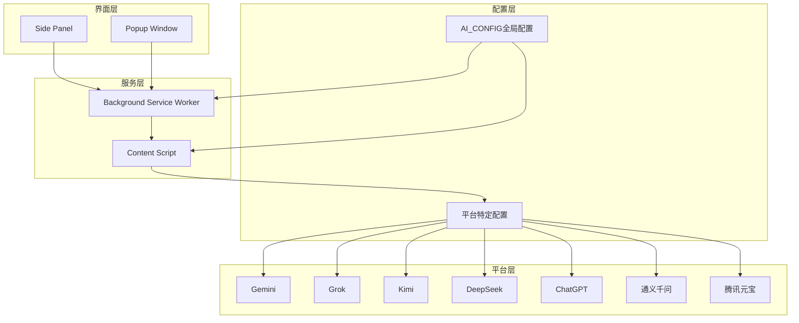
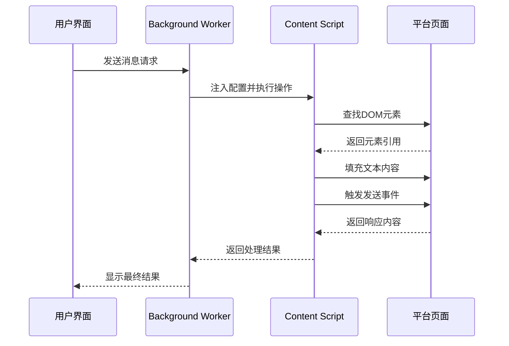
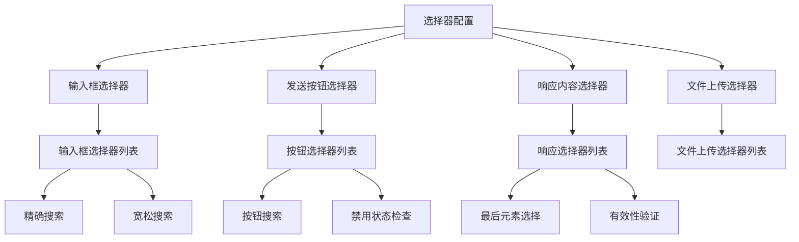
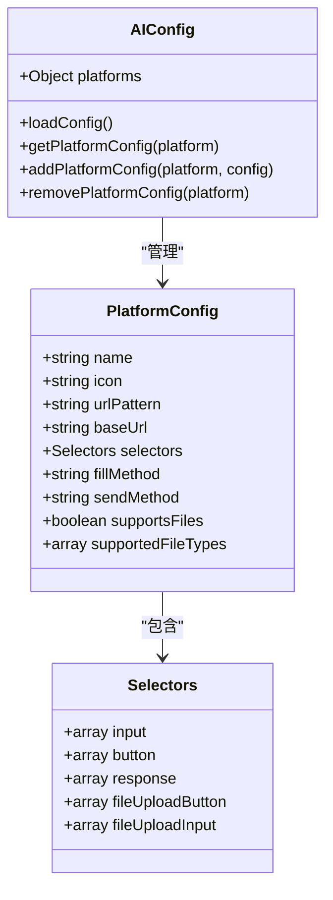
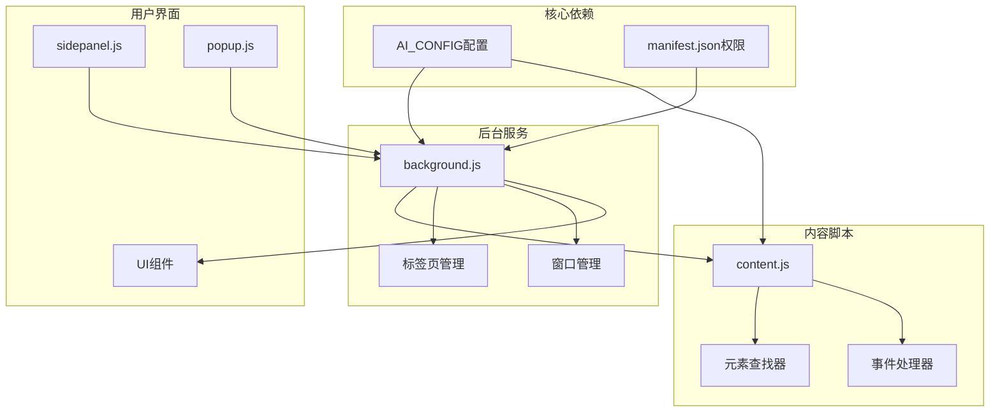

# 平台配置系统架构

<cite>
**本文档引用的文件**
- [src/config.js](file://src/config.js)
- [manifest.json](file://manifest.json)
- [src/background.js](file://src/background.js)
- [src/content/content.js](file://src/content/content.js)
- [src/sidepanel/sidepanel.js](file://src/sidepanel/sidepanel.js)
</cite>

## 目录
1. [简介](#简介)
2. [项目结构](#项目结构)
3. [核心组件](#核心组件)
4. [架构概览](#架构概览)
5. [详细组件分析](#详细组件分析)
6. [依赖关系分析](#依赖关系分析)
7. [性能考虑](#性能考虑)
8. [故障排除指南](#故障排除指南)
9. [结论](#结论)

## 简介

AI平台配置系统是一个模块化的统一配置管理架构，旨在为7个主流AI聊天平台提供标准化的配置接口。该系统通过全局配置对象AI_CONFIG实现了平台配置的集中管理，确保不同AI平台之间的操作一致性，同时保持足够的灵活性以适应各平台的独特特性。

系统的核心设计理念是"统一接口，差异化实现"，即通过标准化的配置字段和处理流程，为不同的AI平台提供一致的用户体验，同时允许每个平台根据自身特点进行特定优化。

## 项目结构

AI平台配置系统采用分层架构设计，主要包含以下核心组件：

**图表来源**
- [src/config.js](file://src/config.js#L5-L200)
- [src/background.js](file://src/background.js#L69-L74)
- [src/content/content.js](file://src/content/content.js#L1-L50)

**章节来源**
- [src/config.js](file://src/config.js#L1-L204)
- [manifest.json](file://manifest.json#L1-L79)

## 核心组件

### AI_CONFIG全局配置对象

AI_CONFIG是整个配置系统的核心，它是一个全局的JavaScript对象，包含了所有受支持AI平台的配置信息。该对象采用键值对的形式，每个键代表一个AI平台的标识符，对应的值是该平台的完整配置信息。

#### 基本字段结构

每个平台配置包含以下基本字段：

| 字段名 | 类型 | 必需 | 描述 |
|--------|------|------|------|
| name | string | 是 | 平台显示名称 |
| icon | string | 是 | 平台图标路径 |
| urlPattern | string | 是 | 主域名匹配模式 |
| baseUrl | string | 是 | 平台基础URL |

#### 扩展字段结构

除了基本字段外，配置还支持多种扩展字段：

| 字段名 | 类型 | 默认值 | 描述 |
|--------|------|--------|------|
| urlPatternAlt | string | 无 | 备用域名匹配模式 |
| urlPatterns | array | 无 | 多域名匹配模式数组 |
| selectors | object | 无 | DOM元素选择器映射 |
| fillMethod | string | 'main-world' | 文本填充方法 |
| sendMethod | string | 'enter' | 消息发送方法 |
| supportsFiles | boolean | false | 是否支持文件上传 |
| supportedFileTypes | array | 无 | 支持的文件类型列表 |

**章节来源**
- [src/config.js](file://src/config.js#L5-L200)

## 架构概览

AI平台配置系统采用三层架构设计，实现了配置管理、业务逻辑处理和用户界面的分离：

**图表来源**
- [src/background.js](file://src/background.js#L138-L197)
- [src/content/content.js](file://src/content/content.js#L199-L216)

### 配置系统工作流程

系统的工作流程遵循以下步骤：

1. **配置加载**：Background Worker和Content Script分别加载AI_CONFIG配置
2. **平台识别**：通过URL模式匹配确定目标AI平台
3. **元素定位**：使用selectors配置查找相应的DOM元素
4. **操作执行**：根据fillMethod和sendMethod执行相应操作
5. **结果处理**：提取并处理平台返回的响应内容

**章节来源**
- [src/background.js](file://src/background.js#L133-L136)
- [src/content/content.js](file://src/content/content.js#L322-L418)

## 详细组件分析

### 配置字段详解

#### 基本配置字段

每个平台配置都必须包含以下基本字段：

**name字段**
- 作用：定义平台在UI中的显示名称
- 示例：'Gemini'、'Grok'、'Kimi'
- 影响：影响侧边栏显示、通知消息和调试输出

**icon字段**
- 作用：指定平台图标的相对路径
- 格式：相对于扩展根目录的路径
- 示例：'icons/gemini.svg'、'icons/chatgpt.svg'

**urlPattern字段**
- 作用：定义平台域名匹配模式
- 格式：Chrome扩展的URL匹配语法
- 示例：'*://gemini.google.com/*'、'*://chatgpt.com/*'

**baseUrl字段**
- 作用：平台的基础访问URL
- 影响：用于自动打开新标签页时的初始地址

#### 选择器映射规则

selectors配置是配置系统的核心部分，它定义了如何在不同平台上定位关键DOM元素：

**图表来源**
- [src/config.js](file://src/config.js#L11-L17)
- [src/content/content.js](file://src/content/content.js#L574-L590)

**章节来源**
- [src/config.js](file://src/config.js#L11-L17)
- [src/content/content.js](file://src/content/content.js#L574-L590)

#### 发送方法选择原则

sendMethod字段决定了消息的发送方式，系统支持三种不同的发送策略：

**button模式**
- 适用场景：大多数传统表单提交
- 实现机制：查找并点击发送按钮
- 优势：最接近用户真实操作流程
- 典型平台：ChatGPT、通义千问、腾讯元宝

**enter模式**
- 适用场景：支持键盘快捷键的平台
- 实现机制：发送Enter键事件
- 优势：操作简单，兼容性好
- 典型平台：DeepSeek、通义千问

**form模式**
- 适用场景：使用原生表单的平台
- 实现机制：查找最近的form元素并提交
- 优势：直接利用平台原生功能
- 典型平台：较少使用

#### 文件支持配置

supportsFiles和supportedFileTypes字段共同定义了平台的文件上传能力：

**supportsFiles字段**
- 类型：boolean
- 作用：启用或禁用文件上传功能
- 影响：决定是否执行文件上传流程

**supportedFileTypes字段**
- 类型：array
- 作用：定义支持的文件类型
- 支持格式：
  - MIME类型：如 'image/*'、'.pdf'
  - 文件扩展名：如 '.jpg'、'.png'
  - 通配符：如 'image/*'

**章节来源**
- [src/config.js](file://src/config.js#L20-L22)
- [src/config.js](file://src/config.js#L52-L54)
- [src/config.js](file://src/config.js#L73-L75)
- [src/config.js](file://src/config.js#L91-L93)
- [src/config.js](file://src/config.js#L107-L109)
- [src/config.js](file://src/config.js#L160-L162)
- [src/config.js](file://src/config.js#L195-L198)

### 配置系统模块化设计

#### 模块化架构特点

配置系统采用了高度模块化的架构设计，主要体现在以下几个方面：

**平台独立性**
- 每个平台的配置都是独立的模块
- 可以单独修改或删除不影响其他平台
- 支持动态添加新平台配置

**配置复用性**
- 相似的平台可以共享部分配置
- 通过继承和组合实现配置复用
- 减少重复配置代码

**扩展性设计**
- 新增平台只需添加新的配置模块
- 不需要修改现有核心逻辑
- 支持渐进式功能扩展

#### 配置加载机制

**图表来源**
- [src/config.js](file://src/config.js#L5-L200)

**章节来源**
- [src/config.js](file://src/config.js#L5-L200)

### 统一配置接口实现

#### 跨平台统一处理

系统通过统一的配置接口实现了跨平台的一致性：

**消息发送流程**
1. 接收用户输入的消息
2. 根据provider参数查找对应配置
3. 定位输入框元素
4. 填充文本内容
5. 触发发送操作
6. 等待并提取响应

**响应提取机制**
- 使用配置中的response选择器
- 自动选择最新的响应内容
- 支持多种响应格式的解析

**错误处理策略**
- 统一的错误捕获和报告机制
- 平台特定的错误处理逻辑
- 用户友好的错误提示

**章节来源**
- [src/content/content.js](file://src/content/content.js#L322-L418)
- [src/content/content.js](file://src/content/content.js#L218-L320)

## 依赖关系分析

### 组件间依赖关系

AI平台配置系统中各组件之间的依赖关系如下：

**图表来源**
- [manifest.json](file://manifest.json#L12-L32)
- [src/background.js](file://src/background.js#L69-L74)
- [src/content/content.js](file://src/content/content.js#L1-L50)

### 外部依赖和集成点

系统对外部依赖的管理体现了良好的架构设计：

**Chrome扩展API依赖**
- scripting：脚本注入和执行
- tabs：标签页管理和通信
- windows：窗口管理和布局
- storage：本地存储和配置持久化

**平台API集成**
- 通过URL模式匹配识别目标平台
- 通过DOM选择器与平台交互
- 通过事件机制处理平台特定逻辑

**第三方库集成**
- marked.js：Markdown渲染
- highlight.js：代码高亮
- DOMPurify：HTML安全过滤

**章节来源**
- [manifest.json](file://manifest.json#L12-L18)
- [manifest.json](file://manifest.json#L45-L68)
- [src/background.js](file://src/background.js#L69-L74)

## 性能考虑

### 配置系统性能优化

配置系统在设计时充分考虑了性能因素，主要体现在以下几个方面：

**延迟加载机制**
- 配置对象在首次使用时才进行解析
- 按需加载平台特定的处理逻辑
- 避免不必要的资源消耗

**缓存策略**
- 平台配置结果缓存
- DOM元素查找结果缓存
- 用户偏好设置本地缓存

**异步处理**
- 所有网络操作采用异步方式
- 避免阻塞主线程
- 支持并发处理多个平台请求

**内存管理**
- 及时清理事件监听器
- 合理释放DOM引用
- 避免内存泄漏

### 性能监控和调优

系统提供了多种性能监控机制：

**执行时间统计**
- 记录关键操作的执行时间
- 分析性能瓶颈
- 提供性能报告

**资源使用监控**
- 监控内存使用情况
- 跟踪CPU占用率
- 分析网络请求频率

**用户反馈收集**
- 性能相关的用户反馈
- 使用频率统计
- 功能使用情况分析

## 故障排除指南

### 常见配置问题

#### 选择器失效问题

**问题表现**
- 输入框无法定位
- 发送按钮找不到
- 响应内容提取失败

**诊断步骤**
1. 检查urlPattern是否正确匹配
2. 验证selectors配置的准确性
3. 确认DOM结构是否发生变化
4. 测试选择器在浏览器控制台中的有效性

**解决方案**
- 更新选择器配置
- 添加备用选择器
- 实现选择器降级机制
- 使用更通用的选择器模式

#### 发送方法冲突问题

**问题表现**
- 消息发送失败
- 重复发送问题
- 按钮状态异常

**诊断步骤**
1. 检查sendMethod配置
2. 验证按钮状态检测逻辑
3. 确认事件处理机制
4. 分析平台特定的发送流程

**解决方案**
- 切换到更稳定的发送方法
- 实现按钮状态等待机制
- 添加防重复发送保护
- 优化事件处理顺序

#### 文件上传问题

**问题表现**
- 文件无法上传
- 支持类型检测失败
- 上传超时错误

**诊断步骤**
1. 检查supportsFiles配置
2. 验证supportedFileTypes设置
3. 确认文件大小限制
4. 测试上传流程

**解决方案**
- 更新支持的文件类型
- 调整文件大小限制
- 实现上传重试机制
- 添加进度反馈

### 调试工具和技巧

#### 内置调试功能

系统提供了丰富的调试工具：

**选择器诊断工具**
- 自动检测可用的选择器
- 显示元素匹配结果
- 提供选择器优化建议

**配置验证工具**
- 检查配置完整性
- 验证字段格式
- 提供修复建议

**性能分析工具**
- 监控执行时间
- 分析资源使用
- 生成性能报告

#### 开发者工具使用

**浏览器开发者工具**
- 使用Elements面板验证选择器
- 通过Console测试配置
- 利用Network面板监控请求

**Chrome扩展开发工具**
- 使用Extensions页面调试
- 通过Background Pages查看日志
- 利用Storage面板检查配置

**章节来源**
- [src/content/content.js](file://src/content/content.js#L126-L197)
- [src/background.js](file://src/background.js#L163-L169)

## 结论

AI平台配置系统通过其精心设计的架构，成功实现了多平台统一配置管理的目标。该系统不仅提供了强大的功能，还在可维护性、可扩展性和用户体验方面表现出色。

### 主要优势

**统一性与灵活性并存**
- 通过标准化的配置接口实现统一性
- 通过平台特定配置保持灵活性
- 支持渐进式功能扩展

**模块化设计**
- 清晰的组件边界和职责划分
- 良好的内聚性和低耦合性
- 支持独立开发和测试

**健壮的错误处理**
- 完善的异常捕获和恢复机制
- 用户友好的错误提示
- 详细的日志记录和诊断信息

### 技术创新点

**智能选择器匹配**
- 支持多种选择器模式
- 实现选择器降级机制
- 提供选择器诊断工具

**动态配置加载**
- 按需加载平台配置
- 支持运行时配置更新
- 实现配置热重载

**跨平台抽象层**
- 统一的API接口
- 平台特定的适配器
- 透明的平台切换

### 未来发展方向

随着AI技术的不断发展，配置系统还需要在以下方面持续改进：

**AI模型适配增强**
- 支持更多新兴AI平台
- 适配不同AI模型的特性
- 实现模型能力的动态检测

**智能化配置管理**
- 基于机器学习的配置优化
- 自动化的选择器生成
- 智能的错误预测和修复

**性能持续优化**
- 更高效的配置加载机制
- 优化的DOM操作策略
- 减少资源消耗的技术方案

通过持续的技术创新和架构优化，AI平台配置系统将继续为用户提供更好的跨平台AI体验，成为连接不同AI平台的重要桥梁。