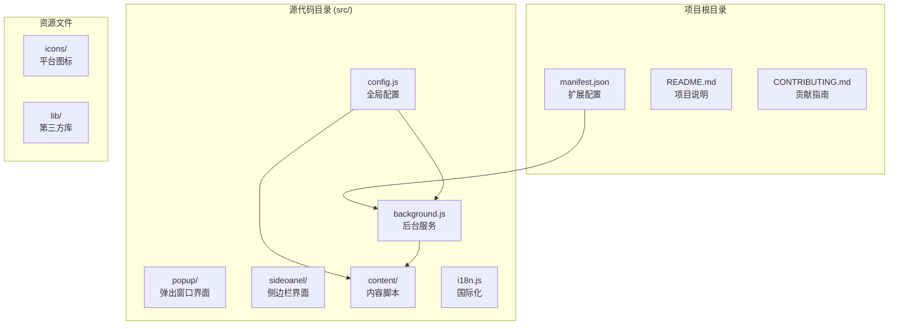
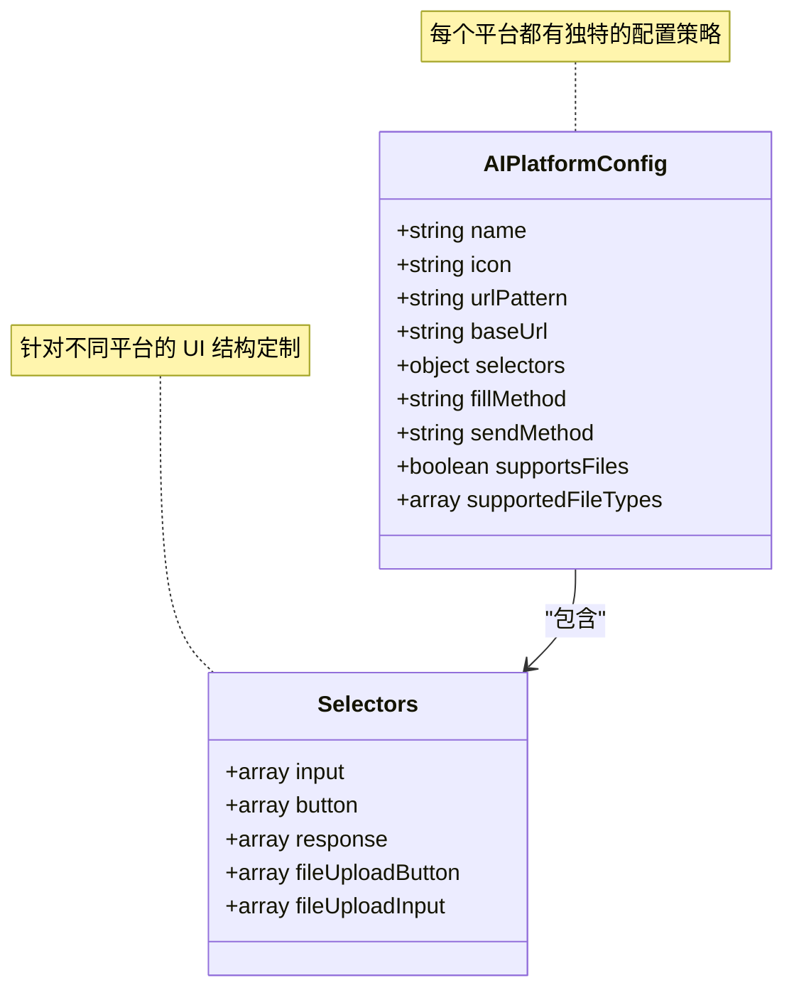
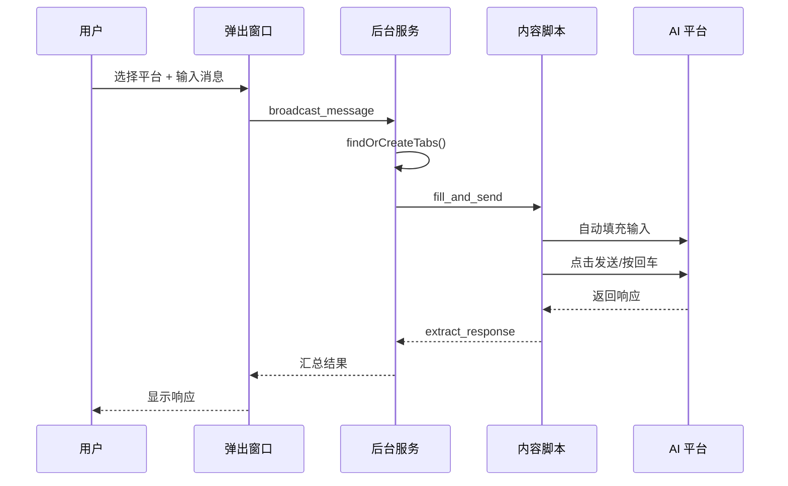
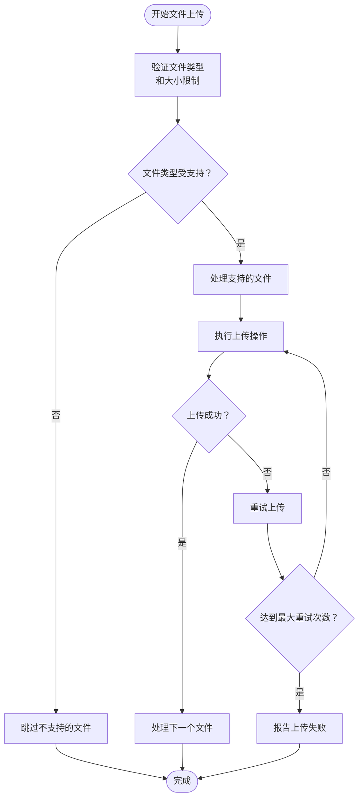
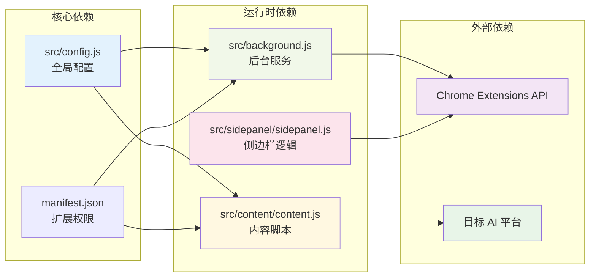

# 平台集成完整流程

<cite>
**本文档引用的文件**
- [README.md](file://README.md)
- [manifest.json](file://manifest.json)
- [src/config.js](file://src/config.js)
- [src/background.js](file://src/background.js)
- [src/content/content.js](file://src/content/content.js)
- [src/sidepanel/sidepanel.js](file://src/sidepanel/sidepanel.js)
- [src/popup/popup.js](file://src/popup/popup.js)
- [src/sidepanel/sidepanel.html](file://src/sidepanel/sidepanel.html)
- [CONTRIBUTING.md](file://CONTRIBUTING.md)
- [TESTING_v1.7.md](file://TESTING_v1.7.md)
- [User_UAT_Checklist.md](file://User_UAT_Checklist.md)
- [QUICK_TEST_GUIDE.md](file://QUICK_TEST_GUIDE.md)
- [DRAG_DROP_IMPLEMENTATION.md](file://DRAG_DROP_IMPLEMENTATION.md)
</cite>

## 目录
1. [简介](#简介)
2. [项目结构](#项目结构)
3. [核心组件](#核心组件)
4. [架构概览](#架构概览)
5. [详细组件分析](#详细组件分析)
6. [依赖关系分析](#依赖关系分析)
7. [性能考虑](#性能考虑)
8. [故障排除指南](#故障排除指南)
9. [结论](#结论)
10. [附录](#附录)

## 简介

AI Multiverse Chat 是一个轻量级 Chrome 扩展，允许用户同时向多个 AI 聊天机器人广播消息。该项目采用原生 JavaScript、HTML 和 CSS 构建，无需构建工具，保持了项目的简单和轻量。

本项目支持以下 AI 平台：
- Gemini (gemini.google.com)
- Grok (grok.com)
- Kimi (kimi.moonshot.cn)
- DeepSeek (chat.deepseek.com)
- ChatGPT (chatgpt.com)
- Qwen (chat.qwen.ai)
- Yuanbao (yuanbao.tencent.com)

## 项目结构

项目采用模块化设计，主要包含以下核心目录：



**图表来源**
- [manifest.json](file://manifest.json#L1-L79)
- [README.md](file://README.md#L20-L79)

**章节来源**
- [README.md](file://README.md#L20-L79)
- [manifest.json](file://manifest.json#L1-L79)

## 核心组件

### 配置管理系统

AI_CONFIG 对象是整个系统的核心，包含了所有支持平台的配置信息。每个平台配置包含以下关键要素：

- **基础信息**: 名称、图标路径、URL 模式
- **选择器映射**: 输入框、发送按钮、响应内容等 CSS 选择器
- **填充方法**: 主世界填充或内容脚本填充
- **发送方法**: 按钮点击或回车键发送
- **文件支持**: 是否支持文件上传及支持的文件类型

### 后台服务 (Background Service)

后台服务负责扩展的核心协调工作，包括：
- 窗口管理与调度
- 消息广播与路由
- 平台状态监控
- 响应收集与汇总

### 内容脚本 (Content Script)

内容脚本在目标 AI 网页中运行，负责：
- 自动化输入和发送
- 响应内容提取
- 文件上传处理
- 页面交互模拟

**章节来源**
- [src/config.js](file://src/config.js#L1-L204)
- [src/background.js](file://src/background.js#L1-L800)
- [src/content/content.js](file://src/content/content.js#L1-L941)

## 架构概览

系统采用 Chrome 扩展的标准架构，通过消息传递实现组件间的通信：

```mermaid
graph TB
subgraph "Chrome 扩展架构"
A[Popup Interface<br/>用户交互入口]
B[Sidepanel Interface<br/>主要功能界面]
C[Background Service<br/>核心协调器]
D[Content Scripts<br/>页面自动化]
E[Target AI Websites<br/>目标平台]
end
subgraph "消息传递机制"
F[Runtime Messaging<br/>双向通信]
G[Tab Management<br/>窗口控制]
H[Storage API<br/>状态持久化]
end
A --> F
B --> F
C <- --> F
C --> G
D --> F
D --> H
C --> H
F --> E
style A fill:#e1f5fe
style B fill:#e8f5e8
style C fill:#fff3e0
style D fill:#fce4ec
style E fill:#f3e5f5
```

**图表来源**
- [src/background.js](file://src/background.js#L1-L800)
- [src/popup/popup.js](file://src/popup/popup.js#L1-L61)
- [src/sidepanel/sidepanel.js](file://src/sidepanel/sidepanel.js#L1-L800)

## 详细组件分析

### 平台配置分析

每个 AI 平台的配置都遵循统一的结构模式：



**图表来源**
- [src/config.js](file://src/config.js#L5-L199)

### 消息处理流程



**图表来源**
- [src/background.js](file://src/background.js#L178-L376)
- [src/content/content.js](file://src/content/content.js#L322-L418)

### 文件上传处理



**图表来源**
- [src/content/content.js](file://src/content/content.js#L615-L742)

**章节来源**
- [src/config.js](file://src/config.js#L1-L204)
- [src/background.js](file://src/background.js#L178-L376)
- [src/content/content.js](file://src/content/content.js#L615-L742)

## 依赖关系分析

系统的关键依赖关系如下：



**图表来源**
- [manifest.json](file://manifest.json#L12-L69)
- [src/config.js](file://src/config.js#L1-L204)
- [src/background.js](file://src/background.js#L69-L74)

**章节来源**
- [manifest.json](file://manifest.json#L12-L69)
- [src/config.js](file://src/config.js#L1-L204)

## 性能考虑

### 选择器优化策略

每个平台都实现了多套 CSS 选择器作为备份方案：

- **精确匹配**: 首选可见元素的选择器
- **宽松匹配**: 包含隐藏元素的选择器
- **回退机制**: 当主要选择器失效时的备用方案

### 延迟和重试机制

系统实现了多层次的延迟和重试机制：
- **输入等待**: 最多20次尝试，每次间隔500ms
- **按钮等待**: 异步UI等待最多60次，同步UI等待最多80次
- **文件上传**: 最多3次重试，超时时间为30秒

### 内存管理

- **文件处理**: 使用 DataURL 方式处理文件，避免内存泄漏
- **DOM 操作**: 仅克隆必要的 DOM 节点进行处理
- **事件清理**: 及时清理事件监听器和定时器

## 故障排除指南

### 常见集成问题及解决方案

#### 1. 选择器失效问题

**症状**: 消息无法正确发送或响应无法提取

**诊断步骤**:
1. 使用 `diagnose_selectors` 功能检查选择器有效性
2. 查看控制台输出的诊断报告
3. 对比不同平台的选择器配置

**解决方案**:
- 更新 `selectors` 对象中的选择器数组
- 增加备用选择器以提高鲁棒性
- 考虑平台的动态内容加载特性

#### 2. 文件上传失败

**症状**: 文件无法上传或上传后显示错误

**诊断步骤**:
1. 检查文件类型是否在 `supportedFileTypes` 中
2. 验证文件大小是否超过限制
3. 查看上传超时和重试日志

**解决方案**:
- 扩展 `supportedFileTypes` 数组
- 调整上传超时时间和重试次数
- 实现平台特定的上传策略

#### 3. 平台兼容性问题

**症状**: 新平台无法识别或功能异常

**诊断步骤**:
1. 检查 `urlPattern` 是否正确匹配目标域名
2. 验证 `baseUrl` 是否指向正确的登录页面
3. 确认 `fillMethod` 和 `sendMethod` 的适用性

**解决方案**:
- 调整 URL 模式以适应平台的多域名特性
- 为复杂平台实现专用的填充逻辑
- 考虑平台的特殊交互模式

**章节来源**
- [src/background.js](file://src/background.js#L270-L296)
- [src/content/content.js](file://src/content/content.js#L126-L197)
- [TESTING_v1.7.md](file://TESTING_v1.7.md#L55-L161)

## 结论

AI Multiverse Chat 提供了一个完整的平台集成框架，具有以下优势：

1. **模块化设计**: 清晰的配置分离和职责划分
2. **可扩展性**: 易于添加新平台的标准化流程
3. **稳定性**: 多层次的错误处理和回退机制
4. **性能优化**: 针对不同平台的优化策略

通过遵循本文档提供的集成流程和最佳实践，开发者可以高效地为新 AI 平台建立完整的集成。

## 附录

### 集成检查清单

#### 环境准备阶段
- [ ] Chrome 开发者模式已启用
- [ ] 本地开发环境已搭建
- [ ] 目标 AI 平台账号已准备
- [ ] 开发工具链已配置

#### 平台分析阶段
- [ ] 目标平台 URL 模式分析完成
- [ ] 主要 DOM 结构识别完成
- [ ] 交互元素选择器确定
- [ ] 文件上传机制分析完成
- [ ] 响应内容提取策略制定

#### 配置编写阶段
- [ ] AI_CONFIG 对象添加完成
- [ ] CSS 选择器配置完整
- [ ] 填充方法选择确定
- [ ] 发送方法配置完成
- [ ] 文件支持配置完成
- [ ] manifest.json 更新完成

#### 测试验证阶段
- [ ] 基础功能测试通过
- [ ] 文件上传测试完成
- [ ] 响应提取测试验证
- [ ] 错误处理测试通过
- [ ] 性能基准测试完成
- [ ] 国际化测试验证

#### 质量控制阶段
- [ ] 代码审查完成
- [ ] 性能优化完成
- [ ] 文档更新完成
- [ ] 发布准备就绪

### 集成模板

#### 基础配置模板

```javascript
// 在 AI_CONFIG 对象中添加新平台
platformId: {
    name: '平台名称',
    icon: 'icons/platform.svg',
    urlPattern: '*://platform.com/*',
    baseUrl: 'https://platform.com/chat',
    selectors: {
        input: ['input-selector-1', 'input-selector-2'],
        button: ['button-selector-1', 'button-selector-2'],
        response: ['response-selector-1', 'response-selector-2'],
        fileUploadButton: ['file-upload-selector-1'],
        fileUploadInput: ['file-input-selector-1']
    },
    fillMethod: 'main-world', // 'main-world' 或 'content-script'
    sendMethod: 'button', // 'button' 或 'enter'
    supportsFiles: true,
    supportedFileTypes: ['image/*', '.pdf', '.txt']
}
```

#### 测试用例模板

```javascript
// 基础功能测试
function testBasicFunctionality() {
    // 1. 平台访问测试
    // 2. 输入框识别测试
    // 3. 发送按钮识别测试
    // 4. 响应提取测试
    // 5. 错误处理测试
}

// 文件上传测试
function testFileUpload() {
    // 1. 支持文件类型测试
    // 2. 文件大小限制测试
    // 3. 上传超时处理测试
    // 4. 重试机制测试
}
```

### 常见失败原因分析

#### 1. 选择器失效
- **原因**: 平台 UI 结构变更
- **解决方案**: 更新选择器或增加备用选择器
- **预防**: 建立选择器监控机制

#### 2. 跨域限制
- **原因**: Chrome 扩展权限配置不足
- **解决方案**: 更新 manifest.json 中的 host_permissions
- **预防**: 完整的权限清单检查

#### 3. 动态内容加载
- **原因**: 平台使用 SPA 架构
- **解决方案**: 实现等待机制和重试策略
- **预防**: 分析平台的加载模式

#### 4. 事件冲突
- **原因**: 多个脚本同时操作同一元素
- **解决方案**: 实现互斥锁和事件队列
- **预防**: 统一的事件处理机制

**章节来源**
- [CONTRIBUTING.md](file://CONTRIBUTING.md#L5-L43)
- [User_UAT_Checklist.md](file://User_UAT_Checklist.md#L1-L305)
- [DRAG_DROP_IMPLEMENTATION.md](file://DRAG_DROP_IMPLEMENTATION.md#L1-L161)