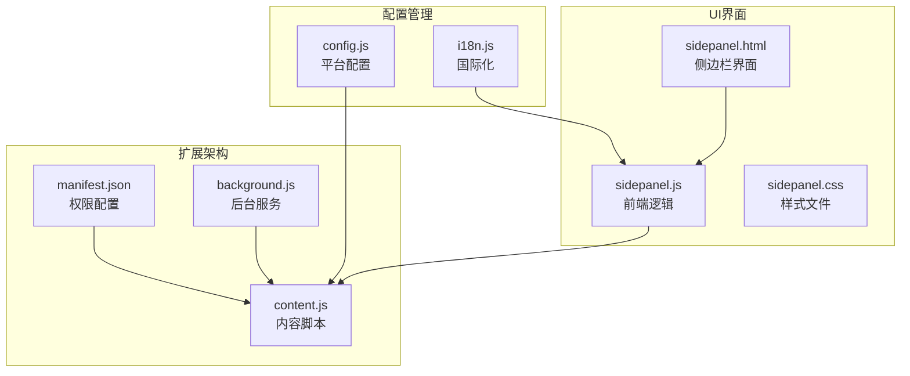
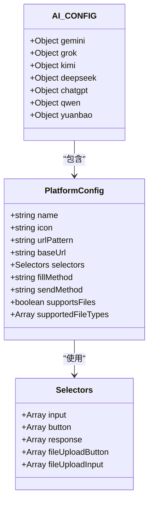
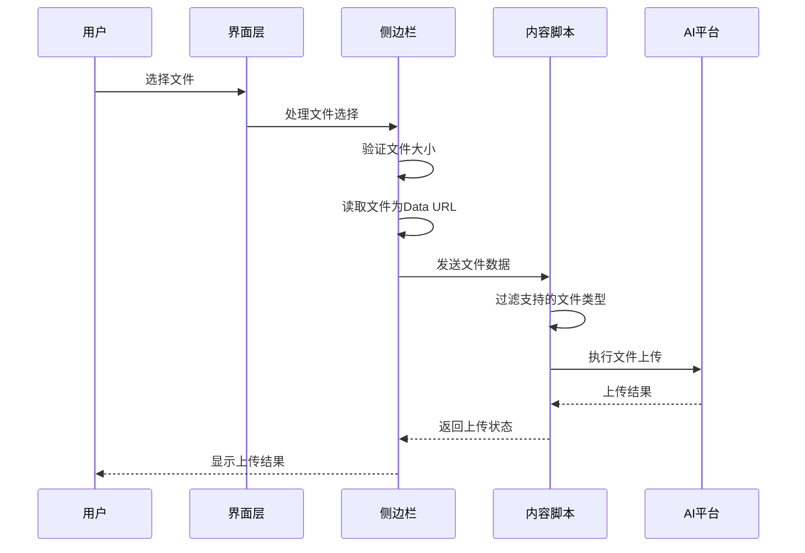
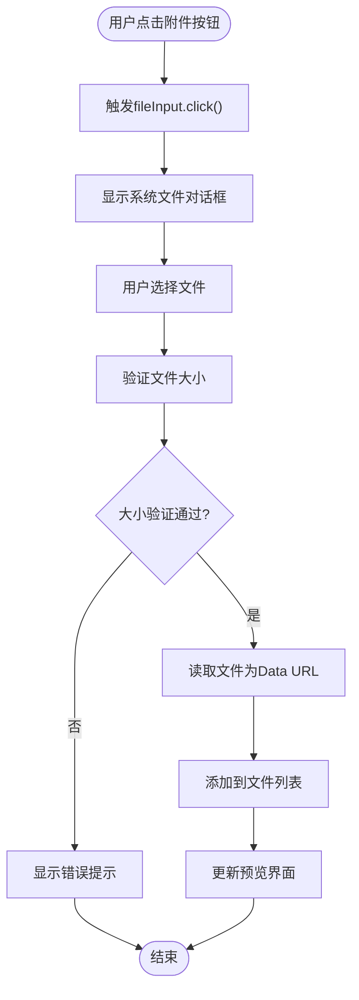
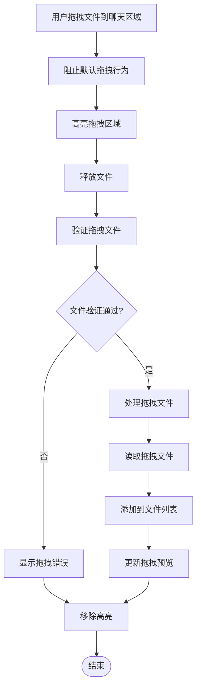
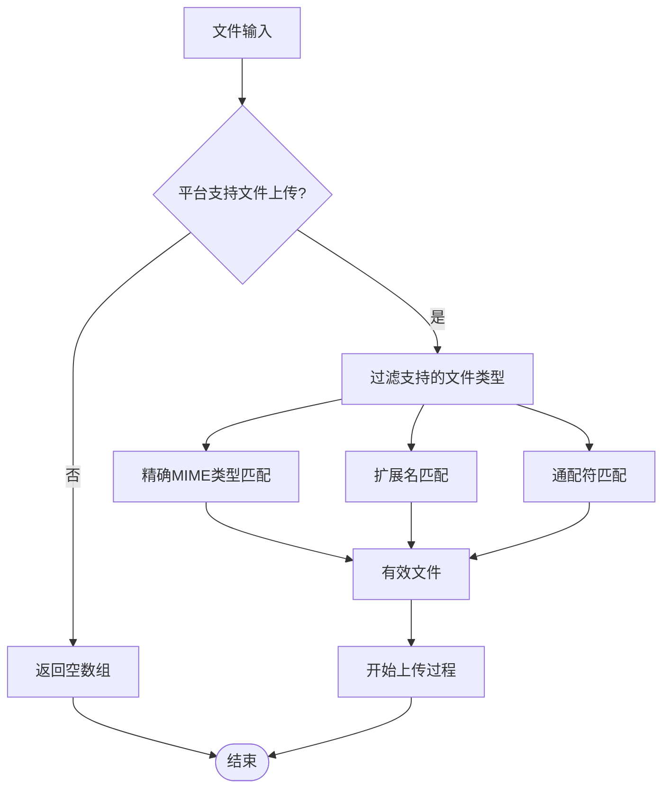
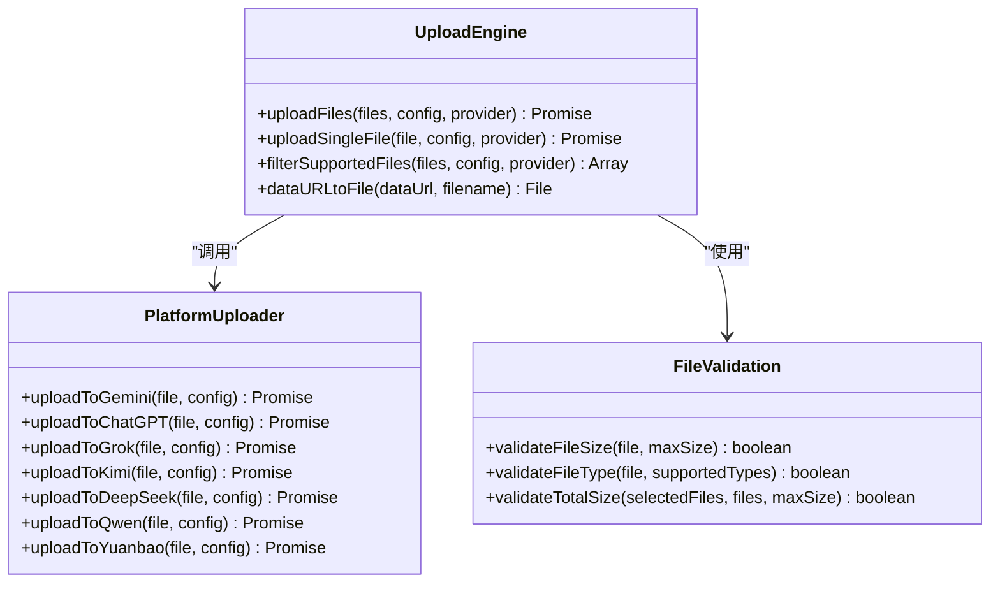
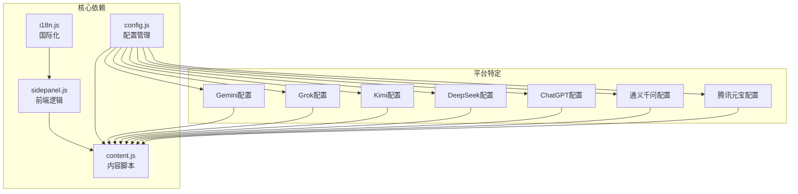

# 文件上传支持配置

<cite>
**本文档引用的文件**
- [manifest.json](file://manifest.json)
- [config.js](file://src/config.js)
- [sidepanel.js](file://src/sidepanel/sidepanel.js)
- [sidepanel.html](file://src/sidepanel/sidepanel.html)
- [sidepanel.css](file://src/sidepanel/sidepanel.css)
- [content.js](file://src/content/content.js)
- [i18n.js](file://src/i18n.js)
- [DRAG_DROP_IMPLEMENTATION.md](file://DRAG_DROP_IMPLEMENTATION.md)
- [MAINTENANCE.md](file://MAINTENANCE.md)
</cite>

## 目录
1. [简介](#简介)
2. [项目结构](#项目结构)
3. [核心组件](#核心组件)
4. [架构概览](#架构概览)
5. [详细组件分析](#详细组件分析)
6. [依赖关系分析](#依赖关系分析)
7. [性能考虑](#性能考虑)
8. [故障排除指南](#故障排除指南)
9. [结论](#结论)

## 简介

本文档提供了AI多重宇宙扩展的文件上传支持配置完整指南。该扩展支持多种AI平台的文件上传功能，包括Gemini、Grok、Kimi、DeepSeek、ChatGPT、通义千问和腾讯元宝。文档详细说明了文件上传功能的配置方法、不同文件类型的配置策略、技术实现流程、类型验证和大小限制配置，以及不同平台的文件上传机制差异。

## 项目结构

AI多重宇宙扩展采用模块化架构设计，文件上传功能分布在多个关键文件中：

**图表来源**
- [manifest.json](file://manifest.json#L12-L32)
- [config.js](file://src/config.js#L5-L199)
- [sidepanel.js](file://src/sidepanel/sidepanel.js#L41-L800)

**节来源**
- [manifest.json](file://manifest.json#L1-L79)
- [config.js](file://src/config.js#L1-L204)

## 核心组件

### 文件上传配置系统

文件上传功能的核心配置位于全局配置文件中，每个AI平台都有独立的配置对象：

**图表来源**
- [config.js](file://src/config.js#L5-L199)

### 文件上传选择器配置

每个平台的文件上传选择器配置如下：

| 平台 | fileUploadButton选择器 | fileUploadInput选择器 |
|------|---------------------|-------------------|
| Gemini | `['button[aria-label*="Upload"]', 'button[aria-label*="上传"]', 'input[type="file"]']` | `['input[type="file"][accept*="image"]']` |
| Grok | `['button[aria-label*="Upload"]', 'button[aria-label*="上传"]', 'button[title*="Upload"]']` | `['input[type="file"][accept*="image"]']` |
| Kimi | `['button[aria-label*="Upload"]', 'button[aria-label*="上传"]', 'button[title*="Upload"]']` | `['input[type="file"]']` |
| DeepSeek | `['button[aria-label*="image"]', 'button[aria-label*="图片"]', 'button[title*="image"]']` | `['input[type="file"][accept*="image"]']` |
| ChatGPT | - | `['input[type="file"]']` |
| 通义千问 | - | `['input[type="file"]']` |
| 腾讯元宝 | - | `['input[type="file"]']` |

**节来源**
- [config.js](file://src/config.js#L11-L198)

## 架构概览

文件上传功能采用分层架构设计，确保跨平台兼容性和可维护性：

**图表来源**
- [sidepanel.js](file://src/sidepanel/sidepanel.js#L2047-L2104)
- [content.js](file://src/content/content.js#L616-L672)

## 详细组件分析

### 文件选择器组件

文件选择器组件提供了两种文件选择方式：传统的点击选择和现代的拖拽上传。

#### 传统文件选择器

**图表来源**
- [sidepanel.js](file://src/sidepanel/sidepanel.js#L2047-L2104)

#### 拖拽上传组件

拖拽上传提供了更直观的用户体验：

**图表来源**
- [sidepanel.js](file://src/sidepanel/sidepanel.js#L414-L495)
- [DRAG_DROP_IMPLEMENTATION.md](file://DRAG_DROP_IMPLEMENTATION.md#L46-L104)

**节来源**
- [sidepanel.js](file://src/sidepanel/sidepanel.js#L414-L495)
- [sidepanel.html](file://src/sidepanel/sidepanel.html#L309-L324)

### 文件类型验证系统

文件类型验证系统支持多种验证方式：

**图表来源**
- [content.js](file://src/content/content.js#L677-L710)

#### 支持的文件类型配置

| 平台 | 支持的文件类型 | 描述 |
|------|-------------|------|
| Gemini | `['image/*', '.pdf', '.txt', '.doc', '.docx']` | 图片、PDF、文档格式 |
| Grok | `['image/*', '.pdf', '.txt']` | 图片、PDF、纯文本 |
| Kimi | `['image/*', '.pdf', '.txt', '.doc', '.docx', '.md', '.json', '.csv']` | 多种文档格式 |
| DeepSeek | `['image/*']` | 仅图片格式 |
| ChatGPT | `['image/*', '.pdf', '.txt', '.md', '.json', '.csv', '.py', '.js']` | 图片、文档、代码文件 |
| 通义千问 | `['.pdf', '.doc', '.docx', '.txt', '.md', '.json', '.csv', 'image/*']` | 文档和图片格式 |
| 腾讯元宝 | `['image/*', '.pdf', '.doc', '.docx', '.txt', '.md']` | 图片、文档格式 |

**节来源**
- [config.js](file://src/config.js#L20-L198)

### 文件上传执行引擎

文件上传执行引擎负责将文件上传到各个AI平台：

**图表来源**
- [content.js](file://src/content/content.js#L616-L941)

**节来源**
- [content.js](file://src/content/content.js#L616-L941)

### 文件大小限制配置

系统实现了双重文件大小限制：

| 限制类型 | 单文件大小限制 | 总文件大小限制 | 配置位置 |
|---------|-------------|-------------|--------|
| 单文件大小 | 10MB | - | `sidepanel.js`第53行 |
| 总文件大小 | - | 50MB | `sidepanel.js`第54行 |

**节来源**
- [sidepanel.js](file://src/sidepanel/sidepanel.js#L53-L54)

## 依赖关系分析

文件上传功能涉及多个模块间的复杂依赖关系：

**图表来源**
- [config.js](file://src/config.js#L5-L199)
- [sidepanel.js](file://src/sidepanel/sidepanel.js#L41-L800)

**节来源**
- [config.js](file://src/config.js#L1-L204)

## 性能考虑

### 文件处理优化

1. **异步文件读取**：使用Promise和async/await确保文件读取不阻塞UI线程
2. **内存管理**：及时清理Data URL对象，避免内存泄漏
3. **批量处理**：支持多文件同时上传，提高效率

### 上传策略优化

1. **重试机制**：实现指数退避重试，提高上传成功率
2. **超时控制**：设置合理的上传超时时间
3. **并发控制**：合理控制同时上传的文件数量

## 故障排除指南

### 常见问题及解决方案

#### 文件上传失败

**问题描述**：文件无法上传到目标平台

**可能原因**：
1. 平台不支持文件上传
2. 文件类型不受支持
3. 网络连接问题
4. 平台选择器失效

**解决步骤**：
1. 检查平台配置中的`supportsFiles`标志
2. 验证文件类型是否在`supportedFileTypes`列表中
3. 确认网络连接正常
4. 更新平台选择器配置

#### 文件大小限制错误

**问题描述**：文件超过大小限制被拒绝

**解决方法**：
1. 检查单文件大小限制（10MB）
2. 检查总文件大小限制（50MB）
3. 压缩文件或分割大文件

#### 拖拽上传不工作

**问题描述**：拖拽文件到聊天区域无响应

**解决步骤**：
1. 确认拖拽区域正确设置
2. 检查CSS样式是否正确应用
3. 验证JavaScript事件监听器是否正常工作

**节来源**
- [DRAG_DROP_IMPLEMENTATION.md](file://DRAG_DROP_IMPLEMENTATION.md#L135-L156)
- [MAINTENANCE.md](file://MAINTENANCE.md#L181-L206)

### 调试技巧

1. **启用详细日志**：查看浏览器控制台输出的详细错误信息
2. **检查元素选择器**：验证平台选择器是否正确匹配DOM元素
3. **测试文件类型**：逐一测试不同文件类型的上传行为
4. **监控网络请求**：使用开发者工具监控文件上传请求

## 结论

AI多重宇宙扩展的文件上传功能提供了完整的跨平台文件上传解决方案。通过模块化的配置系统、灵活的文件类型验证、完善的错误处理机制，以及友好的用户界面，该功能能够满足各种文件上传需求。

主要优势包括：
- **跨平台兼容**：支持7个主流AI平台的文件上传
- **灵活配置**：通过配置文件轻松添加新平台支持
- **类型安全**：严格的文件类型和大小验证
- **用户体验**：支持拖拽上传和传统文件选择两种方式
- **错误处理**：完善的错误处理和用户反馈机制

未来可以进一步优化的方向包括：实现文件上传进度指示器、支持文件夹拖拽、增强文件预览功能等。