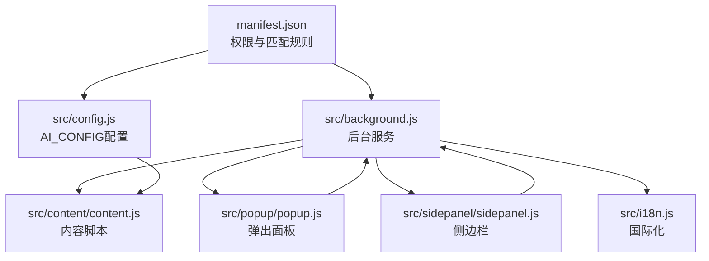
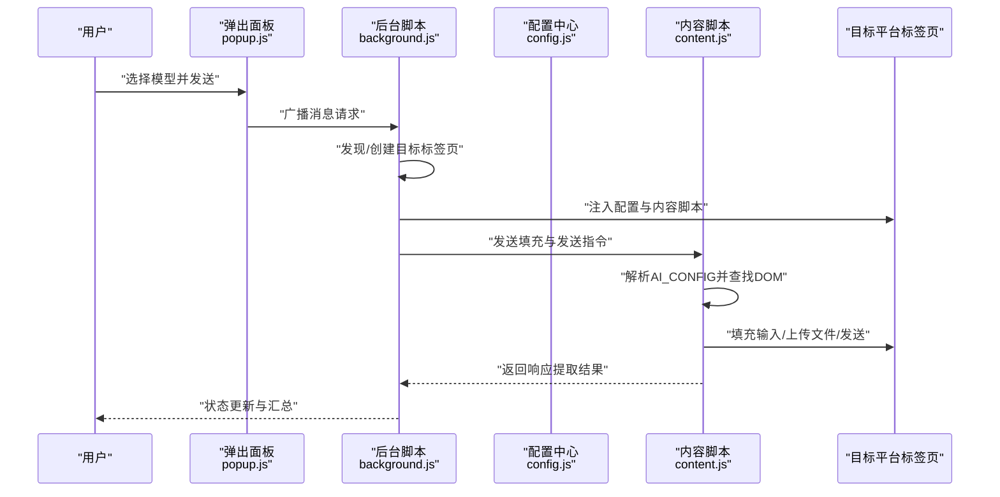
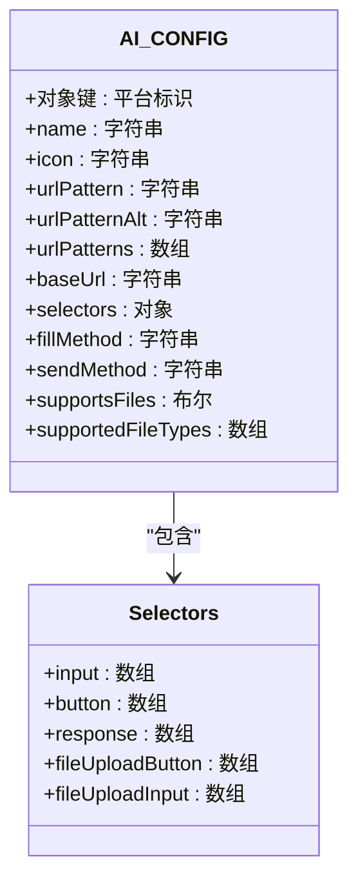
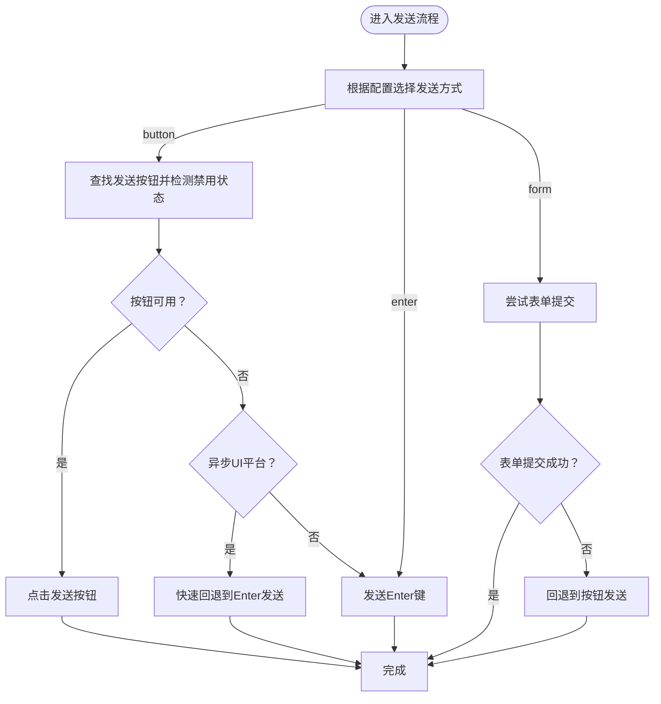
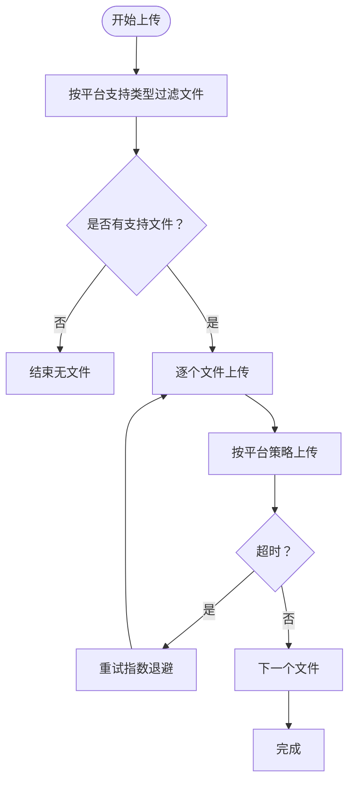
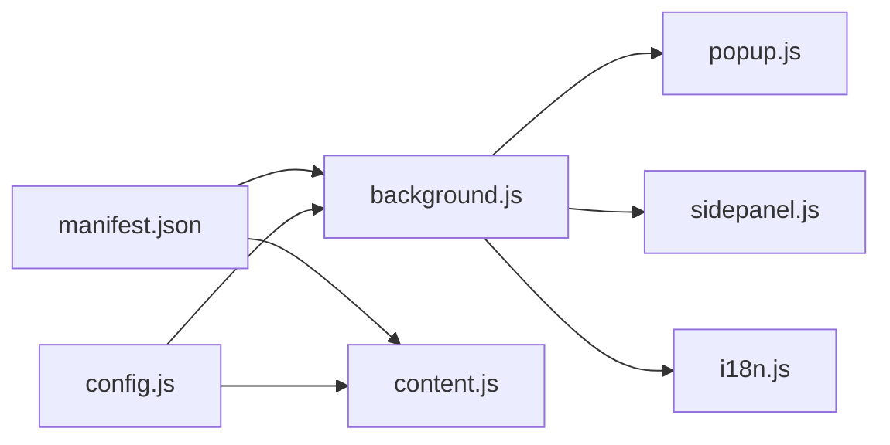

# 新平台集成开发

<cite>
**本文档引用的文件**
- [manifest.json](file://manifest.json)
- [src/config.js](file://src/config.js)
- [src/background.js](file://src/background.js)
- [src/content/content.js](file://src/content/content.js)
- [src/popup/popup.js](file://src/popup/popup.js)
- [src/sidepanel/sidepanel.js](file://src/sidepanel/sidepanel.js)
- [src/i18n.js](file://src/i18n.js)
- [README.md](file://README.md)
- [test_history_buttons.html](file://test_history_buttons.html)
- [debug_handles.js](file://debug_handles.js)
</cite>

## 目录
1. [简介](#简介)
2. [项目结构](#项目结构)
3. [核心组件](#核心组件)
4. [架构总览](#架构总览)
5. [详细组件分析](#详细组件分析)
6. [依赖关系分析](#依赖关系分析)
7. [性能考量](#性能考量)
8. [故障排查指南](#故障排查指南)
9. [结论](#结论)
10. [附录](#附录)

## 简介
本指南面向希望为新AI平台添加支持的开发者，系统讲解AI平台配置系统的架构与实现原理，覆盖AI_CONFIG配置结构、选择器映射规则、发送方法配置、图标添加流程、域名权限配置以及测试验证方法。文档提供从CSS选择器分析到消息发送实现的完整流程，并对比button点击与enter键两种发送方式的技术差异与适用场景，最后给出实际案例与常见问题解决方案。

## 项目结构
该项目是一个Chrome扩展，采用纯前端技术栈，无构建工具依赖，结构清晰、模块职责明确：
- manifest.json：扩展清单，声明权限、主机权限、内容脚本匹配规则与快捷键等
- src/config.js：全局AI平台配置中心，定义各平台的选择器、发送方法、文件上传能力等
- src/background.js：后台服务脚本，负责标签页发现/创建、消息广播、窗口布局、状态通知等
- src/content/content.js：内容脚本，注入到目标AI网页，负责输入填充、发送、响应提取、文件上传等
- src/popup/popup.js：弹出面板交互逻辑，发起广播消息
- src/sidepanel/sidepanel.js：侧边栏界面与交互，包含多模态响应展示、导航、摘要等功能
- src/i18n.js：国际化资源与翻译函数
- README.md：安装与使用说明

图表来源
- [manifest.json](file://manifest.json#L12-L68)
- [src/config.js](file://src/config.js#L5-L199)
- [src/background.js](file://src/background.js#L69-L197)
- [src/content/content.js](file://src/content/content.js#L1-L29)
- [src/popup/popup.js](file://src/popup/popup.js#L1-L61)
- [src/sidepanel/sidepanel.js](file://src/sidepanel/sidepanel.js#L1-L80)
- [src/i18n.js](file://src/i18n.js#L1-L50)

章节来源
- [README.md](file://README.md#L20-L28)
- [manifest.json](file://manifest.json#L12-L68)

## 核心组件
- AI_CONFIG配置中心：集中定义平台名称、图标、URL模式、基础URL、选择器集合、填充方式、发送方式、文件上传能力与支持的文件类型等
- 后台服务：负责根据配置发现/创建目标平台标签页、注入内容脚本、分发消息、窗口布局、状态反馈
- 内容脚本：在目标页面内自动化输入、发送、提取响应、文件上传
- 弹出面板与侧边栏：提供用户交互入口、模型选择、响应查看、摘要生成等

章节来源
- [src/config.js](file://src/config.js#L5-L199)
- [src/background.js](file://src/background.js#L133-L197)
- [src/content/content.js](file://src/content/content.js#L322-L418)
- [src/popup/popup.js](file://src/popup/popup.js#L1-L61)
- [src/sidepanel/sidepanel.js](file://src/sidepanel/sidepanel.js#L41-L80)

## 架构总览
扩展通过清单文件声明内容脚本与主机权限，后台脚本在用户触发时定位/创建目标平台标签页，注入配置与内容脚本，随后内容脚本依据AI_CONFIG进行DOM操作与消息发送。

图表来源
- [src/popup/popup.js](file://src/popup/popup.js#L16-L44)
- [src/background.js](file://src/background.js#L139-L197)
- [src/config.js](file://src/config.js#L5-L199)
- [src/content/content.js](file://src/content/content.js#L200-L216)

## 详细组件分析

### AI_CONFIG配置结构与选择器映射
- 平台键：如gemini、grok、kimi、deepseek、chatgpt、qwen、yuanbao
- 字段说明：
  - name：平台显示名称
  - icon：图标路径
  - urlPattern/urlPatternAlt/urlPatterns：URL匹配规则，用于后台脚本定位/创建标签页
  - baseUrl：平台首页URL，用于新建标签页
  - selectors：选择器集合
    - input：输入框选择器数组
    - button：发送按钮选择器数组
    - response：最新响应容器选择器数组
    - fileUploadButton/fileUploadInput：文件上传入口与文件输入选择器
  - fillMethod：填充方式，main-world或content-script
  - sendMethod：发送方式，button、enter或form
  - supportsFiles/supportedFileTypes：文件上传能力与支持类型

图表来源
- [src/config.js](file://src/config.js#L5-L199)

章节来源
- [src/config.js](file://src/config.js#L5-L199)

### 发送方法配置与技术差异
- button：优先查找可点击的发送按钮，支持禁用状态检测与回退策略
- enter：通过键盘事件触发Enter键发送，适用于按钮不稳定或异步UI场景
- form：尝试表单提交，作为button的备选

图表来源
- [src/content/content.js](file://src/content/content.js#L466-L565)

章节来源
- [src/content/content.js](file://src/content/content.js#L466-L565)

### 文件上传流程与支持类型
- 支持类型过滤：按平台supportedFileTypes进行筛选
- 上传策略：不同平台采用不同上传机制（例如Gemini直接设置fileInput.files，或点击上传按钮后触发change）
- 重试与超时：单文件上传具备重试与超时控制

图表来源
- [src/content/content.js](file://src/content/content.js#L616-L742)

章节来源
- [src/content/content.js](file://src/content/content.js#L616-L742)

### 响应提取与思维块过滤
- 响应提取：按配置的response选择器查找最新响应容器，优先选择包含有效文本或SVG的元素
- 思维块过滤：针对特定平台（如yuanbao）移除深度搜索组件中的“思考”部分，同时提供通用的关键词与属性过滤

章节来源
- [src/content/content.js](file://src/content/content.js#L219-L320)
- [src/content/content.js](file://src/content/content.js#L50-L124)

### 主世界填充与内容脚本填充
- main-world：通过后台脚本在页面主世界执行脚本，利用findEl/reactFill/ceditFill等策略适配不同编辑器（React、contenteditable、Tiptap/ProseMirror等）
- content-script：在内容脚本内直接操作DOM，适合复杂编辑器的“聚焦→全选→删除→粘贴”流程

章节来源
- [src/background.js](file://src/background.js#L379-L526)
- [src/content/content.js](file://src/content/content.js#L434-L463)

### 图标添加流程
- 在src/assets/icons/real或sidepanel/icons目录放置图标文件
- 在AI_CONFIG中为平台配置icon字段（相对路径）
- 在清单文件中确保icons字段指向有效图标路径

章节来源
- [src/config.js](file://src/config.js#L6-L8)
- [manifest.json](file://manifest.json#L6-L11)

### 域名权限配置
- 在清单文件的host_permissions与content_scripts.matches中添加目标平台域名
- URL匹配规则支持通配符与多域名模式

章节来源
- [manifest.json](file://manifest.json#L19-L61)

### 测试验证方法
- 选择器诊断：后台脚本提供diagnose_selectors动作，内容脚本提供诊断工具，输出各选择器命中数量与最长文本长度
- 响应提取：通过fetchAllResponses与extract_latest_response验证响应提取
- 发送验证：通过弹出面板或侧边栏发送消息，观察状态更新与响应卡片
- 文件上传：使用侧边栏拖拽/选择文件，验证大小限制与平台支持类型

章节来源
- [src/background.js](file://src/background.js#L163-L169)
- [src/content/content.js](file://src/content/content.js#L127-L197)
- [src/background.js](file://src/background.js#L170-L177)
- [src/sidepanel/sidepanel.js](file://src/sidepanel/sidepanel.js#L2047-L2081)

## 依赖关系分析
- 清单文件决定内容脚本注入时机与目标域
- 后台脚本依赖配置中心进行平台识别与窗口管理
- 内容脚本依赖配置中心进行DOM操作与发送策略
- 弹出面板与侧边栏通过消息与后台通信

图表来源
- [manifest.json](file://manifest.json#L42-L68)
- [src/config.js](file://src/config.js#L5-L199)
- [src/background.js](file://src/background.js#L69-L197)
- [src/content/content.js](file://src/content/content.js#L1-L29)
- [src/popup/popup.js](file://src/popup/popup.js#L1-L61)
- [src/sidepanel/sidepanel.js](file://src/sidepanel/sidepanel.js#L1-L80)
- [src/i18n.js](file://src/i18n.js#L1-L50)

章节来源
- [manifest.json](file://manifest.json#L42-L68)
- [src/background.js](file://src/background.js#L69-L197)

## 性能考量
- 选择器查找与DOM操作：采用“精确可见→宽松可见”的两阶段查找，减少误匹配
- 发送等待策略：异步UI平台设置更长等待与回退策略，避免频繁点击导致重复发送
- 文件上传：单文件上传具备超时与重试，防止阻塞
- 状态反馈：后台脚本聚合状态并通过runtime消息通知UI，避免UI阻塞

## 故障排查指南
- 选择器失效
  - 使用后台脚本的诊断动作或内容脚本的诊断工具，检查各选择器命中数量与文本长度
  - 逐步缩小选择器范围，优先使用唯一性高的属性或类名
- 发送失败
  - 检查sendMethod配置是否与平台按钮状态兼容
  - 对异步UI平台，考虑使用enter回退或增加等待时间
- 文件上传失败
  - 确认supportedFileTypes与文件类型匹配
  - 检查平台上传入口选择器是否正确
- 状态不更新
  - 检查后台脚本是否成功注入内容脚本
  - 查看runtime消息通道是否正常

章节来源
- [src/background.js](file://src/background.js#L163-L169)
- [src/content/content.js](file://src/content/content.js#L127-L197)
- [src/content/content.js](file://src/content/content.js#L616-L742)
- [src/background.js](file://src/background.js#L657-L678)

## 结论
本指南提供了从配置结构、选择器映射、发送方法到文件上传与测试验证的完整开发流程。通过AI_CONFIG统一管理平台差异，结合后台脚本与内容脚本的协作，能够稳定地为新平台添加支持。建议在集成新平台时优先进行选择器诊断与响应提取验证，再逐步完善发送与文件上传策略。

## 附录

### 实际案例：为新AI平台添加支持的步骤
- 准备工作
  - 在AI_CONFIG中新增平台键，填写name、icon、urlPattern、baseUrl
  - 在selectors中补充input、button、response、fileUpload相关选择器
  - 设定fillMethod与sendMethod，评估是否支持文件上传及支持类型
- 域名与权限
  - 在manifest.json的host_permissions与content_scripts.matches中添加目标域名
- 图标与界面
  - 在合适目录放置图标文件，并在AI_CONFIG中配置icon路径
- 本地验证
  - 使用选择器诊断工具验证各选择器命中情况
  - 通过弹出面板或侧边栏发送消息，观察响应提取与状态反馈
  - 如需文件上传，准备支持类型的文件进行测试
- 常见问题与解决方案
  - 选择器不稳定：增加备用选择器，使用更稳定的属性或类名
  - 按钮状态异常：启用禁用检测与回退策略（button→enter）
  - 文件上传失败：确认平台上传入口与文件类型过滤

章节来源
- [src/config.js](file://src/config.js#L5-L199)
- [manifest.json](file://manifest.json#L19-L61)
- [src/background.js](file://src/background.js#L163-L169)
- [src/content/content.js](file://src/content/content.js#L127-L197)
- [src/sidepanel/sidepanel.js](file://src/sidepanel/sidepanel.js#L2047-L2081)

### 调试辅助工具
- 选择器诊断：后台脚本提供diagnose_selectors动作，内容脚本提供诊断工具
- 调试手柄：用于检查详情窗口调节手柄的状态与层级

章节来源
- [src/background.js](file://src/background.js#L163-L169)
- [src/content/content.js](file://src/content/content.js#L127-L197)
- [debug_handles.js](file://debug_handles.js#L1-L73)