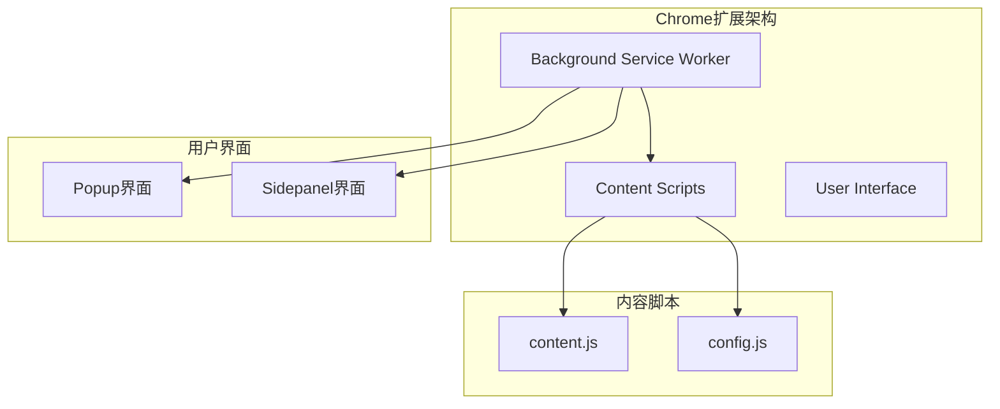
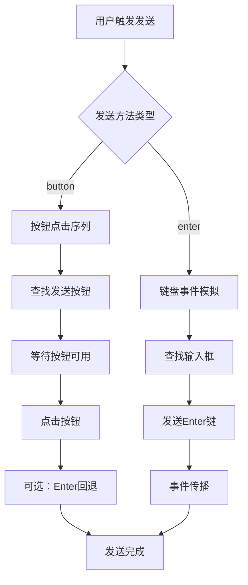
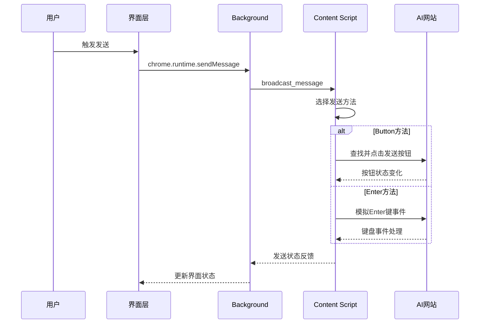
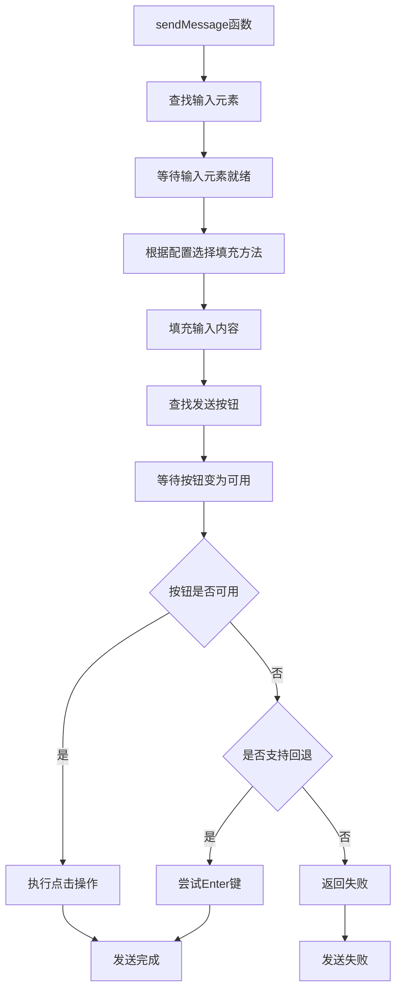
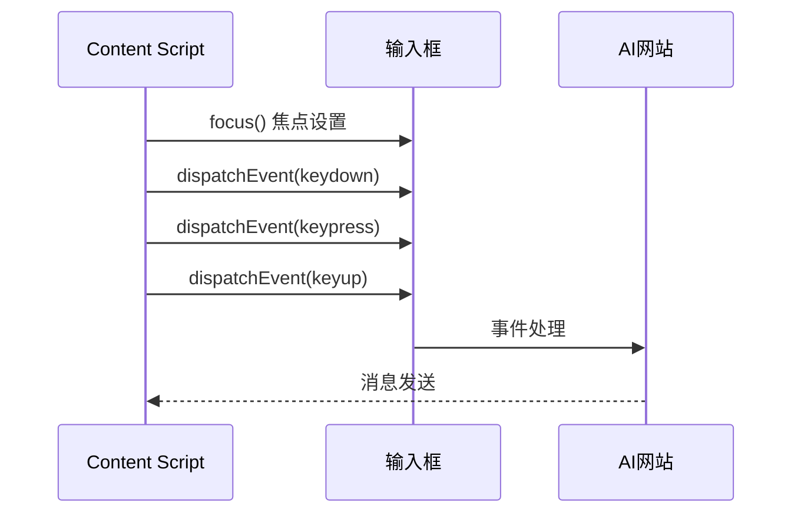
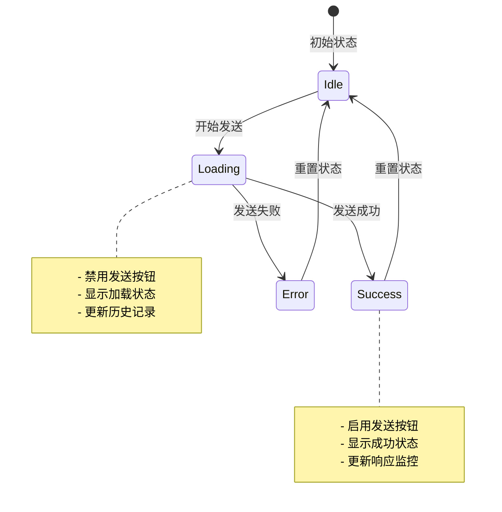
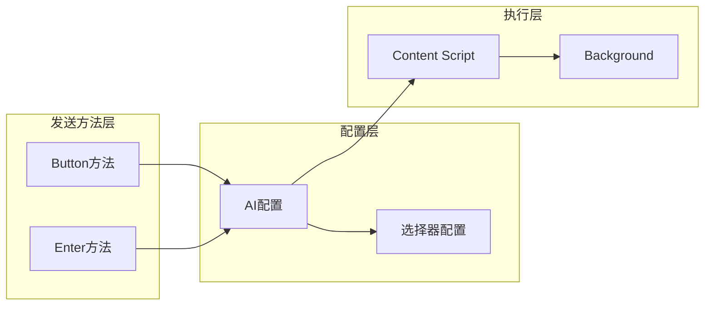

# 消息发送方法实现

<cite>
**本文档引用的文件**
- [src/popup/popup.js](file://src/popup/popup.js)
- [src/sidepanel/sidepanel.js](file://src/sidepanel/sidepanel.js)
- [src/content/content.js](file://src/content/content.js)
- [src/config.js](file://src/config.js)
- [src/background.js](file://src/background.js)
- [manifest.json](file://manifest.json)
</cite>

## 目录
1. [简介](#简介)
2. [项目结构](#项目结构)
3. [核心组件](#核心组件)
4. [架构概览](#架构概览)
5. [详细组件分析](#详细组件分析)
6. [依赖关系分析](#依赖关系分析)
7. [性能考虑](#性能考虑)
8. [故障排除指南](#故障排除指南)
9. [结论](#结论)

## 简介

本文档详细分析了AI多宇宙扩展的消息发送方法实现，重点比较和解释了两种发送方法的技术原理和实现差异：button点击方法和enter键方法。该扩展支持同时向多个AI聊天界面发送消息，包括Gemini、Grok、Kimi、DeepSeek、ChatGPT、Qwen和腾讯元宝等平台。

## 项目结构

该项目采用Chrome扩展的标准架构，主要包含以下核心模块：

**图表来源**
- [src/background.js](file://src/background.js#L1-L800)
- [src/content/content.js](file://src/content/content.js#L1-L200)
- [src/config.js](file://src/config.js#L1-L204)

**章节来源**
- [manifest.json](file://manifest.json#L1-L79)

## 核心组件

### 发送方法配置系统

每个AI平台都有特定的发送方法配置，这些配置决定了消息如何被发送：

| 平台 | 发送方法 | 填充方法 | 特殊处理 |
|------|----------|----------|----------|
| Gemini | button | main-world | 快速按钮检测 |
| Grok | button | main-world | Tiptap编辑器支持 |
| Kimi | button | content-script | 避免重复发送 |
| DeepSeek | enter | main-world | Enter键稳定性 |
| ChatGPT | button | main-world | React输入框支持 |
| Qwen | enter | main-world | Enter键稳定性 |
| 腾讯元宝 | button | main-world | 多种发送按钮 |

**章节来源**
- [src/config.js](file://src/config.js#L1-L204)

### 发送方法实现差异

两种发送方法在技术实现上有显著差异：

**图表来源**
- [src/content/content.js](file://src/content/content.js#L526-L565)
- [src/content/content.js](file://src/content/content.js#L567-L572)

## 架构概览

扩展采用分层架构设计，确保不同发送方法的灵活性和可靠性：

**图表来源**
- [src/sidepanel/sidepanel.js](file://src/sidepanel/sidepanel.js#L1397-L1407)
- [src/background.js](file://src/background.js#L138-L197)
- [src/content/content.js](file://src/content/content.js#L526-L565)

## 详细组件分析

### Button点击方法实现

Button点击方法是最可靠的消息发送方式，特别适用于复杂的React应用和富文本编辑器。

#### 工作机制流程

**图表来源**
- [src/content/content.js](file://src/content/content.js#L526-L565)

#### 关键实现细节

1. **按钮状态检测**：使用循环检测发送按钮的可用状态，支持同步和异步UI的不同等待时间
2. **事件模拟**：精确模拟鼠标点击事件，避免多次发送的问题
3. **回退机制**：对于异步UI，提供Enter键作为回退方案

**章节来源**
- [src/content/content.js](file://src/content/content.js#L497-L524)

### Enter键方法实现

Enter键方法通过模拟键盘事件来触发消息发送，适用于简单的输入框和表单。

#### 实现原理

**图表来源**
- [src/content/content.js](file://src/content/content.js#L567-L572)

#### 关键实现细节

1. **事件链模拟**：完整模拟键盘事件的三个阶段（keydown、keypress、keyup）
2. **平台特殊处理**：针对Kimi等平台进行额外的焦点管理和延迟处理
3. **事件冒泡**：确保事件能够正确传播到目标元素

**章节来源**
- [src/content/content.js](file://src/content/content.js#L552-L565)

### 状态管理与UI更新

两种发送方法都实现了完整的状态管理和UI更新机制：

**图表来源**
- [src/popup/popup.js](file://src/popup/popup.js#L26-L44)
- [src/sidepanel/sidepanel.js](file://src/sidepanel/sidepanel.js#L1343-L1407)

**章节来源**
- [src/popup/popup.js](file://src/popup/popup.js#L16-L44)
- [src/sidepanel/sidepanel.js](file://src/sidepanel/sidepanel.js#L1343-L1407)

## 依赖关系分析

### 组件耦合度分析

**图表来源**
- [src/config.js](file://src/config.js#L1-L204)
- [src/content/content.js](file://src/content/content.js#L526-L565)

### 外部依赖

1. **Chrome扩展API**：使用runtime、tabs、scripting等API进行跨页面通信
2. **DOM操作**：直接操作目标AI网站的DOM元素
3. **事件系统**：模拟用户交互事件

**章节来源**
- [manifest.json](file://manifest.json#L12-L32)

## 性能考虑

### 发送方法性能对比

| 特性 | Button方法 | Enter方法 |
|------|------------|-----------|
| **成功率** | ⭐⭐⭐⭐⭐ | ⭐⭐⭐⭐ |
| **稳定性** | ⭐⭐⭐⭐⭐ | ⭐⭐⭐⭐ |
| **兼容性** | ⭐⭐⭐⭐ | ⭐⭐⭐⭐⭐ |
| **响应速度** | 中等 | 快速 |
| **复杂度** | 高 | 低 |

### 优化策略

1. **智能选择算法**：根据平台特性自动选择最优发送方法
2. **超时控制**：设置合理的等待超时时间，避免无限等待
3. **错误恢复**：提供多种回退机制确保发送成功

## 故障排除指南

### 常见问题及解决方案

#### 问题1：按钮点击无效
**症状**：发送按钮无法点击或点击后无反应
**原因**：按钮状态检查失败或事件模拟问题
**解决方案**：
- 检查按钮选择器配置
- 增加等待时间
- 启用Enter键回退机制

#### 问题2：Enter键发送失败
**症状**：消息无法发送或发送重复
**原因**：键盘事件模拟不完整或平台特殊处理
**解决方案**：
- 完善键盘事件链
- 添加平台特定的焦点管理
- 实施防重复发送机制

#### 问题3：Kimi发送异常
**症状**：Kimi无法接收输入或发送重复
**原因**：Kimi的特殊UI架构
**解决方案**：
- 使用button方法而非Enter键
- 实施严格的防重复机制
- 优化输入框焦点管理

**章节来源**
- [BUGFIX_PERSISTENCE_AND_KIMI_v1.7.8.md](file://BUGFIX_PERSISTENCE_AND_KIMI_v1.7.8.md#L51-L151)

## 结论

该消息发送方法实现展现了现代Web自动化技术的成熟应用。通过精心设计的两种发送方法和智能的回退机制，系统能够在各种复杂的AI聊天平台上实现稳定可靠的消息发送。

### 最佳实践建议

1. **优先选择Button方法**：对于复杂的React应用和富文本编辑器，Button方法更加可靠
2. **平台特定优化**：根据不同平台的特性选择最适合的发送策略
3. **错误处理机制**：始终提供回退方案，确保发送成功率
4. **性能监控**：实时监控发送状态，及时发现和解决问题

### 未来发展方向

1. **AI驱动的选择算法**：基于历史成功率自动选择最优发送方法
2. **更精细的状态监控**：实时跟踪发送进度和状态变化
3. **跨平台一致性**：统一不同平台的用户体验