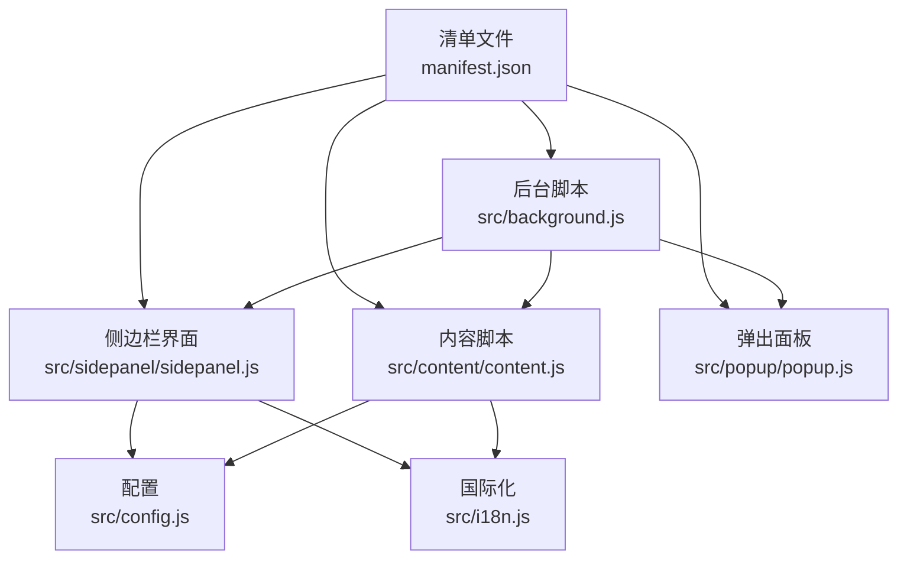
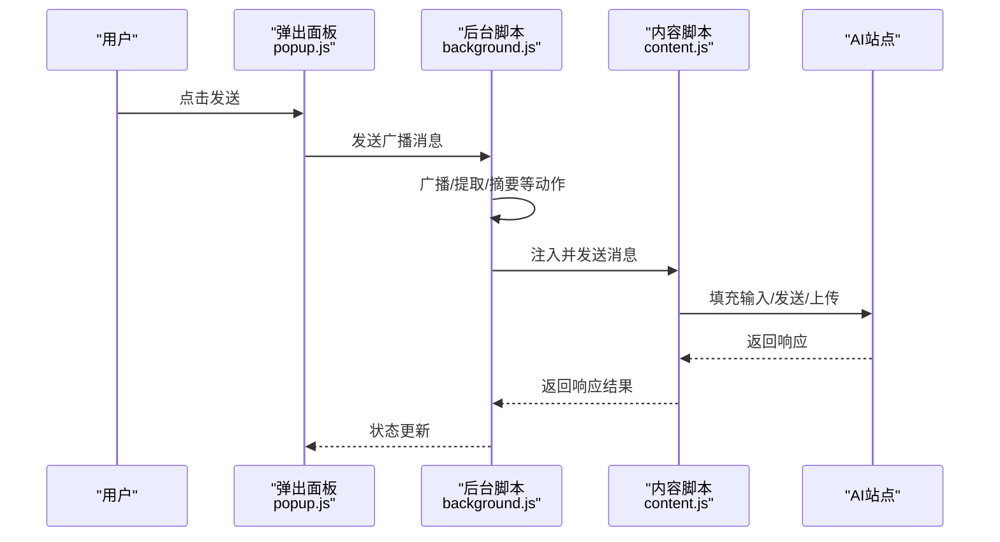
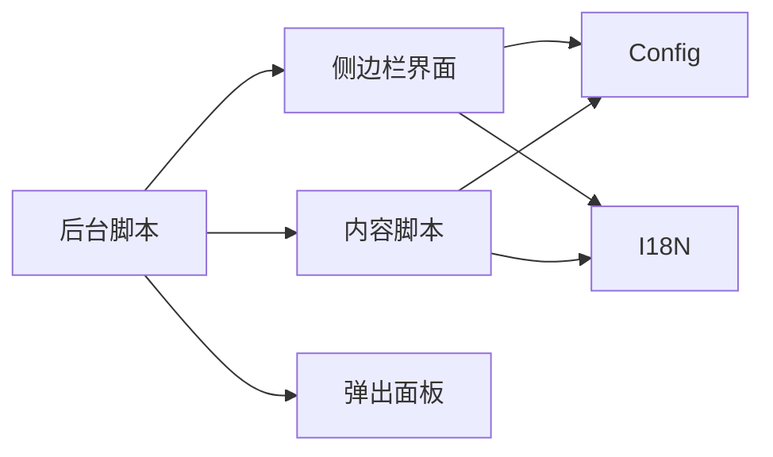

# 调试与测试

<cite>
**本文档引用的文件**   
- [manifest.json](file://manifest.json)
- [src/background.js](file://src/background.js)
- [src/content/content.js](file://src/content/content.js)
- [src/sidepanel/sidepanel.js](file://src/sidepanel/sidepanel.js)
- [src/popup/popup.js](file://src/popup/popup.js)
- [src/config.js](file://src/config.js)
- [src/i18n.js](file://src/i18n.js)
- [debug_handles.js](file://debug_handles.js)
- [QUICK_TEST_GUIDE.md](file://QUICK_TEST_GUIDE.md)
- [TESTING_v1.7.md](file://TESTING_v1.7.md)
- [User_UAT_Checklist.md](file://User_UAT_Checklist.md)
- [test_markdown_resize.html](file://test_markdown_resize.html)
- [test_hover_buttons.html](file://test_hover_buttons.html)
- [test_history_buttons.html](file://test_history_buttons.html)
</cite>

## 目录
1. [简介](#简介)
2. [项目结构](#项目结构)
3. [核心组件](#核心组件)
4. [架构总览](#架构总览)
5. [详细组件分析](#详细组件分析)
6. [依赖分析](#依赖分析)
7. [性能考虑](#性能考虑)
8. [故障排查指南](#故障排查指南)
9. [结论](#结论)
10. [附录](#附录)

## 简介
本指南面向Chrome扩展开发者与测试工程师，系统讲解调试与测试策略，覆盖后台页面、内容脚本与侧边栏界面的调试方法；提供单元与集成测试设计思路、模拟对象与测试数据准备方案；介绍自动化测试工具选型、持续集成配置与测试报告生成；并给出性能测试、内存泄漏检测与用户体验测试流程，以及常见问题诊断与调试工具推荐。

## 项目结构
该项目为多页面、多脚本的Chrome扩展，主要由以下模块构成：
- 清单文件：声明权限、后台服务、内容脚本注入与命令
- 后台脚本：扩展生命周期、消息分发、窗口管理、跨标签通信
- 内容脚本：注入到目标AI站点，负责填充输入、发送消息、提取响应
- 侧边栏界面：主UI，负责Markdown渲染、响应展示、摘要设置与导航
- 弹出面板：轻量入口，发起广播与状态展示
- 配置与国际化：统一的AI站点配置、选择器映射与多语言文案

图表来源
- [manifest.json](file://manifest.json#L1-L79)
- [src/background.js](file://src/background.js#L1-L120)
- [src/content/content.js](file://src/content/content.js#L1-L60)
- [src/sidepanel/sidepanel.js](file://src/sidepanel/sidepanel.js#L1-L60)
- [src/popup/popup.js](file://src/popup/popup.js#L1-L30)
- [src/config.js](file://src/config.js#L1-L40)
- [src/i18n.js](file://src/i18n.js#L1-L40)

章节来源
- [manifest.json](file://manifest.json#L1-L79)
- [src/background.js](file://src/background.js#L1-L120)
- [src/content/content.js](file://src/content/content.js#L1-L60)
- [src/sidepanel/sidepanel.js](file://src/sidepanel/sidepanel.js#L1-L60)
- [src/popup/popup.js](file://src/popup/popup.js#L1-L30)
- [src/config.js](file://src/config.js#L1-L40)
- [src/i18n.js](file://src/i18n.js#L1-L40)

## 核心组件
- 后台服务（Service Worker）
  - 负责扩展开关、窗口管理、消息路由、脚本注入、跨标签通信与状态通知
  - 关键职责：广播消息、提取响应、摘要处理、窗口平铺、诊断选择器
- 内容脚本
  - 注入目标站点，负责输入定位、填充、发送、文件上传、响应提取与选择器诊断
- 侧边栏界面
  - Markdown渲染、响应展示、摘要设置、导航控制器、拖拽调节、国际化与主题切换
- 弹出面板
  - 选择模型、发起广播、展示状态
- 配置与国际化
  - AI站点配置（选择器、发送方式、文件支持）、多语言文案与本地化

章节来源
- [src/background.js](file://src/background.js#L138-L197)
- [src/content/content.js](file://src/content/content.js#L199-L216)
- [src/sidepanel/sidepanel.js](file://src/sidepanel/sidepanel.js#L5-L39)
- [src/popup/popup.js](file://src/popup/popup.js#L1-L61)
- [src/config.js](file://src/config.js#L5-L199)
- [src/i18n.js](file://src/i18n.js#L6-L346)

## 架构总览
扩展采用“后台服务 + 内容脚本 + 侧边栏界面”的典型架构。后台作为消息中枢，协调与目标站点的交互；内容脚本在目标页面执行DOM操作；侧边栏负责用户交互与展示。

图表来源
- [src/popup/popup.js](file://src/popup/popup.js#L16-L45)
- [src/background.js](file://src/background.js#L138-L197)
- [src/content/content.js](file://src/content/content.js#L199-L216)

章节来源
- [src/popup/popup.js](file://src/popup/popup.js#L1-L61)
- [src/background.js](file://src/background.js#L138-L197)
- [src/content/content.js](file://src/content/content.js#L199-L216)

## 详细组件分析

### 后台服务调试要点
- 调试入口
  - 打开扩展管理页，启用“允许访问文件URL”和“开发者模式”
  - 在“后台页面”中查看日志与断点
- 关键调试场景
  - 广播消息：确认消息路由与目标标签页匹配
  - 脚本注入：确保内容脚本注入成功，必要时重试
  - 窗口管理：检查窗口创建、定位与状态更新
  - 摘要流程：验证摘要标签页查找/创建、注入与消息发送
- 常用断点
  - 消息监听入口、窗口查询与创建、内容脚本注入、摘要处理
- 日志与诊断
  - 使用后台日志输出关键路径参数与截断文本，便于定位

章节来源
- [src/background.js](file://src/background.js#L138-L197)
- [src/background.js](file://src/background.js#L298-L376)
- [src/background.js](file://src/background.js#L656-L678)

### 内容脚本调试要点
- 调试入口
  - 在目标站点页面按F12打开开发者工具
  - 在Elements中确认注入脚本已执行，检查选择器是否命中
- 关键调试场景
  - 输入定位：确认选择器数组顺序与可见性
  - 填充与发送：区分主世界填充与内容脚本填充，关注事件派发
  - 响应提取：确认最新响应选择器与思维内容过滤
  - 文件上传：验证文件类型过滤、上传按钮与输入框交互
- 常用断点
  - 输入定位循环、填充函数、发送序列、响应提取与清理
- 诊断工具
  - 使用“诊断选择器”功能输出各选择器命中情况与最佳选择器

章节来源
- [src/content/content.js](file://src/content/content.js#L126-L197)
- [src/content/content.js](file://src/content/content.js#L218-L320)
- [src/content/content.js](file://src/content/content.js#L322-L418)
- [src/content/content.js](file://src/content/content.js#L465-L565)
- [src/content/content.js](file://src/content/content.js#L593-L742)

### 侧边栏界面调试要点
- 调试入口
  - 打开侧边栏，按F12，切换到“Elements”与“Console”
- 关键调试场景
  - Markdown渲染：确认marked与highlight初始化与sanitization
  - 响应展示：确认响应网格布局、复制按钮与代码块处理
  - 导航控制器：确认多响应导航、位置指示与状态保存
  - 拖拽调节：使用调试脚本检查手柄数量、层级与遮挡
- 常用断点
  - Markdown配置、渲染函数、导航控制器、细节模态与拖拽初始化
- 诊断工具
  - 使用调试脚本检查模态、手柄属性与CSS加载

章节来源
- [src/sidepanel/sidepanel.js](file://src/sidepanel/sidepanel.js#L5-L39)
- [src/sidepanel/sidepanel.js](file://src/sidepanel/sidepanel.js#L64-L124)
- [src/sidepanel/sidepanel.js](file://src/sidepanel/sidepanel.js#L712-L800)
- [debug_handles.js](file://debug_handles.js#L1-L73)

### 弹出面板调试要点
- 调试入口
  - 打开扩展弹出面板，按F12
- 关键调试场景
  - 选择模型：确认本地存储与UI同步
  - 发送广播：确认消息发送与状态回调
  - 状态展示：确认后台消息监听与滚动更新
- 常用断点
  - 发送按钮事件、消息发送、状态监听

章节来源
- [src/popup/popup.js](file://src/popup/popup.js#L1-L61)

### 配置与国际化调试要点
- 配置调试
  - 确认AI站点配置与选择器映射，检查发送方式与文件支持
- 国际化调试
  - 切换语言，确认文案替换与相对时间格式化

章节来源
- [src/config.js](file://src/config.js#L5-L199)
- [src/i18n.js](file://src/i18n.js#L354-L414)

## 依赖分析
- 组件耦合
  - 后台与内容脚本通过消息通道耦合，依赖配置与国际化模块
  - 侧边栏依赖配置与国际化，同时依赖后台提供的状态与摘要能力
- 外部依赖
  - 标记渲染与语法高亮库、DOM净化库
- 潜在风险
  - 选择器失效、脚本注入失败、跨域与权限不足

图表来源
- [src/background.js](file://src/background.js#L138-L197)
- [src/content/content.js](file://src/content/content.js#L199-L216)
- [src/sidepanel/sidepanel.js](file://src/sidepanel/sidepanel.js#L41-L60)
- [src/config.js](file://src/config.js#L5-L40)
- [src/i18n.js](file://src/i18n.js#L354-L383)

章节来源
- [src/background.js](file://src/background.js#L138-L197)
- [src/content/content.js](file://src/content/content.js#L199-L216)
- [src/sidepanel/sidepanel.js](file://src/sidepanel/sidepanel.js#L41-L60)
- [src/config.js](file://src/config.js#L5-L40)
- [src/i18n.js](file://src/i18n.js#L354-L383)

## 性能考虑
- 渲染与计算
  - Markdown渲染与语法高亮应在DOM准备好后再执行，避免重复初始化
  - 代码块复制按钮按需创建，减少DOM节点
- 网络与IO
  - 文件上传采用超时与重试策略，避免阻塞主线程
  - 响应提取尽量使用最近元素，减少遍历范围
- UI交互
  - 拖拽调节采用节流/去抖，避免频繁重排
  - 多响应导航使用索引缓存，减少DOM查询

章节来源
- [src/sidepanel/sidepanel.js](file://src/sidepanel/sidepanel.js#L5-L39)
- [src/sidepanel/sidepanel.js](file://src/sidepanel/sidepanel.js#L140-L187)
- [src/content/content.js](file://src/content/content.js#L593-L742)
- [src/content/content.js](file://src/content/content.js#L465-L565)

## 故障排查指南

### 调试工具与脚本
- 控制台调试脚本
  - 使用调试脚本检查模态、手柄数量与层级，定位不可见或被遮挡问题
- 快速测试页面
  - 使用测试页面验证Markdown渲染、拖拽手柄与悬停效果
- 用户验收测试清单
  - 覆盖文件上传、多平台发送、错误处理、国际化与性能

章节来源
- [debug_handles.js](file://debug_handles.js#L1-L73)
- [QUICK_TEST_GUIDE.md](file://QUICK_TEST_GUIDE.md#L20-L46)
- [User_UAT_Checklist.md](file://User_UAT_Checklist.md#L105-L136)

### 常见问题与修复
- 手柄不可见
  - 检查模态是否激活、手柄数量、z-index与CSS加载
- 手柄可点击但无法拖拽
  - 检查鼠标指针、遮挡元素与宽度限制
- Markdown未渲染
  - 检查库加载与配置时机、控制台错误
- 选择器诊断
  - 使用后台诊断功能输出各选择器命中情况与最佳选择器

章节来源
- [QUICK_TEST_GUIDE.md](file://QUICK_TEST_GUIDE.md#L80-L99)
- [src/background.js](file://src/background.js#L270-L296)
- [src/content/content.js](file://src/content/content.js#L126-L197)

### 单元与集成测试策略
- 单元测试
  - 选择器诊断函数、响应提取函数、思维内容过滤函数、文件类型过滤函数
  - 使用Mock DOM与Fake Storage模拟环境，断言返回值与异常
- 集成测试
  - 模拟广播消息、脚本注入、窗口管理与摘要流程
  - 使用测试页面驱动UI交互，验证Markdown渲染与拖拽手柄
- 测试数据准备
  - 构造多站点选择器样本、多模型响应文本、文件上传数据
- 测试用例设计
  - 正常路径、边界条件（超长提示词、空提示词、特殊字符）、异常路径（网络超时、注入失败）

章节来源
- [src/content/content.js](file://src/content/content.js#L126-L197)
- [src/content/content.js](file://src/content/content.js#L218-L320)
- [src/content/content.js](file://src/content/content.js#L593-L742)
- [QUICK_TEST_GUIDE.md](file://QUICK_TEST_GUIDE.md#L20-L46)
- [TESTING_v1.7.md](file://TESTING_v1.7.md#L71-L161)

### 自动化测试与CI
- 测试框架选型
  - 前端：Playwright或Cypress（支持多标签页与扩展安装）
  - 后端：Jest（用于纯函数与工具函数）
- CI配置
  - 在CI中安装Chrome扩展、加载测试页面、运行测试套件并生成报告
- 报告生成
  - 使用JUnit或Allure报告，结合覆盖率工具

[本节为通用实践建议，无需特定文件引用]

### 性能测试与内存泄漏检测
- 性能测试
  - 大文件上传耗时、响应提取耗时、Markdown渲染耗时
- 内存泄漏检测
  - 使用Chrome任务管理器观察扩展进程内存变化，重点检查事件监听器与定时器清理
- 用户体验测试
  - 拖拽手柄流畅度、按钮悬停反馈、复制按钮响应速度

章节来源
- [User_UAT_Checklist.md](file://User_UAT_Checklist.md#L256-L274)
- [QUICK_TEST_GUIDE.md](file://QUICK_TEST_GUIDE.md#L100-L139)

## 结论
本指南提供了从调试到测试的完整方法论：后台服务、内容脚本与侧边栏界面的调试要点，单元与集成测试设计，自动化测试与CI配置，以及性能与用户体验保障。建议在开发周期中持续进行快速自测与UAT，配合调试脚本与测试页面，确保扩展稳定性与一致性。

## 附录

### 快速测试页面清单
- Markdown渲染与拖拽手柄测试
- 悬停显示按钮UI测试
- 历史操作按钮UI测试

章节来源
- [test_markdown_resize.html](file://test_markdown_resize.html#L1-L204)
- [test_hover_buttons.html](file://test_hover_buttons.html#L1-L224)
- [test_history_buttons.html](file://test_history_buttons.html#L1-L204)