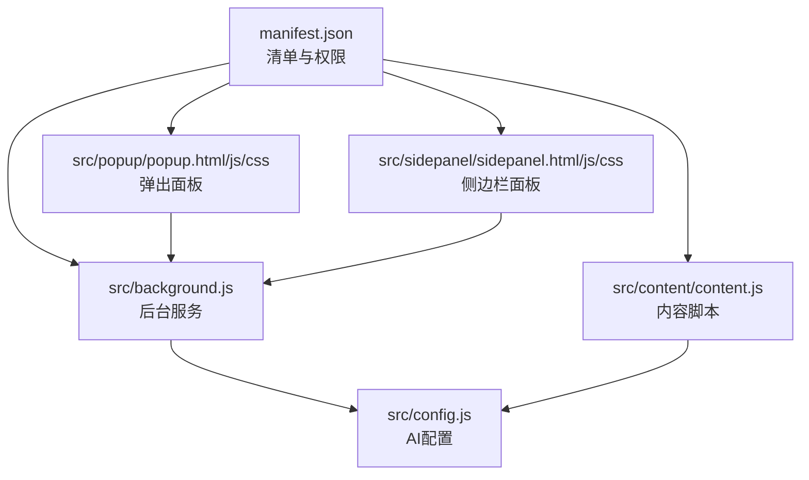
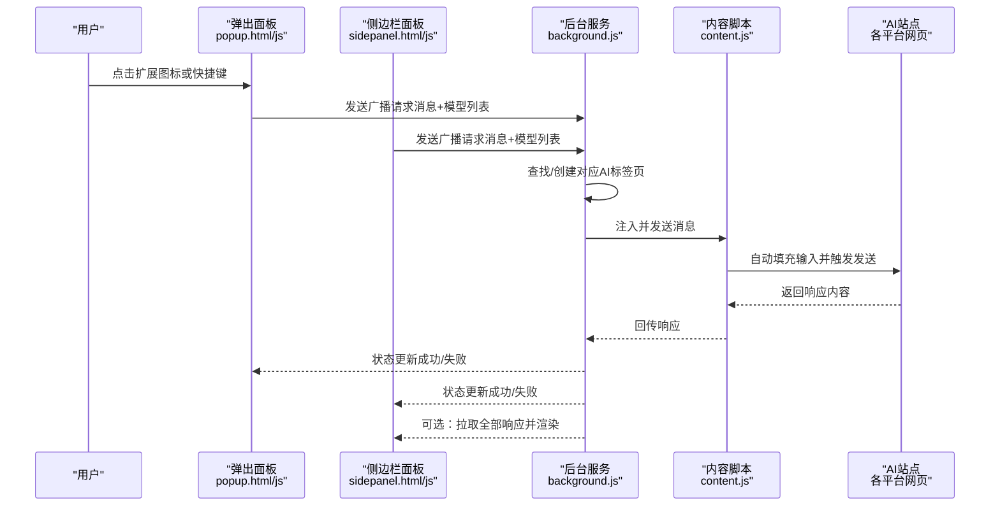
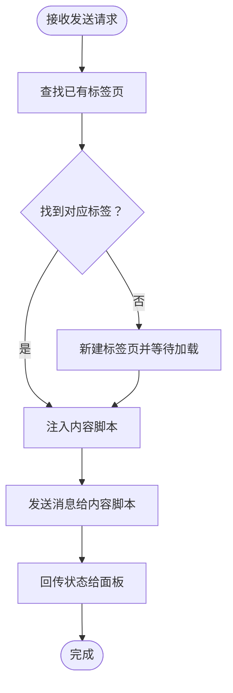
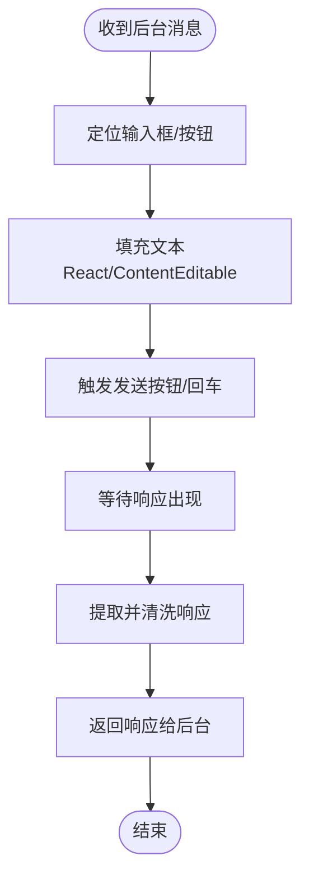
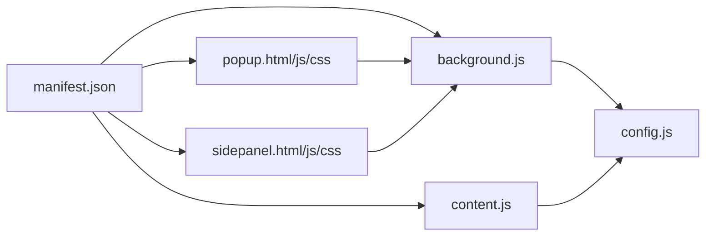

# 快速开始

<cite>
**本文引用的文件**
- [manifest.json](file://manifest.json)
- [README.md](file://README.md)
- [src/background.js](file://src/background.js)
- [src/config.js](file://src/config.js)
- [src/content/content.js](file://src/content/content.js)
- [src/popup/popup.html](file://src/popup/popup.html)
- [src/popup/popup.js](file://src/popup/popup.js)
- [src/popup/popup.css](file://src/popup/popup.css)
- [src/sidepanel/sidepanel.html](file://src/sidepanel/sidepanel.html)
- [src/sidepanel/sidepanel.js](file://src/sidepanel/sidepanel.js)
- [src/sidepanel/sidepanel.css](file://src/sidepanel/sidepanel.css)
</cite>

## 目录
1. [简介](#简介)
2. [项目结构](#项目结构)
3. [核心组件](#核心组件)
4. [架构总览](#架构总览)
5. [详细组件分析](#详细组件分析)
6. [依赖关系分析](#依赖关系分析)
7. [性能与可用性建议](#性能与可用性建议)
8. [常见问题与故障排除](#常见问题与故障排除)
9. [结论](#结论)

## 简介
本指南面向首次使用“AI多重宇宙对话”Chrome扩展的用户，提供从安装到使用的完整流程说明，以及常见问题排查与优化建议。该扩展可同时向多个AI聊天平台（如Gemini、Grok、Kimi、DeepSeek、ChatGPT、通义千问、腾讯元宝）广播消息，支持主题切换、多语言、拖拽文件、响应聚合与摘要生成等功能。

## 项目结构
该扩展采用Chrome Extension Manifest V3，核心由后台服务、弹出面板、侧边栏面板、内容脚本与全局配置组成。关键文件职责如下：
- manifest.json：扩展清单，声明权限、入口、快捷键、内容脚本注入规则等
- src/background.js：后台服务，负责窗口管理、消息分发、脚本注入、跨标签通信
- src/config.js：统一的AI平台配置（名称、图标、URL匹配、选择器、发送方式等）
- src/content/content.js：内容脚本，注入到各AI站点，负责自动填入消息、触发发送、提取响应
- src/popup/*：弹出面板UI与交互逻辑（轻量对话）
- src/sidepanel/*：侧边栏面板UI与交互逻辑（持久对话、响应聚合、摘要）

图表来源
- [manifest.json](file://manifest.json#L1-L79)
- [src/background.js](file://src/background.js#L1-L120)
- [src/config.js](file://src/config.js#L1-L204)
- [src/content/content.js](file://src/content/content.js#L1-L200)
- [src/popup/popup.html](file://src/popup/popup.html#L1-L50)
- [src/popup/popup.js](file://src/popup/popup.js#L1-L61)
- [src/popup/popup.css](file://src/popup/popup.css#L1-L134)
- [src/sidepanel/sidepanel.html](file://src/sidepanel/sidepanel.html#L1-L200)
- [src/sidepanel/sidepanel.js](file://src/sidepanel/sidepanel.js#L1-L120)
- [src/sidepanel/sidepanel.css](file://src/sidepanel/sidepanel.css#L1-L200)

章节来源
- [manifest.json](file://manifest.json#L1-L79)
- [README.md](file://README.md#L20-L29)

## 核心组件
- 后台服务（background）：监听扩展图标点击与快捷键，管理弹窗、窗口布局、脚本注入、消息广播与汇总
- 配置中心（config）：集中定义各AI平台的域名匹配、基础URL、输入/按钮/响应选择器、文件上传支持等
- 内容脚本（content）：在目标AI网页内执行自动化操作，如填充输入框、点击发送、提取响应、诊断选择器
- 弹出面板（popup）：轻量输入与发送，支持保存上次勾选的模型
- 侧边栏面板（sidepanel）：持久化对话、历史记录、响应网格、摘要设置、多模态交互

章节来源
- [src/background.js](file://src/background.js#L1-L120)
- [src/config.js](file://src/config.js#L1-L204)
- [src/content/content.js](file://src/content/content.js#L1-L200)
- [src/popup/popup.html](file://src/popup/popup.html#L1-L50)
- [src/popup/popup.js](file://src/popup/popup.js#L1-L61)
- [src/sidepanel/sidepanel.html](file://src/sidepanel/sidepanel.html#L1-L200)
- [src/sidepanel/sidepanel.js](file://src/sidepanel/sidepanel.js#L1-L120)

## 架构总览
扩展通过后台服务作为中枢，连接弹出面板与侧边栏面板，向目标AI站点注入内容脚本，实现跨平台消息广播与响应聚合。

图表来源
- [src/background.js](file://src/background.js#L138-L197)
- [src/content/content.js](file://src/content/content.js#L199-L200)
- [src/popup/popup.js](file://src/popup/popup.js#L16-L45)
- [src/sidepanel/sidepanel.js](file://src/sidepanel/sidepanel.js#L1-L120)

## 详细组件分析

### 安装与启用（开发者模式与加载）
- 打开Chrome扩展页面：在地址栏输入 chrome://extensions 并回车
- 启用开发者模式：右上角切换“开发者模式”
- 加载扩展：点击“加载已解压的扩展程序”，选择扩展根目录（包含manifest.json）
- 固定扩展：在浏览器工具栏找到扩展图标，点击“固定”

章节来源
- [README.md](file://README.md#L30-L47)
- [README.md](file://README.md#L81-L98)

### 基本使用流程（从点击图标到多平台发送）
- 方式一：点击扩展图标打开弹出面板
  - 在弹出面板勾选要发送的AI模型
  - 输入消息，点击“Send to All”
  - 查看状态日志反馈
- 方式二：打开侧边栏面板
  - 点击“Chat”标签页，选择AI模型
  - 输入消息，点击发送
  - 切换到“Responses”标签页查看聚合结果
- 注意：必须先登录相应AI服务，否则无法发送

章节来源
- [README.md](file://README.md#L48-L55)
- [README.md](file://README.md#L99-L106)
- [src/popup/popup.html](file://src/popup/popup.html#L16-L43)
- [src/popup/popup.js](file://src/popup/popup.js#L16-L45)
- [src/sidepanel/sidepanel.html](file://src/sidepanel/sidepanel.html#L88-L139)
- [src/sidepanel/sidepanel.js](file://src/sidepanel/sidepanel.js#L1-L120)

### 后台服务与消息分发
- 图标点击与快捷键：监听扩展图标点击与快捷键，控制侧边栏弹窗显示/隐藏
- 广播发送：根据选中的模型列表，查找或新建对应AI标签页，注入内容脚本并发送消息
- 状态反馈：通过runtime消息回传状态（成功/失败），弹出面板与侧边栏实时更新

图表来源
- [src/background.js](file://src/background.js#L138-L197)
- [src/background.js](file://src/background.js#L718-L790)

章节来源
- [src/background.js](file://src/background.js#L10-L67)
- [src/background.js](file://src/background.js#L138-L197)
- [src/background.js](file://src/background.js#L718-L790)

### 内容脚本与平台适配
- 自动填充与发送：根据AI平台选择器定位输入框与发送按钮，执行填充与点击/回车
- 响应提取：移除推理/思考片段，保留最终答案；支持从HTML或纯文本提取
- 诊断工具：检测各平台响应选择器的有效性，辅助调试

图表来源
- [src/content/content.js](file://src/content/content.js#L199-L200)
- [src/content/content.js](file://src/content/content.js#L127-L197)

章节来源
- [src/content/content.js](file://src/content/content.js#L1-L200)
- [src/config.js](file://src/config.js#L1-L204)

### 配置中心（AI平台统一配置）
- 平台字段：名称、图标、URL匹配模式、基础URL、输入/按钮/响应选择器、文件上传支持、发送方式等
- 作用：内容脚本与后台服务共享配置，保证跨平台一致性

章节来源
- [src/config.js](file://src/config.js#L1-L204)

### 弹出面板与侧边栏面板
- 弹出面板：轻量输入、模型勾选、发送、状态日志
- 侧边栏面板：历史记录、响应网格、复制、摘要设置、主题/语言切换、拖拽文件、模态导航

章节来源
- [src/popup/popup.html](file://src/popup/popup.html#L1-L50)
- [src/popup/popup.js](file://src/popup/popup.js#L1-L61)
- [src/popup/popup.css](file://src/popup/popup.css#L1-L134)
- [src/sidepanel/sidepanel.html](file://src/sidepanel/sidepanel.html#L1-L200)
- [src/sidepanel/sidepanel.js](file://src/sidepanel/sidepanel.js#L1-L120)
- [src/sidepanel/sidepanel.css](file://src/sidepanel/sidepanel.css#L1-L200)

## 依赖关系分析
- manifest.json声明权限与主机权限，注册后台脚本、内容脚本与快捷键
- 后台服务依赖配置中心进行平台识别与窗口管理
- 内容脚本依赖配置中心进行DOM选择器与发送策略
- 弹出/侧边栏面板通过runtime消息与后台通信

图表来源
- [manifest.json](file://manifest.json#L1-L79)
- [src/background.js](file://src/background.js#L1-L120)
- [src/config.js](file://src/config.js#L1-L204)
- [src/content/content.js](file://src/content/content.js#L1-L200)
- [src/popup/popup.html](file://src/popup/popup.html#L1-L50)
- [src/popup/popup.js](file://src/popup/popup.js#L1-L61)
- [src/popup/popup.css](file://src/popup/popup.css#L1-L134)
- [src/sidepanel/sidepanel.html](file://src/sidepanel/sidepanel.html#L1-L200)
- [src/sidepanel/sidepanel.js](file://src/sidepanel/sidepanel.js#L1-L120)
- [src/sidepanel/sidepanel.css](file://src/sidepanel/sidepanel.css#L1-L200)

章节来源
- [manifest.json](file://manifest.json#L1-L79)
- [src/background.js](file://src/background.js#L1-L120)
- [src/config.js](file://src/config.js#L1-L204)
- [src/content/content.js](file://src/content/content.js#L1-L200)
- [src/popup/popup.html](file://src/popup/popup.html#L1-L50)
- [src/popup/popup.js](file://src/popup/popup.js#L1-L61)
- [src/popup/popup.css](file://src/popup/popup.css#L1-L134)
- [src/sidepanel/sidepanel.html](file://src/sidepanel/sidepanel.html#L1-L200)
- [src/sidepanel/sidepanel.js](file://src/sidepanel/sidepanel.js#L1-L120)
- [src/sidepanel/sidepanel.css](file://src/sidepanel/sidepanel.css#L1-L200)

## 性能与可用性建议
- 首次加载：后台会在必要时注入内容脚本并等待页面加载，建议稍候再发送，避免过早触发导致选择器未就绪
- 窗口布局：侧边栏支持“平铺窗口”，可将多个AI窗口按网格排列，便于对比
- 文件上传：部分平台支持文件上传，注意文件大小限制与类型
- 主题与语言：侧边栏支持暗/亮主题与中/英语言切换，提升阅读体验

章节来源
- [src/background.js](file://src/background.js#L656-L716)
- [src/sidepanel/sidepanel.js](file://src/sidepanel/sidepanel.js#L1-L120)
- [src/sidepanel/sidepanel.js](file://src/sidepanel/sidepanel.js#L409-L495)

## 常见问题与故障排除
- 无法加载扩展
  - 确认已开启“开发者模式”，并正确选择扩展根目录
  - 若提示权限不足，请检查manifest.json中的权限声明
- 扩展图标点击无反应
  - 检查是否已固定扩展；确认快捷键是否被系统占用
- 发送失败或无响应
  - 确认已在各AI平台登录；若页面尚未完全加载，稍后再试
  - 使用后台诊断工具（内容脚本诊断选择器）查看响应选择器有效性
- 响应为空或不完整
  - 某些平台会显示推理/思考片段，内容脚本会自动过滤；若仍异常，尝试刷新页面或更换发送方式
- 窗口布局异常
  - 使用“平铺窗口”功能重新排列；若目标显示器断开，扩展会自动选择其他显示器

章节来源
- [README.md](file://README.md#L30-L47)
- [README.md](file://README.md#L81-L98)
- [src/background.js](file://src/background.js#L138-L197)
- [src/background.js](file://src/background.js#L270-L296)
- [src/content/content.js](file://src/content/content.js#L127-L197)

## 结论
通过本快速开始指南，您可以顺利完成扩展安装、启用与使用。建议在侧边栏面板中进行多平台消息广播与响应聚合，结合主题/语言切换与文件拖拽功能，获得更高效的多模型对话体验。遇到问题时，可参考故障排除章节或利用内置诊断工具定位问题。