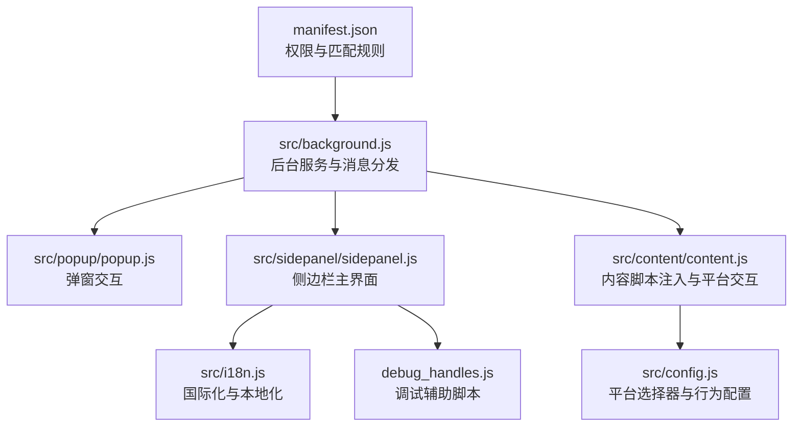
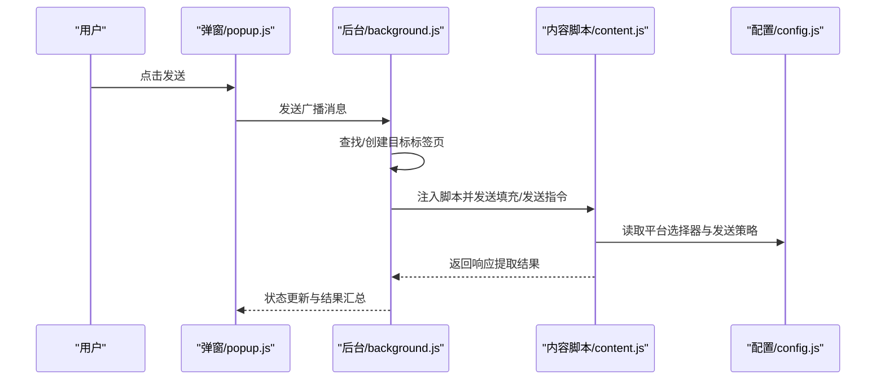
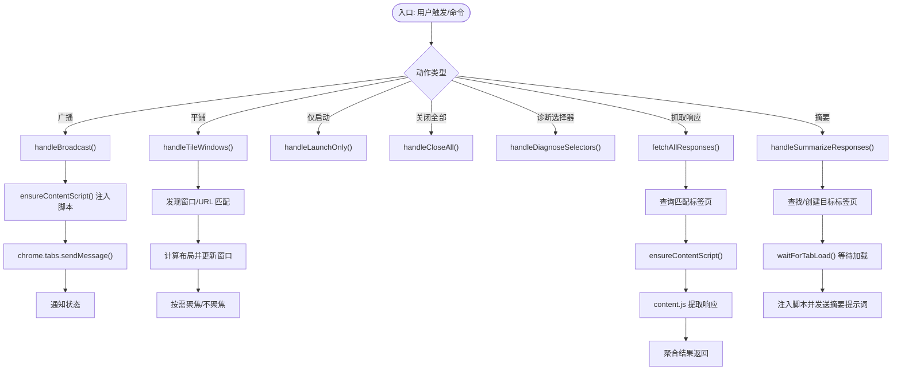
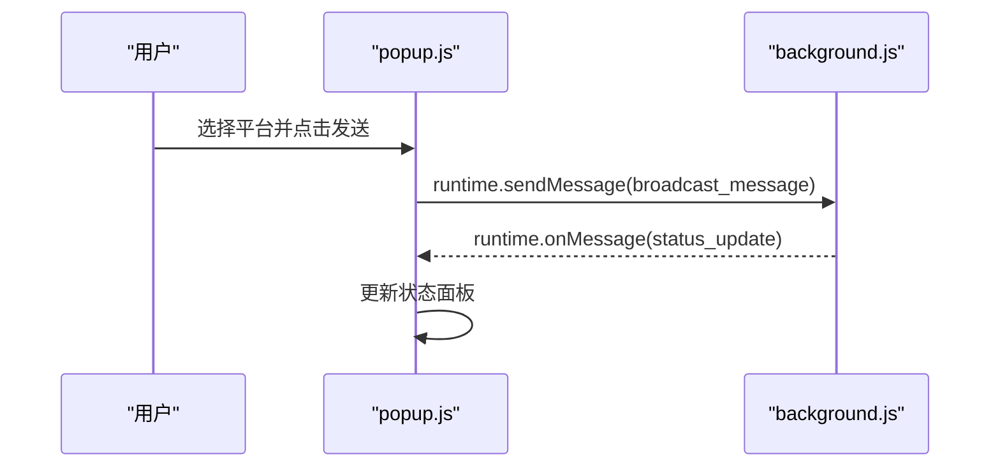
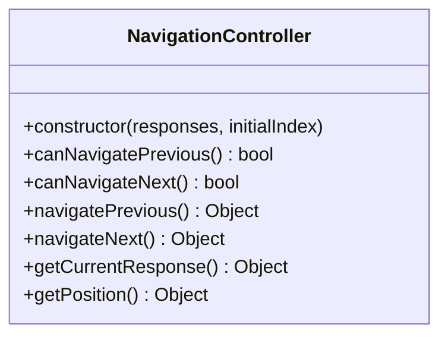
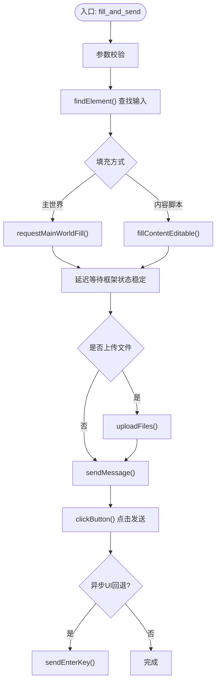
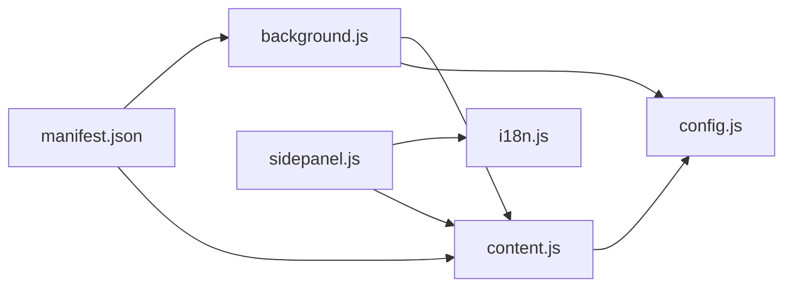
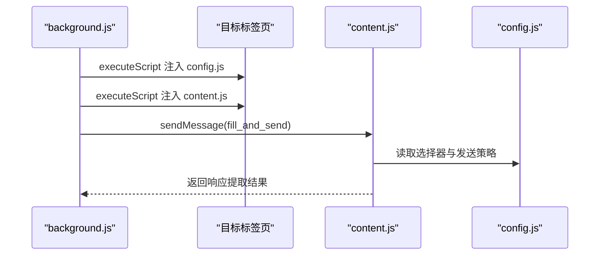

# 故障排除

<cite>
**本文档引用的文件**
- [README.md](file://README.md)
- [manifest.json](file://manifest.json)
- [src/background.js](file://src/background.js)
- [src/popup/popup.js](file://src/popup/popup.js)
- [src/sidepanel/sidepanel.js](file://src/sidepanel/sidepanel.js)
- [src/content/content.js](file://src/content/content.js)
- [src/config.js](file://src/config.js)
- [src/i18n.js](file://src/i18n.js)
- [debug_handles.js](file://debug_handles.js)
- [MAINTENANCE.md](file://MAINTENANCE.md)
- [User_UAT_Checklist.md](file://User_UAT_Checklist.md)
- [DEVLOG.md](file://DEVLOG.md)
- [TESTING_v1.7.md](file://TESTING_v1.7.md)
</cite>

## 目录
1. [简介](#简介)
2. [项目结构](#项目结构)
3. [核心组件](#核心组件)
4. [架构总览](#架构总览)
5. [详细组件分析](#详细组件分析)
6. [依赖分析](#依赖分析)
7. [性能考虑](#性能考虑)
8. [故障排除指南](#故障排除指南)
9. [结论](#结论)
10. [附录](#附录)

## 简介
本指南面向使用者与维护者，系统化梳理安装、功能异常与性能问题的诊断与修复路径，并提供调试工具使用方法、性能诊断流程、日志分析技巧、预防性维护建议以及紧急问题处理流程与用户支持策略。文档结合项目源码与维护日志，确保可操作性强且覆盖常见问题场景。

## 项目结构
该项目为 Chrome 扩展，采用 Manifest V3，核心模块包括：
- 扩展清单与权限声明：manifest.json
- 后台服务与消息调度：src/background.js
- 弹窗与侧边栏 UI：src/popup/popup.js、src/sidepanel/sidepanel.js
- 平台集成与内容脚本：src/content/content.js
- 统一配置与选择器：src/config.js
- 国际化与本地化：src/i18n.js
- 调试辅助脚本：debug_handles.js
- 维护日志与变更记录：MAINTENANCE.md、DEVLOG.md、TESTING_v1.7.md、User_UAT_Checklist.md

**图表来源**
- [manifest.json](file://manifest.json#L1-L79)
- [src/background.js](file://src/background.js#L1-L120)
- [src/popup/popup.js](file://src/popup/popup.js#L1-L61)
- [src/sidepanel/sidepanel.js](file://src/sidepanel/sidepanel.js#L1-L120)
- [src/content/content.js](file://src/content/content.js#L1-L60)
- [src/config.js](file://src/config.js#L1-L40)
- [src/i18n.js](file://src/i18n.js#L1-L60)
- [debug_handles.js](file://debug_handles.js#L1-L40)

**章节来源**
- [README.md](file://README.md#L20-L29)
- [manifest.json](file://manifest.json#L1-L79)

## 核心组件
- 后台服务（background.js）：负责扩展入口行为、窗口管理、消息路由、脚本注入、响应抓取与摘要生成。
- 弹窗（popup.js）：发起广播、展示状态反馈。
- 侧边栏（sidepanel.js）：主界面、历史记录、响应展示、文件上传、国际化、模态与导航。
- 内容脚本（content.js）：注入到各 AI 平台页面，负责输入填充、发送、响应提取与文件上传。
- 配置（config.js）：统一管理各平台的选择器、发送方式、文件支持等。
- 国际化（i18n.js）：提供双语文案与日期时间格式化。
- 调试脚本（debug_handles.js）：辅助定位模态详情窗口的尺寸与拖拽手柄问题。

**章节来源**
- [src/background.js](file://src/background.js#L1-L120)
- [src/popup/popup.js](file://src/popup/popup.js#L1-L61)
- [src/sidepanel/sidepanel.js](file://src/sidepanel/sidepanel.js#L1-L120)
- [src/content/content.js](file://src/content/content.js#L1-L60)
- [src/config.js](file://src/config.js#L1-L40)
- [src/i18n.js](file://src/i18n.js#L1-L60)
- [debug_handles.js](file://debug_handles.js#L1-L40)

## 架构总览
扩展采用“后台服务 + 内容脚本 + 侧边栏 UI”的分层设计：
- 后台服务作为中枢，协调窗口与标签页生命周期、消息分发与脚本注入。
- 内容脚本在目标站点执行，隔离提取响应，主世界注入处理富文本输入。
- 侧边栏提供用户交互、历史与响应展示、文件上传与国际化。

**图表来源**
- [src/popup/popup.js](file://src/popup/popup.js#L16-L45)
- [src/background.js](file://src/background.js#L138-L197)
- [src/content/content.js](file://src/content/content.js#L199-L216)
- [src/config.js](file://src/config.js#L5-L40)

## 详细组件分析

### 后台服务（background.js）
职责与关键流程：
- 扩展入口行为与弹窗切换
- 广播消息、窗口平铺、仅启动指定平台、关闭所有窗口
- 诊断选择器、抓取响应、摘要生成
- 主世界注入与脚本注入保障
- 等待标签页加载与超时处理

**图表来源**
- [src/background.js](file://src/background.js#L138-L197)
- [src/background.js](file://src/background.js#L270-L296)
- [src/background.js](file://src/background.js#L199-L268)
- [src/background.js](file://src/background.js#L298-L376)
- [src/background.js](file://src/background.js#L527-L643)
- [src/background.js](file://src/background.js#L656-L716)

**章节来源**
- [src/background.js](file://src/background.js#L1-L120)
- [src/background.js](file://src/background.js#L138-L197)
- [src/background.js](file://src/background.js#L270-L296)
- [src/background.js](file://src/background.js#L199-L268)
- [src/background.js](file://src/background.js#L298-L376)
- [src/background.js](file://src/background.js#L527-L643)
- [src/background.js](file://src/background.js#L656-L716)

### 弹窗（popup.js）
职责与关键流程：
- 读取/保存用户选择的平台
- 发送广播消息至后台
- 监听状态更新并展示

**图表来源**
- [src/popup/popup.js](file://src/popup/popup.js#L16-L45)
- [src/popup/popup.js](file://src/popup/popup.js#L47-L59)

**章节来源**
- [src/popup/popup.js](file://src/popup/popup.js#L1-L61)

### 侧边栏（sidepanel.js）
职责与关键流程：
- Markdown 渲染与代码块复制
- 历史记录、响应抓取、文件上传、国际化
- 模态详情与导航控制器
- 布局与主题切换、语言切换

**图表来源**
- [src/sidepanel/sidepanel.js](file://src/sidepanel/sidepanel.js#L712-L800)

**章节来源**
- [src/sidepanel/sidepanel.js](file://src/sidepanel/sidepanel.js#L1-L120)
- [src/sidepanel/sidepanel.js](file://src/sidepanel/sidepanel.js#L712-L800)

### 内容脚本（content.js）
职责与关键流程：
- 填充输入框（主世界注入或内容脚本填充）
- 发送消息（按钮点击或回车）
- 响应提取与思维/推理块过滤
- 文件上传（DataTransfer 方案）

**图表来源**
- [src/content/content.js](file://src/content/content.js#L322-L418)
- [src/content/content.js](file://src/content/content.js#L465-L565)
- [src/content/content.js](file://src/content/content.js#L593-L742)

**章节来源**
- [src/content/content.js](file://src/content/content.js#L1-L120)
- [src/content/content.js](file://src/content/content.js#L322-L418)
- [src/content/content.js](file://src/content/content.js#L465-L565)
- [src/content/content.js](file://src/content/content.js#L593-L742)

### 配置（config.js）
职责与关键流程：
- 统一管理各平台的选择器、发送方式、文件支持与基础 URL
- 为内容脚本与后台服务提供一致的行为规范

**章节来源**
- [src/config.js](file://src/config.js#L5-L199)

### 国际化（i18n.js）
职责与关键流程：
- 提供双语文案、日期时间格式化与相对时间
- 与侧边栏 UI 结合，通过 data-i18n 属性动态更新

**章节来源**
- [src/i18n.js](file://src/i18n.js#L1-L120)
- [src/i18n.js](file://src/i18n.js#L355-L414)

### 调试脚本（debug_handles.js）
用途与关键点：
- 检查详情模态的元素、手柄数量与样式
- 定位手柄不可见或被遮挡问题

**章节来源**
- [debug_handles.js](file://debug_handles.js#L1-L73)

## 依赖分析
- manifest.json 声明权限与主机权限，决定后台与内容脚本的注入范围。
- 后台服务依赖配置（AI_CONFIG）与内容脚本进行跨标签页通信。
- 侧边栏依赖国际化与内容脚本的响应提取结果。
- 内容脚本依赖配置与平台 DOM 结构。

**图表来源**
- [manifest.json](file://manifest.json#L12-L32)
- [src/background.js](file://src/background.js#L69-L74)
- [src/content/content.js](file://src/content/content.js#L1-L20)
- [src/sidepanel/sidepanel.js](file://src/sidepanel/sidepanel.js#L1-L40)
- [src/i18n.js](file://src/i18n.js#L1-L40)

**章节来源**
- [manifest.json](file://manifest.json#L12-L32)
- [src/background.js](file://src/background.js#L69-L74)
- [src/content/content.js](file://src/content/content.js#L1-L20)
- [src/sidepanel/sidepanel.js](file://src/sidepanel/sidepanel.js#L1-L40)
- [src/i18n.js](file://src/i18n.js#L1-L40)

## 性能考虑
- 多标签页并发：后台服务并行处理多个平台，注意 Promise.allSettled 与超时控制。
- 等待与延迟：内容脚本与后台服务均设置等待与延迟，避免竞态条件。
- 文件上传：DataTransfer 方案与重试机制，注意 30 秒超时与指数退避。
- UI 渲染：历史与响应列表的全量重绘可能带来闪烁，建议增量更新或虚拟滚动（参考维护日志建议）。

**章节来源**
- [src/background.js](file://src/background.js#L718-L786)
- [src/content/content.js](file://src/content/content.js#L593-L742)
- [MAINTENANCE.md](file://MAINTENANCE.md#L424-L434)

## 故障排除指南

### 一、安装与加载问题
常见症状
- 扩展无法加载、报错或无反应
- 权限不足导致无法访问目标站点

排查步骤
- 确认已开启“开发者模式”
- 确认“加载已解压的扩展程序”指向正确目录
- 检查 manifest.json 权限与主机权限是否包含目标站点
- 若脚本注入失败，后台会提示“脚本注入失败”，需检查 content_scripts 注入顺序与目标标签页状态

修复建议
- 重新加载扩展并刷新目标页面
- 在后台服务中确保 ensureContentScript 顺序注入 config.js 与 content.js
- 如需新增平台，更新 manifest.json 的 host_permissions 与 content_scripts.matches

**章节来源**
- [README.md](file://README.md#L30-L47)
- [manifest.json](file://manifest.json#L12-L32)
- [src/background.js](file://src/background.js#L656-L678)
- [MAINTENANCE.md](file://MAINTENANCE.md#L162-L166)

### 二、功能异常

#### 1. 广播发送失败或部分平台无响应
症状
- “发送成功”状态缺失或仅部分平台成功
- 报错“脚本注入失败”或“输入元素未找到”

排查步骤
- 在弹窗中查看状态面板的逐平台反馈
- 后台服务会根据 providerWindows 缓存窗口映射，若缓存失效需重新发现标签页
- 检查内容脚本是否成功注入（ping 消息）

修复建议
- 重新打开目标平台页面并刷新
- 确保内容脚本注入顺序：先注入 config.js，再注入 content.js
- 核对 config.js 中对应平台的选择器与发送方式

**章节来源**
- [src/popup/popup.js](file://src/popup/popup.js#L47-L59)
- [src/background.js](file://src/background.js#L718-L786)
- [src/background.js](file://src/background.js#L656-L678)
- [src/config.js](file://src/config.js#L5-L199)

#### 2. 响应提取失败或为空
症状
- “获取响应”后无内容或显示“无响应”
- 某些平台（如 Yuanbao）思维/推理块被保留

排查步骤
- 使用后台“诊断选择器”功能，检查响应选择器是否命中
- 内容脚本会尝试多种选择器并过滤思维/推理块，确认是否命中最新响应
- 检查目标页面是否加载完成（后台 waitForTabLoad）

修复建议
- 更新 config.js 中的响应选择器
- 对 Yuanbao 等平台，确认 removeThinkingBlocks 的处理逻辑
- 等待页面完全加载后再触发提取

**章节来源**
- [src/background.js](file://src/background.js#L270-L296)
- [src/content/content.js](file://src/content/content.js#L218-L320)
- [src/content/content.js](file://src/content/content.js#L50-L124)
- [src/background.js](file://src/background.js#L680-L716)

#### 3. 文件上传失败或超时
症状
- 上传超时（30 秒）、自动重试 2 次后失败
- 文件类型不被支持或总大小超过限制

排查步骤
- 检查文件大小与类型是否超出限制（单文件 10MB，总计 50MB）
- 确认平台支持的文件类型与选择器
- 查看 Network 面板是否有上传请求

修复建议
- 降低文件大小或减少文件数量
- 选择平台支持的文件类型
- 确保 DataTransfer 对象赋值后触发 change 事件

**章节来源**
- [User_UAT_Checklist.md](file://User_UAT_Checklist.md#L77-L103)
- [MAINTENANCE.md](file://MAINTENANCE.md#L181-L227)
- [src/content/content.js](file://src/content/content.js#L593-L742)

#### 4. 模态详情窗口拖拽手柄不可见或被遮挡
症状
- 详情模态无法拖拽调整大小
- 手柄数量为 0 或不可见

排查步骤
- 使用 debug_handles.js 检查模态元素、手柄数量与样式
- 检查 z-index、position 与是否有其他元素遮挡
- 确认 initModalResize() 已被调用

修复建议
- 调整 CSS 层级与定位属性
- 确保模态激活后初始化手柄

**章节来源**
- [debug_handles.js](file://debug_handles.js#L1-L73)
- [src/sidepanel/sidepanel.js](file://src/sidepanel/sidepanel.js#L629-L633)

#### 5. 语言切换或国际化显示异常
症状
- 按钮文字或模态文本未随语言切换更新
- 部分 tooltip 或 placeholder 未翻译

排查步骤
- 检查 HTML 是否使用 data-i18n 与 data-i18n-title/data-i18n-placeholder
- 确认 i18n.js 中翻译键存在且 applyLanguage()/updateButtonLabels() 正常执行

修复建议
- 为缺失的 tooltip/placeholder 补齐翻译键与 data-i18n 属性
- 确保语言切换后调用 applyLanguage()

**章节来源**
- [DEVLOG.md](file://DEVLOG.md#L5-L72)
- [src/i18n.js](file://src/i18n.js#L355-L414)

### 三、性能问题诊断

#### 1. 内存泄漏检测
现象
- 长时间使用后内存占用持续上升
- 大量文件预览或历史记录导致 DOM 重绘频繁

诊断方法
- 使用 Chrome 任务管理器观察内存曲线
- 检查是否存在未清理的事件监听器与定时器
- 关注全量 DOM 重绘（historyList、responsesGrid、filePreviewList）

优化建议
- 实施增量更新或虚拟滚动
- 及时移除事件监听器与清理定时器
- 控制文件预览与历史记录的数据规模

**章节来源**
- [MAINTENANCE.md](file://MAINTENANCE.md#L424-L434)
- [MAINTENANCE.md](file://MAINTENANCE.md#L437-L443)

#### 2. 网络请求优化
现象
- 文件上传耗时较长
- 多平台广播导致并发请求过多

诊断方法
- Network 面板观察上传耗时与重试次数
- 检查超时与重试策略（Promise.race + 指数退避）

优化建议
- 合理设置上传超时与重试次数
- 控制并发数量，必要时串行处理
- 优化 Data URL 到 File 的转换与 DataTransfer 赋值

**章节来源**
- [src/content/content.js](file://src/content/content.js#L593-L742)
- [MAINTENANCE.md](file://MAINTENANCE.md#L85-L90)

#### 3. UI 响应性分析
现象
- 大文件读取或批量操作时 UI 卡顿
- 模态详情渲染后无法拖拽

诊断方法
- Performance 面板捕获主线程阻塞
- 检查渲染与事件绑定时机

优化建议
- 将大文件读取与渲染拆分为异步任务
- 延迟初始化模态拖拽手柄
- 使用 requestIdleCallback 或分片渲染

**章节来源**
- [src/sidepanel/sidepanel.js](file://src/sidepanel/sidepanel.js#L629-L633)
- [MAINTENANCE.md](file://MAINTENANCE.md#L340-L346)

### 四、错误日志分析技巧

#### 1. 日志解读与分类
- 后台服务：err_script_injection_failed、sent、error 前缀等
- 内容脚本：输入元素未找到、响应提取失败、上传超时
- 侧边栏：通知与状态面板错误提示

建议
- 将错误按来源（后台/内容脚本/UI）分类
- 记录时间戳与平台信息，便于复现

**章节来源**
- [src/background.js](file://src/background.js#L788-L790)
- [src/content/content.js](file://src/content/content.js#L14-L40)
- [src/i18n.js](file://src/i18n.js#L145-L160)

#### 2. 根因分析流程
- 快速定位：根据错误类型判断是注入、选择器、网络还是 UI 问题
- 逐步缩小：检查 manifest 权限、config 选择器、Network 请求、DOM 结构
- 验证修复：在最小复现场景中验证修复

**章节来源**
- [MAINTENANCE.md](file://MAINTENANCE.md#L160-L227)

### 五、预防性维护建议

- 版本升级与回归测试
  - 参考 DEVLOG.md 的版本变更与修复清单，逐项核验
  - 使用 User_UAT_Checklist.md 进行端到端回归测试

- 代码质量与安全
  - 避免 innerHTML 直接插入用户内容，改用 textContent 或 DOMPurify
  - 替换 alert() 为 Toast 通知，提升用户体验
  - 定期清理未使用的事件监听器与定时器

- 性能监控
  - 监控文件读取与上传耗时、内存占用与 DOM 重绘频率
  - 对大列表实施虚拟滚动或分页

**章节来源**
- [DEVLOG.md](file://DEVLOG.md#L1-L100)
- [User_UAT_Checklist.md](file://User_UAT_Checklist.md#L1-L120)
- [MAINTENANCE.md](file://MAINTENANCE.md#L355-L531)

### 六、紧急问题处理流程与用户支持策略

#### 紧急问题处理流程
1. 快速评估影响范围（单平台/多平台/全局）
2. 临时降级（禁用问题平台、回退到旧版配置）
3. 采集日志（后台与内容脚本日志、Network 请求）
4. 修复与验证（小范围灰度发布）
5. 通知用户与回滚（如修复失败）

#### 用户支持策略
- 提供最小复现步骤与截图
- 引导用户查看状态面板与错误提示
- 提示刷新页面、重新加载扩展与检查权限
- 提供版本信息与已知限制说明

**章节来源**
- [TESTING_v1.7.md](file://TESTING_v1.7.md#L71-L161)
- [User_UAT_Checklist.md](file://User_UAT_Checklist.md#L277-L291)

## 结论
本指南基于源码与维护日志，提供了从安装到功能、性能与日志分析的完整排障路径。建议在日常维护中遵循预防性策略，结合自动化测试与回归清单，确保扩展在多平台与复杂交互下的稳定性与可维护性。

## 附录

### A. 常用调试工具使用
- 浏览器开发者工具
  - Console：查看日志与错误堆栈
  - Elements：检查选择器与 DOM 结构
  - Network：监控上传与页面请求
  - Performance：分析主线程阻塞
- 扩展专用
  - 后台页面：chrome://extensions -> 调试视图
  - 内容脚本：在目标站点页面打开开发者工具
  - 调试脚本：在控制台运行 debug_handles.js

**章节来源**
- [src/background.js](file://src/background.js#L1-L120)
- [src/content/content.js](file://src/content/content.js#L1-L60)
- [debug_handles.js](file://debug_handles.js#L1-L73)

### B. 关键流程图（代码级）

**图表来源**
- [src/background.js](file://src/background.js#L656-L678)
- [src/content/content.js](file://src/content/content.js#L199-L216)
- [src/config.js](file://src/config.js#L5-L40)