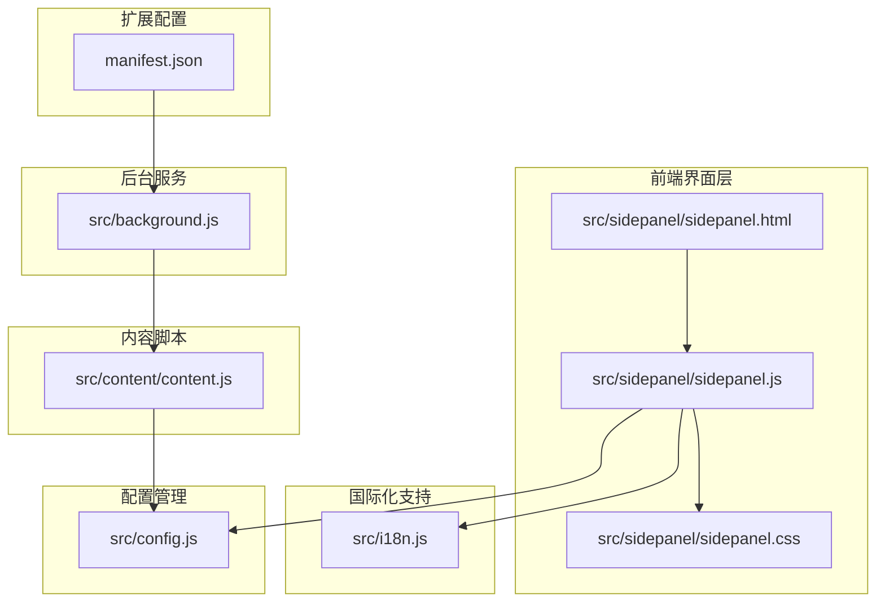
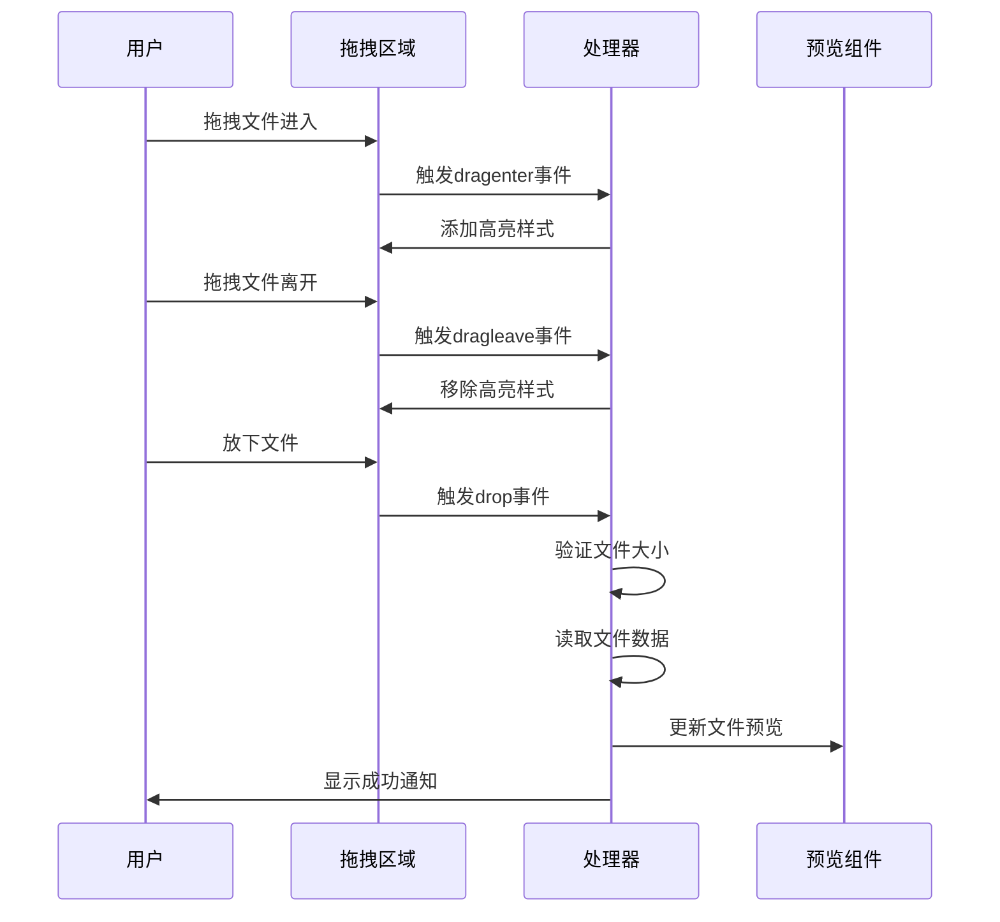
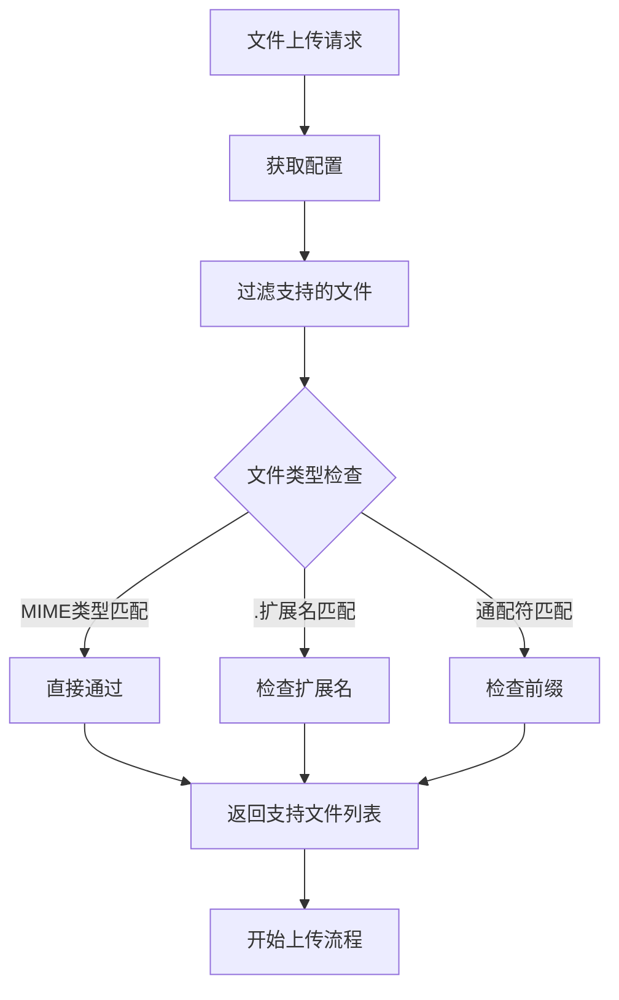
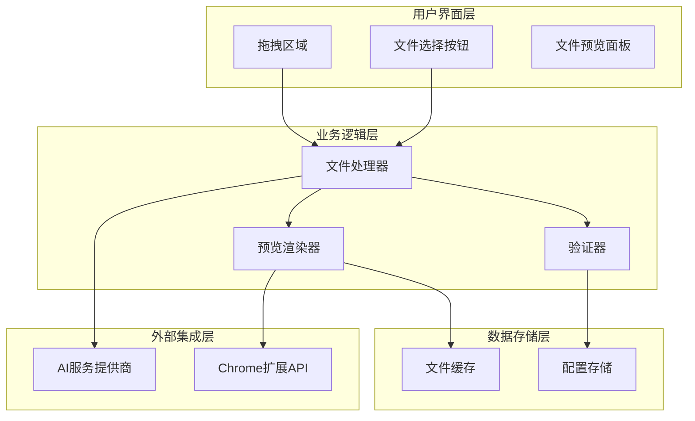
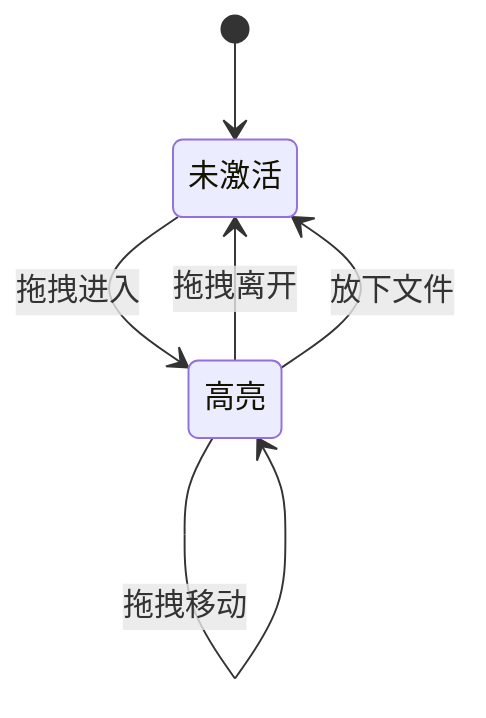
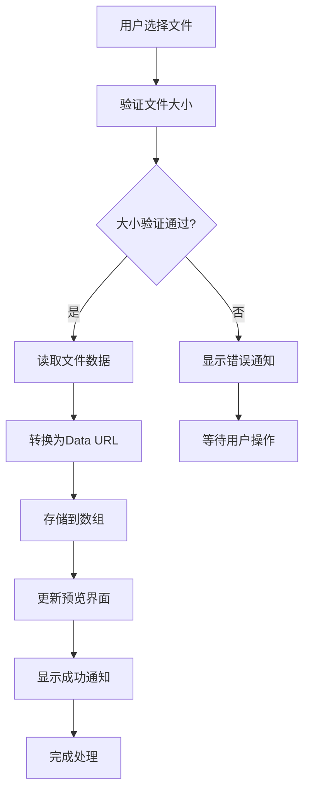
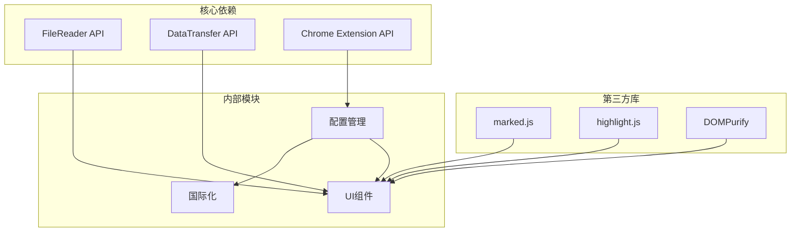

# 文件上传系统

<cite>
**本文档引用的文件**
- [DRAG_DROP_IMPLEMENTATION.md](file://DRAG_DROP_IMPLEMENTATION.md)
- [sidepanel.js](file://src/sidepanel/sidepanel.js)
- [sidepanel.html](file://src/sidepanel/sidepanel.html)
- [sidepanel.css](file://src/sidepanel/sidepanel.css)
- [i18n.js](file://src/i18n.js)
- [config.js](file://src/config.js)
- [content.js](file://src/content/content.js)
- [background.js](file://src/background.js)
- [manifest.json](file://manifest.json)
- [tmp_dataURLtoFile.js](file://tmp_dataURLtoFile.js)
- [MAINTENANCE.md](file://MAINTENANCE.md)
</cite>

## 目录
1. [项目概述](#项目概述)
2. [项目结构](#项目结构)
3. [核心组件](#核心组件)
4. [架构概览](#架构概览)
5. [详细组件分析](#详细组件分析)
6. [依赖关系分析](#依赖关系分析)
7. [性能考虑](#性能考虑)
8. [故障排除指南](#故障排除指南)
9. [结论](#结论)

## 项目概述

文件上传系统是AI Multiverse Chrome扩展程序的核心功能模块，提供了完整的文件处理解决方案。该系统支持多种文件格式，包括图像、文档等，并实现了拖拽上传、文件类型验证、大小限制检查等高级功能。

系统采用现代化的前端架构，结合Chrome扩展的安全模型，确保文件上传过程既高效又安全。通过声明式的配置系统，平台能够灵活适配不同的AI服务提供商的文件上传要求。

## 项目结构

文件上传系统主要分布在以下关键文件中：

**图表来源**
- [sidepanel.html](file://src/sidepanel/sidepanel.html#L1-L400)
- [sidepanel.js](file://src/sidepanel/sidepanel.js#L1-L800)
- [config.js](file://src/config.js#L1-L204)

**章节来源**
- [sidepanel.html](file://src/sidepanel/sidepanel.html#L1-L400)
- [sidepanel.js](file://src/sidepanel/sidepanel.js#L1-L800)
- [config.js](file://src/config.js#L1-L204)

## 核心组件

### 拖拽上传功能

拖拽上传功能通过HTML5的Drag and Drop API实现，提供了直观的用户交互体验：

**图表来源**
- [sidepanel.js](file://src/sidepanel/sidepanel.js#L414-L495)
- [DRAG_DROP_IMPLEMENTATION.md](file://DRAG_DROP_IMPLEMENTATION.md#L46-L104)

### 文件类型验证系统

系统实现了灵活的文件类型过滤机制，支持多种匹配方式：

**图表来源**
- [content.js](file://src/content/content.js#L677-L705)
- [config.js](file://src/config.js#L1-L204)

### 文件大小限制管理

系统采用双重限制机制，确保上传过程的稳定性：

- **单文件大小限制**: 默认10MB
- **总大小限制**: 默认50MB
- **实时验证**: 在文件添加时进行验证
- **累计计算**: 基于当前已选文件的总大小

**章节来源**
- [sidepanel.js](file://src/sidepanel/sidepanel.js#L53-L54)
- [sidepanel.js](file://src/sidepanel/sidepanel.js#L465-L495)
- [DRAG_DROP_IMPLEMENTATION.md](file://DRAG_DROP_IMPLEMENTATION.md#L122-L123)

## 架构概览

文件上传系统采用分层架构设计，确保各组件职责明确：

**图表来源**
- [sidepanel.js](file://src/sidepanel/sidepanel.js#L414-L506)
- [config.js](file://src/config.js#L1-L204)

## 详细组件分析

### 拖拽事件处理系统

拖拽事件处理是文件上传的核心交互机制：

#### 事件监听器注册
系统为拖拽区域注册了完整的事件监听器集合：

| 事件类型 | 监听目标 | 处理函数 | 功能描述 |
|---------|---------|---------|----------|
| dragenter | 拖拽区域 | preventDefaults | 阻止默认行为 |
| dragover | 拖拽区域 | preventDefaults | 阻止默认行为 |
| dragleave | 拖拽区域 | preventDefaults | 阻止默认行为 |
| drop | 拖拽区域 | preventDefaults | 阻止默认行为 |
| dragenter | 文本区域 | preventDefaults | 阻止默认行为 |
| dragover | 文本区域 | preventDefaults | 阻止默认行为 |

#### 视觉反馈机制
系统提供了多层次的视觉反馈：

**图表来源**
- [sidepanel.js](file://src/sidepanel/sidepanel.js#L420-L462)
- [sidepanel.css](file://src/sidepanel/sidepanel.css#L21-L44)

**章节来源**
- [sidepanel.js](file://src/sidepanel/sidepanel.js#L414-L462)
- [sidepanel.css](file://src/sidepanel/sidepanel.css#L21-L44)

### 文件处理管道

文件处理管道实现了完整的文件生命周期管理：

#### 文件读取流程

**图表来源**
- [sidepanel.js](file://src/sidepanel/sidepanel.js#L465-L495)
- [sidepanel.js](file://src/sidepanel/sidepanel.js#L2086-L2104)

#### 文件预览渲染
系统支持多种文件类型的预览显示：

| 文件类型 | 预览方式 | 特殊处理 |
|---------|---------|----------|
| 图像文件 | 缩略图显示 | 直接显示图片预览 |
| 文档文件 | 扩展名标识 | 显示文件扩展名作为标识 |
| 其他文件 | 占位符图标 | 使用文件类型对应的图标 |

**章节来源**
- [sidepanel.js](file://src/sidepanel/sidepanel.js#L2106-L2152)

### 国际化支持

系统提供了完整的多语言支持，包括文件上传相关的所有文本：

#### 支持的语言
- 英语 (en)
- 中文 (zh-CN)

#### 文件上传相关的关键翻译键
- `drag_files_here`: "拖放文件到此处上传"
- `file_added`: "已添加：{name}"
- `file_too_large`: "文件过大：最大 {max}MB"
- `file_size_too_large`: "总大小过大：最大 {max}MB"
- `err_file_read_failed`: "读取文件失败"

**章节来源**
- [i18n.js](file://src/i18n.js#L118-L133)
- [i18n.js](file://src/i18n.js#L288-L302)
- [i18n.js](file://src/i18n.js#L304-L306)

### 平台配置系统

每个AI服务提供商都有独立的配置，定义了文件上传的支持能力：

#### 配置结构
每个配置对象包含以下关键属性：

| 属性 | 类型 | 描述 | 示例值 |
|------|------|------|--------|
| supportsFiles | boolean | 是否支持文件上传 | true |
| supportedFileTypes | array | 支持的文件类型列表 | ['image/*', '.pdf'] |
| selectors | object | 页面元素选择器 | 包含文件上传按钮和输入框的选择器 |
| baseUrl | string | 服务基础URL | 'https://example.com/' |

#### 支持的文件类型示例
不同平台支持的文件类型存在显著差异：

| 平台 | 支持的文件类型 | 特殊说明 |
|------|---------------|----------|
| Gemini | image/*, .pdf, .txt, .doc, .docx | 主要支持图像和文档 |
| Grok | image/*, .pdf, .txt | 较少的文档类型支持 |
| Kimi | image/*, .pdf, .txt, .doc, .docx, .md, .json, .csv | 最广泛的文档支持 |
| ChatGPT | image/*, .pdf, .txt, .md, .json, .csv, .py, .js | 支持编程语言文件 |
| Qwen | .pdf, .doc, .docx, .txt, .md, .json, .csv, image/* | 广泛的文档和图像支持 |
| DeepSeek | image/* | 仅支持图像文件 |
| Yuanbao | image/*, .pdf, .doc, .docx, .txt, .md | 中等程度的文档支持 |

**章节来源**
- [config.js](file://src/config.js#L1-L204)

## 依赖关系分析

文件上传系统涉及多个层面的依赖关系：

**图表来源**
- [sidepanel.js](file://src/sidepanel/sidepanel.js#L1-L800)
- [config.js](file://src/config.js#L1-L204)
- [i18n.js](file://src/i18n.js#L1-L504)

### 外部依赖

系统对外部依赖的使用遵循最小化原则：

| 依赖库 | 版本 | 用途 | 安全考虑 |
|-------|------|------|----------|
| marked.js | 本地引入 | Markdown渲染 | 本地文件，无安全风险 |
| highlight.js | 本地引入 | 语法高亮 | 本地文件，无安全风险 |
| DOMPurify | 本地引入 | HTML清理 | 本地文件，无安全风险 |

**章节来源**
- [sidepanel.html](file://src/sidepanel/sidepanel.html#L392-L397)

## 性能考虑

### 内存管理策略

系统采用了多项内存优化措施：

#### 数据URL处理
- 使用Data URL格式在内存中存储文件数据
- 提供Base64到File对象的转换工具函数
- 支持文件数据的及时清理和释放

#### 文件预览优化
- 图像文件使用缩略图显示，减少内存占用
- 文档文件使用简单的文本标识，避免大文件加载
- 实时更新预览列表，避免重复渲染

### 网络传输优化

#### 上传策略
- 采用顺序上传而非并发上传，避免服务器压力
- 实现重试机制，提高上传成功率
- 设置超时控制，防止长时间阻塞

#### 缓存机制
- 利用浏览器缓存减少重复文件的处理
- 实现文件状态的持久化存储
- 支持断点续传的准备工作

## 故障排除指南

### 常见问题及解决方案

#### 文件读取失败
**症状**: 文件添加后显示"读取文件失败"错误
**可能原因**:
- 文件损坏或格式不支持
- 浏览器安全策略限制
- 内存不足

**解决步骤**:
1. 检查文件格式是否在支持列表中
2. 尝试重新选择文件
3. 清理浏览器缓存后重试

#### 文件大小超限
**症状**: 文件添加时显示"文件过大"或"总大小过大"错误
**解决方法**:
- 压缩图像文件或转换为更小的格式
- 分割大文档为多个小文件
- 联系管理员调整大小限制

#### 拖拽功能异常
**症状**: 拖拽区域无法正常响应拖拽操作
**排查步骤**:
1. 检查浏览器JavaScript是否启用
2. 确认拖拽区域的CSS样式正确应用
3. 验证事件监听器是否正常注册

### 调试工具和技巧

#### 开发者工具使用
- 使用浏览器开发者工具监控网络请求
- 检查控制台是否有JavaScript错误
- 使用性能面板分析内存使用情况

#### 日志记录
系统在关键节点提供了详细的日志输出：
- 文件处理开始和结束
- 验证过程的详细信息
- 错误发生时的上下文信息

**章节来源**
- [sidepanel.js](file://src/sidepanel/sidepanel.js#L497-L506)
- [content.js](file://src/content/content.js#L616-L671)

## 结论

文件上传系统展现了现代Web应用开发的最佳实践，通过以下关键特性实现了高质量的用户体验：

### 技术优势
- **用户友好**: 直观的拖拽界面和实时反馈
- **安全可靠**: 完整的文件类型验证和大小限制
- **跨平台兼容**: 支持多种AI服务提供商的差异化需求
- **性能优化**: 智能的内存管理和上传策略

### 扩展性设计
系统采用模块化的架构设计，便于未来功能扩展：
- 声明式配置系统支持新平台接入
- 插件化的文件类型过滤机制
- 可配置的上传参数和限制

### 未来发展
根据维护文档，系统计划在后续版本中实现：
- 更精确的上传进度指示器
- 更丰富的文件格式支持
- 并行批量上传优化
- 更完善的错误处理和用户反馈机制

该文件上传系统为AI Multiverse扩展程序提供了坚实的基础，通过持续的优化和改进，能够满足用户不断增长的需求。