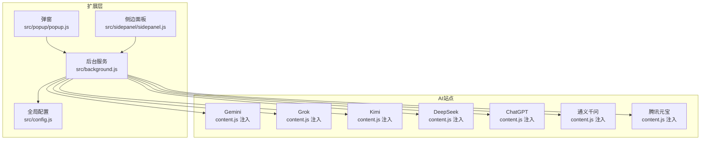
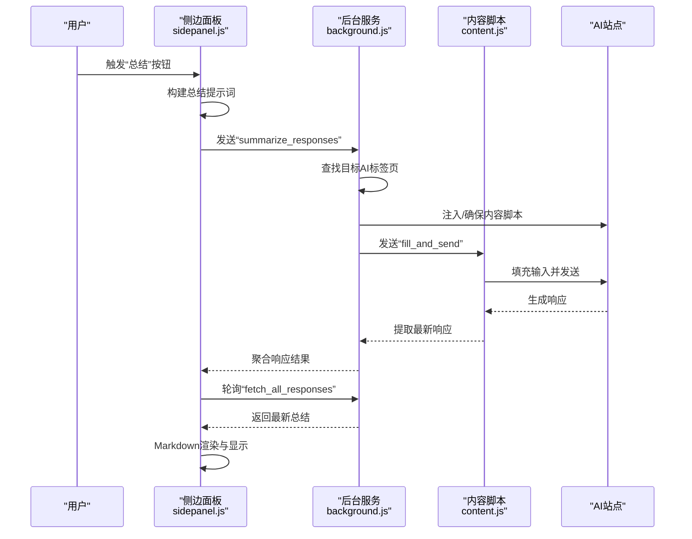
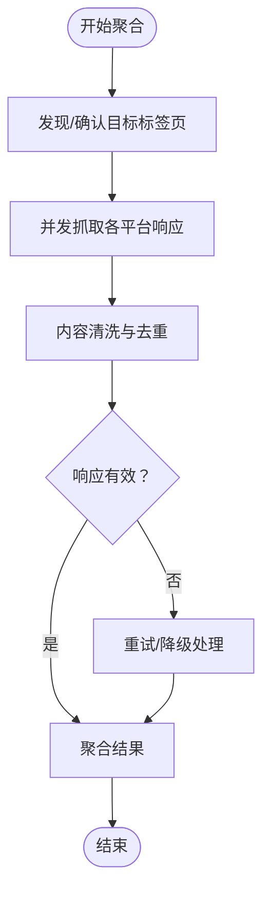
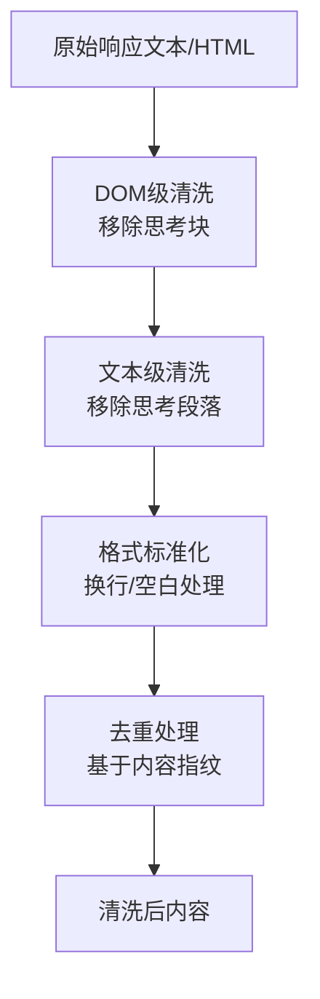
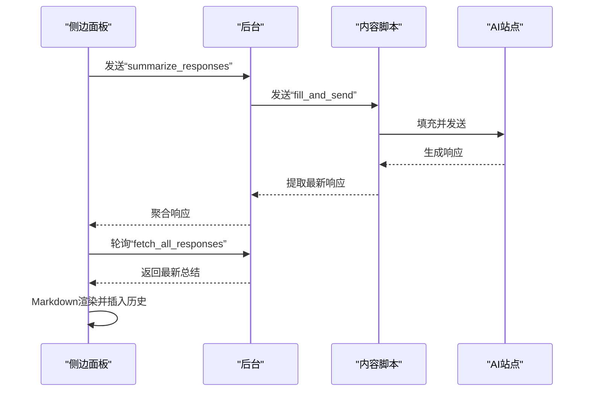
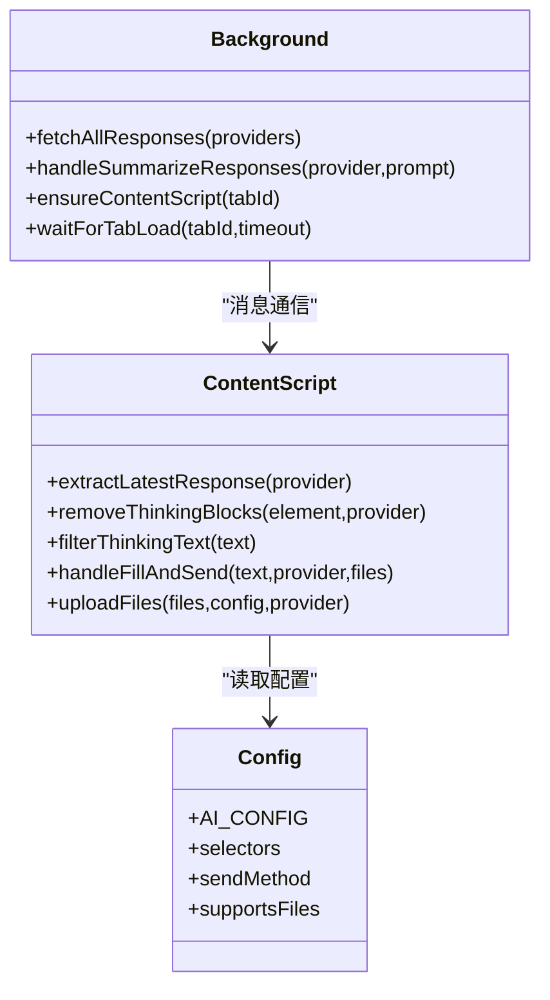
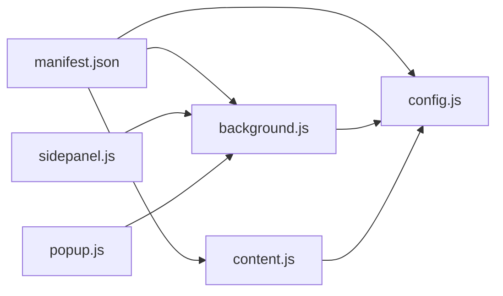

# 总结算法设计

<cite>
**本文档引用的文件**
- [src/background.js](file://src/background.js)
- [src/content/content.js](file://src/content/content.js)
- [src/sidepanel/sidepanel.js](file://src/sidepanel/sidepanel.js)
- [src/popup/popup.js](file://src/popup/popup.js)
- [src/config.js](file://src/config.js)
- [manifest.json](file://manifest.json)
- [SUMMARIZATION_BUGFIX_v1.7.8.md](file://SUMMARIZATION_BUGFIX_v1.7.8.md)
- [BUGFIX_SUMMARY_POLLING_v1.7.8.md](file://BUGFIX_SUMMARY_POLLING_v1.7.8.md)
- [RELEASE_v1.6.1.md](file://RELEASE_v1.6.1.md)
</cite>

## 目录
1. [简介](#简介)
2. [项目结构](#项目结构)
3. [核心组件](#核心组件)
4. [架构总览](#架构总览)
5. [详细组件分析](#详细组件分析)
6. [依赖关系分析](#依赖关系分析)
7. [性能考量](#性能考量)
8. [故障排查指南](#故障排查指南)
9. [结论](#结论)
10. [附录](#附录)

## 简介
本文件面向跨平台AI响应聚合与总结算法的设计与实现，围绕以下目标展开：
- 跨平台响应聚合：统一从多个AI平台抓取最新响应，进行一致性检查与去重处理
- 内容筛选策略：文本清洗、格式标准化、冗余信息去除
- 结构化输出生成：段落重组、逻辑连接、语义优化
- 性能特征与时间复杂度：算法瓶颈、优化建议与最佳实践
- 流程图与代码示例路径：可视化展示关键流程与实现位置

## 项目结构
该项目采用Chrome扩展架构，包含后台服务、内容脚本、侧边面板与弹窗界面，以及全局配置。核心交互链路如下：
- 弹窗/侧边面板负责用户输入与调度
- 后台服务管理多窗口、消息分发与聚合
- 内容脚本注入到各AI站点，负责响应提取与输入填充
- 配置文件集中管理各平台的选择器与行为

图表来源
- [manifest.json](file://manifest.json#L45-L68)
- [src/background.js](file://src/background.js#L138-L197)
- [src/config.js](file://src/config.js#L5-L199)

章节来源
- [manifest.json](file://manifest.json#L1-L79)
- [src/background.js](file://src/background.js#L1-L120)
- [src/config.js](file://src/config.js#L1-L204)

## 核心组件
- 后台服务（Background）：负责窗口发现与调度、消息路由、响应聚合、总结触发与轮询
- 内容脚本（Content）：负责在AI站点内提取最新响应、清洗思考过程、填充输入并发送
- 侧边面板（SidePanel）：负责用户交互、总结提示词构建、轮询显示结果、Markdown渲染
- 弹窗（Popup）：负责快速广播消息到多个平台
- 全局配置（Config）：集中定义各平台的选择器、发送方式、文件上传支持等

章节来源
- [src/background.js](file://src/background.js#L138-L197)
- [src/content/content.js](file://src/content/content.js#L199-L216)
- [src/sidepanel/sidepanel.js](file://src/sidepanel/sidepanel.js#L258-L335)
- [src/popup/popup.js](file://src/popup/popup.js#L1-L61)
- [src/config.js](file://src/config.js#L5-L199)

## 架构总览
下图展示了从用户触发到最终结构化输出的关键序列：

图表来源
- [src/sidepanel/sidepanel.js](file://src/sidepanel/sidepanel.js#L2279-L2296)
- [src/background.js](file://src/background.js#L298-L376)
- [src/content/content.js](file://src/content/content.js#L218-L320)

## 详细组件分析

### 响应聚合与一致性检查
- 窗口发现与跟踪：后台服务维护各平台窗口映射，优先使用已知窗口ID，否则按URL模式匹配，排除扩展自身窗口
- 并行抓取：对多个平台并发发起消息，使用Promise.allSettled确保不因单个失败阻塞其他
- 响应提取：内容脚本按配置选择器定位最新响应，DOM级与文本级双重清洗，返回文本与HTML
- 一致性检查：侧边面板在轮询阶段仅接受长度阈值以上的有效响应，避免旧响应或占位内容

图表来源
- [src/background.js](file://src/background.js#L200-L268)
- [src/content/content.js](file://src/content/content.js#L218-L320)

章节来源
- [src/background.js](file://src/background.js#L200-L268)
- [src/content/content.js](file://src/content/content.js#L218-L320)

### 内容筛选策略
- 思考过程过滤（DOM级）：移除包含特定类名、数据属性与可折叠块的元素，保留最终答案
- 思考过程过滤（文本级）：移除以“Thinking/Reasoning/思考/推理”开头的段落与包含“thinking”的代码块
- 文本清洗：移除HTML标签、清理多余空行、标准化换行
- 格式标准化：优先返回HTML以保留原生格式，必要时回退到纯文本
- 冗余信息去除：针对特定平台（如腾讯元宝）的深搜组件，仅保留答案部分

图表来源
- [src/content/content.js](file://src/content/content.js#L31-L124)
- [src/content/content.js](file://src/content/content.js#L285-L320)

章节来源
- [src/content/content.js](file://src/content/content.js#L31-L124)
- [src/content/content.js](file://src/content/content.js#L285-L320)
- [RELEASE_v1.6.1.md](file://RELEASE_v1.6.1.md#L1-L63)

### 结构化输出生成
- 提示词构建：包含问题原文、各平台响应、结构化输出模板
- 轮询与显示：发送请求后延迟启动轮询，检测到有效长度阈值即渲染Markdown并插入历史
- Markdown渲染：使用marked与DOMPurify，支持代码块复制、语法高亮
- 交互增强：加载动画、复制按钮、滚动定位

图表来源
- [src/sidepanel/sidepanel.js](file://src/sidepanel/sidepanel.js#L2279-L2296)
- [SUMMARIZATION_BUGFIX_v1.7.8.md](file://SUMMARIZATION_BUGFIX_v1.7.8.md#L49-L101)

章节来源
- [src/sidepanel/sidepanel.js](file://src/sidepanel/sidepanel.js#L258-L335)
- [SUMMARIZATION_BUGFIX_v1.7.8.md](file://SUMMARIZATION_BUGFIX_v1.7.8.md#L1-L320)

### 跨平台响应聚合机制
- 平台适配：通过AI_CONFIG集中管理各平台的选择器、发送方式、文件上传支持
- 主世界填充：对部分平台（如Gemini、Grok、Qwen等）使用主世界脚本执行，提高稳定性
- 内容脚本填充：对Kimi等平台采用内容脚本直接操作，避免事件链冲突
- 文件上传：根据平台支持类型与扩展名进行过滤与上传

图表来源
- [src/background.js](file://src/background.js#L199-L376)
- [src/content/content.js](file://src/content/content.js#L199-L418)
- [src/config.js](file://src/config.js#L5-L199)

章节来源
- [src/background.js](file://src/background.js#L199-L376)
- [src/content/content.js](file://src/content/content.js#L199-L418)
- [src/config.js](file://src/config.js#L5-L199)

## 依赖关系分析
- manifest.json声明权限与host权限，content_scripts在各AI站点注入配置与内容脚本
- 后台服务依赖配置文件进行平台识别与行为控制
- 内容脚本依赖配置文件进行DOM选择与交互
- 侧边面板依赖后台服务进行窗口管理与聚合

图表来源
- [manifest.json](file://manifest.json#L12-L79)
- [src/background.js](file://src/background.js#L69-L74)
- [src/content/content.js](file://src/content/content.js#L1-L10)
- [src/config.js](file://src/config.js#L1-L10)

章节来源
- [manifest.json](file://manifest.json#L1-L79)
- [src/background.js](file://src/background.js#L69-L74)
- [src/content/content.js](file://src/content/content.js#L1-L10)
- [src/config.js](file://src/config.js#L1-L10)

## 性能考量
- 时间复杂度
  - 响应聚合：O(P)，P为平台数量，使用Promise.allSettled并行处理
  - 响应提取：O(S)，S为选择器数量，DOM查询与克隆，受页面结构影响
  - 思考过程过滤：DOM级O(E) + 文本级O(T)，E为匹配元素数，T为文本长度
  - 轮询：O(R)，R为轮询次数（最大60），每次fetch_all_responses
- 空间复杂度
  - 响应缓存：O(P×L)，L为平均响应长度
  - Markdown渲染：与输出长度线性相关
- 优化建议
  - 选择器缓存：对常用选择器结果进行短期缓存
  - 增量清洗：仅对新增响应进行清洗，避免重复处理
  - 轮询节流：根据平台响应速度动态调整轮询间隔
  - WebSocket替代：未来可引入WebSocket以减少轮询开销
  - 虚拟滚动：历史列表采用虚拟滚动降低内存占用

[本节为通用性能讨论，无需具体文件分析]

## 故障排查指南
- 旧响应问题（轮询未检测新内容）
  - 现象：总结显示的是上次旧响应
  - 根因：轮询在发送请求前未捕获旧响应，导致无法区分新旧
  - 解决：在发送前先获取当前响应作为基准，轮询检测变化
- 提示词截断
  - 现象：只有首句生效，完整提示词未发送
  - 解决：增强日志与长度校验，确保完整提示词构建
- 无结果显示
  - 现象：发送请求后无结果展示
  - 解决：实现轮询机制，检测有效响应长度阈值并渲染

章节来源
- [BUGFIX_SUMMARY_POLLING_v1.7.8.md](file://BUGFIX_SUMMARY_POLLING_v1.7.8.md#L1-L52)
- [SUMMARIZATION_BUGFIX_v1.7.8.md](file://SUMMARIZATION_BUGFIX_v1.7.8.md#L11-L101)

## 结论
该总结算法通过“跨平台响应聚合 + 内容筛选 + 结构化输出”的闭环设计，实现了多源AI响应的统一处理与高质量总结。其核心优势在于：
- 严格的响应一致性检查与去重策略
- 针对多平台的差异化适配与健壮性保障
- 可靠的轮询与渲染机制，提供良好的用户体验
未来可在实时推送、历史管理、编辑与分享等方面进一步增强。

[本节为总结性内容，无需具体文件分析]

## 附录
- 代码示例路径
  - 响应提取与清洗：[src/content/content.js](file://src/content/content.js#L218-L320)
  - 思考过程过滤（DOM/文本）：[src/content/content.js](file://src/content/content.js#L31-L124)
  - 聚合与轮询：[src/background.js](file://src/background.js#L199-L268)、[src/sidepanel/sidepanel.js](file://src/sidepanel/sidepanel.js#L2279-L2296)
  - 平台配置：[src/config.js](file://src/config.js#L5-L199)
  - 权限与注入：[manifest.json](file://manifest.json#L45-L68)

[本节为参考索引，无需具体文件分析]