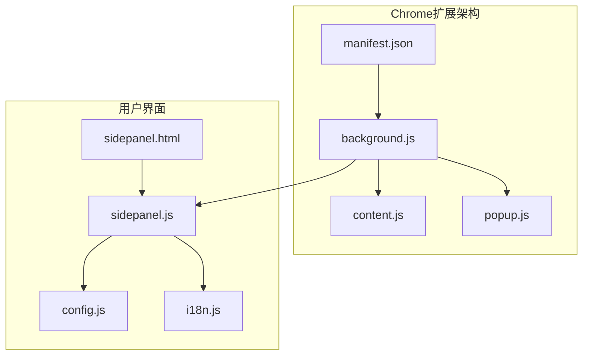
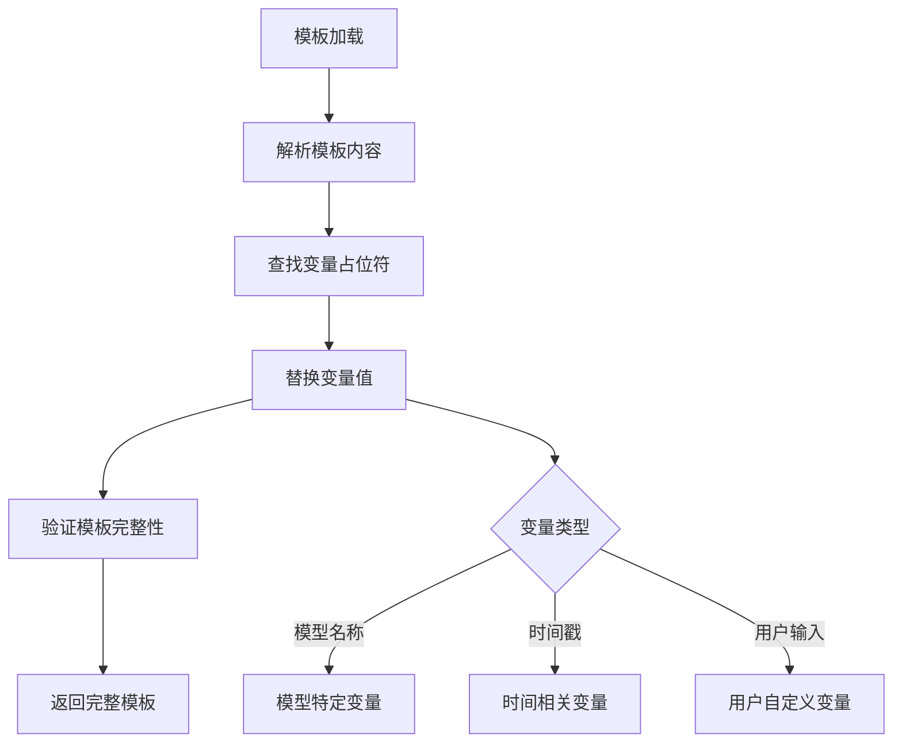
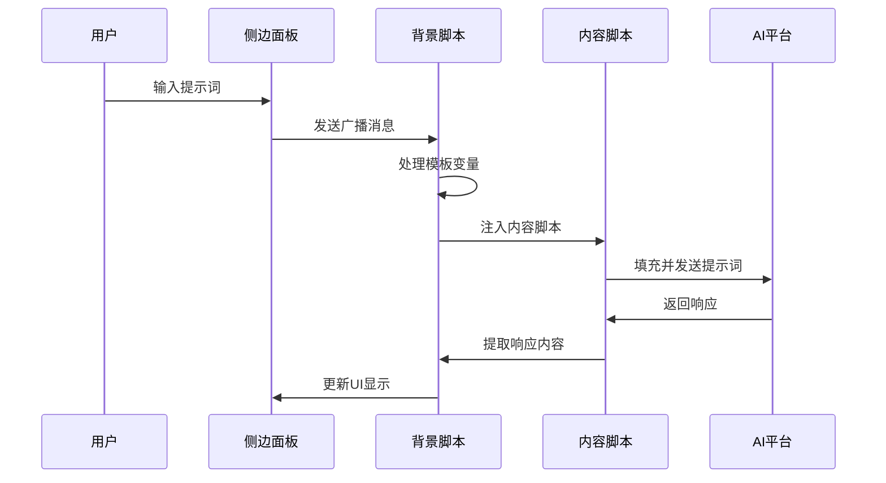
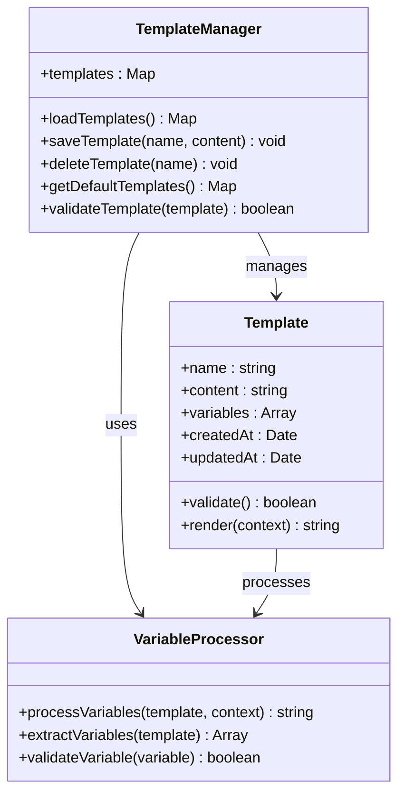
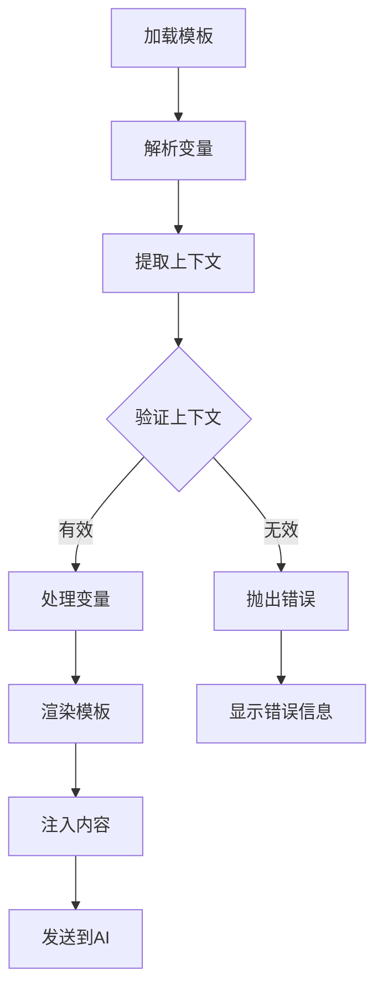
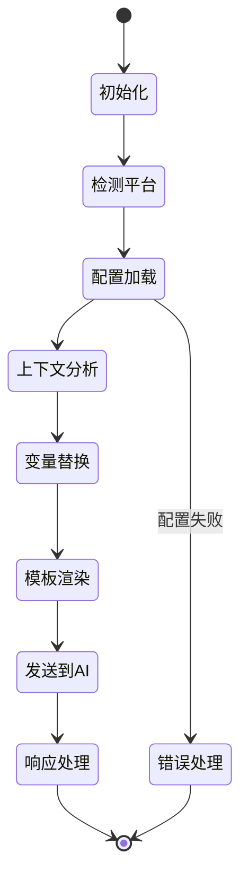
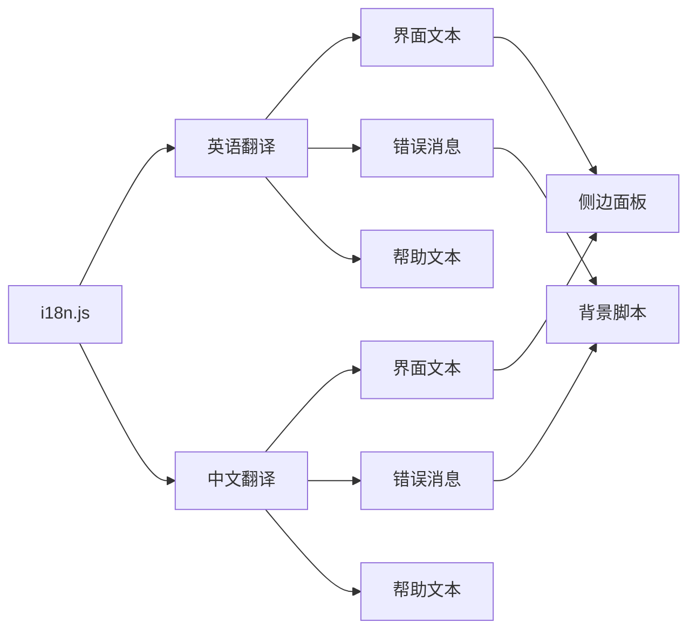
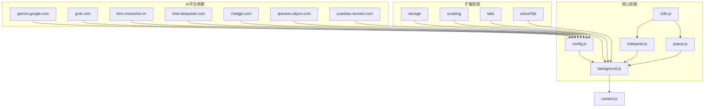
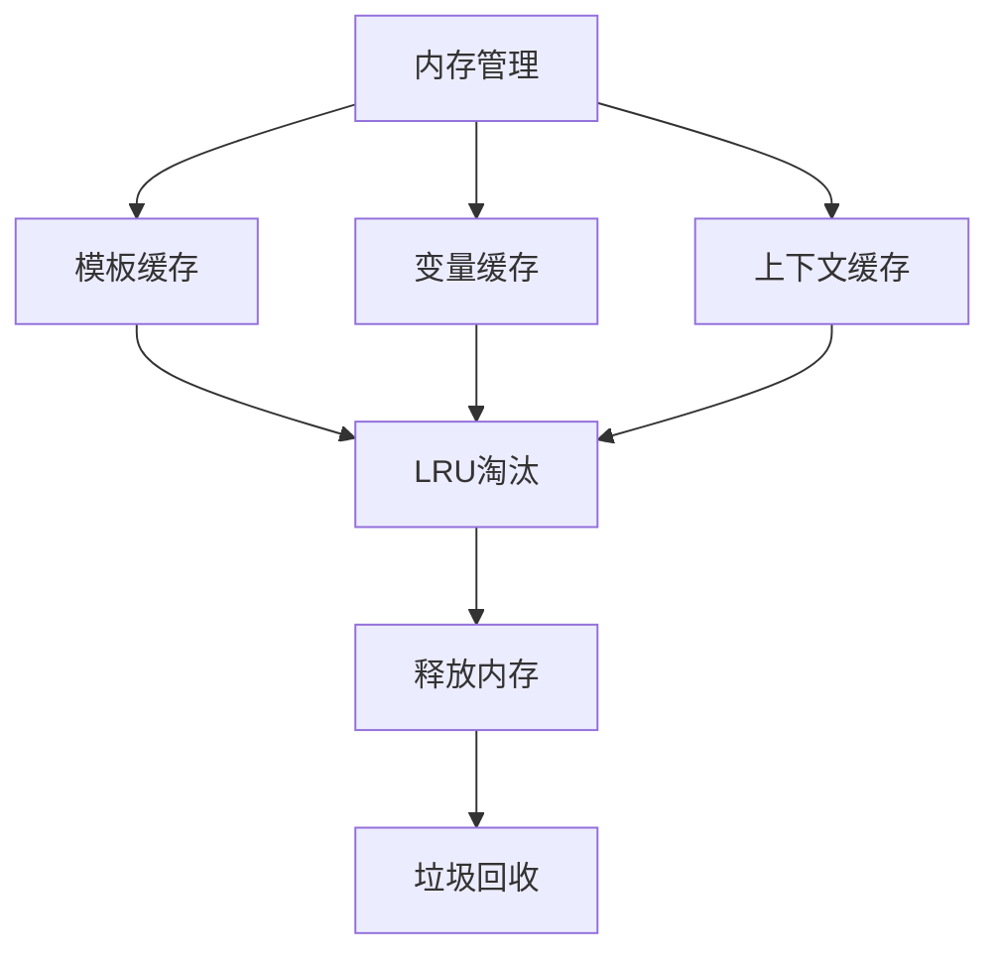

# 提示词模板系统

<cite>
**本文档引用的文件**
- [manifest.json](file://manifest.json)
- [background.js](file://src/background.js)
- [sidepanel.js](file://src/sidepanel/sidepanel.js)
- [sidepanel.html](file://src/sidepanel/sidepanel.html)
- [config.js](file://src/config.js)
- [content.js](file://src/content/content.js)
- [i18n.js](file://src/i18n.js)
- [popup.js](file://src/popup/popup.js)
</cite>

## 目录
1. [简介](#简介)
2. [项目结构](#项目结构)
3. [核心组件](#核心组件)
4. [架构概览](#架构概览)
5. [详细组件分析](#详细组件分析)
6. [依赖关系分析](#依赖关系分析)
7. [性能考虑](#性能考虑)
8. [故障排除指南](#故障排除指南)
9. [结论](#结论)

## 简介

AI Multiverse 提示词模板系统是一个强大的多AI平台集成工具，支持同时与多个AI服务（Gemini、Grok、Kimi、DeepSeek、ChatGPT、Qwen、腾讯元宝）进行交互。该系统的核心功能包括智能总结、模板管理和跨平台适配。

系统采用Chrome扩展架构，通过背景脚本协调各AI平台的通信，侧边面板提供用户友好的界面，内容脚本负责与具体AI网站的交互。

## 项目结构

**图表来源**
- [manifest.json](file://manifest.json#L1-L79)
- [background.js](file://src/background.js#L1-L100)
- [sidepanel.js](file://src/sidepanel/sidepanel.js#L1-L100)

**章节来源**
- [manifest.json](file://manifest.json#L1-L79)
- [config.js](file://src/config.js#L1-L204)

## 核心组件

### 默认提示词模板设计

系统内置了完整的英文和中文智能总结模板：

**英文默认模板特点：**
- 结构化输出格式（摘要标题、关键要点、分歧观点、独特见解、最终答案）
- 明确的输入格式说明
- 模型贡献标注机制
- 700+字符的完整指导框架

**中文默认模板特点：**
- 对应的中文表述和格式要求
- 语义等价的结构化指导
- 适合中文用户的表达习惯

### 模板变量系统

系统采用灵活的变量替换机制：

**图表来源**
- [sidepanel.js](file://src/sidepanel/sidepanel.js#L258-L335)

**章节来源**
- [sidepanel.js](file://src/sidepanel/sidepanel.js#L258-L335)

## 架构概览

**图表来源**
- [background.js](file://src/background.js#L138-L197)
- [content.js](file://src/content/content.js#L322-L342)

## 详细组件分析

### 模板管理系统

#### 模板存储结构
系统采用本地存储机制管理用户自定义模板：

**图表来源**
- [sidepanel.js](file://src/sidepanel/sidepanel.js#L1200-L1276)

#### 模板渲染流程

**图表来源**
- [sidepanel.js](file://src/sidepanel/sidepanel.js#L1249-L1268)

### AI模型适配策略

#### 模型特定配置
系统为每个AI平台提供专门的配置：

| 平台 | 填充方法 | 发送方式 | 文件支持 | 特殊处理 |
|------|----------|----------|----------|----------|
| Gemini | 主世界 | 按钮 | 是 | Tiptap编辑器 |
| Grok | 主世界 | 按钮 | 是 | ProseMirror编辑器 |
| Kimi | 内容脚本 | 按钮 | 是 | 稳定的粘贴行为 |
| DeepSeek | 主世界 | Enter键 | 是 | Enter键提交 |
| ChatGPT | 主世界 | 按钮 | 是 | React输入框 |
| Qwen | 主世界 | Enter键 | 是 | 多种输入类型 |
| 腾讯元宝 | 主世界 | 按钮 | 是 | 专用发送按钮 |

#### 上下文感知机制

**图表来源**
- [config.js](file://src/config.js#L5-L199)
- [content.js](file://src/content/content.js#L127-L197)

**章节来源**
- [config.js](file://src/config.js#L5-L199)
- [content.js](file://src/content/content.js#L127-L197)

### 国际化支持

系统提供完整的多语言支持：

**图表来源**
- [i18n.js](file://src/i18n.js#L6-L346)

**章节来源**
- [i18n.js](file://src/i18n.js#L6-L346)

## 依赖关系分析

**图表来源**
- [manifest.json](file://manifest.json#L12-L32)
- [config.js](file://src/config.js#L5-L199)

**章节来源**
- [manifest.json](file://manifest.json#L12-L32)
- [config.js](file://src/config.js#L5-L199)

## 性能考虑

### 模板处理优化

系统采用多种优化策略确保模板处理的高效性：

1. **延迟加载**：模板按需加载，避免不必要的内存占用
2. **缓存机制**：常用模板和变量组合进行缓存
3. **异步处理**：模板渲染采用异步方式，不影响UI响应
4. **增量更新**：只更新变化的模板部分

### 内存管理

## 故障排除指南

### 常见问题及解决方案

| 问题类型 | 症状 | 可能原因 | 解决方案 |
|----------|------|----------|----------|
| 模板变量替换失败 | 变量显示为原始占位符 | 变量名不匹配或上下文缺失 | 检查变量定义和上下文数据 |
| AI平台适配错误 | 无法正确填充输入框 | 选择器失效或平台更新 | 更新AI配置或选择器 |
| 国际化文本显示异常 | 界面文本显示为键名 | 翻译文件加载失败 | 检查i18n.js文件和网络连接 |
| 性能问题 | 模板渲染缓慢 | 模板过于复杂或变量过多 | 简化模板结构或减少变量数量 |

### 调试工具

系统提供内置的调试功能：

1. **控制台日志**：详细的执行过程记录
2. **状态指示器**：实时显示系统状态
3. **错误报告**：自动收集和报告错误信息
4. **性能监控**：监控模板处理时间和资源使用

**章节来源**
- [background.js](file://src/background.js#L138-L197)
- [sidepanel.js](file://src/sidepanel/sidepanel.js#L1200-L1276)

## 结论

AI Multiverse 提示词模板系统通过精心设计的架构和完善的组件体系，为用户提供了一个强大而灵活的多AI平台集成解决方案。系统的核心优势包括：

1. **模块化设计**：清晰的组件分离和职责划分
2. **灵活的模板系统**：支持复杂的变量替换和上下文感知
3. **广泛的平台适配**：针对不同AI平台的特定优化
4. **国际化支持**：完整的多语言界面和内容
5. **性能优化**：高效的模板处理和内存管理

该系统为后续的功能扩展和维护奠定了坚实的基础，能够满足用户在多AI平台场景下的各种需求。