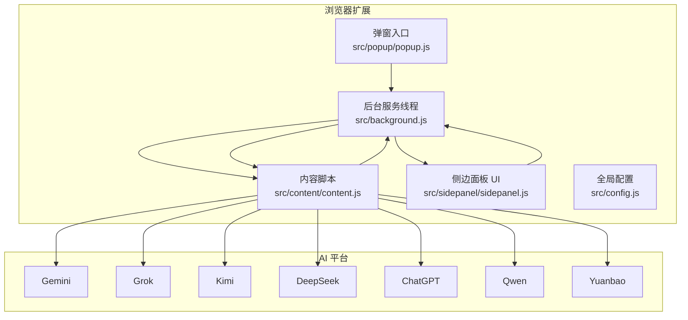
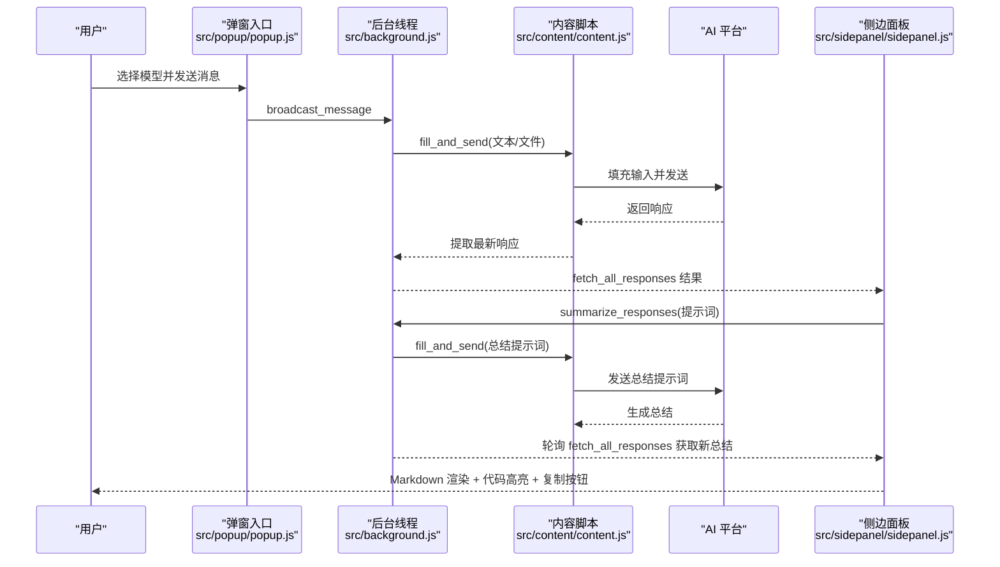
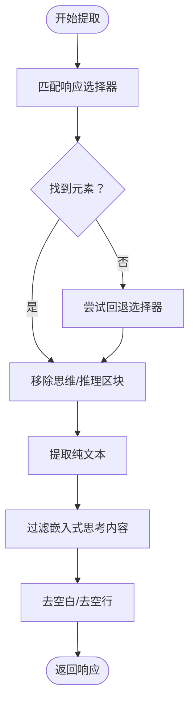
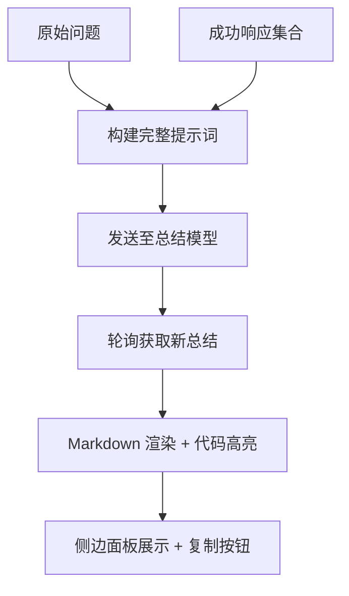
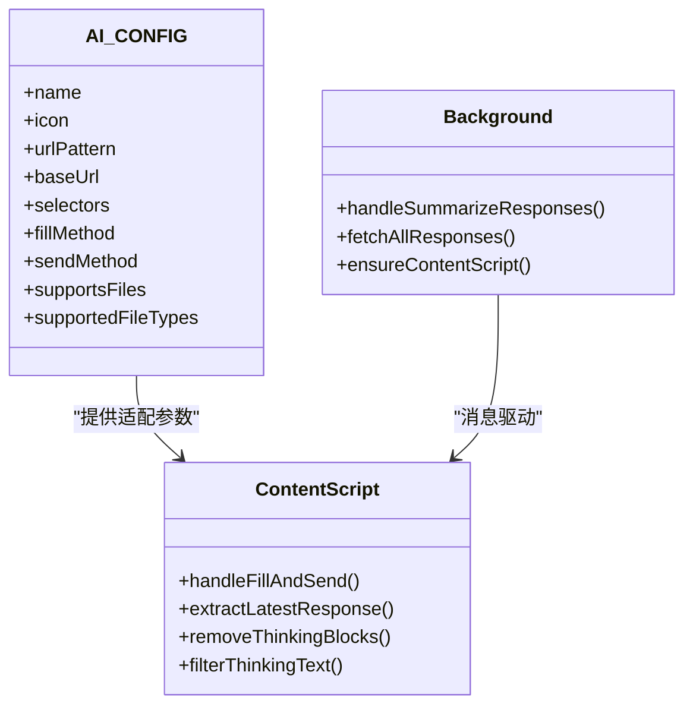
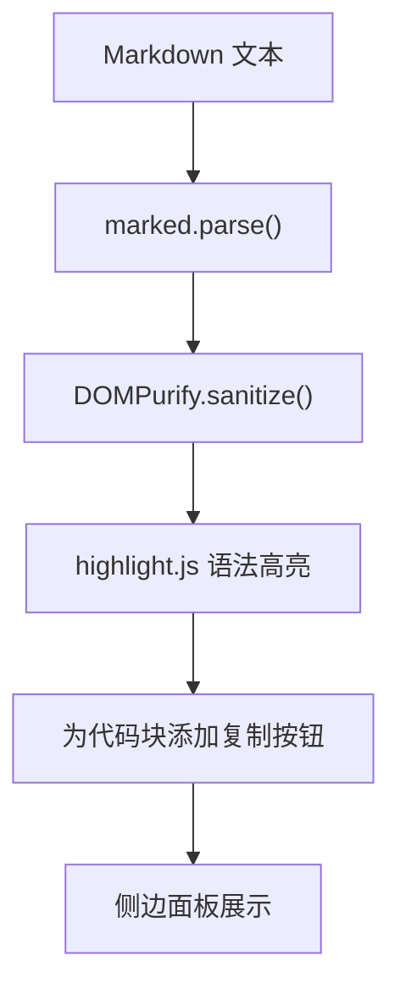
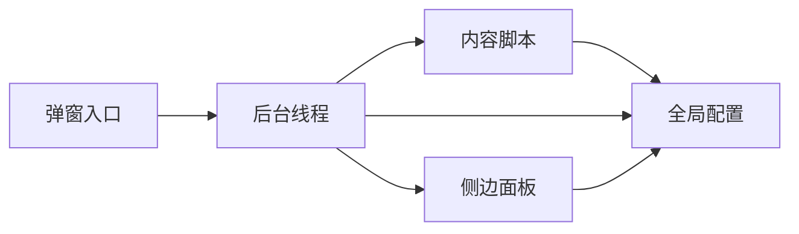

# 智能总结功能

<cite>
**本文引用的文件**
- [README.md](file://README.md)
- [manifest.json](file://manifest.json)
- [src/config.js](file://src/config.js)
- [src/background.js](file://src/background.js)
- [src/content/content.js](file://src/content/content.js)
- [src/sidepanel/sidepanel.js](file://src/sidepanel/sidepanel.js)
- [src/popup/popup.js](file://src/popup/popup.js)
- [SUMMARIZATION_REDESIGN_v1.7.8.md](file://SUMMARIZATION_REDESIGN_v1.7.8.md)
- [SUMMARIZATION_BUGFIX_v1.7.8.md](file://SUMMARIZATION_BUGFIX_v1.7.8.md)
</cite>

## 目录
1. [简介](#简介)
2. [项目结构](#项目结构)
3. [核心组件](#核心组件)
4. [架构总览](#架构总览)
5. [详细组件分析](#详细组件分析)
6. [依赖关系分析](#依赖关系分析)
7. [性能考量](#性能考量)
8. [故障排查指南](#故障排查指南)
9. [结论](#结论)
10. [附录](#附录)

## 简介
本文件系统性阐述“智能总结功能”的设计理念与实现策略，覆盖跨平台响应聚合、内容筛选与结构化输出、提示词模板系统、模型选择机制、输出格式化处理（Markdown 渲染、代码高亮、响应美化）、配置选项与使用案例等。目标是帮助开发者与使用者全面理解该功能的端到端工作流与可扩展点。

## 项目结构
该项目为 Chrome 扩展，采用原生 JS + HTML + CSS 构建，核心模块围绕“后台服务线程 + 内容脚本 + 侧边面板 UI + 弹窗入口”协同工作，形成“广播发送 → 响应采集 → 智能总结 → 结果展示”的闭环。

图表来源
- [manifest.json](file://manifest.json#L45-L68)
- [src/background.js](file://src/background.js#L138-L197)
- [src/content/content.js](file://src/content/content.js#L200-L216)
- [src/config.js](file://src/config.js#L5-L199)

章节来源
- [README.md](file://README.md#L20-L29)
- [manifest.json](file://manifest.json#L1-L79)

## 核心组件
- 后台服务线程：负责窗口管理、消息路由、跨标签通信、发起总结请求、轮询获取结果。
- 内容脚本：在各 AI 页面内注入，负责提取最新响应、清理思维过程、填充输入并发送。
- 侧边面板 UI：提供 Markdown 渲染、代码高亮、复制按钮、总结设置、历史记录展示。
- 弹窗入口：快速选择模型并广播消息。
- 全局配置：统一管理各平台的选择器、发送方式、文件支持等。

章节来源
- [src/background.js](file://src/background.js#L138-L197)
- [src/content/content.js](file://src/content/content.js#L218-L320)
- [src/sidepanel/sidepanel.js](file://src/sidepanel/sidepanel.js#L6-L39)
- [src/popup/popup.js](file://src/popup/popup.js#L1-L61)
- [src/config.js](file://src/config.js#L5-L199)

## 架构总览
智能总结功能的端到端流程如下：

图表来源
- [src/popup/popup.js](file://src/popup/popup.js#L16-L45)
- [src/background.js](file://src/background.js#L138-L197)
- [src/content/content.js](file://src/content/content.js#L200-L216)
- [src/sidepanel/sidepanel.js](file://src/sidepanel/sidepanel.js#L2223-L2454)

## 详细组件分析

### 跨平台响应聚合与内容筛选
- 响应提取：内容脚本按平台配置的响应选择器定位最新回复，支持回退策略与 SVG 兼容。
- 思维过滤：针对特定平台（如 Yuanbao）移除深度搜索的“思考”区块；对通用平台移除包含“thinking/reasoning”关键词的节点与折叠块。
- 文本清洗：去除 HTML 标签，过滤嵌入式“思考”文本片段，确保仅保留最终答案。

图表来源
- [src/content/content.js](file://src/content/content.js#L218-L320)
- [src/content/content.js](file://src/content/content.js#L50-L124)

章节来源
- [src/content/content.js](file://src/content/content.js#L218-L320)
- [src/content/content.js](file://src/content/content.js#L50-L124)

### 结构化输出机制与提示词模板系统
- 默认模板：内置英文/中文两套强大提示词模板，涵盖“输入、指导原则、输出格式”，要求模型按结构化方式输出。
- 自定义模板：侧边面板支持加载/保存自定义提示词，支持“使用默认”“重置”等快捷操作。
- 语言感知：根据当前语言环境选择对应模板与本地化文案。
- 提示词构建：将“原始问题 + 各模型响应”拼接为完整提示词，记录长度与首尾片段便于调试。

图表来源
- [src/sidepanel/sidepanel.js](file://src/sidepanel/sidepanel.js#L2286-L2298)
- [src/sidepanel/sidepanel.js](file://src/sidepanel/sidepanel.js#L2347-L2351)
- [src/sidepanel/sidepanel.js](file://src/sidepanel/sidepanel.js#L2364-L2436)

章节来源
- [src/sidepanel/sidepanel.js](file://src/sidepanel/sidepanel.js#L258-L335)
- [src/sidepanel/sidepanel.js](file://src/sidepanel/sidepanel.js#L2172-L2218)
- [src/sidepanel/sidepanel.js](file://src/sidepanel/sidepanel.js#L2286-L2298)
- [src/sidepanel/sidepanel.js](file://src/sidepanel/sidepanel.js#L2347-L2351)
- [src/sidepanel/sidepanel.js](file://src/sidepanel/sidepanel.js#L2364-L2436)

### 模型选择机制与适配策略
- 平台适配：全局配置集中维护各平台的选择器、发送方式、文件支持等，内容脚本按配置执行填充与发送。
- 总结模型：侧边面板支持选择任意受支持平台作为“总结模型”，后台线程负责打开对应标签并发送提示词。
- 交互策略：不同平台对“输入填充/发送方式”差异较大（主世界填充 vs 内容脚本填充；按钮点击 vs 回车键），通过配置字段统一抽象。

图表来源
- [src/config.js](file://src/config.js#L5-L199)
- [src/content/content.js](file://src/content/content.js#L323-L418)
- [src/background.js](file://src/background.js#L298-L376)

章节来源
- [src/config.js](file://src/config.js#L5-L199)
- [src/content/content.js](file://src/content/content.js#L323-L418)
- [src/background.js](file://src/background.js#L298-L376)

### 输出格式化处理（Markdown 渲染、代码高亮、美化）
- Markdown 渲染：marked.js 配置高亮回调，自动识别语言并高亮；支持换行、GFM、防 XSS。
- DOMPurify 清洗：防止注入风险，白名单标签与属性。
- 代码块美化：为代码块添加复制按钮，支持一键复制。
- 历史展示：总结结果以独立历史项呈现，包含“由某模型生成”“复制”等操作。

图表来源
- [src/sidepanel/sidepanel.js](file://src/sidepanel/sidepanel.js#L6-L39)
- [src/sidepanel/sidepanel.js](file://src/sidepanel/sidepanel.js#L70-L123)
- [src/sidepanel/sidepanel.js](file://src/sidepanel/sidepanel.js#L140-L187)
- [src/sidepanel/sidepanel.js](file://src/sidepanel/sidepanel.js#L2717-L2787)

章节来源
- [src/sidepanel/sidepanel.js](file://src/sidepanel/sidepanel.js#L6-L39)
- [src/sidepanel/sidepanel.js](file://src/sidepanel/sidepanel.js#L70-L123)
- [src/sidepanel/sidepanel.js](file://src/sidepanel/sidepanel.js#L140-L187)
- [src/sidepanel/sidepanel.js](file://src/sidepanel/sidepanel.js#L2717-L2787)

### 配置选项与使用案例
- 模型参数调整：通过全局配置文件统一管理，包括选择器、发送方式、文件类型等。
- 输出长度控制：轮询检测时以字符数阈值（如 >100）判定新总结出现，避免过早截断。
- 格式定制：侧边面板支持自定义提示词、使用默认模板、重置提示词；历史项样式与徽章可定制。
- 使用案例：
  - 场景一：多模型并发问答后，自动触发总结，侧边面板实时显示“生成中”“结果”“复制”。
  - 场景二：自定义提示词强调“一致性/差异性/独特洞察”，输出结构化摘要。
  - 场景三：长文本总结 + 代码块 + 表格，均支持复制与滚动查看。

章节来源
- [src/config.js](file://src/config.js#L5-L199)
- [src/sidepanel/sidepanel.js](file://src/sidepanel/sidepanel.js#L2172-L2218)
- [src/sidepanel/sidepanel.js](file://src/sidepanel/sidepanel.js#L2364-L2436)
- [SUMMARIZATION_REDESIGN_v1.7.8.md](file://SUMMARIZATION_REDESIGN_v1.7.8.md#L1-L262)
- [SUMMARIZATION_BUGFIX_v1.7.8.md](file://SUMMARIZATION_BUGFIX_v1.7.8.md#L1-L320)

## 依赖关系分析
- 通信层：后台线程与内容脚本通过消息通道协作；侧边面板通过后台间接与内容脚本通信。
- 配置层：全局配置集中管理平台差异，内容脚本与后台线程共享该配置。
- UI 层：侧边面板负责渲染与交互；弹窗入口负责快速广播。

图表来源
- [manifest.json](file://manifest.json#L45-L68)
- [src/background.js](file://src/background.js#L138-L197)
- [src/config.js](file://src/config.js#L5-L199)

章节来源
- [manifest.json](file://manifest.json#L1-L79)
- [src/background.js](file://src/background.js#L138-L197)
- [src/config.js](file://src/config.js#L5-L199)

## 性能考量
- 轮询策略：每秒轮询一次，最长轮询约 2 分钟，兼顾及时性与资源消耗。
- 选择器匹配：按优先级尝试多个选择器，失败即回退，避免长时间阻塞。
- 渲染优化：marked.js + DOMPurify + highlight.js 的组合在可接受范围内；大文本建议分段或懒加载。
- 并发控制：防止重复总结（isSummarizing 标志），避免重复触发。

## 故障排查指南
- 提示词截断：检查完整提示词的长度与首尾片段日志，确认问题是否由输入截断引起。
- 无结果显示：确认轮询是否启动、fetch_all_responses 是否返回有效数据、是否有新响应产生。
- 显示异常：检查 Markdown 渲染与高亮初始化是否成功，确认 DOMPurify 白名单配置。
- 模型未响应：检查后台线程是否成功打开对应标签、内容脚本是否注入、选择器是否匹配。

章节来源
- [SUMMARIZATION_BUGFIX_v1.7.8.md](file://SUMMARIZATION_BUGFIX_v1.7.8.md#L1-L320)
- [src/sidepanel/sidepanel.js](file://src/sidepanel/sidepanel.js#L2364-L2436)

## 结论
智能总结功能通过“统一配置 + 内容脚本 + 后台线程 + 侧边面板 UI”的协同，实现了跨平台响应聚合、结构化输出与美观展示。其提示词模板系统支持语言切换与自定义，模型选择灵活，轮询机制保障结果可达，Markdown 渲染与代码高亮提升了阅读体验。未来可在 WebSocket 推送、总结历史持久化、多模型对比等方面进一步优化。

## 附录
- 相关变更记录与设计文档：参见智能总结相关修复与重设计文档。
- 项目安装与使用：参见项目根目录说明文件。

章节来源
- [SUMMARIZATION_REDESIGN_v1.7.8.md](file://SUMMARIZATION_REDESIGN_v1.7.8.md#L1-L262)
- [SUMMARIZATION_BUGFIX_v1.7.8.md](file://SUMMARIZATION_BUGFIX_v1.7.8.md#L1-L320)
- [README.md](file://README.md#L30-L107)