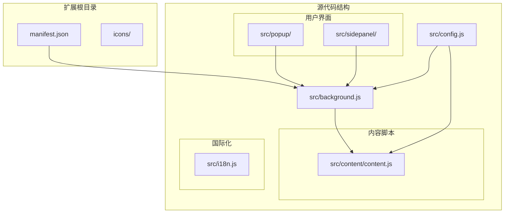
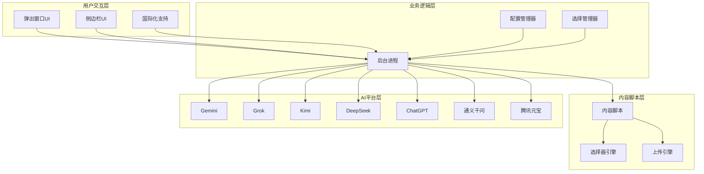
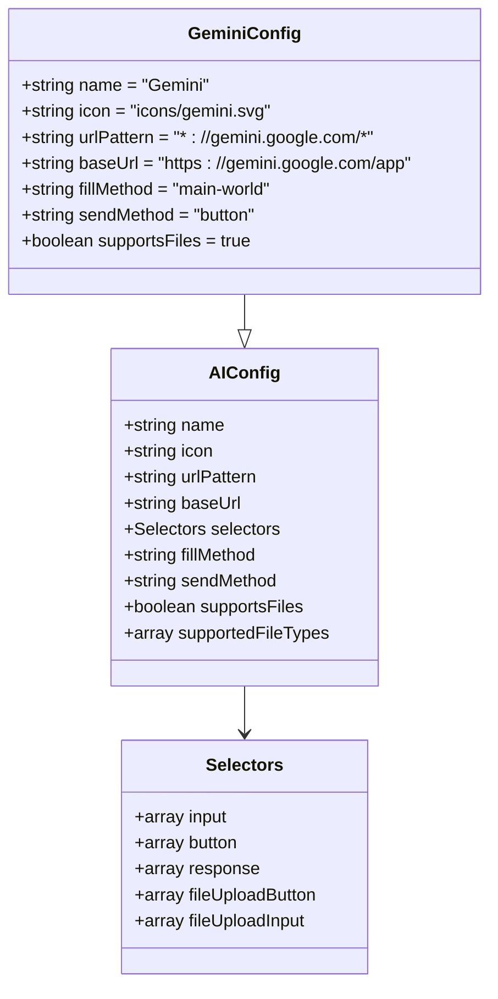
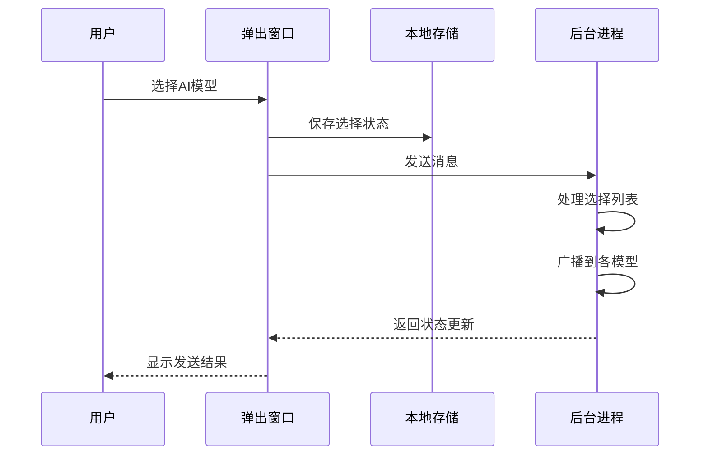
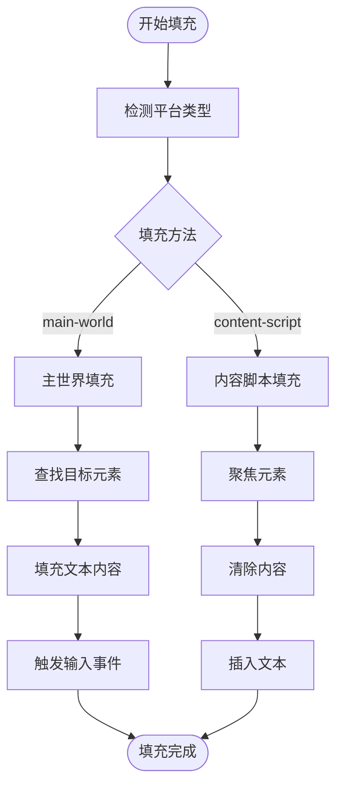
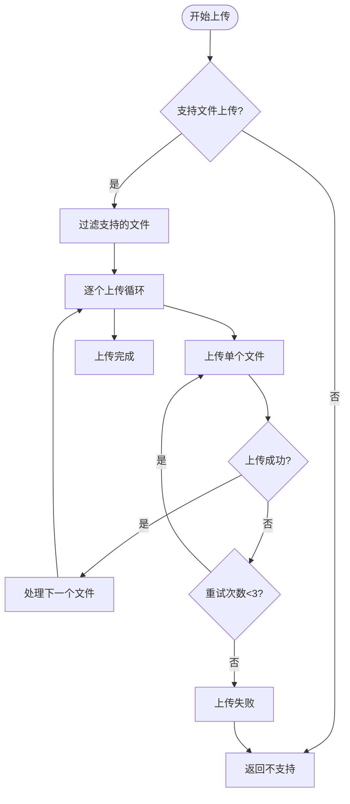
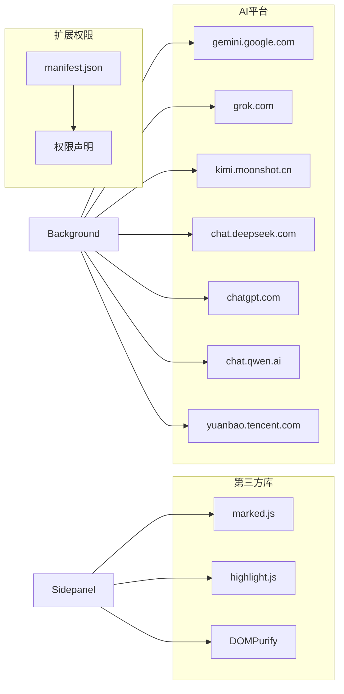
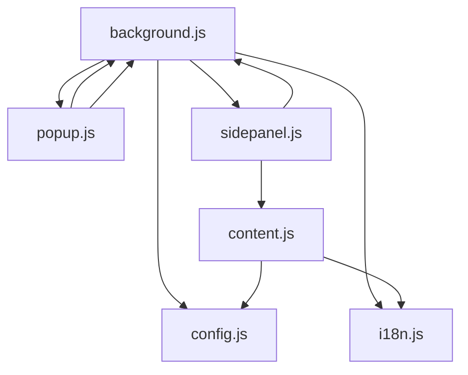

# 模型选择机制

<cite>
**本文档引用的文件**
- [manifest.json](file://manifest.json)
- [config.js](file://src/config.js)
- [background.js](file://src/background.js)
- [popup.js](file://src/popup/popup.js)
- [sidepanel.js](file://src/sidepanel/sidepanel.js)
- [content.js](file://src/content/content.js)
- [popup.html](file://src/popup/popup.html)
- [sidepanel.html](file://src/sidepanel/sidepanel.html)
- [i18n.js](file://src/i18n.js)
- [README.md](file://README.md)
</cite>

## 目录
1. [简介](#简介)
2. [项目结构](#项目结构)
3. [核心组件](#核心组件)
4. [架构概览](#架构概览)
5. [详细组件分析](#详细组件分析)
6. [依赖关系分析](#依赖关系分析)
7. [性能考虑](#性能考虑)
8. [故障排除指南](#故障排除指南)
9. [结论](#结论)

## 简介

AI Multiverse Chat 是一个Chrome扩展程序，支持同时向多个AI聊天平台发送消息。该项目的核心机制是模型选择系统，它允许用户选择Gemini、Grok、Kimi、DeepSeek、ChatGPT、通义千问和腾讯元宝等AI模型，并提供统一的配置管理和状态同步。

该系统通过配置驱动的方式管理不同AI平台的差异，包括选择器策略、发送方法、文件上传支持等特性。系统采用分层架构设计，确保了良好的可维护性和扩展性。

## 项目结构

项目采用模块化设计，主要包含以下核心目录：

**图表来源**
- [manifest.json](file://manifest.json#L1-L79)
- [config.js](file://src/config.js#L1-L204)

**节来源**
- [README.md](file://README.md#L20-L29)

## 核心组件

### 配置管理系统

系统通过集中式配置管理所有支持的AI模型，每个模型都有详细的配置参数：

| 配置项 | 描述 | 示例值 |
|--------|------|--------|
| `name` | 模型显示名称 | 'Gemini' |
| `icon` | 图标路径 | 'icons/gemini.svg' |
| `baseUrl` | 基础URL | 'https://gemini.google.com/app' |
| `selectors` | DOM选择器集合 | 包含input、button、response等 |
| `fillMethod` | 输入填充方法 | 'main-world' 或 'content-script' |
| `sendMethod` | 发送方法 | 'button'、'enter' 或 'form' |
| `supportsFiles` | 是否支持文件上传 | true/false |
| `supportedFileTypes` | 支持的文件类型 | 数组形式 |

### 模型选择界面

系统提供两种用户界面进行模型选择：

1. **弹出窗口界面** (`src/popup/popup.html`)
   - 简化的模型选择界面
   - 适合快速发送消息
   - 默认勾选所有模型

2. **侧边栏界面** (`src/sidepanel/sidepanel.html`)
   - 功能完整的对话管理界面
   - 支持响应查看、历史记录、文件上传
   - 模态导航系统

**节来源**
- [config.js](file://src/config.js#L5-L199)
- [popup.html](file://src/popup/popup.html#L16-L33)
- [sidepanel.html](file://src/sidepanel/sidepanel.html#L193-L246)

## 架构概览

系统采用分层架构设计，确保各组件职责明确：

**图表来源**
- [background.js](file://src/background.js#L1-L1028)
- [content.js](file://src/content/content.js#L1-L941)
- [config.js](file://src/config.js#L1-L204)

## 详细组件分析

### 配置系统分析

#### 模型配置结构

每个AI模型的配置包含以下关键要素：

**图表来源**
- [config.js](file://src/config.js#L5-L22)
- [config.js](file://src/config.js#L11-L17)

#### 模型配置差异

| 模型 | 填充方法 | 发送方法 | 文件支持 | 特殊配置 |
|------|----------|----------|----------|----------|
| Gemini | main-world | button | ✅ | 支持多类型文件 |
| Grok | main-world | button | ✅ | 支持图片和PDF |
| Kimi | content-script | button | ✅ | 避免重复事件 |
| DeepSeek | main-world | enter | ✅ | 使用Enter键提交 |
| ChatGPT | main-world | button | ✅ | 支持多种文件类型 |
| 通义千问 | main-world | enter | ✅ | 使用Enter键提交 |
| 腾讯元宝 | main-world | button | ✅ | 支持图片和文档 |

**节来源**
- [config.js](file://src/config.js#L6-L199)

### 选择管理器

#### 用户界面选择

**图表来源**
- [popup.js](file://src/popup/popup.js#L16-L45)
- [sidepanel.js](file://src/sidepanel/sidepanel.js#L1314-L1341)

#### 侧边栏模型选择

侧边栏提供更丰富的模型选择体验：

1. **模态选择器** (`src/sidepanel/sidepanel.html`)
   - 网格布局展示所有模型
   - 图标和名称显示
   - 实时状态指示

2. **状态管理** (`src/sidepanel/sidepanel.js`)
   - 选择计数徽章
   - 本地存储持久化
   - 实时状态更新

**节来源**
- [sidepanel.js](file://src/sidepanel/sidepanel.js#L391-L408)
- [sidepanel.js](file://src/sidepanel/sidepanel.js#L1314-L1341)

### 内容脚本执行引擎

#### 主世界填充机制

**图表来源**
- [content.js](file://src/content/content.js#L323-L418)
- [background.js](file://src/background.js#L379-L526)

#### 发送机制

不同模型采用不同的发送策略：

| 模型 | 发送方法 | 行为描述 |
|------|----------|----------|
| Gemini | button | 点击发送按钮 |
| Grok | button | 点击发送按钮 |
| Kimi | button | 点击发送按钮（避免Enter回退） |
| DeepSeek | enter | 按Enter键提交 |
| ChatGPT | button | 点击发送按钮 |
| 通义千问 | enter | 按Enter键提交 |
| 腾讯元宝 | button | 点击发送按钮 |

**节来源**
- [content.js](file://src/content/content.js#L466-L565)

### 文件上传处理

#### 上传策略

**图表来源**
- [content.js](file://src/content/content.js#L616-L742)

#### 文件类型支持

| 模型 | 支持的文件类型 | 限制 |
|------|----------------|------|
| Gemini | image/*, .pdf, .txt, .doc, .docx | 10MB/文件 |
| Grok | image/*, .pdf, .txt | 10MB/文件 |
| Kimi | image/*, .pdf, .txt, .doc, .docx, .md, .json, .csv | 10MB/文件 |
| DeepSeek | image/* | 10MB/文件 |
| ChatGPT | image/*, .pdf, .txt, .md, .json, .csv, .py, .js | 10MB/文件 |
| 通义千问 | .pdf, .doc, .docx, .txt, .md, .json, .csv, image/* | 10MB/文件 |
| 腾讯元宝 | image/*, .pdf, .doc, .docx, .txt, .md | 10MB/文件 |

**节来源**
- [config.js](file://src/config.js#L21-L199)

## 依赖关系分析

### 外部依赖

系统依赖以下外部资源：

**图表来源**
- [manifest.json](file://manifest.json#L12-L32)
- [sidepanel.html](file://src/sidepanel/sidepanel.html#L13-L15)

### 内部模块依赖

**图表来源**
- [background.js](file://src/background.js#L69-L74)
- [sidepanel.js](file://src/sidepanel/sidepanel.js#L395-L397)

**节来源**
- [manifest.json](file://manifest.json#L19-L69)

## 性能考虑

### 响应速度优化

系统通过以下机制优化响应速度：

1. **并行处理**：同时向多个AI模型发送消息
2. **智能等待**：根据模型特性调整等待时间
3. **缓存策略**：本地存储用户偏好设置
4. **延迟加载**：按需加载内容脚本

### 成本控制策略

1. **文件大小限制**：每文件10MB，总50MB限制
2. **重试机制**：最多3次重试，指数退避
3. **超时控制**：30秒上传超时
4. **资源清理**：及时释放文件对象URL

### 兼容性处理

系统采用多层次兼容性策略：

1. **选择器回退**：每个模型提供3-5个备用选择器
2. **平台特定优化**：针对不同平台的UI差异进行适配
3. **错误恢复**：网络错误和DOM变化的自动恢复
4. **版本兼容**：支持多个AI平台的版本升级

## 故障排除指南

### 常见问题诊断

#### 选择器失效

**症状**：无法找到输入框或发送按钮
**解决方案**：
1. 检查AI平台URL匹配
2. 更新选择器配置
3. 查看调试输出

#### 发送失败

**症状**：消息发送后无响应
**解决方案**：
1. 验证网络连接
2. 检查AI平台登录状态
3. 尝试不同的发送方法

#### 文件上传错误

**症状**：文件上传超时或失败
**解决方案**：
1. 检查文件大小限制
2. 验证文件类型支持
3. 重新尝试上传

### 调试工具

系统提供以下调试功能：

1. **选择器诊断**：自动检测并报告选择器状态
2. **响应提取**：手动提取AI平台的最新回复
3. **状态监控**：实时显示各模型的连接状态

**节来源**
- [background.js](file://src/background.js#L163-L296)
- [content.js](file://src/content/content.js#L127-L197)

## 结论

AI Multiverse Chat的模型选择机制通过配置驱动的设计实现了高度的灵活性和可扩展性。系统的核心优势包括：

1. **统一配置管理**：通过集中式配置简化了多平台支持
2. **智能选择策略**：提供直观的用户界面和状态同步
3. **强大的兼容性**：多层次的适配机制确保跨平台稳定性
4. **性能优化**：并行处理和智能等待机制提升用户体验

该系统为AI模型选择提供了坚实的技术基础，支持未来扩展更多AI平台和功能增强。通过持续的维护和社区贡献，该系统将继续演进以满足不断变化的需求。