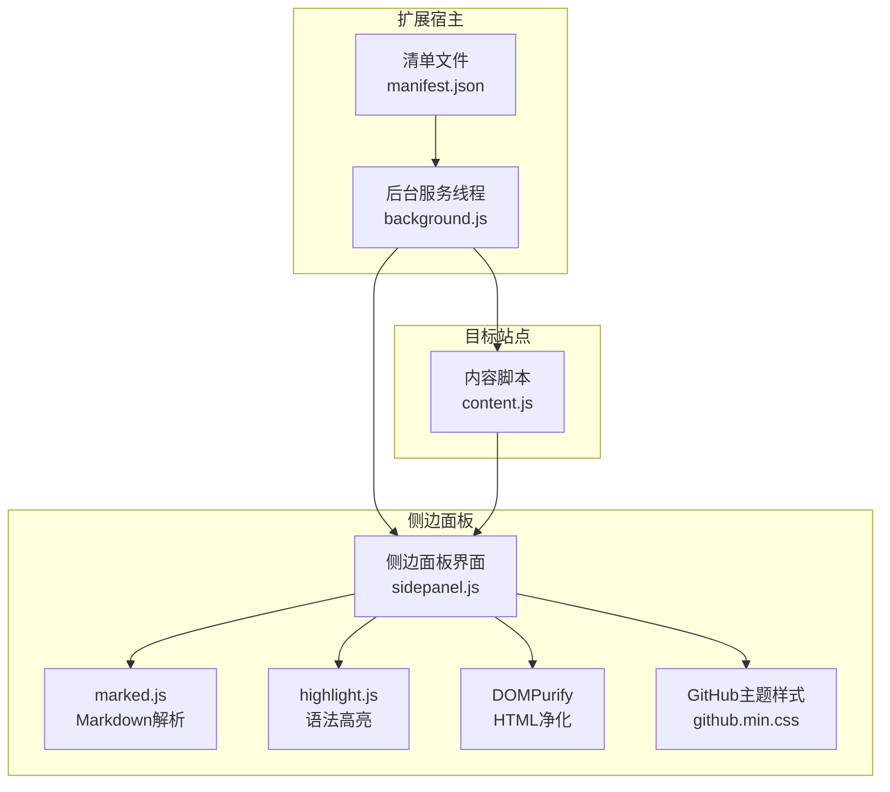
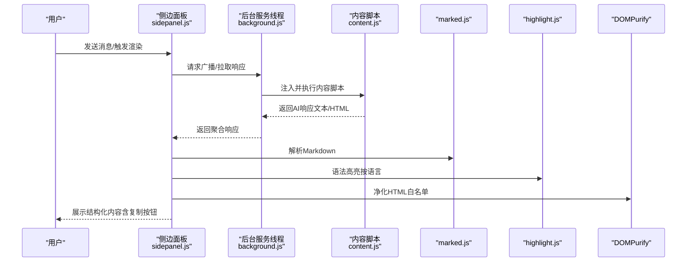
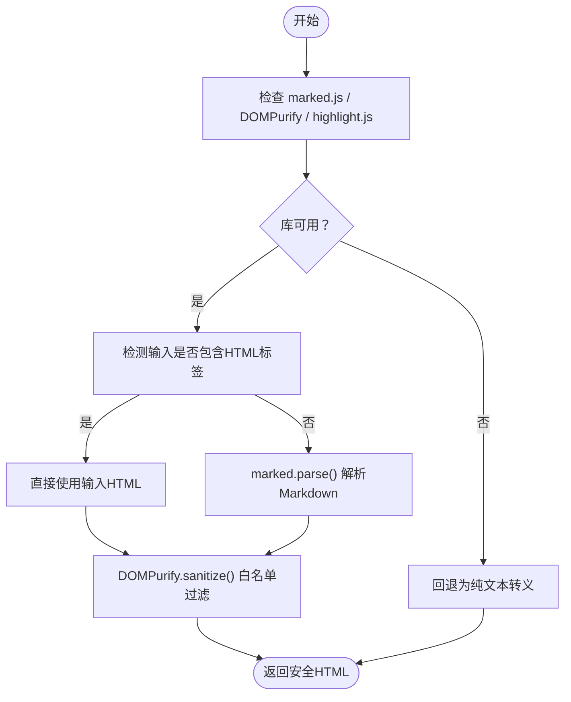
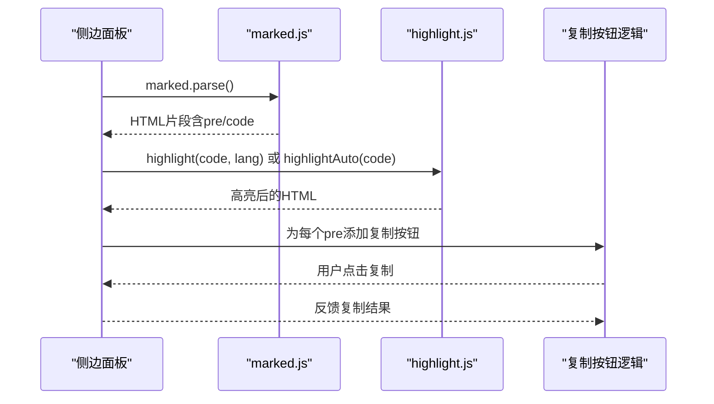
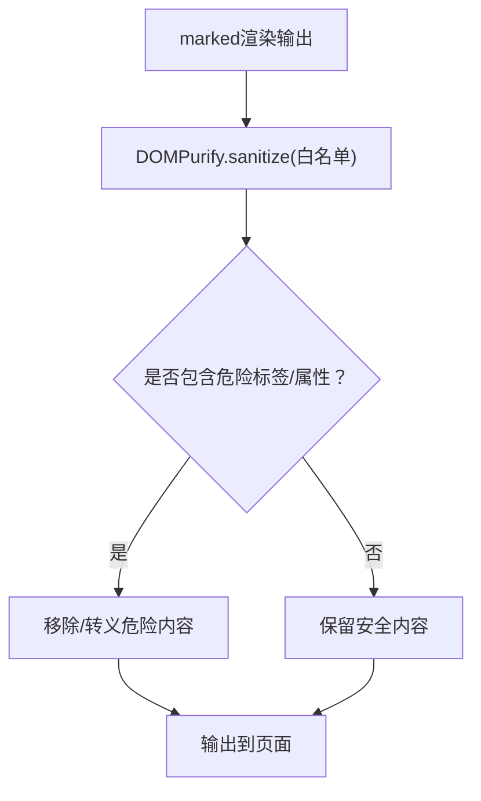
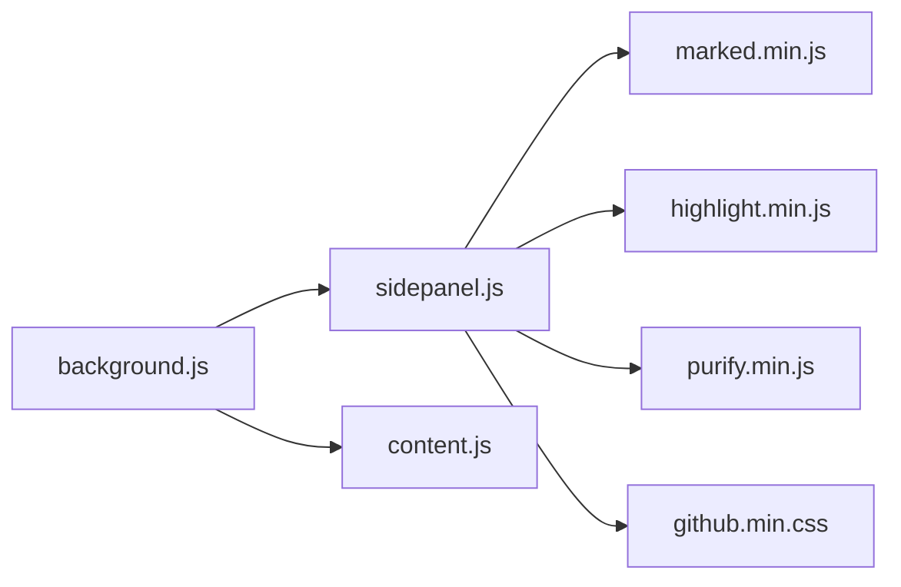

# 输出格式化处理

<cite>
**本文档引用的文件**
- [sidepanel.js](file://src/sidepanel/sidepanel.js)
- [content.js](file://src/content/content.js)
- [background.js](file://src/background.js)
- [manifest.json](file://manifest.json)
- [marked.min.js](file://src/lib/marked.min.js)
- [purify.min.js](file://src/lib/purify.min.js)
- [highlight.min.js](file://src/lib/highlight.min.js)
- [github.min.css](file://src/lib/github.min.css)
</cite>

## 目录
1. [简介](#简介)
2. [项目结构](#项目结构)
3. [核心组件](#核心组件)
4. [架构总览](#架构总览)
5. [详细组件分析](#详细组件分析)
6. [依赖关系分析](#依赖关系分析)
7. [性能考虑](#性能考虑)
8. [故障排除指南](#故障排除指南)
9. [结论](#结论)

## 简介
本文件系统性梳理该浏览器扩展在输出格式化处理方面的实现，重点覆盖：
- Markdown 渲染引擎（marked.js）的配置与使用
- 代码块语法高亮（highlight.js）与复制按钮集成
- HTML 安全过滤（DOMPurify）与 XSS 防护策略
- 响应内容结构化展示（标题、列表、链接等）
- 配置选项与自定义样式实现路径

## 项目结构
该扩展采用多页面架构：侧边面板负责交互与渲染，后台服务线程负责跨站点通信与调度，内容脚本负责注入目标站点的自动化交互。

图表来源
- [background.js](file://src/background.js#L1-L120)
- [sidepanel.js](file://src/sidepanel/sidepanel.js#L1-L120)
- [content.js](file://src/content/content.js#L1-L60)
- [manifest.json](file://manifest.json#L1-L80)

章节来源
- [manifest.json](file://manifest.json#L1-L80)
- [background.js](file://src/background.js#L1-L120)
- [sidepanel.js](file://src/sidepanel/sidepanel.js#L1-L120)
- [content.js](file://src/content/content.js#L1-L60)

## 核心组件
- Markdown 渲染与高亮：在侧边面板加载 marked.js 与 highlight.js，并通过 DOMPurify 进行安全过滤。
- HTML 安全过滤：使用 DOMPurify 对渲染后的 HTML 进行白名单过滤，防止 XSS。
- 结构化展示：统一的标题、列表、表格、链接等 Markdown 元素渲染。
- 复制按钮：为代码块添加一键复制能力，提升用户体验。

章节来源
- [sidepanel.js](file://src/sidepanel/sidepanel.js#L6-L39)
- [sidepanel.js](file://src/sidepanel/sidepanel.js#L70-L123)
- [sidepanel.js](file://src/sidepanel/sidepanel.js#L140-L187)
- [marked.min.js](file://src/lib/marked.min.js#L1-L7)
- [purify.min.js](file://src/lib/purify.min.js#L1-L4)
- [highlight.min.js](file://src/lib/highlight.min.js#L1-L8)
- [github.min.css](file://src/lib/github.min.css#L1-L10)

## 架构总览
侧边面板负责接收来自后台的消息，解析 Markdown 并进行安全过滤，随后在卡片与详情模态框中展示。内容脚本负责与目标站点交互，提取响应文本并回传给后台。

图表来源
- [sidepanel.js](file://src/sidepanel/sidepanel.js#L1700-L1762)
- [background.js](file://src/background.js#L138-L197)
- [content.js](file://src/content/content.js#L218-L320)
- [marked.min.js](file://src/lib/marked.min.js#L1-L7)
- [highlight.min.js](file://src/lib/highlight.min.js#L1-L8)
- [purify.min.js](file://src/lib/purify.min.js#L1-L4)

## 详细组件分析

### Markdown 渲染引擎配置与使用
- marked.js 配置项
  - highlight 回调：优先按语言高亮，失败则自动检测语言。
  - breaks：启用硬换行。
  - gfm：启用 GitHub 风格表格等。
  - pedantic：严格模式（默认关闭）。
  - sanitize：是否允许原始 HTML（默认关闭，结合 DOMPurify 使用）。
- 渲染流程
  - 若输入包含 HTML 标签，直接使用；否则按 Markdown 解析。
  - 使用 DOMPurify 对输出进行白名单过滤，确保安全。
  - 将最终 HTML 插入卡片或详情模态框。

图表来源
- [sidepanel.js](file://src/sidepanel/sidepanel.js#L6-L39)
- [sidepanel.js](file://src/sidepanel/sidepanel.js#L70-L123)
- [marked.min.js](file://src/lib/marked.min.js#L1-L7)
- [purify.min.js](file://src/lib/purify.min.js#L1-L4)

章节来源
- [sidepanel.js](file://src/sidepanel/sidepanel.js#L6-L39)
- [sidepanel.js](file://src/sidepanel/sidepanel.js#L70-L123)
- [marked.min.js](file://src/lib/marked.min.js#L1-L7)
- [purify.min.js](file://src/lib/purify.min.js#L1-L4)

### 代码块处理机制（语法高亮、复制按钮、美化）
- 语法高亮
  - marked 的 highlight 回调：优先使用指定语言，失败则自动检测。
  - highlight.js 提供多语言支持与主题样式。
- 复制按钮
  - 为每个 pre/code 包裹容器，插入复制按钮。
  - 点击后写入剪贴板，短暂提示反馈。
- 美化
  - 使用 GitHub 主题样式（github.min.css）提供一致的配色与排版。

图表来源
- [sidepanel.js](file://src/sidepanel/sidepanel.js#L9-L28)
- [sidepanel.js](file://src/sidepanel/sidepanel.js#L140-L187)
- [highlight.min.js](file://src/lib/highlight.min.js#L1-L8)
- [github.min.css](file://src/lib/github.min.css#L1-L10)

章节来源
- [sidepanel.js](file://src/sidepanel/sidepanel.js#L9-L28)
- [sidepanel.js](file://src/sidepanel/sidepanel.js#L140-L187)
- [highlight.min.js](file://src/lib/highlight.min.js#L1-L8)
- [github.min.css](file://src/lib/github.min.css#L1-L10)

### HTML 安全过滤策略（DOMPurify 与 XSS 防护）
- 白名单配置
  - 允许的标签与属性经过精心挑选，涵盖标题、段落、列表、表格、链接、图片、SVG 等。
  - 限制属性如 href、src、alt、title、class、id、style 等，避免危险属性。
- 运行时净化
  - 在 marked 渲染后、插入 DOM 前执行 DOMPurify.sanitize，确保输出安全。
- 额外防护
  - 内容脚本中对文本进行基础清理，移除 HTML 标签，降低风险面。
  - XSS 防护函数 sanitizeText 用于历史详情等场景。

图表来源
- [sidepanel.js](file://src/sidepanel/sidepanel.js#L96-L115)
- [purify.min.js](file://src/lib/purify.min.js#L1-L4)
- [content.js](file://src/content/content.js#L31-L40)

章节来源
- [sidepanel.js](file://src/sidepanel/sidepanel.js#L96-L115)
- [purify.min.js](file://src/lib/purify.min.js#L1-L4)
- [content.js](file://src/content/content.js#L31-L40)

### 响应内容结构化展示（标题、列表、链接）
- 标题层级：h1-h6 自动映射，保持语义正确。
- 列表：有序/无序列表均支持，嵌套与缩进处理良好。
- 表格：GitHub 风格表格渲染，支持对齐与表头。
- 链接：自动识别 URL 与邮箱，支持 title 与 target 等属性。
- 断行：开启 breaks 后，单个换行即产生  。

章节来源
- [sidepanel.js](file://src/sidepanel/sidepanel.js#L70-L123)
- [marked.min.js](file://src/lib/marked.min.js#L1-L7)

### 格式化配置选项与自定义样式实现
- 配置选项
  - highlight：自定义高亮回调（语言优先、自动检测回退）。
  - breaks：控制硬换行。
  - gfm：启用 GitHub 风格扩展。
  - sanitize：是否允许原始 HTML（建议关闭，配合 DOMPurify）。
- 自定义样式
  - 通过引入 github.min.css 实现统一风格。
  - 可替换为其他主题 CSS 文件以适配不同主题需求。
  - 复制按钮样式与交互逻辑在 sidepanel.js 中实现，可按需调整。

章节来源
- [sidepanel.js](file://src/sidepanel/sidepanel.js#L6-L39)
- [sidepanel.js](file://src/sidepanel/sidepanel.js#L140-L187)
- [github.min.css](file://src/lib/github.min.css#L1-L10)

## 依赖关系分析
- 侧边面板依赖
  - marked.js：Markdown 解析。
  - highlight.js：语法高亮。
  - DOMPurify：HTML 安全过滤。
  - github.min.css：主题样式。
- 后台与内容脚本
  - 后台负责跨站点通信与窗口管理。
  - 内容脚本负责目标站点的输入填充与响应提取。

图表来源
- [sidepanel.js](file://src/sidepanel/sidepanel.js#L1-L120)
- [background.js](file://src/background.js#L1-L120)
- [content.js](file://src/content/content.js#L1-L60)
- [marked.min.js](file://src/lib/marked.min.js#L1-L7)
- [highlight.min.js](file://src/lib/highlight.min.js#L1-L8)
- [purify.min.js](file://src/lib/purify.min.js#L1-L4)
- [github.min.css](file://src/lib/github.min.css#L1-L10)

章节来源
- [sidepanel.js](file://src/sidepanel/sidepanel.js#L1-L120)
- [background.js](file://src/background.js#L1-L120)
- [content.js](file://src/content/content.js#L1-L60)

## 性能考虑
- 渲染优化
  - 仅在需要时执行 marked.parse，避免重复解析。
  - 代码块高亮采用按需处理，减少不必要的计算。
- 安全过滤
  - DOMPurify 在渲染后一次性执行，避免多次重复处理。
- 交互体验
  - 复制按钮使用本地提示，避免频繁 DOM 更新。
  - 模态框尺寸与布局通过本地存储持久化，减少初始化开销。

## 故障排除指南
- marked.js 未加载
  - 现象：渲染回退为纯文本。
  - 排查：确认 sidepanel.js 中 configureMarked 是否成功加载。
- highlight.js 未加载
  - 现象：代码块无语法高亮。
  - 排查：确认 hljs 可用且语言包加载正确。
- DOMPurify 未加载
  - 现象：HTML 未被净化，存在潜在风险。
  - 排查：确认 DOMPurify 正常加载，白名单配置合理。
- 复制按钮无效
  - 现象：点击复制无反应或报错。
  - 排查：检查 Clipboard API 权限与浏览器兼容性。
- 内容脚本注入失败
  - 现象：无法提取目标站点响应。
  - 排查：确认清单文件 permissions 与 host_permissions 配置，以及 content scripts 注入时机。

章节来源
- [sidepanel.js](file://src/sidepanel/sidepanel.js#L6-L39)
- [sidepanel.js](file://src/sidepanel/sidepanel.js#L140-L187)
- [background.js](file://src/background.js#L656-L678)
- [content.js](file://src/content/content.js#L200-L216)

## 结论
该扩展在输出格式化方面实现了完整的端到端流程：从 Markdown 解析、语法高亮、安全过滤到结构化展示与交互增强。通过合理的配置与白名单策略，既保证了内容的丰富性，又确保了安全性与可维护性。建议在生产环境中持续关注库版本更新与浏览器兼容性，以获得更佳的稳定性与性能表现。