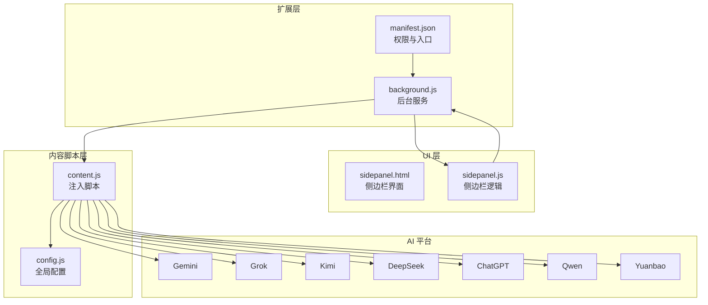
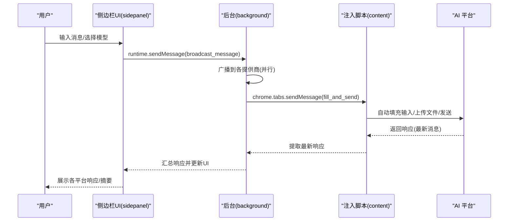
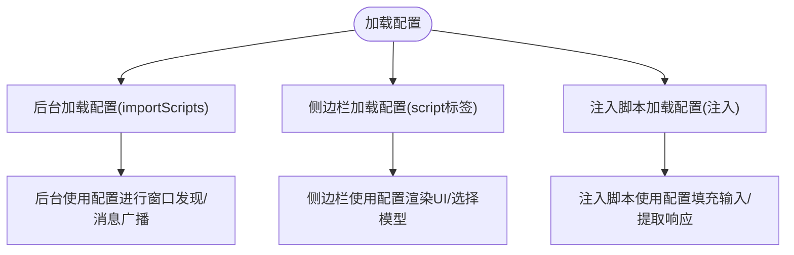
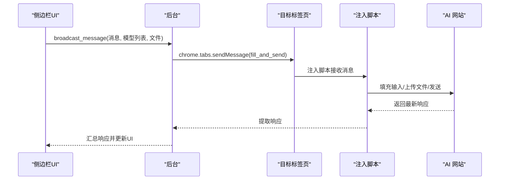
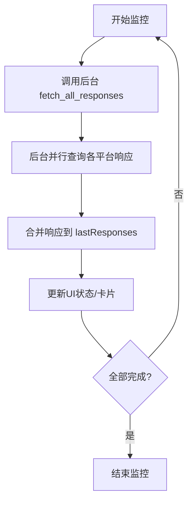
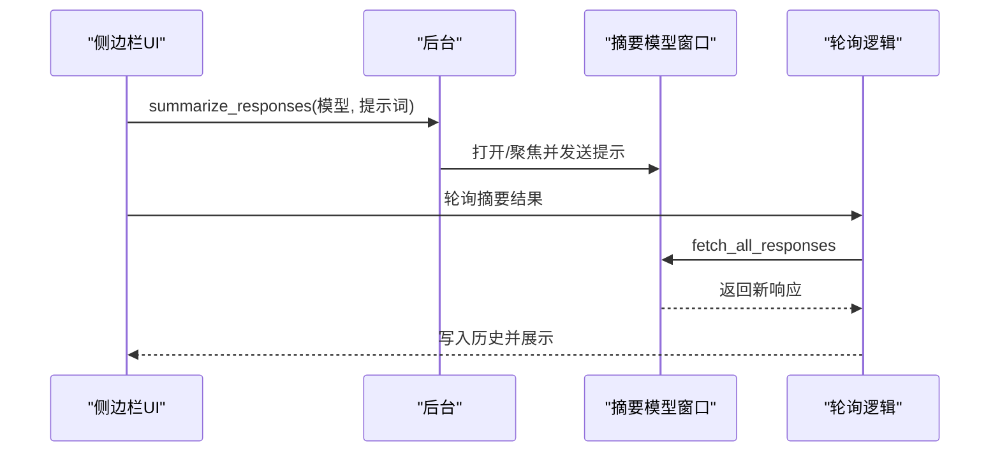
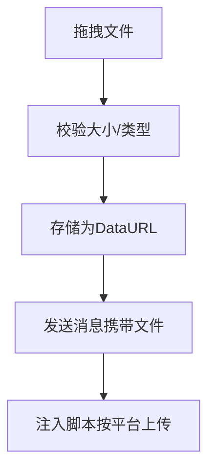
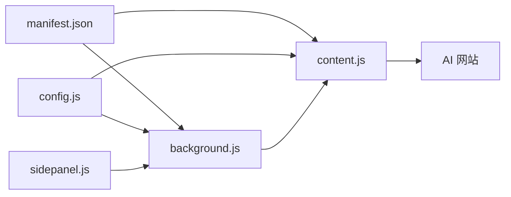

# 数据流分析

<cite>
**本文档引用的文件**
- [src/config.js](file://src/config.js)
- [src/sidepanel/sidepanel.js](file://src/sidepanel/sidepanel.js)
- [src/sidepanel/sidepanel.html](file://src/sidepanel/sidepanel.html)
- [src/background.js](file://src/background.js)
- [src/content/content.js](file://src/content/content.js)
- [manifest.json](file://manifest.json)
- [README.md](file://README.md)
</cite>

## 目录
1. [简介](#简介)
2. [项目结构](#项目结构)
3. [核心组件](#核心组件)
4. [架构总览](#架构总览)
5. [详细组件分析](#详细组件分析)
6. [依赖关系分析](#依赖关系分析)
7. [性能考虑](#性能考虑)
8. [故障排除指南](#故障排除指南)
9. [结论](#结论)

## 简介
本文件针对 AI 多重宇宙对话扩展进行系统性的数据流分析，重点覆盖以下方面：
- 用户输入从侧边栏界面到各个 AI 平台的数据流转路径
- 消息路由、状态同步与响应聚合机制
- 配置数据从 config.js 到各组件的共享与传播
- 用户操作事件从 UI 交互到后台处理再到平台响应的完整流程
- 数据持久化策略（localStorage 使用与状态恢复）
- 提供数据流图与时序图，帮助开发者理解复杂的异步数据处理与状态变更

## 项目结构
该项目采用 Chrome 扩展标准结构，包含背景服务、侧边栏界面、内容脚本与全局配置：
- manifest.json：声明权限、匹配规则与入口
- src/background.js：后台服务，协调标签页管理与跨页面通信
- src/sidepanel/sidepanel.html/js：侧边栏 UI，负责用户交互与状态展示
- src/content/content.js：注入到各 AI 网站的内容脚本，执行输入填充与发送
- src/config.js：集中式配置，描述各平台的选择器、发送方式等

图表来源
- [manifest.json](file://manifest.json#L1-L79)
- [src/background.js](file://src/background.js#L1-L120)
- [src/sidepanel/sidepanel.html](file://src/sidepanel/sidepanel.html#L1-L120)
- [src/sidepanel/sidepanel.js](file://src/sidepanel/sidepanel.js#L1-L120)
- [src/content/content.js](file://src/content/content.js#L1-L60)
- [src/config.js](file://src/config.js#L1-L60)

章节来源
- [README.md](file://README.md#L20-L29)
- [manifest.json](file://manifest.json#L1-L79)

## 核心组件
- 全局配置中心（AI_CONFIG）：集中定义各平台的选择器、发送方式、文件上传支持等，供后台与内容脚本共享
- 侧边栏 UI（sidepanel）：负责用户输入、模型选择、历史记录、响应展示、摘要生成与多窗口管理
- 后台服务（background）：监听扩展命令、管理窗口布局、广播消息到各平台、汇总响应、执行摘要
- 注入脚本（content）：在目标网站内自动填充输入、触发发送、提取最新响应、处理文件上传

章节来源
- [src/config.js](file://src/config.js#L5-L200)
- [src/sidepanel/sidepanel.js](file://src/sidepanel/sidepanel.js#L40-L140)
- [src/background.js](file://src/background.js#L133-L197)
- [src/content/content.js](file://src/content/content.js#L199-L216)

## 架构总览
整体采用“UI 侧边栏 + 后台服务 + 注入脚本”的三层架构：
- UI 侧边栏负责用户交互与状态展示，通过 runtime.sendMessage 与后台通信
- 后台服务负责窗口发现/创建、消息广播、响应汇总、摘要触发
- 注入脚本在各 AI 网站内执行自动化操作，并返回响应给后台

图表来源
- [src/sidepanel/sidepanel.js](file://src/sidepanel/sidepanel.js#L1397-L1407)
- [src/background.js](file://src/background.js#L138-L197)
- [src/content/content.js](file://src/content/content.js#L199-L216)

## 详细组件分析

### 1) 配置数据加载与传播（config.js）
- 全局配置对象 AI_CONFIG 描述各平台的：
  - 选择器（输入框、发送按钮、响应容器、文件上传）
  - 发送方式（按钮点击/回车/表单提交）
  - 文件上传支持与类型限制
  - 主世界填充策略
- 侧边栏与后台均通过 importScripts 或直接访问全局变量使用配置
- 注入脚本在目标站点注入 config.js 后，按平台匹配执行相应逻辑

图表来源
- [src/background.js](file://src/background.js#L69-L74)
- [src/sidepanel/sidepanel.html](file://src/sidepanel/sidepanel.html#L395-L397)
- [src/content/content.js](file://src/content/content.js#L1-L10)
- [src/config.js](file://src/config.js#L1-L60)

章节来源
- [src/config.js](file://src/config.js#L5-L200)
- [src/background.js](file://src/background.js#L69-L74)
- [src/sidepanel/sidepanel.html](file://src/sidepanel/sidepanel.html#L395-L397)
- [src/content/content.js](file://src/content/content.js#L1-L10)

### 2) 用户输入到平台的数据流（sendMessage 路由）
- 侧边栏收集用户输入与选中模型，调用 runtime.sendMessage 发送广播消息
- 后台并行处理每个模型：查找/创建对应窗口、注入脚本、发送消息
- 注入脚本在目标页面执行填充与发送，随后提取最新响应
- 后台汇总响应并回调 UI 更新

图表来源
- [src/sidepanel/sidepanel.js](file://src/sidepanel/sidepanel.js#L1397-L1407)
- [src/background.js](file://src/background.js#L138-L197)
- [src/content/content.js](file://src/content/content.js#L199-L216)

章节来源
- [src/sidepanel/sidepanel.js](file://src/sidepanel/sidepanel.js#L1343-L1407)
- [src/background.js](file://src/background.js#L138-L197)
- [src/content/content.js](file://src/content/content.js#L322-L418)

### 3) 状态同步与响应聚合
- 侧边栏维护等待状态列表，逐个更新各模型的完成/失败状态
- 后台使用 Promise.allSettled 并行抓取各平台响应
- UI 根据聚合结果渲染卡片、启用摘要按钮、支持查看详情与复制

图表来源
- [src/sidepanel/sidepanel.js](file://src/sidepanel/sidepanel.js#L1700-L1762)
- [src/background.js](file://src/background.js#L199-L268)

章节来源
- [src/sidepanel/sidepanel.js](file://src/sidepanel/sidepanel.js#L1700-L1762)
- [src/background.js](file://src/background.js#L199-L268)

### 4) 摘要生成流程（Summarization）
- 用户在侧边栏触发摘要设置（模型与提示词），后台打开指定模型窗口并发送摘要提示
- 侧边栏轮询目标模型窗口，检测新响应变化，捕获完成后写入历史并展示

图表来源
- [src/sidepanel/sidepanel.js](file://src/sidepanel/sidepanel.js#L2223-L2454)
- [src/background.js](file://src/background.js#L298-L376)

章节来源
- [src/sidepanel/sidepanel.js](file://src/sidepanel/sidepanel.js#L2223-L2454)
- [src/background.js](file://src/background.js#L298-L376)

### 5) 文件上传与拖拽处理
- 侧边栏支持拖拽与文件选择，校验大小与类型后转为 DataURL 存储
- 发送时将文件数据随消息传入后台/注入脚本，按平台策略上传

图表来源
- [src/sidepanel/sidepanel.js](file://src/sidepanel/sidepanel.js#L464-L495)
- [src/sidepanel/sidepanel.js](file://src/sidepanel/sidepanel.js#L2047-L2104)
- [src/content/content.js](file://src/content/content.js#L616-L742)

章节来源
- [src/sidepanel/sidepanel.js](file://src/sidepanel/sidepanel.js#L414-L495)
- [src/sidepanel/sidepanel.js](file://src/sidepanel/sidepanel.js#L2047-L2104)
- [src/content/content.js](file://src/content/content.js#L616-L742)

### 6) 本地存储与状态恢复
- 侧边栏使用 chrome.storage.local 存储主题、语言、选中模型、摘要设置、聊天历史
- 历史记录包含普通消息与摘要条目，支持复制、删除、重发、编辑
- 详情模态宽度使用 localStorage 持久化

章节来源
- [src/sidepanel/sidepanel.js](file://src/sidepanel/sidepanel.js#L1321-L1335)
- [src/sidepanel/sidepanel.js](file://src/sidepanel/sidepanel.js#L1409-L1421)
- [src/sidepanel/sidepanel.js](file://src/sidepanel/sidepanel.js#L1057-L1196)
- [src/sidepanel/sidepanel.js](file://src/sidepanel/sidepanel.js#L2775-L2787)

## 依赖关系分析
- manifest.json 声明权限与内容脚本注入时机
- 后台与注入脚本共享配置，注入脚本依赖目标站点 DOM 结构
- 侧边栏依赖后台提供的聚合结果与状态更新

图表来源
- [manifest.json](file://manifest.json#L45-L68)
- [src/background.js](file://src/background.js#L69-L74)
- [src/content/content.js](file://src/content/content.js#L1-L10)
- [src/config.js](file://src/config.js#L1-L10)

章节来源
- [manifest.json](file://manifest.json#L1-L79)
- [src/background.js](file://src/background.js#L69-L74)
- [src/content/content.js](file://src/content/content.js#L1-L10)
- [src/config.js](file://src/config.js#L1-L10)

## 性能考虑
- 并行处理：后台对各平台响应使用 Promise.allSettled 并行抓取，缩短总耗时
- 轮询节流：摘要轮询与响应监控设置最大次数与间隔，避免过度轮询
- 选择器优化：注入脚本按可见性优先查找输入/按钮，减少无效 DOM 查询
- 文件上传：按平台策略上传，超时与重试控制在合理范围

## 故障排除指南
- 无法注入脚本：后台检测失败时会通知状态，检查 manifest 的 content_scripts 注入与目标域名匹配
- 选择器失效：可通过后台诊断功能调用注入脚本的诊断接口，返回各选择器命中情况
- 响应为空：检查平台是否登录、网络状态与 DOM 结构变化；必要时调整配置选择器
- 摘要无结果：确认摘要模型窗口已打开且有新响应产生，适当延长轮询时间

章节来源
- [src/background.js](file://src/background.js#L656-L678)
- [src/content/content.js](file://src/content/content.js#L126-L197)
- [src/background.js](file://src/background.js#L270-L296)

## 结论
本扩展通过清晰的三层架构实现了跨平台消息广播、状态同步与响应聚合。配置中心统一管理各平台差异，注入脚本在目标站点内完成自动化操作，后台负责协调与汇总。侧边栏提供丰富的交互与持久化能力，结合轮询与并行处理，满足复杂异步场景下的数据流需求。