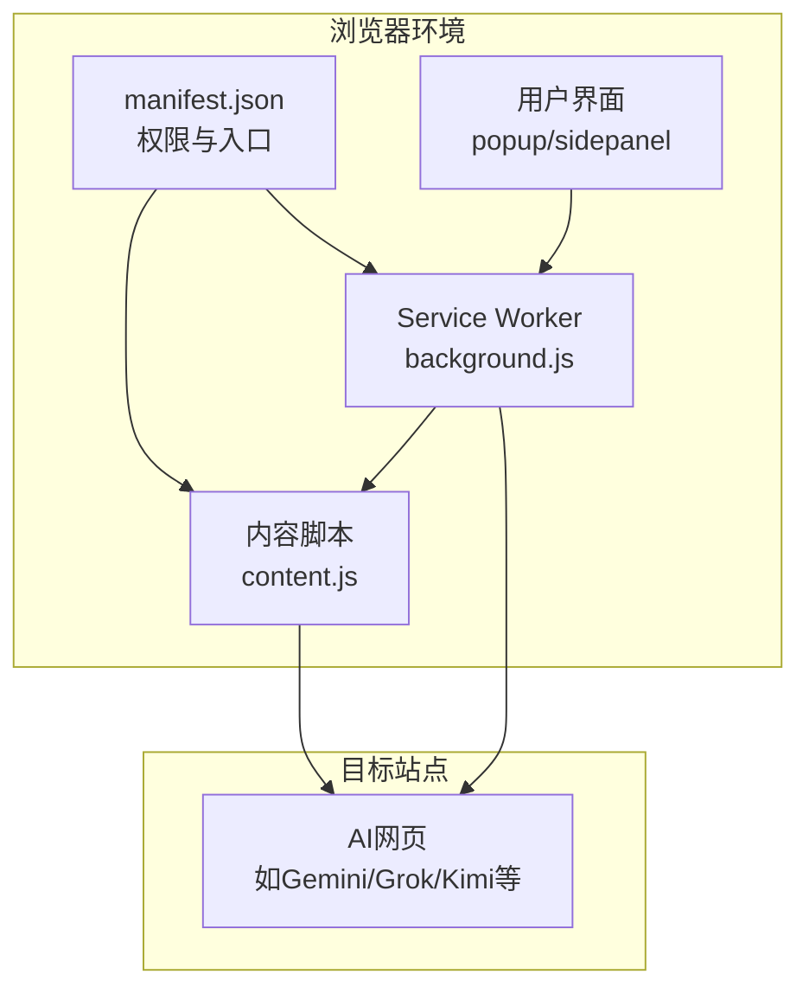
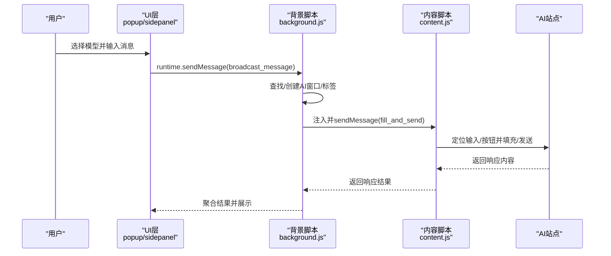
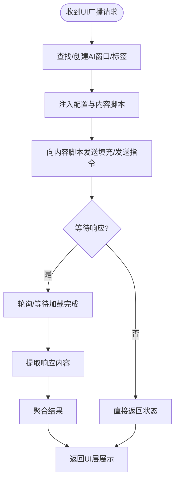
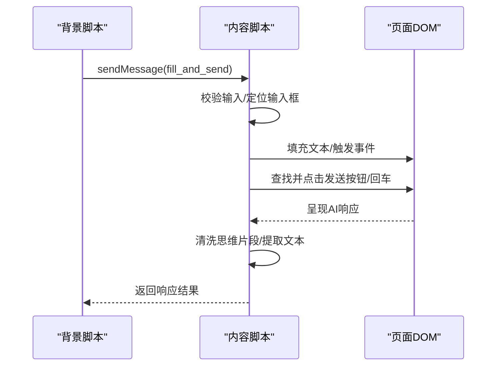
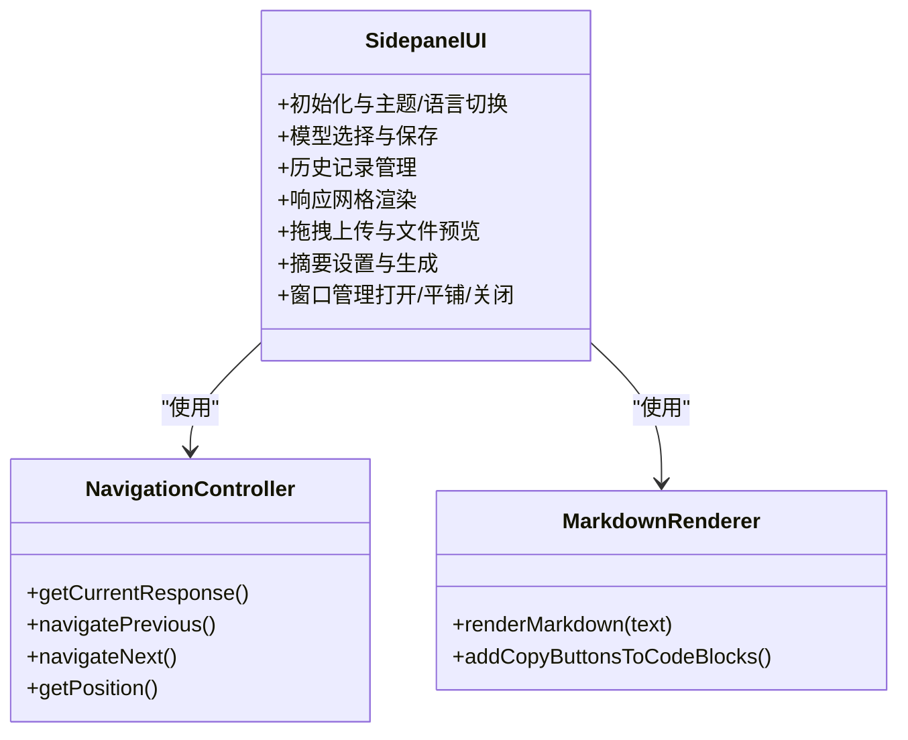
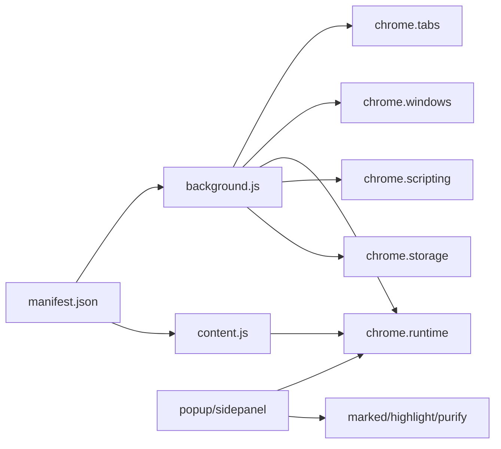

# 整体架构

<cite>
**本文引用的文件**
- [manifest.json](file://manifest.json)
- [background.js](file://src/background.js)
- [content.js](file://src/content/content.js)
- [popup.js](file://src/popup/popup.js)
- [popup.html](file://src/popup/popup.html)
- [sidepanel.js](file://src/sidepanel/sidepanel.js)
- [sidepanel.html](file://src/sidepanel/sidepanel.html)
- [config.js](file://src/config.js)
- [i18n.js](file://src/i18n.js)
- [marked.min.js](file://src/lib/marked.min.js)
- [highlight-all.min.js](file://src/lib/highlight-all.min.js)
- [purify.min.js](file://src/lib/purify.min.js)
</cite>

## 目录
1. [简介](#简介)
2. [项目结构](#项目结构)
3. [核心组件](#核心组件)
4. [架构总览](#架构总览)
5. [详细组件分析](#详细组件分析)
6. [依赖分析](#依赖分析)
7. [性能考虑](#性能考虑)
8. [故障排查指南](#故障排查指南)
9. [结论](#结论)
10. [附录](#附录)

## 简介
本项目是一个Chrome扩展，旨在实现“多重宇宙对话”能力：同时向多家AI网页服务（如Gemini、Grok、Kimi、DeepSeek、ChatGPT、通义千问、腾讯元宝等）广播消息，并统一收集与展示各平台的响应结果。扩展采用三层架构设计：
- 背景脚本层：负责扩展生命周期、窗口管理、消息路由、跨标签通信与状态同步。
- 内容脚本层：注入到目标AI页面，负责页面元素识别、输入填充、发送操作、响应提取与文件上传。
- 用户界面层：包含弹出面板与侧边栏面板，提供多模型选择、发送控制、响应查看、摘要生成与主题/语言切换等功能。

该架构强调模块化与可扩展性，通过统一配置中心（AI_CONFIG）、消息通道（runtime messaging）、窗口管理（chrome.windows/tabs）与状态持久化（chrome.storage），实现对新AI平台与功能的快速接入与维护。

## 项目结构
- 扩展清单与权限声明位于manifest.json，定义了后台脚本、内容脚本注入规则、命令快捷键与权限。
- 背景脚本src/background.js承载核心业务逻辑：窗口发现与布局、消息广播、响应抓取、摘要生成、主世界填充等。
- 内容脚本src/content/content.js负责在目标站点内执行自动化操作：输入定位、文本填充、按钮点击、响应提取、文件上传等。
- 用户界面层由src/popup与src/sidepanel组成，分别提供轻量弹窗与完整侧边栏体验。
- 配置中心src/config.js集中管理各AI平台的选择器、发送方式、文件支持等。
- 国际化与渲染库位于src/i18n.js以及src/lib下的marked、highlight、purify等。

**图表来源**
- [manifest.json](file://manifest.json#L1-L79)
- [background.js](file://src/background.js#L1-L120)
- [content.js](file://src/content/content.js#L1-L60)

**章节来源**
- [manifest.json](file://manifest.json#L1-L79)
- [background.js](file://src/background.js#L1-L120)
- [content.js](file://src/content/content.js#L1-L60)

## 核心组件
- 配置管理中心（AI_CONFIG）
  - 定义各AI平台的域名匹配、基础URL、输入/按钮/响应选择器、发送方式、文件支持等。
  - 作为内容脚本与背景脚本的共同输入，确保跨层一致性。
- 消息传递机制
  - 背景脚本监听chrome.runtime.onMessage，处理广播、窗口布局、响应抓取、摘要生成、主世界填充等请求。
  - 内容脚本监听chrome.runtime.onMessage，处理填充与发送、响应提取、选择器诊断等。
  - 弹窗/侧边栏通过chrome.runtime.sendMessage发起动作。
- 窗口与标签管理
  - 使用chrome.windows与chrome.tabs进行窗口发现、创建、布局与状态跟踪。
  - 通过providerWindows映射表维护各AI窗口与标签的对应关系。
- 状态与持久化
  - 使用chrome.storage.local存储语言、主题、模型选择、文件预览等用户偏好。
- 国际化与渲染
  - i18n.js提供多语言翻译与相对时间格式化。
  - marked、highlight、DOMPurify用于Markdown解析、语法高亮与HTML净化。

**章节来源**
- [config.js](file://src/config.js#L1-L204)
- [background.js](file://src/background.js#L138-L197)
- [content.js](file://src/content/content.js#L199-L216)
- [i18n.js](file://src/i18n.js#L1-L120)

## 架构总览
三层架构的协作流程如下：
- 用户在弹窗或侧边栏输入消息并选择目标模型，扩展通过runtime消息将广播请求发送至背景脚本。
- 背景脚本根据AI_CONFIG定位或创建对应AI窗口/标签，注入内容脚本，然后向内容脚本发送填充与发送指令。
- 内容脚本在目标站点内执行输入填充、按钮点击、响应提取等操作，并将结果返回给背景脚本。
- 背景脚本聚合各平台响应，提供“获取响应”“平铺窗口”“关闭所有窗口”等管理能力；侧边栏面板负责展示与交互。

**图表来源**
- [background.js](file://src/background.js#L138-L197)
- [content.js](file://src/content/content.js#L199-L216)
- [popup.js](file://src/popup/popup.js#L16-L44)
- [sidepanel.js](file://src/sidepanel/sidepanel.js#L1-L120)

## 详细组件分析

### 背景脚本层（background.js）
- 职责与边界
  - 扩展入口与生命周期管理：监听扩展点击、快捷键、命令。
  - 窗口与标签管理：发现现有窗口、创建新窗口、平铺布局、关闭窗口。
  - 消息路由：接收UI层广播请求，分发到各AI平台；接收内容脚本响应，聚合返回。
  - 主世界填充：通过chrome.scripting.executeScript在页面MAIN世界执行特定填充逻辑。
  - 响应抓取与摘要：按需查询各平台响应，或启动指定模型进行摘要生成。
- 关键机制
  - providerWindows映射：维护各AI平台对应的窗口与标签ID，提升发现效率。
  - ensureContentScript：检测并注入配置与内容脚本，确保通信通道畅通。
  - waitForTabLoad：等待标签加载完成，避免注入时机过早。
  - 语言与翻译：本地加载翻译字典，支持动态切换语言。
- 可扩展性
  - 新增AI平台只需在AI_CONFIG中补充配置项，背景脚本无需修改即可自动适配。
  - 通过消息协议扩展更多后台能力（如历史管理、批量操作等）。

**图表来源**
- [background.js](file://src/background.js#L718-L786)
- [background.js](file://src/background.js#L200-L268)
- [background.js](file://src/background.js#L378-L526)

**章节来源**
- [background.js](file://src/background.js#L1-L120)
- [background.js](file://src/background.js#L138-L197)
- [background.js](file://src/background.js#L200-L268)
- [background.js](file://src/background.js#L378-L526)
- [background.js](file://src/background.js#L718-L786)

### 内容脚本层（content.js）
- 职责与边界
  - 页面内自动化：根据AI_CONFIG定位输入框、按钮，执行填充与发送。
  - 响应提取：定位最新AI响应，清洗思维/推理片段，支持Markdown/HTML输出。
  - 文件上传：按平台支持类型过滤并上传文件，含重试与超时控制。
  - 选择器诊断：辅助调试与优化选择器策略。
- 关键机制
  - findElement：先精确后宽松的元素查找策略，兼顾稳定性与兼容性。
  - sendMessage：针对不同平台的发送策略（表单提交、按钮点击、回车发送）。
  - removeThinkingBlocks/filterThinkingText：去除推理/思考片段，保留最终答案。
  - requestMainWorldFill：请求背景脚本在MAIN世界执行复杂填充，避免DOM事件冲突。
- 可扩展性
  - 新平台仅需在AI_CONFIG中提供对应选择器与发送方式，内容脚本逻辑保持稳定。

**图表来源**
- [content.js](file://src/content/content.js#L322-L418)
- [content.js](file://src/content/content.js#L465-L565)
- [content.js](file://src/content/content.js#L218-L320)

**章节来源**
- [content.js](file://src/content/content.js#L1-L60)
- [content.js](file://src/content/content.js#L199-L216)
- [content.js](file://src/content/content.js#L322-L418)
- [content.js](file://src/content/content.js#L465-L565)
- [content.js](file://src/content/content.js#L218-L320)

### 用户界面层（popup/sidepanel）
- 弹窗（popup）
  - 轻量交互：选择模型、输入消息、发送按钮、状态日志。
  - 与背景脚本通过runtime消息通信，实时反馈发送状态。
- 侧边栏（sidepanel）
  - 完整功能：模型选择、历史记录、响应网格、摘要设置、拖拽上传、主题/语言切换、平铺/关闭窗口等。
  - Markdown渲染与代码高亮：依赖marked、highlight、DOMPurify。
  - 导航控制器：支持在多个平台响应间循环浏览与复制。

**图表来源**
- [sidepanel.js](file://src/sidepanel/sidepanel.js#L1-L120)
- [sidepanel.js](file://src/sidepanel/sidepanel.js#L712-L800)
- [sidepanel.html](file://src/sidepanel/sidepanel.html#L1-L120)

**章节来源**
- [popup.js](file://src/popup/popup.js#L1-L61)
- [popup.html](file://src/popup/popup.html#L1-L50)
- [sidepanel.js](file://src/sidepanel/sidepanel.js#L1-L120)
- [sidepanel.html](file://src/sidepanel/sidepanel.html#L1-L120)

### 配置管理（AI_CONFIG）
- 设计理念
  - 将“平台差异”抽象为配置，内容脚本与背景脚本共享同一份配置，降低耦合度。
  - 通过urlPattern/urlPatterns、selectors、sendMethod、fillMethod、supportsFiles等字段覆盖不同站点的差异化需求。
- 扩展路径
  - 新增平台：在AI_CONFIG中追加条目，提供选择器与发送策略。
  - 优化策略：逐步完善选择器与发送方式，减少误触与失败率。

**章节来源**
- [config.js](file://src/config.js#L1-L204)

### 国际化与渲染（i18n.js、marked、highlight、DOMPurify）
- 国际化
  - t函数提供键值翻译与变量替换，支持中英双语。
  - formatDateTime/formatRelativeTime提供本地化时间格式。
- 渲染与安全
  - marked用于Markdown解析，highlight用于语法高亮，DOMPurify用于HTML净化，防止XSS。
- UI集成
  - 侧边栏在加载时配置marked与highlight，渲染AI响应内容并添加复制按钮。

**章节来源**
- [i18n.js](file://src/i18n.js#L1-L120)
- [i18n.js](file://src/i18n.js#L355-L383)
- [marked.min.js](file://src/lib/marked.min.js#L1-L7)
- [highlight-all.min.js](file://src/lib/highlight-all.min.js#L1-L80)
- [purify.min.js](file://src/lib/purify.min.js#L1-L4)

## 依赖分析
- manifest.json
  - 声明后台脚本、内容脚本注入规则、权限（activeTab、scripting、tabs、storage、system.display）、主机权限与命令快捷键。
- 背景脚本依赖
  - chrome.windows/chrome.tabs：窗口与标签管理。
  - chrome.runtime：消息监听与转发。
  - chrome.scripting：在页面MAIN世界执行脚本。
  - chrome.storage：用户偏好持久化。
- 内容脚本依赖
  - chrome.runtime：与背景脚本通信。
  - DOM API：元素定位与事件触发。
- UI层依赖
  - runtime消息：与背景脚本通信。
  - 本地库：marked、highlight、DOMPurify。

**图表来源**
- [manifest.json](file://manifest.json#L1-L79)
- [background.js](file://src/background.js#L1-L120)
- [content.js](file://src/content/content.js#L1-L60)
- [sidepanel.js](file://src/sidepanel/sidepanel.js#L1-L120)

**章节来源**
- [manifest.json](file://manifest.json#L1-L79)
- [background.js](file://src/background.js#L1-L120)
- [content.js](file://src/content/content.js#L1-L60)
- [sidepanel.js](file://src/sidepanel/sidepanel.js#L1-L120)

## 性能考虑
- 并行处理
  - 广播与响应抓取采用Promise.allSettled并行执行，缩短整体耗时。
- 注入与等待
  - ensureContentScript与waitForTabLoad避免过早注入与操作，提高成功率。
- 选择器与发送策略
  - 针对不同平台采用最优策略（按钮点击/回车/表单提交），减少无效重试。
- 渲染与安全
  - DOMPurify在渲染前净化HTML，避免XSS与渲染性能问题。
- 窗口布局
  - 平铺算法按显示器工作区域计算行列，避免过度重绘。

[本节为通用指导，不直接分析具体文件]

## 故障排查指南
- 脚本注入失败
  - 现象：背景脚本提示“脚本注入失败”。
  - 排查：检查ensureContentScript是否抛错；确认目标站点URL匹配AI_CONFIG中的urlPattern；确认chrome.scripting权限。
- 无法找到输入/按钮
  - 现象：内容脚本报“未找到输入框/发送按钮”。
  - 排查：使用diagnose_selectors工具检查选择器有效性；核对AI_CONFIG中selectors配置；关注平台UI变更。
- 响应为空或提取失败
  - 现象：响应抓取返回“无响应/提取失败”。
  - 排查：确认目标站点已加载完成；检查响应选择器；验证removeThinkingBlocks是否正确清洗。
- 窗口布局异常
  - 现象：平铺窗口失败或位置不正确。
  - 排查：确认chrome.system.display权限；检查lastTileDisplayId存储；确认目标窗口未被最小化/隐藏。
- 语言/主题显示异常
  - 现象：界面语言或主题未生效。
  - 排查：检查chrome.storage中的lang/theme存储；确认i18n与主题切换逻辑。

**章节来源**
- [background.js](file://src/background.js#L656-L678)
- [content.js](file://src/content/content.js#L126-L197)
- [content.js](file://src/content/content.js#L218-L320)
- [sidepanel.js](file://src/sidepanel/sidepanel.js#L1-L120)

## 结论
该扩展通过三层架构实现了对多家AI网页服务的统一接入与管理。配置中心将平台差异抽象为可维护的配置，消息通道与窗口管理保障跨标签通信与布局控制，UI层提供直观的操作与展示。整体设计具备良好的模块化与可扩展性，便于快速接入新平台与迭代新功能。

[本节为总结性内容，不直接分析具体文件]

## 附录
- 快捷键
  - 默认快捷键：Alt+Shift+S，用于打开侧边栏面板。
- 权限说明
  - activeTab、scripting、tabs、storage、system.display：分别用于当前标签操作、脚本注入、标签管理、本地存储与显示器信息。
- 主机权限
  - 覆盖Gemini、Grok、Kimi、DeepSeek、ChatGPT、通义千问、腾讯元宝等站点域名。

**章节来源**
- [manifest.json](file://manifest.json#L1-L79)