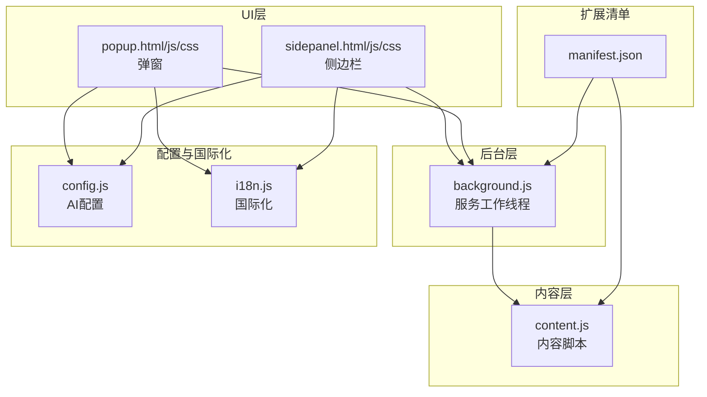
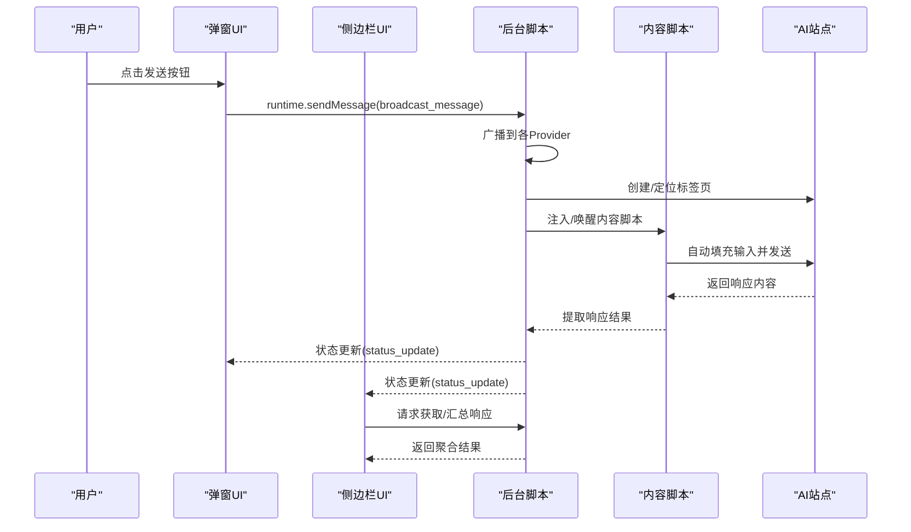
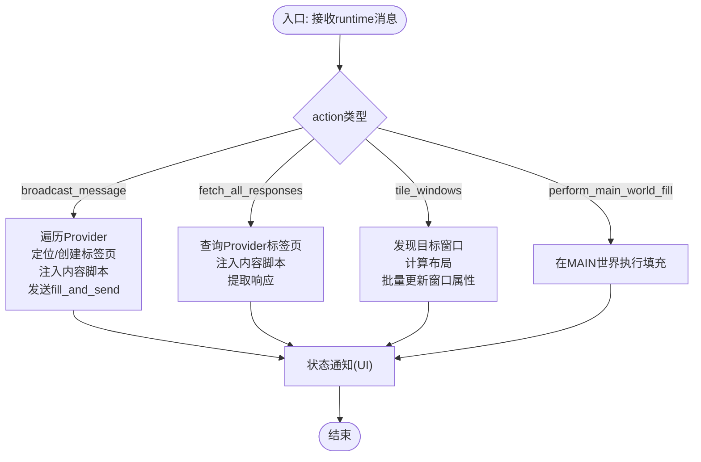
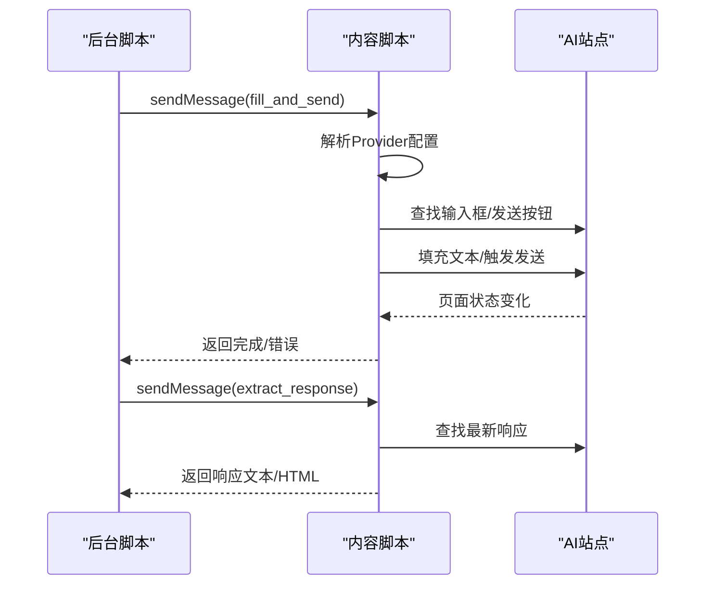
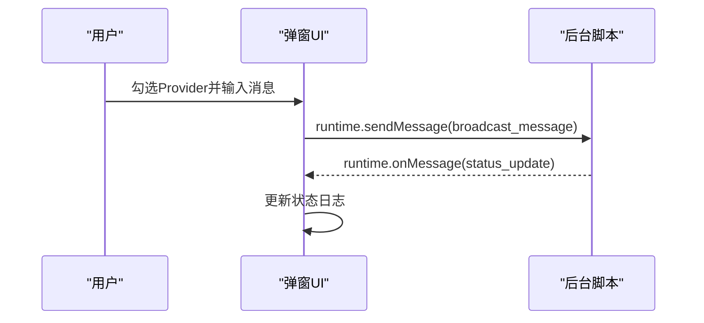
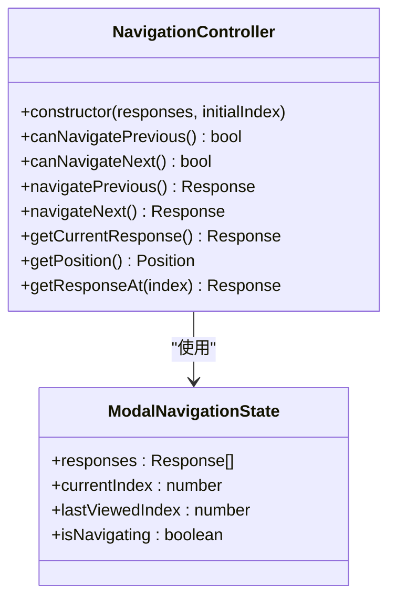
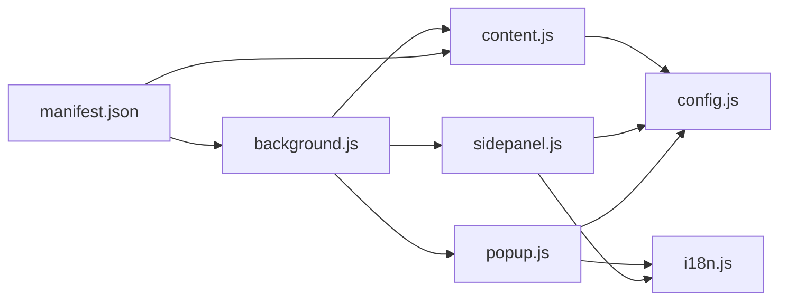

# 架构设计

<cite>
**本文档引用的文件**
- [manifest.json](file://manifest.json)
- [background.js](file://src/background.js)
- [content.js](file://src/content/content.js)
- [popup.js](file://src/popup/popup.js)
- [popup.html](file://src/popup/popup.html)
- [popup.css](file://src/popup/popup.css)
- [sidepanel.js](file://src/sidepanel/sidepanel.js)
- [sidepanel.html](file://src/sidepanel/sidepanel.html)
- [sidepanel.css](file://src/sidepanel/sidepanel.css)
- [config.js](file://src/config.js)
- [i18n.js](file://src/i18n.js)
- [README.md](file://README.md)
</cite>

## 目录
1. [简介](#简介)
2. [项目结构](#项目结构)
3. [核心组件](#核心组件)
4. [架构总览](#架构总览)
5. [详细组件分析](#详细组件分析)
6. [依赖关系分析](#依赖关系分析)
7. [性能考量](#性能考量)
8. [故障排查指南](#故障排查指南)
9. [结论](#结论)
10. [附录](#附录)

## 简介
本项目是一个面向多AI平台的Chrome扩展，支持同时向多个AI聊天界面（如Gemini、Grok、Kimi、DeepSeek、ChatGPT、通义千问、腾讯元宝）广播消息，并提供侧边栏控制面板、弹窗交互、响应提取与聚合、文件上传、主题与国际化等能力。本文档从架构视角系统梳理背景脚本、内容脚本、用户界面与配置管理的角色与职责，解释组件间的消息传递、事件驱动与数据流管理，分析设计模式与技术决策，并给出可视化图表帮助开发者快速理解整体设计。

## 项目结构
项目采用“清单驱动 + 多入口脚本 + 统一配置”的组织方式：
- manifest.json：声明权限、后台脚本、内容脚本匹配规则、动作入口与快捷键。
- src/background.js：后台服务工作线程，负责窗口管理、消息路由、跨标签通信、脚本注入与状态通知。
- src/content/content.js：内容脚本，注入到各AI站点，负责自动化输入、发送、响应提取与文件上传。
- src/popup/*：弹窗UI，提供快速选择与发送。
- src/sidepanel/*：侧边栏UI，提供持久化聊天管理、响应聚合、摘要生成、主题与国际化。
- src/config.js：统一的AI平台配置中心，包含选择器、发送策略、文件上传支持等。
- src/i18n.js：国际化与本地化支持。
- 其他资源：图标、样式库、Markdown渲染库等。

图表来源
- [manifest.json](file://manifest.json#L1-L79)
- [background.js](file://src/background.js#L1-L120)
- [content.js](file://src/content/content.js#L1-L60)
- [popup.html](file://src/popup/popup.html#L1-L50)
- [sidepanel.html](file://src/sidepanel/sidepanel.html#L1-L120)
- [config.js](file://src/config.js#L1-L40)
- [i18n.js](file://src/i18n.js#L1-L60)

章节来源
- [manifest.json](file://manifest.json#L1-L79)
- [README.md](file://README.md#L20-L29)

## 核心组件
- 背景脚本（background.js）
  - 负责扩展动作入口、命令触发、弹窗窗口生命周期管理、跨标签消息分发、脚本注入、窗口布局与调度、状态通知。
  - 通过监听 runtime.onMessage 接收来自UI与内容脚本的消息，执行相应操作并返回结果。
- 内容脚本（content.js）
  - 注入到目标AI站点，负责查找输入框、填充文本、触发发送、提取最新响应、文件上传、调试诊断等。
  - 通过监听 runtime.onMessage 处理来自后台的消息请求。
- 弹窗UI（popup）
  - 提供快速选择AI模型、输入消息、发送到所有选中模型的能力，展示状态日志。
- 侧边栏UI（sidepanel）
  - 提供持久化的聊天管理、响应卡片网格、详情模态、摘要设置、主题切换、国际化、拖拽上传、窗口平铺与关闭等高级功能。
- 配置中心（config.js）
  - 统一管理各AI平台的选择器、发送策略、文件上传支持、基础URL与名称等。
- 国际化（i18n.js）
  - 提供翻译函数、日期时间格式化、语言切换与本地化资源。

章节来源
- [background.js](file://src/background.js#L1-L120)
- [content.js](file://src/content/content.js#L1-L60)
- [popup.js](file://src/popup/popup.js#L1-L61)
- [sidepanel.js](file://src/sidepanel/sidepanel.js#L1-L120)
- [config.js](file://src/config.js#L1-L40)
- [i18n.js](file://src/i18n.js#L1-L60)

## 架构总览
整体采用“后台协调 + 内容脚本注入 + UI交互”的分层架构：
- 清单驱动：manifest.json声明后台脚本、内容脚本匹配规则、权限与快捷键。
- 后台协调：background.js集中处理跨标签通信、窗口管理、脚本注入与状态反馈。
- 内容脚本：content.js在目标站点内执行自动化操作，与后台通过消息通道协作。
- UI交互：popup与sidepanel分别提供轻量与完整体验，均通过chrome.runtime.sendMessage与后台交互。
- 配置与国际化：config.js与i18n.js贯穿UI与内容脚本，确保一致性与可维护性。

图表来源
- [popup.js](file://src/popup/popup.js#L16-L45)
- [background.js](file://src/background.js#L138-L197)
- [content.js](file://src/content/content.js#L199-L216)

## 详细组件分析

### 背景脚本（background.js）
- 角色与职责
  - 动作入口与命令：监听扩展图标点击与全局快捷键，控制弹窗窗口的显示/隐藏与焦点。
  - 窗口管理：发现/跟踪各Provider对应的窗口与标签页，支持平铺布局、关闭全部窗口。
  - 跨标签通信：通过chrome.runtime.onMessage监听UI与内容脚本消息，分发到对应处理函数。
  - 脚本注入：检测目标标签是否已注入内容脚本，必要时执行注入；等待页面加载完成后再发送消息。
  - 状态通知：将Provider状态通过runtime.sendMessage回传UI，用于实时反馈。
- 关键流程
  - 广播消息：遍历选中Provider，定位或创建对应标签页，注入内容脚本并发送fill_and_send。
  - 获取响应：查询各Provider标签页，注入内容脚本并请求extract_response，聚合返回。
  - 平铺窗口：根据显示器信息计算布局，批量更新窗口位置与尺寸。
  - 主世界填充：对特定站点通过executeScript在MAIN世界执行填充逻辑，规避React/编辑器事件链冲突。
- 设计要点
  - 异步与并发：Promise.allSettled并行处理多个Provider，提高吞吐。
  - 容错与回退：注入失败、标签页丢失、选择器失效均有回退策略。
  - 可观测性：大量日志输出便于调试与问题定位。

图表来源
- [background.js](file://src/background.js#L138-L197)
- [background.js](file://src/background.js#L718-L786)
- [background.js](file://src/background.js#L200-L268)
- [background.js](file://src/background.js#L528-L643)
- [background.js](file://src/background.js#L378-L526)

章节来源
- [background.js](file://src/background.js#L1-L120)
- [background.js](file://src/background.js#L138-L197)
- [background.js](file://src/background.js#L200-L268)
- [background.js](file://src/background.js#L528-L643)
- [background.js](file://src/background.js#L718-L786)
- [background.js](file://src/background.js#L378-L526)

### 内容脚本（content.js）
- 角色与职责
  - 自动化输入与发送：根据配置查找输入框，填充文本，触发发送按钮或回车键。
  - 响应提取：按配置选择器定位最新AI响应，清理思维/推理块，返回文本与HTML。
  - 文件上传：按Provider差异策略上传文件，支持多种类型与大小限制。
  - 调试诊断：提供选择器诊断工具，辅助定位站点结构变化。
- 关键流程
  - 填充与发送：解析Provider配置，查找输入框与发送按钮，执行填充与发送序列。
  - 响应提取：遍历响应选择器，取最后一个有效元素，清理思维块，返回文本。
  - 文件上传：过滤支持类型，逐个上传并重试，超时处理。
- 设计要点
  - 选择器优先级：严格选择器优先，回退到通用选择器，增强鲁棒性。
  - 事件兼容：针对不同站点（React、TiTAP、contenteditable）采用差异化填充策略。
  - 安全与健壮：输入校验、超时与重试、异常捕获与降级。

图表来源
- [content.js](file://src/content/content.js#L199-L216)
- [content.js](file://src/content/content.js#L322-L418)
- [content.js](file://src/content/content.js#L218-L320)

章节来源
- [content.js](file://src/content/content.js#L1-L60)
- [content.js](file://src/content/content.js#L199-L216)
- [content.js](file://src/content/content.js#L218-L320)
- [content.js](file://src/content/content.js#L322-L418)

### 弹窗UI（popup）
- 角色与职责
  - 快速交互：勾选AI模型、输入消息、一键发送到所有选中模型。
  - 状态展示：接收后台状态更新，实时显示发送结果与错误。
- 关键流程
  - 用户点击发送：收集选中Provider与消息，通过runtime.sendMessage广播。
  - 状态订阅：监听runtime.onMessage，追加状态日志。

图表来源
- [popup.js](file://src/popup/popup.js#L16-L45)
- [popup.html](file://src/popup/popup.html#L1-L50)

章节来源
- [popup.js](file://src/popup/popup.js#L1-L61)
- [popup.html](file://src/popup/popup.html#L1-L50)
- [popup.css](file://src/popup/popup.css#L1-L134)

### 侧边栏UI（sidepanel）
- 角色与职责
  - 持久化管理：历史记录、响应网格、详情模态、摘要设置、主题与语言切换。
  - 高级功能：拖拽上传、窗口平铺、关闭全部、响应复制、键盘/触摸导航、可调整详情模态。
- 关键流程
  - 响应获取：点击“获取响应”触发后台fetch_all_responses，渲染网格卡片。
  - 详情查看：点击卡片打开详情模态，支持左右箭头、键盘方向键、触摸滑动导航。
  - 摘要设置：打开摘要设置模态，选择模型与提示词，触发后台summarize_responses。
- 设计要点
  - MVVM思想：状态与视图分离，事件驱动更新UI；NavigationController封装导航逻辑。
  - 模块化：Markdown渲染、代码复制、拖拽上传、模态导航、窗口布局等功能模块化组织。
  - 可扩展：通过AI_CONFIG与i18n.js实现新Provider与多语言扩展。

图表来源
- [sidepanel.js](file://src/sidepanel/sidepanel.js#L712-L815)
- [sidepanel.js](file://src/sidepanel/sidepanel.js#L653-L711)

章节来源
- [sidepanel.js](file://src/sidepanel/sidepanel.js#L1-L120)
- [sidepanel.html](file://src/sidepanel/sidepanel.html#L1-L120)
- [sidepanel.css](file://src/sidepanel/sidepanel.css#L1-L120)

### 配置中心（config.js）
- 角色与职责
  - 统一管理各AI平台的选择器、发送策略、文件上传支持、基础URL与名称。
  - 作为全局常量被内容脚本与侧边栏共享，确保行为一致。
- 设计要点
  - 选择器优先：为每个平台提供多套选择器，按严格到宽松顺序排列。
  - 策略分离：fillMethod与sendMethod区分“主世界填充/内容脚本填充”与“按钮/回车”发送策略。
  - 文件支持：明确支持的文件类型与上传入口，便于内容脚本进行过滤与上传。

章节来源
- [config.js](file://src/config.js#L1-L204)

### 国际化（i18n.js）
- 角色与职责
  - 提供翻译函数t(key, vars)、日期时间格式化、相对时间格式化与语言切换。
  - 与UI模板结合，动态更新文案与占位符。
- 设计要点
  - 嵌套键访问：支持“a.b.c”形式的嵌套键，便于组织多层级文案。
  - 变量替换：支持{var}占位符替换，适配不同Provider名称与数量。

章节来源
- [i18n.js](file://src/i18n.js#L1-L120)
- [i18n.js](file://src/i18n.js#L355-L383)

## 依赖关系分析
- 清单驱动
  - manifest.json声明后台脚本、内容脚本匹配规则、权限与快捷键，决定扩展的生命周期与注入时机。
- 组件耦合
  - background.js与content.js通过chrome.runtime.onMessage建立松耦合的消息通道。
  - sidepanel与popup均依赖background.js提供的统一消息接口，UI层不直接操作标签页。
  - config.js与i18n.js被UI与content共享，形成跨层依赖。
- 外部依赖
  - 内容脚本依赖目标站点DOM结构与事件模型，需随站点更新调整选择器。
  - 侧边栏依赖marked.js、highlight.js、DOMPurify等第三方库进行Markdown渲染与安全净化。

图表来源
- [manifest.json](file://manifest.json#L1-L79)
- [background.js](file://src/background.js#L1-L120)
- [content.js](file://src/content/content.js#L1-L60)
- [popup.js](file://src/popup/popup.js#L1-L61)
- [sidepanel.js](file://src/sidepanel/sidepanel.js#L1-L120)
- [config.js](file://src/config.js#L1-L40)
- [i18n.js](file://src/i18n.js#L1-L60)

章节来源
- [manifest.json](file://manifest.json#L1-L79)
- [background.js](file://src/background.js#L1-L120)
- [content.js](file://src/content/content.js#L1-L60)
- [popup.js](file://src/popup/popup.js#L1-L61)
- [sidepanel.js](file://src/sidepanel/sidepanel.js#L1-L120)
- [config.js](file://src/config.js#L1-L40)
- [i18n.js](file://src/i18n.js#L1-L60)

## 性能考量
- 并发与批处理
  - 广播与响应提取采用Promise.allSettled并行处理，显著提升吞吐。
  - 平铺窗口批量更新，减少多次重排与闪烁。
- 注入与等待
  - 注入前检测与回退，避免重复注入与失败重试。
  - 等待页面加载完成再发送消息，降低因DOM未就绪导致的失败率。
- 选择器与事件
  - 严格选择器优先，回退到通用选择器，减少误匹配与重试。
  - 针对不同站点采用差异化事件触发策略，避免重复发送与状态异常。
- UI渲染
  - 侧边栏采用虚拟滚动与懒加载，响应网格按需渲染。
  - Markdown渲染与语法高亮在首次使用时初始化，避免阻塞。

## 故障排查指南
- 注入失败
  - 现象：后台日志显示“脚本注入失败”。
  - 排查：确认目标站点URL匹配、manifest.content_scripts配置正确、标签页未被chrome://开头屏蔽。
  - 处理：后台自动重试注入，必要时手动刷新页面。
- 选择器失效
  - 现象：找不到输入框或发送按钮。
  - 排查：使用内容脚本诊断工具（diagnose_selectors）查看可用选择器与长度。
  - 处理：更新config.js中的选择器列表，优先严格选择器。
- 发送失败
  - 现象：发送后无响应或按钮长时间不可用。
  - 排查：检查sendMethod配置（button/enter/form）、异步UI等待参数、禁用状态检测。
  - 处理：切换sendMethod或增加等待间隔，确保输入框聚焦。
- 响应提取为空
  - 现象：聚合响应为空或仅部分Provider有响应。
  - 排查：确认Provider标签页已加载完成、内容脚本已注入、响应选择器有效。
  - 处理：重新获取响应，检查思维块清理逻辑。
- 文件上传失败
  - 现象：文件类型不支持或上传超时。
  - 排查：检查支持类型列表、文件大小限制、网络状况。
  - 处理：过滤不支持类型、拆分大文件、重试上传。

章节来源
- [background.js](file://src/background.js#L656-L678)
- [content.js](file://src/content/content.js#L126-L197)
- [content.js](file://src/content/content.js#L465-L565)
- [content.js](file://src/content/content.js#L593-L742)

## 结论
本项目通过“后台协调 + 内容脚本注入 + UI交互”的分层架构，实现了对多AI平台的一致化自动化与可视化管理。配置中心与国际化模块提升了可维护性与可扩展性；消息传递与事件驱动确保了UI与后台、内容脚本之间的松耦合协作。在性能方面，通过并发处理、选择器优化与延迟等待等策略，兼顾了稳定性与效率。建议持续关注站点结构变化，及时更新选择器与策略，以保持最佳用户体验。

## 附录
- 安装与使用
  - 通过chrome://extensions启用开发者模式，加载已解压扩展，固定扩展图标。
  - 使用弹窗或侧边栏选择AI模型、输入消息并发送，或在侧边栏中获取响应、复制与摘要。
- 技术决策与权衡
  - 选择器优先级与回退策略：在稳定性与灵活性之间取得平衡。
  - 主世界填充与内容脚本填充：针对不同站点特性选择最优策略，避免事件链冲突。
  - 并行处理与容错：提升吞吐的同时保留回退与重试机制。
- 可扩展性规划
  - 新增Provider：在config.js中补充选择器与策略，UI与内容脚本自动适配。
  - 多语言与主题：通过i18n.js与CSS变量实现无缝切换。
  - 插件化与模块化：UI功能模块化，便于独立演进与测试。