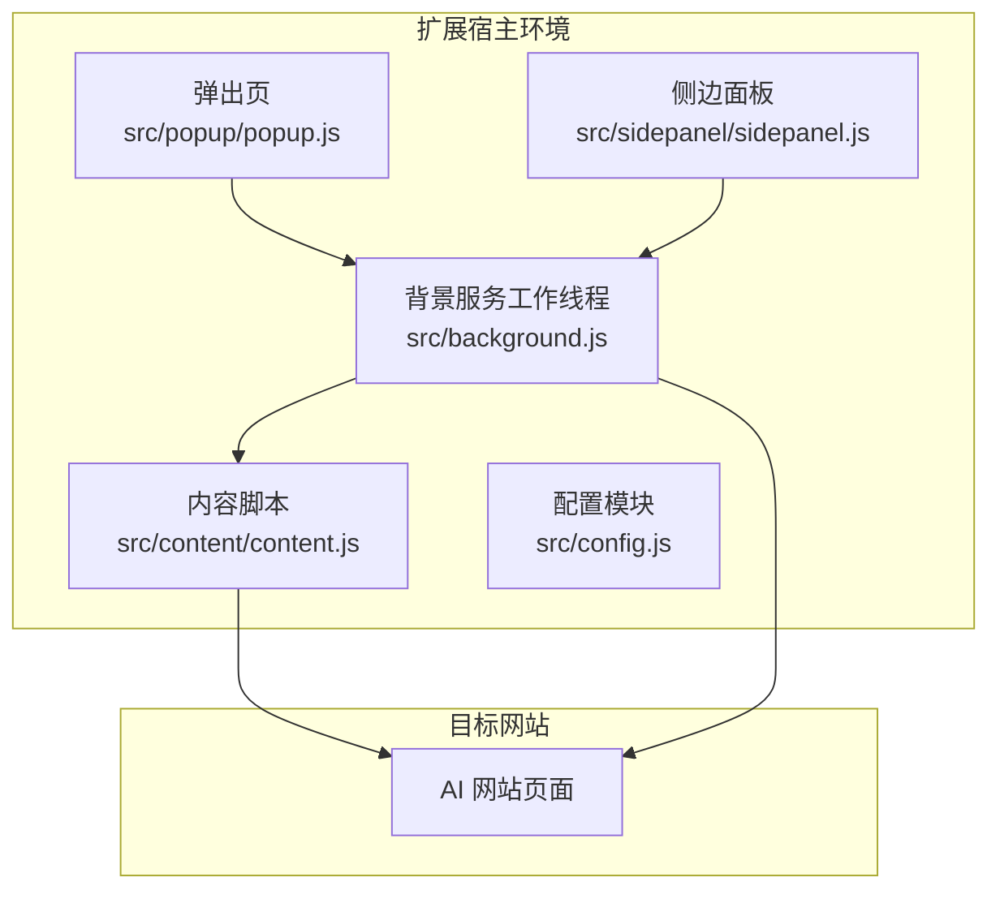
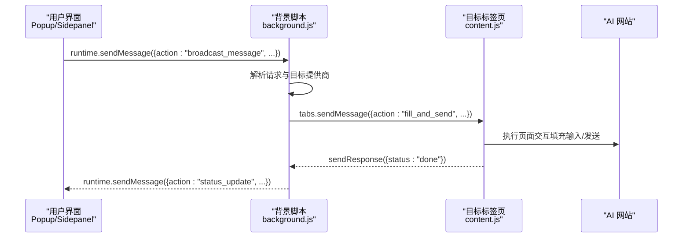
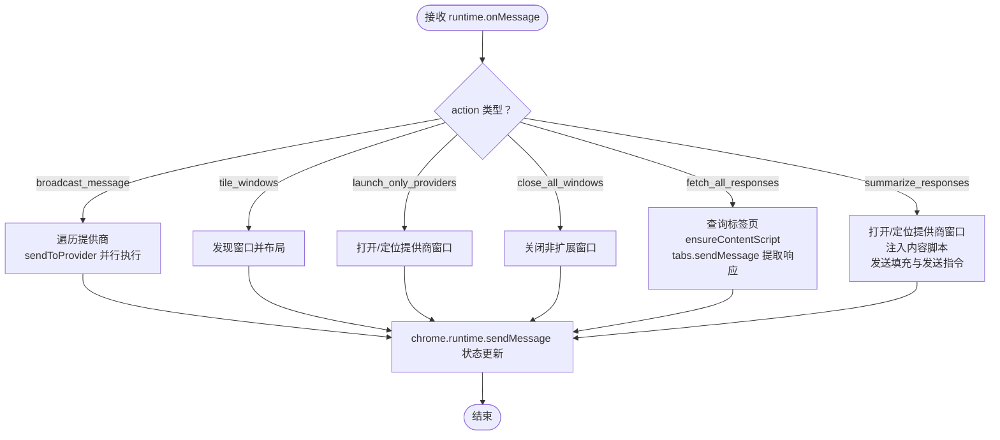
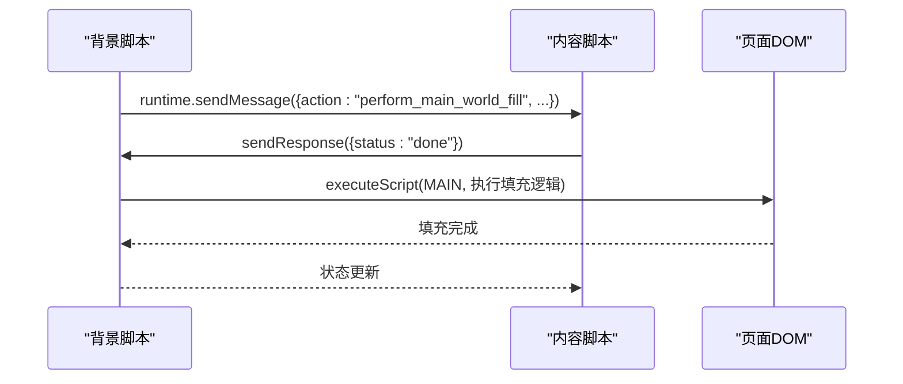
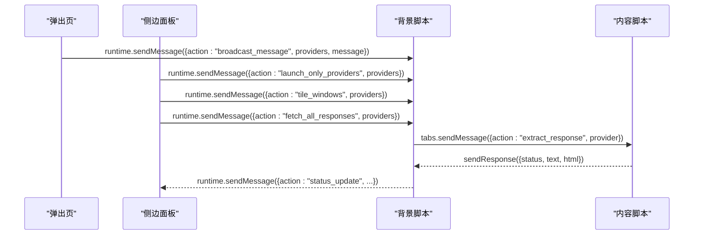
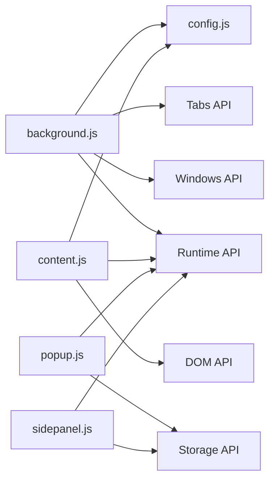

# 组件通信机制

<cite>
**本文档引用的文件**
- [manifest.json](file://manifest.json)
- [background.js](file://src/background.js)
- [content.js](file://src/content/content.js)
- [popup.js](file://src/popup/popup.js)
- [sidepanel.js](file://src/sidepanel/sidepanel.js)
- [config.js](file://src/config.js)
</cite>

## 目录
1. [简介](#简介)
2. [项目结构](#项目结构)
3. [核心组件](#核心组件)
4. [架构总览](#架构总览)
5. [详细组件分析](#详细组件分析)
6. [依赖关系分析](#依赖关系分析)
7. [性能考虑](#性能考虑)
8. [故障排除指南](#故障排除指南)
9. [结论](#结论)

## 简介
本文件系统性梳理 AI 多重宇宙对话扩展的组件通信机制，重点覆盖 Chrome 扩展的消息传递体系，包括：
- 背景脚本与内容脚本之间的双向通信
- 背景脚本与用户界面（弹出页/侧边面板）之间的消息传递
- 异步消息处理、Promise 使用与错误处理策略
- 广播消息、定向消息与响应式消息三种模式
- 具体通信场景：窗口管理、状态同步、数据传输等

## 项目结构
该扩展采用 Manifest V3 架构，包含以下关键模块：
- 背景服务工作线程：负责全局状态管理、窗口调度、跨标签页通信与消息路由
- 内容脚本：注入到目标 AI 网站，负责页面交互、输入填充、发送消息与响应提取
- 用户界面：弹出页与侧边面板，负责用户输入、配置选择与状态展示
- 配置模块：统一提供各 AI 平台的选择器、发送策略与文件上传支持

图表来源
- [background.js](file://src/background.js#L1-L120)
- [content.js](file://src/content/content.js#L1-L60)
- [popup.js](file://src/popup/popup.js#L1-L61)
- [sidepanel.js](file://src/sidepanel/sidepanel.js#L1-L120)

章节来源
- [manifest.json](file://manifest.json#L1-L79)
- [background.js](file://src/background.js#L1-L120)
- [content.js](file://src/content/content.js#L1-L60)
- [popup.js](file://src/popup/popup.js#L1-L61)
- [sidepanel.js](file://src/sidepanel/sidepanel.js#L1-L120)

## 核心组件
- 背景服务工作线程（Background Service Worker）
  - 监听扩展动作与命令
  - 管理窗口生命周期与布局
  - 路由消息到内容脚本并聚合响应
  - 向 UI 发送状态更新
- 内容脚本（Content Script）
  - 注入到目标站点，负责页面交互
  - 响应来自背景脚本的指令（填充输入、发送消息、提取响应）
  - 反向向背景脚本报告状态
- 用户界面（Popup/Sidepanel）
  - 接收用户输入与配置
  - 通过 runtime.sendMessage 发送广播/定向消息
  - 通过 runtime.onMessage 接收状态更新
- 配置模块（AI_CONFIG）
  - 定义各平台的选择器、发送策略、文件上传支持等

章节来源
- [background.js](file://src/background.js#L1-L120)
- [content.js](file://src/content/content.js#L1-L60)
- [popup.js](file://src/popup/popup.js#L1-L61)
- [sidepanel.js](file://src/sidepanel/sidepanel.js#L1-L120)
- [config.js](file://src/config.js#L1-L204)

## 架构总览
扩展采用“背景脚本为中心”的消息路由架构：
- UI 层通过 runtime.sendMessage 发送请求
- 背景脚本解析请求类型，执行相应逻辑
- 背景脚本通过 tabs.sendMessage 将指令下发到目标页面的内容脚本
- 内容脚本执行页面交互后，通过 sendResponse 或 runtime.sendMessage 返回结果
- 背景脚本聚合结果并向 UI 发送状态更新

图表来源
- [background.js](file://src/background.js#L138-L197)
- [content.js](file://src/content/content.js#L199-L216)
- [sidepanel.js](file://src/sidepanel/sidepanel.js#L1397-L1402)

章节来源
- [background.js](file://src/background.js#L138-L197)
- [content.js](file://src/content/content.js#L199-L216)
- [sidepanel.js](file://src/sidepanel/sidepanel.js#L1397-L1402)

## 详细组件分析

### 背景脚本：消息监听与路由
- 监听器注册
  - 使用 chrome.runtime.onMessage.addListener 接收来自 UI 和内容脚本的消息
  - 对于需要异步处理的任务，返回 true 以保持消息通道开放
- 广播消息处理
  - broadcast_message：遍历目标提供商，调用 sendToProvider 并行发送
  - 使用 Promise.allSettled 并行等待所有提供商完成
- 定向消息处理
  - tile_windows：按显示器布局排列指定提供商窗口
  - launch_only_providers：仅打开指定提供商的窗口
  - close_all_windows：关闭所有扩展控制面板以外的窗口
- 响应式消息处理
  - fetch_all_responses：查询各提供商标签页，确保内容脚本注入，然后 tabs.sendMessage 请求提取响应
  - summarize_responses：打开/定位目标提供商标签页，注入内容脚本，发送填充与发送指令
- 状态通知
  - 通过 chrome.runtime.sendMessage 向 UI 发送 status_update，用于实时反馈

图表来源
- [background.js](file://src/background.js#L138-L197)
- [background.js](file://src/background.js#L199-L268)
- [background.js](file://src/background.js#L298-L376)
- [background.js](file://src/background.js#L718-L786)

章节来源
- [background.js](file://src/background.js#L138-L197)
- [background.js](file://src/background.js#L199-L268)
- [background.js](file://src/background.js#L298-L376)
- [background.js](file://src/background.js#L718-L786)

### 内容脚本：页面交互与响应提取
- 监听器注册
  - 使用 chrome.runtime.onMessage.addListener 接收来自背景脚本的指令
- 响应处理
  - ping：用于检测内容脚本存活
  - fill_and_send：根据配置选择器定位输入框，填充文本，触发发送
  - extract_response：根据配置选择器提取最新 AI 响应，清理思维内容，返回文本/HTML
- 主世界填充
  - requestMainWorldFill：通过 runtime.sendMessage 请求背景脚本在 MAIN 世界执行填充，避免 React/Vue 等框架的复杂事件链

图表来源
- [content.js](file://src/content/content.js#L420-L432)
- [background.js](file://src/background.js#L378-L526)

章节来源
- [content.js](file://src/content/content.js#L199-L216)
- [content.js](file://src/content/content.js#L322-L418)
- [content.js](file://src/content/content.js#L420-L432)
- [background.js](file://src/background.js#L378-L526)

### 用户界面：弹出页与侧边面板
- 弹出页（popup.js）
  - 用户输入提示词与选择提供商
  - 通过 runtime.sendMessage 发送 broadcast_message
  - 通过 runtime.onMessage 监听 status_update 并更新状态日志
- 侧边面板（sidepanel.js）
  - 用户输入提示词与文件附件
  - 通过 runtime.sendMessage 发送 broadcast_message、launch_only_providers、tile_windows、fetch_all_responses、summarize_responses 等
  - 通过 runtime.onMessage 监听 status_update 实时反馈
  - 实现响应监控与轮询，等待各提供商返回结果
  - 实现智能总结功能，向指定模型发送汇总提示并轮询结果

图表来源
- [popup.js](file://src/popup/popup.js#L29-L45)
- [sidepanel.js](file://src/sidepanel/sidepanel.js#L1276-L1285)
- [sidepanel.js](file://src/sidepanel/sidepanel.js#L1700-L1721)
- [background.js](file://src/background.js#L246-L296)

章节来源
- [popup.js](file://src/popup/popup.js#L1-L61)
- [sidepanel.js](file://src/sidepanel/sidepanel.js#L1276-L1285)
- [sidepanel.js](file://src/sidepanel/sidepanel.js#L1700-L1721)
- [background.js](file://src/background.js#L246-L296)

### 异步消息处理与错误处理
- 异步处理模式
  - onMessage 监听器返回 true 以支持异步 sendResponse
  - Promise.allSettled 用于并行等待多提供商完成
  - tabs.sendMessage 返回 Promise，便于链式处理
- 错误处理策略
  - ensureContentScript：先尝试 ping，失败则注入脚本并延时
  - waitForTabLoad：监听标签页加载状态，设置超时避免阻塞
  - 通过 sendResponse 返回错误信息，UI 层显示状态更新
  - 对于文件上传与长耗时操作，采用超时与重试机制

章节来源
- [background.js](file://src/background.js#L656-L678)
- [background.js](file://src/background.js#L680-L716)
- [content.js](file://src/content/content.js#L593-L742)

### 广播消息、定向消息与响应式消息
- 广播消息（broadcast_message）
  - UI 层发送，背景脚本遍历提供商并行处理
  - 适合同时向多个 AI 平台发送相同提示词
- 定向消息（launch_only_providers、tile_windows、close_all_windows）
  - UI 层发送，背景脚本针对特定提供商或窗口进行操作
  - 适合窗口管理与布局控制
- 响应式消息（fetch_all_responses、summarize_responses）
  - UI 层发送，背景脚本查询标签页并请求内容脚本提取响应
  - 适合状态同步与数据传输

章节来源
- [background.js](file://src/background.js#L138-L197)
- [background.js](file://src/background.js#L199-L268)
- [background.js](file://src/background.js#L298-L376)
- [sidepanel.js](file://src/sidepanel/sidepanel.js#L1700-L1721)

### 具体通信场景示例

#### 场景一：窗口管理（打开/排列/关闭）
- 打开指定提供商窗口
  - 侧边面板发送 launch_only_providers
  - 背景脚本根据配置匹配 URL，创建或定位窗口
- 窗口排列
  - 侧边面板发送 tile_windows
  - 背景脚本发现窗口、确定显示器、计算布局并批量更新
- 关闭所有窗口
  - 侧边面板发送 close_all_windows
  - 背景脚本关闭除扩展控制面板外的所有窗口

章节来源
- [sidepanel.js](file://src/sidepanel/sidepanel.js#L1276-L1285)
- [background.js](file://src/background.js#L792-L860)
- [background.js](file://src/background.js#L528-L643)

#### 场景二：状态同步（实时反馈）
- 背景脚本在处理过程中通过 runtime.sendMessage 发送 status_update
- UI 通过 runtime.onMessage 接收并更新状态面板
- 适用于长耗时操作（如窗口排列、文件上传、响应提取）

章节来源
- [background.js](file://src/background.js#L788-L790)
- [popup.js](file://src/popup/popup.js#L47-L59)
- [sidepanel.js](file://src/sidepanel/sidepanel.js#L1821-L1831)

#### 场景三：数据传输（提取响应与智能总结）
- 提取响应
  - 侧边面板发送 fetch_all_responses
  - 背景脚本查询标签页、注入内容脚本、请求 extract_response
  - 内容脚本根据配置选择器提取最新响应，清理思维内容
- 智能总结
  - 侧边面板发送 summarize_responses
  - 背景脚本打开/定位目标模型窗口，注入内容脚本，发送填充与发送指令
  - 侧边面板轮询目标模型窗口响应，捕获新内容后写入历史

章节来源
- [sidepanel.js](file://src/sidepanel/sidepanel.js#L1700-L1721)
- [background.js](file://src/background.js#L199-L268)
- [content.js](file://src/content/content.js#L218-L320)
- [sidepanel.js](file://src/sidepanel/sidepanel.js#L2329-L2454)

## 依赖关系分析
- 背景脚本依赖
  - 配置模块：AI_CONFIG 提供平台选择器与策略
  - Tabs API：查询标签页、发送消息、创建窗口
  - Windows API：窗口发现、更新与布局
  - Runtime API：跨组件消息传递
- 内容脚本依赖
  - 配置模块：平台选择器与策略
  - Runtime API：与背景脚本通信
  - DOM API：页面交互与响应提取
- UI 依赖
  - Runtime API：与背景脚本通信
  - Storage API：持久化用户偏好与历史记录

图表来源
- [background.js](file://src/background.js#L69-L74)
- [content.js](file://src/content/content.js#L1-L20)
- [popup.js](file://src/popup/popup.js#L1-L20)
- [sidepanel.js](file://src/sidepanel/sidepanel.js#L1-L60)

章节来源
- [background.js](file://src/background.js#L69-L74)
- [content.js](file://src/content/content.js#L1-L20)
- [popup.js](file://src/popup/popup.js#L1-L20)
- [sidepanel.js](file://src/sidepanel/sidepanel.js#L1-L60)

## 性能考虑
- 并行处理
  - 广播消息与窗口排列使用 Promise.allSettled 并行执行，显著降低总耗时
- 延迟与重试
  - 文件上传与长耗时操作采用指数退避与超时控制，避免无限等待
- 状态缓存
  - providerWindows 缓存窗口与标签页映射，减少查询成本
- UI 响应
  - 通过 status_update 实时反馈，避免 UI 长时间无响应

## 故障排除指南
- 内容脚本未注入
  - 现象：tabs.sendMessage 报错或 ping 失败
  - 处理：ensureContentScript 自动注入 config.js 与 content.js，并延时等待
- 标签页未加载完成
  - 现象：提取响应失败或发送指令无效
  - 处理：waitForTabLoad 设置超时并清理监听器
- 选择器失效
  - 现象：无法定位输入框或响应容器
  - 处理：使用 diagnose_selectors 工具诊断并返回最佳选择器
- 文件上传失败
  - 现象：文件无法上传或超时
  - 处理：重试机制与超时控制，检查平台支持的文件类型

章节来源
- [background.js](file://src/background.js#L656-L678)
- [background.js](file://src/background.js#L680-L716)
- [content.js](file://src/content/content.js#L126-L197)
- [content.js](file://src/content/content.js#L593-L742)

## 结论
该扩展通过清晰的消息分层与异步处理机制，实现了 UI、背景脚本与内容脚本之间的高效协作。广播、定向与响应式三种消息模式覆盖了窗口管理、状态同步与数据传输等关键场景。配合并行处理、超时与重试策略，系统在复杂多平台环境下仍能保持稳定与高性能。