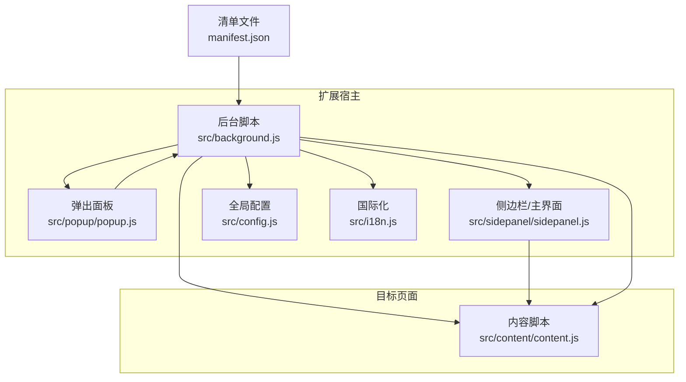
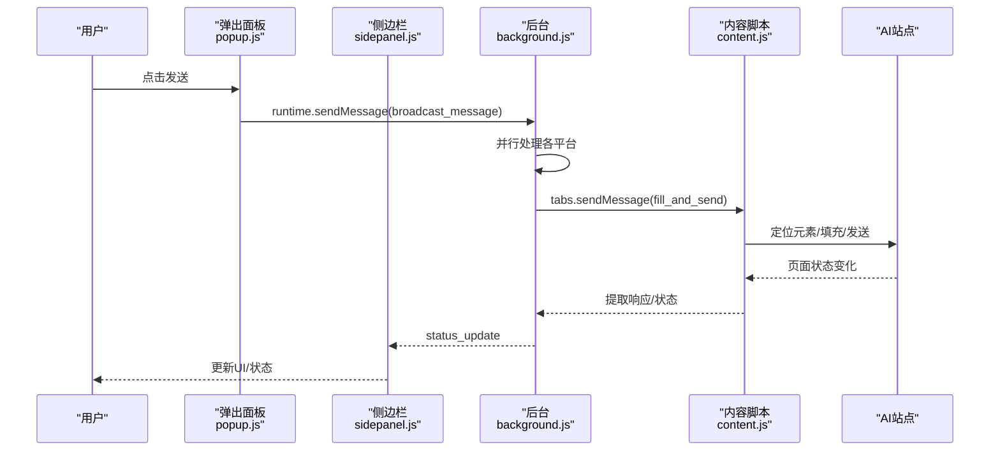
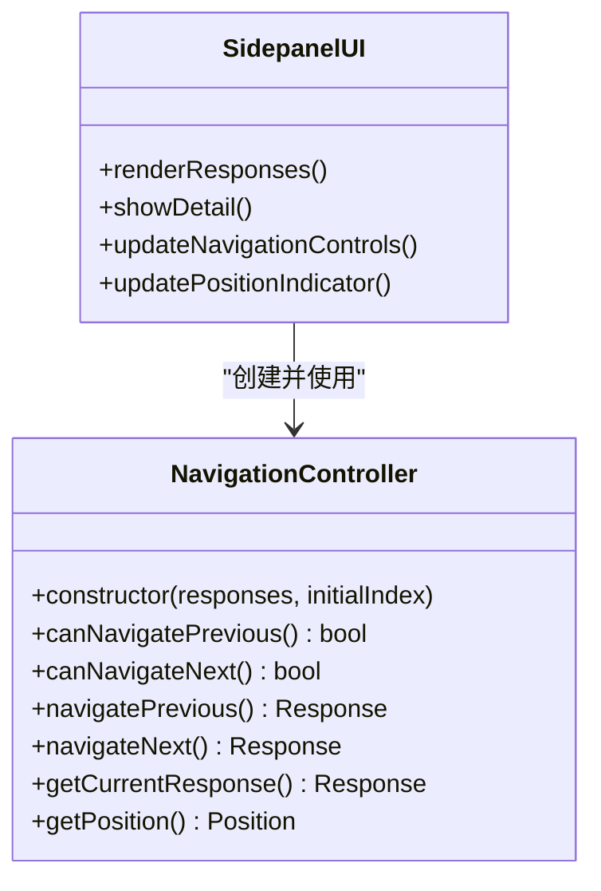
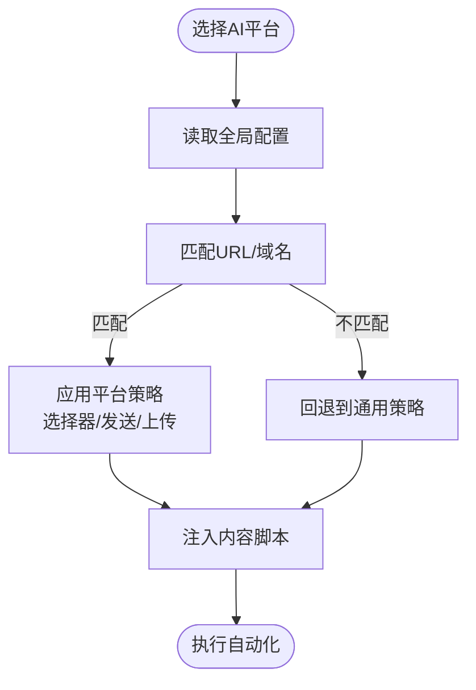
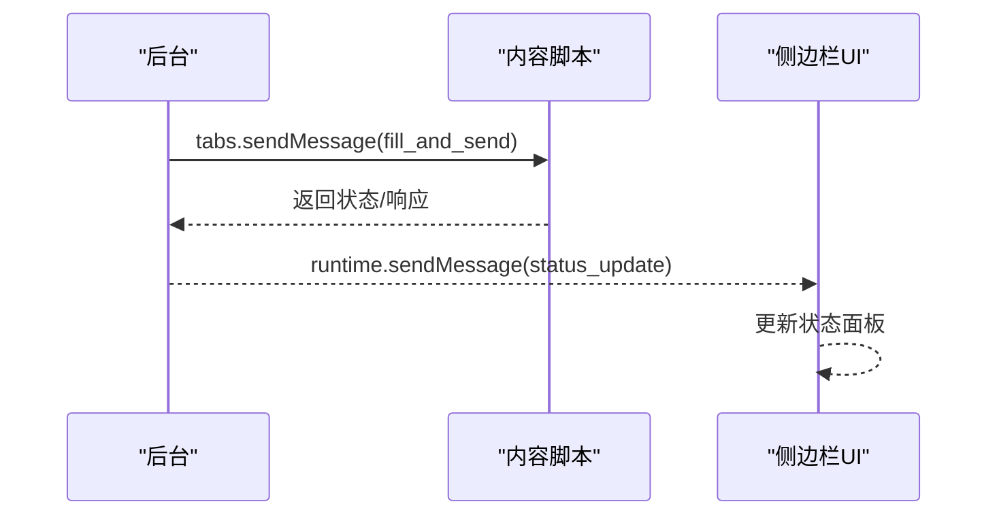
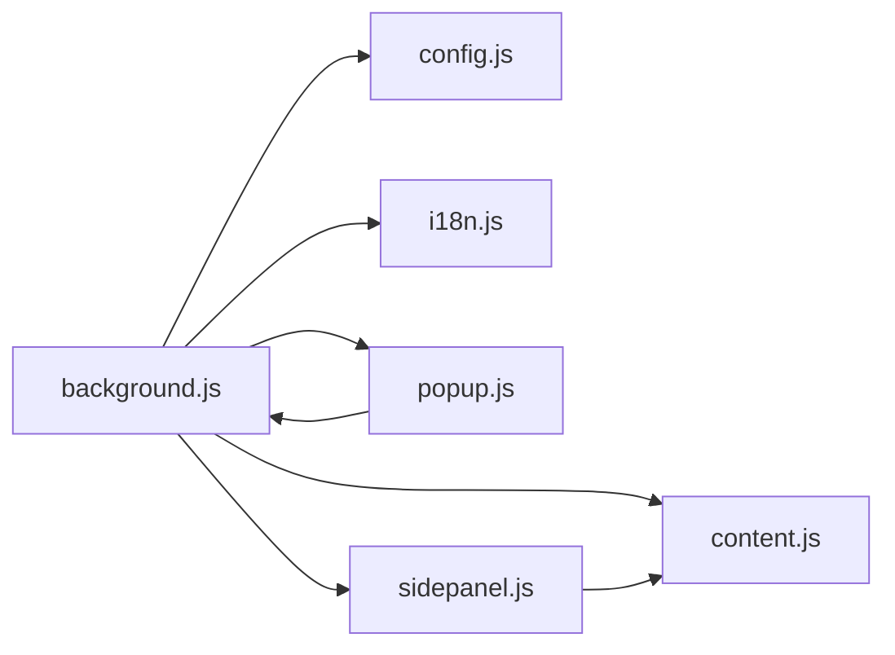

# 设计模式应用

<cite>
**本文引用的文件**
- [manifest.json](file://manifest.json)
- [src/background.js](file://src/background.js)
- [src/popup/popup.js](file://src/popup/popup.js)
- [src/sidepanel/sidepanel.js](file://src/sidepanel/sidepanel.js)
- [src/config.js](file://src/config.js)
- [src/content/content.js](file://src/content/content.js)
- [src/i18n.js](file://src/i18n.js)
- [.kiro/specs/modal-navigation/design.md](file://.kiro/specs/modal-navigation/design.md)
- [OPEN_SOURCE_STRATEGY.md](file://OPEN_SOURCE_STRATEGY.md)
</cite>

## 目录
1. [简介](#简介)
2. [项目结构](#项目结构)
3. [核心组件](#核心组件)
4. [架构总览](#架构总览)
5. [详细组件分析](#详细组件分析)
6. [依赖关系分析](#依赖关系分析)
7. [性能考量](#性能考量)
8. [故障排查指南](#故障排查指南)
9. [结论](#结论)
10. [附录](#附录)

## 简介
本文件面向“AI多重宇宙对话扩展”的设计模式应用进行系统性梳理与解读，围绕以下目标展开：
- 解释MVVM模式在用户界面中的应用方式与边界
- 描述插件架构在AI平台集成中的实现现状与演进方向
- 展示工厂模式在配置管理中的使用场景
- 阐述观察者模式在消息传递中的体现
- 分析策略模式在不同AI平台适配中的应用
- 讨论单例模式在全局状态管理中的使用
- 总结模块化设计在代码组织上的优势
- 提供具体代码片段路径，帮助开发者理解架构设计的深层原理与最佳实践

## 项目结构
该项目采用Chrome扩展的典型分层结构：后台服务脚本负责跨页面协调与窗口管理；弹出面板与侧边栏作为UI入口；内容脚本注入到各AI站点执行自动化操作；配置与国际化分别集中于全局配置与翻译模块。

图表来源
- [manifest.json](file://manifest.json#L42-L68)
- [src/background.js](file://src/background.js#L1-L120)
- [src/popup/popup.js](file://src/popup/popup.js#L1-L61)
- [src/sidepanel/sidepanel.js](file://src/sidepanel/sidepanel.js#L1-L120)
- [src/config.js](file://src/config.js#L1-L50)
- [src/content/content.js](file://src/content/content.js#L1-L40)

章节来源
- [manifest.json](file://manifest.json#L1-L79)
- [src/background.js](file://src/background.js#L1-L120)
- [src/popup/popup.js](file://src/popup/popup.js#L1-L61)
- [src/sidepanel/sidepanel.js](file://src/sidepanel/sidepanel.js#L1-L120)
- [src/config.js](file://src/config.js#L1-L50)
- [src/content/content.js](file://src/content/content.js#L1-L40)

## 核心组件
- 后台服务脚本：负责窗口生命周期管理、消息路由、跨页面通信、AI平台配置与状态跟踪。
- 弹出面板：轻量UI入口，用于快速选择AI平台并广播消息。
- 侧边栏主界面：复杂UI与业务逻辑中心，包含响应展示、摘要、历史、导航等。
- 内容脚本：注入到目标AI站点，负责元素定位、填充输入、触发发送、提取响应。
- 全局配置：统一管理各AI平台的选择器、发送策略、文件上传能力等。
- 国际化模块：提供翻译函数与本地化格式化工具。

章节来源
- [src/background.js](file://src/background.js#L133-L197)
- [src/popup/popup.js](file://src/popup/popup.js#L1-L61)
- [src/sidepanel/sidepanel.js](file://src/sidepanel/sidepanel.js#L41-L120)
- [src/content/content.js](file://src/content/content.js#L199-L216)
- [src/config.js](file://src/config.js#L5-L199)
- [src/i18n.js](file://src/i18n.js#L6-L346)

## 架构总览
整体采用“后台协调 + 多页面协作”的架构：
- 后台监听命令与消息，调度窗口与内容脚本
- 弹出面板与侧边栏通过消息与后台交互
- 内容脚本在目标站点内执行自动化，必要时回传结果
- 配置与国际化贯穿前后端，确保一致性

图表来源
- [src/popup/popup.js](file://src/popup/popup.js#L30-L45)
- [src/background.js](file://src/background.js#L138-L197)
- [src/content/content.js](file://src/content/content.js#L199-L216)
- [src/sidepanel/sidepanel.js](file://src/sidepanel/sidepanel.js#L47-L60)

## 详细组件分析

### MVVM模式在用户界面中的应用
- 角色划分
  - Model：全局状态与数据源（如AI配置、历史记录、响应集合、主题/语言偏好）
  - View：HTML模板与DOM元素（侧边栏、弹出面板、模态框）
  - ViewModel：事件绑定与状态驱动逻辑（侧边栏中的渲染、导航、摘要、历史等）
- 实践要点
  - 事件驱动：大量使用addEventListener绑定UI事件，形成“视图变更 -> 状态更新 -> 视图刷新”的闭环
  - 数据驱动：通过chrome.storage.local读写状态，配合渲染函数更新UI
  - 模态与导航：细节模态与导航控制器分离，职责清晰
- 边界与局限
  - 项目未采用框架级MVVM，而是原生JS事件与状态管理，属于“手写MVVM”
  - 导航控制器类体现了MVVM中的“ViewModel”职责，但未见双向绑定或响应式依赖追踪

图表来源
- [src/sidepanel/sidepanel.js](file://src/sidepanel/sidepanel.js#L712-L809)
- [.kiro/specs/modal-navigation/design.md](file://.kiro/specs/modal-navigation/design.md#L66-L107)

章节来源
- [src/sidepanel/sidepanel.js](file://src/sidepanel/sidepanel.js#L712-L809)
- [.kiro/specs/modal-navigation/design.md](file://.kiro/specs/modal-navigation/design.md#L60-L120)

### 插件架构在AI平台集成中的实现
- 现状
  - 通过全局配置对象集中管理各AI平台的URL模式、选择器、发送策略、文件上传能力等
  - 后台与内容脚本均依赖该配置进行跨平台适配
- 演进方向
  - 文档提出将“硬编码配置”迁移到“插件/适配器模式”，按平台拆分为独立文件，便于维护与扩展
- 价值
  - 降低耦合：平台差异通过配置隔离
  - 可扩展：新增平台只需补充配置或插件文件

图表来源
- [src/config.js](file://src/config.js#L5-L199)
- [src/content/content.js](file://src/content/content.js#L342-L383)
- [OPEN_SOURCE_STRATEGY.md](file://OPEN_SOURCE_STRATEGY.md#L33-L51)

章节来源
- [src/config.js](file://src/config.js#L5-L199)
- [src/content/content.js](file://src/content/content.js#L342-L383)
- [OPEN_SOURCE_STRATEGY.md](file://OPEN_SOURCE_STRATEGY.md#L33-L51)

### 工厂模式在配置管理中的使用
- 场景：内容脚本在运行时根据平台ID或URL动态选择对应的配置，并据此决定填充与发送策略
- 表现：通过全局配置对象的键值访问，实现“按需实例化/选择”的工厂式行为
- 优势：集中管理、易于扩展新平台；与插件架构相辅相成

章节来源
- [src/content/content.js](file://src/content/content.js#L342-L383)
- [src/config.js](file://src/config.js#L5-L199)

### 观察者模式在消息传递中的体现
- 事件监听：后台脚本与内容脚本均注册消息监听器，形成“发布-订阅”机制
- UI更新：侧边栏监听runtime消息，实时更新状态面板
- 事件绑定：侧边栏对导航、键盘、触摸等事件进行监听，形成“事件-回调”链路

图表来源
- [src/background.js](file://src/background.js#L138-L197)
- [src/content/content.js](file://src/content/content.js#L199-L216)
- [src/sidepanel/sidepanel.js](file://src/sidepanel/sidepanel.js#L47-L60)

章节来源
- [src/background.js](file://src/background.js#L138-L197)
- [src/content/content.js](file://src/content/content.js#L199-L216)
- [src/sidepanel/sidepanel.js](file://src/sidepanel/sidepanel.js#L47-L60)

### 策略模式在不同AI平台适配中的应用
- 策略维度
  - 输入填充策略：主世界填充、内容脚本填充
  - 发送策略：按钮点击、回车键、表单提交
  - 文件上传策略：不同平台的上传按钮与输入元素
- 实现方式
  - 通过配置对象中的字段（如fillMethod/sendMethod/supportsFiles）选择对应策略
  - 内容脚本根据策略分支执行相应逻辑

章节来源
- [src/config.js](file://src/config.js#L17-L21)
- [src/content/content.js](file://src/content/content.js#L466-L565)
- [src/content/content.js](file://src/content/content.js#L616-L742)

### 单例模式在全局状态管理中的使用
- 全局配置单例：AI_CONFIG作为全局常量，被后台与内容脚本共享
- 国际化单例：I18N对象与t/setLanguage/formatDateTime等函数通过IIFE暴露到全局作用域，形成单一翻译入口
- 后台状态单例：providerWindows等全局状态用于跟踪各平台窗口与标签页

章节来源
- [src/config.js](file://src/config.js#L5-L199)
- [src/i18n.js](file://src/i18n.js#L348-L503)
- [src/background.js](file://src/background.js#L3-L8)

### 模块化设计在代码组织中的优势
- 职责分离：后台、UI、内容脚本、配置、国际化各司其职
- 可维护性：配置集中、策略明确、事件解耦
- 可扩展性：新增平台仅需补充配置或插件文件

章节来源
- [manifest.json](file://manifest.json#L42-L68)
- [src/background.js](file://src/background.js#L1-L120)
- [src/sidepanel/sidepanel.js](file://src/sidepanel/sidepanel.js#L1-L120)
- [src/content/content.js](file://src/content/content.js#L1-L40)
- [src/config.js](file://src/config.js#L5-L199)
- [src/i18n.js](file://src/i18n.js#L6-L346)

## 依赖关系分析
- 后台依赖全局配置与国际化，协调弹出面板与侧边栏，控制内容脚本注入与消息转发
- 侧边栏依赖后台消息与内容脚本返回的数据，驱动UI渲染与交互
- 内容脚本依赖全局配置与后台提供的主世界填充接口
- 弹出面板仅依赖后台的消息通道

图表来源
- [src/background.js](file://src/background.js#L69-L74)
- [src/popup/popup.js](file://src/popup/popup.js#L1-L61)
- [src/sidepanel/sidepanel.js](file://src/sidepanel/sidepanel.js#L1-L120)
- [src/content/content.js](file://src/content/content.js#L1-L40)
- [src/config.js](file://src/config.js#L5-L199)
- [src/i18n.js](file://src/i18n.js#L495-L503)

章节来源
- [src/background.js](file://src/background.js#L69-L74)
- [src/popup/popup.js](file://src/popup/popup.js#L1-L61)
- [src/sidepanel/sidepanel.js](file://src/sidepanel/sidepanel.js#L1-L120)
- [src/content/content.js](file://src/content/content.js#L1-L40)
- [src/config.js](file://src/config.js#L5-L199)
- [src/i18n.js](file://src/i18n.js#L495-L503)

## 性能考量
- 并行处理：后台对多个平台的广播与拉取采用Promise.allSettled，提高吞吐
- 超时与重试：内容脚本上传与等待按钮存在超时与重试机制，平衡稳定性与性能
- UI渲染：侧边栏在响应较多时采用网格布局与懒加载策略，避免一次性渲染过多DOM

章节来源
- [src/background.js](file://src/background.js#L718-L721)
- [src/content/content.js](file://src/content/content.js#L640-L672)
- [src/sidepanel/sidepanel.js](file://src/sidepanel/sidepanel.js#L350-L361)

## 故障排查指南
- 脚本注入失败：后台检测到注入失败时会通过状态通知UI
- 选择器诊断：内容脚本提供诊断功能，输出各选择器命中情况
- 窗口布局异常：后台提供平铺窗口功能，支持多显示器与显示区域选择
- 语言与主题：国际化模块提供切换与持久化，UI支持主题切换

章节来源
- [src/background.js](file://src/background.js#L163-L169)
- [src/content/content.js](file://src/content/content.js#L127-L197)
- [src/background.js](file://src/background.js#L528-L643)
- [src/i18n.js](file://src/i18n.js#L348-L413)

## 结论
本项目在无框架约束下实现了较为完整的前端架构：后台协调、UI事件驱动、内容脚本自动化、集中配置与国际化。设计模式体现在：
- MVVM：原生事件与状态驱动，侧边栏承担ViewModel职责
- 插件架构：通过配置与未来插件化演进，隔离平台差异
- 工厂模式：按平台ID/URL选择策略
- 观察者模式：消息监听与UI更新
- 策略模式：输入填充、发送、上传策略的差异化
- 单例模式：全局配置与国际化
- 模块化：职责清晰、易于扩展

建议在未来版本中：
- 引入插件/适配器模式，将平台逻辑拆分至独立文件
- 增强响应式状态管理，降低事件绑定复杂度
- 统一错误处理与日志上报，提升可观测性

## 附录
- 代码片段路径参考
  - 广播消息与窗口管理：[src/background.js](file://src/background.js#L138-L197)
  - 弹出面板消息发送：[src/popup/popup.js](file://src/popup/popup.js#L30-L45)
  - 侧边栏状态监听与渲染：[src/sidepanel/sidepanel.js](file://src/sidepanel/sidepanel.js#L47-L60)
  - 内容脚本消息监听与响应提取：[src/content/content.js](file://src/content/content.js#L199-L320)
  - 导航控制器类与事件绑定：[src/sidepanel/sidepanel.js](file://src/sidepanel/sidepanel.js#L712-L809)
  - 导航设计规范与事件处理：[.kiro/specs/modal-navigation/design.md](file://.kiro/specs/modal-navigation/design.md#L60-L205)
  - 全局配置与平台策略：[src/config.js](file://src/config.js#L5-L199)
  - 国际化与日期格式化：[src/i18n.js](file://src/i18n.js#L348-L503)
  - 插件架构演进规划：[OPEN_SOURCE_STRATEGY.md](file://OPEN_SOURCE_STRATEGY.md#L33-L51)