# 主题切换系统

<cite>
**本文档引用的文件**
- [manifest.json](file://manifest.json)
- [sidepanel.html](file://src/sidepanel/sidepanel.html)
- [sidepanel.css](file://src/sidepanel/sidepanel.css)
- [sidepanel.js](file://src/sidepanel/sidepanel.js)
- [popup.html](file://src/popup/popup.html)
- [popup.css](file://src/popup/popup.css)
- [popup.js](file://src/popup/popup.js)
- [background.js](file://src/background.js)
</cite>

## 目录
1. [简介](#简介)
2. [项目结构](#项目结构)
3. [核心组件](#核心组件)
4. [架构概览](#架构概览)
5. [详细组件分析](#详细组件分析)
6. [依赖关系分析](#依赖关系分析)
7. [性能考虑](#性能考虑)
8. [故障排除指南](#故障排除指南)
9. [结论](#结论)

## 简介

AI Multiverse 扩展的主题切换系统是一个完整的暗色/亮色主题管理解决方案。该系统实现了基于 CSS 变量的主题切换机制，支持用户偏好的持久化存储，并提供了直观的视觉反馈和状态指示器。

该系统的核心特性包括：
- 基于 CSS 自定义属性的主题变量系统
- Chrome Storage API 的本地偏好存储
- 动态图标切换和状态指示器
- 跨组件的主题一致性保证
- 平滑的动画过渡效果

## 项目结构

主题切换系统主要分布在扩展的前端界面中，采用模块化设计：

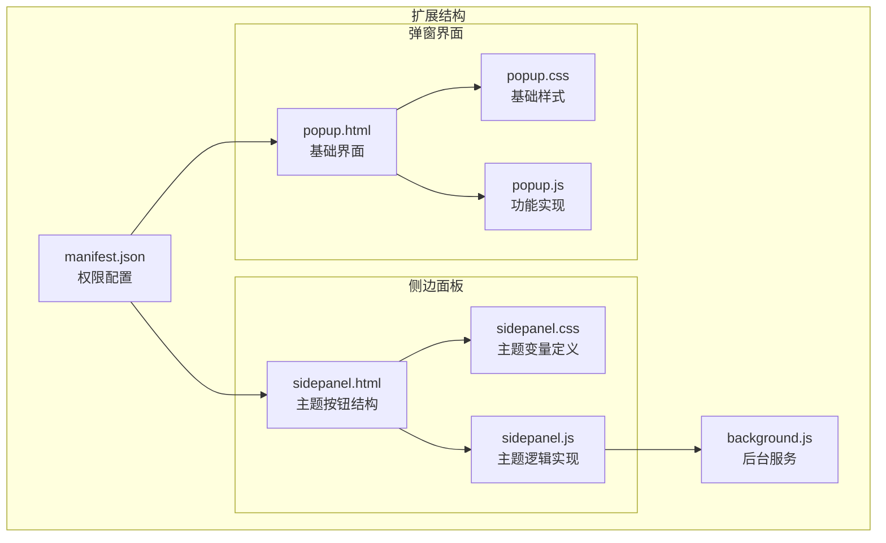

**图表来源**
- [manifest.json](file://manifest.json#L1-L79)
- [sidepanel.html](file://src/sidepanel/sidepanel.html#L1-L400)
- [popup.html](file://src/popup/popup.html#L1-L50)

**章节来源**
- [manifest.json](file://manifest.json#L1-L79)
- [sidepanel.html](file://src/sidepanel/sidepanel.html#L1-L400)
- [popup.html](file://src/popup/popup.html#L1-L50)

## 核心组件

### CSS 变量系统

主题切换的核心是基于 CSS 自定义属性的变量系统。系统定义了两套完整的主题变量集：

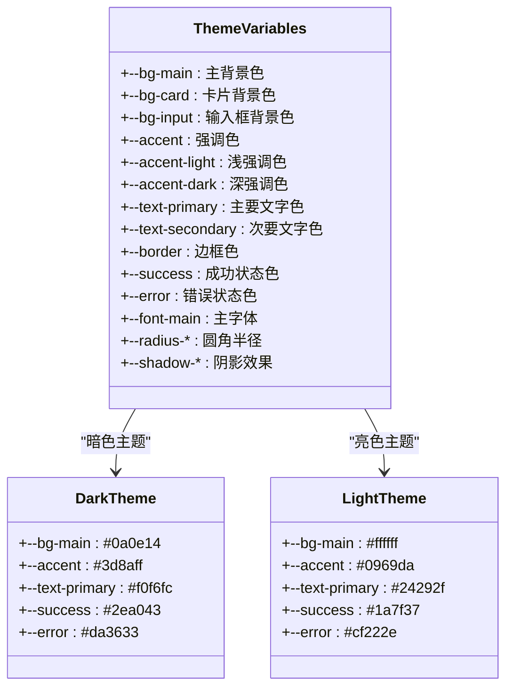

**图表来源**
- [sidepanel.css](file://src/sidepanel/sidepanel.css#L1-L100)

### 主题切换按钮

主题切换按钮位于侧边面板的头部区域，包含太阳和月亮两个图标：

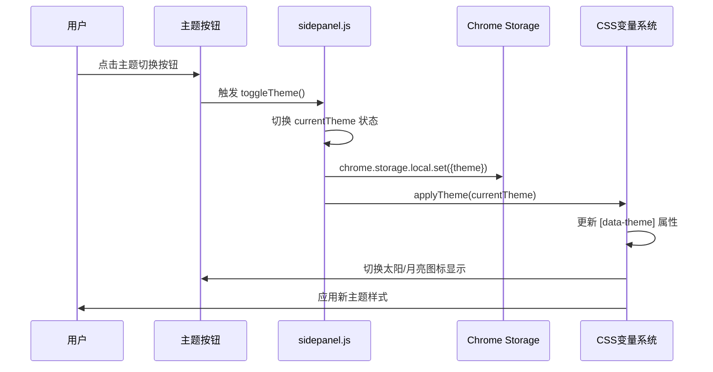

**图表来源**
- [sidepanel.js](file://src/sidepanel/sidepanel.js#L1842-L1862)
- [sidepanel.html](file://src/sidepanel/sidepanel.html#L33-L48)

**章节来源**
- [sidepanel.css](file://src/sidepanel/sidepanel.css#L1-L100)
- [sidepanel.js](file://src/sidepanel/sidepanel.js#L1834-L1862)
- [sidepanel.html](file://src/sidepanel/sidepanel.html#L33-L48)

## 架构概览

主题切换系统采用分层架构设计，确保主题状态的一致性和可维护性：

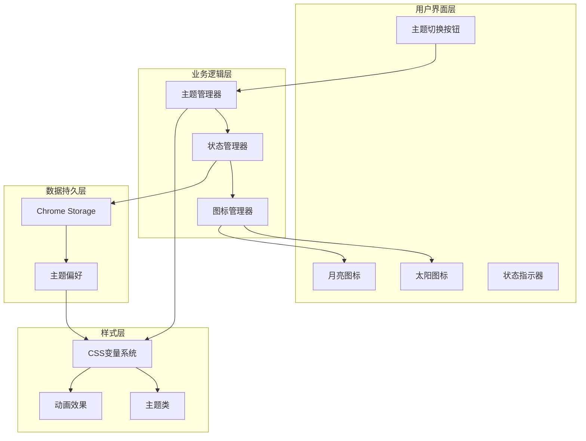

**图表来源**
- [sidepanel.js](file://src/sidepanel/sidepanel.js#L1834-L1862)
- [sidepanel.css](file://src/sidepanel/sidepanel.css#L1-L100)

## 详细组件分析

### 主题状态管理系统

#### 加载主题偏好
系统启动时会从 Chrome Storage 中加载用户的主题偏好：

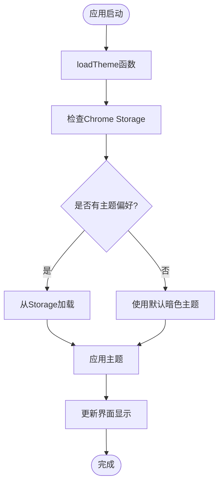

**图表来源**
- [sidepanel.js](file://src/sidepanel/sidepanel.js#L1835-L1840)

#### 主题切换逻辑
用户点击主题按钮时触发的完整流程：

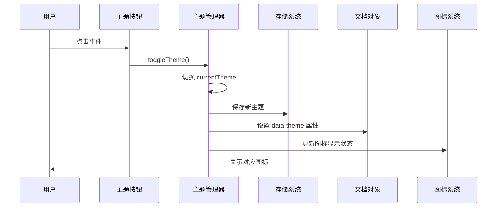

**图表来源**
- [sidepanel.js](file://src/sidepanel/sidepanel.js#L1842-L1862)

**章节来源**
- [sidepanel.js](file://src/sidepanel/sidepanel.js#L1834-L1862)

### CSS 变量系统实现

#### 变量定义策略
系统采用分层的 CSS 变量定义策略：

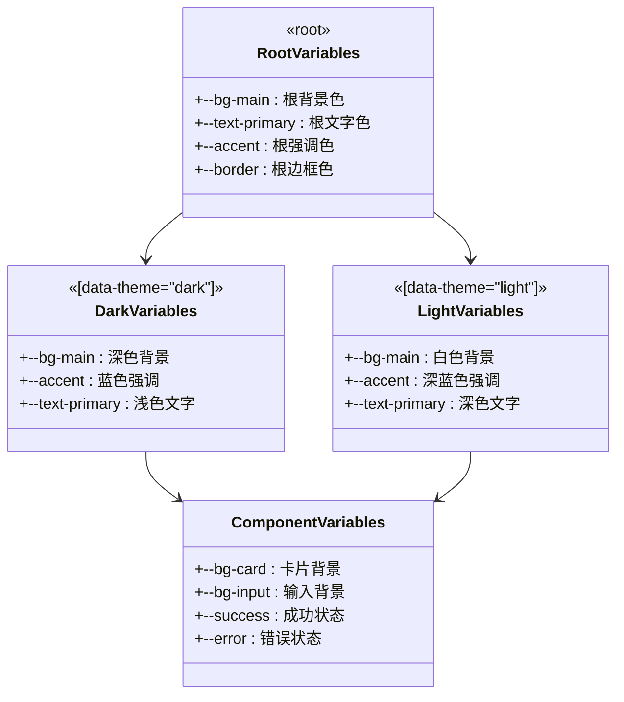

**图表来源**
- [sidepanel.css](file://src/sidepanel/sidepanel.css#L1-L100)

#### 样式应用机制
CSS 变量通过 `var()` 函数在所有组件中应用：

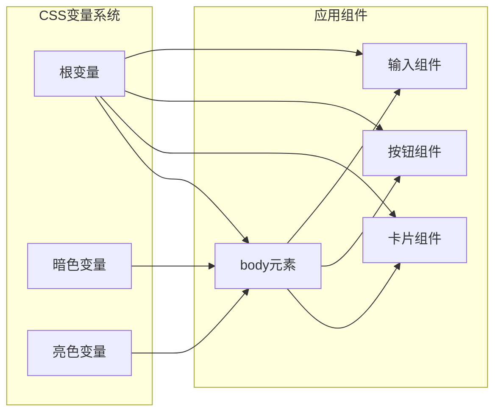

**图表来源**
- [sidepanel.css](file://src/sidepanel/sidepanel.css#L108-L115)

**章节来源**
- [sidepanel.css](file://src/sidepanel/sidepanel.css#L1-L100)

### 图标切换动画系统

#### 图标切换机制
主题切换按钮包含太阳和月亮两个 SVG 图标，通过 CSS 控制显示状态：

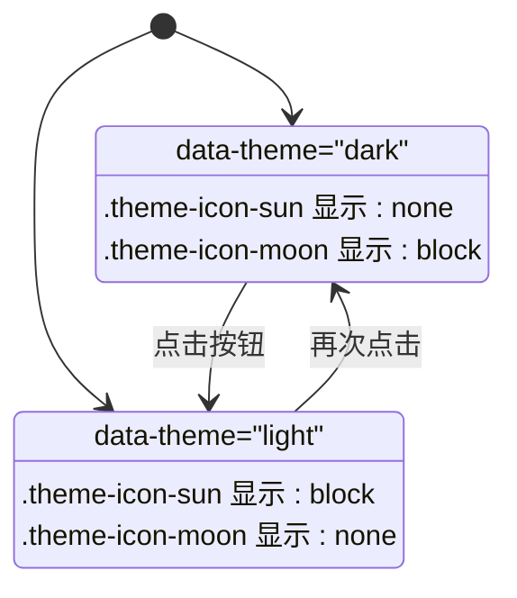

**图表来源**
- [sidepanel.js](file://src/sidepanel/sidepanel.js#L1851-L1861)
- [sidepanel.html](file://src/sidepanel/sidepanel.html#L34-L47)

#### 状态指示器
系统还包含一个全局状态指示器，用于显示系统状态：

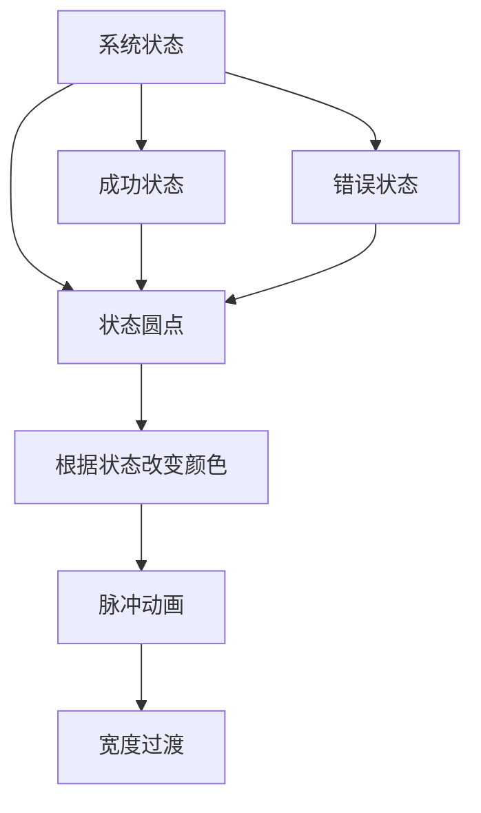

**图表来源**
- [sidepanel.css](file://src/sidepanel/sidepanel.css#L246-L264)
- [sidepanel.js](file://src/sidepanel/sidepanel.js#L1821-L1826)

**章节来源**
- [sidepanel.js](file://src/sidepanel/sidepanel.js#L1821-L1862)
- [sidepanel.css](file://src/sidepanel/sidepanel.css#L246-L264)

### 持久化存储机制

#### Chrome Storage 集成
主题偏好通过 Chrome Storage API 实现持久化：

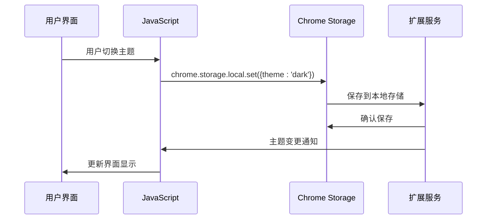

**图表来源**
- [sidepanel.js](file://src/sidepanel/sidepanel.js#L1844-L1845)

#### 存储数据结构
存储系统使用简单的键值对结构：

| 键名 | 数据类型 | 描述 | 默认值 |
|------|----------|------|--------|
| `theme` | String | 当前主题状态 | `'dark'` |
| `lang` | String | 语言偏好 | `'en'` |
| `selected_providers` | Array | 选中的AI模型 | `[]` |

**章节来源**
- [sidepanel.js](file://src/sidepanel/sidepanel.js#L1835-L1845)

## 依赖关系分析

### 权限依赖

主题切换系统需要特定的浏览器权限才能正常工作：

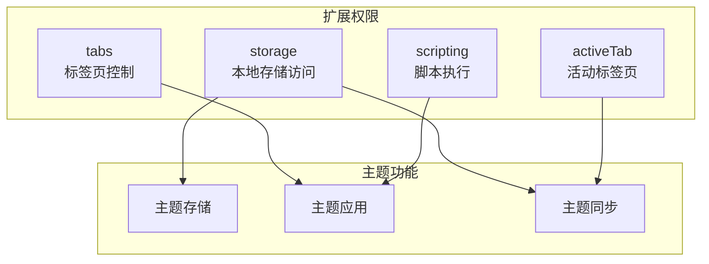

**图表来源**
- [manifest.json](file://manifest.json#L12-L18)

### 组件耦合度

主题系统采用松耦合设计，各组件职责明确：

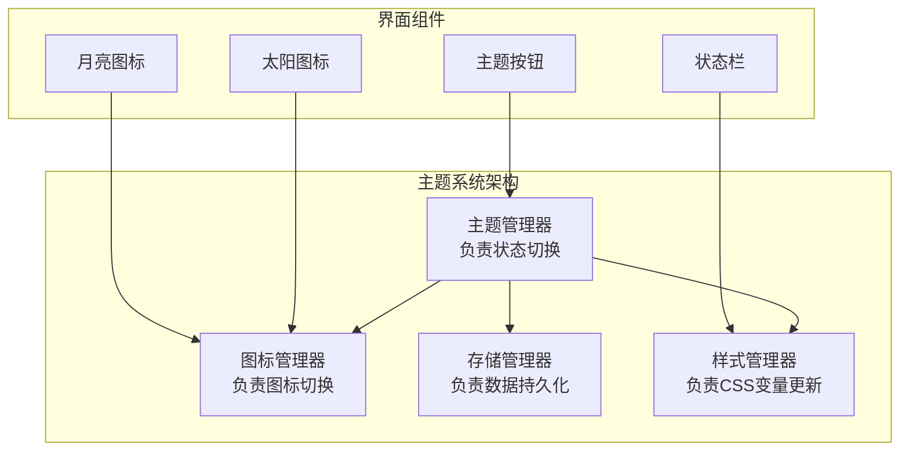

**图表来源**
- [sidepanel.js](file://src/sidepanel/sidepanel.js#L1834-L1862)

**章节来源**
- [manifest.json](file://manifest.json#L12-L18)
- [sidepanel.js](file://src/sidepanel/sidepanel.js#L1834-L1862)

## 性能考虑

### CSS 变量优化
- 使用 CSS 自定义属性减少重复定义
- 通过 `:root` 和 `[data-theme]` 选择器实现高效的样式切换
- 避免使用昂贵的 CSS 选择器

### JavaScript 优化
- 使用事件委托减少事件监听器数量
- 采用防抖和节流技术优化频繁操作
- 合理使用缓存机制避免重复计算

### 存储优化
- 使用批量存储操作减少 I/O 操作
- 实现增量更新避免不必要的重绘
- 采用异步存储操作避免阻塞主线程

## 故障排除指南

### 常见问题及解决方案

#### 主题切换无效
1. 检查 Chrome Storage 权限是否正确配置
2. 验证 `data-theme` 属性是否正确设置
3. 确认 CSS 变量是否正确应用

#### 图标不显示
1. 检查 SVG 图标的 `display` 属性
2. 验证 CSS 选择器是否正确匹配
3. 确认主题状态与图标状态一致

#### 界面闪烁
1. 检查 CSS 过渡动画是否正确配置
2. 验证 JavaScript 执行顺序
3. 确认 DOM 更新时机

**章节来源**
- [sidepanel.js](file://src/sidepanel/sidepanel.js#L1842-L1862)
- [sidepanel.css](file://src/sidepanel/sidepanel.css#L1851-L1861)

## 结论

AI Multiverse 的主题切换系统展现了现代 Web 扩展开发的最佳实践。通过采用 CSS 自定义属性、Chrome Storage API 和模块化的 JavaScript 设计，系统实现了：

1. **高效的主题切换**：通过 CSS 变量系统实现即时的主题切换
2. **持久化的用户偏好**：利用 Chrome Storage 实现跨会话的主题记忆
3. **直观的视觉反馈**：太阳/月亮图标的动态切换提供清晰的状态指示
4. **良好的可维护性**：模块化的设计便于功能扩展和 bug 修复
5. **优秀的用户体验**：平滑的动画过渡和即时的视觉反馈

该系统为其他浏览器扩展的主题功能开发提供了优秀的参考模板，展示了如何在受限的扩展环境中实现复杂的功能需求。