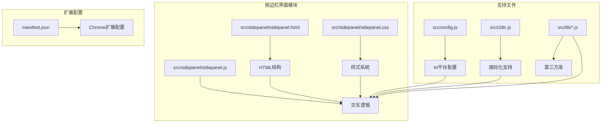
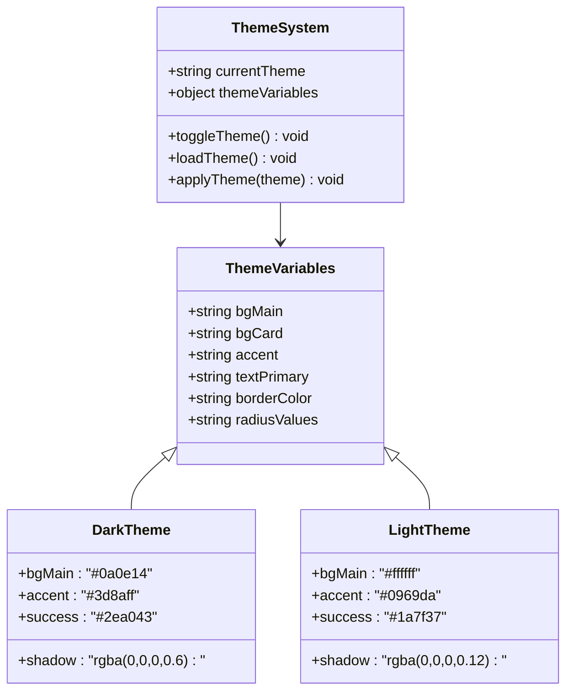
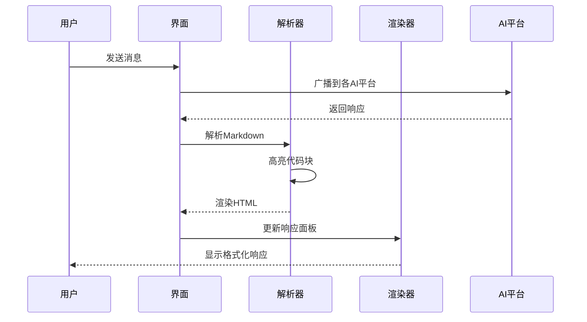
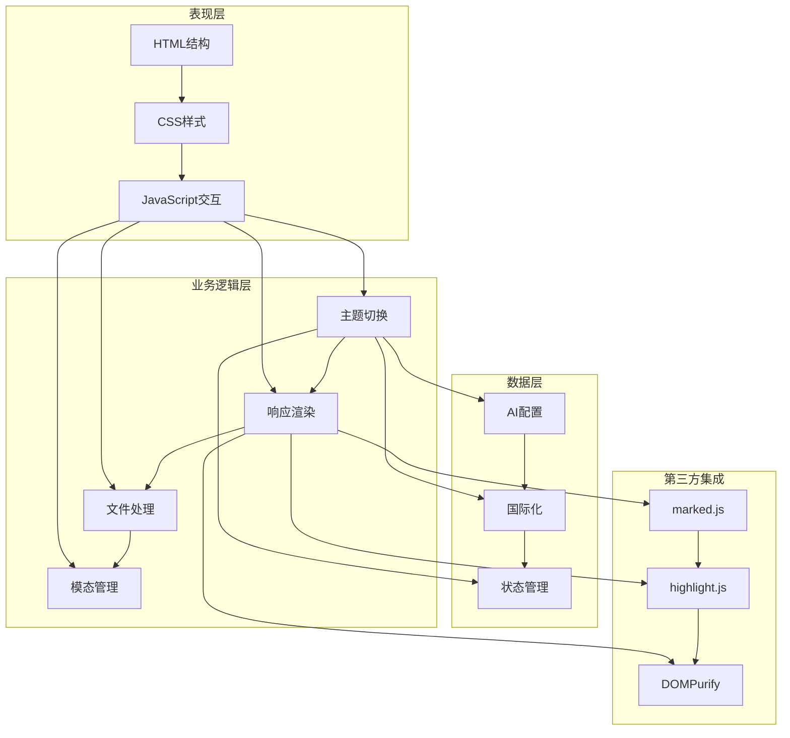
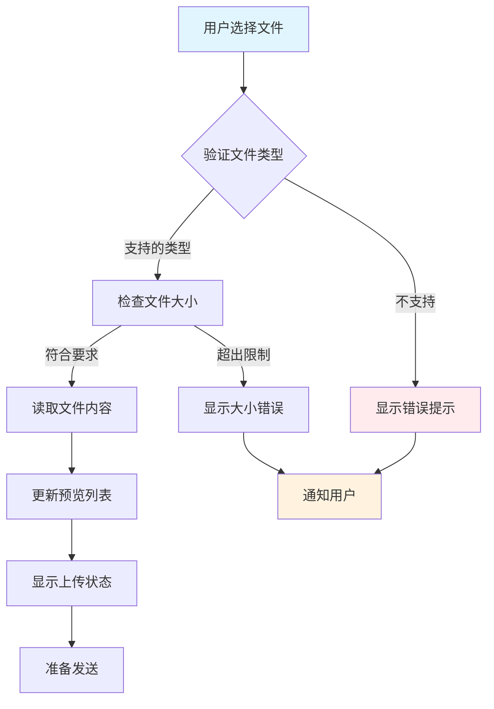
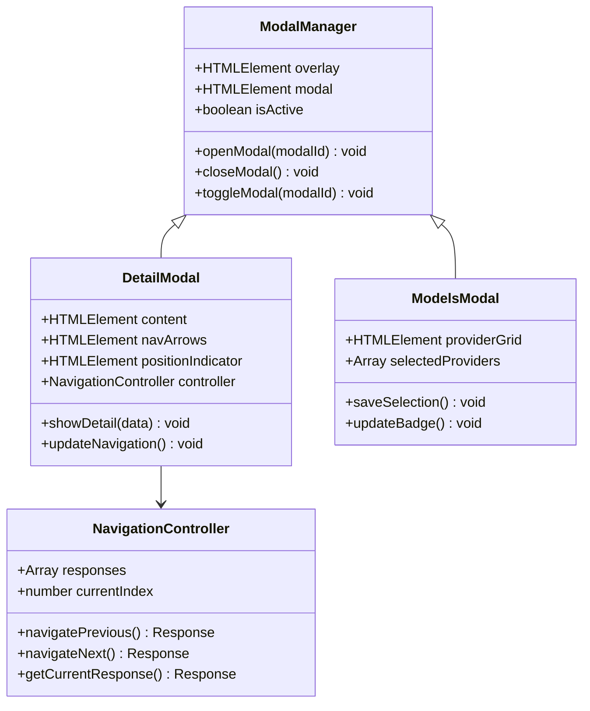
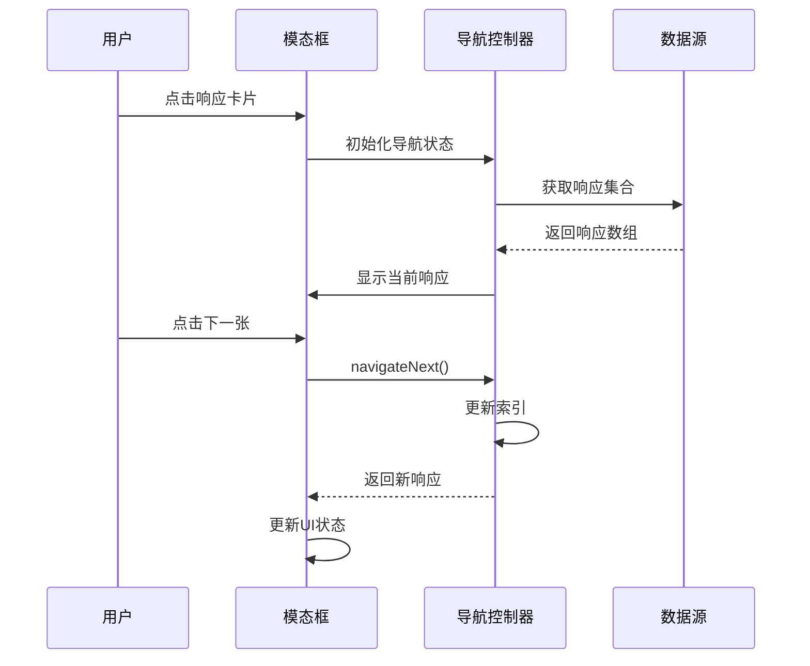
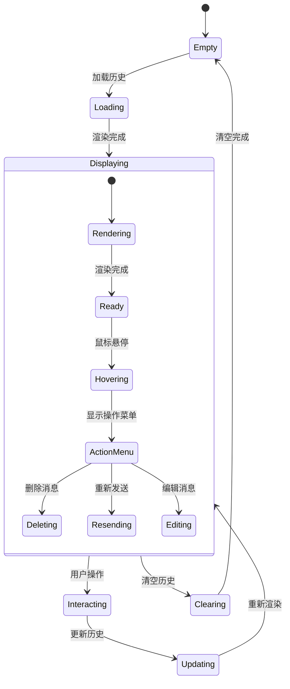
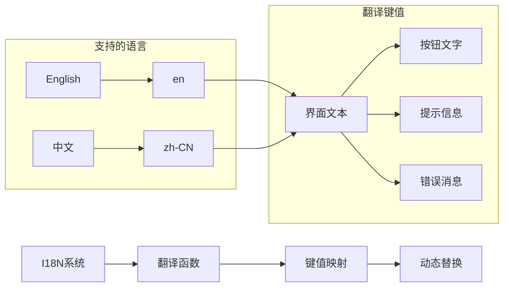
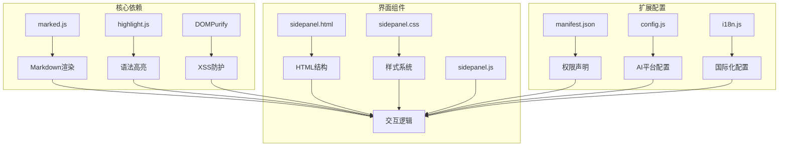

# 侧边栏界面系统

<cite>
**本文档引用的文件**
- [sidepanel.html](file://src/sidepanel/sidepanel.html)
- [sidepanel.css](file://src/sidepanel/sidepanel.css)
- [sidepanel.js](file://src/sidepanel/sidepanel.js)
- [config.js](file://src/config.js)
- [i18n.js](file://src/i18n.js)
- [manifest.json](file://manifest.json)
- [marked.min.js](file://src/lib/marked.min.js)
- [highlight-all.min.js](file://src/lib/highlight-all.min.js)
- [purify.min.js](file://src/lib/purify.min.js)
</cite>

## 目录
1. [简介](#简介)
2. [项目结构](#项目结构)
3. [核心组件](#核心组件)
4. [架构概览](#架构概览)
5. [详细组件分析](#详细组件分析)
6. [依赖关系分析](#依赖关系分析)
7. [性能考虑](#性能考虑)
8. [故障排除指南](#故障排除指南)
9. [结论](#结论)

## 简介

AI多重宇宙对话扩展的侧边栏界面系统是一个功能完整的多AI平台对话管理界面。该系统支持同时与多个AI平台（Gemini、Grok、Kimi、DeepSeek、ChatGPT、Qwen、Yuanbao）进行交互，提供响应显示面板、文件上传处理、主题切换、模态对话框等核心功能。

## 项目结构

侧边栏界面系统采用模块化设计，主要包含以下核心文件：

**图表来源**
- [sidepanel.html](file://src/sidepanel/sidepanel.html#L1-L400)
- [sidepanel.css](file://src/sidepanel/sidepanel.css#L1-L800)
- [sidepanel.js](file://src/sidepanel/sidepanel.js#L1-L800)

**章节来源**
- [sidepanel.html](file://src/sidepanel/sidepanel.html#L1-L400)
- [sidepanel.css](file://src/sidepanel/sidepanel.css#L1-L800)
- [sidepanel.js](file://src/sidepanel/sidepanel.js#L1-L800)

## 核心组件

### 主题系统架构

侧边栏界面采用CSS变量驱动的主题系统，支持暗色和亮色两种主题模式：

**图表来源**
- [sidepanel.css](file://src/sidepanel/sidepanel.css#L1-L100)
- [sidepanel.js](file://src/sidepanel/sidepanel.js#L344-L346)

### 响应显示面板

响应显示面板采用网格布局，支持动态渲染多个AI平台的回复内容：

**图表来源**
- [sidepanel.js](file://src/sidepanel/sidepanel.js#L65-L123)
- [sidepanel.js](file://src/sidepanel/sidepanel.js#L140-L187)

**章节来源**
- [sidepanel.css](file://src/sidepanel/sidepanel.css#L1-L800)
- [sidepanel.js](file://src/sidepanel/sidepanel.js#L65-L187)

## 架构概览

侧边栏界面系统采用分层架构设计，各层职责明确：

**图表来源**
- [sidepanel.html](file://src/sidepanel/sidepanel.html#L1-L400)
- [sidepanel.css](file://src/sidepanel/sidepanel.css#L1-L800)
- [sidepanel.js](file://src/sidepanel/sidepanel.js#L1-L800)
- [config.js](file://src/config.js#L1-L204)
- [i18n.js](file://src/i18n.js#L1-L504)

## 详细组件分析

### 文件上传处理系统

文件上传系统支持拖拽上传、文件类型验证和进度管理：

**图表来源**
- [sidepanel.js](file://src/sidepanel/sidepanel.js#L465-L495)
- [sidepanel.js](file://src/sidepanel/sidepanel.js#L414-L462)

#### 文件验证规则

系统支持多种文件类型，具有严格的验证机制：

| 文件类型 | 支持的扩展名 | 大小限制 | 平台兼容性 |
|---------|-------------|----------|-----------|
| 图片 | .jpg, .jpeg, .png, .gif | 10MB | 所有平台 |
| 文档 | .pdf, .txt, .doc, .docx | 10MB | 多数平台 |
| 代码 | .js, .py, .java, .cpp | 10MB | 支持代码高亮 |
| 数据 | .json, .csv, .xlsx | 10MB | 数据分析平台 |

**章节来源**
- [sidepanel.js](file://src/sidepanel/sidepanel.js#L414-L495)

### 模态对话框交互设计

模态对话框系统提供了丰富的交互功能：

**图表来源**
- [sidepanel.js](file://src/sidepanel/sidepanel.js#L530-L651)
- [sidepanel.js](file://src/sidepanel/sidepanel.js#L712-L809)

#### 模态导航控制器

导航控制器实现了循环导航和状态管理：

**图表来源**
- [sidepanel.js](file://src/sidepanel/sidepanel.js#L654-L711)
- [sidepanel.js](file://src/sidepanel/sidepanel.js#L712-L809)

**章节来源**
- [sidepanel.js](file://src/sidepanel/sidepanel.js#L530-L809)

### 历史记录管理系统

历史记录管理系统实现了消息历史的存储、检索和展示：

**图表来源**
- [sidepanel.js](file://src/sidepanel/sidepanel.js#L337-L342)

#### 历史记录数据结构

历史记录采用结构化的数据存储方式：

| 字段名 | 类型 | 描述 | 示例值 |
|--------|------|------|--------|
| id | string | 消息唯一标识 | "msg_123456" |
| type | enum | 消息类型 | "user" 或 "ai" |
| content | string | 消息内容 | "你好，有什么可以帮助你的？" |
| provider | string | AI平台标识 | "gemini" |
| timestamp | number | 时间戳 | 1640995200000 |
| status | string | 处理状态 | "completed" |
| metadata | object | 元数据信息 | {length: 100, files: []} |

**章节来源**
- [sidepanel.js](file://src/sidepanel/sidepanel.js#L337-L342)

### 国际化系统

国际化系统支持英文和中文双语界面：

**图表来源**
- [i18n.js](file://src/i18n.js#L6-L346)
- [i18n.js](file://src/i18n.js#L355-L383)

**章节来源**
- [i18n.js](file://src/i18n.js#L1-L504)

## 依赖关系分析

侧边栏界面系统依赖于多个第三方库和扩展配置：

**图表来源**
- [manifest.json](file://manifest.json#L1-L79)
- [config.js](file://src/config.js#L1-L204)
- [i18n.js](file://src/i18n.js#L1-L504)
- [sidepanel.js](file://src/sidepanel/sidepanel.js#L1-L800)

### 第三方库集成

系统集成了多个高质量的第三方库：

| 库名称 | 版本 | 功能 | 用途 |
|--------|------|------|------|
| marked.js | 11.1.1 | Markdown解析 | 文本渲染 |
| highlight.js | 11.9.0 | 语法高亮 | 代码块美化 |
| DOMPurify | 3.0.8 | HTML清理 | XSS防护 |
| GitHub Markdown CSS |  | 样式模板 | 代码块样式 |

**章节来源**
- [manifest.json](file://manifest.json#L1-L79)
- [config.js](file://src/config.js#L1-L204)
- [i18n.js](file://src/i18n.js#L1-L504)

## 性能考虑

侧边栏界面系统在设计时充分考虑了性能优化：

### 渲染优化策略

1. **虚拟滚动**: 对于大量历史记录，采用虚拟滚动技术减少DOM节点数量
2. **懒加载**: 图片和长内容采用懒加载机制
3. **防抖处理**: 输入框和搜索功能使用防抖优化
4. **内存管理**: 及时清理不再使用的DOM元素和事件监听器

### 资源加载优化

1. **按需加载**: 第三方库仅在需要时加载
2. **缓存策略**: 本地存储常用配置和主题设置
3. **压缩资源**: 所有静态资源经过压缩处理
4. **CDN加速**: 外部依赖通过CDN加载

## 故障排除指南

### 常见问题及解决方案

| 问题类型 | 症状 | 可能原因 | 解决方案 |
|----------|------|----------|----------|
| 主题切换失效 | 界面颜色不变化 | CSS变量未正确更新 | 检查data-theme属性和CSS变量 |
| 响应显示异常 | Markdown渲染错误 | marked.js加载失败 | 确认marked.js正确加载 |
| 文件上传失败 | 无法选择或上传文件 | 权限不足或文件类型不支持 | 检查文件类型和权限设置 |
| 模态框无法关闭 | 点击无效或遮罩层不消失 | 事件绑定错误 | 检查事件监听器和DOM结构 |

### 调试技巧

1. **控制台检查**: 使用浏览器开发者工具查看JavaScript错误
2. **网络监控**: 检查文件上传和API请求状态
3. **内存分析**: 监控内存使用情况，防止内存泄漏
4. **性能分析**: 使用性能面板分析渲染性能瓶颈

**章节来源**
- [sidepanel.js](file://src/sidepanel/sidepanel.js#L497-L506)

## 结论

AI多重宇宙对话扩展的侧边栏界面系统是一个设计精良、功能完整的用户界面解决方案。系统采用了现代化的前端技术栈，实现了高度的模块化和可维护性。

### 主要优势

1. **模块化设计**: 清晰的组件分离和职责划分
2. **响应式布局**: 适配不同屏幕尺寸和设备
3. **性能优化**: 采用多种优化策略确保流畅体验
4. **安全性**: 完善的XSS防护和输入验证
5. **可扩展性**: 易于添加新功能和AI平台支持

### 技术亮点

- **CSS变量驱动的主题系统**提供了灵活的主题切换能力
- **Markdown渲染引擎**支持丰富的文本格式化
- **拖拽上传功能**提升了文件处理的用户体验
- **模态导航系统**实现了复杂的多响应管理
- **国际化支持**满足全球化使用需求

该系统为AI多重宇宙对话扩展提供了强大而优雅的用户界面基础，为后续的功能扩展和优化奠定了坚实的技术基础。