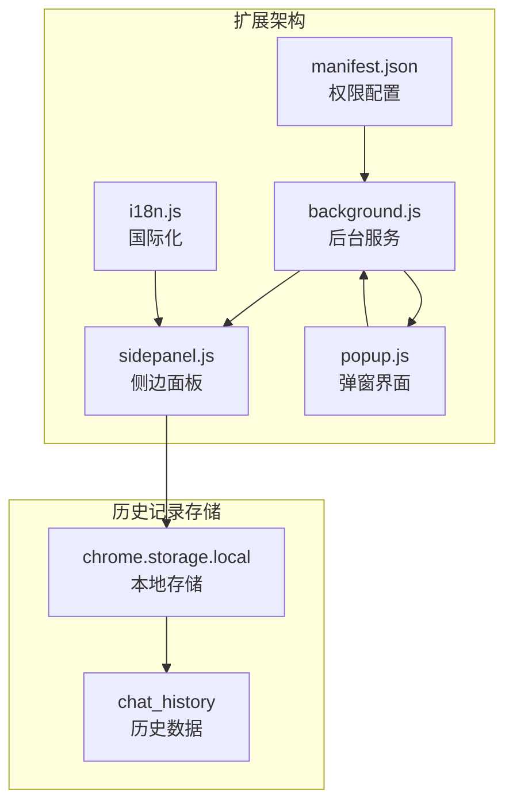
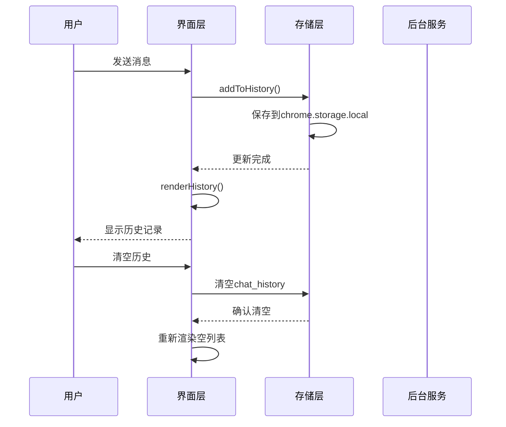
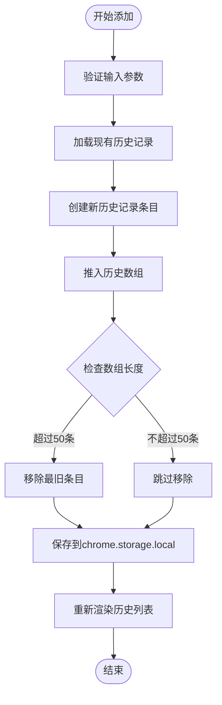
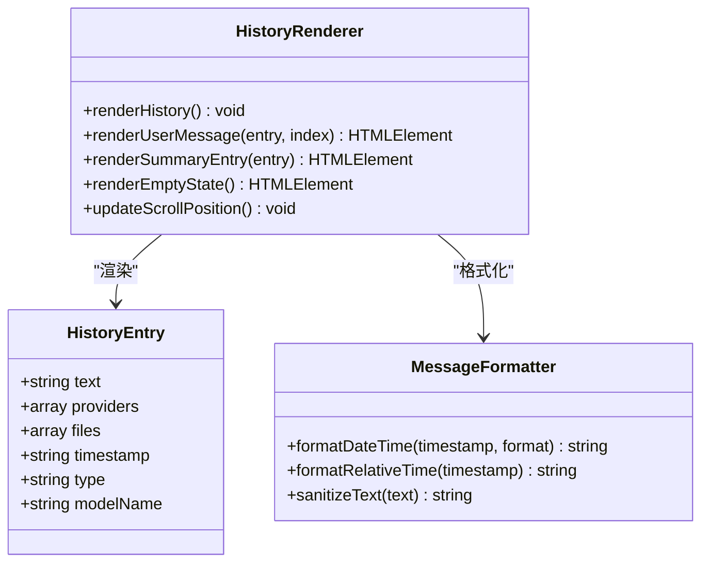
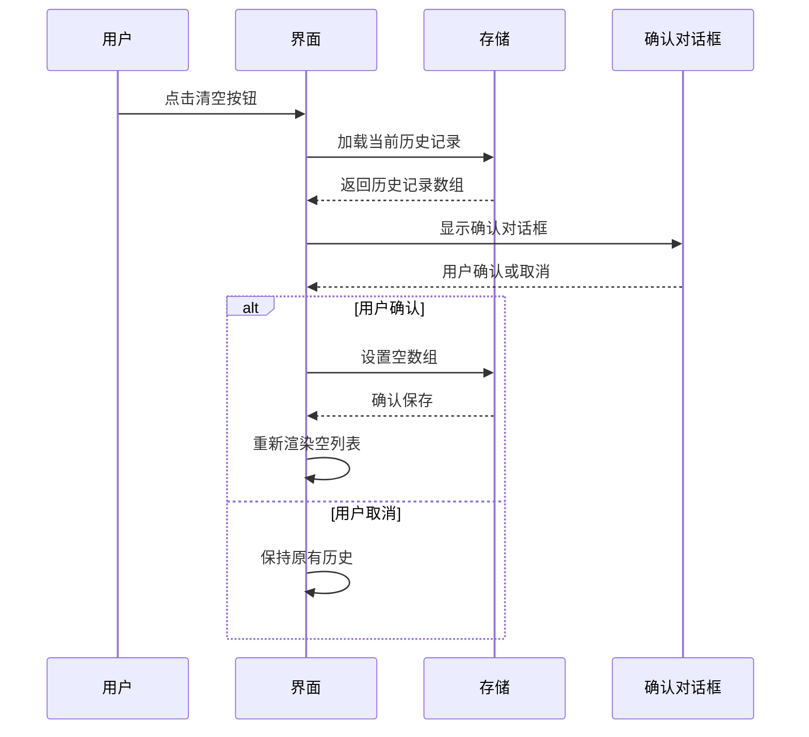
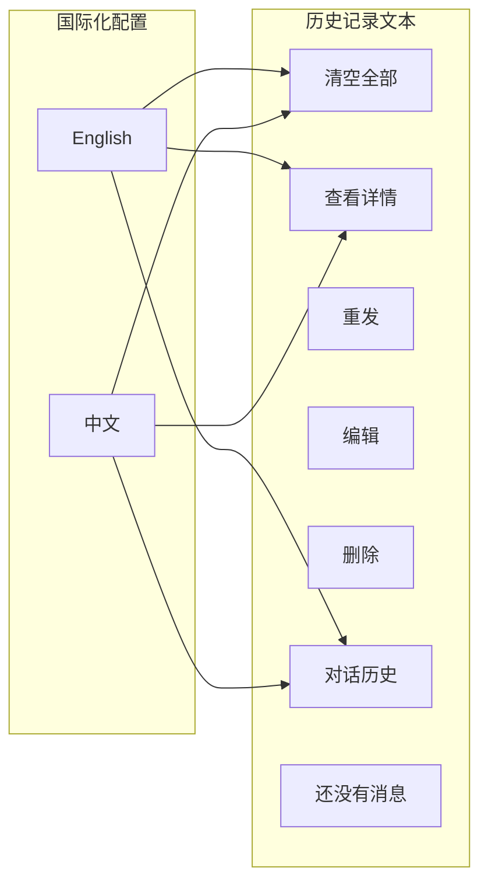
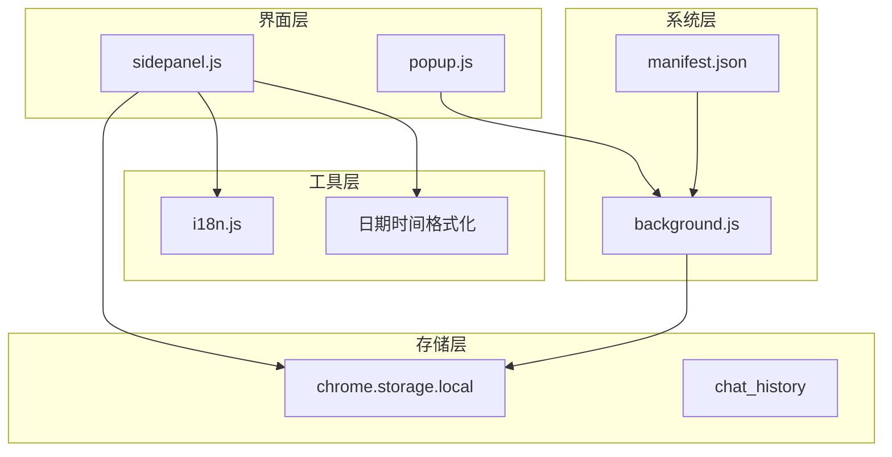
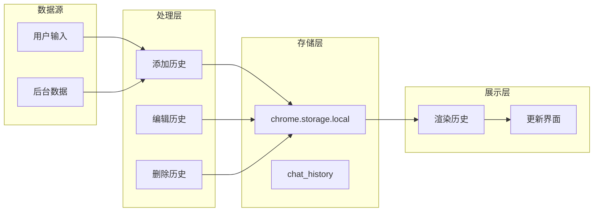

# 历史记录管理系统

<cite>
**本文档引用的文件**
- [src/sidepanel/sidepanel.js](file://src/sidepanel/sidepanel.js)
- [src/background.js](file://src/background.js)
- [src/i18n.js](file://src/i18n.js)
- [manifest.json](file://manifest.json)
- [src/popup/popup.js](file://src/popup/popup.js)
</cite>

## 目录
1. [简介](#简介)
2. [项目结构](#项目结构)
3. [核心组件](#核心组件)
4. [架构概览](#架构概览)
5. [详细组件分析](#详细组件分析)
6. [依赖关系分析](#依赖关系分析)
7. [性能考虑](#性能考虑)
8. [故障排除指南](#故障排除指南)
9. [结论](#结论)

## 简介

历史记录管理系统是AI多宇宙扩展程序的核心功能模块，负责管理用户的对话历史、提供历史记录的本地持久化存储、动态渲染以及安全的清理功能。该系统采用Chrome扩展架构，通过chrome.storage.local实现数据持久化，支持多语言国际化，并提供了完整的CRUD操作接口。

## 项目结构

该历史记录管理系统位于AI多宇宙扩展程序的前端界面中，主要包含以下关键文件：



**图表来源**
- [manifest.json](file://manifest.json#L12-L18)
- [src/background.js](file://src/background.js#L1-L50)
- [src/sidepanel/sidepanel.js](file://src/sidepanel/sidepanel.js#L1409-L1421)

**章节来源**
- [manifest.json](file://manifest.json#L1-L79)
- [src/background.js](file://src/background.js#L1-L100)

## 核心组件

### 历史记录数据结构

系统采用统一的历史记录数据结构，支持普通对话消息和AI总结两种类型：

```mermaid
erDiagram
HISTORY_ENTRY {
string text
array providers
array files
string timestamp
string type
string modelName
}
USER_MESSAGE {
string text
array providers
array files
string timestamp
string type = "user"
}
SUMMARY_ENTRY {
string text
string modelName
string timestamp
string type = "summary"
}
HISTORY_ENTRY ||--|| USER_MESSAGE : "继承"
HISTORY_ENTRY ||--|| SUMMARY_ENTRY : "继承"
```

**图表来源**
- [src/sidepanel/sidepanel.js](file://src/sidepanel/sidepanel.js#L1412-L1417)
- [src/sidepanel/sidepanel.js](file://src/sidepanel/sidepanel.js#L2778-L2783)

### 存储机制

系统使用Chrome扩展的本地存储API实现历史记录的持久化：

- **存储位置**: `chrome.storage.local`
- **存储键名**: `chat_history`
- **容量限制**: 自动维护50条记录上限
- **数据格式**: JSON序列化的数组

**章节来源**
- [src/sidepanel/sidepanel.js](file://src/sidepanel/sidepanel.js#L1409-L1421)
- [src/sidepanel/sidepanel.js](file://src/sidepanel/sidepanel.js#L2775-L2787)

## 架构概览

历史记录管理系统采用分层架构设计，确保数据流的清晰性和可维护性：



**图表来源**
- [src/sidepanel/sidepanel.js](file://src/sidepanel/sidepanel.js#L1378-L1421)
- [src/sidepanel/sidepanel.js](file://src/sidepanel/sidepanel.js#L1292-L1310)

## 详细组件分析

### 历史记录存储组件

#### 添加历史记录功能



**图表来源**
- [src/sidepanel/sidepanel.js](file://src/sidepanel/sidepanel.js#L1409-L1421)

#### 历史记录渲染组件

历史记录渲染采用动态生成的方式，支持不同类型的消息：



**图表来源**
- [src/sidepanel/sidepanel.js](file://src/sidepanel/sidepanel.js#L1423-L1567)
- [src/i18n.js](file://src/i18n.js#L425-L488)

**章节来源**
- [src/sidepanel/sidepanel.js](file://src/sidepanel/sidepanel.js#L1423-L1567)
- [src/i18n.js](file://src/i18n.js#L425-L488)

### 历史记录管理组件

#### 清空历史记录功能

清空历史记录功能实现了安全的确认机制：



**图表来源**
- [src/sidepanel/sidepanel.js](file://src/sidepanel/sidepanel.js#L1292-L1310)

#### 单条消息管理

系统支持对单条历史记录进行完整的CRUD操作：

| 操作 | 方法 | 功能描述 |
|------|------|----------|
| 读取 | `renderHistory()` | 动态渲染所有历史记录 |
| 创建 | `addToHistory()` | 添加新的对话记录 |
| 更新 | `editMessage()` | 编辑现有消息内容 |
| 删除 | `deleteMessage()` | 删除指定历史记录 |

**章节来源**
- [src/sidepanel/sidepanel.js](file://src/sidepanel/sidepanel.js#L1662-L1691)

### 国际化支持

系统提供完整的多语言支持，包括历史记录相关的所有文本：



**图表来源**
- [src/i18n.js](file://src/i18n.js#L19-L36)
- [src/i18n.js](file://src/i18n.js#L189-L207)

**章节来源**
- [src/i18n.js](file://src/i18n.js#L1-L504)

## 依赖关系分析

### 组件耦合度

历史记录管理系统具有良好的模块化设计，各组件之间的耦合度较低：



**图表来源**
- [src/sidepanel/sidepanel.js](file://src/sidepanel/sidepanel.js#L1-L50)
- [src/background.js](file://src/background.js#L1-L50)
- [manifest.json](file://manifest.json#L12-L18)

### 数据流分析

历史记录的数据流遵循单向数据绑定原则：



**图表来源**
- [src/sidepanel/sidepanel.js](file://src/sidepanel/sidepanel.js#L1409-L1421)
- [src/sidepanel/sidepanel.js](file://src/sidepanel/sidepanel.js#L1662-L1691)

**章节来源**
- [src/sidepanel/sidepanel.js](file://src/sidepanel/sidepanel.js#L1409-L1691)

## 性能考虑

### 存储优化

系统采用了多项性能优化措施：

1. **容量限制**: 自动维护50条记录上限，防止存储空间无限增长
2. **增量更新**: 仅在必要时重新渲染历史列表
3. **异步操作**: 所有存储操作都是异步的，不影响用户体验
4. **内存管理**: 及时清理不需要的DOM元素和事件监听器

### 渲染优化

历史记录渲染采用了虚拟滚动和懒加载技术：

- **延迟渲染**: 新消息添加时才触发渲染
- **批量更新**: 多条消息同时更新时进行批量DOM操作
- **滚动优化**: 自动滚动到底部，但避免频繁的滚动计算

## 故障排除指南

### 常见问题及解决方案

#### 历史记录无法保存

**问题症状**: 用户发送消息后，历史记录没有显示

**可能原因**:
1. Chrome存储权限问题
2. 存储空间不足
3. 数据格式异常

**解决步骤**:
1. 检查扩展权限配置
2. 清理浏览器缓存
3. 重启浏览器扩展

#### 历史记录显示乱码

**问题症状**: 历史记录中的中文显示为乱码

**解决方法**:
1. 确认使用正确的编码格式
2. 检查国际化配置是否正确加载
3. 刷新页面重新加载资源

#### 清空历史记录无效

**问题症状**: 点击清空按钮后历史记录仍然存在

**排查步骤**:
1. 检查确认对话框是否正常显示
2. 验证chrome.storage.local的写入权限
3. 查看控制台是否有错误信息

**章节来源**
- [src/sidepanel/sidepanel.js](file://src/sidepanel/sidepanel.js#L1292-L1310)
- [src/i18n.js](file://src/i18n.js#L355-L383)

## 结论

历史记录管理系统是一个设计精良的模块化组件，具有以下特点：

1. **可靠性**: 采用Chrome扩展的标准存储API，确保数据持久性和安全性
2. **可扩展性**: 模块化设计便于功能扩展和维护
3. **用户体验**: 提供流畅的交互体验和完善的错误处理机制
4. **国际化**: 支持多语言，适应全球化使用需求

该系统为AI多宇宙扩展程序提供了坚实的历史记录基础，为用户提供了完整的对话历史管理和分析能力。通过合理的架构设计和性能优化，系统能够稳定地处理大量历史数据，为用户提供可靠的使用体验。