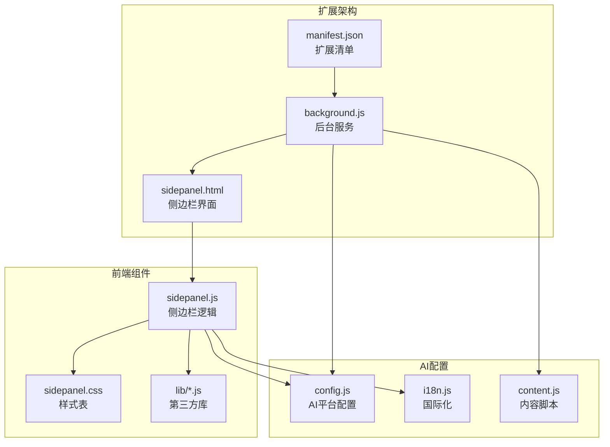
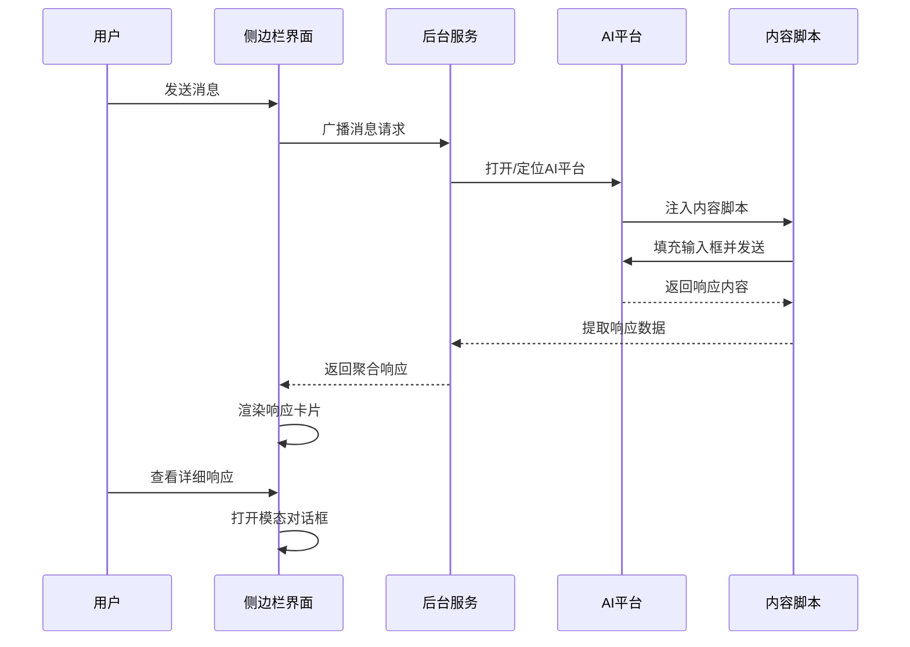
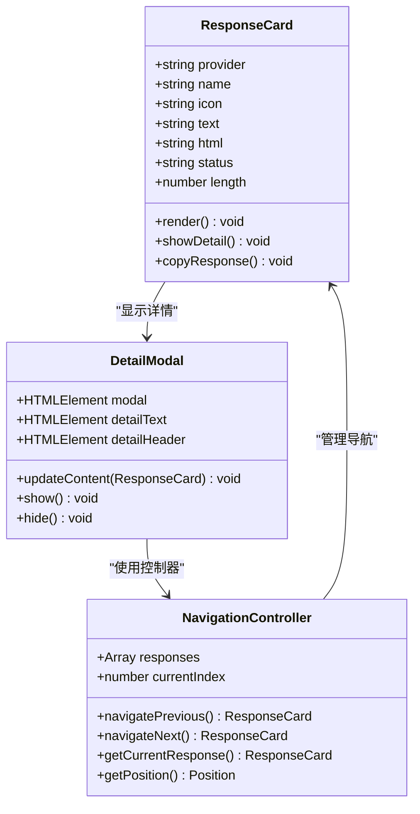
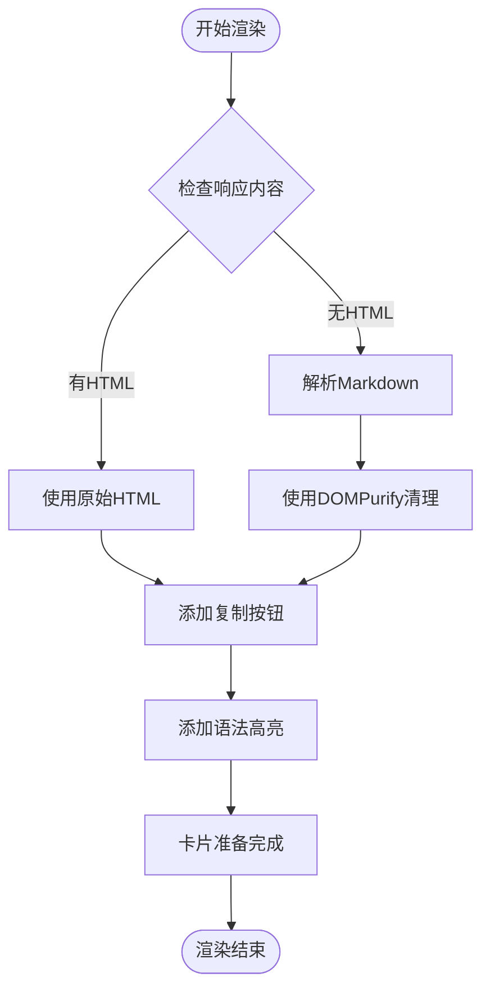
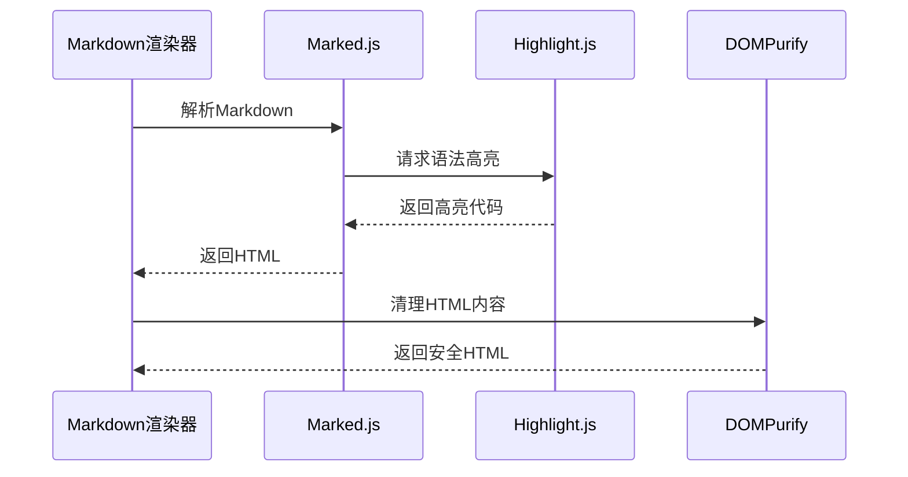
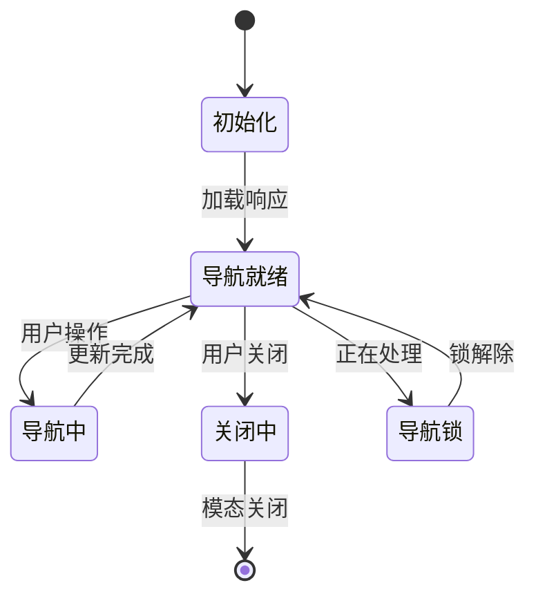
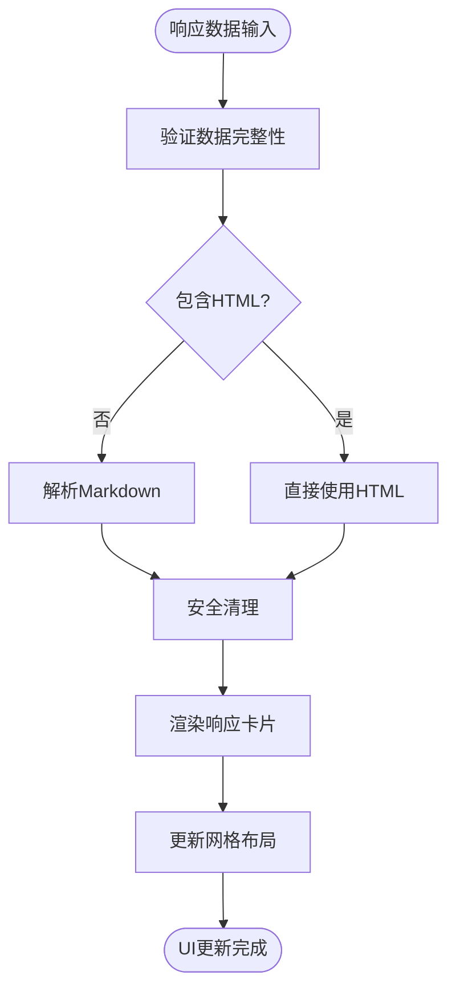
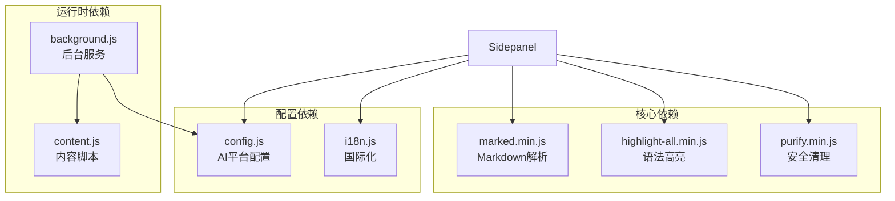

# 响应显示系统

<cite>
**本文档引用的文件**
- [sidepanel.js](file://src/sidepanel/sidepanel.js)
- [sidepanel.html](file://src/sidepanel/sidepanel.html)
- [sidepanel.css](file://src/sidepanel/sidepanel.css)
- [background.js](file://src/background.js)
- [config.js](file://src/config.js)
- [i18n.js](file://src/i18n.js)
- [content.js](file://src/content/content.js)
- [marked.min.js](file://src/lib/marked.min.js)
- [purify.min.js](file://src/lib/purify.min.js)
- [manifest.json](file://manifest.json)
</cite>

## 目录
1. [项目概述](#项目概述)
2. [项目结构](#项目结构)
3. [核心组件](#核心组件)
4. [架构概览](#架构概览)
5. [详细组件分析](#详细组件分析)
6. [依赖关系分析](#依赖关系分析)
7. [性能考虑](#性能考虑)
8. [故障排除指南](#故障排除指南)
9. [结论](#结论)

## 项目概述

AI Multiverse 响应显示系统是一个多AI平台集成的浏览器扩展，专门设计用于同时与多个AI聊天平台交互并展示响应内容。该系统的核心功能包括：

- **多平台响应聚合**：同时从Gemini、Grok、Kimi、DeepSeek、ChatGPT、Qwen、Yuanbao等多个AI平台获取响应
- **智能响应渲染**：将AI响应内容转换为美观的HTML格式，支持Markdown语法和代码高亮
- **响应式网格布局**：根据屏幕尺寸自动调整响应卡片的排列方式
- **模态对话框导航**：提供丰富的响应浏览体验，包括键盘导航、触摸手势支持
- **安全内容过滤**：使用DOMPurify防止XSS攻击和恶意内容注入

## 项目结构



**图表来源**
- [manifest.json](file://manifest.json#L1-L79)
- [background.js](file://src/background.js#L1-L100)
- [sidepanel.js](file://src/sidepanel/sidepanel.js#L1-L100)

**章节来源**
- [manifest.json](file://manifest.json#L1-L79)
- [sidepanel.html](file://src/sidepanel/sidepanel.html#L1-L50)

## 核心组件

### 响应卡片系统

响应卡片是系统的核心UI组件，负责展示单个AI平台的响应内容。每个卡片包含以下关键元素：

- **平台标识**：显示AI平台的图标和名称
- **内容预览**：显示响应内容的摘要，支持截断显示
- **字符计数**：显示响应内容的长度
- **交互功能**：点击进入详细模态对话框

### Markdown渲染引擎

系统集成了强大的Markdown渲染能力，支持：

- **语法高亮**：使用Highlight.js为代码块提供语法着色
- **安全渲染**：使用DOMPurify进行HTML内容清理
- **自动语言检测**：智能识别代码语言并应用相应的语法高亮

### 模态对话框导航

提供完整的响应浏览体验：

- **左右导航箭头**：鼠标点击或键盘方向键导航
- **位置指示器**：显示当前响应在序列中的位置
- **拖拽调整**：支持调整模态对话框的宽度
- **复制功能**：一键复制当前响应内容

**章节来源**
- [sidepanel.js](file://src/sidepanel/sidepanel.js#L65-L135)
- [sidepanel.css](file://src/sidepanel/sidepanel.css#L820-L920)

## 架构概览



**图表来源**
- [background.js](file://src/background.js#L138-L197)
- [sidepanel.js](file://src/sidepanel/sidepanel.js#L1343-L1407)

## 详细组件分析

### 响应卡片设计架构

响应卡片采用现代化的设计理念，结合了视觉美感和功能性：



**图表来源**
- [sidepanel.js](file://src/sidepanel/sidepanel.js#L712-L815)
- [sidepanel.js](file://src/sidepanel/sidepanel.js#L530-L633)

#### 响应卡片渲染流程



**图表来源**
- [sidepanel.js](file://src/sidepanel/sidepanel.js#L70-L123)

**章节来源**
- [sidepanel.js](file://src/sidepanel/sidepanel.js#L70-L135)
- [sidepanel.css](file://src/sidepanel/sidepanel.css#L820-L920)

### Markdown内容实时渲染

系统实现了高效的Markdown到HTML的实时转换机制：

#### Markdown配置选项

| 选项 | 值 | 描述 |
|------|-----|------|
| breaks | true | 自动换行支持 |
| gfm | true | GitHub Flavored Markdown |
| pedantic | false | 严格模式关闭 |
| sanitize | false | 默认不清理，使用DOMPurify |

#### 语法高亮集成

系统使用Highlight.js提供代码语法高亮功能：



**图表来源**
- [sidepanel.js](file://src/sidepanel/sidepanel.js#L6-L39)
- [sidepanel.js](file://src/sidepanel/sidepanel.js#L70-L123)

**章节来源**
- [sidepanel.js](file://src/sidepanel/sidepanel.js#L6-L39)
- [sidepanel.js](file://src/sidepanel/sidepanel.js#L70-L123)

### 响应网格布局响应式设计

系统实现了灵活的响应式网格布局，能够根据屏幕尺寸自动调整：

#### 布局模式

| 模式 | 断点 | 特性 |
|------|------|------|
| 默认布局 | < 900px | 卡片垂直堆叠，最大宽度280px |
| 宽屏布局 | ≥ 900px | 卡片水平排列，充满可用空间 |

#### CSS Grid实现

```css
.responses-grid {
    display: flex;
    gap: 20px;
    overflow: visible;
    flex-wrap: wrap;
    align-content: flex-start;
}

.responses-grid.wide-layout {
    flex-wrap: nowrap;
    align-items: stretch;
    align-content: stretch;
}

.response-card {
    flex: 1 1 280px;
    max-width: 450px;
}
```

**章节来源**
- [sidepanel.css](file://src/sidepanel/sidepanel.css#L803-L855)

### 模态对话框导航系统

模态对话框提供了丰富的导航功能和用户体验：

#### 导航控制

| 控制方式 | 功能 | 快捷键支持 |
|----------|------|------------|
| 左右箭头 | 切换响应 | ← → 方向键 |
| 位置指示器 | 显示当前位置 | 数字显示 |
| 拖拽调整 | 调整对话框大小 | 鼠标拖拽 |
| 复制功能 | 复制响应内容 | 点击按钮 |

#### 导航状态管理



**图表来源**
- [sidepanel.js](file://src/sidepanel/sidepanel.js#L654-L710)
- [sidepanel.js](file://src/sidepanel/sidepanel.js#L925-L954)

**章节来源**
- [sidepanel.js](file://src/sidepanel/sidepanel.js#L817-L954)

### 安全过滤机制

系统实施了多层次的安全防护措施：

#### DOMPurify配置

系统使用DOMPurify进行HTML内容清理，配置了严格的白名单：

```javascript
DOMPurify.sanitize(html, {
    ALLOWED_TAGS: ['h1', 'h2', 'h3', 'h4', 'h5', 'h6', 'p', 'br', 'strong', 
                   'em', 'code', 'pre', 'a', 'ul', 'ol', 'li', 'blockquote',
                   'table', 'thead', 'tbody', 'tr', 'th', 'td', 'hr', 'img',
                   'span', 'div', 'del', 'ins', 'sup', 'sub',
                   'svg', 'path', 'circle', 'rect', 'line', 'polyline', 'polygon',
                   'g', 'defs', 'marker', 'clipPath', 'linearGradient', 'radialGradient',
                   'stop', 'title', 'desc', 'text', 'tspan'],
    ALLOWED_ATTR: ['href', 'src', 'alt', 'title', 'class', 'id', 'target', 'rel', 'style',
                   'width', 'height', 'viewBox', 'fill', 'stroke', 'stroke-width',
                   'stroke-linecap', 'stroke-linejoin', 'd', 'cx', 'cy', 'r',
                   'x', 'y', 'rx', 'ry', 'points', 'transform', 'opacity',
                   'x1', 'y1', 'x2', 'y2', 'marker-start', 'marker-end',
                   'gradientTransform', 'gradientUnits', 'spreadMethod',
                   'stop-color', 'stop-opacity', 'offset', 'xlink:href']
});
```

#### XSS防护策略

1. **输入验证**：所有用户输入和外部数据都经过验证
2. **输出编码**：敏感字符在渲染前进行HTML转义
3. **内容清理**：使用DOMPurify清理可能包含恶意脚本的HTML
4. **CSP策略**：实施内容安全策略限制脚本执行

**章节来源**
- [sidepanel.js](file://src/sidepanel/sidepanel.js#L95-L123)
- [purify.min.js](file://src/lib/purify.min.js#L1-L4)

### 响应数据结构化处理

系统实现了完整的响应数据处理流程：

#### 数据结构定义

| 字段 | 类型 | 描述 | 示例 |
|------|------|------|------|
| provider | string | AI平台标识 | "gemini" |
| name | string | 平台显示名称 | "Gemini" |
| icon | string | 平台图标路径 | "icons/gemini.svg" |
| text | string | 原始文本内容 | "这是一个AI响应" |
| html | string | HTML格式内容 | "<p>这是一个AI响应</p>" |
| status | string | 响应状态 | "ok" |
| length | number | 内容长度 | 150 |

#### UI更新流程



**图表来源**
- [sidepanel.js](file://src/sidepanel/sidepanel.js#L535-L573)
- [sidepanel.js](file://src/sidepanel/sidepanel.js#L823-L864)

**章节来源**
- [sidepanel.js](file://src/sidepanel/sidepanel.js#L535-L573)
- [sidepanel.js](file://src/sidepanel/sidepanel.js#L823-L864)

## 依赖关系分析



**图表来源**
- [sidepanel.html](file://src/sidepanel/sidepanel.html#L392-L397)
- [manifest.json](file://manifest.json#L45-L68)

**章节来源**
- [sidepanel.html](file://src/sidepanel/sidepanel.html#L392-L397)
- [manifest.json](file://manifest.json#L45-L68)

## 性能考虑

### 渲染优化

1. **虚拟滚动**：对于大量响应内容，系统采用虚拟滚动技术减少DOM节点数量
2. **懒加载**：图片和长内容采用懒加载策略
3. **缓存机制**：已渲染的内容进行缓存，避免重复计算

### 内存管理

1. **对象池**：复用DOM元素和JavaScript对象
2. **垃圾回收**：及时清理不再使用的事件监听器和定时器
3. **内存监控**：定期检查内存使用情况，防止内存泄漏

### 网络优化

1. **并发处理**：同时从多个AI平台获取响应，提高整体效率
2. **连接复用**：复用现有的浏览器连接，减少建立新连接的开销
3. **数据压缩**：传输过程中对响应内容进行压缩

## 故障排除指南

### 常见问题及解决方案

#### Markdown渲染失败

**症状**：响应内容显示为纯文本，无格式化

**原因分析**：
1. Marked.js库加载失败
2. Highlight.js初始化异常
3. DOMPurify配置错误

**解决步骤**：
1. 检查网络连接是否正常
2. 验证第三方库文件完整性
3. 查看浏览器控制台错误信息

#### 响应卡片不显示

**症状**：侧边栏空白或只显示加载状态

**排查步骤**：
1. 确认AI平台页面已正确加载
2. 检查内容脚本注入是否成功
3. 验证响应提取功能是否正常工作

#### 模态对话框无法打开

**症状**：点击响应卡片无反应

**解决方法**：
1. 检查JavaScript错误日志
2. 验证模态对话框CSS样式
3. 确认事件监听器绑定正常

**章节来源**
- [sidepanel.js](file://src/sidepanel/sidepanel.js#L41-L44)
- [sidepanel.js](file://src/sidepanel/sidepanel.js#L1198-L1210)

## 结论

AI Multiverse响应显示系统通过精心设计的架构和实现，成功地解决了多AI平台响应内容的统一展示问题。系统的主要优势包括：

1. **强大的渲染能力**：支持Markdown语法和代码高亮，提供丰富的视觉效果
2. **安全可靠**：实施多层次的安全防护，有效防止XSS攻击
3. **用户体验优秀**：提供流畅的响应式布局和直观的导航功能
4. **扩展性强**：模块化的架构设计便于添加新的AI平台支持

该系统为用户提供了统一的AI响应管理界面，显著提升了多AI平台使用体验。通过持续的优化和改进，系统将继续为用户提供更好的服务。